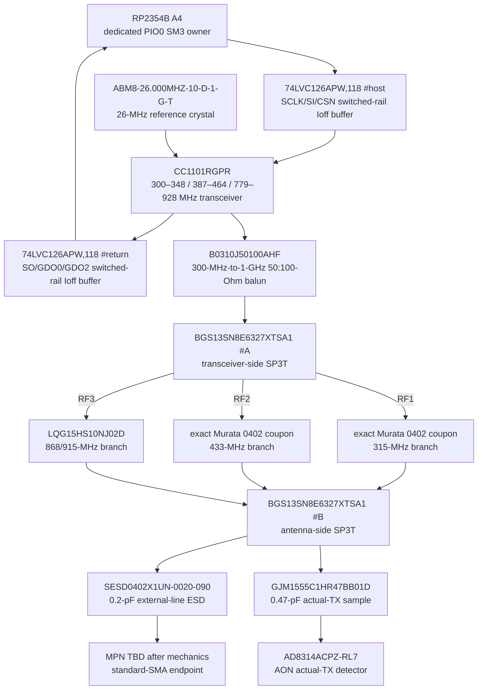

# CCRF-0001 — exact CC1101 three-band electrical endpoint

- Статус: **Проведено ревью paper subblock; conducted/HIL open**
- Finding: [`FND-0098`](../findings/FND-0098-cc1101-single-ended-band-switch-was-invalid.md)
- Решение: [`DEC-0093`](../decisions/DEC-0093-exact-cc1101-three-band-endpoint.md)
- Machine source: `hardware/architecture/devices.json`, `hardware/architecture/candidates/G2F-3I.json`

## Цель подблока

Закрыть реальными деталями путь от физических контактов `CC1101RGPR` до
защищённой 50-Ом границы одного внешнего standard-SMA, не выдавая first-pass
matching за измеренную серийную схему.

## Exact physical chain

| Function | Exact MPN / physical instances | Paper result |
|---|---|---|
| silicon | `CC1101RGPR` | every VQFN20 contact including EPAD is routed |
| host direction | `74LVC126APW,118` + 3×`ERJ-2RKF22R0X` | SCLK/SI/CSN disappear with switched power |
| return direction | second `74LVC126APW,118` + 3×`ERJ-2RKF22R0X` | SO/GDO0/GDO2 expose Ioff/high-Z while off |
| band control | `74LVC2G126DC,125`, 2×22 Ohm, six 10-kOhm defaults | P03/P04 can only reach the switches with CC power; `00` is isolation |
| clock | `ABM8-26.000MHZ-10-D-1-G-T`, 2×`GJM1555C1H150JB01D` | exact 26 MHz, 10-pF CL; two 15-pF loads include TI's typical 2.5-pF parasitic allowance |
| bias/power | `RC0402FR-0756KL`, six 100-nF local capacitors, 1-uF bulk | exact RBIAS, DCOUPL and each supply contact represented |
| balun | `B0310J50100AHF` | current 300–1000-MHz 50-to-100-Ohm first-pass part; imperfect balance/return loss remains a measured gate |
| branch isolation | 2×`BGS13SN8E6327XTSA1` | both ends of every unselected branch are disconnected |
| branch coupon | exact `LQG15HS*` + `GJM1555C1H*` populated values | reproduces a current real-device first target without claiming VNA closure |
| protection | `SESD0402X1UN-0020-090` | 0.2-pF typical, ±20-kV IEC contact/air part before the external boundary |
| evidence | `GJM1555C1HR47BB01D` + `AD8314ACPZ-RL7` + exact hold/filter/bypass | sample is after both switches and all populated matching; no 50-Ohm detector shunt loads the mainline |

## First-pass populated RF values

| Position | MPN | Role |
|---|---|---|
| differential series, 2 pcs | `GJM1555C1H101JB01D` | 100-pF RF_P/RF_N DC blocks |
| differential trim | `GJM1555C1HR60BB01D` | 0.6-pF across balanced feed |
| balun output | `LQG15HS3N3S02D`, `GJM1555C1H1R2BB01D`, `LQG15HS6N8J02D` | series/shunt/series match |
| 315 branch | 2×`LQG15HS10NJ02D`, `LQG15HS3N6S02D`, `GJM1555C1H8R0DB01D` | series–shunt-series first coupon |
| 433 branch | `GJM1555C1H100JB01D`, `LQG15HS15NJ02D`, `GJM1555C1H6R2DB01D` | shunt–series–shunt first coupon |
| 868/915 branch | `LQG15HS10NJ02D` | combined common-band first coupon |
| common output | `LQG15HS2N2S02D` | final series match before ESD/SMA/tap |

Unpopulated tuning footprints may exist later, but they are not phantom BOM
parts and are not merged into the physical-device diagram.

## Runtime and failure contract

1. With the CC rail off, set P03/P04 to the requested truth code.
2. Enable the STOP-qualified rail and wait for power/oscillator settling.
3. Read and validate CC1101 identity/configuration before RX or TX.
4. A TX lease names band, channel, profile, requested power, antenna identity
   and expiry. The selected branch and measured complete-feed loss are inputs.
5. During commanded TX, lack of matching AD8314 evidence is a fault. Inbound
   RF may conservatively delay quiet confirmation but can never create a lease.
6. To change bands, revoke the lease, force IDLE/RX-off, prove evidence quiet,
   stop PIO/DMA, remove CC power, change P03/P04 and restart from step 2.

## Remaining gates

- VNA tuning, return loss and complete-feed insertion loss for all three paths;
- min/max output, sensitivity, spurious and harmonics over voltage/temperature;
- AD8314 no-false-negative thresholds at every allowed power and band;
- strong-inbound false-positive behavior;
- legal channel/power/profile and labelled antenna/EIRP proof;
- coexistence/desense/no-stall HIL against every other signal group;
- mechanics-selected SMA connector MPN and enclosure return.

## Sources

- [TI CC1101 datasheet](https://www.ti.com/lit/ds/symlink/cc1101.pdf)
- [M5Stack U219 page](https://docs.m5stack.com/en/cap/Cap_CC1101)
- [M5Stack U219 V0.3 schematic](https://m5stack-doc.oss-cn-shenzhen.aliyuncs.com/1250/SCH_Cap_CC1101_SCH_V0.3_20260528.pdf)
- [Infineon BGS13SN8 datasheet](https://www.infineon.com/dgdl/Infineon-BGS13SN8-DataSheet-v02_04-EN.pdf?fileId=5546d462584d1d4a0158cf52e3ae03a7)
- [TTM B0310J50100AHF datasheet](https://cdn.ttm.com/repository/products/wireless-xinger/balun-transformers/B0310J50100AHF/B0310J50100AHF.pdf)
- [Analog Devices AD8314 datasheet](https://www.analog.com/media/en/technical-documentation/data-sheets/ad8314.pdf)
- [Littelfuse SESD datasheet](https://www.littelfuse.com/assetdocs/littelfuse-tvs-diode-array-sesd-ultra-low-capacitance-discrete-tvs-datasheet?assetguid=645e7b6b-8305-497f-b62b-24df676c444e)

