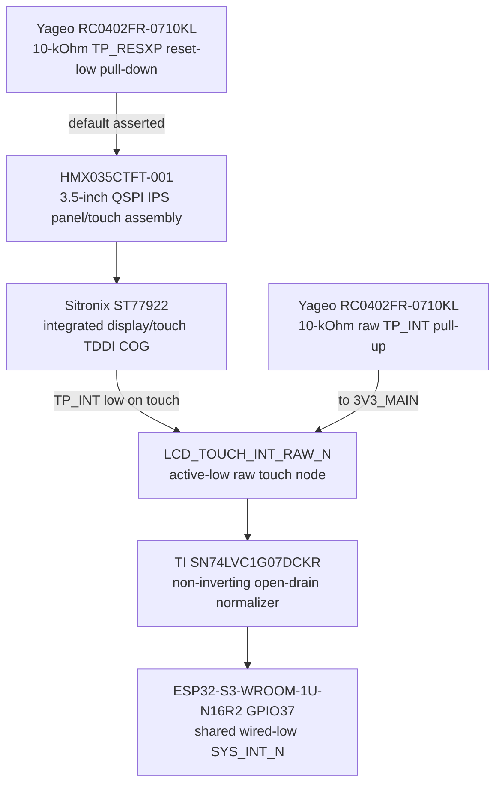

# DSP-0007 — exact integrated ST77922 touch endpoint

- Status: **Проведено ревью paper electrical endpoint**
- Finding: [`FND-0093`](../findings/FND-0093-touch-controller-identity-and-polarity-were-left-open.md)
- Decision: [`DEC-0088`](../decisions/DEC-0088-exact-integrated-touch-controller-and-irq.md)
- Machine source: [`G2F-3I.json`](../../../hardware/architecture/candidates/G2F-3I.json)

## Exact physical identity

`HMX035CTFT-001` is the exact display/touch assembly marking published by the
QDtech schematic. Inside that assembly, exact `Sitronix ST77922` is one COG
TDDI: the TFT controller, QSPI display driver and capacitive-touch controller
are not separate Leshy2 purchase lines. The panel assembly still requires
standalone sourcing, lifecycle and mechanical qualification; identifying its
integrated controller does not silently accept the panel for production.

The controller is fixed-function vendor-configured silicon inside the panel.
It is not another field-updatable Leshy2 processor and does not add a firmware
signing domain.

## Exact interface contract

| Function | Assembly contact | ST77922 die pad | Board endpoint |
|---|---:|---:|---|
| touch I2C SCL | 1 | 28 `TP_I2C_SCL` | S3 SYS_I2C, maximum 400 kHz |
| touch I2C SDA | 2 | 29 `TP_I2C_SDA` | S3 SYS_I2C, exact 7-bit address `0x38` |
| touch interrupt | 3 | 31 `TP_INT` | active-low raw node → fixed `SN74LVC1G07DCKR` → `SYS_INT_N`/S3 GPIO37 |
| touch reset | 4 | 49 `TP_RESXP` | TCA6424 P07, exact 10-kOhm reset-low default |
| display reset | 15 | 127 `RESX` | TCA6424 P06, exact 10-kOhm reset-low default |
| QSPI D1/D0/D2/D3 | 10/13/17/18 | 128/129/130/131 | direct S3 display path |
| QSPI clock/CS | 11/9 | 139/140 | direct S3 display path |
| mode IM2/IM1/IM0 | 40/39/38 | 144/145/146 | fixed low/high/low QSPI strap |
| tearing effect | 8 | 148 `TE` | deliberately open; no GPIO consumed |

VDDI, VDD and the three assembly ground contacts map to the documented
ST77922 supply/ground pad groups in the machine source. The grouped die-pad
lists are recorded for provenance; they do not imply that the host PCB can
reach individual COG pads.

## Interrupt and reset circuit

Each box names one physical assembly/component or one named net. The pull-up
is not drawn in series with TP_INT. `SN74LVC1G07DCKR` preserves active-low
polarity and presents an Ioff-capable open-drain source to the shared line.
There is no inverting population option.

Display reset is asserted for at least 10 us and is released at least 120 ms
before `Sleep Out`. Touch reset is asserted for at least 10 us and touch
traffic waits at least 100 ms after release. Firmware handles GPIO37 only as a
wake/source-discovery indication, reads every possible wired-low source and
must not infer that every falling edge is touch.

## Budgets and residue

- GPIO result is unchanged: S3 remains `33 used / 3 reserved / 0 free`.
- SYS_I2C already contains the exact host pull-up pair; the added 10-kOhm part
  is only on TP_INT.
- No capability, screen geometry, rendering target or control is removed.
- Remaining HIL: identity/readback, `0x38` collision scan, raw idle voltage,
  IRQ pulse/hold/clear behavior, reset and shared-line recovery, QSPI timing,
  touch coordinates/orientation, ESD and concurrent display/storage/UI load.
- Remaining physical/procurement gates: exact standalone panel orderability,
  drawing/lifecycle and real FPC-to-connector fit.

This closes controller identity, address, polarity, reset and board-side IRQ
normalization on paper. It does not claim specimen behavior or authorize
KiCad.
