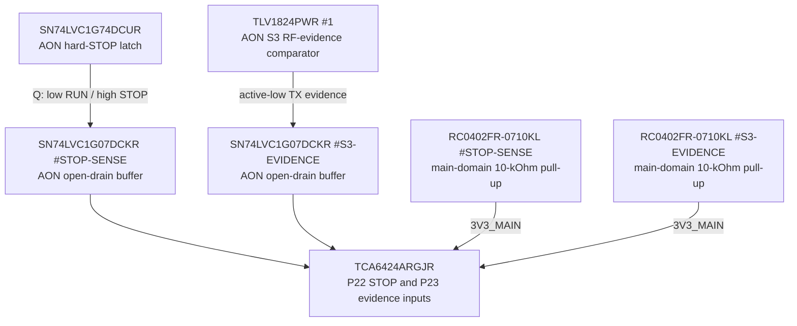

# IOX-0001 — consolidated I4 electrical closure

- Status: **Проведено ревью paper electrical block**
- Finding: [`FND-0094`](../findings/FND-0094-consolidated-i4-audit-found-hidden-interface-gaps.md)
- Decision: [`DEC-0089`](../decisions/DEC-0089-consolidated-i4-electrical-closure.md)
- Machine source: [`G2F-3I.json`](../../../hardware/architecture/candidates/G2F-3I.json)

## Scope and prerequisite result

This is the dependency audit of the complete I4 block after its USB, display,
touch, microSD and local-control endpoints were reviewed separately. Inputs
from I1 and I3 remain unchanged. The audit validates shared rails, bus
addresses, interrupt ownership, reset/recovery, partial-power direction and
real endpoints across those artifacts; it does not repeat their component
selection.

The exact main slow-control core is now:

| Function | Exact implementation |
|---|---|
| device | TI `TCA6424ARGJR`, 5×5-mm RGE/UQFN-32 with grounded exposed pad |
| I2C | SYS_I2C SCL pin 29, SDA pin 30, maximum 400 kHz |
| address | ADDR pin 26 directly low, exact 7-bit `0x22` |
| supplies | VCCP pin 27 and VCCI pin 31 both on protected `3V3_MAIN` |
| decoupling | `C1005X7R1H104K050BB` 100 nF independently at each supply plus `C1608X7R1C105K080AC` 1 uF local bulk |
| reset | RESET_N pin 28 with `RC0402FR-0710KL` 10-kOhm pull-up and protected fixture test point |
| interrupt | open-drain INT pin 32 to shared GPIO37 `SYS_INT_N`; one existing host pull-up only |
| ground | pin 25 and exposed pad to local power ground |
| default | all P ports inputs after power-on reset; endpoint safe pulls remain mandatory |

## Reset and recovery contract

Normal product recovery first performs bounded SCL clocking/STOP generation
and peripheral status discovery. If the main expander remains unavailable,
the product enters a safe/degraded state and cycles `3V3_MAIN` fully below
0.2 V before retrying. The fixture can pull `SLOW_IO_RESET_N` low directly.

There is no spare S3 GPIO and no reason to consume another MCU merely to pulse
RESET. This path still meets the standing requirement that every active IC
has programming, recovery or diagnostic control appropriate to its function:
TCA6424A is fixed-function, has bus diagnostics, direct fixture reset and a
product full-power-reset path.

## AON-to-main observation boundary

Each buffer has its own exact 100-nF AON bypass. A low input is transferred
low; a high input becomes high impedance and the corresponding main-domain
pull-up restores high. Therefore both polarities stay unchanged, while an
AON-high source can no longer drive positive voltage into an unpowered P port.
These inputs are diagnostic only and cannot alter STOP or TX gating.

## Complete SYS_I2C paper address set

| Client | 7-bit address | Closure owner |
|---|---:|---|
| TPS25751D host target | `0x20` | I3/I4 exact strap |
| TCA6424A main slow I/O | `0x22` | this I4 closure |
| MSPM0 pack-admission target | `0x2A` | fixed firmware target in this closure |
| ST77922 integrated touch | `0x38` | exact I4 endpoint |
| TCA9534A UI matrix | `0x3F` candidate | exact strap; assembled HIL |
| ES8311 codec | endpoint contract in I5 | I5 |
| Si4732 receiver | endpoint contract in I5 | I5 |

The assigned I4/I3 addresses do not collide. Final assembled scanning remains
mandatory because the last two endpoints and real specimen behavior belong to
the dependent audio/receiver block.

## Interface-boundary corrections

- microSD DAT0/MISO now reaches real `s3.GPIO4`; no textual GPIO endpoint
  remains in that signal route;
- all product USB-C shell locks bond directly to the local power/ESD ground
  with short multiple vias; a separate chassis partition may be introduced
  only by a later reviewed metal-enclosure design;
- the display FPC is internal and service-only, with power off before service.
  An extra panel-tail ESD array is deliberately not populated unless mechanics
  later expose the tail or permit live insertion;
- the physical latched-STOP LED uses exact `RC0402FR-072K2L` 2.2 kOhm rather
  than an abstract series element;
- main slow-I/O reserve is six P contacts. Dedicated UI P7 remains a protected
  local fixture/growth test pad; it does not represent a missing PTT, STOP,
  F1, F2 or D-pad input.

## Completion and residue

I4 has **Проведено ревью** at paper electrical level. The machine source,
generated pin atlas and both target-product diagrams contain the same exact
devices/routes. Open work is now classified as:

- prototype/HIL: bus recovery, reset, interrupt, no-back-power, USB SI/ESD,
  display/storage timing and control mechanics;
- physical design: connector access, internal-FPC boundary and return/ESD
  geometry;
- I5/I6/I7: audio/receiver, RF and external-accessory endpoint circuits;
- I8: live distributor quote, exact lot/lifecycle and alternates.

This review advances the dependency chain to I5. It neither freezes the
atomic architecture nor authorizes KiCad or the integrated physical mockup.
