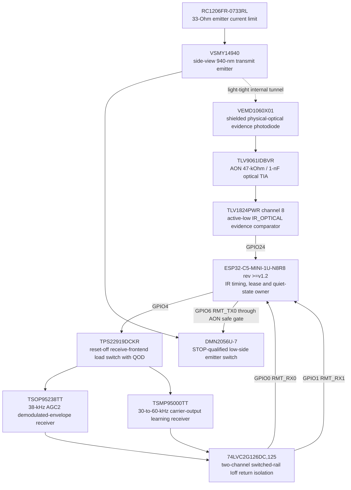

# IRF-0001 — exact dual-receiver, transmit and optical-evidence endpoint

- Статус: **Проведено ревью paper subblock; optical/electrical HIL open**
- Finding: [`FND-0100`](../findings/FND-0100-ir-endpoint-was-abstract-and-not-production-shaped.md)
- Решение: [`DEC-0095`](../decisions/DEC-0095-exact-ir-endpoint.md)
- Machine source: `hardware/architecture/devices.json`, `hardware/architecture/candidates/G2F-3I.json`

## Exact functional topology

Every box is one physical device. Filter, pull, gate and reference passives
remain separate instances in the machine map and generated vertical atlas.

## Receive and powered-off isolation

| Path | Exact physical profile | Semantic output |
|---|---|---|
| robust RX | `TSOP95238TT`, Heimdall SMD, AGC2, 38 kHz, 2.0–3.6 V, typ. 25 m | active-low demodulated envelope only |
| carrier learning | `TSMP95000TT`, Heimdall SMD, 30–60 kHz, 2.0–5.5 V, typ. 1.8 m | active-low carrier cycles; only this path may create `measured` carrier provenance |

Both physical receivers expose contacts `1,4=GND`, `2=VS`, `3=OUT` (carrier
OUT on TSMP). Each receives a separate exact `RC0402FR-07100RL` 100-Ohm and
`GRM188Z71A475ME15D` 4.7-uF supply filter. The TSMP output also uses the
recommended `RC0402FR-074K7L` 4.7-kOhm pull-up.

`TPS22919DCKR` supplies only RX/learning and connects QOD to VOUT. A separately
powered `74LVC2G126DC,125` loses VCC and OE with that rail; specified Ioff makes
both outputs high impedance. Two main-domain 10-kOhm pull-ups then hold C5
GPIO0/GPIO1 idle-high without injecting the unpowered optical devices. Receive
power stays off during TX, so LED current steps cannot corrupt carrier capture.

## Transmit current and dark defaults

The emitter is supplied from protected `3V3_MAIN` through one 33-Ohm 1206
resistor and switched low-side by `DMN2056U-7`. Its gate receives C5 RMT only
through AON `safe_gate_b` channel 3 and an exact 100-Ohm series resistor; an
external 10-kOhm pull-down makes reset, high impedance and disconnect dark.
STOP or AON loss therefore blocks light independently of C5 software.

At a conservative 3.4-V rail and the VSMY14940 datasheet's 1.1-V minimum at
20 mA, the first-order bound is `(3.4 - 1.1) / 33 = 69.7 mA` before MOSFET
drop, below the 70-mA 25-degree-C continuous absolute rating. This is a current
fault bound, not a finished temperature or eye-safety claim. Qualified profiles
must additionally limit mark length, duty/repetition and temperature; HIL and
IEC 62471 assessment define the production envelope.

## Actual optical evidence

`VEMD1060X01` is placed inside a mechanically light-tight tunnel facing the
physical emitter. It is electrically independent of the LED drive. The AON
`TLV9061IDBVR` uses:

- 100-kOhm / 10-kOhm / 100-nF reference, about 0.30 V at 3.3 V;
- photodiode cathode at the inverting input and anode at safety ground;
- 47-kOhm and 1-nF parallel feedback, about 47-us nominal response;
- direct output to the existing comparator's IR negative input.

Light raises the TIA output and asserts the active-low comparator. Missing
evidence during an admitted mark revokes the TX lease. External light, optical
crosstalk or a low threshold may assert evidence falsely, but can only delay
quiet or report `external-light-present`; evidence never creates permission.

## Runtime sequence

1. RX/learn admission keeps TX low, enables the receive rail, waits for the
   qualified rise interval, then starts both RMT RX channels together.
2. Only TSMP cycles inside 30–60 kHz create `measured` carrier metadata.
   Demodulated timing and carrier provenance remain separate fields.
3. TX admission keeps RX power off, validates profile/carrier/duty/expiry and
   arms optical evidence before starting RMT TX.
4. Evidence must assert and decay within HIL-qualified windows. Missing or
   stuck evidence revokes TX, parks RMT, waits for dark, and records a fault.
5. Quiet means receive rail discharged, return buffer high-Z, both C5 inputs
   idle-high, gate low and optical evidence dark.

## Procurement and remaining gates

`TSMP95000TT` and `VSMY14940` were active and stocked at checked authorized
sources. `TSOP95238TT` is active and orderable but showed factory lead time
rather than shelf stock; it remains a procurement gate before BOM freeze.

Remaining gates are exact optical-window/tunnel geometry, assembly orientation,
receiver sensitivity/noise, carrier accuracy, range, current/duty/temperature,
IEC 62471, comparator threshold/response, reset/STOP/brownout/stuck-carrier
fault injection, active-radio desense/emissions and no-stall coexistence.

## Sources

- [Vishay TSOP952/954 datasheet](https://www.vishay.com/docs/82837/tsop952.pdf)
- [Vishay TSOP95238TT exact orderability](https://www.digikey.com/en/products/detail/vishay-semiconductor-opto-division/TSOP95238TT/10658191)
- [Vishay TSMP95000 datasheet](https://www.vishay.com/docs/82907/tsmp95000.pdf)
- [Vishay TSMP95000TT stock](https://www.mouser.com/ProductDetail/Vishay-Semiconductors/TSMP95000TT)
- [Vishay VSMY14940 product page](https://www.vishay.com/en/product/84209/)
- [Vishay VEMD1060X01 datasheet](https://www.vishay.com/docs/84295/vemd1060x01.pdf)
- [Nexperia 74LVC2G126 datasheet](https://assets.nexperia.com/documents/data-sheet/74LVC2G126.pdf)
- [TI TPS22919 datasheet](https://www.ti.com/lit/ds/symlink/tps22919.pdf)
- [TI TLV9061 datasheet](https://www.ti.com/lit/ds/symlink/tlv9061.pdf)
