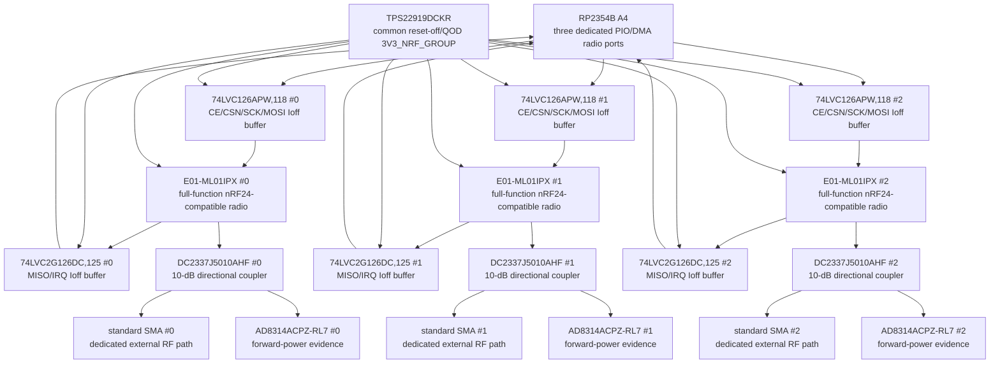

# N24E-0001 — exact three-nRF electrical endpoint

- Status: **Проведено ревью paper electrical subblock; physical/HIL open**
- Finding: [`FND-0096`](../findings/FND-0096-nrf-quiet-state-and-tx-evidence-were-not-physical.md)
- Decision: [`DEC-0091`](../decisions/DEC-0091-exact-three-nrf-electrical-endpoint.md)
- Fixture: [`N24H-0001`](N24H-0001-two-device-full-mix-fixture.md)

## Accepted topology

The three Ebyte `E01-ML01IPX` modules remain equal, full-function radios. Each
retains dedicated RP2354 CE/CSN/SCK/MOSI/MISO/IRQ, one PIO state machine, two
DMA channels and one external SMA path. A shared rail does not serialize them:
`3R`, `1PTX+2PRX`, `2PTX+1PRX` and `3PTX` remain mandatory.

Every box above is one physical body. The complete machine diagram additionally
shows every independent resistor and capacitor body.

## Digital endpoint and pin mapping

| Radio | RP contacts | Host→module | Module→host |
|---|---|---|---|
| nRF0 | CSN `0`, CE `1`, IRQ `2`, MISO/SCK/MOSI `30/31/32` | `74LVC126APW,118` channels 1–4 | `74LVC2G126DC,125` channel 1 MISO, channel 2 IRQ |
| nRF1 | `3/4/5`, `33/34/35` | same, independent body | same, independent body |
| nRF2 | `6/7/8`, `36/37/38` | same, independent body | same, independent body |

All OEs tie to `3V3_NRF_GROUP`. Nexperia specifies partial-power-down Ioff,
so VCC=0 disables outputs even while RP remains powered. Exact 22-Ohm series
resistors sit at every buffer output. Main and switched domains both define CE
low, CSN high, SCK/MOSI low, MISO low and IRQ high.

## Power and sequence

- `TPS22919DCKR` receives exact 1-uF input bypass and 10-kOhm ON pull-down;
- each module receives independent 10-uF + 100-nF local energy;
- enable starts all three detector paths and the group rail together;
- firmware waits at least 100 ms after valid rail before the first identity
  and configuration transactions on all three radios;
- shutdown forces CE low/CSN high, stops PIO/DMA, waits until forward-power
  evidence is inactive, opens the switch and proves QOD discharge/no backflow.

## RF evidence calculation

`DC2337J5010AHF` Rev. H is specified from 2000 to 4000 MHz. Across nRF's
2400–2525-MHz channel range it provides 10.0–11.2-dB coupling, no more than
0.25-dB through loss and at least 18-dB directivity. With the E01 minimum
`-18 dBm` output, the worst specified coupled level is approximately
`-29.2 dBm`, before layout/lot uncertainty. `AD8314` has a typical
`-45…0 dBm` range and response through 2700 MHz, leaving about 15.8 dB of
typical paper margin.

That arithmetic does not set the production threshold. Conducted HIL at
channels 0, 100 and 125, voltage/temperature corners and received module lots
must prove no false negatives. Strong inbound RF may conservatively assert a
false positive; it must never permit a false negative.

## Physical and lifecycle boundary

The exact Ebyte body/pads are recorded, but its `IPX` receptacle generation is
not. A received specimen must establish the mate by microscope/dimension/fit
and VNA sweep. The selected pigtail and SMA assembly are therefore not frozen.

nRF24 is NRND. Procurement needs genuine-silicon/lot inspection, retained
samples and an alternate module plan; this endpoint must not make the whole
product dependent on an anonymous marketplace module.
