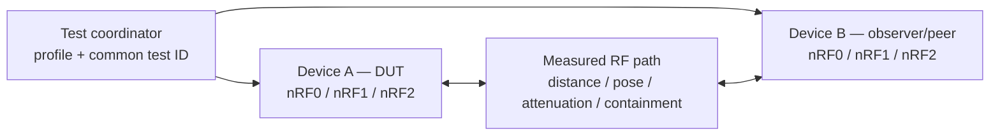

# N24H-0001 — two-device three-nRF full-mix fixture

- Статус: **Проведено ревью test-plan input; measurements not started**
- Дата: 2026-08-17
- Decision: [`DEC-0047`](../decisions/DEC-0047-qualified-nrf-mix-with-external-observer.md)
- Requirement: [`REQ-N24-0001`](../requirements/REQ-N24-0001-three-nrf24-raw-2g4.md)
- RF boundary: [`RFQ-0002`](RFQ-0002-g2f-3i-rf-concurrency-boundary.md)

## Роли стенда

Оба устройства сохраняют собственные журналы. Coordinator не управляет raw
CE/GPIO: он выдаёт один test ID, role/channel/rate/power manifest и start
barrier. Сопоставление выполняется по test ID, radio identity, packet sequence
и timestamps с записанной неопределённостью синхронизации.

## Обязательная матрица

| DUT role mix | Observer/peer action | Что доказывается |
|---|---|---|
| `3R` | три известных packet streams либо один последовательно calibrated source | isolated и simultaneous RX baseline, loss/age/RPD per radio |
| `1T+2R` | принимает DUT TX и одновременно подаёт два wanted streams на DUT RX | реальная TX continuity, peer RX continuity и measured desense без hidden gaps |
| `2T+1R` | принимает два DUT streams и подаёт wanted stream на DUT RX | two-local-TX current/coupling и remaining RX envelope |
| `3T` | принимает/считает все DUT streams | three-TX scheduling, packet rail peak/average, droop, thermal and emissions |
| role reversal | Device B becomes DUT, Device A observer | fixture asymmetry, device-to-device calibration and reproducibility |
| same/near channel negative cases | known packet sequences and power | collision/desense classified as expected/qualified/unsupported, never hidden success |

## Записываемые параметры

- exact DUT/observer hardware, firmware, radio/module/antenna revision and
  calibration identity;
- per-radio PTX/PRX state, `RF_CH`, rate, configured/measured power, address,
  retry/ACK mode and packet sequence;
- distance, enclosure/hand pose, antenna orientation, attenuator/cable/shield
  identity where used, temperature and supply state;
- transmitted/received/CRC-failed/duplicate/lost counts, FIFO/IRQ latency,
  RPD hits, RX gaps, reset/fault and actual-TX evidence;
- wanted/reference level or a calibrated path-loss proxy. Uncalibrated RSSI
  from an unrelated receiver cannot close nRF sensitivity acceptance.

## Pass boundary

Digital full mix passes only when the DUT executes the complete role schedule
without peer standby, hidden CE suppression or unexplained RX gaps. RF envelope
points pass individually with versioned limits; a passed far-channel point
does not promote same-channel operation. Power passes only if `3T` remains
inside rail, droop, temperature and STOP limits.

Open-air active security/interference cases are not implied. Dangerous cases
use the existing Controlled-Zone authorization plus conducted/shielded-room
containment requirements.
