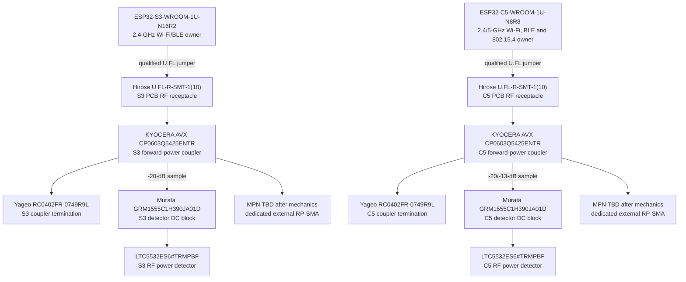

# NAT-0001 — exact S3/C5 native RF evidence endpoints

- Status: **Проведено ревью paper electrical subblock; feed/threshold/HIL open**
- Finding: [`FND-0097`](../findings/FND-0097-native-rf-evidence-stopped-before-the-real-feed.md)
- Decision: [`DEC-0092`](../decisions/DEC-0092-exact-s3-c5-native-rf-endpoints.md)
- Machine source: [`G2F-3I.json`](../../../hardware/architecture/candidates/G2F-3I.json)

## Accepted topology

S3 and C5 retain separate external antennas and separate evidence channels.
They share component MPNs, not RF paths.

Every box is one physical device. The generated principled atlas additionally
shows the two gain resistors, output capacitor and bypass capacitor for each
detector as separate bodies.

## Exact contact and circuit closure

| Element | Exact contact/use | Result |
|---|---|---|
| S3 module | manufacturer `ANT` first-generation receptacle | actual external RF contact; 2412…2484 MHz operating channels |
| C5 module | `ANT1` default receptacle; `ANT2` physical pad | `ANT1` used; `ANT2` explicitly no-connect/default-disabled |
| PCB mate | `U.FL-R-SMT-1(10)` center contact 1 plus three ground lands | specified to 6 GHz; independent body per radio |
| coupler | manufacturer top-view `IN/OUT/COUPLING/50 OHM` lands | `IN` faces module, `OUT` faces RP-SMA, `50 OHM` gets 49.9 Ohm |
| LTC5532 input | pin 1 `RFIN` | exact 39-pF C0G series DC block required by datasheet |
| LTC5532 gain | pin 5 `VOUT` → 10 kOhm → pin 4 `VM` → 10 kOhm → ground | first-target gain `1 + 10k/10k = 2` |
| LTC5532 offset/output | pin 3 `VOS` grounded; 33 pF at `VOUT` | reference starting offset and output loading |
| LTC5532 power | pin 6 `VCC`, pin 2 `GND`, 100 nF local | continuous AON evidence; 0.5-mA typical each |

The coupler drawing names its lands by function rather than number. The machine
registry preserves those manufacturer names and orientation instead of
inventing numeric pins.

## Band and loss proof

`CP0603Q5425ENTR` is specified for `2400…2496 MHz` and `4900…5950 MHz`.
Those bounds include S3's `2412…2484 MHz` and C5's `2412…2484 MHz` plus
`5180…5885 MHz`. At 2.4 GHz it specifies `-20 ±0.5 dB` coupling and at most
`0.2 dB` mainline loss. At 5 GHz it specifies `-13 ±0.5 dB` and at most
`0.4 dB`. Minimum directivity is `20 dB` in both bands.

The highest datasheet-typical native transmit points give approximate samples
near `+1 dBm` for S3 2.4 GHz, `-0.5 dBm` for C5 2.4 GHz and `+4 dBm` for C5
5 GHz at the least-attenuating coupling corner. All are below the LTC5532
`+10 dBm` operating ceiling. The low-power corner is not frozen from typical
graphs: every firmware-selectable Wi-Fi/BLE/802.15.4 level must pass conducted
threshold testing. A profile that cannot prove actual TX is not silently
enabled.

## Connector and physical boundary

The two module receptacles are datasheet-compatible with U.FL, MHF I and AMC.
The selected PCB body is exact and widely stocked. The cable is deliberately
not frozen: its order code contains length, and length/strain relief depend on
placement. Physical design must choose the shortest manufacturable
double-ended first-generation U.FL assembly, then measure the whole
module→cable→receptacle→coupler→PCB→RP-SMA feed.

The final RP-SMA connector also remains open until chassis/PCB attachment is
known. Neither open item reopens the MCU pin map.

## Availability and paper cost snapshot

Checked at exact-MPN selection on 2026-08-18:

| Qty | Exact MPN | Observed authorized stock | Approx. unit at qty 100 |
|---:|---|---:|---:|
| 2 | `CP0603Q5425ENTR` | DigiKey 7,424; Mouser 15,733 | USD 0.423 |
| 2 | `U.FL-R-SMT-1(10)` | DigiKey 271,862 | USD 1.066 cut tape |
| 2 | `GRM1555C1H390JA01D` | DigiKey 76,643 | USD 0.012 |

The two couplers plus two board receptacles are about USD 2.98 at quantity 100
before ordinary passives and cable assemblies. Both LTC5532 bodies already
existed in the accepted safety design, so no new detector SKU is added.

## Remaining acceptance

- exact cable length/order code, routing, retention and final RP-SMA MPN;
- VNA insertion/return loss at every S3/C5 channel edge and C5 ANT1/ANT2 state;
- conducted detector threshold and false-negative proof for every permitted
  radio, rate, power, voltage, temperature and module lot;
- strong inbound-signal false-positive behavior and measured directionality;
- regional EIRP recalculation using measured feed loss and qualified antenna;
- desense/coexistence/no-interface-stall test with the complete device.

