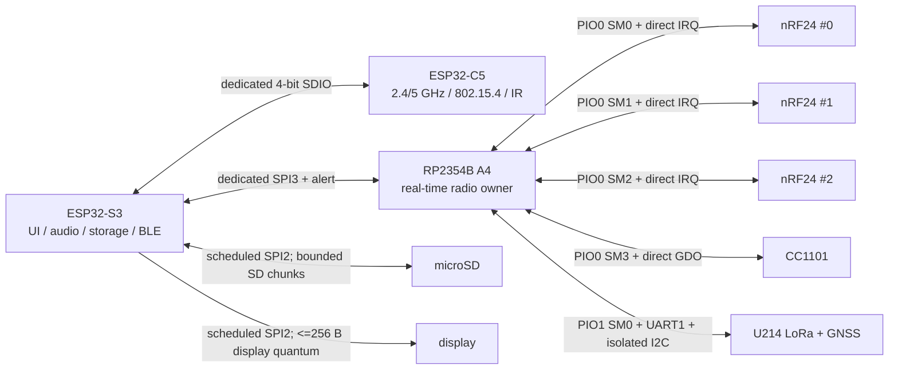

# NIF-0001 — digital non-interference layout

- Статус: **Проведено ревью бумажной цифровой компоновки; physical RF и HIL открыты**
- Дата: 2026-08-17
- Решение/полномочие: [`DEC-0044`](../decisions/DEC-0044-delegated-noninterference-layout.md)
- Machine source: [`G2F-3I.json`](../../../hardware/architecture/candidates/G2F-3I.json)
- Generated exact-pin ledger: [`G2F-pin-ledger`](generated/G2F-pin-ledger.md)
- Review: [`REV-0004L`](../reviews/REV-0004L-digital-noninterference-layout.md)

## Цель и граница доказательства

Цель этого прохода — не просто уложить сигналы в GPIO, а исключить скрытое
ожидание соседнего устройства из каждого radio/IPC deadline. На бумажном
уровне цель достигнута: radio buses, IRQ и inter-domain controllers разнесены;
оставшееся совместное использование относится только к нетайминговым
display/storage и slow-control paths и имеет измеримый arbiter contract.

Это ещё не доказывает физическую одновременность RF. Передатчик рядом с
приёмником той же или соседней полосы способен забить front-end даже при
идеально независимых GPIO/DMA. Этот вопрос является следующим отдельным
RF/zoning gate.

## Перебранные варианты

| Итерация | Идея | Результат |
|---|---|---|
| 0 | RP2354A/30 GPIO; 3×nRF24+CC1101 делят 10 Mbit/s SPI | отклонено: соседнее радио занимает bus и абсолютный simultaneous screen достигает 79.5% до service reserve |
| 1 | RP2354B; пять независимых radio/accessory SPI, но C5 и microSD — два slot одного S3 SD/MMC host | отклонено: storage остаётся соседом radio IPC внутри одного controller |
| 2 | microSD получает SD/MMC; C5 — SPI; RP IPC — 16 Mbaud UART/PIO | отклонено: 1.6 MB/s raw не доказывает принятые ≥1.5 MB/s framed после framing/service reserve |
| 3 | microSD получает SD/MMC; RP — SPI; C5 IPC — UART1 | отклонено: официальный C5 `SOC_UART_BITRATE_MAX=5,000,000`, только 0.5 MB/s raw |
| 4 | первая 48-GPIO раскладка разнесла PIO state machines, но смешала GPIO `0…31` и `32…47` внутри одного PIO0 | отклонено: на RP2354B один PIO block одновременно выбирает только окно `0…31` либо `16…47` |
| **5 / G2F-3I** | все PIO0/PIO1 data pins перенесены в общее окно `16…47`; C5 единолично владеет 4-bit SDIO host; RP — SPI3; display+microSD делят SPI2 по bounded quantum | **бумажная цифровая цель выполнена**; radio paths не ждут display/storage/peer-radio bus |

## Итоговая структура

## Реально выведенный pin budget

| Domain | Exact device boundary | Used | Reserved | Free | Проверка |
|---|---|---:|---:|---:|---|
| S3 | `ESP32-S3-WROOM-1U-N16R2`, 36 exposed GPIO | 29 | 3 straps | 4 | every GPIO classified |
| C5 | `ESP32-C5-WROOM-1U-N8R8`, 21 exposed GPIO | 13 | 6 straps/service | 2 | internal PSRAM GPIO15 не посчитан |
| RP | `RP2354B A4`, QFN80, 48 GPIO | 46 | 0 | 2 | exact package pads 1…80 checked |
| slow plane | `TCA6424ARGJR`, 24 P-ports | 23 | 1 | 0 | every allocatable contact classified and routed |

Переход `RP2354A→RP2354B` добавляет 18 GPIO и увеличивает корпус с 7×7 до
10×10 mm. Это осознанная цена физически независимых radio buses и двух
оставленных timing-reserve GPIO; это не скрытая смена семейства или software
model.

## Реальные peripheral windows и capacity

Пересчёт сделан не только по наличию GPIO на QFN80. Все data pins пяти PIO-SPI
лежат в `GPIO30…GPIO46`, то есть внутри выбранного для PIO0 и PIO1 окна
`GPIO16…GPIO47`. CSN/NSS, CE и IRQ вынесены на обычные GPIO и поэтому не
нарушают PIO base-window. Валидатор отдельно отклоняет pin за пределами окна
или отсутствие window contract.

| Пул | Занято | Резерв | Почему сосед не отбирает ресурс |
|---|---:|---:|---|
| RP2354B PIO state machines | 5 / 12 | 7 | четыре SM в PIO0 для 3×nRF+CC, одна SM в PIO1 для U214 |
| RP2354B DMA channels | 13 / 16 | 3 | пять full-duplex PIO-SPI = 10, S3↔RP SPI1 = 2, continuous GNSS RX = 1 |
| S3 GDMA TX | 3 / 5 | 2 | SPI2, SPI3 и I²S0 получают по каналу |
| S3 GDMA RX | 3 / 5 | 2 | SPI2, SPI3 и I²S0 получают по каналу; SD/MMC не входит в этот GDMA peripheral pool |

Fixed-function mux также закреплён машинно: S3 native USB — `GPIO19/20`, C5
4-bit SDIO — `GPIO7/8/9/10/13/14`, RP SPI1 — `GPIO24…27`, UART0 —
`GPIO16/17`, I²C0 — `GPIO28/29`, UART1 — `GPIO40/41`. Изменение контакта без
одновременного обновления и повторного ревью mux contract ломает проверку.

Это закрывает арифметику контроллеров, но не заменяет исполняемую проверку
PIO instruction placement, DMA arbitration и SRAM-bank contention. Поэтому
stress HIL остаётся обязательным до target acceptance.

## Контракты отсутствия цифровых тормозов

| Path | Controller/bus | Соседнее влияние | Acceptance |
|---|---|---|---|
| nRF24 #0/#1/#2 | отдельные PIO0 SM0/1/2 и отдельные SCK/MOSI/MISO/CSN/CE/IRQ | отсутствует на bus/IRQ уровне | IRQ/FIFO HIL and every simultaneous PTX/PRX role mix; `DEC-0047/N24H-0001` physical measurements remain open |
| CC1101 | PIO0 SM3, отдельные data pins и direct GDO0/GDO2 | не ждёт nRF/U214 | FIFO begin ≤250 µs, complete ≤500 µs при admitted load |
| U214 LoRa | PIO1 SM0, direct BUSY/IRQ/RST | не ждёт display/compat radios | IRQ-to-first-transfer HIL; no shared display bus |
| U214 GNSS/I²C | hardware UART1; отдельный I²C0 через TCA4307 | external stuck-low не валит internal UI/audio | continuous RX + hot-plug/stuck-bus fault injection |
| S3↔RP | hardware SPI3/SPI1, 20 MHz target, alert | не делит display, SD или C5 controller | ≥1.5 MB/s framed; alert-to-read ≤250 µs |
| S3↔C5 | S3 SD/MMC host + C5 4-bit SDIO slave | microSD удалён из host | ≥1.5 MB/s framed; control RTT ≤2 ms |
| audio | I²S0 + DMA | отдельный peripheral | continuous full-duplex; zero unexplained gaps |
| Unit | second S3 I²C/UART/GPIO profile | отделён от internal и U214 I²C | profile/fault HIL |
| display+microSD | SPI2, отдельные CS и per-device clock | только взаимное, bounded; radio path не затрагивается | UI first feedback ≤100 ms; SD ≥4 MB/s, 1.5 MB/s record and 250 ms stall; display quantum ≤256 B |
| internal slow controls | I²C0 + INT, bounded transactions | только slow endpoints | UI ≤100 ms; ни PTT, ни radio FIFO/IRQ здесь нет |

## Slow plane и safety boundary

23/24 линии распределены: шесть линий diode-isolated 3×3 UI matrix,
display/touch reset, codec enable, два audio selector, voice PD/HL, receiver
reset/status, U214 I²C READY, external 5 V, microSD power/detect, STOP sense,
S3 actual-TX evidence, power fault и accessory present. `P27` остаётся
контролируемым резервом exact-part discovery.

PTT, physical PTT, все radio IRQ/GDO/BUSY, actual-TX evidence C5/IR/voice и
непрограммируемый hard STOP не перенесены на slow plane. Expander powers up as
inputs; каждый output получает внешний fail-safe pull.

## Доказанное и ещё не доказанное

Проведённое ревью доказывает exact exposed-contact existence, полный GPIO и
slow-contact accounting, отсутствие duplicate nets, strap proof, recovery
coverage, reciprocal programmable links, реальные RP PIO GPIO-windows,
capacity arithmetic и наличие resource contracts. Оно не заменяет
schematic/HIL.

Открыты: exact nRF production implementation, CC RF network, display/touch,
codec, receiver, voice/IR frontends, power/clock, antenna/filter/zoning,
thermal/mechanics, production cost and all named stress tests. `G2F-3I` может
стать target только внутри будущего atomic package после этих проверок.

## Первичные источники

- [RP2350/RP2354 datasheet](https://datasheets.raspberrypi.com/rp2350/rp2350-datasheet.pdf)
- [Raspberry Pi RP2350 controller/DMA overview](https://www.raspberrypi.com/documentation/microcontrollers/microcontroller-chips.html)
- [Raspberry Pi Pico SDK PIO hardware notes](https://www.raspberrypi.com/documentation/pico-sdk/hardware.html#hardware_pio)
- [ESP32-S3 datasheet](https://documentation.espressif.com/esp32-s3_datasheet_en.pdf)
- [ESP32-C5 datasheet](https://documentation.espressif.com/esp32-c5_datasheet_en.pdf)
- [ESP32-C5 SDIO slave](https://docs.espressif.com/projects/esp-idf/en/latest/esp32c5/api-reference/peripherals/sdio_slave.html)
- [ESP32-S3 SD/MMC host](https://docs.espressif.com/projects/esp-idf/en/stable/esp32s3/api-reference/peripherals/sdmmc_host.html)
- [ESP32-C5 official SoC capabilities (`UART_BITRATE_MAX`)](https://raw.githubusercontent.com/espressif/esp-idf/master/components/soc/esp32c5/include/soc/soc_caps.h)
