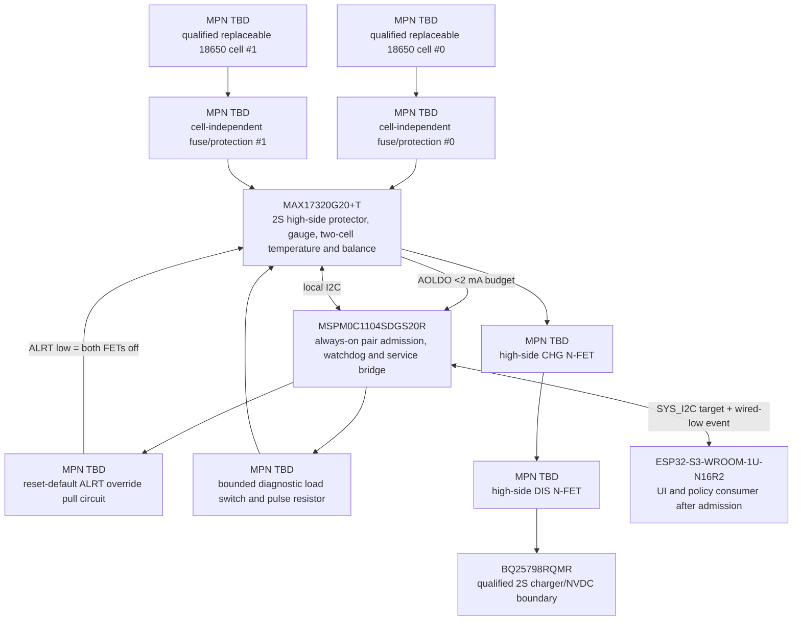

# PWR-0005 — replaceable-2S manager and admission options

- Статус: **Проведено ревью 2S branch; owner gate superseded by DEC-0064/IMP-0055**
- Дата: 2026-08-18
- Battery decision: [`DEC-0062`](../decisions/DEC-0062-individually-replaceable-2s-cells.md)
- USB-PD/NVDC frontend: [`PWR-0004`](PWR-0004-accepted-usb-pd-front-end.md)
- Finding: [`FND-0075`](../findings/FND-0075-pack-gauge-is-not-loose-cell-admission.md)

## Required boundary

> `DEC-0064` reopened the electrical topology after this review. Everything
> below remains evidence for option A/2S in `PWR-0006`; it is not the current
> selected topology.

The charger already selected in `PWR-0004` sees only a qualified 2S boundary.
The cell subsystem must independently provide all of the following before that
boundary is energized:

- mechanical reverse-insertion blocking ahead of every manager absolute-
  maximum input;
- two separate cell-voltage/presence readings and one NTC per cell;
- normally-open charge and discharge paths during admission-MCU reset, blank
  or corrupt admission firmware, watchdog, one-cell insertion/removal and
  contact bounce;
- a bounded diagnostic load that measures per-cell voltage droop under the same
  series current, allowing contact/impedance mismatch rejection;
- autonomous over/undervoltage, overcurrent, short-circuit and temperature
  protection after admission;
- SOC/SOH, current, lifetime evidence and balancing, with a fresh learning state
  whenever either cell changes;
- direct programming/recovery/diagnostic access to every configurable device.

No option may ask S3 to be alive before the battery pair has been admitted.

## Exact candidates checked

| Property | A — `MAX17320G20+T` + `MSPM0C1104SDGS20R` | B — `BQ28Z620DRZR` + `MSPM0C1104SDGS20R` |
|---|---|---|
| gauge package | 24-pin TQFN, 4×4 mm | 12-pin VSON, 4×2.5 mm |
| series-cell fit | 2–4S | 1–2S |
| normal pack switching | high-side back-to-back N-FET CHG/DIS | high-side back-to-back N-FET CHG/DSG |
| per-cell voltage | yes | yes |
| external temperature | four NTC inputs; two can protect the two cells autonomously | one TS input; second cell must depend on companion ADC/additional hardware |
| SOC/SOH | ModelGauge m5, current/capacity/age/history | Impedance Track, current/capacity/SOH/lifetime |
| balancing | internal switches plus external resistors | internal bypass plus external resistors |
| deterministic default hold-open | ALRT pin override can force both FETs off; default external pull circuit can assert it before MCU code | no separate override/alert pin; MCU command has a startup race unless another gate is added |
| housekeeping supply | configurable 1.8/3.4-V AOLDO, specified for small loads below 2 mA | no equivalent exposed housekeeping output |
| system event path | admission MCU polls locally and exposes status/IRQ | admission MCU polls locally; additional second-temperature and startup-gate work |
| exact gauge availability snapshot | Mouser 7,638; DigiKey 5,218 | Mouser/DigiKey 0, backorder |
| visible 100-piece gauge price | about $4.00 | about $2.88 |

`MAX17320G20+T` is deliberately the I2C variant **without** SHA-256. Battery
authentication is not required to make the device safe and would add a secret/
lock-in story without proving the identity of an untagged loose cell.

The common admission controller candidate is exact
`MSPM0C1104SDGS20R`: active 20-pin VSSOP, 16-kB flash, 1-kB SRAM, watchdog,
CRC, ADC, UART/SPI/I2C and SWD. Its real package exposes dedicated reset at pin
5, VDD/VSS at 6/7 and SWDIO/SWCLK at 15/16. Hardware I2C can use PA0 pin 4
and PA11 pin 11 without consuming the reset contact; the local gauge bus may be
bit-banged on PA2/PA4 pins 8/9. The remaining contacts cover default FET hold,
diagnostic-load control, wired-low system event and direct service UART while
keeping every recovery contact exposed.

At the checked 100-piece tier the MCU is about `$0.45–0.47`, so the selected
active pair in option A is about `$4.45–4.47` before common FETs, fuse, shunt,
NTCs, diagnostic resistor/switch and mechanical contacts. Option B appears
about `$1.12` cheaper in the two-IC subtotal, but its missing second autonomous
temperature input, missing hardware override and present zero-stock state
erase that advantage once an equivalent safe boundary is added.

## Recommended topology A

The external hold circuit asserts MAX17320 ALRT low before the MCU starts.
With the gauge NVM field `OvrdEn=1` this holds both FETs open. That field is not
treated as an assumed power-on default: the factory fixture must program the
complete protected gauge image, verify its checksums and read back `OvrdEn`
before an energized cell/contact assembly can be connected. A blank, corrupt
or wrong gauge image is a manufacturing/service reject and must not reach an
installed-cell power-up test.

After that independent production interlock, the admission MCU runs at a
bounded low clock from the gauge AOLDO, verifies gauge identity/configuration
and both cell measurements, pulses the diagnostic load, then releases hold
only after a complete pass. It polls protection events locally because ALRT is
consumed as the fail-closed override and exposes a compact read-only status
window to S3 over the already allocated system I2C bus. A watchdog/reset
returns hold to the asserted state. The `<2 mA` AOLDO value is a source budget,
not a blanket MCU-mode claim: boot, steady polling and watchdog current must be
measured at the selected voltage/clock, and the SWD fixture may power VDD while
programming a blank admission MCU.

This is a topology decision, not final passive/FET selection. Exact CHG/DIS
MOSFETs, per-cell fuses, NTCs, sense resistor, diagnostic pulse network,
default-hold transistor, thresholds, timings and thermal calculations remain
the immediate continuation of `I3` if option A is accepted.

## State and recovery contract

| State | CHG | DIS | Visible behavior |
|---|---:|---:|---|
| zero/one cell, reverse or contact bounce | open | open | no pack output; mechanical reverse path must not reach gauge abs-max |
| configured gauge; MCU reset/blank/watchdog | open | open | external ALRT hold fails closed; direct SWD/UART and gauge I2C pads remain available |
| blank/corrupt/wrong gauge NVM | not an allowed energized assembly | not an allowed energized assembly | factory/service interlock blocks cell installation or powered continuation until protected image, checksum and `OvrdEn` readback pass |
| voltage/temp/profile mismatch | open | open | reason retained by admission MCU; USB-powered UI may explain it |
| diagnostic pulse fails impedance/contact envelope | open | open | pair rejected; no forced balance/charge |
| admitted pair | protector-controlled | protector-controlled | S3 receives qualified pair status, SOC/SOH and faults |
| either cell replaced | open until new pass | open until new pass | previous learned SOC/SOH invalidated; UI shows estimating/unknown |

## Availability sources

Checked 2026-08-18 because every candidate above is an exact MPN:

- [ADI MAX17320 product/datasheet](https://www.analog.com/en/products/max17320.html)
  and [Mouser `MAX17320G20+T`](https://www.mouser.com/en/ProductDetail/Analog-Devices-Maxim-Integrated/MAX17320G20%2BT);
- [TI BQ28Z620 product](https://www.ti.com/product/BQ28Z620) and
  [Mouser `BQ28Z620DRZR`](https://www.mouser.com/ProductDetail/Texas-Instruments/BQ28Z620DRZR);
- [TI `MSPM0C1104SDGS20R`](https://www.ti.com/product/MSPM0C1104/part-details/MSPM0C1104SDGS20R)
  and [DigiKey availability](https://www.digikey.com/en/products/detail/texas-instruments/MSPM0C1104SDGS20R/24709005).
