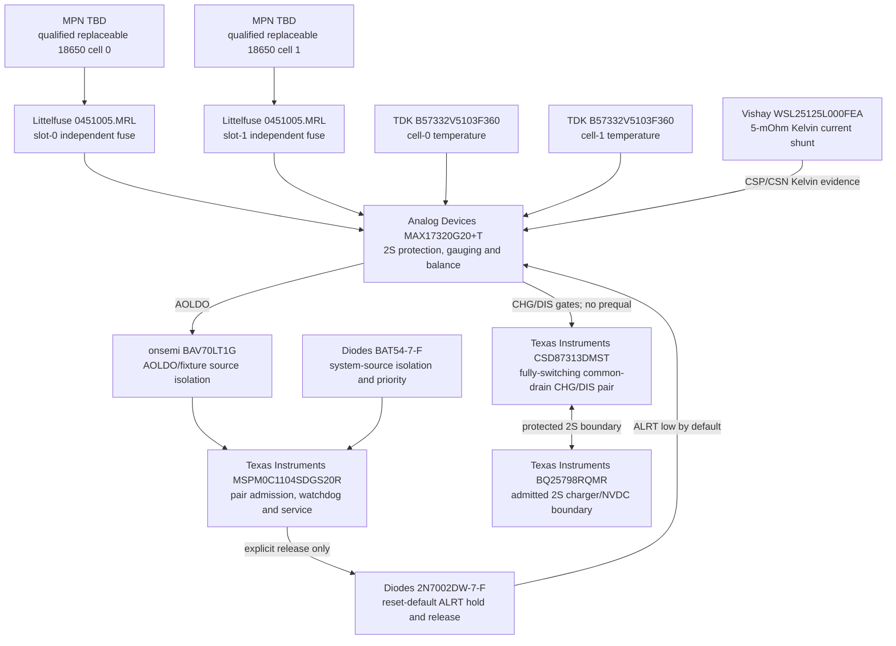

# PWR-0007 — MAX17320 2S surrounding-circuit review

- Статус: **Проведено ревью; вариант A принят `DEC-0067`**
- Дата: 2026-08-18
- Manager decision: [`DEC-0066`](../decisions/DEC-0066-max17320-mspm0-fail-closed-manager.md)
- Prior device review: [`PWR-0005`](PWR-0005-replaceable-2s-manager-options.md)
- Finding: [`FND-0077`](../findings/FND-0077-max17320-prequal-is-a-linear-fet-mode.md)
- Owner gate: [`IMP-0056`](../improvements/IMP-0056-deep-cell-recovery-boundary.md)
- Review: [`REV-0005W`](../reviews/REV-0005W-max17320-surrounding-circuit-gate.md)
- Decision: [`DEC-0067`](../decisions/DEC-0067-no-in-device-deep-cell-recovery.md)
- Propagation: [`REV-0005X`](../reviews/REV-0005X-deep-cell-policy-propagation.md)

## Scope

This pass checks the circuit around the already accepted
`MAX17320G20+T + MSPM0C1104SDGS20R`: real 2S cell-tap rules, series-current
budget, reset-default FET hold, admission-controller supply handover,
temperature evidence and the diagnostic-load GPIO/ADC plan. It does not claim
a schematic, PCB thermal result or KiCad authorization.

## Verified 2S sensing boundary

ADI requires `BATTS` and `CELL1` to be used and neighboring CELL pins to be
shorted where no cell exists between them. Figure 24 additionally requires
external balancing-current resistors on `CELL1/CELL2/CELL3/BATTS` and replaces
the two not-applicable inter-cell capacitors with shorts for 2S. No exposed
CELL contact may simply be left floating.

The evaluation-kit 2S fixture independently confirms the physical stack:
`BATTN = Cell1N`, `BATT2 = Cell1P/Cell2N`, `BATTP = Cell2P`, with `BATT1` and
`BATT3` fixture posts open. The final schematic must reproduce ADI's Figure 24
short-link/resistor topology exactly, then verify every sense-pin absolute
maximum under insertion, removal and contact bounce.

`nPackCfg.NCELLS = 0` represents two cells. `TH1/TH2` are the two cell
thermistors; the protected configuration uses 10-kOhm NTC mode. These NVM
values remain part of the factory checksum/readback interlock already accepted
in `DEC-0066`.

## Exact first targets independent of the recovery choice

These are accepted exact first targets for the final circuit pass and now
enter the machine source and vertical product diagrams after the coupled FET
decision closed.

| Quantity | Exact MPN | Role and checked fact | Current availability snapshot |
|---:|---|---|---|
| 2 | `0451005.MRL` | one 5-A fast Nano2 fuse adjacent to each slot; `12.5 mOhm` cold resistance and 50-A breaking capacity | authorized-channel stock in the tens of thousands; visible 100-piece pricing varies roughly `$0.96…1.45` |
| 1 | `WSL25125L000FEA` | 5-mOhm, 1%, 1-W 2512 current shunt; Kelvin routing mandatory | active AEC-Q200 family and stocked authorized channel |
| 2 | `B57332V5103F360` | one thermally coupled NTC per cell; 10 kOhm ±1%, `B25/50=3380 K`, AEC-Q200, 0603 | active; DigiKey 58,400 and Mouser 22,041 at check time, about `$0.116/100` |
| 1 | `2N7002DW-7-F` | dual N-MOS in one SOT-363 package for reset-default ALRT hold and controlled release | current manufacturer page; broad authorized-channel stock, about `$0.11/100` |
| 1 | `BAV70LT1G` | dual common-cathode silicon diode: AOLDO and isolated fixture branches of admission-VDD OR | current onsemi part; Mouser 335,473, about `$0.046/100` |
| 1 | `BAT54-7-F` | Schottky system-3V3 branch of admission-VDD OR; lower drop makes the admitted system source win | current Diodes ordering code; DigiKey/Mouser each show six-figure stock |
| 1 | `CSD87313DMST` | active 30-V common-drain dual N-FET; topology matches MAX17320 CHG/IN and DIS/PCKP gate references; 5.5-mOhm maximum source-to-source at 4.5 V | TI active production; authorized-channel stock visible at selection |

The formerly tempting Murata `NCP18XH103F03RB` and Panasonic
`ERT-J1VG103FA` are not selected: their manufacturer lifecycle is NRND/NRFND.
The Diodes `BAV70-7-F` is also rejected after a 2026 EOL notice; the exact
onsemi `BAV70LT1G` replacement is used above. This is a concrete bypass of
stale-part limitations rather than inheriting them into the new product.
The earlier `FDMC8030` paper candidate is also rejected: onsemi now marks it
`Last Shipments`. An initially screened common-source replacement is rejected
electrically; the accepted `CSD87313DMST` is the required common-drain device.

An SMD NTC part number is not sufficient mechanical proof. `PWR-0016/DEC-0077`
now define one insulated compliant mid-can contact per cell and the independent
charger-TS worst-slot location. Exact thermal-stack material and replacement
HIL remain `I8` work.

## Reset-default hold and admission supply

The ALRT hold uses the two FETs inside one `2N7002DW-7-F` package:

1. hold FET drain sinks MAX17320 `ALRT`, source is local ground, and its gate
   is pulled up from AOLDO, so reset or an unpowered MCU holds CHG/DIS open;
2. release FET pulls the hold-gate low only when `PA6` explicitly asserts
   `PACK_FET_HOLD_RELEASE`; its own gate has a reset-state pull-down;
3. the MCU does not directly clamp the AOLDO-side hold gate, avoiding an
   unpowered-I/O backfeed dependency.

`PACK_ADMISSION_VDD` is a passive three-source OR, not a source selector hidden
inside firmware:

- AOLDO 3.4 V and isolated fixture 3.3 V enter the two anodes of
  `BAV70LT1G`;
- admitted system 3.3 V enters through `BAT54-7-F` and wins by its lower
  forward drop;
- all cathodes meet only at local decoupled admission VDD, so system/fixture
  supply cannot drive AOLDO backwards;
- the expected AOLDO branch remains inside the MSPM0 `1.62…3.6 V` operating
  range, but low-clock boot/poll current and fixture flash current still need
  measured handover HIL.

Exact pull, decoupling and fixture-current values are schematic outputs, not
invented in this principle-level review.

## Diagnostic evidence and real GPIO budget

The bounded pre-admission load is placed across the full two-cell stack ahead
of the normally-open pack FETs. It exercises the same series current through
both cells, contacts and slot fuses while the product rails remain isolated.
The admission MCU samples both electrical degrees of freedom:

| Contact | Proposed evidence | Derivation |
|---|---|---|
| `PA25/A2` | protected/divided stack midpoint | lower-cell voltage |
| `PA26/A1` | protected/divided full-stack voltage | upper-cell voltage = stack minus midpoint |

This consumes the two ADC contacts already reserved for independent slot
evidence, moving the controller budget from `10 used / 5 reserved / 3 free` to
`12 used / 3 reserved / 3 free` when the circuit is accepted. `PA22/A4`
remains the reset-low diagnostic trigger. `PWR-0013/FND-0078` correct the old
PA24 assignment because that exact pin permits no injection current, then
freeze the exact one-shot, pulse resistor, switch, divider values and ADC
settling. Acceptance thresholds and cooldown stay open until a qualified
cell/contact matrix establishes useful droop limits.

## Series-path current and loss screen

The existing worst transient is 15 W. At the 6.0-V low-stack point and 90%
downstream efficiency, the pack current is:

`I = 15 W / (6.0 V × 0.90) = 2.78 A`.

This retains the current path floor of at least 3 A continuous and 4 A pulse.
At 2.78 A:

| Element | Conservative resistance used | Dissipation |
|---|---:|---:|
| two `0451005.MRL` fuses | `2 × 12.5 = 25 mOhm` cold | `0.193 W` total |
| `WSL25125L000FEA` shunt | `5 mOhm` | `0.039 W` |
| one `CSD87313DMST`, complete source-to-source path at 4.5 V maximum | `5.5 mOhm` | `0.043 W` |

The accepted exact path totals about `35.5 mOhm / 0.275 W` before contacts and
copper. Hot resistance, holder contacts, copper and fault duration remain
mandatory thermal margins. Ordinary conduction fits on paper; `FND-0077`
shows why disabling linear prequal is still a product-safety decision rather
than an excuse to skip thermal HIL.

## Circuit fork

Each box is one physical package or one still-unselected physical item; the two
identical fuses and thermistors remain separate because they protect/measure
different slots.

## Availability and primary sources

Checked 2026-08-18 because every named candidate is an exact orderable MPN:

- [ADI MAX17320 Rev.12 datasheet](https://www.analog.com/media/en/technical-documentation/data-sheets/max17320.pdf)
  and [MAX17320 EV-kit guide](https://www.analog.com/media/en/technical-documentation/data-sheets/max17320g1evkit-max17320x2evkit.pdf);
- [TDK `B57332V5103F360` product page](https://product.tdk.com/en/search/sensor/ntc/chip-ntc-thermistor/info?part_no=B57332V5103F360)
  and [DigiKey availability](https://www.digikey.com/en/products/detail/epcos-tdk-electronics/B57332V5103F360/4945421);
- [Diodes `2N7002DW` product page](https://www.diodes.com/part/view/2N7002DW?BackID=8372),
  [onsemi `BAV70LT1G` datasheet](https://www.onsemi.com/pdf/datasheet/bav70lt1-d.pdf)
  and [Diodes `BAT54` datasheet](https://www.diodes.com/datasheet/download/BAT54.pdf);
- [TI `CSD87313DMS` active product page](https://www.ti.com/product/CSD87313DMS)
  and [exact `CSD87313DMST` orderable page](https://www.ti.com/product/CSD87313DMS/part-details/CSD87313DMST);
- [onsemi `FDMC8030` product page showing Last Shipments](https://www.onsemi.com/products/discrete-power-modules/mosfets/low-medium-voltage-mosfets/fdmc8030).

## Review result

The 2S sensing rules, real current envelope, exact switching FET, first targets,
reset hold, supply handover and two-ADC budget receive **«Проведено ревью»** at
paper level. `DEC-0067` accepts no in-device deep-cell recovery. Reverse-
insertion blocking and NTC roles are subsequently paper-closed by
`PWR-0016/DEC-0077`; diagnostic thresholds, hot losses and HIL remain explicit
downstream work. No KiCad start is authorized.
