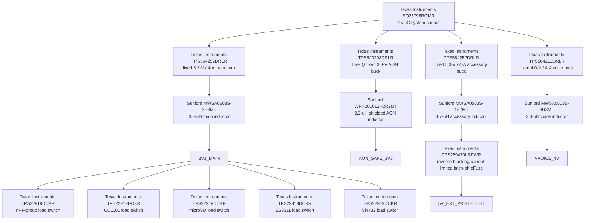

# PWR-0008 — exact downstream rail tree

- Статус: **Проведено ревью активной топологии и exact first targets**
- Дата: 2026-08-18
- Prerequisite: [`PWR-0002`](PWR-0002-i3-power-prerequisite-audit.md)
- Source boundary: [`PWR-0004`](PWR-0004-accepted-usb-pd-front-end.md)
- Battery boundary: [`PWR-0007`](PWR-0007-max17320-2s-surrounding-circuit.md)
- Decision: [`DEC-0068`](../decisions/DEC-0068-separate-fixed-downstream-rails.md)
- eFuse fail-closed amendment: [`DEC-0069`](../decisions/DEC-0069-latch-off-external-efuse.md)
- Propagation review: [`REV-0005Y`](../reviews/REV-0005Y-downstream-rail-tree-propagation.md)

## Scope

Этот проход выбирает физически независимые active stages от `BQ25798 SYS` до
четырёх шин и five quiet-state branches. Он проверяет реальные контакты exact
MPN, current/ripple headroom, reverse-current boundary, доступность и порядок
включения. Passive values, copper/thermal layout и specimen HIL ещё не закрыты;
артефакт не разрешает начинать KiCad.

## Why four converters, not one configurable rail

`AON_SAFE_3V3`, `3V3_MAIN`, `VVOICE_4V` и `5V_EXT` имеют разные failure and
quiet-state contracts. Особенно важно, что `SA518` принимает фиксированные
4.0 V, а внешний разъём — 5.0 V. Один программируемый 4/5-V converter с analog
mux экономил бы только один дешёвый IC и inductor, но создавал single fault,
способный подать 5 V на voice module. Поэтому 4 V and 5 V are physically
independent fixed-feedback rails.

`MAX17320 AOLDO` также не заменяет AON converter: его выход рассчитан менее чем
на 2 mA, тогда как уже принятое safety circuitry требует не менее 5 mA
continuous / 8 mA transient. Product AON therefore starts directly from
`BQ25798 SYS`; AOLDO remains only inside the bounded pack-admission circuit.

## Accepted rail tree

Every converter, inductor, eFuse and load switch is one physical package. The
two 3.3-uH inductors and five identical switches stay as separate boxes in the
living vertical product diagram because they occupy independent physical
branches.

## Exact parts and real package contacts

### `TPS629203DRLR` — AON

The active SOT-583/DRL-8 order code accepts 3…17 V, supplies 300 mA, draws
4 µA typical in power-save mode and exposes `PG`. The real top-view contacts
are `1 FB/VSET`, `2 PG`, `3 VOS`, `4 SW`, `5 GND`, `6 VIN`, `7 EN`,
`8 MODE/S-CONF`. The accepted starting configuration is fixed 3.3 V,
2.5 MHz, automatic PFM/PWM and output discharge disabled; `TPS3808G33`
continues to supervise the actual AON output.

`WPN201612H2R2MT` is a 2.2-uH ±20% shielded 2.0×1.6×1.2-mm inductor with
146-mOhm maximum DCR, 1.7-A minimum saturation and 1.8-A heat-rating current.
At 8.4-V input, 3.3-V output, 2.5 MHz and minimum 1.76 uH, the continuous-mode
ripple screen is about `0.455 A`; even at the converter's full 0.3-A rating the
peak is about `0.528 A`, far below saturation. The real product load is only
5/8 mA, so efficiency and hold-up, not current rating, dominate HIL.

### `TPS564252DRLR` — main, voice and external rails

Three physical instances reuse one exact active/stocked MPN and one footprint.
The IC accepts 3…17 V, supplies up to 4 A, switches near 600 kHz, provides
D-CAP3 transient response and open-drain `PG`, and operates in Eco-mode at
light load.

Real SOT-563 contacts are `1 VIN`, `2 SW`, `3 GND`, `4 PG`, `5 EN`, `6 FB`.
The early working note incorrectly treated pin 4 as `BST`; datasheet review
corrected it before this artifact. Bootstrap is integrated, so no external BST
network exists and pin 4 is available for sequencing/fault evidence.

The exact inductor screen uses worst high-stack input, minimum inductance and
the accepted transient load:

| Rail | Exact inductor | Ripple screen | Peak at accepted transient | Inductor floor |
|---|---|---:|---:|---:|
| `3V3_MAIN` | `MWSA0503S-3R3MT`, 3.3 uH ±20%, 38 mOhm max | `1.26 A` | `3.63 A` at 3.0 A | `4.8 A` minimum saturation; `5.5 A` heat rating |
| `VVOICE_4V` | separate `MWSA0503S-3R3MT` | `1.32 A` | `2.16 A` at 1.5 A | same independent physical part |
| `5V_EXT` | `MWSA0503S-4R7MT`, 4.7 uH ±20%, 60 mOhm max | `0.90 A` | `2.45 A` at 2.0 A | `4.6 A` saturation; `4.5 A` heat rating |

Approximate inductor copper loss at each continuous floor is `0.238 W` main,
`0.059 W` voice and `0.094 W` external. These are paper screens, not board
temperature claims. Exact capacitance, DC-bias derating and copper area close
next.

`TPS564252B` is a newer family revision and remains a future qualification
candidate, but it had no comparable assembly/distributor stock evidence at
this selection. The stocked active `TPS564252DRLR` therefore remains the exact
first target. Pin-compatible `TPS564255DRLR` OOA mode may be fitted in the
voice footprint only if conducted-audio HIL proves Eco-mode spur sensitivity;
it is not silently mixed into the first BOM.

## Quiet-state branch switches

Five separate `TPS22919DCKR` packages gate the nRF group, CC1101, microSD,
ES8311 and Si4732. The active SC70-6 part is rated 1.5 A over 1.6…5.5 V,
provides controlled rise, thermal/short protection and a configurable 24-Ohm
quick-output discharge. Real contacts are `1 IN`, `2 GND`, `3 ON`, `4 NC`,
`5 QOD`, `6 VOUT`; pin 4 is left floating and QOD is tied to its own VOUT in
the current topology.

One switch is sufficient for all three nRF candidates because their accepted
local transient envelope totals only 75 mA, while all three data/IRQ/CE paths
remain independent and simultaneous PTX/PRX mixes remain mandatory. The
grouped power switch does not serialize them.

Reset-low `ON` pulls and bus-side isolation must prove that an unpowered branch
cannot be back-powered through SPI/I2C/I2S. Exact discharge time is measured
with production capacitance; QOD is not treated as evidence without HIL.

## External 5-V protection

`TPS259470LRPWR` is the last series element before U214/Cap power. It has
integrated back-to-back FETs, 28.3-mOhm typical on-resistance, true reverse
current blocking at all times, adjustable active current limit, transient
blanking, `dVdt`, current monitor and active-low open-drain `FLT`. The `L`
variant latches off after thermal/latched faults until an explicit enable-low
or power cycle; it does not perform the `A` variant's autonomous 110-ms retry.

Real QFN-10 contacts are `1 EN/UVLO`, `2 OVLO`, `3 AUXOFF`, `4 FLT`, `5 IN`,
`6 OUT`, `7 dVdt`, `8 GND`, `9 ILM`, `10 ITIMER`. The next passive gate sets
nominal 1.50-A limit whose worst tolerance floor remains above the accepted
1.25-A continuous envelope, plus a bounded interval below the device's
`2×ILIM` transient ceiling covering the accepted 2.0-A startup envelope.
`ILM` reaches
a protected test point; `FLT` joins `POWER_FAULT_N` without consuming another
GPIO.

The eFuse has no active output discharge. A passive bleeder follows it so the
unplugged connector decays to a measured safe threshold without creating a
low-impedance sink when an accessory drives the connector. U214 `5V_OUT` is
not paralleled into the base rail in this profile.

## Sequencing and fault dominance

1. An admitted battery pair or valid USB source establishes `BQ25798 SYS`.
2. AON starts in hardware; `TPS629203 PG` and `TPS3808G33` must both show a
   valid safety rail before hard-STOP logic can release reset.
3. A reset-low source-admission sequencer enables `3V3_MAIN`; its `PG` is part
   of the fault aggregate.
4. `VOICE_DOMAIN_EN_SAFE` directly enables the fixed 4-V converter. SA518
   `PD` remains asserted until its `PG` is valid, while hardware PTT still
   independently forces receive.
5. `EXT_5V_EN_SAFE` enables both the 5-V converter and connector eFuse. Any
   eFuse fault removes connector power independently of UI polling.
6. nRF and CC switches receive only STOP-dominant safe gates; SD, codec and
   receiver receive reset-off ordinary session controls.

Loss of AON makes every safety gate and compute reset fail safe through the
already reviewed physical pulls. Firmware can request a rail but cannot
override current limit, reverse blocking, STOP or fixed feedback voltage.

## Availability and cost snapshot

Checked on 2026-08-18 because each selected item is now an exact MPN:

- `TPS564252DRLR`: TI active; JLCPCB `C19191267` showed 2,414 units and
  authorized distributors showed five-digit stock;
- `TPS629203DRLR`: TI active; DigiKey showed 13,762 units;
- `TPS22919DCKR`: TI active; broad authorized stock and LCSC/JLCPCB
  `C2149796` availability;
- `TPS259470LRPWR`: TI active; JLCPCB `C3662793` showed 6,218 units and
  DigiKey 11,374 at the variant decision; its listed volume price matched A;
- `MWSA0503S-3R3MT` / `MWSA0503S-4R7MT`: current Sunlord series; JLCPCB
  `C408409` / `C408410`, with 15,224 of the 4.7-uH part visible;
- `WPN201612H2R2MT`: Sunlord active; JLCPCB `C97025` showed 684 units.

At visible 100-piece prices, three bucks, AON converter/inductor, three large
inductors, five load switches and the eFuse total roughly **$3.4 per board**
before passives, tax and assembly setup. Reusing one buck and one load-switch
MPN reduces sourcing/setup cost without coupling the rails electrically.

Primary sources:

- [TI TPS564252 product page and datasheet](https://www.ti.com/product/TPS564252)
- [TI TPS629203 datasheet](https://www.ti.com/lit/ds/symlink/tps629203.pdf)
- [TI TPS22919 product page](https://www.ti.com/product/TPS22919)
- [TI TPS25947 product page](https://www.ti.com/product/TPS25947)
- [Sunlord MWSA-S datasheet](https://www.sunlordinc.com/uploads/files/20230303/MWSA-S%C2%A0series%C2%A0of%C2%A0SMD%C2%A0Power%C2%A0Inductor.pdf)
- [Sunlord WPN datasheet](https://www.sunlordinc.com/uploads/files/20221122/WPN%C2%A0series%C2%A0of%C2%A0SMD%C2%A0Power%C2%A0Inductor.pdf)

## Review result

The independent fixed topology, exact active packages, real contacts,
first-target inductors, current/ripple screen, quiet-state branches, external
reverse blocking and availability receive **«Проведено ревью»**.

Still open before schematic/BOM freeze: exact feedback, input/output
capacitance with DC-bias curves, EN/PG pulls, eFuse `ILM/ITIMER/dVdt/OVLO`,
connector discharge, ground/copper/thermal geometry, source transitions and
fault-injection HIL. No KiCad authorization is implied.
