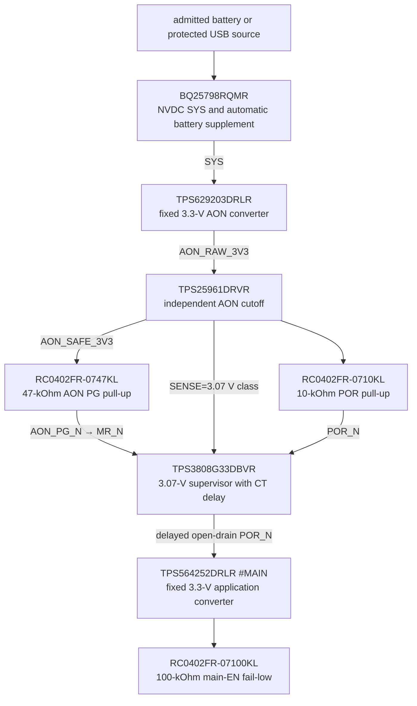

# PWR-0019 — exact source sequence and input-power reserve

- Статус: **Проведено ревью paper sequence/calculation; transition HIL open**
- Дата: 2026-08-18
- Finding: [`FND-0084`](../findings/FND-0084-abstract-main-source-sequencer.md)
- Decision: [`DEC-0080`](../decisions/DEC-0080-exact-aon-pg-por-main-sequence.md)
- Propagation review: [`REV-0005AK`](../reviews/REV-0005AK-source-sequence-propagation.md)
- Source frontend: [`PWR-0004`](PWR-0004-accepted-usb-pd-front-end.md)
- Rail tree: [`PWR-0008`](PWR-0008-exact-downstream-rail-tree.md)
- Post-buck containment: [`PWR-0020`](PWR-0020-independent-post-buck-containment.md)

## Boundary

This pass closes the previously abstract circuit between source validity,
`AON_SAFE_3V3` and `3V3_MAIN`. It also turns the accepted statement “system
load reduces charging” into a conservative calculable admission rule.

It does not claim measured switchover time, conversion efficiency, thermal
headroom or USB-only full-performance operation from a weak fallback source.
Those remain named prototype tests.

## Exact non-programmable sequence

The source boundary is already fail-closed:

- a rejected/missing cell pair stays outside `BQ25798 BAT` behind the
  MAX17320-controlled common-drain FET pair;
- raw USB VBUS cannot reach BQ until TPS25751 loads a valid image and enables
  its protected PPHV path;
- therefore `BQ25798 SYS` is itself the hardware result of one valid source,
  not a software declaration.

`SYS` directly enables AON. Under the later `DEC-0081` containment amendment,
the converter creates `AON_RAW_3V3` and `TPS25961DRVR` admits
`AON_SAFE_3V3`. `TPS629203.PG`, with the exact 47-kOhm pull-up sourced only
from protected AON, drives `TPS3808.MR_N`; the supervisor simultaneously
observes protected AON on SENSE.
Either PG low or SENSE below the G33 threshold asserts RESET. Only after both
recover and the exact CT delay expires does `POR_N` become high impedance.

## Main-enable level calculation

The open-drain supervisor output needs a pull-up, while main EN must remain low
if the pull-up/AON source is absent. Equal 10-kOhm values would form a 1:1
divider and produce only 1.65 V. The corrected exact pair is:

| Function | Exact MPN | Value |
|---|---|---:|
| POR pull-up to AON | `RC0402FR-0710KL` | 10 kOhm ±1% |
| main-EN fail-low | `RC0402FR-07100KL` | 100 kOhm ±1% |

Nominal release is `3.3 × 100/(100+10) = 3.00 V`. At the 3.07-V G33
valid-rail boundary and adverse 1% corners, the released node is about
`2.79 V`, leaving more than 1.5 V above the `TPS564252` 1.25-V maximum rising
threshold. When RESET asserts, the supervisor sinks roughly 0.33 mA through
the 10-kOhm pull-up and holds EN below the converter's 1.10-V maximum falling
threshold. TI requires an open-drain RESET pull-up no smaller than 10 kOhm;
the exact value meets that rule.

The path uses no MCU and no new unique BOM MPN. Main remains powered during a
latched STOP once AON is valid; STOP separately holds all compute resets and TX
gates safe. AON brownout instead asserts POR and removes main power.

## Source-transition truth table

| Source state/event | Hardware result | Admission/firmware result |
|---|---|---|
| no admitted battery, no valid USB image/source | no BQ SYS; AON/main off | no retry that can raise a rail |
| admitted battery only | pack FET and BQ BATFET support SYS; AON→POR→main sequence | allowed modes bounded by loaded cell/thermal evidence |
| valid USB only | TPS PPHV and BQ converter support SYS; same AON→POR→main sequence | bounded service profile must fit the negotiated source |
| valid USB plus admitted battery | USB is preferred; BQ may charge surplus power | system load wins over charging |
| system demand exceeds USB input | BQ first reduces charge, then automatically enters battery supplement | UI records DPM/supplement; no repeated TX escalation |
| USB removed with admitted battery | BQ BATFET/supplement keeps SYS if the pack can carry it | charge becomes zero; session revalidates source/thermal headroom |
| USB removed without admitted battery | SYS/AON fall; supervisor asserts POR and safety pulls win | best-effort logging only; no promise of graceful shutdown |
| cell removed while valid USB remains | pack protection opens/removes charge path; USB may retain SYS | battery identity becomes invalid; charging and battery-only modes blocked |
| PG/SENSE/brownout fault | POR low, main off, AON safety outputs fail-safe | no software override |

Automatic battery supplement is a BQ25798 hardware function: when input power
cannot support SYS after charge current reaches zero, BATFET enters ideal-diode
operation and progressively turns fully on. Firmware observes and budgets it;
it does not synthesize the switchover.

## Conservative input-power rule

Typical efficiency curves are not guaranteed minima. Until board HIL provides
a qualified map, admission reserves 15% of the negotiated input power for the
TPS protected path, BQ conversion and uncertainty:

`Pusable = 0.85 × Vcontract × Icontract`

`Psys_budget = max(declared scenario budget, telemetry estimate + margin)`

`Icharge <= min(2 A, max(0, (Pusable - Psys_budget) / Vpack))`

Missing/stale contract, voltage, current, temperature or DPM evidence makes
`Icharge = 0`. The 2-A exact-cell ceiling can never be raised by this formula.
The following table uses the best 5-V fallback case of 3 A; a Default/1.5-A
source is recalculated from its actual advertisement.

| Contract | Raw input | 85% usable | Max charge at 8.4 V and zero SYS load | SYS headroom while charging 2 A | Max charge with 12-W SYS budget |
|---|---:|---:|---:|---:|---:|
| 5 V / 3 A | 15 W | 12.75 W | 1.52 A | impossible (`-4.05 W`) | 0.09 A |
| 9 V / 3 A | 27 W | 22.95 W | 2.00-A cap | 6.15 W | 1.30 A |
| 15 V / 2 A | 30 W | 25.50 W | 2.00-A cap | 8.70 W | 1.61 A |

The 5-V/12-W row has only 0.75 W left and mathematically permits about
0.089 A; production policy may round such small headroom down to zero to avoid
control chatter. Full 2-A charge is therefore not promised during a heavy
system session even from the 30-W PDO. This is the intended system-first NVDC
behavior, not a lost product mode.

## Fault and HIL boundaries

The paper sequence contains every active contact and pull value, but it does
not replace measurements:

| Test | Required trace/pass result |
|---|---|
| cold battery admission | SYS, AON, PG/MR, SENSE, POR, main EN/PG rise in order; TX gates never pulse |
| USB 5/9/15-V attach | no main enable before valid TPS image/PPHV/BQ SYS; contract current respected |
| USB removal | admitted pack supplements without reset where its load profile permits; absent/rejected pack produces prompt POR |
| weak source/DPM | charge falls before SYS; optional loads shed before uncontrolled brownout |
| cell removal/bounce | no cross-charge, retry storm or stale battery identity; USB-only service remains bounded |
| AON PG/SENSE fault | POR/main EN assert low at the real thresholds; external safe pulls dominate |
| repeated transition | no latch chatter, partial-power backfeed or hot component; fresh arm required after session invalidation |

Primary sources:

- [TI BQ25798 datasheet](https://www.ti.com/lit/ds/symlink/bq25798.pdf)
- [TI TPS629203 datasheet](https://www.ti.com/lit/ds/symlink/tps629203.pdf)
- [TI TPS3808 datasheet](https://www.ti.com/lit/ds/symlink/tps3808.pdf)
- [TI TPS564252 datasheet](https://www.ti.com/lit/ds/symlink/tps564252.pdf)

## Review result

Exact source-to-AON-to-main sequencing, all associated physical devices,
logic-level margins, failure direction and conservative input/charge-power
calculation receive **«Проведено ревью»**. Transition timing, conversion loss,
load-step, source-removal and thermal behavior remain explicit HIL. No KiCad
start is authorized.
