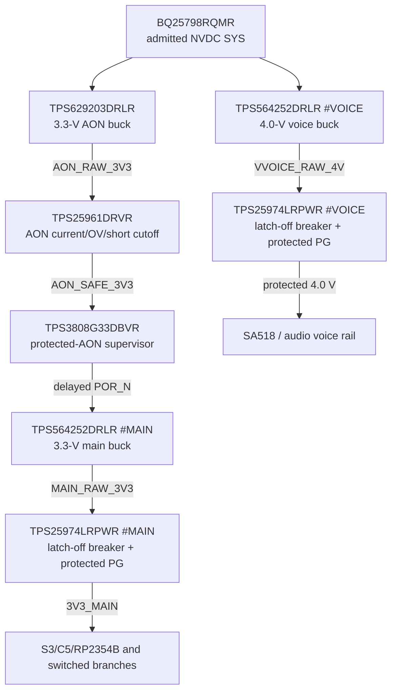

# PWR-0020 — independent post-buck containment

- Статус: **Проведено ревью paper calculation/single-fault behavior; HIL open**
- Дата: 2026-08-18
- Finding: [`FND-0085`](../findings/FND-0085-uncontained-internal-buck-high-side-short.md)
- Decision: [`DEC-0081`](../decisions/DEC-0081-independent-internal-rail-containment.md)
- Propagation review: [`REV-0005AL`](../reviews/REV-0005AL-internal-rail-containment-propagation.md)
- Source sequence: [`PWR-0019`](PWR-0019-exact-source-sequence-and-power-reserve.md)
- Rail tree: [`PWR-0008`](PWR-0008-exact-downstream-rail-tree.md)

## Boundary

This pass asks whether one failed internal buck switch can overvoltage an AON,
main or voice consumer. It adds an independent post-converter cutoff to each
rail and reviews exact contacts, thresholds, loss and single-fault direction.

It does not claim measured trip energy, stability through the added load step,
hot-copper temperature or survival of an injected destructive switch short.
Those remain explicit prototype HIL gates.

## Accepted topology

External 5 V retains the already accepted `TPS259470LRPWR` boundary and is
unchanged by this pass.

## Exact parts and contacts

| Rail | Exact active MPN | Exact settings | Protected-side energy/evidence |
|---|---|---|---|
| AON | `TPS25961DRVR` | `RC0402FR-07240KL` ILIM; `RC0402FR-07196KL` / `RC0402FR-07100KL` OVLO; `C1005X7R1H104K050BB` input bypass | `GRM188R60J106ME47D`; existing buck PG pull-up and `TPS3808` SENSE/POR are sourced from protected AON |
| main | `TPS25974LRPWR` | `RC0402FR-071K65L` ILM; `GRM155R71H472KA01D` dVdt; `GRM1555C1H121JA01D` ITIMER; `RT0402BRD07191KL` / `RT0402BRD07100KL` OVLO | `RC0402FR-0745K3L` / `RC0402FR-0730KL` PGTH; `GRM188R60J106ME47D`; PG feeds the common fault contract |
| voice | `TPS25974LRPWR` | `RC0402FR-073K32L` ILM; `GRM155R71H472KA01D` dVdt; `GRM1555C1H121JA01D` ITIMER; `RC0402FR-07270KL` / `RC0402FR-07100KL` OVLO | `RC0402FR-0768KL` / `RC0402FR-0733KL` PGTH; `GRM188R60J106ME47D`; PG enters the existing enable-qualified fault stage |

The exact packages expose every used contact. `TPS25961DRVR` uses OUT, OVLO,
ILIM, GND/exposed pad, EN/UVLO and IN. Each `TPS25974LRPWR` uses EN/UVLO,
OVLO, PG, PGTH, IN, OUT, DVDT, GND, ILM and ITIMER. There is no fictional or
module-internal pin in the machine map.

## Threshold calculations

### AON

The 240-kOhm ILIM resistor gives approximately 0.208 A nominal, above the AON
startup/load target and below the converter's 0.3-A capability. The
196-kOhm/100-kOhm, 1% OVLO divider, including the TPS25961 threshold corners,
cuts between approximately 3.505 and 3.809 V. That is above the qualified
3.3-V converter range and below the recorded 4.0-V absolute maximum of the
tightest AON consumer.

TPS25961 is auto-retry internally. Overcurrent/thermal recovery attempts are
therefore hardware-bounded rather than latch-off; a persistent raw
overvoltage remains disconnected because OVLO remains asserted. The AON
supervisor sees only the protected output and cannot release main between
unsustained recovery attempts. AON has no firmware-controlled eFuse enable.

### Main

`1.65 kOhm` sets the TPS25974 circuit-breaker threshold to 3.2 A minimum,
3.48 A typical and 3.715 A maximum, preserving the accepted 3.0-A main
load-step. The 0.1% `191/100 kOhm` OVLO divider produces a full-corner cutoff
window of approximately 3.438…3.578 V: above the prior 3.424-V worst-case
regulated output and below the 3.6-V load boundary.

The 45.3/30-kOhm PGTH divider qualifies the protected rail near 3.0 V. A
4.7-nF DVDT capacitor gives approximately 0.70 V/ms, or 4.7 ms to 3.3 V.
The 120-pF ITIMER gives approximately 0.09 ms nominal overload time while the
separate fast-trip path remains active at roughly twice the breaker limit.

### Voice

`3.32 kOhm` sets 1.55 A minimum, 1.73 A typical and 1.905 A maximum, above the
accepted 1.5-A transient. The 270/100-kOhm OVLO divider cuts at approximately
4.314…4.610 V. The 68/33-kOhm PGTH divider qualifies the protected voice rail
near 3.67 V. The same 4.7-nF slew capacitor gives about 5.7 ms to 4.0 V, and
the 120-pF timer keeps the same bounded overload delay.

## Series loss and quiescent burden

TPS25974 is 9.8 mOhm typical and 18.3 mOhm maximum at 25 °C. The table is a
paper silicon-only bound and excludes copper/connectors:

| Rail/load | Typical series loss | 25-°C maximum-Ron loss |
|---|---:|---:|
| main 2.5 A continuous | 61.3 mW | 114.4 mW |
| main 3.0 A transient | 88.2 mW | 164.7 mW |
| voice 1.25 A continuous | 15.3 mW | 28.6 mW |
| voice 1.5 A transient | 22.1 mW | 41.2 mW |

TPS25974 quiescent input is about 0.41 mA typical; divider burden keeps the
non-load overhead in the low-milliwatt range. The TPS25961 low-voltage/
low-current datasheet condition nearest the selected profile is about
455 mOhm, not its 12-V headline value: as a conservative paper proxy it drops
about 13.6 mV and dissipates about 0.41 mW at the amended representative
30-mA transient load. Its
130-uA typical quiescent current adds roughly 0.43 mW.
Hot-Ron and board temperature remain measured gates, not inferred guarantees.

## Single-fault review

| Injected single fault | Hardware direction | Remaining proof |
|---|---|---|
| buck high-side switch short | raw output rises; independent OVLO opens before protected load can follow SYS | destructive HIL trip peak/energy and load survival |
| buck low-side/output short | converter current protection plus post-buck current/thermal cutoff removes or bounds load energy | short waveforms and restart behavior |
| eFuse open | protected rail is absent; PG/POR/fault evidence stays fail-safe | boot and diagnostic UX |
| eFuse pass FET short | converter still regulates normally; one fault alone does not create OV; converter remains the first protective layer | two-fault case is outside single-fault claim but may be explored destructively |
| OVLO top resistor open | protection threshold can move permissive, but the healthy converter still regulates; no single fault raises the rail | open-circuit HIL and DFM inspection |
| OVLO bottom resistor open | OVLO rises and shuts the rail off | power-cycle recovery trace |
| ILIM/ILM open or short | TPS25974 detects both fail-safe; TPS25961 open moves toward minimum limiting and its maximum remains bounded by the AON converter | injected-component HIL |
| DVDT open/short | startup slew changes; current/OV fast protection remains | inrush and startup trace |
| ITIMER open/short | overload delay changes toward prompt cutoff; fast-trip remains independent | exact pin-fault behavior HIL |
| PG/PGTH divider fault or PG stuck | may lose/misreport diagnostic evidence but cannot bridge the series cutoff | fault-line truth table HIL |
| AON supervisor fault | independent AON eFuse still limits voltage/current; existing fail-low POR paths remain reviewed separately | combined startup/fault HIL |

No protected output is connected to its raw counterpart by a pull-up, test
point, peripheral or alternate source. Raw main/voice converter PG points are
fixture-only and must never be interpreted as operational load-good evidence.

## Source handover and recovery

The new boundaries are downstream of `BQ25798 SYS`, so battery/USB selection,
supplement mode and the 85% system-first charge-power rule in `PWR-0019` do not
change. A source transition that keeps SYS inside converter input limits keeps
the same rail sequence. Loss of protected AON collapses PG/SENSE/POR and
therefore main enable even if `AON_RAW_3V3` remains present.

Main/voice TPS25974 faults latch. Voice recovery removes and reapplies its raw
rail through the existing STOP-dominant domain enable after the fault has been
logged and the scenario revalidated. Main has no application-level rail cycle,
so its latched trip requires complete source removal and a fresh hardware
source-admission cycle. AON TPS25961 instead owns its bounded hardware
auto-retry; firmware cannot request, accelerate or interpret a brief recovery
as valid before PG/SENSE/CT settle. Firmware has no direct eFuse-enable or
reset path.

## Cost and HIL gates

At the checked 100-piece distributor class, two TPS25974 devices contribute
about USD 1.59 and TPS25961 about USD 0.45. Exact passives and placement bring
the estimated increment to roughly USD 2.4 per board. This is not a dramatic
budget increase relative to preventing a single converter failure from
overvolting every consumer on its rail, and it adds no GPIO or product mode.

| HIL gate | Required result |
|---|---|
| cold/loaded startup | protected rise follows dVdt; main/voice PG asserts only after the protected threshold; no reset/TX pulse |
| 0→continuous→transient load | rail stays in tolerance at accepted load; no nuisance trip or unacceptable temperature |
| hard output short | main/voice current/fast-trip/time-latch direction matches the exact device; AON retries only at the TPS25961 hardware interval and never releases main without sustained PG/SENSE/CT |
| injected raw overvoltage/high-side-short fixture | protected peak/energy stays within every consumer limit; cutoff survives safely |
| battery/USB attach/remove/supplement | no new dropout, chatter or partial-power backfeed across the eFuses |
| hot chamber + worst copper | case/junction estimate and rail drop retain margin at continuous load |
| every passive open/short and PG fault | observed result matches the single-fault table and operational software never trusts raw PG |

Primary sources:

- [TI TPS2597 datasheet](https://www.ti.com/lit/ds/symlink/tps2597.pdf)
- [TI TPS2596 datasheet](https://www.ti.com/lit/ds/symlink/tps2596.pdf)
- [TI TPS629203 datasheet](https://www.ti.com/lit/ds/symlink/tps629203.pdf)
- [TI TPS564252 datasheet](https://www.ti.com/lit/ds/symlink/tps564252.pdf)

## Review result

The exact independent topology, real contacts, threshold windows, paper loss,
failure direction, source relationship and recovery authority receive
**«Проведено ревью»**. Measured thermal, transient, destructive-fault and
source-transition evidence remain named HIL gates. No KiCad start is
authorized.
