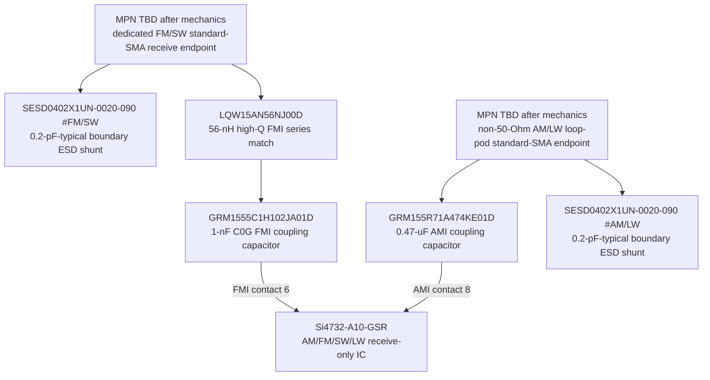

# RXF-0001 — exact Si4732 dual-input receive frontend

- Статус: **Проведено ревью paper subblock; RF/mechanical HIL open**
- Finding: [`FND-0101`](../findings/FND-0101-si4732-rf-inputs-remained-abstract.md)
- Pin-map correction: [`FND-0102`](../findings/FND-0102-si4732-soic16-contact-map-was-shifted.md)
- Решение: [`DEC-0096`](../decisions/DEC-0096-exact-si4732-dual-input-rf-endpoint.md)
- Machine source: `hardware/architecture/devices.json`, `hardware/architecture/candidates/G2F-3I.json`

## Exact receive-only topology

Every box is one physical device or one explicitly unresolved mechanical
connector. The two `SESD0402X1UN-0020-090` boxes are two separately placed
parts, not a shared device. Each anode returns by the shortest dedicated RF/ESD
geometry. `RFGND` is exact Si4732 physical contact 7 and remains a short local
RF return.

## Exact device and band boundary

The exact `Si4732-A10-GSR` is a 16-lead SOIC receive-only device. Its published
input contacts and bands are:

| Input | Physical contact | Product path | Published receive band |
|---|---:|---|---|
| `FMI` | 6 | `RX-FM/SW` | FM 64–108 MHz; SW 2.3–26.1 MHz |
| `RFGND` | 7 | local RF return | common input reference |
| `AMI` | 8 | `RX-AM/LW` | AM 520–1710 kHz; LW 153–279 kHz |

There is no RF switch between FMI and AMI and no transmitter in this block.
The existing switched receiver rail, reset, I²C isolation, interrupt isolation,
clock and audio endpoint remain unchanged. Consequently this correction uses no
GPIO, slow-I/O line, rail or TX-safety channel.

## FM/SW first target

At the exposed FM/SW boundary, one exact `SESD0402X1UN-0020-090` shunts ESD
with 0.2-pF typical / 0.25-pF maximum device capacitance. The signal then passes
through:

1. `LQW15AN56NJ00D`, 56 nH ±5%, Q at least 25 at 200 MHz, SRF at least
   2.8 GHz;
2. `GRM1555C1H102JA01D`, 1 nF ±5%, 50 V, C0G, placed at FMI.

This is the first-pass **FM** FMI whip topology taken from current Si47xx family
antenna guidance. The exact A10 data short also assigns SW to FMI, but the
56-nH/1-nF reference circuit alone does not prove SW sensitivity. AN383's
separate SW-on-AMI example is explicitly limited to Si4734/35 and is not
transferred to this device. The current `SMA-W100RX2` antenna shortlist starts
at 25 MHz, so the 2.3–25-MHz portion of SW remains unclaimed until the complete
Si4732/FMI/feed/antenna path is measured.

## AM/LW loop-pod boundary

The AM/LW boundary has its own ESD body and exact
`GRM155R71A474KE01D` 0.47-uF ±10%, 10-V X7R coupling capacitor at AMI.
Although mechanics previously selected the same standard-SMA connector family,
this is deliberately **not a generic 50-Ohm coax port**.

The first external accessory is a short direct-plug ferrite loop. Its complete
inductance, self-capacitance, connector and enclosure contribution are tuned by
HIL around the family-guidance 180–450-uH order of magnitude. An alternate
external air loop may use about 10–20 uH followed by a physically remote
1:5…1:7 transformer, again subject to complete-port measurement. Arbitrary
long coax is prohibited because its capacitance consumes the AMI tuning budget.
Permanent labels must distinguish `FM/SW` from `AM/LW LOOP — NON-50Ω`.

## Source applicability and procurement

The exact data short is authoritative for the Si4732 physical contact map and
assigns FM/SW to FMI plus AM/LW to AMI. `AN383` is a family antenna-interface
note, not a production reference layout for `Si4732-A10`; its FM circuit is a
starting point and its Si4734/35-only SW circuit is inapplicable as direct proof.
`AN332` documents common receive firmware components, but that does not transfer
antenna performance by prose. The complete exact specimen, band edges,
overload, sensitivity and pod remain HIL gates.

The exact tape-and-reel `Si4732-A10-GSR` is JLCPCB/LCSC `C2155558` and was
available for SMT assembly with minimum quantity one at the 2026-08-18 check.
It replaces the then-out-of-stock tube `C1526102` without changing silicon,
footprint or contacts. The exact 56-nH inductor, 1-nF capacitor and 0.47-uF
capacitor were also active with authorized-distributor stock. The already-used
ESD SKU is populated twice. This adds five inexpensive positions, no new IC
family and no meaningful power or product-cost increase.

## Runtime and acceptance boundary

Firmware must select exactly one of `FM`, `SW`, `AM` or `LW`, retain its
physical port identity in recordings/scans, and never label an unmeasured
antenna/pod profile qualified. Receiver-off keeps the digital/power boundary
discharged and isolated; the passive protected receive inputs do not back-power
the IC and cannot create a TX lease.

Before product acceptance, HIL must cover both exact RF contacts and all four
bands, sensitivity/overload/noise, ESD transparency, AM/LW inductance and total
parasitics, wrong-accessory behavior, power cycling, scan/RDS/audio/optional
owner-supplied SSB patch, every valid active signal group and maximum scheduled
digital traffic. Exact two connector MPNs remain a mechanical-selection gate.

## Sources

- [Skyworks Si4732-A10 data short](https://www.skyworksinc.com/-/media/Skyworks/SL/documents/public/data-shorts/Si4732-A10-short.pdf)
- [Skyworks AN383 Si47xx antenna, schematic and layout guidance](https://www.skyworksinc.com/-/media/Skyworks/SL/documents/public/application-notes/AN383.pdf)
- [Skyworks AN332 programming guide](https://www.skyworksinc.com/-/media/Skyworks/SL/documents/public/application-notes/AN332.pdf)
- [Murata LQW15 RF-inductor family](https://www.murata.com/en-global/products/inductor/chip/overview/lineup/rf2)
- [Murata GRM1555C1H102JA01 exact product](https://www.murata.com/en-us/products/productdetail?partno=GRM1555C1H102JA01%23)
- [Littelfuse SESD ultra-low-capacitance TVS datasheet](https://www.littelfuse.com/assetdocs/littelfuse-tvs-diode-array-sesd-ultra-low-capacitance-discrete-tvs-datasheet?assetguid=645e7b6b-8305-497f-b62b-24df676c444e)
- [JLCPCB/LCSC C2155558 Si4732-A10-GSR assembly part](https://jlcpcb.com/partdetail/SILICONLABS-SI4732_A10GSR/C2155558)
