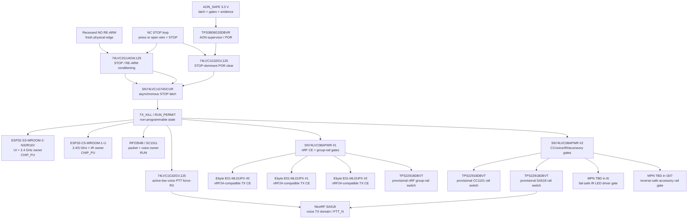
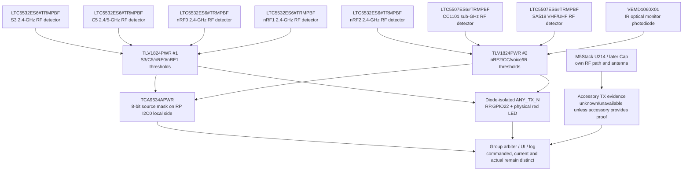

# SAFE-0001 — AON hard STOP и per-path actual-TX evidence

- Статус: **Проведено ревью пререквизитов; owner decision открыт**
- Дата проверки: 2026-08-17
- Internal step: [`INT-0001/I2`](INT-0001-internal-design-closure-sequence.md)
- Finding: [`FND-0071`](../findings/FND-0071-hard-stop-and-tx-evidence-coverage.md)
- Proposal: [`IMP-0050`](../improvements/IMP-0050-aon-stop-and-per-path-tx-evidence.md)
- Inputs: `DEC-0003`, `DEC-0024`, `DEC-0045/0046`, `RES-0001`, `G2F-3I`

## Review boundary

Этот артефакт выбирает проверяемую логическую схему и exact first-target
components, но ещё не является schematic/BOM freeze. Passive values, RF
couplers/taps, detector matching, thresholds, rail current/reverse blocking,
LED/connector mechanics и measured latency остаются названными downstream
gates. Никакой из этих пробелов не замаскирован словом «detector».

## Непрограммируемая STOP-топология

`AON_SAFE` — отдельная 3.3-V safety rail, доступная до application rails. Она
питает supervisor/latch/gates, physical critical indicators и analog evidence
chain, чтобы STOP не выключал собственное доказательство прекращения TX.
Её постоянная нагрузка и hold-up входят в `I3` power budget. Нормально-замкнутый
STOP loop при нажатии или обрыве асинхронно устанавливает защёлку. Отдельная
утопленная normally-open кнопка создаёт новый re-arm edge; firmware, I²C и
expander в этой цепи отсутствуют.

The D input of `SN74LVC1G74DCUR` is fixed low. `STOP_ASSERT` drives active-low
asynchronous preset; re-arm is the clock. Supervisor clear is combined as
`CLR_N = POR_N OR STOP_ASSERT`, so STOP wins instead of asserting preset and
clear together. `Q=TX_KILL`, `/Q=RUN_PERMIT`. Loss of `AON_SAFE` cannot be a
run command: every reset, gate and switched-rail enable receives its own
off-safe pull and the safety logic itself is powered only by `AON_SAFE`.

The two quad AND devices provide independent active-high gates for 3×nRF CE,
nRF group rail, CC rail, voice rail, IR driver and external-accessory rail.
The separate OR forces active-low voice `PTT_N` high/RX before or together with
voice-rail removal. Integrated S3/C5 radios are killed by `CHIP_PU`; RP `RUN`
also drops because RP directly owns most external transmitters.

## Нормативная truth table

| Event/state | Latch/result | Required visible/system result |
|---|---|---|
| cold power, STOP released | supervisor clears `TX_KILL`; normal boot | every TX request/lease remains `OFF/DISARMED` |
| STOP pressed or NC loop opened | async preset sets `TX_KILL` | all three compute domains reset; gates/rails/PTT go safe without software |
| STOP released | latch remains set | no boot and no restored TX |
| fresh RE-ARM edge after STOP release | D=0 clocks latch clear | new normal boot, still TX-off; no old target/channel/power/session/lease |
| RE-ARM held while STOP active | async preset dominates | release of STOP does not clear latch; a new edge is required |
| brownout/AON loss | outputs fall to off-safe pulls | reset/off; after valid restore only a new TX-off boot is allowed |
| I²C/software/expander failure | no effect on kill path | physical STOP and aggregate indication remain available |

Power cycle remains an allowed physical re-arm per `DEC-0024`, but it never
restores an old TX lease. Short-to-ground of the STOP input is a separate
fault-injection case: the NC loop is fail-safe for contact/wire opening, not a
claim of complete dual-fault tolerance.

## Eight independent evidence channels

Seven onboard RF transmit paths plus IR receive independent sensors. Their
open-drain comparator outputs remain individually readable and are also
diode-isolated into a physical `ANY_TX` LED and direct `RP.GPIO22 /
RP_ANY_TX_N`. Thus a stuck MCU or I²C bus cannot hide aggregate transmission;
the I²C expander adds source attribution rather than creating the safety fact.

The seven RF detector ICs, two comparators, IR front end and physical
indicators remain on `AON_SAFE`; otherwise a killed application/radio rail
could erase the evidence before RF decay is observed. `TCA9534APWR` is placed
on the product/local side of the RP I²C0 boundary,
before the external `TCA4307` isolation. It consumes no new MCU pin: the
existing `RP.GPIO22` becomes the real-time aggregate evidence input; source
mask is read over I²C. Existing direct C5/S3 paths may share the corresponding
open-drain evidence node for local timing. `TCA9534A.INT` is not relied upon as
actual state and may remain a test point.

| Channel | Physical evidence | First detector | Arbiter state if unqualified |
|---|---|---|---|
| S3 2.4 GHz | sampled energy after its final RF path | `LTC5532ES6#TRMPBF` | `unknown`, TX profile disabled where proof is mandatory |
| C5 2.4/5 GHz | sampled energy after its final RF path | `LTC5532ES6#TRMPBF` | same |
| nRF0 | own RF sample, never shared with nRF1/2 | `LTC5532ES6#TRMPBF` | same |
| nRF1 | own RF sample | `LTC5532ES6#TRMPBF` | same |
| nRF2 | own RF sample | `LTC5532ES6#TRMPBF` | same |
| CC1101 | own sub-GHz sample | `LTC5507ES6#TRMPBF` | same |
| voice | own VHF/UHF sample | `LTC5507ES6#TRMPBF` | same |
| IR | shielded optical pickup from emitter, not drive current | `VEMD1060X01` | same |
| U214/later accessory | accessory-supplied qualified output only | accessory-profile dependent | explicit `unknown/unavailable` |

The RF ICs are **not** connected directly to PA-level feeds. `I6` must select
a coupler/resistive tap and attenuation that keeps `LTC5532` within
`-32…+10 dBm` and `LTC5507` within `-34…+14 dBm` over all qualified power,
frequency, load and temperature points without degrading the RF path. IR needs
a shielded optical geometry and calculated bias/front end. Comparator
thresholds remain calibration outputs until those circuits are measured.

## Exact first-target register and availability snapshot

Availability was checked because these are now concrete candidate MPNs. It is
a dated engineering snapshot, not a purchasing guarantee or BOM freeze.

| Qty | Exact MPN | Role | Manufacturer status / 2026-08-17 evidence |
|---:|---|---|---|
| 1 | `TPS3808G33DBVR` | 3.3-V AON supervisor/POR | TI ACTIVE; orderable, but observed distributor inventory is modest/volatile |
| 1 | `SN74LVC1G74DCUR` | async preset/clear STOP latch | TI ACTIVE; stocked by major distributors |
| 1 | `74LVC2G14GW,125` | dual Schmitt STOP/re-arm conditioning | Nexperia active; broadly stocked |
| 2 | `74LVC1G32GV,125` | STOP-dominant clear and voice PTT force-RX | Nexperia active; stocked |
| 2 | `SN74LVC08APWR` | eight active-high STOP-dominant gates | TI ACTIVE; stocked |
| provisional | `TPS22918DBVT` | ≤2-A switched TX-domain rail first target | TI ACTIVE; stocked small-reel code; exact branch suitability remains `I3` |
| 5 | `LTC5532ES6#TRMPBF` | 300-MHz…7-GHz RF power detector | ADI PRODUCTION; distributor stock observed |
| 2 | `LTC5507ES6#TRMPBF` | 100-kHz…1-GHz RF power detector | ADI PRODUCTION; distributor stock observed |
| 2 | `TLV1824PWR` | eight low-power open-drain comparator channels | TI ACTIVE; stocked |
| 1 | `TCA9534APWR` | 8-bit evidence source mask | TI ACTIVE; stocked |
| 1 | `VEMD1060X01` | fast 0805 IR photodiode | Vishay active; stocked |
| coupon | `BAT1503WE6327HTSA1` | discrete RF-detector cost-down experiment | Infineon active/preferred, but major-distributor stock was inconsistent; not baseline |

Primary manufacturer evidence:

- [TI TPS3808G33DBVR](https://www.ti.com/product/TPS3808/part-details/TPS3808G33DBVR),
  [SN74LVC1G74DCUR](https://www.ti.com/product/SN74LVC1G74/part-details/SN74LVC1G74DCUR),
  [SN74LVC08APWR](https://www.ti.com/product/SN74LVC08A/part-details/SN74LVC08APWR),
  [TPS22918](https://www.ti.com/product/TPS22918/part-details/TPS22918DBVR),
  [TLV1824PWR](https://www.ti.com/product/TLV1824/part-details/TLV1824PWR) and
  [TCA9534APWR](https://www.ti.com/product/TCA9534A/part-details/TCA9534APWR);
- [Nexperia 74LVC2G14](https://www.nexperia.com/products/analog-logic-ics/logic/buffers-inverters-transceivers/inverters/series/74LVC2G14.html)
  and [74LVC1G32](https://www.nexperia.com/products/analog-logic-ics/logic/gates/or-gates/serie/74lvc1g32/);
- [ADI LTC5532](https://www.analog.com/en/products/ltc5532.html) and
  [LTC5507](https://www.analog.com/en/products/LTC5507.html);
- [Vishay VEMD1060X01](https://www.vishay.com/en/product/84295/);
- [Infineon BAT15-03W](https://www.infineon.com/part/BAT15-03W) and
  [RF detector application note](https://www.infineon.com/dgdl/Infineon-AN_1807_PL32_1808_132434_RF_and_microwave_power_detection-ApplicationNotes-v01_00-EN.pdf?fileId=5546d46265f064ff0166440727be1055e).

## Cost and no-loss comparison

At manufacturers' quoted 1-ku starting prices, 5×LTC5532 plus 2×LTC5507 are
about **USD 17.11**. Two comparators, expander and photodiode add roughly
another **USD 2.8…3.2** at similar volume before passives, RF taps, PCB and
assembly. The evidence electronics therefore add approximately **USD 20** to
the first robust prototype. Prototype single-unit prices will be higher.

A per-path `BAT1503WE6327HTSA1` detector-cell coupon can materially reduce
cost, but it needs band-specific matching, calibration, temperature and
false-state proof. It is a valid zero-loss candidate only after it matches the
same sensitivity/selectivity envelope; using it immediately is schedule risk.
A shared detector or current/command inference is cheaper but loses
source-identification and cannot distinguish simultaneous nRF paths, so it is
not zero-loss.

## Paper exit and downstream proof

After owner decision, `I2` still requires:

1. propagation of accepted devices/nets into `G2F-3I` and all living diagrams;
2. exact reset/gate fan-out, pulls, test points and AON rail budget;
3. cross-check that every TX request and switched rail has one STOP-dominant
   path, with no back-power bypass;
4. an `I3` decision for every load switch/eFuse branch;
5. `I6` coupler/tap/front-end calculations and test coupons;
6. HIL thresholds for asserted/cleared latency, stuck request, brownout,
   open/short loop, false positive/negative, cross-radio desense and leakage.

Until those steps pass, `I2` remains active and no physical detector claim is
promoted from paper candidate to proven product behavior.
