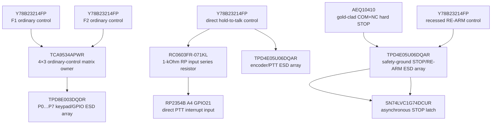

# UI-0002 — exact switch and control-protection endpoint

- Status: **Проведено ревью paper electrical endpoint**
- Prerequisite: [`UI-0001`](UI-0001-complete-local-control-topology.md)
- Finding: [`FND-0092`](../findings/FND-0092-control-switch-current-and-esd-were-abstract.md)
- Decision: [`DEC-0087`](../decisions/DEC-0087-exact-control-switch-and-protection-endpoint.md)
- Machine source: [`G2F-3I.json`](../../../hardware/architecture/candidates/G2F-3I.json)

## Complete retained controls

| Control | Exact first target | Electrical path | Reset/open behavior |
|---|---|---|---|
| D-pad UP/DOWN/LEFT/RIGHT, OK, BACK, OPT, F1, F2 | 9 × `C&K Y78B23214FP` | diode-isolated 4×3 `TCA9534APWR` matrix | all rows low; all columns pulled high; any press asserts interrupt |
| encoder rotation/push | `Alps Alpine EC11E18244AU` | A/B direct S3 PCNT0; push is matrix row 3/column 0 | A/B externally high; push open |
| PTT | 1 × `C&K Y78B23214FP` | 10 kOhm pull-up, 100 nF filter, 1 kOhm series, direct RP GPIO21 | released/open is high and cannot request transmit |
| STOP | 1 × `Panasonic AEQ10410` | AON COM+NC, 10 kOhm pull-up, 10 nF filter, asynchronous latch | pressed, disconnected or open wire is high and asserts STOP |
| RE-ARM | 1 × `C&K Y78B23214FP` | AON NO, 47 kOhm pull-up, 100 nF filter, Schmitt edge | open is high; only a fresh recessed press creates the re-arm edge |

PTT, STOP, RE-ARM, F1 and F2 are separate physical controls. None is removed,
merged with D-pad or delegated to touch/phone input.

## Why the switch targets differ

`Y78B23214FP` is the exact Littelfuse/C&K order code for grounded
`KMR232G ULC LFS`. It is SPST-NO, 3 N, 0.25-mm travel, maximum 3-ms bounce,
300,000 operations and IP40. The decisive property is the ULC floor of 1 uA
at 1.8 V: matrix, PTT and RE-ARM currents remain inside a documented range.
Both contacts on each internally common side are routed; pin 5 bonds the metal
shell to the corresponding ground domain.

Hard STOP cannot use the NO tactile part and cannot rely on an under-driven
ordinary microswitch. `AEQ10410` is SPDT with gold-clad sliding contacts,
100-uA-at-3-V minimum range, 1.2-N maximum force, at least 2.5-mm NC
overtravel and IP40. COM+NC gives the required fail-open loop. At nominal
3.3 V the exact 10-kOhm pull-up produces about 0.33 mA, more than three times
its documented 100-uA floor. Its unused NO throw is physically left open.

## Protection and default-state circuit

The diagram is deliberately vertical and keeps each physical device in its own
box. `TPD8E003DQDR` dedicates IO1…IO8 to P0…P7, including the reserved growth
pad. One `TPD4E05U06DQAR` protects encoder A/B and PTT, leaving one signal
channel unused. A separate instance protects STOP and RE-ARM and returns both
ground contacts directly to safety ground; ordinary-control surge current is
not injected into the AON input pair.

## Exact passives

| Path | Pull-up | Filter | Series |
|---|---|---|---|
| PTT | `Yageo RC0402FR-0710KL`, 10 kOhm | `TDK C1005X7R1H104K050BB`, 100 nF | `Yageo RC0603FR-071KL`, 1 kOhm into RP GPIO21 |
| STOP | `Yageo RC0402FR-0710KL`, 10 kOhm to `AON_SAFE_3V3` | `Murata GRM155R71H103KA88D`, 10 nF | none; asynchronous Schmitt/OR inputs |
| RE-ARM | `Yageo RC0402FR-0747KL`, 47 kOhm to `AON_SAFE_3V3` | `TDK C1005X7R1H104K050BB`, 100 nF | none; Schmitt edge only |

The approximately 1-ms PTT release constant is only a first hardware filter;
firmware still debounces press/release and must revoke a request on loss. The
10-nF STOP capacitor must not create a firmware-timed dependency: STOP remains
an asynchronous hardware path.

## Availability and cost boundary

Availability was checked only because these MPNs are now selected:

- exact `Y78B23214FP`: 41,878 shown in stock at the checked authorized Mouser
  page;
- exact `AEQ10410`: 982 shown in stock at the checked authorized Mouser page,
  about USD 2.60 at quantity 1000;
- exact `TPD8E003DQDR`: 3,906 shown in stock at DigiKey, about USD 0.46 at
  quantity 1000.

The eleven tactile switches, one STOP switch and protection arrays replace
mandatory `MPN TBD` positions; they are not new functions. Final factory
quotation, alternate-source equivalence and cost reduction belong to I8.

## Physical/HIL residue

- button cap/plunger coupling, 3-N feel and multi-key ergonomics;
- AEQ10410 guard, chassis mounting, prescribed travel, short harness/strain
  relief and enclosure sealing;
- recessed RE-ARM access and unmistakable separation from STOP/PTT;
- IEC gun tests with measured return current and no false release/re-arm;
- bounce, stuck contact, open/short wire and ESD fault injection;
- installed-U214 encoder/button access.

This endpoint closes switch current, exact contact identity, default state and
protection on paper. It does not freeze button placement or authorize KiCad.
