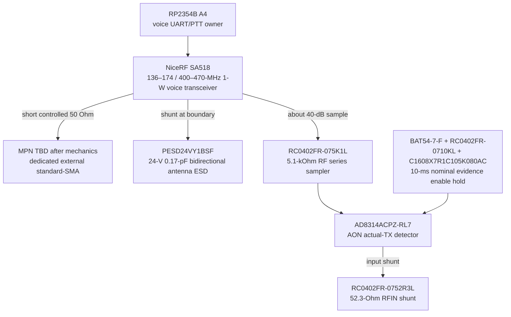

# VRF-0001 — exact SA518 broadband RF endpoint

- Статус: **Проведено ревью paper subblock; conducted/HIL open**
- Finding: [`FND-0099`](../findings/FND-0099-sa518-rf-feed-and-evidence-were-not-electrically-closed.md)
- Решение: [`DEC-0094`](../decisions/DEC-0094-exact-sa518-broadband-rf-endpoint.md)
- Machine source: `hardware/architecture/devices.json`, `hardware/architecture/candidates/G2F-3I.json`

## Цель подблока

Закрыть реальными деталями путь от физического `SA518 ANT` contact 7 до
защищённой 50-Ом границы одного внешнего standard-SMA и actual-TX evidence,
не вводя внешние filters или RF switch без измеренной необходимости.

## Exact physical chain

| Function | Exact MPN / physical instances | Paper result |
|---|---|---|
| module | `NiceRF SA518`, specification v1.1 | contact 7 is documented 50-Ω ANT; 136–174 and 400–470 MHz, 29–31 dBm high / 26–27.5 dBm low at 4.0 V |
| mainline | controlled-50-Ω PCB geometry | no switch, coupler or invented matching loss is placed in the 1-W path |
| external ESD | `PESD24VY1BSF` | shunt 24-V bidirectional, 0.17-pF typical antenna protection at the connector boundary |
| sample series | `RC0402FR-075K1L` | exact 5.1-kΩ high-power series attenuation body |
| detector input | `RC0402FR-0752R3L` | exact 52.3-Ω shunt dominates AD8314 input impedance and makes the tap predictable |
| detector | `AD8314ACPZ-RL7` | same 100-MHz…2.7-GHz measurement-mode SKU as nRF/CC, but a separate physical body |
| evidence support | `GRM1555C1H121JA01D`, `C1005X7R1H104K050BB`, `BAT54-7-F`, `C1608X7R1C105K080AC`, `RC0402FR-0710KL` | exact response filter, bypass and finite enable hold survive commanded rail collapse |

## Voltage, loss and protection checks

- At 31 dBm into 50 Ω: `P = 1.259 W`, `Vrms = 7.93 V`, `Vpeak = 11.22 V`.
- At first-order 2:1 VSWR, `|Γ| = 1/3`; voltage antinode is approximately
  `11.22 × (1 + 1/3) = 14.96 V`, still below 24-V stand-off.
- The 5.1-kΩ + 52.3-Ω tap ratio is approximately `52.3/(5100+52.3)`, or
  `−39.9 dB`. It maps 26…31 dBm to about −14…−9 dBm equivalent at RFIN,
  within AD8314's typical −45…0-dBm range.
- A roughly 5.15-kΩ shunt branch on a 50-Ω line has first-order insertion
  loading near 0.04 dB. PCB parasitics, resistor HF behavior and detector
  tolerance remain measured gates, not guaranteed by this arithmetic.

## Why there is no external band switch/filter yet

The module specification presents ANT as the completed 50-Ω RF port and says
the module integrates MCU, transceiver and PA with minimal external parts. A
dual-ended VHF/UHF filter bank would add two RF switches, loss, cost and the
last free P05 without current evidence that it is needed. The first prototype
therefore measures the direct path. Any failure of spurious, harmonic,
return-loss or sensitivity limits automatically reopens this subblock for
exact filter branches; passing evidence keeps the simpler lower-loss design.

## Runtime and failure contract

1. A voice TX lease names band, channel, power, antenna identity, region and
   expiry; wrong/unknown VHF/UHF antenna keeps rail and PTT disarmed.
2. Enable-hold is armed before the protected 4-V rail rises. Module identity,
   configuration and ready state must pass before PTT can assert.
3. During commanded PTT, missing AD8314 evidence is a hard fault and PTT/rail
   are revoked. Evidence never authorizes a transmission.
4. Because the tap is non-directional, strong inbound RF may assert it. Such a
   state only delays quiet confirmation or reports `external-RF-present`.
5. Shutdown forces PTT to RX, waits for evidence quiet, removes the voice rail
   and retains the detector for the bounded hold window. Timeout is a fault.

## Remaining gates

- specimen identity and all physical SA518 contacts;
- final SMA MPN, enclosure return, strain relief and separate labelled VHF/UHF antennas;
- VNA insertion/return loss and TVS transparency/mismatch behavior;
- detector threshold/no-false-negative proof for both bands and H/L power;
- output, sensitivity, deviation, harmonics, spurious, EIRP and legal profiles;
- coexistence/desense/no-stall HIL against every other signal group.

## Sources

- [NiceRF SA518 specification v1.1](https://www.nicerf.com/pdf/sa518-1w-uv-dual-frequency-walkie-talkie-module-v1.1.pdf)
- [Analog Devices AD8314 datasheet](https://www.analog.com/media/en/technical-documentation/data-sheets/ad8314.pdf)
- [Nexperia PESD24VY1BSF product page](https://www.nexperia.com/product/PESD24VY1BSF)
- [Nexperia PESD24VY1BSF short datasheet](https://assets.nexperia.com/documents/short-data-sheet/PESD24VY1BSF_SDS.pdf)
- [Yageo RC0402FR-075K1L product specification](https://www.yageogroup.com/component-documentation/download/specsheet/RC0402FR-075K1L)
- [DigiKey RC0402FR-075K1L listing](https://www.digikey.com/en/products/detail/yageo/RC0402FR-075K1L/726624)

