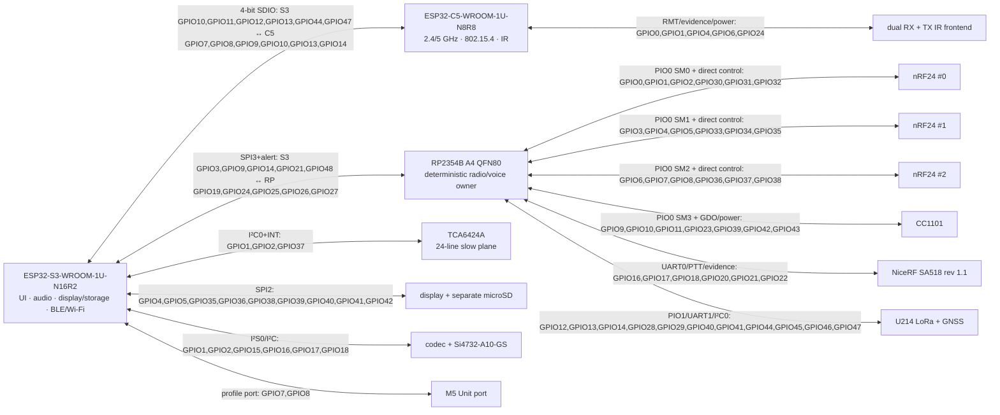

# G2F-3I — generated principled pinout atlas

- Статус: **машинная принципиальная распиновка ведущего paper candidate; не target architecture**
- Source of truth: `hardware/architecture/devices.json` and `hardware/architecture/candidates/G2F-3I.json`
- Regenerate: `python3 hardware/architecture/generate.py --write`
- Verify: `python3 hardware/architecture/generate.py --check`

> Файл сгенерирован. Ручные изменения будут отвергнуты `--check`.

## Как читать артефакт

Диаграмма — навигатор по owners и физически независимым interface groups.
Нормативные pin/net значения находятся в следующих за ней таблицах и
получены из того же JSON. `abstract:*` означает зарезервированную функцию,
для которой exact peripheral MPN/electrical circuit ещё не принят; это не
разрешение рисовать вымышленный pin в KiCad.

## Принципиальная структура owners и pin groups

## Сводный pin budget

| Domain | Exact exposed boundary | Used | Reserved | Free | Total |
|---|---|---:|---:|---:|---:|
| `s3` | `ESP32-S3-WROOM-1U-N16R2` | 31 | 3 | 2 | 36 |
| `c5` | `ESP32-C5-WROOM-1U-N8R8` | 14 | 6 | 1 | 21 |
| `rp` | `RP2354B A4 (exact A4 order/lot identity required before BOM freeze)` | 48 | 0 | 0 | 48 |
| `slow_io` | `TCA6424ARGJR` | 23 | 1 | 0 | 24 |

`RP=0 free` является текущим честным результатом после direct quiet-state
controls `NRF_GROUP_PWR_EN` и `CC_PWR_EN`, а не ошибкой округления. Новый
direct RP endpoint требует явного remap/review; service pins SWD/USB/RUN/
BOOTSEL не входят в GPIO budget и остаются выведенными независимо.

## Ещё абстрактные electrical endpoints

Следующие функции имеют pin reservation, но не exact production MPN/circuit:

- `RX-AM-LW-loop-pod`
- `RX-FM-SW-SMA-front-end`
- `S3-actual-RF-TX-detector`
- `UI_COL0`
- `UI_COL1`
- `UI_COL2`
- `UI_ROW0`
- `UI_ROW1`
- `UI_ROW2`
- `accessory-present`
- `all-TX-enables-and-rails`
- `audio-selector-0`
- `audio-selector-1`
- `codec-enable`
- `codec-receiver-left`
- `codec-receiver-right`
- `codec-voice-audio-in`
- `codec-voice-audio-out`
- `display-reset`
- `exact QSPI display controller D0`
- `exact QSPI display controller D1`
- `exact QSPI display controller D2`
- `exact QSPI display controller D3`
- `exact carrier-learning IR receiver`
- `exact display controller`
- `exact display/backlight driver`
- `exact mono codec`
- `exact robust-demod IR receiver`
- `fail-safe IR LED driver`
- `i2c-mode-strap`
- `independent C5 actual-TX detector`
- `independent IR optical-current detector`
- `independent actual-TX detector`
- `latched-hard-stop`
- `latched-hard-stop-sense`
- `microsd-load-switch`
- `off-safe CC1101 load switch`
- `off-safe IR frontend load switch`
- `off-safe common nRF load switch`
- `physical PTT switch`
- `power-current-thermal-fault`
- `protected configurable M5 Unit contact`
- `protected-accessory-power-good`
- `protected-external-5v-enable`
- `qualified-32k-clock`
- `receiver-power-reset-isolation`
- `service USB connector`
- `service fixture`
- `touch-reset`
- `touch/codec internal I2C`
- `voice-power-reset-domain`
- `voice-update-fixture`

Эти строки блокируют final schematic/BOM, но не нарушают проверенную
арифметику MCU pins. Их нельзя молча удалить либо объявить реализованными.

## Exact pin/net tables

### `s3` — `ESP32-S3-WROOM-1U-N16R2`

| Contact | Physical pad | Net | Dir | Controller | Exact/abstract peers | Strap/reset proof |
|---|---:|---|---|---|---|---|
| `GPIO1` | 39 | `SYS_I2C_SDA` | `io` | `I2C0` | `slow_io.SDA`, `receiver.SDIO`, `abstract:touch/codec internal I2C` | — |
| `GPIO2` | 38 | `SYS_I2C_SCL` | `o` | `I2C0` | `slow_io.SCL`, `receiver.SCLK`, `abstract:touch/codec internal I2C` | — |
| `GPIO3` | 15 | `RP_ALERT_N` | `i` | `GPIO_IRQ` | `rp.GPIO19` | RP is held reset/high-Z through S3 strap sampling; an external pull fixes the accepted S3 boot state |
| `GPIO4` | 4 | `DISPLAY_SD_SPI_D1` | `io` | `SPI2` | `sd.DAT0`, `abstract:exact QSPI display controller D1` | — |
| `GPIO5` | 5 | `SD_SPI_CS_N` | `o` | `SPI2` | `sd.CD_DAT3` | — |
| `GPIO7` | 7 | `UNIT_SIG0` | `io` | `I2C1_OR_UART0_OR_GPIO` | `abstract:protected configurable M5 Unit contact` | — |
| `GPIO8` | 12 | `UNIT_SIG1` | `io` | `I2C1_OR_UART0_OR_GPIO` | `abstract:protected configurable M5 Unit contact` | — |
| `GPIO9` | 17 | `S3_RP_IPC_CS_N` | `o` | `SPI3` | `rp.GPIO25` | — |
| `GPIO10` | 18 | `S3_C5_SDIO_CLK` | `o` | `SDMMC_SLOT1_4BIT` | `c5.GPIO9` | — |
| `GPIO11` | 19 | `S3_C5_SDIO_CMD` | `io` | `SDMMC_SLOT1_4BIT` | `c5.GPIO10` | — |
| `GPIO12` | 20 | `S3_C5_SDIO_D0` | `io` | `SDMMC_SLOT1_4BIT` | `c5.GPIO8` | — |
| `GPIO13` | 21 | `S3_C5_SDIO_D1` | `io` | `SDMMC_SLOT1_4BIT` | `c5.GPIO7` | — |
| `GPIO14` | 22 | `S3_RP_IPC_MISO` | `i` | `SPI3` | `rp.GPIO27` | — |
| `GPIO15` | 8 | `I2S_BCLK` | `o` | `I2S0` | `abstract:exact mono codec` | — |
| `GPIO16` | 9 | `I2S_WS` | `o` | `I2S0` | `abstract:exact mono codec` | — |
| `GPIO17` | 10 | `I2S_DOUT` | `o` | `I2S0` | `abstract:exact mono codec` | — |
| `GPIO18` | 11 | `I2S_DIN` | `i` | `I2S0` | `abstract:exact mono codec` | — |
| `GPIO19` | 13 | `S3_USB_DM` | `io` | `USB_SERIAL_JTAG` | `abstract:service USB connector` | — |
| `GPIO20` | 14 | `S3_USB_DP` | `io` | `USB_SERIAL_JTAG` | `abstract:service USB connector` | — |
| `GPIO21` | 23 | `S3_RP_IPC_MOSI` | `o` | `SPI3` | `rp.GPIO24` | — |
| `GPIO35` | 28 | `DISPLAY_SD_SPI_SCK` | `o` | `SPI2` | `sd.CLK`, `abstract:exact display controller` | — |
| `GPIO36` | 29 | `DISPLAY_SD_SPI_D0` | `o` | `SPI2` | `sd.CMD`, `abstract:exact QSPI display controller D0` | — |
| `GPIO37` | 30 | `SLOW_IO_INT_N` | `i` | `GPIO_IRQ` | `slow_io.INT` | — |
| `GPIO38` | 31 | `LCD_CS_N` | `o` | `SPI2` | `abstract:exact display controller` | — |
| `GPIO39` | 32 | `LCD_DC` | `o` | `GPIO` | `abstract:exact display controller` | — |
| `GPIO40` | 33 | `LCD_BL_PWM` | `o` | `LEDC` | `abstract:exact display/backlight driver` | — |
| `GPIO41` | 34 | `LCD_QSPI_D2` | `o` | `SPI2` | `abstract:exact QSPI display controller D2` | — |
| `GPIO42` | 35 | `LCD_QSPI_D3` | `o` | `SPI2` | `abstract:exact QSPI display controller D3` | — |
| `GPIO44` | 36 | `S3_C5_SDIO_D2` | `io` | `SDMMC_SLOT1_4BIT` | `c5.GPIO14` | — |
| `GPIO47` | 24 | `S3_C5_SDIO_D3` | `io` | `SDMMC_SLOT1_4BIT` | `c5.GPIO13` | — |
| `GPIO48` | 25 | `S3_RP_IPC_SCK` | `o` | `SPI3` | `rp.GPIO26` | — |

Budget: **31 used + 3 reserved + 2 free = 36 exposed GPIO**.
Reserved: `GPIO0`, `GPIO45`, `GPIO46`. Free: `GPIO6`, `GPIO43`.

### `c5` — `ESP32-C5-WROOM-1U-N8R8`

| Contact | Physical pad | Net | Dir | Controller | Exact/abstract peers | Strap/reset proof |
|---|---:|---|---|---|---|---|
| `GPIO0` | 6 | `IR_RX_DEMOD` | `i` | `RMT_RX0` | `abstract:exact robust-demod IR receiver` | — |
| `GPIO1` | 7 | `IR_RX_CARRIER` | `i` | `RMT_RX1` | `abstract:exact carrier-learning IR receiver` | — |
| `GPIO4` | 17 | `IR_FRONTEND_PWR_EN` | `o` | `GPIO` | `abstract:off-safe IR frontend load switch` | — |
| `GPIO6` | 8 | `IR_TX_CARRIER` | `o` | `RMT_TX0` | `abstract:fail-safe IR LED driver` | — |
| `GPIO7` | 9 | `S3_C5_SDIO_D1` | `io` | `SDIO_SLAVE_4BIT` | `s3.GPIO13` | external pull-up and documented SDIO edge profile are verified before runtime ownership |
| `GPIO8` | 10 | `S3_C5_SDIO_D0` | `io` | `SDIO_SLAVE_4BIT` | `s3.GPIO12` | — |
| `GPIO9` | 11 | `S3_C5_SDIO_CLK` | `i` | `SDIO_SLAVE_4BIT` | `s3.GPIO10` | — |
| `GPIO10` | 12 | `S3_C5_SDIO_CMD` | `io` | `SDIO_SLAVE_4BIT` | `s3.GPIO11` | — |
| `GPIO11` | 25 | `C5_UART_SERVICE_TX` | `o` | `UART0` | `abstract:service fixture` | — |
| `GPIO12` | 24 | `C5_UART_SERVICE_RX` | `i` | `UART0` | `abstract:service fixture` | — |
| `GPIO13` | 13 | `S3_C5_SDIO_D3` | `io` | `SDIO_SLAVE_4BIT` | `s3.GPIO47` | — |
| `GPIO14` | 14 | `S3_C5_SDIO_D2` | `io` | `SDIO_SLAVE_4BIT` | `s3.GPIO44` | — |
| `GPIO23` | 21 | `C5_RF_TX_EVIDENCE` | `i` | `GPIO_IRQ` | `abstract:independent C5 actual-TX detector` | — |
| `GPIO24` | 23 | `IR_TX_EVIDENCE` | `i` | `GPIO_IRQ` | `abstract:independent IR optical-current detector` | — |

Budget: **14 used + 6 reserved + 1 free = 21 exposed GPIO**.
Reserved: `GPIO2`, `GPIO3`, `GPIO25`, `GPIO26`, `GPIO27`, `GPIO28`. Free: `GPIO5`.

### `rp` — `RP2354B A4 (exact A4 order/lot identity required before BOM freeze)`

| Contact | Physical pad | Net | Dir | Controller | Exact/abstract peers | Strap/reset proof |
|---|---:|---|---|---|---|---|
| `GPIO0` | 77 | `NRF0_CSN_N` | `o` | `GPIO` | `nrf0.CSN` | — |
| `GPIO1` | 78 | `NRF0_CE` | `o` | `GPIO` | `nrf0.CE` | — |
| `GPIO2` | 79 | `NRF0_IRQ_N` | `i` | `GPIO_IRQ` | `nrf0.IRQ` | — |
| `GPIO3` | 80 | `NRF1_CSN_N` | `o` | `GPIO` | `nrf1.CSN` | — |
| `GPIO4` | 1 | `NRF1_CE` | `o` | `GPIO` | `nrf1.CE` | — |
| `GPIO5` | 2 | `NRF1_IRQ_N` | `i` | `GPIO_IRQ` | `nrf1.IRQ` | — |
| `GPIO6` | 3 | `NRF2_CSN_N` | `o` | `GPIO` | `nrf2.CSN` | — |
| `GPIO7` | 4 | `NRF2_CE` | `o` | `GPIO` | `nrf2.CE` | — |
| `GPIO8` | 6 | `NRF2_IRQ_N` | `i` | `GPIO_IRQ` | `nrf2.IRQ` | — |
| `GPIO9` | 7 | `CC_CSN_N` | `o` | `GPIO` | `cc.CSN` | — |
| `GPIO10` | 8 | `CC_GDO0` | `i` | `GPIO_IRQ` | `cc.GDO0` | — |
| `GPIO11` | 9 | `CC_GDO2` | `i` | `GPIO_IRQ` | `cc.GDO2` | — |
| `GPIO12` | 11 | `U214_BUSY` | `i` | `GPIO_IRQ` | `u214.LORA_BUSY` | — |
| `GPIO13` | 12 | `U214_IRQ` | `i` | `GPIO_IRQ` | `u214.LORA_IRQ` | — |
| `GPIO14` | 13 | `U214_RST_N` | `o` | `GPIO` | `u214.LORA_RST` | — |
| `GPIO15` | 14 | `NRF_GROUP_PWR_EN` | `o` | `GPIO` | `abstract:off-safe common nRF load switch` | — |
| `GPIO16` | 16 | `VOICE_UART_TX` | `o` | `UART0` | `voice.UART_RX` | — |
| `GPIO17` | 17 | `VOICE_UART_RX` | `i` | `UART0` | `voice.UART_TX` | — |
| `GPIO18` | 18 | `VOICE_PTT_N` | `o` | `GPIO` | `voice.PTT` | — |
| `GPIO19` | 19 | `RP_ALERT_N` | `od` | `GPIO_IRQ` | `s3.GPIO3` | — |
| `GPIO20` | 20 | `VOICE_ACTIVITY` | `i` | `GPIO_IRQ` | `voice.AUDIO_ON` | — |
| `GPIO21` | 21 | `PTT_BUTTON_N` | `i` | `GPIO_IRQ` | `abstract:physical PTT switch` | — |
| `GPIO22` | 22 | `VOICE_TX_EVIDENCE` | `i` | `GPIO_IRQ` | `abstract:independent actual-TX detector` | — |
| `GPIO23` | 23 | `CC_PWR_EN` | `o` | `GPIO` | `abstract:off-safe CC1101 load switch` | — |
| `GPIO24` | 25 | `S3_RP_IPC_MOSI` | `i` | `SPI1_IPC` | `s3.GPIO21` | — |
| `GPIO25` | 26 | `S3_RP_IPC_CS_N` | `i` | `SPI1_IPC` | `s3.GPIO9` | — |
| `GPIO26` | 27 | `S3_RP_IPC_SCK` | `i` | `SPI1_IPC` | `s3.GPIO48` | — |
| `GPIO27` | 28 | `S3_RP_IPC_MISO` | `o` | `SPI1_IPC` | `s3.GPIO14` | — |
| `GPIO28` | 36 | `U214_I2C_SDA_IN` | `io` | `I2C0_EXT` | `u214_i2c_iso.SDAIN` | — |
| `GPIO29` | 37 | `U214_I2C_SCL_IN` | `o` | `I2C0_EXT` | `u214_i2c_iso.SCLIN` | — |
| `GPIO30` | 38 | `NRF0_MISO` | `i` | `PIO0_SM0_RF_SPI` | `nrf0.MISO` | — |
| `GPIO31` | 39 | `NRF0_SCK` | `o` | `PIO0_SM0_RF_SPI` | `nrf0.SCK` | — |
| `GPIO32` | 40 | `NRF0_MOSI` | `o` | `PIO0_SM0_RF_SPI` | `nrf0.MOSI` | — |
| `GPIO33` | 42 | `NRF1_MISO` | `i` | `PIO0_SM1_RF_SPI` | `nrf1.MISO` | — |
| `GPIO34` | 43 | `NRF1_SCK` | `o` | `PIO0_SM1_RF_SPI` | `nrf1.SCK` | — |
| `GPIO35` | 44 | `NRF1_MOSI` | `o` | `PIO0_SM1_RF_SPI` | `nrf1.MOSI` | — |
| `GPIO36` | 45 | `NRF2_MISO` | `i` | `PIO0_SM2_RF_SPI` | `nrf2.MISO` | — |
| `GPIO37` | 46 | `NRF2_SCK` | `o` | `PIO0_SM2_RF_SPI` | `nrf2.SCK` | — |
| `GPIO38` | 47 | `NRF2_MOSI` | `o` | `PIO0_SM2_RF_SPI` | `nrf2.MOSI` | — |
| `GPIO39` | 48 | `CC_MISO` | `i` | `PIO0_SM3_RF_SPI` | `cc.SO_GDO1` | — |
| `GPIO40` | 49 | `U214_GPS_TX` | `o` | `UART1` | `u214.GPS_RX` | — |
| `GPIO41` | 52 | `U214_GPS_RX` | `i` | `UART1` | `u214.GPS_TX` | — |
| `GPIO42` | 53 | `CC_SCK` | `o` | `PIO0_SM3_RF_SPI` | `cc.SCLK` | — |
| `GPIO43` | 54 | `CC_MOSI` | `o` | `PIO0_SM3_RF_SPI` | `cc.SI` | — |
| `GPIO44` | 55 | `U214_MISO` | `i` | `PIO1_SM0_EXT_SPI` | `u214.MISO` | — |
| `GPIO45` | 56 | `U214_SCK` | `o` | `PIO1_SM0_EXT_SPI` | `u214.SCK` | — |
| `GPIO46` | 57 | `U214_MOSI` | `o` | `PIO1_SM0_EXT_SPI` | `u214.MOSI` | — |
| `GPIO47` | 58 | `U214_NSS_N` | `o` | `GPIO` | `u214.NSS` | — |

Budget: **48 used + 0 reserved + 0 free = 48 exposed GPIO**.
Reserved: none. Free: none.

### Fixed-function/control routes

| Net | From | To | Reset/safety rule |
|---|---|---|---|
| `U214_I2C_SDA_OUT` | `u214_i2c_iso.SDAOUT` | `u214.SDA` | hot-swap isolation and stuck-low recovery keep the external branch off the controller-side domain |
| `U214_I2C_SCL_OUT` | `u214_i2c_iso.SCLOUT` | `u214.SCL` | hot-swap isolation and stuck-low recovery keep the external branch off the controller-side domain |
| `U214_I2C_ISO_EN` | `abstract:protected-accessory-power-good` | `u214_i2c_iso.EN` | off until protected accessory power is stable |
| `U214_I2C_READY` | `u214_i2c_iso.READY` | `slow_io.P16` | read-only status; no safety function depends on firmware polling |
| `UI_ROW0` | `slow_io.P00` | `abstract:UI_ROW0` | diode-isolated 3x3 ordinary-key matrix; reset input-safe |
| `UI_ROW1` | `slow_io.P01` | `abstract:UI_ROW1` | diode-isolated 3x3 ordinary-key matrix; reset input-safe |
| `UI_ROW2` | `slow_io.P02` | `abstract:UI_ROW2` | diode-isolated 3x3 ordinary-key matrix; reset input-safe |
| `UI_COL0` | `slow_io.P03` | `abstract:UI_COL0` | diode-isolated 3x3 ordinary-key matrix; reset input-safe |
| `UI_COL1` | `slow_io.P04` | `abstract:UI_COL1` | diode-isolated 3x3 ordinary-key matrix; reset input-safe |
| `UI_COL2` | `slow_io.P05` | `abstract:UI_COL2` | diode-isolated 3x3 ordinary-key matrix; reset input-safe |
| `LCD_RST_N` | `slow_io.P06` | `abstract:display-reset` | external reset-safe pull |
| `TOUCH_RST_N` | `slow_io.P07` | `abstract:touch-reset` | external reset-safe pull |
| `CODEC_EN` | `slow_io.P10` | `abstract:codec-enable` | external off-safe pull |
| `AUDIO_SEL0` | `slow_io.P11` | `abstract:audio-selector-0` | external muted-safe pull |
| `AUDIO_SEL1` | `slow_io.P12` | `abstract:audio-selector-1` | external muted-safe pull |
| `VOICE_DOMAIN_EN` | `slow_io.P13` | `abstract:voice-power-reset-domain` | off-safe pull; exact circuit gates the qualified 4 V rail and holds the module TX-safe during sequencing |
| `VOICE_PD_N` | `abstract:voice-power-reset-domain` | `voice.PD` | off-safe sequencer keeps the exact module in power-down until the qualified 4 V rail is valid |
| `VOICE_HL` | `slow_io.P14` | `voice.HL` | external conservative-power pull |
| `VOICE_UPDATE` | `voice.UPDATE` | `abstract:voice-update-fixture` | fixture-only; no runtime drive until the rev-1.1 direction/description conflict is resolved by specimen proof |
| `VOICE_MIC_IN` | `abstract:codec-voice-audio-out` | `voice.MIC_IN` | AC-coupled and limited by the exact codec/selector circuit |
| `VOICE_AF_OUT` | `voice.AFOUT` | `abstract:codec-voice-audio-in` | muted/isolated before voice rail transitions |
| `RX_DOMAIN_EN` | `slow_io.P15` | `abstract:receiver-power-reset-isolation` | off-safe pull; exact circuit removes receiver power, prevents I2C back-power and supplies reset sequencing |
| `RX_RST_N` | `abstract:receiver-power-reset-isolation` | `receiver.RST` | reset remains asserted until the qualified receiver rail and I2C isolation are valid |
| `RX_STATUS_N` | `receiver.GPO2_INTB` | `slow_io.P24` | exact interrupt source; bounded latency and pulse width remain HIL gates |
| `RX_SENB_I2C` | `abstract:i2c-mode-strap` | `receiver.SENB` | fixed reset strap selects the reviewed two-wire control mode |
| `RX_RCLK` | `abstract:qualified-32k-clock` | `receiver.RCLK` | clock source and startup remain exact electrical gates |
| `RX_AUDIO_L` | `receiver.LOUT_DFS` | `abstract:codec-receiver-left` | muted/AC-coupled by the exact audio selector |
| `RX_AUDIO_R` | `receiver.ROUT_DOUT` | `abstract:codec-receiver-right` | muted/AC-coupled by the exact audio selector |
| `RX_FMI_RF` | `receiver.FMI` | `abstract:RX-FM-SW-SMA-front-end` | dedicated external-SMA whip path; matching/ESD stays close to FMI |
| `RX_AMI_RF` | `receiver.AMI` | `abstract:RX-AM-LW-loop-pod` | dedicated short loop/pod path; generic long coax is not qualified |
| `EXT_5V_EN` | `slow_io.P17` | `abstract:protected-external-5v-enable` | external off-safe pull and current limit |
| `SD_PWR_EN` | `slow_io.P20` | `abstract:microsd-load-switch` | external off-safe pull |
| `SD_CARD_DETECT_N` | `sd.DETECT_A` | `slow_io.P21` | read-only debounced input; socket switch return is tied to the qualified reference domain |
| `STOP_LATCH_SENSE_N` | `abstract:latched-hard-stop-sense` | `slow_io.P22` | sense only; non-programmable hard-stop dominance never depends on this path |
| `S3_RF_TX_EVIDENCE` | `abstract:S3-actual-RF-TX-detector` | `slow_io.P23` | read-only evidence; hard-stop remains non-programmable |
| `POWER_FAULT_N` | `abstract:power-current-thermal-fault` | `slow_io.P25` | hardware protection acts independently; this is diagnostic evidence |
| `ACCESSORY_PRESENT_N` | `abstract:accessory-present` | `slow_io.P26` | read-only, protected and debounced |
| `HARD_STOP_N` | `abstract:latched-hard-stop` | `abstract:all-TX-enables-and-rails` | non-programmable dominance over every MCU and radio/voice/IR TX path |

### Programming, recovery and diagnostics

- `s3`: `EN`, `GPIO0`, `GPIO19`, `GPIO20` — native USB Serial/JTAG plus physical EN/BOOT.
- `c5`: `EN`, `GPIO28`, `GPIO27`, `GPIO11`, `GPIO12` — permanent UART0 plus physical CHIP_PU, BOOT and normal-boot/log strap; native USB pins are intentionally consumed by 4-bit SDIO.
- `rp`: `RUN`, `SWCLK`, `SWDIO`, `USB_DM`, `USB_DP`, `QSPI_SS_USB_BOOT` — independent SWD, RUN, USB and BOOTSEL fixture access.
- `voice`: `UPDATE`, `UART_TX`, `UART_RX`, `PD` — permanent fixture breakout for vendor update/recovery plus UART and hardware power-down; UPDATE drive remains inhibited until exact rev-1.1 direction/timing proof.

### Non-MCU contact accounting

| Instance | Used | Reserved | Free |
|---|---:|---:|---:|
| `slow_io` | 23 | 1 | 0 |

### Interface non-interference contracts

| Resource | Owner | Clients | Sharing | Deadline / bound | Proof gate |
|---|---|---|---|---|---|
| `NRF0_SPI` | `rp` | `nrf0` | dedicated | IRQ serviced before nRF FIFO/transaction deadline under simultaneous peers | PIO0 SM0 plus dedicated DMA/IRQ stress HIL |
| `NRF1_SPI` | `rp` | `nrf1` | dedicated | IRQ serviced before nRF FIFO/transaction deadline under simultaneous peers | PIO0 SM1 plus dedicated DMA/IRQ stress HIL |
| `NRF2_SPI` | `rp` | `nrf2` | dedicated | IRQ serviced before nRF FIFO/transaction deadline under simultaneous peers | PIO0 SM2 plus dedicated DMA/IRQ stress HIL |
| `CC_SPI` | `rp` | `cc` | dedicated | GDO/FIFO service completes without waiting for any nRF or U214 transfer | PIO0 SM3 plus dedicated DMA/IRQ stress HIL |
| `U214_SPI` | `rp` | `u214` | dedicated | LoRa BUSY/IRQ transaction never waits for display or compatibility-radio bus ownership | PIO1 SM0 plus dedicated DMA/IRQ stress HIL |
| `U214_UART` | `rp` | `u214` | dedicated | GNSS receive has continuous hardware UART buffering independent of SPI activity | UART1 DMA/ring overflow stress HIL |
| `U214_I2C` | `rp` | `u214`, `u214_i2c_iso` | dedicated | external stuck-low or hot-plug cannot stall internal UI/audio/receiver I2C | TCA4307 stuck-bus and hot-plug fault-injection HIL |
| `DISPLAY_SD_SPI` | `s3` | `abstract:QSPI display`, `sd` | scheduled; separate CS and per-device modes/clocks; display non-preemptible SPI2 occupancy <=1 ms with byte quantum derived from measured datasheet-valid payload rate; QSPI only while SD CS is high; bounded SD command/data chunks; critical UI priority | critical/menu first visible response <=100 ms and qualified storage >=4.0 MB/s while all radios capture; no radio FIFO or IPC deadline is placed here | direct-QSPI dirty/tiled display, CS-high high-Z/contention proof, 1.5 MB/s record and 250 ms card-stall HIL |
| `S3_RP_IPC` | `s3` | `rp` | dedicated | 20 MHz SPI raw 2.5 MB/s and qualified framed payload >=1.5 MB/s; no display/storage or C5 controller ownership | SPI3 load, alert-to-read <=250 us and aggregate-radio stress HIL |
| `S3_C5_IPC` | `s3` | `c5` | dedicated | 4-bit SDIO at up to 40 MHz with qualified framed payload >=1.5 MB/s and control RTT <=2 ms; no microSD, RP or display controller ownership | single-slot SDMMC/SDIO throughput, control-priority and simultaneous Wi-Fi/802.15.4 load HIL |
| `S3_INTERNAL_I2C` | `s3` | `slow_io`, `abstract:touch`, `abstract:codec`, `receiver` | scheduled; bounded transactions; expander INT only wakes the service loop | ordinary UI/control first visible response <=100 ms; no radio FIFO or PTT deadline is placed here | shortest-pulse, matrix and fault-latency HIL |
| `S3_UNIT_PORT` | `s3` | `abstract:M5 Unit` | dedicated | one selected I2C/UART/GPIO Unit profile cannot be blocked by internal or U214 I2C | profile-switch and external-fault HIL |
| `S3_I2S` | `s3` | `abstract:codec` | dedicated | continuous DMA audio without storage/display service gaps | simultaneous display, SD, C5 and radio event stress HIL |

### Controller GPIO-window selections

| Instance | Controllers | Selected window | Device constraint / reason |
|---|---|---|---|
| `rp` | `PIO0_SM0_RF_SPI`, `PIO0_SM1_RF_SPI`, `PIO0_SM2_RF_SPI`, `PIO0_SM3_RF_SPI` | `GPIO16..GPIO47` | RP2354B PIO0 is fixed to the shared GPIO-base 16 window, so every PIO0 data pin must remain in GPIO16..GPIO47 |
| `rp` | `PIO1_SM0_EXT_SPI` | `GPIO16..GPIO47` | RP2354B PIO1 uses GPIO-base 16 for the U214 data bus |

### Controller/DMA capacity accounting

| Capacity | Instance | Claims | Reserve / available | Basis |
|---|---|---|---:|---|
| `RP_PIO_STATE_MACHINES` | `rp` | nrf0=1, nrf1=1, nrf2=1, cc=1, u214=1 | 7 / 12 | RP2350 provides three PIO blocks with four state machines each; PIO0 consumes four and PIO1 consumes one |
| `RP_DMA_CHANNELS` | `rp` | nrf0 full-duplex PIO SPI=2, nrf1 full-duplex PIO SPI=2, nrf2 full-duplex PIO SPI=2, cc full-duplex PIO SPI=2, u214 full-duplex PIO SPI=2, S3-RP full-duplex SPI1=2, U214 GNSS continuous UART1 RX=1 | 3 / 16 | worst-case persistent allocation leaves three channels for qualified transient/service use; slow UART TX and I2C do not require permanent DMA ownership |
| `S3_GDMA_TX_CHANNELS` | `s3` | display/microSD scheduled SPI2=1, S3-RP SPI3=1, audio I2S0=1 | 2 / 5 | ESP32-S3 has five independent GDMA transmit channels; SD/MMC is not in this GDMA peripheral list |
| `S3_GDMA_RX_CHANNELS` | `s3` | display/microSD scheduled SPI2=1, S3-RP SPI3=1, audio I2S0=1 | 2 / 5 | ESP32-S3 has five independent GDMA receive channels; C5 uses the separate SD/MMC host path |

### Exact fixed-mux contracts

| Contract | Instance/controller | Exact contacts | Datasheet/device proof |
|---|---|---|---|
| `S3_NATIVE_USB` | `s3.USB_SERIAL_JTAG` | `GPIO19`, `GPIO20` | ESP32-S3 native USB D-/D+ fixed contacts on the exact WROOM-1U module |
| `C5_FIXED_SDIO` | `c5.SDIO_SLAVE_4BIT` | `GPIO7`, `GPIO8`, `GPIO9`, `GPIO10`, `GPIO13`, `GPIO14` | ESP32-C5 SDIO slave fixed DAT1/DAT0/CLK/CMD/DAT3/DAT2 mapping; GPIO13/14 therefore cannot be runtime USB |
| `RP_SPI1_IPC` | `rp.SPI1_IPC` | `GPIO24`, `GPIO25`, `GPIO26`, `GPIO27` | RP2354B bank-0 mux group is SPI1 RX/CSn/SCK/TX |
| `RP_UART0_VOICE` | `rp.UART0` | `GPIO16`, `GPIO17` | RP2354B bank-0 mux pair is UART0 TX/RX |
| `RP_UART1_GNSS` | `rp.UART1` | `GPIO40`, `GPIO41` | RP2354B bank-0 mux pair is UART1 TX/RX |
| `RP_I2C0_U214` | `rp.I2C0_EXT` | `GPIO28`, `GPIO29` | RP2354B bank-0 mux pair is I2C0 SDA/SCL |

### Open qualification gaps

- `u214_i2c_iso` uses `TCA4307DGKR` as `reference_only`, not an accepted production choice.
- `nrf0` uses `Ebyte E01-ML01IPX` as `verified_reference`, not an accepted production choice.
- `nrf0` lifecycle: `nrf24_family_not_recommended_for_new_designs`.
- `nrf1` uses `Ebyte E01-ML01IPX` as `verified_reference`, not an accepted production choice.
- `nrf1` lifecycle: `nrf24_family_not_recommended_for_new_designs`.
- `nrf2` uses `Ebyte E01-ML01IPX` as `verified_reference`, not an accepted production choice.
- `nrf2` lifecycle: `nrf24_family_not_recommended_for_new_designs`.
- `voice` lifecycle: `current_product`.
- `receiver` lifecycle: `manufacturer_documented`.
- `slow_io` uses `TCA6424ARGJR` as `reference_only`, not an accepted production choice.
- `sd` lifecycle: `current_manufacturer_page`.
- RP2354B A4 exact lot identity, power/clock/land pattern and prototype assembly remain implementation gates; the verified QFN80 contact map is not a BOM freeze
- E01-ML01S is a geometry/interface reference, not an accepted three-module RF/power/antenna production choice; nRF24 family lifecycle remains not-recommended-for-new-designs
- CC1101 matching, oscillator, antenna path and regional proof are not represented by the bare-IC contact ledger
- TCA6424ARGJR and TCA4307DGKR are real-contact planning references; voltage domains, pulls, address, reset, shortest pulses and exact endpoint MPNs remain electrical/HIL gates
- After DEC-0052 assigns S3 GPIO41/GPIO42 to direct-QSPI D2/D3, S3 retains two free GPIO, C5 one and RP none; slow_io retains P27. GPIO43 remains unassigned until exact-panel TE benefit is proved; any new direct RP endpoint requires an explicit remap and repeated review
- C5 4-bit SDIO has exclusive ownership of the S3 SD/MMC host; C5 native USB is unavailable at runtime, so permanent UART0 plus EN/BOOT/strap contacts is the independent recovery path
- display and microSD are the only scheduled high-rate pair on one SPI2 controller; separate CS/per-device clocks and bounded transactions remove radio impact, but >=4.0 MB/s storage plus <=100 ms visible UI under card stalls remains a mandatory HIL gate
- PIO instruction memory, DMA arbitration latency and SRAM-bank contention remain executable firmware/HIL gates even though the state-machine/channel capacity arithmetic closes with explicit reserve
- DEC-0045 prohibits cross-group simultaneous signal operation but requires all three SG-N24 radios concurrently active in every independent PTX/PRX mix; DEC-0047 selects a qualified internal envelope; N24H-0001 L0 DIV-DIV is pre-HIL only and T1 TARGET must prove exact channel/power/sensitivity points
- SG-N24 3PTX is a real accepted load case, so the exact module choice and packet-rail design must prove simultaneous TX peak/average current, droop, thermal, coupling and STOP at the qualified power profile; a former RX-only hunt budget is insufficient
- DEC-0046 consumes RP GPIO15/GPIO23 and C5 GPIO4 for group-level power gates; exact load-switch/isolator MPNs, discharge, no-back-power sequencing and quiet-state EMI HIL remain open, leaving no free direct RP GPIO
- exact display/touch and codec, IR frontends, power tree, antenna placement and hard-stop circuitry remain open; SA518/Si4732 contact maps are instantiated, while SA518 UPDATE electrical direction/timing and both modules' surrounding power/audio/RF circuits remain specimen/electrical/HIL gates before target-architecture acceptance

## Граница проведённого ревью

Validator доказывает существование реально выведенных compute contacts,
полный used/reserved/free accounting, straps, fixed mux, service paths,
PIO/DMA capacity и независимые radio/IPC resources. Exact peripheral MPN,
signal/power integrity, hard-STOP circuit, RF layout and HIL остаются
следующими gates; этот atlas не разрешает KiCad и не является frozen BOM.
