# G2F-3I — generated principled pinout atlas

- Статус: **машинная принципиальная распиновка ведущего paper candidate; не target architecture**
- Source of truth: `hardware/architecture/devices.json` and `hardware/architecture/candidates/G2F-3I.json`
- Regenerate: `python3 hardware/architecture/generate.py --write`
- Verify: `python3 hardware/architecture/generate.py --check`

> Файл сгенерирован. Ручные изменения будут отвергнуты `--check`.

## Как читать артефакт

Диаграмма — навигатор по owners и физически независимым interface groups.
Она намеренно строится сверху вниз и остаётся живой проекцией текущей
начинки: изменение machine source обязано регенерировать этот atlas и
синхронно обновить обе стартовые диаграммы.
Каждый прямоугольник физического устройства содержит его exact/current
paper MPN и роль. Разные устройства не объединяются в один прямоугольник.
Если production part ещё не выбран, узел явно помечается `MPN TBD`;
пассивная цепь отдельно помечается как circuit, а не как заказной компонент.
Нормативные pin/net значения находятся в следующих за ней таблицах и
получены из того же JSON. `abstract:*` означает зарезервированную функцию,
для которой exact peripheral MPN/electrical circuit ещё не принят; это не
разрешение рисовать вымышленный pin в KiCad.

## Принципиальная структура owners и pin groups

```mermaid
flowchart TD
  subgraph POWER_INPUT["Sink-only USB-PD and replaceable-cell power path"]
  USBC["MPN TBD<br/>product USB-C receptacle: S3 USB2 data and sink-only power"]
  PD_VBUS_TVS["Texas Instruments TVS2200DRVR<br/>22-V flat-clamp VBUS surge protection"]
  PD_CONTROLLER["Texas Instruments TPS25751DREFR<br/>sink-only USB-PD policy and protected high-voltage path"]
  PD_CONFIG_EEPROM["onsemi CAT24C512WI-GT3<br/>dedicated PD patch/configuration EEPROM"]
  NVDC_CHARGER["Texas Instruments BQ25798RQMR<br/>2S-configured buck-boost charger and NVDC system power path"]
  CELL0["MPN TBD<br/>individually replaceable qualified 18650 cell #0"]
  CELL1["MPN TBD<br/>individually replaceable qualified 18650 cell #1"]
  PACKMGR["MPN TBD<br/>2S pair admission, protection, state estimation and balancing"]
  end
  subgraph COMPUTE["Compute owners"]
  S3["ESP32-S3-WROOM-1U-N16R2<br/>application, UI, display/storage, audio, BLE/Wi-Fi owner"]
  C5["ESP32-C5-WROOM-1U-N8R8<br/>2.4/5 GHz, IEEE 802.15.4 and IR owner"]
  RP["RP2354B A4 (exact A4 order/lot identity required before BOM freeze)<br/>deterministic radio and voice owner"]
  end
  subgraph UI_STORAGE["UI and storage devices"]
  DISPLAY["HMX035CTFT-001 (QDtech schematic assembly marking)<br/>3.5-inch QSPI IPS display and capacitive-touch assembly"]
  SD["Hirose DM3AT-SF-PEJM5<br/>push-push microSD card connector"]
  SLOW_IO["TCA6424ARGJR<br/>24-line slow-control and UI expander"]
  end
  subgraph AUDIO_PATH["Broadcast, voice and fail-safe audio devices"]
  RECEIVER["Si4732-A10-GS<br/>AM/FM/SW/LW broadcast receiver"]
  MONOSUM["MPN-independent passive circuit<br/>Si4732 stereo-to-mono summing network"]
  AUDIO_RX_MUX["Texas Instruments SN74LVC1G3157DBVR<br/>Si4732/SA518 receive-audio source selector"]
  CAPNET["MPN-independent passive circuit<br/>high-impedance AC/bias capture network"]
  AUDIO_CAPTURE_BUFFER["Texas Instruments TLV9061IDBVR<br/>active high-impedance capture buffer"]
  ADCNET["MPN-independent passive circuit<br/>ES8311 mic-range differential input network"]
  CODEC["Everest Semiconductor ES8311<br/>mono ADC/DAC audio codec"]
  AUDIO_SPEAKER_SELECTOR["Texas Instruments TMUX1136DGSR<br/>dual differential speaker-path selector"]
  SPEAKER_AMP["Diodes Incorporated PAM8302AASCR<br/>mono Class-D speaker amplifier"]
  SPEAKER["MPN TBD<br/>internal loudspeaker"]
  TXATT["MPN-independent passive circuit<br/>35–45 dB codec-to-voice attenuator/filter"]
  AUDIO_TX_SELECTOR["Texas Instruments TS5A63157DCKR<br/>electret/codec transmit-audio selector"]
  MIC["MPN TBD<br/>electret microphone"]
  AUDIO_SAFE_GATE["Texas Instruments SN74LVC2G08DCUR<br/>reset-safe dual selector-request gate"]
  VOICE["NiceRF SA518<br/>VHF/UHF analog voice transceiver"]
  end
  subgraph RADIO_ACCESSORY["Radio and external-accessory devices"]
  NRF0["Ebyte E01-ML01IPX<br/>nRF24-compatible radio #0 compact IPEX reference"]
  NRF1["Ebyte E01-ML01IPX<br/>nRF24-compatible radio #1 compact IPEX reference"]
  NRF2["Ebyte E01-ML01IPX<br/>nRF24-compatible radio #2 compact IPEX reference"]
  CC["CC1101RGPR<br/>sub-GHz transceiver"]
  U214["M5Stack U214 Cap LoRa-1262<br/>external LoRa/GNSS Cap module"]
  U214_I2C_ISO["TCA4307DGKR<br/>external I2C stuck-bus isolator"]
  UNIT["MPN TBD<br/>protected HY2.0-4P M5 Unit connector"]
  end
  subgraph IR_PATH["IR frontend devices"]
  IRDEMOD["MPN TBD (TSOP38238 screened)<br/>38 kHz demodulating IR receiver"]
  IRCARRIER["MPN TBD (TSMP95000 screened)<br/>carrier-learning IR receiver"]
  IRTX["MPN TBD (TSAL6200 screened)<br/>IR transmit LED and fail-safe driver endpoint"]
  end
  subgraph SAFETY_STOP["AON hard-STOP devices"]
  STOPSW["MPN TBD<br/>normally-closed physical STOP control"]
  REARMSW["MPN TBD<br/>normally-open recessed RE-ARM control"]
  SAFE_SUPERVISOR["TPS3808G33DBVR<br/>AON rail supervisor and power-on reset"]
  SAFE_CONDITIONER["74LVC2G14GW,125<br/>STOP and RE-ARM Schmitt conditioner"]
  SAFE_POR_OR["74LVC1G32GV,125<br/>STOP-dominant POR/clear combiner"]
  SAFE_LATCH["SN74LVC1G74DCUR<br/>asynchronous latched hard STOP"]
  SAFE_RESET_BUFFER["SN74LVC3G34DCUR<br/>Ioff three-domain reset fan-out"]
  SAFE_GATE_A["SN74LVC08APWR<br/>four STOP-dominant nRF request gates"]
  SAFE_GATE_B["SN74LVC08APWR<br/>four STOP-dominant rail/IR/accessory gates"]
  SAFE_PTT_OR["74LVC1G32GV,125<br/>active-low voice PTT force-RX gate"]
  STOP_LED["LTST-C190KFKT<br/>orange physical latched-STOP indicator"]
  end
  subgraph TX_EVIDENCE["Per-path physical TX-evidence devices"]
  DET_S3["LTC5532ES6#TRMPBF<br/>S3 2.4-GHz RF power detector"]
  DET_C5["LTC5532ES6#TRMPBF<br/>C5 2.4/5-GHz RF power detector"]
  DET_NRF0["LTC5532ES6#TRMPBF<br/>nRF0 2.4-GHz RF power detector"]
  DET_NRF1["LTC5532ES6#TRMPBF<br/>nRF1 2.4-GHz RF power detector"]
  DET_NRF2["LTC5532ES6#TRMPBF<br/>nRF2 2.4-GHz RF power detector"]
  DET_CC["LTC5507ES6#TRMPBF<br/>CC1101 sub-GHz RF power detector"]
  DET_VOICE["LTC5507ES6#TRMPBF<br/>SA518 VHF/UHF RF power detector"]
  DET_IR["VEMD1060X01<br/>IR optical-evidence photodiode"]
  EVIDENCE_CMP_A["TLV1824PWR<br/>S3/C5/nRF0/nRF1 evidence thresholds"]
  EVIDENCE_CMP_B["TLV1824PWR<br/>nRF2/CC/voice/IR evidence thresholds"]
  EVIDENCE_MASK["TCA9534APWR<br/>eight-bit evidence source mask on local RP I2C0"]
  EVIDENCE_OR_0["BAT54ALT1G<br/>evidence diode-OR pair 0/1"]
  EVIDENCE_OR_1["BAT54ALT1G<br/>evidence diode-OR pair 2/3"]
  EVIDENCE_OR_2["BAT54ALT1G<br/>evidence diode-OR pair 4/5"]
  EVIDENCE_OR_3["BAT54ALT1G<br/>evidence diode-OR pair 6/7"]
  ANY_TX_LED["LTST-C190KRKT<br/>red physical ANY-TX indicator"]
  end
  %% Layout-only invisible spine: these links are not electrical connections.
  USBC ~~~ PD_VBUS_TVS ~~~ PD_CONTROLLER ~~~ PD_CONFIG_EEPROM ~~~ NVDC_CHARGER
  NVDC_CHARGER ~~~ CELL0 ~~~ CELL1 ~~~ PACKMGR ~~~ S3 ~~~ SLOW_IO
  SLOW_IO ~~~ AUDIO_SAFE_GATE ~~~ RECEIVER ~~~ MONOSUM
  MONOSUM ~~~ AUDIO_RX_MUX ~~~ CAPNET ~~~ AUDIO_CAPTURE_BUFFER ~~~ ADCNET
  ADCNET ~~~ CODEC ~~~ AUDIO_SPEAKER_SELECTOR ~~~ SPEAKER_AMP ~~~ SPEAKER
  SPEAKER ~~~ MIC ~~~ TXATT ~~~ AUDIO_TX_SELECTOR ~~~ DISPLAY ~~~ SD ~~~ UNIT
  UNIT ~~~ C5 ~~~ IRDEMOD ~~~ IRCARRIER ~~~ IRTX ~~~ RP
  RP ~~~ NRF0 ~~~ NRF1 ~~~ NRF2 ~~~ CC ~~~ VOICE
  VOICE ~~~ U214_I2C_ISO ~~~ U214 ~~~ STOPSW ~~~ REARMSW
  REARMSW ~~~ SAFE_SUPERVISOR ~~~ SAFE_CONDITIONER ~~~ SAFE_POR_OR ~~~ SAFE_LATCH
  SAFE_LATCH ~~~ SAFE_RESET_BUFFER ~~~ SAFE_GATE_A ~~~ SAFE_GATE_B ~~~ SAFE_PTT_OR ~~~ STOP_LED
  STOP_LED ~~~ DET_S3 ~~~ DET_C5 ~~~ DET_NRF0 ~~~ DET_NRF1 ~~~ DET_NRF2
  DET_NRF2 ~~~ DET_CC ~~~ DET_VOICE ~~~ DET_IR ~~~ EVIDENCE_CMP_A ~~~ EVIDENCE_CMP_B
  EVIDENCE_CMP_B ~~~ EVIDENCE_MASK ~~~ EVIDENCE_OR_0 ~~~ EVIDENCE_OR_1 ~~~ EVIDENCE_OR_2 ~~~ EVIDENCE_OR_3 ~~~ ANY_TX_LED
  USBC -->|"VBUS sink only"| PD_CONTROLLER
  USBC -->|"VBUS shunt"| PD_VBUS_TVS
  USBC <-->|"D-/D+ direct; no PD/charger tap"| S3
  PD_CONTROLLER <-->|"local I²C boot image"| PD_CONFIG_EEPROM
  PD_CONTROLLER <-->|"protected VBUS + local I²C/IRQ"| NVDC_CHARGER
  S3 <-->|"SYS I²C0 + shared wired-low IRQ"| PD_CONTROLLER
  CELL0 --> PACKMGR
  CELL1 --> PACKMGR
  PACKMGR <-->|"qualified supervised 2S boundary"| NVDC_CHARGER
  S3 <-->|"1-bit SDIO: S3 GPIO10,GPIO11,GPIO12,GPIO13 ↔ C5 GPIO7,GPIO8,GPIO9,GPIO10"| C5
  S3 <-->|"SPI3+alert: S3 GPIO3,GPIO9,GPIO14,GPIO21,GPIO48 ↔ RP GPIO19,GPIO24,GPIO25,GPIO26,GPIO27"| RP
  S3 <-->|"I²C0+INT: GPIO1,GPIO2"| SLOW_IO
  S3 -->|"QSPI/touch: GPIO4,GPIO35,GPIO36,GPIO38,GPIO39,GPIO40,GPIO41,GPIO42"| DISPLAY
  S3 <-->|"SPI2: GPIO4,GPIO5,GPIO35,GPIO36"| SD
  S3 <-->|"I²S0/I²C: GPIO1,GPIO2,GPIO15,GPIO16,GPIO17,GPIO18"| CODEC
  S3 <-->|"I²C0"| RECEIVER
  S3 <-->|"profile port: GPIO7,GPIO8"| UNIT
  C5 <-->|"RMT RX0/power: GPIO0,GPIO1,GPIO4,GPIO6,GPIO24"| IRDEMOD
  C5 <-->|"RMT RX1/power"| IRCARRIER
  RP <-->|"PIO0 SM0 + direct control: GPIO0,GPIO1,GPIO2,GPIO30,GPIO31,GPIO32"| NRF0
  RP <-->|"PIO0 SM1 + direct control: GPIO3,GPIO4,GPIO5,GPIO33,GPIO34,GPIO35"| NRF1
  RP <-->|"PIO0 SM2 + direct control: GPIO6,GPIO7,GPIO8,GPIO36,GPIO37,GPIO38"| NRF2
  RP <-->|"PIO0 SM3 + GDO/power: GPIO9,GPIO10,GPIO11,GPIO23,GPIO39,GPIO42,GPIO43"| CC
  RP <-->|"UART0/PTT request: GPIO16,GPIO17,GPIO18,GPIO20,GPIO21"| VOICE
  RP <-->|"PIO1/UART1: GPIO12,GPIO13,GPIO14,GPIO28,GPIO29,GPIO40,GPIO41,GPIO44,GPIO45,GPIO46,GPIO47"| U214
  RP <-->|"I²C0"| U214_I2C_ISO
  U214_I2C_ISO <-->|"isolated external I²C"| U214
  RECEIVER --> MONOSUM --> AUDIO_RX_MUX
  VOICE -->|"AFOUT"| AUDIO_RX_MUX
  SLOW_IO -->|"P27 source request"| AUDIO_RX_MUX
  AUDIO_RX_MUX -->|"analog bypass"| AUDIO_SPEAKER_SELECTOR
  AUDIO_RX_MUX --> CAPNET --> AUDIO_CAPTURE_BUFFER --> ADCNET --> CODEC
  CODEC -->|"OUTP/OUTN"| AUDIO_SPEAKER_SELECTOR
  AUDIO_SPEAKER_SELECTOR --> SPEAKER_AMP --> SPEAKER
  CODEC --> TXATT --> AUDIO_TX_SELECTOR
  MIC --> AUDIO_TX_SELECTOR -->|"MIC_IN"| VOICE
  SLOW_IO -->|"P11/P12 requests"| AUDIO_SAFE_GATE
  S3 -->|"GPIO6 AUDIO_ARM"| AUDIO_SAFE_GATE
  AUDIO_SAFE_GATE --> AUDIO_SPEAKER_SELECTOR
  AUDIO_SAFE_GATE --> AUDIO_TX_SELECTOR
  STOPSW --> SAFE_CONDITIONER --> SAFE_LATCH
  REARMSW --> SAFE_CONDITIONER
  SAFE_SUPERVISOR --> SAFE_POR_OR --> SAFE_LATCH
  STOPSW --> SAFE_POR_OR
  SAFE_LATCH -->|"RUN_PERMIT"| SAFE_RESET_BUFFER
  SAFE_RESET_BUFFER -->|"CHIP_PU"| S3
  SAFE_RESET_BUFFER -->|"CHIP_PU"| C5
  SAFE_RESET_BUFFER -->|"RUN"| RP
  SAFE_LATCH --> SAFE_GATE_A
  SAFE_LATCH --> SAFE_GATE_B
  SAFE_LATCH --> SAFE_PTT_OR
  SAFE_LATCH --> STOP_LED
  RP -->|"3×CE + nRF rail requests"| SAFE_GATE_A
  RP -->|"CC rail request"| SAFE_GATE_B
  C5 -->|"IR carrier request"| SAFE_GATE_B
  SLOW_IO -->|"voice/accessory rail requests"| SAFE_GATE_B
  RP -->|"PTT request"| SAFE_PTT_OR --> VOICE
  SAFE_GATE_A --> NRF0
  SAFE_GATE_A --> NRF1
  SAFE_GATE_A --> NRF2
  SAFE_GATE_B --> CC
  SAFE_GATE_B --> IRTX
  SAFE_GATE_B --> U214
  S3 --> DET_S3 --> EVIDENCE_CMP_A
  C5 --> DET_C5 --> EVIDENCE_CMP_A
  NRF0 --> DET_NRF0 --> EVIDENCE_CMP_A
  NRF1 --> DET_NRF1 --> EVIDENCE_CMP_A
  NRF2 --> DET_NRF2 --> EVIDENCE_CMP_B
  CC --> DET_CC --> EVIDENCE_CMP_B
  VOICE --> DET_VOICE --> EVIDENCE_CMP_B
  IRTX --> DET_IR --> EVIDENCE_CMP_B
  EVIDENCE_CMP_A --> EVIDENCE_MASK
  EVIDENCE_CMP_B --> EVIDENCE_MASK
  EVIDENCE_CMP_A --> EVIDENCE_OR_0
  EVIDENCE_CMP_A --> EVIDENCE_OR_1
  EVIDENCE_CMP_B --> EVIDENCE_OR_2
  EVIDENCE_CMP_B --> EVIDENCE_OR_3
  EVIDENCE_OR_0 --> ANY_TX_LED
  EVIDENCE_OR_1 --> ANY_TX_LED
  EVIDENCE_OR_2 --> ANY_TX_LED
  EVIDENCE_OR_3 --> ANY_TX_LED
  EVIDENCE_MASK <-->|"local I²C0 source mask"| RP
  ANY_TX_LED -->|"RP.GPIO22 RP_ANY_TX_N"| RP
```

## Сводный pin budget

| Domain | Exact exposed boundary | Used | Reserved | Free | Total |
|---|---|---:|---:|---:|---:|
| `s3` | `ESP32-S3-WROOM-1U-N16R2` | 32 | 3 | 1 | 36 |
| `c5` | `ESP32-C5-WROOM-1U-N8R8` | 14 | 6 | 1 | 21 |
| `rp` | `RP2354B A4 (exact A4 order/lot identity required before BOM freeze)` | 48 | 0 | 0 | 48 |
| `slow_io` | `TCA6424ARGJR` | 24 | 0 | 0 | 24 |

`RP=0 free` является текущим честным результатом после direct quiet-state
controls `NRF_GROUP_PWR_EN` и `CC_PWR_EN`, а не ошибкой округления. Новый
direct RP endpoint требует явного remap/review; service pins SWD/USB/RUN/
BOOTSEL не входят в GPIO budget и остаются выведенными независимо.

## Ещё абстрактные electrical endpoints

Следующие функции имеют pin reservation, но не exact production MPN/circuit:

- `AON_SAFE_3V3`
- `AON_SAFE_3V3-via-10k`
- `AON_SAFE_3V3-via-2k2`
- `C5-qualified-RF-tap`
- `CC-qualified-RF-tap`
- `NC-stop-loop-10k-pullup-10nF`
- `NO-rearm-loop-47k-pullup-100nF`
- `NRF0-qualified-RF-tap`
- `NRF1-qualified-RF-tap`
- `NRF2-qualified-RF-tap`
- `RX-AM-LW-loop-pod`
- `RX-FM-SW-SMA-front-end`
- `S3-qualified-RF-tap`
- `TP_EVIDENCE_MASK_INT_N`
- `UI_COL0`
- `UI_COL1`
- `UI_COL2`
- `UI_ROW0`
- `UI_ROW1`
- `UI_ROW2`
- `VOICE-qualified-RF-tap`
- `accessory-present`
- `always-available-quiet-audio-rail`
- `audio-ground`
- `cc-load-switch-enable`
- `codec-adcvref-decoupling`
- `codec-address-high-3v3`
- `codec-audio-ground`
- `codec-dac-to-sa518-35-45db-attenuator`
- `codec-dacvref-decoupling`
- `codec-digital-ground`
- `codec-power-switch-enable`
- `codec-vmid-decoupling`
- `display-ground`
- `electret-microphone-bias-and-ac-coupling`
- `exact carrier-learning IR receiver`
- `exact display/backlight driver`
- `exact robust-demod IR receiver`
- `fail-safe-IR-LED-driver`
- `high-z-ac-coupled-capture-network`
- `i2c-mode-strap`
- `matched-bypass-ac-reference`
- `microsd-load-switch`
- `no-connect`
- `nrf-group-load-switch-enable`
- `off-safe IR frontend load switch`
- `pd-eeprom-factory-scl-pad`
- `pd-eeprom-factory-sda-pad`
- `pd-eeprom-factory-wp-pad`
- `physical PTT switch`
- `power-current-thermal-fault`
- `power-ground`
- `product-usb-c-cc1`
- `product-usb-c-cc2`
- `product-usb-c-vbus`
- `protected configurable M5 Unit contact`
- `protected-accessory-power-good`
- `protected-external-5v-enable`
- `qualified-32k-clock`
- `qualified-backlight-sink`
- `qualified-backlight-supply`
- `qualified-codec-3v3-analog`
- `qualified-codec-3v3-digital`
- `qualified-display-3v3`
- `qualified-es8311-mic-range-differential-input-network`
- `qualified-evidence-threshold-0`
- `qualified-evidence-threshold-1`
- `qualified-evidence-threshold-2`
- `qualified-evidence-threshold-3`
- `qualified-evidence-threshold-4`
- `qualified-evidence-threshold-5`
- `qualified-evidence-threshold-6`
- `qualified-evidence-threshold-7`
- `qualified-speaker-amp-supply`
- `qualified-speaker-enable-default-on`
- `receiver-power-reset-isolation`
- `rx-audio-bypass-and-capture-node`
- `safety-ground`
- `safety-ground-via-10k`
- `service USB connector`
- `service fixture`
- `shielded-ir-evidence-front-end`
- `si4732-10k-left-mono-sum`
- `si4732-10k-right-mono-sum`
- `si4732-passive-mono-sum-output`
- `speaker-negative`
- `speaker-positive`
- `stop-led-series-2k2`
- `voice-power-reset-domain`
- `voice-update-fixture`

Эти строки блокируют final schematic/BOM, но не нарушают проверенную
арифметику MCU pins. Их нельзя молча удалить либо объявить реализованными.

## Exact pin/net tables

### `s3` — `ESP32-S3-WROOM-1U-N16R2`

| Contact | Physical pad | Net | Dir | Controller | Exact/abstract peers | Strap/reset proof |
|---|---:|---|---|---|---|---|
| `GPIO1` | 39 | `SYS_I2C_SDA` | `io` | `I2C0` | `slow_io.SDA`, `receiver.SDIO`, `display.TP_I2C_SDA`, `codec.CDATA`, `pd_controller.I2Ct_SDA` | — |
| `GPIO2` | 38 | `SYS_I2C_SCL` | `o` | `I2C0` | `slow_io.SCL`, `receiver.SCLK`, `display.TP_I2C_SCL`, `codec.CCLK`, `pd_controller.I2Ct_SCL` | — |
| `GPIO3` | 15 | `RP_ALERT_N` | `i` | `GPIO_IRQ` | `rp.GPIO19` | RP is held reset/high-Z through S3 strap sampling; an external pull fixes the accepted S3 boot state |
| `GPIO4` | 4 | `DISPLAY_SD_SPI_D1` | `io` | `SPI2` | `sd.DAT0`, `display.QSPI_D1` | — |
| `GPIO5` | 5 | `SD_SPI_CS_N` | `o` | `SPI2` | `sd.CD_DAT3` | — |
| `GPIO6` | 6 | `AUDIO_ARM` | `o` | `GPIO` | `audio_safe_gate.1B`, `audio_safe_gate.2B` | — |
| `GPIO7` | 7 | `UNIT_SIG0` | `io` | `I2C1_OR_UART1_OR_GPIO` | `abstract:protected configurable M5 Unit contact` | — |
| `GPIO8` | 12 | `UNIT_SIG1` | `io` | `I2C1_OR_UART1_OR_GPIO` | `abstract:protected configurable M5 Unit contact` | — |
| `GPIO9` | 17 | `S3_RP_IPC_CS_N` | `o` | `SPI3` | `rp.GPIO25` | — |
| `GPIO10` | 18 | `S3_C5_SDIO_CLK` | `o` | `SDMMC_SLOT1_1BIT` | `c5.GPIO9` | — |
| `GPIO11` | 19 | `S3_C5_SDIO_CMD` | `io` | `SDMMC_SLOT1_1BIT` | `c5.GPIO10` | — |
| `GPIO12` | 20 | `S3_C5_SDIO_D0` | `io` | `SDMMC_SLOT1_1BIT` | `c5.GPIO8` | — |
| `GPIO13` | 21 | `S3_C5_SDIO_D1_IRQ` | `io` | `SDMMC_SLOT1_1BIT` | `c5.GPIO7` | — |
| `GPIO14` | 22 | `S3_RP_IPC_MISO` | `i` | `SPI3` | `rp.GPIO27` | — |
| `GPIO15` | 8 | `I2S_BCLK` | `o` | `I2S0` | `codec.SCLK` | — |
| `GPIO16` | 9 | `I2S_WS` | `o` | `I2S0` | `codec.LRCK` | — |
| `GPIO17` | 10 | `I2S_DOUT` | `o` | `I2S0` | `codec.DSDIN` | — |
| `GPIO18` | 11 | `I2S_DIN` | `i` | `I2S0` | `codec.ASDOUT` | — |
| `GPIO19` | 13 | `S3_USB_DM` | `io` | `USB_SERIAL_JTAG` | `abstract:service USB connector` | — |
| `GPIO20` | 14 | `S3_USB_DP` | `io` | `USB_SERIAL_JTAG` | `abstract:service USB connector` | — |
| `GPIO21` | 23 | `S3_RP_IPC_MOSI` | `o` | `SPI3` | `rp.GPIO24` | — |
| `GPIO35` | 28 | `DISPLAY_SD_SPI_SCK` | `o` | `SPI2` | `sd.CLK`, `display.QSPI_CLK` | — |
| `GPIO36` | 29 | `DISPLAY_SD_SPI_D0` | `o` | `SPI2` | `sd.CMD`, `display.QSPI_D0` | — |
| `GPIO37` | 30 | `SYS_INT_N` | `i` | `GPIO_IRQ` | `slow_io.INT`, `pd_controller.I2Ct_IRQ` | — |
| `GPIO38` | 31 | `LCD_CS_N` | `o` | `SPI2` | `display.QSPI_CS` | — |
| `GPIO39` | 32 | `LCD_TOUCH_INT` | `i` | `GPIO_IRQ` | `display.TP_INT` | — |
| `GPIO40` | 33 | `LCD_BL_PWM` | `o` | `LEDC` | `abstract:exact display/backlight driver` | — |
| `GPIO41` | 34 | `LCD_QSPI_D2` | `o` | `SPI2` | `display.QSPI_D2` | — |
| `GPIO42` | 35 | `LCD_QSPI_D3` | `o` | `SPI2` | `display.QSPI_D3` | — |
| `GPIO43` | 37 | `S3_UART_SERVICE_TX` | `o` | `UART0` | `abstract:service fixture` | — |
| `GPIO44` | 36 | `S3_UART_SERVICE_RX` | `i` | `UART0` | `abstract:service fixture` | — |
| `GPIO48` | 25 | `S3_RP_IPC_SCK` | `o` | `SPI3` | `rp.GPIO26` | — |

Budget: **32 used + 3 reserved + 1 free = 36 exposed GPIO**.
Reserved: `GPIO0`, `GPIO45`, `GPIO46`. Free: `GPIO47`.

### `c5` — `ESP32-C5-WROOM-1U-N8R8`

| Contact | Physical pad | Net | Dir | Controller | Exact/abstract peers | Strap/reset proof |
|---|---:|---|---|---|---|---|
| `GPIO0` | 6 | `IR_RX_DEMOD` | `i` | `RMT_RX0` | `abstract:exact robust-demod IR receiver` | — |
| `GPIO1` | 7 | `IR_RX_CARRIER` | `i` | `RMT_RX1` | `abstract:exact carrier-learning IR receiver` | — |
| `GPIO4` | 17 | `IR_FRONTEND_PWR_EN` | `o` | `GPIO` | `abstract:off-safe IR frontend load switch` | — |
| `GPIO6` | 8 | `IR_TX_CARRIER` | `o` | `RMT_TX0` | `safe_gate_b.3A` | — |
| `GPIO7` | 9 | `S3_C5_SDIO_D1_IRQ` | `io` | `SDIO_SLAVE` | `s3.GPIO13` | external pull-up and documented SDIO edge profile are verified before runtime ownership |
| `GPIO8` | 10 | `S3_C5_SDIO_D0` | `io` | `SDIO_SLAVE` | `s3.GPIO12` | — |
| `GPIO9` | 11 | `S3_C5_SDIO_CLK` | `i` | `SDIO_SLAVE` | `s3.GPIO10` | — |
| `GPIO10` | 12 | `S3_C5_SDIO_CMD` | `io` | `SDIO_SLAVE` | `s3.GPIO11` | — |
| `GPIO11` | 25 | `C5_UART_SERVICE_TX` | `o` | `UART0` | `abstract:service fixture` | — |
| `GPIO12` | 24 | `C5_UART_SERVICE_RX` | `i` | `UART0` | `abstract:service fixture` | — |
| `GPIO13` | 13 | `C5_USB_DM` | `io` | `USB_SERIAL_JTAG` | `abstract:service USB connector` | — |
| `GPIO14` | 14 | `C5_USB_DP` | `io` | `USB_SERIAL_JTAG` | `abstract:service USB connector` | — |
| `GPIO23` | 21 | `C5_RF_TX_EVIDENCE_N` | `i` | `GPIO_IRQ` | `evidence_cmp_a.OUT2` | — |
| `GPIO24` | 23 | `IR_TX_EVIDENCE_N` | `i` | `GPIO_IRQ` | `evidence_cmp_b.OUT4` | — |

Budget: **14 used + 6 reserved + 1 free = 21 exposed GPIO**.
Reserved: `GPIO2`, `GPIO3`, `GPIO25`, `GPIO26`, `GPIO27`, `GPIO28`. Free: `GPIO5`.

### `rp` — `RP2354B A4 (exact A4 order/lot identity required before BOM freeze)`

| Contact | Physical pad | Net | Dir | Controller | Exact/abstract peers | Strap/reset proof |
|---|---:|---|---|---|---|---|
| `GPIO0` | 77 | `NRF0_CSN_N` | `o` | `GPIO` | `nrf0.CSN` | — |
| `GPIO1` | 78 | `NRF0_CE_REQ` | `o` | `GPIO` | `safe_gate_a.1A` | — |
| `GPIO2` | 79 | `NRF0_IRQ_N` | `i` | `GPIO_IRQ` | `nrf0.IRQ` | — |
| `GPIO3` | 80 | `NRF1_CSN_N` | `o` | `GPIO` | `nrf1.CSN` | — |
| `GPIO4` | 1 | `NRF1_CE_REQ` | `o` | `GPIO` | `safe_gate_a.2A` | — |
| `GPIO5` | 2 | `NRF1_IRQ_N` | `i` | `GPIO_IRQ` | `nrf1.IRQ` | — |
| `GPIO6` | 3 | `NRF2_CSN_N` | `o` | `GPIO` | `nrf2.CSN` | — |
| `GPIO7` | 4 | `NRF2_CE_REQ` | `o` | `GPIO` | `safe_gate_a.3A` | — |
| `GPIO8` | 6 | `NRF2_IRQ_N` | `i` | `GPIO_IRQ` | `nrf2.IRQ` | — |
| `GPIO9` | 7 | `CC_CSN_N` | `o` | `GPIO` | `cc.CSN` | — |
| `GPIO10` | 8 | `CC_GDO0` | `i` | `GPIO_IRQ` | `cc.GDO0` | — |
| `GPIO11` | 9 | `CC_GDO2` | `i` | `GPIO_IRQ` | `cc.GDO2` | — |
| `GPIO12` | 11 | `U214_BUSY` | `i` | `GPIO_IRQ` | `u214.LORA_BUSY` | — |
| `GPIO13` | 12 | `U214_IRQ` | `i` | `GPIO_IRQ` | `u214.LORA_IRQ` | — |
| `GPIO14` | 13 | `U214_RST_N` | `o` | `GPIO` | `u214.LORA_RST` | — |
| `GPIO15` | 14 | `NRF_GROUP_PWR_EN` | `o` | `GPIO` | `safe_gate_a.4A` | — |
| `GPIO16` | 16 | `VOICE_UART_TX` | `o` | `UART0` | `voice.UART_RX` | — |
| `GPIO17` | 17 | `VOICE_UART_RX` | `i` | `UART0` | `voice.UART_TX` | — |
| `GPIO18` | 18 | `VOICE_PTT_REQ_N` | `o` | `GPIO` | `safe_ptt_or.1A` | — |
| `GPIO19` | 19 | `RP_ALERT_N` | `od` | `GPIO_IRQ` | `s3.GPIO3` | — |
| `GPIO20` | 20 | `VOICE_ACTIVITY` | `i` | `GPIO_IRQ` | `voice.AUDIO_ON` | — |
| `GPIO21` | 21 | `PTT_BUTTON_N` | `i` | `GPIO_IRQ` | `abstract:physical PTT switch` | — |
| `GPIO22` | 22 | `RP_ANY_TX_N` | `i` | `GPIO_IRQ` | `evidence_or_0.A_COMMON`, `evidence_or_1.A_COMMON`, `evidence_or_2.A_COMMON`, `evidence_or_3.A_COMMON`, `any_tx_led.K` | — |
| `GPIO23` | 23 | `CC_PWR_EN` | `o` | `GPIO` | `safe_gate_b.1A` | — |
| `GPIO24` | 25 | `S3_RP_IPC_MOSI` | `i` | `SPI1_IPC` | `s3.GPIO21` | — |
| `GPIO25` | 26 | `S3_RP_IPC_CS_N` | `i` | `SPI1_IPC` | `s3.GPIO9` | — |
| `GPIO26` | 27 | `S3_RP_IPC_SCK` | `i` | `SPI1_IPC` | `s3.GPIO48` | — |
| `GPIO27` | 28 | `S3_RP_IPC_MISO` | `o` | `SPI1_IPC` | `s3.GPIO14` | — |
| `GPIO28` | 36 | `U214_I2C_SDA_IN` | `io` | `I2C0_EXT` | `u214_i2c_iso.SDAIN`, `evidence_mask.SDA` | — |
| `GPIO29` | 37 | `U214_I2C_SCL_IN` | `o` | `I2C0_EXT` | `u214_i2c_iso.SCLIN`, `evidence_mask.SCL` | — |
| `GPIO30` | 38 | `NRF0_MISO` | `i` | `PIO0_SM0_RF_SPI` | `nrf0.MISO` | — |
| `GPIO31` | 39 | `NRF0_SCK` | `o` | `PIO0_SM0_RF_SPI` | `nrf0.SCK` | — |
| `GPIO32` | 40 | `NRF0_MOSI` | `o` | `PIO0_SM0_RF_SPI` | `nrf0.MOSI` | — |
| `GPIO33` | 42 | `NRF1_MISO` | `i` | `PIO0_SM1_RF_SPI` | `nrf1.MISO` | — |
| `GPIO34` | 43 | `NRF1_SCK` | `o` | `PIO0_SM1_RF_SPI` | `nrf1.SCK` | — |
| `GPIO35` | 44 | `NRF1_MOSI` | `o` | `PIO0_SM1_RF_SPI` | `nrf1.MOSI` | — |
| `GPIO36` | 45 | `NRF2_MISO` | `i` | `PIO0_SM2_RF_SPI` | `nrf2.MISO` | — |
| `GPIO37` | 46 | `NRF2_SCK` | `o` | `PIO0_SM2_RF_SPI` | `nrf2.SCK` | — |
| `GPIO38` | 47 | `NRF2_MOSI` | `o` | `PIO0_SM2_RF_SPI` | `nrf2.MOSI` | — |
| `GPIO39` | 48 | `CC_MISO` | `i` | `PIO0_SM3_RF_SPI` | `cc.SO_GDO1` | — |
| `GPIO40` | 49 | `U214_GPS_TX` | `o` | `UART1` | `u214.GPS_RX` | — |
| `GPIO41` | 52 | `U214_GPS_RX` | `i` | `UART1` | `u214.GPS_TX` | — |
| `GPIO42` | 53 | `CC_SCK` | `o` | `PIO0_SM3_RF_SPI` | `cc.SCLK` | — |
| `GPIO43` | 54 | `CC_MOSI` | `o` | `PIO0_SM3_RF_SPI` | `cc.SI` | — |
| `GPIO44` | 55 | `U214_MISO` | `i` | `PIO1_SM0_EXT_SPI` | `u214.MISO` | — |
| `GPIO45` | 56 | `U214_SCK` | `o` | `PIO1_SM0_EXT_SPI` | `u214.SCK` | — |
| `GPIO46` | 57 | `U214_MOSI` | `o` | `PIO1_SM0_EXT_SPI` | `u214.MOSI` | — |
| `GPIO47` | 58 | `U214_NSS_N` | `o` | `GPIO` | `u214.NSS` | — |

Budget: **48 used + 0 reserved + 0 free = 48 exposed GPIO**.
Reserved: none. Free: none.

### `pd_controller` — `Texas Instruments TPS25751DREFR`

| Contact | Physical pad | Net | Dir | Controller | Exact/abstract peers | Strap/reset proof |
|---|---:|---|---|---|---|---|
| `GPIO0` | 5 | `PD_EEPROM_WP` | `o` | `GPIO` | `pd_config_eeprom.WP` | — |
| `GPIO1` | 6 | `CHARGE_EN_N` | `o` | `GPIO` | `nvdc_charger.CE` | — |
| `I2Ct_IRQ` | 10 (I2C target IRQ / GPIO10) | `SYS_INT_N` | `od` | `I2C_TARGET` | `s3.GPIO37` | — |
| `I2Ct_SCL` | 9 (fixed I2C target clock) | `SYS_I2C_SCL` | `i` | `I2C_TARGET` | `s3.GPIO2` | — |
| `I2Ct_SDA` | 8 (fixed I2C target data) | `SYS_I2C_SDA` | `io` | `I2C_TARGET` | `s3.GPIO1` | — |

Budget: **5 used + 5 reserved + 0 free = 10 exposed GPIO**.
Reserved: `GPIO2`, `GPIO3`, `GPIO6`, `GPIO7`, `GPIO11`. Free: none.

### Fixed-function/control routes

| Net | From | To | Reset/safety rule |
|---|---|---|---|
| `USB_C_VBUS_RAW` | `abstract:product-usb-c-vbus` | `pd_controller.VBUS_IN` | only the product S3 USB-C receptacle may power the board; current remains default-limited until a valid sink contract exists |
| `USB_C_VBUS_RAW` | `abstract:product-usb-c-vbus` | `pd_vbus_tvs.IN` | TVS2200DRVR is a shunt clamp physically adjacent to the receptacle, not a series element |
| `USB_C_VBUS_TVS_RETURN` | `pd_vbus_tvs.GND` | `abstract:power-ground` | short low-inductance surge return; exact placement and return geometry remain I4/layout gates |
| `USB_C_CC1` | `abstract:product-usb-c-cc1` | `pd_controller.CC1` | sink-only Type-C/PD detection; source and power-bank roles are disabled |
| `USB_C_CC2` | `abstract:product-usb-c-cc2` | `pd_controller.CC2` | sink-only Type-C/PD detection; source and power-bank roles are disabled |
| `PD_NEGOTIATED_VBUS` | `pd_controller.PPHV` | `nvdc_charger.VBUS` | accepted profiles stop at 15 V/2 A; the integrated protected path remains off above the negotiated envelope |
| `PD_LOCAL_I2C_SDA` | `pd_controller.I2Cc_SDA` | `pd_config_eeprom.SDA` | dedicated address-0x50 boot image; one EEPROM per controller |
| `PD_LOCAL_I2C_SCL` | `pd_controller.I2Cc_SCL` | `pd_config_eeprom.SCL` | controller loads patch/config autonomously before S3 availability is assumed |
| `PD_LOCAL_I2C_SDA` | `pd_controller.I2Cc_SDA` | `nvdc_charger.SDA` | charger is controlled through the officially supported TPS25751D local-controller topology |
| `PD_LOCAL_I2C_SCL` | `pd_controller.I2Cc_SCL` | `nvdc_charger.SCL` | charger transactions never occupy an RF, display or storage bus |
| `CHARGER_INT_N` | `nvdc_charger.INT` | `pd_controller.I2Cc_IRQ` | active-low charger status/fault returns to the PD controller without a new MCU contact |
| `PD_EEPROM_WP` | `pd_controller.GPIO0` | `pd_config_eeprom.WP` | external pull-up protects the image at reset; TPS may drive low only inside an S3-authorized signed update window |
| `CHARGE_EN_N` | `pd_controller.GPIO1` | `nvdc_charger.CE` | external pull-up disables charge while TPS configuration is absent/invalid; valid policy explicitly drives the active-low enable |
| `PD_EEPROM_A0_LOW` | `abstract:power-ground` | `pd_config_eeprom.A0` | fixed 7-bit address 0x50 |
| `PD_EEPROM_A1_LOW` | `abstract:power-ground` | `pd_config_eeprom.A1` | fixed 7-bit address 0x50 |
| `PD_EEPROM_A2_LOW` | `abstract:power-ground` | `pd_config_eeprom.A2` | fixed 7-bit address 0x50 |
| `PD_USB_P_UNUSED_LOW` | `pd_controller.GPIO4_USB_P_LD1` | `abstract:power-ground` | BC1.2/liquid detection is disabled here so product D+ remains direct to S3; datasheet requires unused contact low |
| `PD_USB_N_UNUSED_LOW` | `pd_controller.GPIO5_USB_N_LD2` | `abstract:power-ground` | BC1.2/liquid detection is disabled here so product D- remains direct to S3; datasheet requires unused contact low |
| `CHARGER_DP_NC` | `nvdc_charger.D_PLUS` | `abstract:no-connect` | BQ DPDM detection is disabled and isolated from the direct S3 USB2 data pair |
| `CHARGER_DM_NC` | `nvdc_charger.D_MINUS` | `abstract:no-connect` | BQ DPDM detection is disabled and isolated from the direct S3 USB2 data pair |
| `PD_LOCAL_I2C_SDA` | `pd_config_eeprom.SDA` | `abstract:pd-eeprom-factory-sda-pad` | blank-device programming and recovery remain possible without booted product firmware |
| `PD_LOCAL_I2C_SCL` | `pd_config_eeprom.SCL` | `abstract:pd-eeprom-factory-scl-pad` | blank-device programming and recovery remain possible without booted product firmware |
| `PD_EEPROM_WP` | `pd_config_eeprom.WP` | `abstract:pd-eeprom-factory-wp-pad` | fixture can verify protected and writable states; normal reset state remains protected |
| `U214_I2C_SDA_OUT` | `u214_i2c_iso.SDAOUT` | `u214.SDA` | hot-swap isolation and stuck-low recovery keep the external branch off the controller-side domain |
| `U214_I2C_SCL_OUT` | `u214_i2c_iso.SCLOUT` | `u214.SCL` | hot-swap isolation and stuck-low recovery keep the external branch off the controller-side domain |
| `U214_I2C_ISO_EN` | `abstract:protected-accessory-power-good` | `u214_i2c_iso.EN` | off until protected accessory power is stable |
| `U214_I2C_READY` | `u214_i2c_iso.READY` | `slow_io.P16` | read-only status; no safety function depends on firmware polling |
| `UI_ROW0` | `slow_io.P00` | `abstract:UI_ROW0` | diode-isolated 3x3 ordinary-key matrix; reset input-safe |
| `UI_ROW1` | `slow_io.P01` | `abstract:UI_ROW1` | diode-isolated 3x3 ordinary-key matrix; reset input-safe |
| `UI_ROW2` | `slow_io.P02` | `abstract:UI_ROW2` | diode-isolated 3x3 ordinary-key matrix; reset input-safe |
| `UI_COL0` | `slow_io.P03` | `abstract:UI_COL0` | diode-isolated 3x3 ordinary-key matrix; reset input-safe |
| `UI_COL1` | `slow_io.P04` | `abstract:UI_COL1` | diode-isolated 3x3 ordinary-key matrix; reset input-safe |
| `UI_COL2` | `slow_io.P05` | `abstract:UI_COL2` | diode-isolated 3x3 ordinary-key matrix; reset input-safe |
| `LCD_RST_N` | `slow_io.P06` | `display.RESET` | external reset-safe pull; release only after qualified display rails are stable |
| `TOUCH_RST_N` | `slow_io.P07` | `display.TP_RESET` | external reset-safe pull; exact TP_RESXP polarity and timing require specimen HIL |
| `LCD_VDDI_3V3` | `abstract:qualified-display-3v3` | `display.VDDI` | local decoupling and sequencing remain electrical gates |
| `LCD_VDD_3V3` | `abstract:qualified-display-3v3` | `display.VDD` | local decoupling, inrush and sequencing remain electrical gates |
| `LCD_IM1_HIGH` | `abstract:qualified-display-3v3` | `display.IM1` | fixed QSPI interface strap, matching the reviewed QDtech reference |
| `LCD_IM0_LOW` | `display.IM0` | `abstract:display-ground` | fixed QSPI interface strap, matching the reviewed QDtech reference |
| `LCD_IM2_LOW` | `display.IM2` | `abstract:display-ground` | fixed QSPI interface strap, matching the reviewed QDtech reference |
| `LCD_DB2_LOW` | `display.DB2_STRAP` | `abstract:display-ground` | unused parallel-data contact tied low, matching the reviewed QDtech reference |
| `LCD_DB3_LOW` | `display.DB3_STRAP` | `abstract:display-ground` | unused parallel-data contact tied low, matching the reviewed QDtech reference |
| `LCD_DB4_LOW` | `display.DB4_STRAP` | `abstract:display-ground` | unused parallel-data contact tied low, matching the reviewed QDtech reference |
| `LCD_DB5_LOW` | `display.DB5_STRAP` | `abstract:display-ground` | unused parallel-data contact tied low, matching the reviewed QDtech reference |
| `LCD_DB6_LOW` | `display.DB6_STRAP` | `abstract:display-ground` | unused parallel-data contact tied low, matching the reviewed QDtech reference |
| `LCD_DB7_LOW` | `display.DB7_STRAP` | `abstract:display-ground` | unused parallel-data contact tied low, matching the reviewed QDtech reference |
| `LCD_LEDA` | `abstract:qualified-backlight-supply` | `display.LEDA` | production backlight source remains an exact current/thermal/EMI gate |
| `LCD_LEDK` | `display.LEDK_1` | `abstract:qualified-backlight-sink` | all three cathodes terminate on one qualified dimmable sink |
| `LCD_LEDK` | `display.LEDK_2` | `abstract:qualified-backlight-sink` | all three cathodes terminate on one qualified dimmable sink |
| `LCD_LEDK` | `display.LEDK_3` | `abstract:qualified-backlight-sink` | all three cathodes terminate on one qualified dimmable sink |
| `CODEC_PWR_EN` | `slow_io.P10` | `abstract:codec-power-switch-enable` | external off-safe pull; ES8311 has no hardware enable/reset pin and CE is only the I2C address strap |
| `CODEC_PVDD` | `abstract:qualified-codec-3v3-digital` | `codec.PVDD` | switched quiet rail with local decoupling; no back-power through I2C/I2S when off |
| `CODEC_DVDD` | `abstract:qualified-codec-3v3-digital` | `codec.DVDD` | switched quiet rail with local decoupling and manufacturer-valid sequencing |
| `CODEC_AVDD` | `abstract:qualified-codec-3v3-analog` | `codec.AVDD` | filtered switched analog rail; return-current and RF-noise layout remain gates |
| `CODEC_DGND` | `codec.DGND` | `abstract:codec-digital-ground` | joined to audio ground at the reviewed single-point/plane boundary |
| `CODEC_AGND` | `codec.AGND` | `abstract:codec-audio-ground` | quiet analog return |
| `CODEC_EPAD_AGND` | `codec.EPAD` | `abstract:codec-audio-ground` | manufacturer user guide requires the exposed thermal pad on audio ground |
| `CODEC_DACVREF` | `abstract:codec-dacvref-decoupling` | `codec.DACVREF` | exact capacitor/value/layout follow current product brief and HIL |
| `CODEC_ADCVREF` | `abstract:codec-adcvref-decoupling` | `codec.ADCVREF` | exact capacitor/value/layout follow current product brief and HIL |
| `CODEC_VMID` | `abstract:codec-vmid-decoupling` | `codec.VMID` | quiet local reference; not a general-purpose rail |
| `CODEC_I2C_ADDR_0X19` | `abstract:codec-address-high-3v3` | `codec.CE` | 10 kOhm reference strap selects documented 7-bit address 0x19; complete bus address scan remains HIL |
| `CODEC_MCLK_NC` | `codec.MCLK` | `abstract:no-connect` | current four-wire I2S contract selects BCLK/SCLK as internal master-clock source; no hidden S3 GPIO |
| `RX_AUDIO_L` | `receiver.LOUT_DFS` | `abstract:si4732-10k-left-mono-sum` | 10-kOhm-class summing branch; exact source level, capacitor and impedance remain schematic/HIL gates |
| `RX_AUDIO_R` | `receiver.ROUT_DOUT` | `abstract:si4732-10k-right-mono-sum` | 10-kOhm-class summing branch; exact source level, capacitor and impedance remain schematic/HIL gates |
| `RX_SI4732_MONO` | `abstract:si4732-passive-mono-sum-output` | `audio_rx_mux.B1` | logic-low/default receive source; component values and low-band response remain schematic/HIL gates |
| `RX_SA518_AFOUT` | `voice.AFOUT` | `audio_rx_mux.B2` | voice receive source; muted and isolated before voice rail transitions |
| `RX_AUDIO_SOURCE_SEL` | `slow_io.P27` | `audio_rx_mux.S` | ordinary non-TX source selection; external pull-down selects Si4732 B1 at reset |
| `AUDIO_RX_MUX_VCC` | `abstract:always-available-quiet-audio-rail` | `audio_rx_mux.VCC` | selector remains available independently of codec power |
| `AUDIO_RX_MUX_GND` | `audio_rx_mux.GND` | `abstract:audio-ground` | quiet analog return |
| `RX_AUDIO_SELECTED` | `audio_rx_mux.A_COM` | `abstract:rx-audio-bypass-and-capture-node` | one selected RX source feeds independent bypass and high-impedance capture branches |
| `SPK_BYPASS_P` | `abstract:rx-audio-bypass-and-capture-node` | `audio_speaker_selector.S1B` | logic-low/default path; qualified AC coupling and PAM input network remain schematic gates |
| `SPK_BYPASS_M` | `abstract:matched-bypass-ac-reference` | `audio_speaker_selector.S2B` | matched AC reference for PAM differential input in ordinary bypass mode |
| `CODEC_CAPTURE_TAP` | `abstract:rx-audio-bypass-and-capture-node` | `abstract:high-z-ac-coupled-capture-network` | 100-kOhm-class source-loading target; exact bias, capacitor and RF filter remain schematic/HIL gates |
| `CODEC_CAPTURE_BUFFER_IN` | `abstract:high-z-ac-coupled-capture-network` | `audio_capture_buffer.IN_PLUS` | biased inside TLV9061 valid common-mode range; no source back-power when codec branch is off |
| `CODEC_CAPTURE_BUFFER_FB` | `audio_capture_buffer.OUT` | `audio_capture_buffer.IN_MINUS` | unity-gain baseline; qualified gain may change only with repeated analog review |
| `CODEC_CAPTURE_BUFFER_VCC` | `abstract:qualified-codec-3v3-analog` | `audio_capture_buffer.V_PLUS` | switched with codec analog domain; input series network prevents powered-off loading/back-power |
| `CODEC_CAPTURE_BUFFER_GND` | `audio_capture_buffer.V_MINUS` | `abstract:codec-audio-ground` | quiet analog return |
| `CODEC_CAPTURE_BUFFER_OUT` | `audio_capture_buffer.OUT` | `abstract:qualified-es8311-mic-range-differential-input-network` | buffer output is AC-coupled, biased and attenuated into a manufacturer-valid ES8311 microphone-range interface |
| `CODEC_ADC_IN_P` | `abstract:qualified-es8311-mic-range-differential-input-network` | `codec.MIC1P` | exact gain, common mode, AC coupling and anti-RF values remain schematic/HIL gates |
| `CODEC_ADC_IN_N` | `abstract:qualified-es8311-mic-range-differential-input-network` | `codec.MIC1N` | matched reference and conditioning remain an exact schematic/HIL gate |
| `CODEC_DAC_OUT_P` | `codec.OUTP` | `audio_speaker_selector.S1A` | full differential DAC positive leg; never grounded or silently discarded |
| `CODEC_DAC_OUT_N` | `codec.OUTN` | `audio_speaker_selector.S2A` | full differential DAC negative leg |
| `PAM_AUDIO_IN_P` | `audio_speaker_selector.D1` | `speaker_amp.IN_PLUS` | paired selector poles always change together under one safe control |
| `PAM_AUDIO_IN_M` | `audio_speaker_selector.D2` | `speaker_amp.IN_MINUS` | paired selector poles always change together under one safe control |
| `AUDIO_SPK_SEL_VCC` | `abstract:always-available-quiet-audio-rail` | `audio_speaker_selector.VDD` | selector remains powered while codec rail is off so analog bypass survives |
| `AUDIO_SPK_SEL_GND` | `audio_speaker_selector.GND` | `abstract:audio-ground` | quiet analog return |
| `PAM_VDD` | `abstract:qualified-speaker-amp-supply` | `speaker_amp.VDD` | exact rail, decoupling, current and EMI remain schematic/HIL gates |
| `PAM_GND` | `speaker_amp.GND` | `abstract:audio-ground` | short quiet return; class-D output currents stay out of codec input return |
| `PAM_SD` | `abstract:qualified-speaker-enable-default-on` | `speaker_amp.SD` | ordinary bypass remains available after reset; startup pop and fault behavior remain HIL gates |
| `PAM_NC` | `speaker_amp.NC` | `abstract:no-connect` | physical MSOP-8 pin 2 is no-connect |
| `SPEAKER_P` | `speaker_amp.VO_PLUS` | `abstract:speaker-positive` | BTL/class-D output; never tie to ground |
| `SPEAKER_M` | `speaker_amp.VO_MINUS` | `abstract:speaker-negative` | BTL/class-D output; never tie to ground |
| `CODEC_TX_DAC_TAP` | `codec.OUTP` | `abstract:codec-dac-to-sa518-35-45db-attenuator` | separate high-impedance AC-coupled low-pass branch; exact attenuation is set by measured SA518 deviation |
| `VOICE_CODEC_INJECT` | `abstract:codec-dac-to-sa518-35-45db-attenuator` | `audio_tx_selector.NO` | codec injection is the non-default selected input |
| `VOICE_ELECTRET_DEFAULT` | `abstract:electret-microphone-bias-and-ac-coupling` | `audio_tx_selector.NC` | logic-low/default path preserves ordinary microphone operation |
| `VOICE_MIC_IN` | `audio_tx_selector.COM` | `voice.MIC_IN` | audio selection cannot assert PTT; input level and deviation remain measured gates |
| `AUDIO_TX_SEL_VCC` | `abstract:always-available-quiet-audio-rail` | `audio_tx_selector.VCC` | selector remains powered independently of codec rail |
| `AUDIO_TX_SEL_GND` | `audio_tx_selector.GND` | `abstract:audio-ground` | quiet analog return |
| `AUDIO_SPK_CODEC_REQ` | `slow_io.P11` | `audio_safe_gate.1A` | external pull-down requests ordinary analog bypass while expander is input or high-Z |
| `AUDIO_TX_CODEC_REQ` | `slow_io.P12` | `audio_safe_gate.2A` | external pull-down requests electret default while expander is input or high-Z |
| `AUDIO_SPK_SEL_SAFE` | `audio_safe_gate.1Y` | `audio_speaker_selector.SEL1` | low selects bypass S1B; external pull-down holds default if gate rail is absent |
| `AUDIO_SPK_SEL_SAFE` | `audio_safe_gate.1Y` | `audio_speaker_selector.SEL2` | both differential poles share the same reset-safe control |
| `AUDIO_TX_SEL_SAFE` | `audio_safe_gate.2Y` | `audio_tx_selector.IN` | low selects normally-closed electret path; external pull-down holds default if gate rail is absent |
| `AUDIO_SAFE_GATE_VCC` | `abstract:always-available-quiet-audio-rail` | `audio_safe_gate.VCC` | gate and selectors share a sequenced always-available rail |
| `AUDIO_SAFE_GATE_GND` | `audio_safe_gate.GND` | `abstract:audio-ground` | quiet logic return |
| `VOICE_DOMAIN_REQ` | `slow_io.P13` | `safe_gate_b.2A` | request only; RUN_PERMIT and a 10-kOhm output pull-down make the downstream rail enable STOP-dominant |
| `VOICE_PD_N` | `abstract:voice-power-reset-domain` | `voice.PD` | off-safe sequencer keeps the exact module in power-down until the qualified 4 V rail is valid |
| `VOICE_HL` | `slow_io.P14` | `voice.HL` | external conservative-power pull |
| `VOICE_UPDATE` | `voice.UPDATE` | `abstract:voice-update-fixture` | fixture-only; no runtime drive until the rev-1.1 direction/description conflict is resolved by specimen proof |
| `RX_DOMAIN_EN` | `slow_io.P15` | `abstract:receiver-power-reset-isolation` | off-safe pull; exact circuit removes receiver power, prevents I2C back-power and supplies reset sequencing |
| `RX_RST_N` | `abstract:receiver-power-reset-isolation` | `receiver.RST` | reset remains asserted until the qualified receiver rail and I2C isolation are valid |
| `RX_STATUS_N` | `receiver.GPO2_INTB` | `slow_io.P24` | exact interrupt source; bounded latency and pulse width remain HIL gates |
| `RX_SENB_I2C` | `abstract:i2c-mode-strap` | `receiver.SENB` | fixed reset strap selects the reviewed two-wire control mode |
| `RX_RCLK` | `abstract:qualified-32k-clock` | `receiver.RCLK` | clock source and startup remain exact electrical gates |
| `RX_FMI_RF` | `receiver.FMI` | `abstract:RX-FM-SW-SMA-front-end` | dedicated external-SMA whip path; matching/ESD stays close to FMI |
| `RX_AMI_RF` | `receiver.AMI` | `abstract:RX-AM-LW-loop-pod` | dedicated short loop/pod path; generic long coax is not qualified |
| `EXT_5V_REQ` | `slow_io.P17` | `safe_gate_b.4A` | request only; RUN_PERMIT gates the reverse-safe/current-limited accessory power stage selected in I3/I7 |
| `SD_PWR_EN` | `slow_io.P20` | `abstract:microsd-load-switch` | external off-safe pull |
| `SD_CARD_DETECT_N` | `sd.DETECT_A` | `slow_io.P21` | read-only debounced input; socket switch return is tied to the qualified reference domain |
| `STOP_LATCH_SENSE` | `safe_latch.Q` | `slow_io.P22` | diagnostic mirror only; non-programmable hard-stop dominance never depends on the expander |
| `S3_RF_TX_EVIDENCE_N` | `evidence_cmp_a.OUT1` | `slow_io.P23` | direct read-only mirror of the exact S3 evidence comparator |
| `POWER_FAULT_N` | `abstract:power-current-thermal-fault` | `slow_io.P25` | hardware protection acts independently; this is diagnostic evidence |
| `ACCESSORY_PRESENT_N` | `abstract:accessory-present` | `slow_io.P26` | read-only, protected and debounced |
| `AON_SAFE_3V3` | `abstract:AON_SAFE_3V3` | `safe_supervisor.VDD` | always-on source and hold-up are selected and budgeted in I3 |
| `AON_SAFE_SENSE` | `abstract:AON_SAFE_3V3` | `safe_supervisor.SENSE` | factory G33 threshold supervises the actual safety rail |
| `AON_MR_N` | `abstract:AON_SAFE_3V3-via-10k` | `safe_supervisor.MR_N` | no firmware-controlled manual reset path |
| `POR_N` | `abstract:AON_SAFE_3V3-via-10k` | `safe_supervisor.RESET_N` | open-drain supervisor output is pulled up only to AON_SAFE_3V3 |
| `POR_N` | `safe_supervisor.RESET_N` | `safe_por_or.1A` | power-good clear input; STOP remains dominant through the second OR input |
| `STOP_LOOP_SENSE` | `abstract:NC-stop-loop-10k-pullup-10nF` | `safe_conditioner.1A` | healthy closed contact is low; press, disconnect or open wire is high |
| `STOP_LOOP_SENSE` | `abstract:NC-stop-loop-10k-pullup-10nF` | `safe_por_or.1B` | high forces CLR_N inactive so preset and clear cannot be asserted together |
| `STOP_ASSERT_N` | `safe_conditioner.1Y` | `safe_latch.PRE_N` | active-low asynchronous preset; software and clocks are outside the path |
| `REARM_RAW` | `abstract:NO-rearm-loop-47k-pullup-100nF` | `safe_conditioner.2A` | fresh press pulls raw input low and produces one or more harmless rising edges at the Schmitt output |
| `REARM_CLK` | `safe_conditioner.2Y` | `safe_latch.CLK` | only a fresh physical edge can clock fixed D=0 |
| `STOP_DOMINANT_CLR_N` | `safe_por_or.1Y` | `safe_latch.CLR_N` | CLR_N = POR_N OR STOP_LOOP_SENSE |
| `SAFE_D_LOW` | `abstract:safety-ground-via-10k` | `safe_latch.D` | fixed logic low; no MCU, expander or connector endpoint |
| `RUN_PERMIT` | `safe_latch.Q_N` | `safe_reset_buffer.1A` | one non-programmable permit fans out through an Ioff buffer |
| `RUN_PERMIT` | `safe_latch.Q_N` | `safe_reset_buffer.2A` | one non-programmable permit fans out through an Ioff buffer |
| `RUN_PERMIT` | `safe_latch.Q_N` | `safe_reset_buffer.3A` | one non-programmable permit fans out through an Ioff buffer |
| `S3_RUN_SAFE` | `safe_reset_buffer.1Y` | `s3.EN` | 47-Ohm series plus 1-kOhm target pull-down; AON loss holds CHIP_PU low |
| `C5_RUN_SAFE` | `safe_reset_buffer.2Y` | `c5.EN` | 47-Ohm series plus 1-kOhm target pull-down; AON loss holds CHIP_PU low |
| `RP_RUN_SAFE` | `safe_reset_buffer.3Y` | `rp.RUN` | 47-Ohm series plus 1-kOhm target pull-down; AON loss holds RUN low |
| `RUN_PERMIT` | `safe_latch.Q_N` | `safe_gate_a.1B` | STOP-dominant active-high gate permit |
| `RUN_PERMIT` | `safe_latch.Q_N` | `safe_gate_a.2B` | STOP-dominant active-high gate permit |
| `RUN_PERMIT` | `safe_latch.Q_N` | `safe_gate_a.3B` | STOP-dominant active-high gate permit |
| `RUN_PERMIT` | `safe_latch.Q_N` | `safe_gate_a.4B` | STOP-dominant active-high gate permit |
| `RUN_PERMIT` | `safe_latch.Q_N` | `safe_gate_b.1B` | STOP-dominant active-high gate permit |
| `RUN_PERMIT` | `safe_latch.Q_N` | `safe_gate_b.2B` | STOP-dominant active-high gate permit |
| `RUN_PERMIT` | `safe_latch.Q_N` | `safe_gate_b.3B` | STOP-dominant active-high gate permit |
| `RUN_PERMIT` | `safe_latch.Q_N` | `safe_gate_b.4B` | STOP-dominant active-high gate permit |
| `NRF0_CE_SAFE` | `safe_gate_a.1Y` | `nrf0.CE` | 10-kOhm module-side pull-down; STOP and AON loss force CE low |
| `NRF1_CE_SAFE` | `safe_gate_a.2Y` | `nrf1.CE` | 10-kOhm module-side pull-down; STOP and AON loss force CE low |
| `NRF2_CE_SAFE` | `safe_gate_a.3Y` | `nrf2.CE` | 10-kOhm module-side pull-down; STOP and AON loss force CE low |
| `NRF_GROUP_PWR_EN_SAFE` | `safe_gate_a.4Y` | `abstract:nrf-group-load-switch-enable` | 10-kOhm pull-down; exact load switch and discharge are I3/I6 |
| `CC_PWR_EN_SAFE` | `safe_gate_b.1Y` | `abstract:cc-load-switch-enable` | 10-kOhm pull-down; exact load switch and isolation are I3/I6 |
| `VOICE_DOMAIN_EN_SAFE` | `safe_gate_b.2Y` | `abstract:voice-power-reset-domain` | 10-kOhm pull-down; exact 4-V rail circuit is I3/I5 |
| `IR_TX_CARRIER_SAFE` | `safe_gate_b.3Y` | `abstract:fail-safe-IR-LED-driver` | carrier waveform is physically blocked whenever RUN_PERMIT is low |
| `EXT_5V_EN_SAFE` | `safe_gate_b.4Y` | `abstract:protected-external-5v-enable` | 10-kOhm pull-down; reverse/backfeed-safe switch remains I3/I7 |
| `TX_KILL` | `safe_latch.Q` | `safe_ptt_or.1B` | active-high kill forces active-low PTT high/RX |
| `VOICE_PTT_SAFE_N` | `safe_ptt_or.1Y` | `voice.PTT` | 10-kOhm module-side pull-up keeps RX when the AON gate is unpowered |
| `STOP_LED_DRIVE` | `safe_latch.Q` | `abstract:stop-led-series-2k2` | non-programmable visible latched-stop state |
| `STOP_LED_A` | `abstract:stop-led-series-2k2` | `stop_led.A` | 2.2-kOhm first-target current limit |
| `STOP_LED_K` | `stop_led.K` | `abstract:safety-ground` | indicator stays outside UI and firmware |
| `S3_RF_SAMPLE` | `abstract:S3-qualified-RF-tap` | `det_s3.RFIN` | tap/attenuation is selected and measured in I6 |
| `C5_RF_SAMPLE` | `abstract:C5-qualified-RF-tap` | `det_c5.RFIN` | tap covers the qualified 2.4/5-GHz path; I6 sets attenuation |
| `NRF0_RF_SAMPLE` | `abstract:NRF0-qualified-RF-tap` | `det_nrf0.RFIN` | one source-specific tap; never shared with nRF1/2 |
| `NRF1_RF_SAMPLE` | `abstract:NRF1-qualified-RF-tap` | `det_nrf1.RFIN` | one source-specific tap; never shared with nRF0/2 |
| `NRF2_RF_SAMPLE` | `abstract:NRF2-qualified-RF-tap` | `det_nrf2.RFIN` | one source-specific tap; never shared with nRF0/1 |
| `CC_RF_SAMPLE` | `abstract:CC-qualified-RF-tap` | `det_cc.RFIN` | sub-GHz tap and coupling capacitor are selected in I6 |
| `VOICE_RF_SAMPLE` | `abstract:VOICE-qualified-RF-tap` | `det_voice.RFIN` | VHF/UHF tap and coupling capacitor are selected in I6 |
| `CC_DETECT_ENABLE` | `abstract:AON_SAFE_3V3` | `det_cc.SHDN` | evidence detector remains enabled independently of the CC application rail |
| `VOICE_DETECT_ENABLE` | `abstract:AON_SAFE_3V3` | `det_voice.SHDN` | evidence detector remains enabled independently of the voice application rail |
| `IR_OPTICAL_SAMPLE` | `det_ir.ANODE` | `abstract:shielded-ir-evidence-front-end` | physical optical pickup rather than drive-current inference; exact bias/front end is I6 |
| `S3_DETECT_V` | `det_s3.VOUT` | `evidence_cmp_a.IN1_N` | RF above the qualified threshold makes active-low comparator output assert |
| `C5_DETECT_V` | `det_c5.VOUT` | `evidence_cmp_a.IN2_N` | RF above the qualified threshold makes active-low comparator output assert |
| `NRF0_DETECT_V` | `det_nrf0.VOUT` | `evidence_cmp_a.IN3_N` | RF above the qualified threshold makes active-low comparator output assert |
| `NRF1_DETECT_V` | `det_nrf1.VOUT` | `evidence_cmp_a.IN4_N` | RF above the qualified threshold makes active-low comparator output assert |
| `NRF2_DETECT_V` | `det_nrf2.VOUT` | `evidence_cmp_b.IN1_N` | RF above the qualified threshold makes active-low comparator output assert |
| `CC_DETECT_V` | `det_cc.VOUT` | `evidence_cmp_b.IN2_N` | RF above the qualified threshold makes active-low comparator output assert |
| `VOICE_DETECT_V` | `det_voice.VOUT` | `evidence_cmp_b.IN3_N` | RF above the qualified threshold makes active-low comparator output assert |
| `IR_DETECT_V` | `abstract:shielded-ir-evidence-front-end` | `evidence_cmp_b.IN4_N` | optical energy above the qualified threshold makes active-low comparator output assert |
| `EV_THRESH_0` | `abstract:qualified-evidence-threshold-0` | `evidence_cmp_a.IN1_P` | divider/hysteresis values are I6 calibration outputs |
| `EV_THRESH_1` | `abstract:qualified-evidence-threshold-1` | `evidence_cmp_a.IN2_P` | divider/hysteresis values are I6 calibration outputs |
| `EV_THRESH_2` | `abstract:qualified-evidence-threshold-2` | `evidence_cmp_a.IN3_P` | divider/hysteresis values are I6 calibration outputs |
| `EV_THRESH_3` | `abstract:qualified-evidence-threshold-3` | `evidence_cmp_a.IN4_P` | divider/hysteresis values are I6 calibration outputs |
| `EV_THRESH_4` | `abstract:qualified-evidence-threshold-4` | `evidence_cmp_b.IN1_P` | divider/hysteresis values are I6 calibration outputs |
| `EV_THRESH_5` | `abstract:qualified-evidence-threshold-5` | `evidence_cmp_b.IN2_P` | divider/hysteresis values are I6 calibration outputs |
| `EV_THRESH_6` | `abstract:qualified-evidence-threshold-6` | `evidence_cmp_b.IN3_P` | divider/hysteresis values are I6 calibration outputs |
| `EV_THRESH_7` | `abstract:qualified-evidence-threshold-7` | `evidence_cmp_b.IN4_P` | divider/hysteresis values are I6 calibration outputs |
| `EV_N0_S3` | `evidence_cmp_a.OUT1` | `evidence_mask.P0` | 10-kOhm AON pull-up; individually readable active-low evidence |
| `EV_N1_C5` | `evidence_cmp_a.OUT2` | `evidence_mask.P1` | 10-kOhm AON pull-up; individually readable active-low evidence |
| `EV_N2_NRF0` | `evidence_cmp_a.OUT3` | `evidence_mask.P2` | 10-kOhm AON pull-up; individually readable active-low evidence |
| `EV_N3_NRF1` | `evidence_cmp_a.OUT4` | `evidence_mask.P3` | 10-kOhm AON pull-up; individually readable active-low evidence |
| `EV_N4_NRF2` | `evidence_cmp_b.OUT1` | `evidence_mask.P4` | 10-kOhm AON pull-up; individually readable active-low evidence |
| `EV_N5_CC` | `evidence_cmp_b.OUT2` | `evidence_mask.P5` | 10-kOhm AON pull-up; individually readable active-low evidence |
| `EV_N6_VOICE` | `evidence_cmp_b.OUT3` | `evidence_mask.P6` | 10-kOhm AON pull-up; individually readable active-low evidence |
| `EV_N7_IR` | `evidence_cmp_b.OUT4` | `evidence_mask.P7` | 10-kOhm AON pull-up; individually readable active-low evidence |
| `EV_N0_S3` | `evidence_cmp_a.OUT1` | `evidence_or_0.K1` | diode-isolated hardware aggregate |
| `EV_N1_C5` | `evidence_cmp_a.OUT2` | `evidence_or_0.K2` | diode-isolated hardware aggregate |
| `EV_N2_NRF0` | `evidence_cmp_a.OUT3` | `evidence_or_1.K1` | diode-isolated hardware aggregate |
| `EV_N3_NRF1` | `evidence_cmp_a.OUT4` | `evidence_or_1.K2` | diode-isolated hardware aggregate |
| `EV_N4_NRF2` | `evidence_cmp_b.OUT1` | `evidence_or_2.K1` | diode-isolated hardware aggregate |
| `EV_N5_CC` | `evidence_cmp_b.OUT2` | `evidence_or_2.K2` | diode-isolated hardware aggregate |
| `EV_N6_VOICE` | `evidence_cmp_b.OUT3` | `evidence_or_3.K1` | diode-isolated hardware aggregate |
| `EV_N7_IR` | `evidence_cmp_b.OUT4` | `evidence_or_3.K2` | diode-isolated hardware aggregate |
| `RP_ANY_TX_N` | `evidence_or_0.A_COMMON` | `evidence_or_1.A_COMMON` | common anodes form the active-low aggregate without merging source lines |
| `RP_ANY_TX_N` | `evidence_or_1.A_COMMON` | `evidence_or_2.A_COMMON` | common anodes form the active-low aggregate without merging source lines |
| `RP_ANY_TX_N` | `evidence_or_2.A_COMMON` | `evidence_or_3.A_COMMON` | common anodes form the active-low aggregate without merging source lines |
| `ANY_TX_LED_A` | `abstract:AON_SAFE_3V3-via-2k2` | `any_tx_led.A` | red physical indicator current is sunk by the asserting comparator through one Schottky diode |
| `EVIDENCE_MASK_INT_N_TP` | `evidence_mask.INT_N` | `abstract:TP_EVIDENCE_MASK_INT_N` | test point only; no safety claim depends on expander interrupt behavior |
| `EVIDENCE_ADDR_A0_LOW` | `abstract:safety-ground` | `evidence_mask.A0` | fixed 7-bit address 0x20 |
| `EVIDENCE_ADDR_A1_LOW` | `abstract:safety-ground` | `evidence_mask.A1` | fixed 7-bit address 0x20 |
| `EVIDENCE_ADDR_A2_LOW` | `abstract:safety-ground` | `evidence_mask.A2` | fixed 7-bit address 0x20 |

### Programming, recovery and diagnostics

- `s3`: `EN`, `GPIO0`, `GPIO19`, `GPIO20`, `GPIO43`, `GPIO44` — native USB Serial/JTAG, permanent default UART0 RF-test/diagnostic route and physical EN/BOOT.
- `c5`: `EN`, `GPIO28`, `GPIO27`, `GPIO11`, `GPIO12`, `GPIO13`, `GPIO14` — native USB Serial/JTAG, permanent UART0, physical CHIP_PU/BOOT and normal-boot/log strap; 1-bit SDIO leaves USB contacts independent.
- `rp`: `RUN`, `SWCLK`, `SWDIO`, `USB_DM`, `USB_DP`, `QSPI_SS_USB_BOOT` — independent SWD, RUN, USB and BOOTSEL fixture access.
- `pd_controller`: `I2Ct_SDA`, `I2Ct_SCL`, `I2Ct_IRQ` — S3 shared SYS_I2C0 host control plus shared wired-low IRQ; same bus is exposed on protected service pads for controller status/recovery.
- `pd_config_eeprom`: `SDA`, `SCL`, `WP` — direct factory pads permit first-image programming and recovery independent of S3/TPS application state; GND and qualified 3.3 V accompany the fixture.
- `voice`: `UPDATE`, `UART_TX`, `UART_RX`, `PD` — permanent fixture breakout for vendor update/recovery plus UART and hardware power-down; UPDATE drive remains inhibited until exact rev-1.1 direction/timing proof.

### Non-MCU contact accounting

| Instance | Used | Reserved | Free |
|---|---:|---:|---:|
| `slow_io` | 24 | 0 | 0 |

### Interface non-interference contracts

| Resource | Owner | Clients | Sharing | Deadline / bound | Proof gate |
|---|---|---|---|---|---|
| `NRF0_SPI` | `rp` | `nrf0` | dedicated | IRQ serviced before nRF FIFO/transaction deadline under simultaneous peers | PIO0 SM0 plus dedicated DMA/IRQ stress HIL |
| `NRF1_SPI` | `rp` | `nrf1` | dedicated | IRQ serviced before nRF FIFO/transaction deadline under simultaneous peers | PIO0 SM1 plus dedicated DMA/IRQ stress HIL |
| `NRF2_SPI` | `rp` | `nrf2` | dedicated | IRQ serviced before nRF FIFO/transaction deadline under simultaneous peers | PIO0 SM2 plus dedicated DMA/IRQ stress HIL |
| `CC_SPI` | `rp` | `cc` | dedicated | GDO/FIFO service completes without waiting for any nRF or U214 transfer | PIO0 SM3 plus dedicated DMA/IRQ stress HIL |
| `U214_SPI` | `rp` | `u214` | dedicated | LoRa BUSY/IRQ transaction never waits for display or compatibility-radio bus ownership | PIO1 SM0 plus dedicated DMA/IRQ stress HIL |
| `U214_UART` | `rp` | `u214` | dedicated | GNSS receive has continuous hardware UART buffering independent of SPI activity | UART1 DMA/ring overflow stress HIL |
| `U214_I2C` | `rp` | `u214`, `u214_i2c_iso` | dedicated | external stuck-low or hot-plug cannot stall internal UI/audio/receiver I2C | TCA4307 stuck-bus and hot-plug fault-injection HIL |
| `DISPLAY_SD_SPI` | `s3` | `display`, `sd` | scheduled; separate CS and per-device modes/clocks; display non-preemptible SPI2 occupancy <=1 ms with byte quantum derived from measured datasheet-valid payload rate; QSPI only while SD CS is high; bounded SD command/data chunks; critical UI priority | critical/menu first visible response <=100 ms and qualified storage >=4.0 MB/s while all radios capture; no radio FIFO or IPC deadline is placed here | HMX035CTFT-001 direct-QSPI dirty/tiled display, CS-high high-Z/contention proof, 1.5 MB/s record and 250 ms card-stall HIL |
| `S3_RP_IPC` | `s3` | `rp` | dedicated | 20 MHz SPI raw 2.5 MB/s and qualified framed payload >=1.5 MB/s; no display/storage or C5 controller ownership | SPI3 load, alert-to-read <=250 us and aggregate-radio stress HIL |
| `S3_C5_IPC` | `s3` | `c5` | dedicated | 1-bit SDIO at 20 MHz raw 2.5 MB/s with qualified framed payload >=1.5 MB/s, admitted occupancy <=70% and control RTT <=2 ms; no microSD, RP or display controller ownership | single-slot 1-bit SDMMC/SDIO throughput, control-priority, reset recovery and simultaneous Wi-Fi/802.15.4 load HIL; 4-bit fallback only if this gate fails |
| `S3_INTERNAL_I2C` | `s3` | `slow_io`, `display touch`, `codec`, `receiver`, `pd_controller` | scheduled; bounded transactions; expander, PD and touch interrupts only wake the service loop; GPIO47 remains free | ordinary UI/control first visible response <=100 ms; PD/fault status is read after shared IRQ, and no radio FIFO or PTT deadline is placed here | ES8311 address/readback and power-off no-backfeed, touch IRQ/reset, PD target-interface recovery, wired-low IRQ source identification, shortest-pulse, matrix and fault-latency HIL |
| `PD_LOCAL_I2C` | `pd_controller` | `pd_config_eeprom`, `nvdc_charger` | scheduled; TPS25751D owns the local bus; EEPROM address 0x50 and exact charger address are collision-checked; factory access is permitted only while the product controller is held inactive | boot image completes before high-voltage negotiation or charge enable; charger faults propagate without depending on display/storage/radio buses | blank/valid/corrupt dual-region EEPROM boots, charger-IRQ latency and signed-update rollback HIL |
| `S3_UNIT_PORT` | `s3` | `abstract:M5 Unit` | dedicated | one selected I2C/UART/GPIO Unit profile cannot be blocked by internal or U214 I2C | profile-switch and external-fault HIL |
| `S3_I2S` | `s3` | `codec` | dedicated | continuous DMA audio without storage/display service gaps | ES8311 BCLK-derived master-clock and simultaneous full-duplex display, SD, C5 and radio event stress HIL |

### Controller GPIO-window selections

| Instance | Controllers | Selected window | Device constraint / reason |
|---|---|---|---|
| `rp` | `PIO0_SM0_RF_SPI`, `PIO0_SM1_RF_SPI`, `PIO0_SM2_RF_SPI`, `PIO0_SM3_RF_SPI` | `GPIO16..GPIO47` | RP2354B PIO0 is fixed to the shared GPIO-base 16 window, so every PIO0 data pin must remain in GPIO16..GPIO47 |
| `rp` | `PIO1_SM0_EXT_SPI` | `GPIO16..GPIO47` | RP2354B PIO1 uses GPIO-base 16 for the U214 data bus |

### Controller/DMA capacity accounting

| Capacity | Instance | Claims | Reserve / available | Basis |
|---|---|---|---:|---|
| `RP_PIO_STATE_MACHINES` | `rp` | nrf0=1, nrf1=1, nrf2=1, cc=1, u214=1 | 7 / 12 | RP2350 provides three PIO blocks with four state machines each; PIO0 consumes four and PIO1 consumes one |
| `RP_DMA_CHANNELS` | `rp` | nrf0 full-duplex PIO SPI=2, nrf1 full-duplex PIO SPI=2, nrf2 full-duplex PIO SPI=2, cc full-duplex PIO SPI=2, u214 full-duplex PIO SPI=2, S3-RP full-duplex SPI1=2, U214 GNSS continuous UART1 RX=1 | 3 / 16 | worst-case persistent allocation leaves three channels for qualified transient/service use; slow UART TX and I2C do not require permanent DMA ownership |
| `S3_GDMA_TX_CHANNELS` | `s3` | display/microSD scheduled SPI2=1, S3-RP SPI3=1, audio I2S0=1 | 2 / 5 | ESP32-S3 has five independent GDMA transmit channels; SD/MMC is not in this GDMA peripheral list |
| `S3_GDMA_RX_CHANNELS` | `s3` | display/microSD scheduled SPI2=1, S3-RP SPI3=1, audio I2S0=1 | 2 / 5 | ESP32-S3 has five independent GDMA receive channels; C5 uses the separate SD/MMC host path |

### Exact fixed-mux contracts

| Contract | Instance/controller | Exact contacts | Datasheet/device proof |
|---|---|---|---|
| `S3_NATIVE_USB` | `s3.USB_SERIAL_JTAG` | `GPIO19`, `GPIO20` | ESP32-S3 native USB D-/D+ fixed contacts on the exact WROOM-1U module |
| `S3_UART0_SERVICE` | `s3.UART0` | `GPIO43`, `GPIO44` | ESP32-S3 default U0TXD/U0RXD contacts are GPIO43/GPIO44 and remain permanently routed for RF-test and diagnostics |
| `C5_FIXED_SDIO` | `c5.SDIO_SLAVE` | `GPIO7`, `GPIO8`, `GPIO9`, `GPIO10` | ESP32-C5 1-bit SDIO slave uses fixed DAT1/IRQ, DAT0, CLK and CMD contacts; GPIO13/14 remain independent native USB |
| `C5_NATIVE_USB` | `c5.USB_SERIAL_JTAG` | `GPIO13`, `GPIO14` | ESP32-C5 native USB D-/D+ fixed contacts are restored by the 1-bit SDIO selection |
| `RP_SPI1_IPC` | `rp.SPI1_IPC` | `GPIO24`, `GPIO25`, `GPIO26`, `GPIO27` | RP2354B bank-0 mux group is SPI1 RX/CSn/SCK/TX |
| `RP_UART0_VOICE` | `rp.UART0` | `GPIO16`, `GPIO17` | RP2354B bank-0 mux pair is UART0 TX/RX |
| `RP_UART1_GNSS` | `rp.UART1` | `GPIO40`, `GPIO41` | RP2354B bank-0 mux pair is UART1 TX/RX |
| `RP_I2C0_U214` | `rp.I2C0_EXT` | `GPIO28`, `GPIO29` | RP2354B bank-0 mux pair is I2C0 SDA/SCL |

### Open qualification gaps

- `u214_i2c_iso` uses `TCA4307DGKR` as `reference_only`, not an accepted production choice.
- `nrf0` uses `Ebyte E01-ML01IPX` as `verified_reference`, not an accepted production choice.
- `nrf0` lifecycle: `nrf24_family_not_recommended_for_new_designs`.
- `nrf1` uses `Ebyte E01-ML01IPX` as `verified_reference`, not an accepted production choice.
- `nrf1` lifecycle: `nrf24_family_not_recommended_for_new_designs`.
- `nrf2` uses `Ebyte E01-ML01IPX` as `verified_reference`, not an accepted production choice.
- `nrf2` lifecycle: `nrf24_family_not_recommended_for_new_designs`.
- `voice` lifecycle: `current_product`.
- `receiver` lifecycle: `manufacturer_documented`.
- `slow_io` uses `TCA6424ARGJR` as `reference_only`, not an accepted production choice.
- `sd` lifecycle: `current_manufacturer_page`.
- `display` lifecycle: `assembly_marking_and_contacts_disclosed_in_official_reference_schematic; standalone_orderability_drawing_and_lifecycle_unverified`.
- `codec` lifecycle: `current manufacturer product brief revision 17.0 dated 2026-02; production sourcing and lot qualification remain open`.
- `audio_rx_mux` uses `Texas Instruments SN74LVC1G3157DBVR` as `verified_reference`, not an accepted production choice.
- `audio_capture_buffer` uses `Texas Instruments TLV9061IDBVR` as `reference_only`, not an accepted production choice.
- `audio_speaker_selector` uses `Texas Instruments TMUX1136DGSR` as `reference_only`, not an accepted production choice.
- `audio_tx_selector` uses `Texas Instruments TS5A63157DCKR` as `reference_only`, not an accepted production choice.
- `audio_safe_gate` uses `Texas Instruments SN74LVC2G08DCUR` as `reference_only`, not an accepted production choice.
- `speaker_amp` uses `Diodes Incorporated PAM8302AASCR` as `verified_reference`, not an accepted production choice.
- `safe_conditioner` lifecycle: `production`.
- `safe_por_or` lifecycle: `production`.
- `safe_ptt_or` lifecycle: `production`.
- `det_s3` lifecycle: `production`.
- `det_c5` lifecycle: `production`.
- `det_nrf0` lifecycle: `production`.
- `det_nrf1` lifecycle: `production`.
- `det_nrf2` lifecycle: `production`.
- `det_cc` lifecycle: `production`.
- `det_voice` lifecycle: `production`.
- RP2354B A4 exact lot identity, power/clock/land pattern and prototype assembly remain implementation gates; the verified QFN80 contact map is not a BOM freeze
- E01-ML01S is a geometry/interface reference, not an accepted three-module RF/power/antenna production choice; nRF24 family lifecycle remains not-recommended-for-new-designs
- CC1101 matching, oscillator, antenna path and regional proof are not represented by the bare-IC contact ledger
- TCA6424ARGJR and TCA4307DGKR are real-contact planning references; voltage domains, pulls, address, reset, shortest pulses and exact endpoint MPNs remain electrical/HIL gates
- HMX035CTFT-001 is the exact assembly marking disclosed by the QDtech reference schematic and is instantiated as a paper candidate, not a production-qualified orderable part; exact drawing/FPC mechanics, lifecycle, connector, backlight/protection and specimen HIL remain open
- After DEC-0059 restores full S3/C5 service, S3 retains only GPIO47 free, C5 one and RP none. Slow_io P27 carries RX_AUDIO_SOURCE_SEL, so the 24-line slow plane has no reserve. GPIO47 remains unassigned; any new direct RP endpoint requires an explicit remap and repeated review
- C5 1-bit SDIO has exclusive ownership of the S3 SD/MMC host and leaves C5 native USB GPIO13/14 independent. S3 and C5 each retain both native USB and permanent default UART service; 1-bit framed throughput, control priority and reset recovery remain HIL gates, with 4-bit plus explicit service isolation only as fallback
- display and microSD are the only scheduled high-rate pair on one SPI2 controller; separate CS/per-device clocks and bounded transactions remove radio impact, but >=4.0 MB/s storage plus <=100 ms visible UI under card stalls remains a mandatory HIL gate
- PIO instruction memory, DMA arbitration latency and SRAM-bank contention remain executable firmware/HIL gates even though the state-machine/channel capacity arithmetic closes with explicit reserve
- DEC-0045 prohibits cross-group simultaneous signal operation but requires all three SG-N24 radios concurrently active in every independent PTX/PRX mix; DEC-0047 selects a qualified internal envelope; N24H-0001 L0 DIV-DIV is pre-HIL only and T1 TARGET must prove exact channel/power/sensitivity points
- SG-N24 3PTX is a real accepted load case, so the exact module choice and packet-rail design must prove simultaneous TX peak/average current, droop, thermal, coupling and STOP at the qualified power profile; a former RX-only hunt budget is insufficient
- DEC-0046 consumes RP GPIO15/GPIO23 and C5 GPIO4 for group-level power gates; exact load-switch/isolator MPNs, discharge, no-back-power sequencing and quiet-state EMI HIL remain open, leaving no free direct RP GPIO
- DEC-0054 instantiates ES8311, SN74LVC1G3157DBVR, TLV9061IDBVR, TMUX1136DGSR, TS5A63157DCKR, SN74LVC2G08DCUR and PAM8302AASCR as the prototype audio topology and assigns GPIO6 AUDIO_ARM; exact passive values, powered-off loading, codec power, common-mode/gain, pop/click, RF immunity and HIL remain open before schematic/BOM freeze
- DEC-0063 instantiates TPS25751DREFR, BQ25798RQMR, CAT24C512WI-GT3 and TVS2200DRVR as the sink-only 30-W USB-PD frontend; exact USB-C/USB2 protection, inductor/passives, cell manager, rail tree, thermal/fault calculation and HIL remain open before schematic/BOM freeze
- HMX035CTFT-001 exact contacts are instantiated, but display production qualification remains open; the I2 hard-stop/evidence active circuit is paper-reviewed while its AON source/hold-up is I3 and detector taps/thresholds are I6; exact IR frontends, power tree and antenna placement remain open; SA518/Si4732 contact maps are instantiated, while SA518 UPDATE electrical direction/timing and both modules' surrounding power/audio/RF circuits remain specimen/electrical/HIL gates before target-architecture acceptance

## Граница проведённого ревью

Validator доказывает существование реально выведенных compute contacts,
полный used/reserved/free accounting, straps, fixed mux, service paths,
PIO/DMA capacity, independent radio/IPC resources и exact paper-level
AON hard-STOP/evidence circuit. Remaining peripheral MPN, branch power,
signal/power integrity, RF taps/layout and HIL are later gates; этот atlas
не разрешает KiCad и не является frozen BOM.
