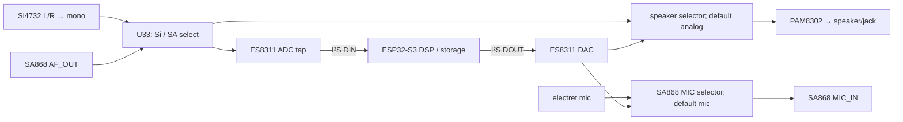

# IMP-0009 — бортовой моно-кодек с аппаратным audio bypass

- Статус: **Принято владельцем проекта через `DEC-0009`**
- Связано: `FND-0003`, `FND-0005`, `DEC-0001`, `DEC-0003`, `DEC-0005`, `C-RX-07`, `C-VHF-04`–`C-VHF-07`
- Этап решения: 2 — scope; pin/power/electrical proof — этапы 3–6
- Обнаружено: 2026-08-15

## Контекст и граница требования

Legacy firmware обещает запись WAV, аудиодекодеры, DTMF, parrot, AFSK/AX.25/SSTV и кросс-бэнд Si4732 → SA868, но legacy hardware не соединяет MCU ни с RX-звуком, ни с TX-аудиовходом. Это блокер `FND-0003`.

Старые аппаратные требования при этом прямо фиксируют **моно-аудио**, а текущая схема суммирует `LOUT+ROUT` Si4732 в один `SI_AUDIO`. Поэтому стереозапись не является потерянной заявленной функцией: добавление стереокодека было бы новым scope, а не восстановлением эквивалентности.

## Проверенный сигнальный контракт

| Сигнал | Источник → потребитель сейчас | Что нужно MCU | Требуемая полоса/режим |
|---|---|---|---|
| `SI_AUDIO` | Si4732 `LOUT+ROUT` → `U33` | запись и decode | mono; до FM audio bandwidth |
| `SA_AF` | SA868 `AF_OUT` → `U33` | запись, DTMF/AFSK decode, parrot | mono NFM voice/audio |
| `MIC_HOT` | electret → SA868 `MIC_IN` | сохранить обычную голосовую связь без MCU | аппаратный default path |
| digital TX audio | отсутствует | MCU → SA868 `MIC_IN` | tones, AFSK/AX.25, SSTV, parrot, relay |
| digital local playback | отсутствует | MCU → PAM8302 | запись/playback и системный audio |

Одновременно выбирать оба RX-источника legacy не обещает: существующий `U33` уже разрешает только Si4732 **или** SA868. Один ADC-канал поэтому функционально достаточен.

## Принятое предложение

Добавить на основную PCB **ES8311** — mono ADC+DAC codec — и сохранить обычное прослушивание/голос аппаратными bypass-путями, не зависящими от загрузки S3 или инициализации кодека.

Обязательные безопасные состояния задаются резисторами, а не прошивкой:

- speaker selector по умолчанию соединяет `MUX_OUT` с PAM8302;
- TX-audio selector по умолчанию соединяет electret mic с `MIC_IN`;
- codec DAC попадает в `MIC_IN` только после явного переключения;
- PTT остаётся отдельным гейтом и по `DEC-0003` не активируется автоматически;
- при reset/crash/unpowered codec обычное прослушивание и голосовая связь сохраняются.

Для обоих селекторов достаточно двух дополнительных 2:1 analog switch. После измерений speaker selector можно заменить пассивным суммированием только если доказаны отсутствие off-state loading, pops, взаимного влияния и ухудшения SNR. До такого доказательства более надёжный двухключевой вариант является baseline.

## Почему ES8311

- mono ADC и DAC соответствуют принятому mono-scope без лишних каналов;
- 24 bit, 8–96 kHz; product brief указывает 100 dB ADC SNR и 110 dB DAC SNR;
- одновременные record/playback поддержаны самим codec и официальным `esp_codec_dev`;
- официальный ESP-IDF содержит пример ES8311 для ESP32-S3 и echo path;
- внутренний master clock может браться из `BCLK`, поэтому отдельный `MCLK` GPIO не обязателен;
- заявленное record+playback power — около 14 mW;
- корпус QFN-20 3×3 mm и текущая цена ниже стерео-вариантов.

## Пересечение с GPIO и другими решениями

В режиме clock-from-BCLK нужны четыре прямые линии S3: `BCLK`, `WS`, `DOUT`, `DIN`; I²C уже существует. Предварительная, **не принятая как pin map**, раскладка:

| Функция codec | Кандидат GPIO S3 | Почему доступен |
|---|---:|---|
| `BCLK` | 2 | освобождается переносом IR TX на C5 |
| `WS` | 6 | освобождается переносом nRF control на C5 |
| S3 → codec `DOUT` | 42 | освобождается переносом IR RX на C5 |
| codec → S3 `DIN` | 46 | освобождается переносом nRF IRQ на C5; input-only подходит |

Это важное пересечение: `DEC-0001` принимает **целевое владение** C5, но ещё не доказывает его реализацию из-за `FND-0001`. Audio pin budget становится доказанным только после реального освобождения этих четырёх линий. При этом:

- GPS UART GPIO18/47 из `DEC-0006` не заимствуется;
- текущие LoRa `DIO1/BUSY` кандидаты GPIO3/15 не заимствуются;
- выбор SPI/SDIO/UART для S3↔C5 не нужен для четырёхпроводного codec-варианта;
- codec enable и два selector control требуют три медленные линии. Первоначальный кандидат `U13.P10..P17` пересёкся с UI matrix (`FND-0006`); переработанный `IMP-0010` использует одну линию `U13` и две линии `U12`, освобождённые удалением onboard LoRa. Окончательная pin map не принята.

## Питание и аналоговая часть

ES8311 следует питать от тихого `+3V3A` с отдельной развязкой его analog/digital supply pins и контролем возвратных токов. Расчётно 14 mW соответствуют примерно 4.3 mA при 3.3 V, что мало относительно legacy-рейла 300 mA, но power budget считается заново после удаления GNSS/LoRa и переразводки.

До фиксации номиналов необходимо измерить реальные уровни:

- максимальный `SI_AUDIO` во всех режимах/громкостях Si4732;
- `SA_AF` при минимальной/максимальной громкости SA868;
- чувствительность и допустимый line level `MIC_IN` SA868;
- common-mode, clipping margin, off-state loading и pop/click для обоих selector;
- шум при одновременной работе Wi-Fi, display, SD, PA SA868 и codec clocks.

Datasheet SA868 называет `MIC_IN` «microphone or line in», но не задаёт достаточный электрический диапазон для безусловного выбора делителя. Номиналы нельзя переносить из случайной reference board; они являются выходом измерения образца.

## Сравнение вариантов

| Вариант | Покрытие legacy mono-функций | GPIO S3 | Fail-safe analog | Цена/сложность | Вывод |
|---|---|---:|---|---|---|
| оставить текущий analog path | только live RX и mic voice | 0 | да | минимум | не закрывает `FND-0003` |
| S3 ADC1 + 8-bit sigma-delta/PWM | потенциально basic capture/tones | 2+ | можно сохранить | минимальный IC BOM, но analog conditioning и большой proof | не считать эквивалентным: ADC2 continuous нестабилен, ADC1 pin-constrained, TX output 8-bit и качество не доказано |
| **ES8311 + два selector** | **все перечисленные mono audio prerequisites** | **4 без MCLK** | **да, hardware default** | **рекомендуемый минимум** | **baseline предложения** |
| ES8388 onboard | то же + stereo/extra analog inputs | 4–5 | только с внешними selector | больше корпус/обвязка; stereo не требуется | технически годится, но добавляет незапрошенный scope |
| TI TLV320AIC3204 | то же + 2×ADC/2×DAC, 6 inputs, line/headphone outputs | 4–5 | только с внешними selector | active, но дороже и нет готового Espressif driver | premium/reference, не zero-loss minimum |
| M5Stack Audio Module M144 | codec доступен снаружи | не экономит I²S/I²C | внутреннего bypass нет | `$7.95`, 54×54 mm, 23.53 mA | не подходит как основной internal-radio path |

Популярный WM8960 не включён в новый BOM: Cirrus Logic указывает `WM8960CGEFL/(R)V` как EOL с final order в 2024 году.

## Ценовой снимок 2026-08-15

Это цены компонентов, не PCBA quote и не гарантия доступности:

| Позиция | 1 шт. | 100 шт. | 1000 шт. | Источник/примечание |
|---|---:|---:|---:|---|
| ES8311 `C962342` | `$0.5547` | `$0.3059` | `$0.2749` | LCSC |
| ES8388 `C365736` | `$1.1042` | `$0.7107` | `$0.5546` | LCSC |
| TLV320AIC3204 `C24109` | `$1.4481` | `$0.9065` | `$0.8189` | LCSC; DigiKey single-qty около `€4.48`, AVL требует проверки |
| M5Stack M144 | `$7.95` | — | — | официальный store, готовый внешний модуль |
| TI SN74LVC1G3157, один switch | `$0.0748` при MOQ 10 | `$0.0625` | около `$0.05` на reel tier | LCSC |

ES8311 + два TI selector дают ориентир около `$0.70` по низкообъёмным unit prices и `$0.43` на tier 100 до пассивов, размещения и теста. Разница с ES8388 невелика в абсолюте, но ES8388 не удаляет selector, если сохранять fail-safe, и не добавляет принятой функции.

## Firmware-контракт

Принятие предложения создаёт один bidirectional mono audio backend; ADC и DAC могут работать одновременно, но сам SA868 остаётся half-duplex. Режимы backend:

- `ANALOG_BYPASS`: codec может быть выключен; radio RX → speaker, mic → SA868;
- `CAPTURE_SI`: `U33=Si4732`, ADC → WAV/decoder;
- `CAPTURE_SA`: `U33=SA868`, ADC → WAV/DTMF/AFSK/parrot;
- `PLAY_LOCAL`: DAC → speaker selector;
- `INJECT_SA`: DAC → TX selector, но PTT выдаётся только отдельным TX policy gate;
- `RELAY_SI_TO_SA`: ADC → bounded buffer/DSP → DAC; только разрешённый legal/Lab profile.

Драйвер должен пиновать проверенную версию ESP-IDF/`esp_codec_dev`: в 2026 году зарегистрирован открытый regression report для ES8311 ADC на ESP32-S3 с ESP-IDF 5.5.1. Наличие официального драйвера снижает риск, но не заменяет versioned hardware-in-loop test.

## Legal/safety граница

Codec лишь создаёт технический audio path и сам по себе не разрешает передачу:

- WAV/decode RX не активируют TX;
- roger/DTMF/APRS/AFSK/SSTV/fox beacon проходят общий региональный, лицензионный, power/duty и STOP gate;
- cross-band relay по умолчанию выключен и относится в «Лабораторию» до отдельной проверки юрисдикции и сценария;
- selector на codec TX и PTT должны требовать две независимые state-machine предпосылки;
- reset, watchdog, снятие аксессуара или ошибка codec немедленно возвращают TX selector в mic/default и снимают PTT.

## Критерии доказательства до закрытия `FND-0003`

1. Pin audit подтверждает четыре свободных GPIO после реализации `DEC-0001`, без предположения, что принятое владение уже равно готовой архитектуре.
2. Прототип работает без MCLK, используя BCLK как internal clock ES8311, в одновременном ADC+DAC режиме на выбранной версии ESP-IDF.
3. При S3 reset и codec power-off live RX и обычный mic TX сохраняются; selector hardware defaults проверены осциллографом.
4. Для Si4732 и SA868 сняты min/nominal/max уровни; ни ADC, ни `MIC_IN`, ни PAM8302 не клиппируют во всём принятом диапазоне настроек.
5. Десятиминутная WAV-запись 48 kHz/16 bit mono не имеет discontinuity/overrun; отдельные decoder fixtures проходят воспроизводимо.
6. DTMF fixture покрывает все 16 символов и согласованный диапазон levels/twist; AFSK/AX.25 loopback и parrot проходят установленный error/quality threshold.
7. Ordinary analog path не ухудшается более чем на согласованный measurement margin по gain/noise; pop/click и off-state loading измерены.
8. Ни одна ошибка codec/DMA/SD не может поднять PTT или оставить TX selector в digital position после watchdog/reset.
9. Полная BOM/PCBA дельта посчитана на `1/10/100/1000`, включая selector, passives, площадь, assembly и test time.

## Принятое решение

Владелец принял бортовой ES8311, существующий RX mux/ADC tap и два default-to-analog selector как целевую audio-архитектуру. Канонический контракт и граница доказательства зафиксированы в `DEC-0009`.

Связанные capability больше не `BLOCKED` отсутствием выбора архитектуры, но остаются `conditional` до pin/electrical/firmware proof и отдельных scope-решений. Это принятие не означает, что codec уже добавлен в схему или что `FND-0003` закрыта на уровне реализации.

## Источники

- [Everest Semiconductor ES8311 product brief](https://www.everest-semi.com/pdf/ES8311%20PB.pdf)
- [ES8311 user guide: BCLK may be selected as internal master clock](https://files.waveshare.com/wiki/common/ES8311.user.Guide.pdf)
- [ESP-IDF official ES8311 example](https://github.com/espressif/esp-idf/tree/master/examples/peripherals/i2s/i2s_codec/i2s_es8311)
- [Espressif `esp_codec_dev`: ES8311 playback and record](https://components.espressif.com/components/espressif/esp_codec_dev)
- [ESP32-S3 I²S documentation](https://docs.espressif.com/projects/esp-idf/en/stable/esp32s3/api-reference/peripherals/i2s.html)
- [ESP32-S3 ADC continuous-mode limitations](https://docs.espressif.com/projects/esp-idf/en/stable/esp32s3/api-reference/peripherals/adc/adc_continuous.html)
- [ESP32-S3 sigma-delta output is 8-bit signed](https://docs.espressif.com/projects/esp-idf/en/v4.4/esp32s3/api-reference/peripherals/sigmadelta.html)
- [TI TLV320AIC3204 product page](https://www.ti.com/product/TLV320AIC3204)
- [M5Stack Audio Module M144 documentation](https://docs.m5stack.com/en/module/Module-Audio)
- [M5Stack Audio Module M144 store page](https://shop.m5stack.com/products/m5stack-audio-module-es8388)
- [Cirrus Logic EOL list](https://www.cirrus.com/products/eol/)
- [NiceRF SA868S datasheet](https://www.nicerf.com/upload/20250730/550a4fb20f0ddcdaf5c265201a056c73.pdf)
- [Si4732-A10 datasheet](https://www.mouser.com/datasheet/2/472/Si4732_A10_short-2492991.pdf)
- [ES8311 ESP32-S3 regression report for ESP-IDF 5.5.1](https://github.com/espressif/esp-idf/issues/18621)
- [LCSC ES8311](https://www.lcsc.com/product-detail/C962342.html)
- [LCSC ES8388](https://www.lcsc.com/product-detail/C365736.html)
- [LCSC TLV320AIC3204](https://www.lcsc.com/product-detail/C24109.html)
- [LCSC TI SN74LVC1G3157](https://www.lcsc.com/product-detail/C38663.html)
