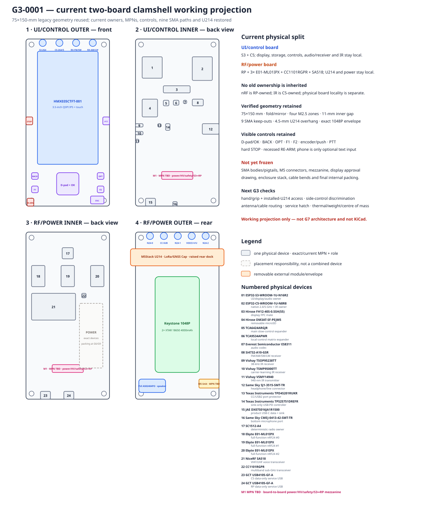

# G3-0001 — current clamshell geometry re-entry

- Статус: **Проведено ревью geometry-reentry working projection; G3 продолжается**
- Дата: 2026-08-19
- Finding: [`FND-0117`](../findings/FND-0117-legacy-layout-was-not-a-current-g3-projection.md)
- Review: [`REV-0005CE`](../reviews/REV-0005CE-current-g3-clamshell-propagation.md)
- Legacy audit: [`AUD-0013`](../audits/AUD-0013-legacy-layout-generator-reuse.md)
- Generator: [`g3_clamshell.py`](../../../hardware/product-design/g3_clamshell.py)
- Render: [`G3-0001-current-clamshell.svg`](img/G3-0001-current-clamshell.svg)

## Что именно принято на этом checkpoint

Это возврат в physical design после I9, а не выбор финального корпуса.
Переиспользуется проверенная legacy hypothesis `2 × 75×150 mm` с двумя
защищёнными внутренними плоскостями, реальным fold/mirror, четырьмя mounting
zones и `11-mm` inner gap. Все старые device/owner labels заменены current
machine facts.

| Physical half | Current working locality | Почему это хороший G3 baseline |
|---|---|---|
| `UI/control` | S3, C5, HMX display, microSD, controls, codec, Si4732, IR, product USB/PD front end | QSPI, UI, audio/receiver, S3↔C5 SDIO, USB2 and C5↔IR remain local |
| `RF/power` | RP, 3× `E01-ML01IPX`, CC1101, SA518, U214 dock, charger/pack/rail responsibility | every RP radio/control path and removable Cap stay local; three nRF bodies can be physically separated |
| board-to-board | `MPN TBD` working connector plane for negotiated HV/system power, safety and S3↔RP IPC | exact contacts/connector are deliberately a G3 physical-family gate; no hidden footprint is invented |

Electrical ownership is unchanged: RP still owns three full-function nRF and
C5 owns IR. “Board” here means locality, not a new controller assignment.

## External surfaces preserved

- front `HMX035CTFT-001` reference envelope `54.5×101.5×10 mm`, with exact
  standalone approval drawing still required;
- D-pad/OK, BACK, OPT, F1, F2, encoder/push, side PTT, tactilely distinct hard
  STOP and recessed RE-ARM; phone remains optional text input only;
- nine permanent SMA identities, split `4 + 5`: front native/receive bank and
  rear alternating `N24-0 / CC-SUB / N24-1 / VOICE-V/U / N24-2` bank;
- rear `M5Stack U214` raised dock at `4.5 mm` symmetric overhang above exact
  `Keystone 1048P` / two `XTAR 18650 4000mAh` envelope;
- separate product, C5-service and RP-service USB endpoints, microSD,
  headphone, microphone, speaker, IR optical surfaces and native M5 Unit area.

## Machine and visual checks

The generator refuses the render when:

1. one of the key current exact MPNs drifts;
2. any of the nine machine antenna identities is missing/duplicated;
3. one of the retained local controls disappears;
4. a shown device leaves its board or overlaps another shown device;
5. SMA keep-outs overlap each other or a mounting-hole keep-out;
6. U214 loses its symmetric overhang/service gap or collides with the holder;
7. generated SVG differs from the checked-in artifact.

Visual self-review rejected long labels inside small bodies. The accepted
render uses one numbered rectangle per physical device and one exact MPN/role
register; dashed regions are explicitly placement responsibilities, not a
multi-device square.

## What remains before this can become a whole-device candidate

- exact SMA bodies, pigtails and cable-bend/strain/grounding solution;
- exact M5 Cap/Unit and board-to-board connector MPNs, contact count, rail and
  screw/tolerance stack;
- complete placement-volume sum for all 857 supplied candidate placements,
  RF keep-outs, hot components, shielding and service access;
- hand/grip, installed-U214 access, STOP/PTT/RE-ARM discrimination, mass and
  centre-of-gravity review;
- display approval drawing/cover lens, battery door, environmental sealing,
  antenna loads and physical HIL.

This checkpoint receives **«Проведено ревью»** only for current geometry
re-entry. G3 remains active. It does not freeze board split, dimensions,
connector plane or internal placement and does not authorize KiCad.
