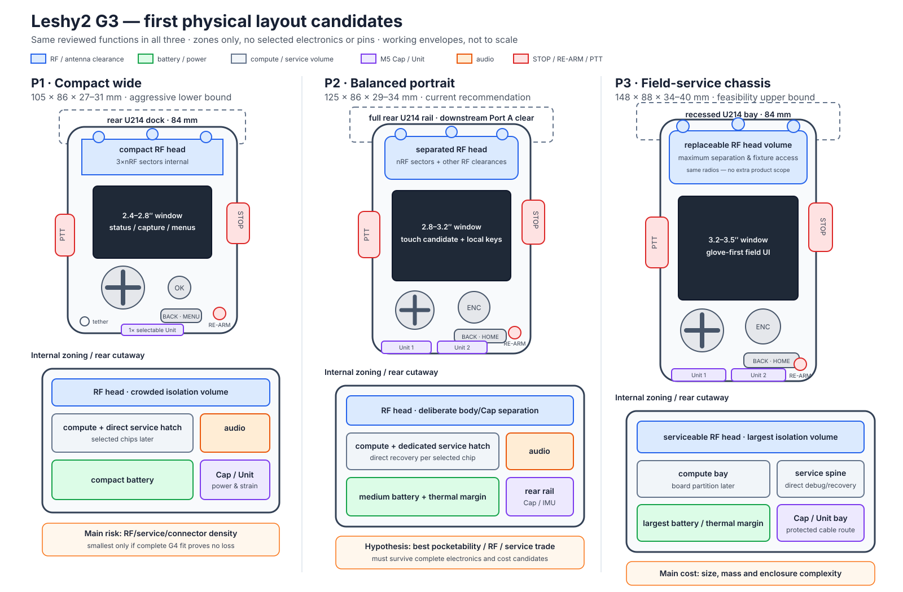

# LAY-0001 — first G3 form-factor and zoning candidates

- Статус: **Справочный преждевременный эксперимент; выбор больше не требуется**
- Дата: 2026-08-17
- Gate: `FLOW-0001/G3`
- Inputs: [`PD-0001`](PD-0001-g3-physical-design-inputs.md)
- Drawing: [`LAY-0001 SVG`](img/LAY-0001-form-factor-candidates.svg)
- Superseded direction: [`DEC-0041`](../decisions/DEC-0041-electrical-feasibility-before-physical-layout.md)

> После уточнения владельца этот drawing не является active G3 choice.
> Сначала проходит logical/electrical feasibility, затем активный макет
> отталкивается от проверенного legacy clamshell generator. P1/P2/P3 сохранены
> только как источник отдельных идей и сравнительных envelopes.

## Shared scope

All three candidates keep the same base capabilities and exclusions. They all
show physical *zones*, not chosen PCBs or components. `RF head`, `compute`,
`power` and `service` labels are volume/clearance responsibilities; they do not
assign a radio or GPIO owner.

## P1 — compact wide

- working body envelope: **105×86×27–31 mm**;
- 2.4–2.8-inch-class visible window, button-first navigation, side PTT;
- one protected selectable Unit surface plus U214 downstream Port A;
- internal 3-sector nRF antenna geometry; two top external-RF clearances;
- screwed rear service hatch and compact battery zone.

Best case: pocketable base with a flush 84 mm Cap dock and minimum openings.
Main risk: RF isolation, grip shadowing, service density, thermal/battery margin
and connector crowding may make the envelope infeasible without loss.

## P2 — balanced portrait

- working body envelope: **125×86×29–34 mm**;
- 2.8–3.2-inch-class visible window, hybrid touch/encoder/keys candidate;
- two protected Unit surfaces plus full rear U214 dock;
- separated top RF head, mid compute/service and lower battery volumes;
- keyed rear rail for U214/Unit/optional indexed IMU retention.

Best case: one-hand field use while preserving honest antenna, service and
accessory mechanics. Current hypothesis: most likely Pareto compromise, but it
is not selected before G4 electronics and cost proof.

## P3 — field-service chassis

- working body envelope: **148×88×34–40 mm**;
- 3.2–3.5-inch-class visible window and glove-first controls;
- replaceable/separable RF-head volume, two Unit surfaces and service spine;
- largest battery, thermal and independent-debug margin;
- U214 sits inside the rear silhouette rather than widening the grip further.

Best case: lowest integration and bring-up risk, clearest repair/RF zoning.
Main cost: mass, pocketability, enclosure/assembly parts and likely recurring
BOM are worst despite identical functional scope.

## Review comparison

| Product dimension | P1 compact | P2 balanced | P3 field-service |
|---|---|---|---|
| pocket/grip | strongest | good | weakest |
| U214 fit | flush but crowded | flush with rail | flush/recessed |
| Unit configuration | minimum important set | two base surfaces | two surfaces + service rail |
| nRF sector geometry | highest calibration risk | workable separation | best separation |
| other RF isolation | high risk | medium | lowest risk |
| service access | dense hatch | dedicated hatch | dedicated spine |
| battery/thermal margin | lowest | medium | highest |
| expected cost | lowest only if RF fit succeeds | medium | highest |
| G4 role | aggressive lower bound | recommended starting point | feasibility/reference upper bound |

## What the next artifact will add

`DEC-0041` меняет порядок. `G2F` сначала строит не менее двух complete
electrical candidates и согласует рабочую owner/bus/GPIO карту. После этого G3
адаптирует старый воспроизводимый clamshell mockup и возвращает обнаруженные
packing/RF/power conflicts в карту. Только `G7` может принять atomic target.
