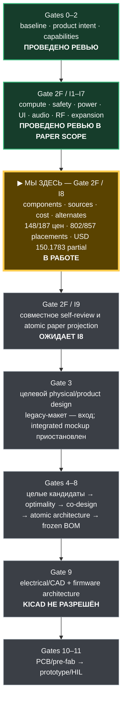

# Этапы и статусы

Нормативные gate definitions и правила итерации находятся в
[`FLOW-0001`](architecture/FLOW-0001-product-to-cad-gates.md). Нумерация ниже
исправлена решением [`DEC-0032`](decisions/DEC-0032-reopen-product-design-before-cad.md);
прежняя последовательность ошибочно ставила architecture/BOM раньше product
and physical design (`FND-0039`).

## Где мы сейчас

`I8` ниже — внутренний шаг закрытия feasibility gate `2F`, а не одноимённый
верхнеуровневый gate `8`. Поэтому текущая работа над доказательствами BOM не
означает, что архитектура уже заморожена или что разрешён KiCad.

| № | Gate | Основной выход | Статус |
|---:|---|---|---|
| 0 | Review baseline | правила, evidence/decision/finding ledgers | **Проведено ревью** |
| 1 | Product intent | назначение, ranked goals, safety/legal and no-loss boundaries | **Проведено ревью**; может быть переоткрыто явным finding |
| 2 | Capabilities | полный wishlist, competitors, requirements, exclusions, concurrency/failure needs | **Проведено повторное ревью `REV-0002AS`**: `W-EXTRA-11..17` полностью disposed; 6 GHz/Wi-Fi 6E rejected `DEC-0040` |
| 2F | Logical/electrical feasibility | neutral signal demand, real-device pin provenance, ≥2 complete owner/bus/GPIO maps and working baseline | **В работе**: current G2F-3I projection is `S3 33/3/0`, `C5 14/6/1`, `RP 48/0/0`, main slow I/O `24/0/0` and dedicated UI I/O `7/1/0`. I1…I7 have **«Проведено ревью»** in paper scope after the MAX17320 and actual-TX support repairs. I8 inventory/current source batch/display sourcing strategy/substitution policy and eleven cost batches are reviewed at 858 architecture instances / 857 supplied placements / 187 purchase lines, 186/187 source records, 187/187 disposition classes and 148/187 cost records covering 802 placements; ten unpriced lines have explicit gates and four physical-gap families remain. Standalone display RFQ, 39 prices and specific alternate qualification are active. Gate 2F remains open through I8, antenna lots/feeds/protection, physical RF and peripherals |
| 3 | Target product design | adapted legacy physical mockup, form factor, interaction, controls, interfaces, battery, antenna/service/environment/cost envelopes | **В работе от `DEC-0051/PIN-0003` visible working design**: адаптируется legacy generator; `PD-0001` — input, premature `LAY-0001` P1/P2/P3 — reference only; packing/RF/power conflicts переоткрывают G2F |
| 4 | Whole-device candidates | ≥2 complete architectures covering the same reviewed product | Не начато в исправленном процессе; старые `SYN-2A/2B/3A` — reference studies only |
| 5 | Optimality decision | reviewed weights, score/Pareto/sensitivity and owner selection | Не начато |
| 6 | Conceptual co-design | block/board/antenna/power/thermal/service placement and preliminary resource feasibility | Не начато |
| 7 | Atomic architecture | owners, transports, exact resources/pins, reset/update/safety and reopen gates | **Переоткрыто**; former `DEC-0028/PKG-0001` superseded as target by `DEC-0032` |
| 8 | Components and BOM | exact qualified parts, lifecycle/supply/cost/alternates | Заблокировано этапом 7; former stage-4 evidence is candidate/reference only |
| 9 | Electrical/CAD and firmware architecture | electrical specification, canonical libraries, schematic/ERC, runtime/HAL/toolchain/test contracts | Заблокировано; active KiCad contains no canonical implementation |
| 10 | PCB and pre-fab | placement/routing/DRC/SI/PI/RF/mechanical/manufacturing evidence | Не начато |
| 11 | Prototype and bring-up | assembly, recovery, safety/RF/HIL measurements | Не начато |

Этапы могут содержать параллельные feasibility probes, но их результаты
остаются черновиками. Ни одна ветвь не использует непроверенный или
candidate-only artifact как окончательный вход.

Текущее дополнение gate 2F: `DEC-0083/USB-0001/REV-0005AN` дают первому I4
endpoint product USB-C **«Проведено ревью»** на paper-schematic уровне. Exact
JAE receptacle, TI four-line CC/USB2 protection и corrected 220-pF CC shunts
внесены в machine map; placement, USB Full-Speed RC/SI, ESD/short-to-VBUS HIL
остаются открыты. I4 и gate 2F в целом продолжаются, KiCad не разрешён.
`DEC-0084/DSP-0006/REV-0005AO` затем дают display/touch paper endpoint
**«Проведено ревью»**: first exact 40-contact ZIF candidate, protected-main
logic rail, reset-low defaults и latch-off PWM backlight внесены в machine
map без нового GPIO. Real-tail mate, procurement и shared-SPI/touch/
backlight HIL остаются открыты; I4 и gate 2F продолжаются.
`DEC-0085/STO-0001/REV-0005AP` затем дают microSD paper endpoint
**«Проведено ревью»**: exact switched rail, Ioff SCK/CMD/CS isolation,
CS-gated DAT0/MISO, mandatory pulls, eight ESD channels и always-readable
detect внесены в machine map без нового GPIO. Socket access, media/endurance,
throughput, hot-remove и destructive HIL остаются открыты; I4 продолжается к
остальным UI endpoints.
`DEC-0086…0088/UI-0001/UI-0002/DSP-0007` затем сохраняют полный physical
control set, закрывают exact switch/current/ESD и фиксируют integrated ST77922
at `0x38` с active-low TP_INT, 10-kOhm raw pull-up и fixed 1G07 на GPIO37.
`FND-0094/IOX-0001/DEC-0089/REV-0005AT` завершают consolidated I4 audit:
TCA6424A получает полный exact power/address/reset/IRQ контракт, AON-наблюдение
изолируется от выключенного main-домена, pack target фиксируется на `0x2A`, а
остаточные USB/microSD/STOP endpoints становятся реальными. I4 имеет
**«Проведено ревью»**, активен I5; mechanics/specimen HIL остаются открыты,
KiCad по-прежнему не разрешён.
`FND-0095/AUDIO-0003/DEC-0090/REV-0005AU` затем закрывают I5: exact power,
supervisor и physical isolation для ES8311/Si4732/SA518, полный capture/
playback/TX тракт, exact microphone/speaker/headphone endpoints и все
first-target пассивы внесены в machine map. Main slow I/O становится
`21/0/3`; полный набор controls не изменён. I5 имеет **«Проведено ревью»**,
активен I6; its three-nRF paper electrical subblock is reviewed by
`DEC-0091/REV-0005AV`, and its separate native S3/C5 feeds by
`DEC-0092/REV-0005AW`. `FND-0098/CCRF-0001/DEC-0093/REV-0005AX` затем
исправляют односторонний CC band switch: exact dual-SP3T path, three-band
coupon, final-line ESD и AD8314 actual-TX sample входят в machine map; P03/P04
заняты; позднее `DEC-0098` отдаёт P05 native-Unit power request, поэтому current
main slow I/O становится `24/0/0`.
`FND-0099/VRF-0001/DEC-0094/REV-0005AY` далее закрывают SA518 paper RF path:
ANT contact 7, direct protected 50-Ом SMA boundary, 24-В low-C ESD и exact
5,1-кОм/52,3-Ом AD8314 sample. P05 не расходуется на фильтры без measured
failure. `FND-0100/IRF-0001/DEC-0095/REV-0005AZ` закрывают IR paper endpoint:
exact `TSOP95238TT + TSMP95000TT` RX pair, discharged/Ioff
receive boundary, `VSMY14940` current-limited STOP-gated TX и independent
`VEMD1060X01/TLV9061IDBVR` actual-optical evidence. Затем
`FND-0101/RXF-0001/DEC-0096/REV-0005BA` исправляют пропущенные abstract FMI/AMI:
отдельные защищённые FM/SW и не-50-Ом AM/LW first-target тракты теперь
завершены до физических SMA boundary. `FND-0102/REV-0005BB` дополнительно
исправляют всю сдвинутую SOIC-16 contact map Si4732 по визуально проверенному
manufacturer package drawing и regression-lock всех 16 контактов. Весь optical/thermal/IEC,
specimen/conducted/coexistence HIL остаётся открыт. `FND-0103/FND-0104/
COX-0001/DEC-0097/REV-0005BC` затем исправляют cross-group promotion и
неприменимый monolithic receiver/audio quiet contract, фиксируют one-group
runtime, отдельные quiet boundaries, восемь fixture classes, ordered
transitions и все no-stall thresholds. I6 paper scope имеет **«Проведено
ревью»** без присвоения несуществующих измерений; physical HIL может открыть
его владельца повторно. I7 закрыт `DEC-0098/0099`; I8 inventory coverage
проведён `FND-0109/BOM-0008`; `PWR-0022/DEC-0100/REV-0005BF` исправляют и
повторно закрывают narrow MAX17320 support I3. `FND-0111/BOM-0009/DEC-0102/
REV-0005BH` проверяют current source batch; после `BOM-0011` 186/187 purchase
lines имеют evidence,
а exact `HMX035CTFT-001` остаётся открыт. `DSP-0008/BOM-0010/REV-0005BI`
закрывают donor/specimen route, exact RFQ и no-drop-in policy без подмены
standalone sourcing. `BOM-0012/DEC-0104/REV-0005BK` закрывают
no-silent-substitution policy 187/187; `BOM-0013…0023/DEC-0105…0106/
REV-0005BL…BW` проводят ревью cost contract, explicit RFQ/retail gates и
первых 148/187 строк / 802 placements с partial subtotal USD 150.1783. Ещё 39
цен и specific alternate qualification активны,
KiCad не разрешён. `FND-0112/BOM-0011/DEC-0103/REV-0005BJ` отдельно исправляют
двойной purchasing-счёт internal ST77922 и фиксируют current 857/187.
