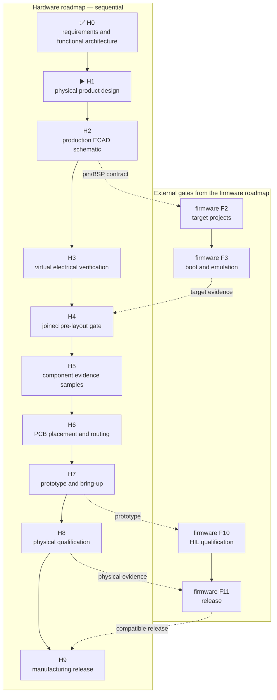

# Leshy2 hardware — roadmap to manufacturing

[Русский](roadmap.ru.md) · [Home](../README.md) ·
[Firmware roadmap](https://github.com/anton-vinogradov/esp32-leshy2-firmware/blob/main/docs/roadmap.md)

> **▶️ Current hardware stage: H1 — physical product design.** H0 is
> reviewed. The external and internal mockup is not yet accepted, so there is
> no current production ECAD schematic, PCB layout or authorized order.

Status last reconciled: **23 August 2026**. This is the hardware repository's
own, sequential roadmap. Firmware work has its own `F0–F11` stages. Firmware
results appear here only where they are prerequisites of a hardware gate.

## Status key

- ✅ **Reviewed** — this stage's artifact and evidence exist; a later mismatch
  can reopen it.
- ▶️ **Current** — the first unfinished hardware stage.
- ⏳ **Waiting** — the immediately preceding hardware stage is not closed.
- 🔒 **Blocked** — an order or downstream action is forbidden until its gate.

## Where the hardware is

| Area | Actual state |
|---|---|
| Product requirements and functional architecture | ✅ H0 reviewed: capability boundary, compute domains, owners, interface classes and safety rules |
| Physical product design | ▶️ H1: dimensioned projections and working allocation exist, but the complete mockup is not accepted |
| Principle diagrams on the site | Included as H1 working artifacts; they are not production ECAD |
| Current production ECAD schematic | ⏳ H2: not created; the incompatible former implementation is archived |
| Electrical and transient evidence | ⏳ H3: not run |
| Firmware interlock | Firmware F1 portable evidence exists, but F3 target boot/emulation is not closed |
| KiCad placement and PCB routing | 🔒 H6: not started and not authorized |
| Physical samples and HIL | 🔒 Not ordered or run |
| Prototype PCB order | 🔒 Forbidden before H7 |
| Production order | 🔒 Forbidden before H9 |

Principle diagrams explain **what connects to what**. Production ECAD must add
exact symbols, contacts, values, rails, protection, footprints and ERC
evidence. PCB placement and routing begin only after the earlier gates close.

## Current H1 breakdown

<!-- current-substep: H1.1.3.3 -->

**Exact marker: `H1.1.3.3`** — resolve four classified H1 mechanical blockers:
display tail/order identity, three nRF IPX paths, the U214 mating stack and the
custom D-pad actuator. Later views already exist as provisional projections,
but none is a reviewed later substep while this source-data gate is open.

- ✅ `H1.0` — project H0 requirements into a mechanical acceptance list.
- `H1.1` — physical-source register.
  - ✅ `H1.1.1` — every selected body or explicit `MPN TBD` has exactly one
    product role in the machine source.
  - ✅ `H1.1.2` — every rendered body has evidence-backed `L×W×H`, a named
    datum, orientation and connector/actuator-direction classification.
  - `H1.1.3` — classify each unresolved physical item; inferred dimensions
    cannot silently become exact.
    - ✅ `H1.1.3.1` — inventory every open mechanical evidence boundary.
    - ✅ `H1.1.3.2` — record four H1 blockers and nine H5 received-sample gates
      in the machine source.
    - ▶️ **`H1.1.3.3` — current:** close the display, nRF and U214 evidence
      blockers plus the custom D-pad actuator design.
  - 🔒 `H1.1.4` — waits for H1.1.3.3, then freezes the renderer source table.
- ⏳ `H1.2` — one coordinate model for both boards, enclosure, fasteners and
  accessory keep-outs; existing independent projections are inputs only.
- ⏳ `H1.3.0` — generate the outer faces from the unified source: screen,
  D-pad, keys, encoder, LEDs, arrows, external interfaces and visible,
  unobscured silkscreen.
  - ✅ Latest provisional correction: ten TX indicators are aligned as two
    rows of five, the front controls are raised 5 mm, and the display now
    separates its 54.5×83.0-mm body from the exact 48.96×73.44-mm 2:3 active area.
- 🔒 `H1.3.1` — **user review gate:** accept the complete front and rear
  exterior, including labels and control locations.
- ⏳ `H1.4.0` — generate mirrored inner board faces: every body, speaker,
  microphone, RUN/KILL, service controls and board-to-board stack without
  inner silkscreen.
- 🔒 `H1.4.1` — **user review gate:** accept both internal faces and the
  sandwich relationship.
- ⏳ `H1.5.0` — generate the real antenna-edge top view and separate sections
  through the U214 rail and battery/control zone, including insertion and
  service paths.
- 🔒 `H1.5.1` — **user review gate:** accept top/section geometry, U214 and
  battery/service access.
- ⏳ `H1.6` — automated collision, hole/keep-out, clearance, label visibility,
  antenna spacing, actuator travel and service-access checks.
- ⏳ `H1.7.0` — repeat the pin/resource allocation against the physical result
  and generate one cross-view acceptance package from the same source.
- 🔒 `H1.7.1` — **user review gate:** accept the consolidated layout, all
  automatic-check results and all changes since the earlier view gates.
- 🔒 `H1.8` — formal final user acceptance of H1; only then may H2 begin.

`H1.1.3.3` exits only when the display, nRF and U214 evidence blockers have
controlled or accepted received evidence and the D-pad actuator has a
dimensioned, testable design. The parked procurement rule postponing all
samples until preorder P1-P6 conflicts with those prerequisites and must be
resolved explicitly. Closing any substep requires changing the exact marker on
both landing and roadmap pages in the same commit before advancing work. A
later correction reopens every affected user review gate and its dependants.

## Hardware sequence and firmware intersections

Evidence-component ordering is allowed at H5 after its separate cost approval.
Prototype PCB submission is allowed at H7 after H6 acceptance and explicit
order approval. A production order is possible only after H9.

## Complete hardware path

| Stage | Status | Stage output | Exit criterion |
|---|---|---|---|
| **H0. Product requirements and functional architecture** | ✅ Reviewed | Complete capability scope, five compute domains, radio/interface owners, interface classes, one active signal group, full-function 3×nRF24 and safety boundaries | Requirements and architecture checks pass; every required function has an owner and a defined hardware boundary |
| **H1. Physical product design** | ▶️ Current | Accepted exterior, both outer and inner faces, true antenna-edge view, sections, assembly sequence, selected-part envelopes and feasible pin/resource allocation | Dimensions come from selected MPNs; no component, fastener, silkscreen, antenna or accessory collision; controls, battery, U214, ports, microphone and speaker are accessible; allocation still fits; the user accepts the mockup |
| **H2. Production ECAD schematic** | ⏳ Waiting for H1 | New current schematic split into reviewable sheets and a machine-readable HW↔FW contract | Exact symbol/footprint/pin/net/value; intentional NCs explained; no unexplained ERC error; reset, boot, recovery, no-back-power, quiet state and `FAULT_KILL` independently reviewed; firmware F2 can consume the contract without invented pins |
| **H3. Virtual electrical verification** | ⏳ Waiting for H2 | Calculations and simulations before expensive physical work | Worst-case DC budget; startup/shutdown, USB↔battery handover, brownout, watchdog, eFuse and load steps; thermal/fault tree; display/backlight, audio and IR corners; timing/levels; RF corridors, returns and pre-layout constraints pass |
| **H4. Joined pre-layout gate** | 🔒 Waiting for H1–H3 and firmware F3 | One review of mechanics, production ECAD, electrical evidence and target-visible contracts | No virtually testable blocker remains; target skeletons consume the real contract; every residual physical uncertainty has a named measurement and bring-up test |
| **H5. Component evidence samples** | 🔒 Waiting for H4 and separate cost approval | Minimum evidence purchase, not a production basket | Received display, U214, connectors and radios are identified and measured; connector mating and critical stack-up fit are proven; raw records are retained; mismatch reopens its source stage |
| **H6. PCB placement and routing** | 🔒 Waiting for H5 | Two real boards implementing the accepted schematic and mechanics | Both-side placement review; DRC; impedance and return-current review; RF isolation, antenna feeds, thermal copper, creepage, test points, assembly and manufacturability pass; fab package is separately accepted |
| **H7. Prototype fabrication and bring-up** | 🔒 Waiting for H6 and order approval | Small prototype PCB lot and retained bring-up log | Rails sequence correctly; all five controllers program and recover; interfaces, display, storage, audio, radio and expansion pass smoke tests; every rework is reflected in source |
| **H8. Physical qualification** | 🔒 Waiting for H7 | HIL, RF, thermal, power, safety and endurance evidence | 3×nRF24 pass `3R/1T2R/2T1R/3T`; active signals are not stalled by neighbors; inactive interfaces are physically quiet; coexistence, antenna/VNA, endurance, charge, handover, thermal, watchdog and single-fault tests pass |
| **H9. Manufacturing release** | 🔒 Waiting for H8 and firmware F11 | Reproducible hardware manufacturing and test package paired with released firmware | Zero blocker; residual risks accepted; BOM, Gerber/ODB++, placement, assembly, fixture, calibration and hardware tests agree; firmware bundle and both compatible release tags are named |

## Advancement rules

1. Hardware stages are sequential: no later `H` stage can be reviewed while
   an earlier `H` stage remains unfinished.
2. A cross-repository dependency is named by its real firmware `F` stage; it
   never becomes a duplicate hardware stage.
3. A mismatch is fixed in its source artifact and downstream files are
   regenerated.
4. An unexpected extra feature is not silently removed: first check whether a
   requirement was omitted.
5. A low-cost improvement that does not change product behavior is accepted
   automatically. Functional or material-cost changes require a decision.
6. RF transmission and dangerous fault tests run only on owned loads, with
   target-owner authorization or in an isolated laboratory.

## Next action

Work is limited to H1: turn the exterior and internal mockup into one clear,
dimensionally consistent acceptance package. Production ECAD, PCB routing and
purchasing do not start first.
