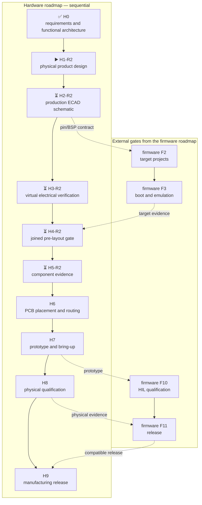

# Leshy2 hardware — roadmap to manufacturing

[Русский](roadmap.ru.md) · [Home](../README.md) ·
[Firmware roadmap](https://github.com/anton-vinogradov/esp32-leshy2-firmware/blob/main/docs/roadmap.md)

> **▶️ Current hardware boundary: H1-R2.7 — live FPV receiver factory-alternative audit and incremental physical placement.**
> R1 H1–H5 remain reusable evidence, not current acceptance. There is no R2 PCB layout or authorized order.

Status last reconciled: **27 August 2026**. This is the hardware repository's
own, sequential roadmap. Firmware work has its own `F0–F11` stages. Firmware
results appear here only where they are prerequisites of a hardware gate.

## Status key

- ✅ **Reviewed** — this stage's artifact and evidence exist; a later mismatch
  can reopen it.
- ▶️ **Current** — the first unfinished hardware stage.
- ⏳ **Waiting** — the immediately preceding hardware stage is not closed.
- 🔒 **Blocked** — an order or downstream action is forbidden until its gate.

## Where the hardware is

| Area | Actual state |
|---|---|
| Product requirements and functional architecture | ✅ [H0-R2 reviewed](h0-r2-functional-architecture.md): six domains, direct S3 UI/display/FPV and mandatory receive-only Airband |
| Physical product design | ▶️ [H1-R2.7](h1-r2-physical-layout.md): K331 functional/pin fit and the exact TBS FPV antenna join the placed Hub/Airband/power bodies; exact MMCX edge geometry, wave-solder tails and wall/plug service keepouts pass; only the K331 controlled body and installation route block H1 now, then complete views are regenerated |
| Principle diagrams on the site | H0-R2 functional map plus H1-R2.7 FPV/MMCX/inner-placement and H1-R2.4 filter/rail diagrams are current; complete dimensioned R1 views are explicit inputs being regenerated |
| Production ECAD schematic | ⏳ R1 sheets retained; R2 work waits for the H1-R2 placement and rail contract |
| Electrical and transient evidence | ⏳ R1 evidence retained; full R2 H3 rerun follows R2 H2 |
| Firmware interlock | ▶️ firmware F0-R2.0 must replace the five-image R1 boundary with six domains and the new Hub/Airband contracts |
| Joined pre-layout gate | ⏳ R1 H4 retained; R2 H4 waits for R2 H3 and firmware R2 evidence |
| KiCad schematic work | ⏳ no R2 sheet is accepted before H1-R2 closes |
| KiCad placement and PCB routing | 🔒 H6: not started and not authorized |
| Component evidence | ⏳ R1 routes remain available; the Airband active delta is live-checked and costs `$20.2038`, while the complete R2 BOM is rebuilt only after H4-R2 |
| Prototype PCB order | 🔒 Forbidden before H7 |
| Production order | 🔒 Forbidden before H9 |

Principle diagrams explain **what connects to what**. Production ECAD must add
exact symbols, contacts, values, rails, protection, footprints and ERC
evidence. PCB placement and routing begin only after the earlier gates close.

## Current H1-R2.7 and retained R1 evidence

<!-- current-substep: H1-R2.7 -->

**Exact marker: `H1-R2.7`** — the [incremental physical result](h1-r2-physical-layout.md)
places the new Hub, Airband chain, analog-FPV decoder/receiver reserve and exact
side MMCX in the accepted coordinate system. The connector now uses its exact
manufacturer body and mounting geometry; the exact FPV 1.8-V LDO is accepted
against the live factory supply surface. The generated audit reports zero
same-face body collisions and 2.44 mm minimum opposing clearance. The generated
[Airband filter feasibility](h1-airband-filter.md) passes the nominal reference
mask but misses the 180-MHz stress edge, so no production passive set is accepted;
the layout now reserves a 24×11-mm ground-fenced tuning cell. Matching text codes
on each port and antenna make the 13-piece kit unambiguous; colour is redundant.
The [FPV path result](h1-r2-fpv.md) accepts K331 functional and reserved-pin fit,
one direct 50-ohm trace without U.FL, and exact linear `TBS5G8MMCXA`. K331
remains a physical reserve until controlled dimensions and a JLCPCB sourcing or
explicit post-PCBA installation route exist. Exact requests were sent to AKK and
JLCPCB on 27 August 2026; both replies are pending and no gate is pre-closed.
These are the two present H1 blockers. Assembled RF/video performance and the
Taoglas fallback remain explicit H3/H5/H6/H8 verification rather than being
misreported as work that can close during physical design.
The live JLCPCB recheck found `RichWave RTC6715` `C7464354` and generic
`RX5808` `C9900139392` cards, but both have zero stock, MOQ 442 and only
Consign/Request-a-Quote routes. The RTC6715 public preliminary sheet also lacks
a reference RF/IF application and PCB layout. A custom receiver would therefore
increase 5.8-GHz design risk without fixing supply and is rejected as an H1 replacement.
The MMCX correction puts its 3.6-mm square body on the RF PCB and only its
3.0-mm barrel beyond the right edge. A generated service view proves the
1.2-mm nominal solder-tail projection has no opposing body and reserves a
4.5-mm wall aperture plus a Ø12×20-mm plug corridor; JLCPCB classifies the
exact C2894793 route as wave soldering on Economic/Standard PCBA. Received
mating, retention, final enclosure tolerance and strain remain H5 checks.
The [rail/thermal result](h1-r2-power-thermal.md) enumerates all twelve legal
groups: Airband is worst at 2.823 A, while the placed `TPS566231PRQFR` cell
accepts 3.75 A continuous / 4.25 A step and has a guaranteed 4.340-A eFuse
threshold. H3 owns effective-capacitance, switching-loss, load-step and
enclosure-thermal proof. H1 next closes the remaining exact bodies before the
complete exterior, inner faces and sections are regenerated. R2 ECAD remains blocked.

The following detailed H1–H5 material is retained R1 evidence. The [physical residual map](component-evidence-map.md)
and [primary-source research](component-source-research.md) have passed review.
The [33-line irreducible basket](component-sample-basket.md) is priced at
`$286.43`, and the [platform map](manufacturing-platform.md) assigns all 210
BOM lines / 1052 placements to exact `J0`–`J3`/`J4-F`/`J4-P` routes with zero
replacement. The old single-SA518 basket and 209-line platform snapshot do not
describe the current product. Public/read-only evidence is exhausted. A
JLCPCB's partial 26 August response confirms exact SA818S-V MOQ 1 and a typical
8–15-working-day pre-order and conditional post-order Function Test pricing.
Accumulators are user-supplied `J5-U`, not a delivery or supplier gate. The
actual two-designator U/V job, remaining J4-F/J4-P and
exact-MPN control need the prepared clarification. PCBWay remains the full-device
fallback and Seeed as the PCBA second source; neither has been contacted.
Quote/reservation and purchase are not authorized.
Historical machine gates `H5-EVR07` and `H5-EVR08` remain linked through the
retained R1 manufacturing evidence; neither is a current R2 acceptance.

- ✅ `H1.0` — project H0 requirements into a mechanical acceptance list.
- `H1.1` — physical-source register.
  - ✅ `H1.1.1` — every selected body or explicit `MPN TBD` has exactly one
    product role in the machine source.
  - ✅ `H1.1.2` — every rendered body has evidence-backed `L×W×H`, a named
    datum, orientation and connector/actuator-direction classification.
  - `H1.1.3` — classify each unresolved physical item; inferred dimensions
    cannot silently become exact.
    - ✅ `H1.1.3.1` — inventory every open mechanical evidence boundary.
    - ✅ `H1.1.3.2` — record every H1 blocker and H5 received-sample gate in
      the machine source.
    - `H1.1.3.3` — close the remaining source-data blockers and navigation
      control selection.
      - ✅ `H1.1.3.3.1` — exhaust public manufacturer-controlled sources and
        current lifecycle/stock evidence.
      - ✅ `H1.1.3.3.2` — compare fully documented replacements without
        degrading an accepted function.
      - ✅ `H1.1.3.3.3` — request remaining controlled data without an order or
        bound its effect with a documented replaceable design.
        - ✅ nRF paper path closed without a purchase: Ebyte Gen1 evidence,
          three exact `2118651-2` jumpers and three exact
          `U.FL-R-SMT-1(10)` board mates; received-lot fit moved to H5.
        - ✅ Navigation controls closed with five exact series
          `OMRON B3S-1100P` buttons for UP, DOWN, LEFT, RIGHT and OK; no
          custom cap, plunger or actuator is required.
        - ✅ U214 closed with exact pass-through
          `HLE-107-02-G-DV-PE-LC`; unknown post length no longer changes the dock.
        - ✅ Display closed with replaceable `L2-DISP-ADP-001-A`: an exact
          40-position DF40 mate and dual-contact ZIF preserve the 1→1 map while
          the undocumented tail cannot change the main UI PCB or enclosure.
      - ✅ `H1.1.3.3.4` — not required; the minimum sample plan remains a
        parked H5 artifact and authorizes no purchase.
  - ✅ `H1.1.4` — freeze the renderer source table.
- ✅ `H1.2` — one coordinate model for both boards, enclosure, fasteners and
  accessory keep-outs; existing independent projections are inputs only.
- ✅ `H1.3.0` — generate the outer faces from the unified source: screen,
  five navigation buttons, keys, encoder, LEDs, arrows, external interfaces and visible,
  unobscured silkscreen. Ten TX indicators form two aligned rows of five;
  the display distinguishes its 54.5×83.0-mm body from the exact
  48.96×73.44-mm 2:3 active area.
  - ✅ `H1.3.0.1` — place exact serial F1–F4 and F5–F8 columns beside the
    display, move F1/F2 off the rear face and M1, allocate all 16 direct-input
    contacts and add local ESD protection without changing the display.
  - ✅ `H1.3.0.2` — replace the headphone-only socket with exact CTIA
    `SJ-43504-SMT-TR`, preserve continuous plug detection, add clean dedicated
    microphone selection and seven pulled local I/O reserves at I²C `0x39`.
- ✅ `H1.3.1` — the complete front and rear exterior passed authorized
  self-review of labels, interface directions and control locations.
- ✅ `H1.4.0` — generated and machine-reviewed mirrored inner board faces: every body, speaker,
  microphone, RUN/KILL, service controls and board-to-board stack without
  inner silkscreen.
- ✅ `H1.4.1` — both internal faces and the sandwich relationship accepted
  after authorized self-review.
- ✅ `H1.5.0` — generated and machine-reviewed the real antenna-edge top view and separate sections
  through the U214 rail and battery/control zone, including insertion and
  service paths.
- ✅ `H1.5.1` — top/section geometry, U214 and battery/service access accepted
  after authorized self-review.
- ✅ `H1.6` — automated collision, hole/keep-out, clearance, label visibility,
  antenna spacing, actuator travel and service-access checks.
- ✅ `H1.7.0` — repeated the pin/resource allocation against the physical
  result and generated one cross-view acceptance package from the same source.
- ✅ `H1.7.1` — consolidated layout, automatic-check results and all changes
  since the earlier view gates accepted after authorized self-review.
- ✅ `H1.8` — complete H1 physical design accepted by the user on 23 August 2026.

Current H2 execution:

- `H2.0` — freeze authoritative schematic inputs and project structure.
  - ✅ `H2.0.1` — complete 1,048-row inventory reviewed: all 1,020 main-device
    circuit instances, 26 common LoRa-Cap parts and 2 alternative radio modules;
    187 H1 bodies and all 833 schematic-only main-device parts are reconciled.
  - ✅ `H2.0.2` — four-project hierarchy, board boundaries, rails and net naming
    rechecked against all 1,048 inventory rows; four intentionally component-empty
    root/test sheets are explicitly classified.
  - ✅ `H2.0.3` — generated 125-contact HW↔FW/BSP export and cross-repository drift checks reviewed.
- ✅ `H2.1` — four independent KiCad projects, 28 native schematic files and
  repository-controlled library tables created; every sheet passed the KiCad
  10 parser and empty-sheet ERC. No PCB file exists.
- ✅ `H2.2` — implement and review UI/control PCB sheets.
  - ✅ `H2.2.1` — `UI_00_ROOT`: nine child sheets, 95 exact cross-sheet nets
    and 232 explicit pins/labels; one direct root rail per net, no hidden global
    labels, native KiCad parse passed. All child sheets are populated; no stub
    finding remains and 390 generated-symbol copy warnings are machine-accounted.
  - ✅ `H2.2.2` — `UI_10_S3_CORE_MEMORY_BOOT`: 32 exact ledger components plus
    one module U.FL assembly-boundary symbol, all 41 S3 carrier pads, 39 hierarchy
    interfaces, seven intentional no-connects and three checked custom footprints.
  - ✅ `H2.2.3` — `UI_11_DISPLAY_TOUCH_STORAGE`: 49 instances, 40 panel
    contacts, 11 microSD contacts, 18 hierarchy interfaces and 33 explained
    no-connects; native KiCad review passed.
  - ✅ `H2.2.4` — `UI_12_CONTROLS_INDICATORS`: 71 exact components, 15 serial
    B3S-1100P switches, 45 hierarchy interfaces, nine actual-TX LEDs, one
    hardware FAULT LED, three custom footprints and three explained no-connects;
    native KiCad review passed.
  - ✅ `H2.2.5` — `UI_13_AUDIO_CODEC_HEADSET`: 104 exact components, all 21
    ES8311 contacts, six CTIA-jack contacts, five analog selectors, six digital
    isolation/gate devices, 24 hierarchy interfaces and eight explained
    no-connects; native KiCad review passed.
  - ✅ `H2.2.6` — `UI_20_C5_RADIO_IR_SERVICE`: 59 exact BOM instances plus
    factory ANT1, all 32 C5 carrier pads, dual IR RX, fail-closed IR TX,
    data-only USB/recovery and 18 interfaces; native KiCad review passed.
  - ✅ `H2.2.7` — `UI_21_FM_AM_RECEIVER`: 32 exact components, separate
    FM/SW and AM/LW antenna ports, complete Si4732 power/control/clock/audio,
    eight interfaces and four explained NCs; native KiCad review passed.
  - ✅ `H2.2.8` — `UI_40_INTERBOARD_M1`: one exact FX8C plug, all 80
    physical contacts and 51 interfaces; 20 `POWER_GROUND` contacts, seven
    `3V3_MAIN`, no reserve or NC; native KiCad review passed.
  - ✅ `H2.2.9` — `UI_50_TX_SAFETY_EVIDENCE`: 28 exact components, two RF
    detectors, a physical optical IR sensor, four comparator channels, two
    reset sinks, 18 interfaces and one explained NC; native KiCad review passed.
  - ✅ `H2.2.10` — `UI_60_TESTPOINTS_MANUFACTURING`: 11 exact physical
    1.0-mm test pads, each on one reviewed net with no false BOM/MPN entry;
    complete UI hierarchy passed native KiCad review.
- ✅ `H2.3` — all RF/power PCB sheets implemented and reviewed.
  - ✅ `H2.3.1` — `RF_00_ROOT`: 12 populated child sheets, 152 exact
    cross-sheet nets and 360 explicit pins/labels; native KiCad accepts the
    hierarchy with no child stubs or deferred fixture labels.
  - ✅ `H2.3.2` — `RF_01_USB_PD_CHARGE`: 52 exact components, 208 physical
    package pads, protected sink-only USB-PD, 2S/750-kHz NVDC charging, 12
    hierarchy interfaces and ten explained NC contacts; native KiCad passed.
  - ✅ `H2.3.3` — `RF_02_PACK_SAFETY_AON`: 61 exact symbols, 198 physical
    package/interface contacts, complete fail-closed 2S admission, fourteen
    hierarchy interfaces and six explained NC contacts; native KiCad passed.
  - ✅ `H2.3.4` — `RF_03_MAIN_RAILS_DOMAIN_GATES`: 69 exact components,
    186 physical contacts, independent protected AON/main/accessory rails,
    21 hierarchy interfaces and three explained NC contacts; native KiCad passed.
  - ✅ `H2.3.5` — `RF_30_RP2354_CORE_SERVICE`: 48 exact components,
    all 81 SC1512-A4 contacts and 219 total physical contacts, official
    RP2350 regulator/clock circuits, 51 interfaces and 13 explained NCs;
    native KiCad review passed.
  - ✅ `H2.3.6` — `RF_31_NRF24_X3`: 105 exact ledger components plus three
    factory-IPEX boundaries, 311 physical contacts, three independent PIO SPI
    and RF paths, 33 interfaces and two explained NCs; native KiCad passed.
  - ✅ `H2.3.7-R1` — `RF_32_SUBGHZ_VOICE`: 143 exact components, 473 physical
    contacts, independent CC1101 data plus SA818S-V and SA818S-U
    power/control/RF paths, 40 interfaces and 20 explained NCs; native KiCad
    review passed.
  - ✅ `H2.3.8` — `RF_34_U214_M5_EXT`: 53 symbols, 52 board-fitted
    components, 228 contacts, 27 interfaces and separate protected U214/native
    Unit branches; native KiCad review passed.
  - ✅ `H2.3.9` — `RF_35_REAR_CONTROLS`: seven fitted components, 36
    contacts, six interfaces and four independent direct controls; native
    KiCad review passed.
  - ✅ `H2.3.10` — `RF_36_AUDIO_IO_AMP`: 14 symbols, 34 contacts, exact
    microphone/amplifier footprints and two independent floating-BTL paths;
    native KiCad review passed.
  - ✅ `H2.3.11` — `RF_40_INTERBOARD_M1`: all 80 physical contacts and 51
    interfaces match UI-side M1 row-for-row; native KiCad review passed.
  - ✅ `H2.3.12` — `RF_50_TX_SAFETY_EVIDENCE`: 97 components, 369
    contacts, explicit AON supply/bypass, watchdog/latch/reset and five
    physical-RF evidence channels; native KiCad review passed.
  - ✅ `H2.3.13` — `RF_60_TESTPOINTS_MANUFACTURING`: 52 physical 1.0-mm
    test pads, 13 recovery paths and 6 RF-evidence channels; complete RF/power
    hierarchy passes native KiCad with no child stubs or deferred fixture labels.
- `H2.4` — implement and review display-adapter and LoRa-Cap sheets.
  - ✅ `H2.4.1` — `ADP_00_DISPLAY_ADAPTER`: two serial connectors, 40 exact
    one-to-one conductors, two mechanical-only fittings and one
    manufacturer-derived footprint; native KiCad review passed.
  - ✅ `H2.4.2` — `CAP_00_ROOT`: exact 14-contact host boundary, three child
    sheets, 19 explicit interfaces and visible root wiring; native KiCad review passed.
  - ✅ `H2.4.3` — `CAP_10_RADIO_CONTROL`: seven fitted symbols per regional
    variant, 42 contacts, direct 50-Ohm final feed and full detector circuit;
    native KiCad review passed.
  - ✅ `H2.4.4` — `CAP_20_POWER_BUS`: protected fixed 3.3-V supply,
    identity EEPROM and pull-ups; native KiCad review passed.
  - ✅ `H2.4.5` — `CAP_30_TX_EVIDENCE`: comparator, pulse extender and
    active-low open-drain evidence output; native KiCad review passed.
- ✅ **`H2.5` — reviewed:** independently review safety-critical paths.
  - ✅ `H2.5.1` — sources, pack admission, charging and all rails:
    [reviewed](power-architecture.md), including corrected global annotation
    across all three complete KiCad hierarchies.
  - ✅ `H2.5.2` — reset, boot, service and recovery for every programmable
    domain: [reviewed](service-recovery.md), including corrected missing
    PD/EEPROM fixture pads.
  - ✅ `H2.5.3` — no-back-power across USB, interboard and expansions:
    [reviewed](interface-isolation.md).
  - ✅ `H2.5.4` — reset-safe quiet state and unused-interface isolation:
    [reviewed](quiet-state.md).
  - ✅ `H2.5.5` — watchdog, thermal/fault supervision and `FAULT_KILL`:
    [reviewed](fault-shutdown.md).
  - ✅ `H2.5.6` — [consolidated findings and closed review](safety-review.md).
- ✅ `H2.6` — [native ERC and every intentional NC reviewed](erc-review.md):
  four clean projects, 191 physical NC contacts and no missing rationale.
- ✅ `H2.7` — [physical, net, M1 and firmware F2 reconciliation closed](hwfw-reconciliation.md).
- ✅ **`H2.8` — reviewed:** formal final user acceptance before H3.
  - ✅ `H2.8.1` — [acceptance scope and every deferred gate published](h2-acceptance.md).
  - ✅ `H2.8.2` — accepted by the user on 24 August 2026 at hardware
    `25d9ee2` / firmware `900bb2b`.
- ✅ **`H3.0` — reviewed:** virtual-verification inputs, methods and reproducibility.
  - ✅ `H3.0.1` — [accepted H2 input and the complete 16-domain matrix frozen](virtual-verification.md).
  - ✅ `H3.0.2` — [214-type register complete](parameter-model-register.md),
    no source is missing and `3× E01-ML01IPX` remain.
  - ✅ `H3.0.3` — [methods and pass/fail rules frozen](verification-methods.md).
- ✅ **`H3.1` — reviewed:** worst-case steady-state sources, rails, charging and thermal inputs.
  - ✅ `H3.1.1` — [43 source/charge and 2,032 complete states enumerated](power-state-register.md).
  - ✅ `H3.1.2` — [200 rail profiles pass](dc-power-budget.md); the external eFuse threshold mismatch is corrected.
  - ✅ `H3.1.3` — [2,032 source/charge/discharge states pass](source-charge-budget.md).
  - ✅ `H3.1.4` — [steady DC evidence consolidated](dc-verification-result.md), zero unresolved findings.
- ✅ `H3.2` — [startup/shutdown, handover, brownout, inrush, watchdog and `FAULT_KILL`](power-transition-result.md) reviewed.
  - ✅ `H3.2.1` — [startup, orderly shutdown and hard `FAULT_KILL`](power-transition-startup.md).
  - ✅ `H3.2.2` — [handover, DPM and brownout](power-handover.md).
  - ✅ `H3.2.3` — [eFuse, inrush and load steps](inrush-load-step.md).
  - ✅ `H3.2.4` — [watchdog, retained fault record and fault-only UI](watchdog-fault-display.md).
  - ✅ `H3.2.5` — consolidated review, 0 analytical failures; two source errors corrected.
- ✅ `H3.3` — display/backlight, audio, IR and battery-analog corners.
  - ✅ `H3.3.1` — [display supply, backlight and direct-QSPI reviewed](display-electrical-verification.md); two source errors corrected.
  - ✅ `H3.3.2` — [codec, microphone, headset, speaker and voice TX reviewed](audio-electrical-verification.md); four source errors corrected.
  - ✅ `H3.3.3` — [IR receive, transmit, optical evidence and thermal limits reviewed](ir-electrical-verification.md); four source errors corrected.
  - ✅ `H3.3.4` — [battery sensing, thermistors and analog fault thresholds reviewed](battery-analog-verification.md); four source errors corrected.
  - ✅ `H3.3.5` — [154 leaf and 22 consolidation checks reviewed](analog-corner-result.md); 14 source corrections closed.
- ✅ `H3.4` — digital levels, reset defaults, bandwidth, timing and expansion loading.
  - ✅ `H3.4.1` — [voltage levels, pulls, reset defaults and no-back-power reviewed](digital-levels-verification.md).
  - ✅ `H3.4.2` — [bandwidth, latency and timing reviewed](digital-timing-verification.md).
  - ✅ `H3.4.3` — [M1, U214, M5 Unit and service-boundary loading reviewed](boundary-loading-verification.md).
  - ✅ `H3.4.4` — [digital evidence consolidated](digital-verification-result.md): 162 leaf and 27 cross-domain checks.
- ✅ `H3.5` — RF feed, return-path, corridor and coexistence constraints.
  - ✅ `H3.5.1` — [feed, connector, matching and loss constraints reviewed](rf-feed-constraints.md) for all nine paths.
  - ✅ `H3.5.2` — [RF corridors, keepouts, reference planes and returns reviewed](rf-layout-constraints.md).
  - ✅ `H3.5.3` — [one-active-group isolation, quiet state and concurrent 3×nRF24 reviewed](rf-coexistence.md).
  - ✅ `H3.5.4` — [RF evidence consolidated](rf-verification-result.md): 125 leaf and 22 cross-domain checks.
- ✅ `H3.6` — thermal model, single-fault tree and extended-operation safety.
  - ✅ `H3.6.1` — [board, battery and enclosure thermal model reviewed](thermal-model.md); charger TREG/TSHUT corrected.
  - ✅ `H3.6.2` — [30 single faults traced through independent shutdown and recovery](single-fault-review.md).
  - ✅ `H3.6.3` — [extended operation, the `0 to 35 °C` engineering target and configurable self-test reviewed](unattended-operation.md); 24/48 hours are H8 intervals only.
  - ✅ `H3.6.4` — [70 leaf and 24 thermal/fault/endurance consolidation checks reviewed](thermal-fault-result.md).
- ✅ `H3.7` — cross-check, physical-only residuals and formal H3 acceptance.
  - ✅ `H3.7.1` — [all H3 requirements, artifacts, H2 instances and root nets cross-checked](h3-crosscheck.md).
  - ✅ `H3.7.2` — [all 85 physical-only residual rows published with evidence owners](physical-evidence-register.md).
  - ✅ `H3.7.3` — [formal H3 acceptance package prepared](h3-acceptance.md).
  - ✅ `H3.7.4` — explicit user acceptance recorded.
- ✅ `H4.0.1` — reviewed firmware F3 evidence is linked into the gate.
- ✅ `H4.1` — H1 mechanics, H2 ECAD, H3 evidence and firmware F3 joined.
- ✅ `H4.2` — three documentation-only contradictions corrected at source and regenerated.
- ✅ `H4.3` — [joined H4 gate reviewed](h4-prelayout-gate-report.md).
- ✅ `H5.0.1-R1` — [all nine residuals and 14 mechanical gates mapped](component-evidence-map.md) for the current dual-SA818S design.
- ✅ `H5.0.2-R1` — [primary sources and serial alternatives reviewed](component-source-research.md); U/V exact routes retained and CE constrained as a non-silent qualified-pending UHF alternate.
- ▶️ `H5.0.3-R1` — basket and 210-route map complete; partial JLCPCB reply confirms SA818S-V MOQ 1 / typical 8–15-working-day pre-order and conditional Function Test; accumulators are user-supplied `J5-U`; two-designator/J4-F/J4-P clarification prepared; PCBWay fallback not contacted.

The reviewed H2 plan is [`h2-schematic-plan.json`](../hardware/ecad/h2-schematic-plan.json),
the completed H3/H4 plans are [`h3-verification-plan.json`](../hardware/verification/h3-verification-plan.json)
and [`h4-prelayout-plan.json`](../hardware/verification/h4-prelayout-plan.json),
and the active plan is [`h5-component-evidence-plan.json`](../hardware/verification/h5-component-evidence-plan.json).
Closing any subtask changes the exact landing-page and roadmap marker in the
same commit. A later change reopens affected gates and dependencies.

## Hardware sequence and firmware intersections

The former H1–H5 reviews are reusable R1 evidence, not statuses of this R2
sequence. Firmware is independently rebuilding its six-domain contract at
F0-R2; target emulator/dev-board evidence must be current before H7.
Prototype PCB submission is allowed at H7 only after H6 acceptance, inherited
F3 closure through H4 and explicit order approval. Emulation does not replace
physical bring-up, but fabrication cannot be the first execution of the code.
A production order is possible only after H9.

## Complete hardware path

| Stage | Status | Stage output | Exit criterion |
|---|---|---|---|
| **H0. Product requirements and functional architecture** | ✅ [R2 reviewed](h0-r2-functional-architecture.md) | Six compute domains, direct S3 UI/display/FPV, independent Hub fan-out and mandatory receive-only Airband | Every function has one owner; S3 and Hub GPIO budgets close; transport, quiet-state and firmware boundaries are explicit |
| **H1. Physical product design** | ▶️ Current `H1-R2.7` | Regenerated exterior/inner faces, sections, assembly sequence, exact body envelopes, RF paths and ≥3.5-A continuous / ≥4.0-A step power contract | No component, fastener, silkscreen, antenna, accessory or cross-board collision; every R2 body has an exact MPN or explicit qualified replaceable boundary; the user accepts the mockup |
| **H2. Production ECAD schematic** | ⏳ Waiting for H1-R2 | R2 sheets and machine-readable HW↔FW contract; R1 sheets remain evidence only | Exact symbol/footprint/pin/net/value; quiet/recovery/safety reviewed; firmware consumes the R2 contract without invented pins |
| **H3. Virtual electrical verification** | ⏳ Waiting for H2-R2 | Complete R2 electrical, RF, power, timing and thermal rerun | All six-domain states and Airband/FPV coexistence pass before fabrication |
| **H4. Joined pre-layout gate** | ⏳ Waiting for H3-R2 and firmware R2 | One current mechanics/ECAD/electrical/firmware review | No virtual blocker remains and every physical residual owns a measurement |
| **H5. Component evidence** | ⏳ Waiting for H4-R2 | Complete current R2 factory map; R1 basket and routes remain reusable inputs | Every R2 BOM line has an exact factory route without silent substitution |
| **H6. PCB placement and routing** | 🔒 Waiting for H5-R2 | Two real boards implementing the accepted R2 schematic and mechanics | Both-side placement review; DRC; impedance and return-current review; RF isolation, antenna feeds, thermal copper, creepage, test points, assembly and manufacturability pass; fab package is separately accepted |
| **H7. Prototype fabrication and bring-up** | 🔒 Waiting for H6, current firmware emulator/dev-board evidence, accepted factory boundary and order approval | Small prototype lot, factory-integrated parts, separately packed post-assembly parts and retained bring-up log | Box-build output matches the accepted boundary; rails sequence correctly; all six controllers program and recover; interfaces, display, storage, audio, radio and expansion pass smoke tests; every rework is reflected in source |
| **H8. Physical qualification** | 🔒 Waiting for H7 | HIL, RF, thermal, power, safety and endurance evidence | 3×nRF24 pass `3R/1T2R/2T1R/3T`; active signals are not stalled by neighbors; inactive interfaces are physically quiet; coexistence, antenna/VNA, endurance, charge, handover, thermal, watchdog and single-fault tests pass |
| **H9. Manufacturing release** | 🔒 Waiting for H8 and firmware F11 | Reproducible hardware manufacturing and test package paired with released firmware | Zero blocker; residual risks accepted; BOM, Gerber/ODB++, placement, assembly, fixture, calibration and hardware tests agree; firmware bundle and both compatible release tags are named |

## Advancement rules

1. Hardware stages are sequential: no later `H` stage can be reviewed while
   an earlier `H` stage remains unfinished.
2. A cross-repository dependency is named by its real firmware `F` stage; it
   never becomes a duplicate hardware stage.
3. A mismatch is fixed in its source artifact and downstream files are
   regenerated.
4. An unexpected extra feature is not silently removed: first check whether a
   requirement was omitted.
5. A low-cost improvement that does not change product behavior is accepted
   automatically. Functional or material-cost changes require a decision.
6. RF transmission and dangerous fault tests run only on owned loads, with
   target-owner authorization or in an isolated laboratory.
7. Closing each top-level `H*` phase publishes a bilingual result report and a
   link from the roadmap tables and landing page. An internal substep updates
   the exact current marker but does not receive a separate global report.

## Next action

The current boundary is `H1-R2.7`. The second Hub RP, exact Airband active
parts, FPV decoder/K331 reserve, dimensioned side MMCX, exact FPV LDO and exact
TBS5G8MMCXA antenna have passed their present functional/body/supply boundaries.
The main rail is now a placed
3.75-A continuous / 4.25-A step architecture with all legal groups enumerated.
Next, close the remaining exact bodies and rebuild the complete same-face,
cross-board, antenna, U214, battery and service views. H3 later proves the
dynamic and enclosure-thermal power gates. PCB routing, quote/reservation and every order remain blocked.
