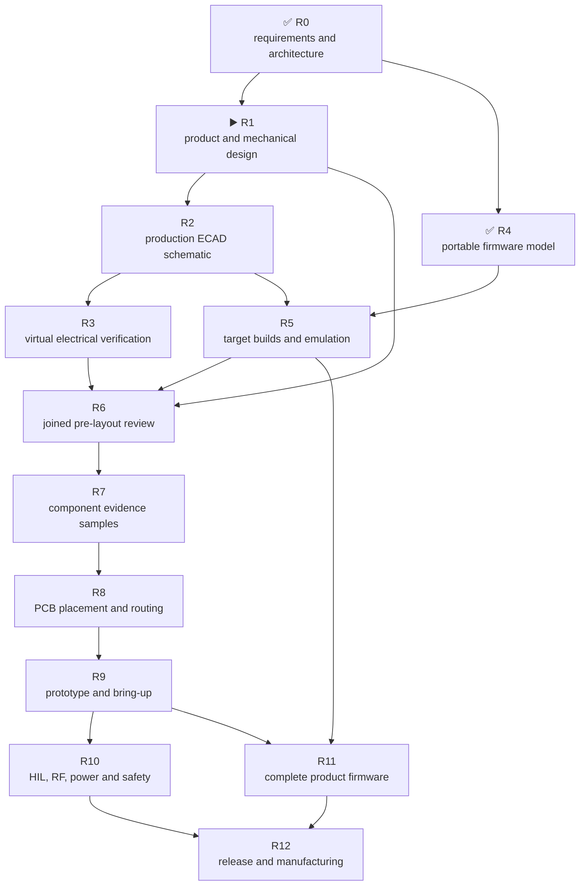

# Leshy2 — roadmap to a finished product

[Русский](roadmap.ru.md) · [Home](../README.md)

> **▶️ Current: R1 — product and mechanical design.** Architecture and the
> portable executable firmware model are reviewed, but the external and inner
> mockup has not been accepted. There is no current production schematic, PCB
> layout, target build or target-emulator run. Component and PCB orders remain
> blocked.

Status last reconciled: **22 August 2026**. This page follows the project until
full completion and is updated whenever a stage changes.

## Status key

- ✅ **Reviewed** — the artifact and its evidence exist; a later mismatch may
  reopen the stage.
- ▶️ **Current** — the main active stage.
- ⏳ **Waiting** — prerequisites are not closed.
- 🔒 **Blocked** — the action is forbidden until the stated gate passes.

## Where we are

| Area | Actual state |
|---|---|
| Capabilities, physical owners, buses and pin assignment | ✅ Reviewed for working architecture G2F-3I |
| Portable safety, L2IP, update and five-domain logic | ✅ Reviewed: 24 deterministic host scenarios; clean ASan/UBSan |
| External and inner product design | ▶️ A dimensioned projection exists, but it is not user-approved production mechanics |
| Principle diagrams on the site | ✅ Conceptual component relationships are published |
| Current production ECAD schematic | ⏳ Not created; the incompatible former implementation is archived |
| KiCad placement and PCB routing | 🔒 Not started and not authorized |
| Electrical and transient simulation | ⏳ Not run |
| Five target images | ⏳ Not created |
| Emulators | ⏳ No target run; the host model is not called MCU emulation |
| Physical samples and HIL | 🔒 Not ordered or run |
| Production PCB order | 🔒 Forbidden before R8 |

Principle diagrams explain **what connects to what**. A production ECAD
schematic must additionally contain exact symbols, contacts, values, rails,
protection, footprints and ERC evidence. PCB layout begins later still.

## Stage dependencies

Evidence-component ordering is allowed only at R7. Prototype PCB ordering is
allowed at R9. A production order is possible only after R12.

## Complete path

| Stage | Status | Stage output | Exit criterion |
|---|---|---|---|
| **R0. Requirements and architecture** | ✅ Reviewed | Complete capability set, five compute domains, every radio/interface owner, pin/resource budget, one active signal group and full-function 3×nRF24 | Architecture checks pass; no required interface, contact or physical owner is unknown |
| **R1. Product and mechanical design** | ▶️ Current | Accepted exterior, both outer and inner faces, true antenna-edge view, physical sections and assembly sequence | Dimensions come from selected MPNs; no component, fastener, silkscreen or accessory collision; battery, U214, controls, ports, microphone and speaker are accessible; the user accepts the mockup |
| **R2. Production ECAD schematic** | ⏳ Waiting for R1 | A new current schematic split into reviewable sheets | Exact symbol/footprint/pin/net/value; intentional NCs explained; no unexplained ERC error; machine net map matches architecture; reset, boot, recovery, no-back-power, quiet state and `FAULT_KILL` independently reviewed |
| **R3. Virtual electrical verification** | ⏳ Waiting for R2 | Calculations and simulation before expensive physical work | Worst-case DC budget; startup/shutdown, USB↔battery handover, brownout, watchdog, eFuse and load steps; thermal/fault tree; display/backlight, audio and IR corners; timing/levels; RF corridors, returns and pre-layout constraints |
| **R4. Portable executable model** | ✅ Reviewed | Common C safety, L2IP, atomic update/rollback and five-domain fault-injection cores | 24 scenarios pass normal and ASan/UBSan builds; CRC, replay, deadlines, queue saturation, TX lease/evidence, thermal, heartbeat, watchdog, fault viewer and rollback are covered |
| **R5. Target builds and available emulation** | ⏳ Waiting for R2 and using R4 | Buildable S3, C5, RP, Pack and Safety skeleton images on production SDKs | All five images build reproducibly; map files fit flash/RAM/rollback; S3 runs boot/fault/update in official QEMU; shared code runs on host platforms; non-emulated peripherals have a mandatory dev-board matrix |
| **R6. Joined pre-layout review** | 🔒 Waiting for R1–R5 | One mechanical/electrical/firmware review | No virtually testable blocker remains; every residual physical uncertainty has a named measurement and bring-up test |
| **R7. Component evidence samples** | 🔒 Waiting for R6 and separate cost approval | Minimum evidence purchase, not a production basket | Received display/U214/connectors/radios are identified and measured; raw records are retained; a mismatch returns to its source stage |
| **R8. PCB placement and routing** | 🔒 Waiting for R7 | Two real boards implementing the accepted schematic and mechanics | Both-side placement review; DRC; impedance and return-current review; RF isolation, antenna feeds, thermal copper, creepage, test points, assembly and manufacturability pass; fab package separately accepted |
| **R9. Prototype and bring-up** | 🔒 Waiting for R8 and order approval | Small prototype PCB lot and retained bring-up log | Rails sequence correctly; all five MCUs program and recover; interfaces, display, storage, audio, radio and expansion pass smoke tests; every rework is reflected in source |
| **R10. Complete physical qualification** | 🔒 Waiting for R9 | HIL, RF, thermal, power, safety and endurance evidence | 3×nRF24 pass `3R/1T2R/2T1R/3T`; the active group is not stalled by neighbors; inactive interfaces are physically quiet; coexistence, antenna/VNA, endurance, charge, handover, thermal, watchdog and single-fault tests pass |
| **R11. Complete product firmware** | ⏳ Starts after R5; closes after R9/R10 | Real five-target features, UI and update system | Menu/waterfall, radio profiles, recording, audio, M5 expansion, three functional levels, fresh Controlled Zone banner, target authorization, installation non-aggression agreement, signed open update, recovery and fault viewer pass automatic and HIL tests |
| **R12. Release and manufacturing** | 🔒 Waiting for R10 and R11 | Reproducible finished product | No blocker; residual risks explicitly accepted; BOM, Gerber/ODB++, placement, assembly, fixture, calibration, firmware bundles, keys, recovery, licensing and site agree; both repositories receive compatible release tags |

## Advancement rules

1. Each stage consumes reviewed source artifacts from its prerequisites rather
   than manually restating earlier decisions.
2. A mismatch is fixed in its source artifact and downstream files are
   regenerated.
3. An unexpected extra feature is not silently removed: first check whether a
   requirement was omitted.
4. A low-cost improvement that does not change product behavior is accepted
   automatically. Functional or material-cost changes require a separate
   decision.
5. **Reviewed** means evidence exists; a later fact may reopen the stage.
6. RF transmission and dangerous fault tests run only on owned loads, with
   target-owner authorization or in an isolated laboratory.

## Next action

Work is currently limited to R1: turn the exterior and inner mockup into one
clear package for user acceptance. Production ECAD, PCB routing and purchasing
do not start first.
