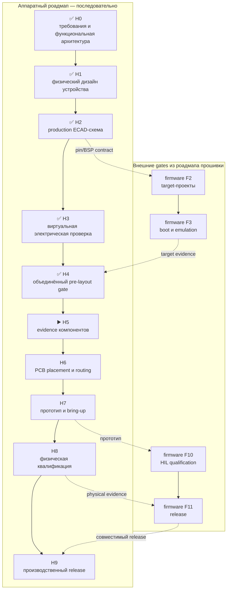

# Leshy2 — аппаратный роадмап до производства

[English](roadmap.md) · [На главную](../README.ru.md) ·
[Роадмап прошивки](https://github.com/anton-vinogradov/esp32-leshy2-firmware/blob/main/docs/roadmap.ru.md)

> **▶️ Текущая аппаратная граница: H5.0.3 — PCBA-площадка и аудит доступности BOM.**
> H0–H4 прошли ревью. PCB layout и разрешённого заказа пока нет.

Последняя сверка статуса: **25 августа 2026 года**. Это собственный
последовательный роадмап hardware-репозитория. У прошивки есть отдельные этапы
`F0–F11`; здесь они появляются только как пререквизиты аппаратных gates.

## Обозначения

- ✅ **Проведено ревью** — артефакт и evidence этого этапа существуют; новое
  несоответствие может открыть его повторно.
- ▶️ **Сейчас** — первый незавершённый аппаратный этап.
- ⏳ **Ожидает** — непосредственно предшествующий аппаратный этап не закрыт.
- 🔒 **Заблокировано** — заказ или downstream-действие запрещено до gate.

## Где находится железо

| Область | Фактическое состояние |
|---|---|
| Требования продукта и функциональная архитектура | ✅ H0: проведено ревью границ возможностей, доменов, владельцев, классов интерфейсов и safety rules |
| Физический дизайн устройства | ✅ H1 принят: внешние/внутренние виды, разрезы, service paths и pin/resource fit пройдены |
| Принципиальные диаграммы на сайте | Принятые входы H2; это не production ECAD |
| Production ECAD-схема | ✅ H2 принят на hardware `25d9ee2`; firmware F2 синхронизирован на `900bb2b` |
| Электрические и переходные evidence | ✅ H3 принят; 85 physical-only строк остаются назначены H5/H6/H8 |
| Пересечение с прошивкой | ✅ [F3 проведено ревью](https://github.com/anton-vinogradov/esp32-leshy2-firmware/blob/main/docs/f3-boot-memory-emulation-report.ru.md): точное S3 QEMU execution, 52 воспроизводимых artifacts и явные физические gates |
| Объединённый pre-layout gate | ✅ [H4 проведён](h4-prelayout-gate-report.ru.md): 0 открытых виртуальных противоречий; у 85 физических residuals сохранены владельцы H5/H6/H8 |
| Работа над KiCad-схемой | ✅ H2 проведено ревью; позднее несоответствие повторно откроет затронутые листы |
| KiCad placement и PCB routing | 🔒 H6: не начаты и не разрешены |
| Evidence компонентов | ▶️ [JLCPCB Standard PCBA выбран неэксклюзивным ориентиром](manufacturing-platform.ru.md): 10 критических строк production BOM из 209 связаны с `J0`–`J4`; upload, замены, заказ образцов и тесты не проводились |
| Заказ прототипных PCB | 🔒 Запрещён до H7 |
| Production-заказ | 🔒 Запрещён до H9 |

Принципиальные диаграммы объясняют, **что с чем связано**. Production ECAD
должна добавить точные symbols, contacts, values, rails, protection,
footprints и ERC evidence. PCB placement и routing начинаются лишь после
закрытия предшествующих gates.

## Завершённые H1–H4 и текущее сокращение evidence H5

<!-- current-substep: H5.0.3 -->

**Точный маркер: `H5.0.3`** — [единая корзина](component-sample-basket.ru.md)
покрывает все девять residuals H5 и 14 mechanical gates.
[Производственный baseline](manufacturing-platform.ru.md) выбирает JLCPCB
Standard PCBA без lock-in. Контрольный прогон нормализованного BOM сопоставил
176 строк из 209 и распознал все 1019 установок; 33 явных outlier — текущий
набор квалификации `J0`–`J4`. H5.0.3 ещё не проведён ревью, замены,
quote/reservation и закупка не разрешены.

- ✅ `H1.0` — перенести требования H0 в механический acceptance list.
- `H1.1` — реестр физических первоисточников.
  - ✅ `H1.1.1` — у каждого выбранного корпуса или явного `MPN TBD` в machine
    source есть ровно одна роль в продукте.
  - ✅ `H1.1.2` — у каждого отрисованного корпуса есть evidence-backed
    `L×W×H`, именованный datum, ориентация и классификация направления
    connector/actuator.
  - `H1.1.3` — классифицировать каждую физическую неопределённость; inferred-
    размер не становится точным молча.
    - ✅ `H1.1.3.1` — собрать все открытые границы механических evidence.
    - ✅ `H1.1.3.2` — записать все blocker H1 и received-sample gate H5 в
      machine source.
    - `H1.1.3.3` — закрыть оставшиеся source-data blocker и выбрать серийные
      органы навигации.
      - ✅ `H1.1.3.3.1` — исчерпать открытые controlled-источники
        производителей и актуальные evidence жизненного цикла/наличия.
      - ✅ `H1.1.3.3.2` — сравнить полностью документированные замены без
        ухудшения принятого функционала.
      - ✅ `H1.1.3.3.3` — запросить у производителя оставшиеся
        controlled-данные без размещения заказа или ограничить их влияние
        документированной сменной конструкцией.
        - ✅ Бумажный nRF-тракт закрыт без закупки: evidence Ebyte Gen1, три
          точных кабеля `2118651-2` и три точных платных разъёма
          `U.FL-R-SMT-1(10)`; проверка реальной партии перенесена в H5.
        - ✅ Навигация закрыта пятью точными серийными кнопками
          `OMRON B3S-1100P` для ВВЕРХ, ВНИЗ, ВЛЕВО, ВПРАВО и OK; заказные
          колпачки, толкатели и приводы не нужны.
        - ✅ U214 закрыт проходной точной розеткой
          `HLE-107-02-G-DV-PE-LC`; неизвестная длина штырей не меняет док.
        - ✅ Дисплей закрыт сменной платой `L2-DISP-ADP-001-A`: точная 40-pin
          пара DF40 и двухсторонний ZIF сохраняют разводку 1→1, а неизвестный
          хвост не влияет на основную UI-плату или корпус.
      - ✅ `H1.1.3.3.4` — не потребовался: минимальный sample-план остаётся
        отложенным H5-артефактом и не разрешает закупку.
  - ✅ `H1.1.4` — зафиксировать source table renderer.
- ✅ `H1.2` — единая система координат двух плат, корпуса, крепежа и keep-outs;
  существующие независимые проекции служат только входами.
- ✅ `H1.3.0` — сгенерировать из единого source внешние стороны: экран, пять кнопок навигации,
  keys, encoder, LEDs, стрелки, внешние интерфейсы и видимую, ничем не
  перекрытую шелкографию. Десять TX-индикаторов образуют два выровненных ряда
  по пять; экран разделён на корпус 54,5×83,0 мм и точную активную область
  48,96×73,44 мм с пропорцией 2:3.
  - ✅ `H1.3.0.1` — разместить у экрана колонки точных серийных кнопок F1–F4
    и F5–F8, убрать F1/F2 с задней стороны и M1, распределить все 16 прямых
    входов и добавить локальную ESD-защиту без изменения дисплея.
  - ✅ `H1.3.0.2` — заменить разъём только для наушников точным CTIA
    `SJ-43504-SMT-TR`, сохранить непрерывный detect, добавить отдельный чистый
    выбор микрофона и семь подтянутых локальных I/O по адресу I²C `0x39`.
- ✅ `H1.3.1` — лицевая и задняя стороны прошли разрешённое саморевью
  подписей, направлений интерфейсов и мест органов управления.
- ✅ `H1.4.0` — сгенерированы и машинно проверены зеркальные внутренние стороны: каждый корпус,
  speaker, microphone, RUN/KILL, service controls и межплатный stack без
  внутренней шелкографии.
- ✅ `H1.4.1` — обе внутренние стороны и их взаимное положение приняты после
  разрешённого саморевью.
- ✅ `H1.5.0` — сгенерированы и машинно проверены настоящий вид от антенного торца и отдельные
  разрезы зоны U214 и battery/control с траекториями установки и обслуживания.
- ✅ `H1.5.1` — геометрия сверху/на разрезах, U214 и доступ к
  батареям/обслуживанию приняты после разрешённого саморевью.
- ✅ `H1.6` — автоматические проверки коллизий, отверстий/keep-outs, зазоров,
  видимости подписей, расстояний антенн, actuator travel и service access.
- ✅ `H1.7.0` — pin/resource allocation повторно проверен по физическому
  результату и из того же source создан единый cross-view acceptance package.
- ✅ `H1.7.1` — пользовательское согласование сводной компоновки, результатов
  автоматических проверок и всех изменений после ранних gates проведено
  разрешённым саморевью.
- ✅ `H1.8` — полный физический дизайн H1 принят пользователем 23 августа 2026 года.

Текущее выполнение H2:

- `H2.0` — зафиксировать авторитетные входы схемы и структуру проектов.
  - ✅ `H2.0.1` — проверен полный реестр из 1 048 строк: все 1 020 схемных
    экземпляров основного устройства, 26 общих компонентов LoRa Cap и 2
    альтернативных радиомодуля; сверены 187 тел H1 и 833 схемных компонента.
  - ✅ `H2.0.2` — четыре проекта, границы плат, rails и net naming повторно
    сверены со всеми 1 048 строками; четыре намеренно пустых root/test-листа
    классифицированы явно.
  - ✅ `H2.0.3` — проверены HW↔FW/BSP export на 125 контактов и drift checks двух репозиториев.
- ✅ `H2.1` — созданы четыре независимых KiCad-проекта, 28 native-файлов схем
  и репозиторные таблицы библиотек; каждый лист прошёл parser и empty-sheet ERC
  в KiCad 10. PCB-файлов нет.
- ✅ `H2.2` — реализовать и проверить листы UI/control PCB.
  - ✅ `H2.2.1` — `UI_00_ROOT`: девять дочерних листов, 95 точных межлистовых
    цепей и 232 явных pins/labels; одна прямая root-rail на цепь, без скрытых
    global labels, native parse KiCad пройден. Все child-листы заполнены;
    пустых stubs нет, 390 предупреждений о копиях сгенерированных символов
    машинно учтены.
  - ✅ `H2.2.2` — `UI_10_S3_CORE_MEMORY_BOOT`: 32 точных компонента реестра плюс
    символ границы встроенного U.FL модуля, все 41 carrier-контакт S3, 39 hierarchy-
    интерфейсов, семь намеренных no-connect и три проверенных custom-footprint.
  - ✅ `H2.2.3` — `UI_11_DISPLAY_TOUCH_STORAGE`: 49 экземпляров, 40 контактов
    панели, 11 контактов microSD, 18 hierarchy-интерфейсов и 33 объяснённых
    no-connect; native KiCad review пройден.
  - ✅ `H2.2.4` — `UI_12_CONTROLS_INDICATORS`: 71 точный компонент, 15 серийных
    кнопок B3S-1100P, 45 hierarchy-интерфейсов, девять actual-TX LED, один
    аппаратный FAULT LED, три custom-footprint и три объяснённых no-connect;
    native KiCad review пройден.
  - ✅ `H2.2.5` — `UI_13_AUDIO_CODEC_HEADSET`: 104 точных компонента, все 21
    контакт ES8311, шесть контактов CTIA jack, пять аналоговых селекторов, шесть
    устройств digital isolation/gate, 24 hierarchy-интерфейса и восемь
    объяснённых no-connect; native KiCad review пройден.
  - ✅ `H2.2.6` — `UI_20_C5_RADIO_IR_SERVICE`: 59 точных BOM-экземпляров
    плюс заводской ANT1, все 32 carrier-pad C5, два IR RX, fail-closed IR TX,
    data-only USB/recovery и 18 интерфейсов; native KiCad review пройден.
  - ✅ `H2.2.7` — `UI_21_FM_AM_RECEIVER`: 32 точных компонента, отдельные
    антенные порты FM/SW и AM/LW, полные цепи power/control/clock/audio Si4732,
    восемь интерфейсов и четыре объяснённых NC; native KiCad review пройден.
  - ✅ `H2.2.8` — `UI_40_INTERBOARD_M1`: один точный FX8C plug, все 80
    физических контактов и 51 интерфейс; 20 контактов `POWER_GROUND`, семь
    `3V3_MAIN`, ни одного резерва или NC; native KiCad review пройден.
  - ✅ `H2.2.9` — `UI_50_TX_SAFETY_EVIDENCE`: 28 точных компонентов, два
    RF detector, физический optical IR sensor, четыре comparator-канала, два
    reset-sink, 18 интерфейсов и один объяснённый NC; native KiCad review пройден.
  - ✅ `H2.2.10` — `UI_60_TESTPOINTS_MANUFACTURING`: 11 точных физических
    test-площадок 1,0 мм, каждая на одной проверенной цепи, без ложного BOM/MPN;
    полная UI-иерархия прошла native KiCad review.
- ✅ `H2.3` — все листы RF/power PCB реализованы и прошли ревью.
  - ✅ `H2.3.1` — `RF_00_ROOT`: 12 заполненных дочерних листов, 152 точных
    межлистовых цепи и 360 явных pin/label; native KiCad принимает
    иерархию без child stub и отложенных fixture labels.
  - ✅ `H2.3.2` — `RF_01_USB_PD_CHARGE`: 52 точных компонента, 208 физических
    контактов корпусов, защищённый sink-only USB-PD, 2S/750-кГц NVDC-зарядка,
    12 hierarchy-интерфейсов и десять объяснённых NC; native KiCad пройден.
  - ✅ `H2.3.3` — `RF_02_PACK_SAFETY_AON`: 61 точный symbol, 198 физических
    контактов корпусов/интерфейсов, полный fail-closed допуск 2S pack, четырнадцать
    hierarchy-интерфейсов и шесть объяснённых NC; native KiCad пройден.
  - ✅ `H2.3.4` — `RF_03_MAIN_RAILS_DOMAIN_GATES`: 69 точных компонентов,
    186 физических контактов, независимые защищённые AON/main/accessory rails,
    21 hierarchy-интерфейс и три объяснённых NC; native KiCad пройден.
  - ✅ `H2.3.5` — `RF_30_RP2354_CORE_SERVICE`: 48 точных компонентов,
    все 81 контакта SC1512-A4 и 219 физических контактов всего, референсные
    цепи regulator/clock RP2350, 51 интерфейс и 13 объяснённых NC;
    native KiCad review пройден.
  - ✅ `H2.3.6` — `RF_31_NRF24_X3`: 105 точных компонентов ledger плюс три
    границы заводских IPEX, 311 физических контактов, три независимых PIO SPI-
    и RF-тракта, 33 интерфейса и два объяснённых NC; native KiCad пройден.
  - ✅ `H2.3.7` — `RF_32_SUBGHZ_VOICE`: 116 точных компонентов, 363
    физических контакта, независимые CC1101 data и SA518 voice power/control/RF-
    тракты, 32 интерфейса и 11 объяснённых NC; native KiCad review пройден.
  - ✅ `H2.3.8` — `RF_34_U214_M5_EXT`: 53 символа, 52 устанавливаемых
    компонента, 228 контактов, 27 интерфейсов и отдельные защищённые ветви
    U214/native Unit; native KiCad review пройдено.
  - ✅ `H2.3.9` — `RF_35_REAR_CONTROLS`: семь устанавливаемых компонентов,
    36 контактов, шесть интерфейсов и четыре независимых прямых органа
    управления; native KiCad review пройдено.
  - ✅ `H2.3.10` — `RF_36_AUDIO_IO_AMP`: 14 символов, 34 контакта, точные
    footprints микрофона/усилителя и два независимых floating-BTL тракта;
    native KiCad review пройдено.
  - ✅ `H2.3.11` — `RF_40_INTERBOARD_M1`: все 80 физических контактов и 51
    интерфейс построчно совпадают с UI-side M1; native KiCad review пройдено.
  - ✅ `H2.3.12` — `RF_50_TX_SAFETY_EVIDENCE`: 97 компонентов, 369
    контактов, явные AON supply/bypass, watchdog/latch/reset и пять каналов
    физического RF evidence; native KiCad review пройдено.
  - ✅ `H2.3.13` — `RF_60_TESTPOINTS_MANUFACTURING`: 52 физических test-
    площадок 1,0 мм, 13 recovery-путей и 6 RF-evidence каналов;
    полная RF/power-иерархия проходит native KiCad без stub и отложенных fixture labels.
- `H2.4` — реализовать и проверить схемы display-adapter и LoRa Cap.
  - ✅ `H2.4.1` — `ADP_00_DISPLAY_ADAPTER`: два серийных разъёма, 40 точных
    проводников один-к-одному, две только механические лапы и один footprint
    по заводскому чертежу; native KiCad review пройдено.
  - ✅ `H2.4.2` — `CAP_00_ROOT`: точная 14-контактная host-граница, три
    дочерних листа, 19 явных интерфейсов и видимая разводка корня; native KiCad review пройдено.
  - ✅ `H2.4.3` — `CAP_10_RADIO_CONTROL`: семь fitted-символов на региональный
    вариант, 42 контакта, прямой конечный тракт 50 Ом и полная схема detector;
    native KiCad review пройдено.
  - ✅ `H2.4.4` — `CAP_20_POWER_BUS`: защищённые фиксированные 3,3 В,
    identity EEPROM и pull-up; native KiCad review пройдено.
  - ✅ `H2.4.5` — `CAP_30_TX_EVIDENCE`: comparator, pulse extender и
    active-low open-drain evidence-выход; native KiCad review пройдено.
- ✅ **`H2.5` — проведено ревью:** независимое ревью safety-критичных трактов.
  - ✅ `H2.5.1` — источники, допуск аккумуляторов, зарядка и все шины:
    [проведено ревью](power-architecture.ru.md), включая исправление
    глобальной аннотации трёх полных KiCad-иерархий.
  - ✅ `H2.5.2` — reset, boot, service и recovery всех программируемых
    доменов: [проведено ревью](service-recovery.ru.md), исправлены отсутствовавшие
    fixture-площадки PD/EEPROM.
  - ✅ `H2.5.3` — no-back-power на USB, межплатной и expansion-границах:
    [проведено ревью](interface-isolation.ru.md).
  - ✅ `H2.5.4` — reset-safe quiet state и изоляция неактивных интерфейсов:
    [проведено ревью](quiet-state.ru.md).
  - ✅ `H2.5.5` — watchdog, thermal/fault supervision и `FAULT_KILL`:
    [проведено ревью](fault-shutdown.ru.md).
  - ✅ `H2.5.6` — [сводка findings и закрытие ревью](safety-review.ru.md).
- ✅ `H2.6` — [native ERC и все намеренные NC проведены ревью](erc-review.ru.md):
  четыре чистых проекта, 191 физический NC и ни одного пропущенного обоснования.
- ✅ `H2.7` — [сверка physical, net, M1 и firmware F2 закрыта](hwfw-reconciliation.ru.md).
- ✅ **`H2.8` — проведено ревью:** формальная финальная пользовательская приёмка перед H3.
  - ✅ `H2.8.1` — [область приёмки и все deferred gates опубликованы](h2-acceptance.ru.md).
  - ✅ `H2.8.2` — принято пользователем 24 августа 2026 года на hardware
    `25d9ee2` / firmware `900bb2b`.
- ✅ **`H3.0` — проведено ревью:** входы, методы и воспроизводимость виртуальной проверки.
  - ✅ `H3.0.1` — [принятый H2 и полная матрица из 16 областей заморожены](virtual-verification.ru.md).
  - ✅ `H3.0.2` — [реестр 217 используемых типов собран](parameter-model-register.ru.md),
    пропущенных источников нет, `3× E01-ML01IPX` сохранены.
  - ✅ `H3.0.3` — [методы и pass/fail зафиксированы](verification-methods.ru.md).
- ✅ **`H3.1` — проведено ревью:** worst-case steady-state budget источников, шин, зарядки и thermal inputs.
  - ✅ `H3.1.1` — [43 source/charge и 2 032 полных состояния перечислены](power-state-register.ru.md).
  - ✅ `H3.1.2` — [200 rail-профилей проходят](dc-power-budget.ru.md); исправлен порог внешнего eFuse.
  - ✅ `H3.1.3` — [2 032 состояния источников, заряда и разряда проходят](source-charge-budget.ru.md).
  - ✅ `H3.1.4` — [DC evidence сведены](dc-verification-result.ru.md), незакрытых findings нет.
- ✅ `H3.2` — [startup/shutdown, handover, brownout, inrush, watchdog и `FAULT_KILL`](power-transition-result.ru.md) проведены ревью.
  - ✅ `H3.2.1` — [startup, orderly shutdown и hard `FAULT_KILL`](power-transition-startup.ru.md).
  - ✅ `H3.2.2` — [handover, DPM и brownout](power-handover.ru.md).
  - ✅ `H3.2.3` — [eFuse, inrush и load steps](inrush-load-step.ru.md).
  - ✅ `H3.2.4` — [watchdog, retained fault record и fault-only UI](watchdog-fault-display.ru.md).
  - ✅ `H3.2.5` — сводное ревью, 0 аналитических failures; две source-ошибки исправлены.
- ✅ `H3.3` — corners дисплея/backlight, audio, IR и battery analog.
  - ✅ `H3.3.1` — [display supply, backlight и direct-QSPI проведены ревью](display-electrical-verification.ru.md); исправлены две source-ошибки.
  - ✅ `H3.3.2` — [codec, microphone, headset, speaker и voice-TX проведены ревью](audio-electrical-verification.ru.md); исправлены четыре source-ошибки.
  - ✅ `H3.3.3` — [IR RX/TX, optical evidence и thermal limits проверены](ir-electrical-verification.ru.md); исправлены четыре source-ошибки.
  - ✅ `H3.3.4` — [battery sensing, thermistors и analog fault thresholds проведены ревью](battery-analog-verification.ru.md); исправлены четыре source-ошибки.
  - ✅ `H3.3.5` — [проверены 154 leaf и 22 сводных checks](analog-corner-result.ru.md); закрыты 14 source-исправлений.
- ✅ `H3.4` — digital levels/defaults, bandwidth, timing и expansion loading.
  - ✅ `H3.4.1` — [voltage levels, pulls, reset defaults и no-back-power проведены ревью](digital-levels-verification.ru.md).
  - ✅ `H3.4.2` — [bandwidth, latency и timing проведены ревью](digital-timing-verification.ru.md).
  - ✅ `H3.4.3` — [loading M1, U214, M5 Unit и service boundaries проведён ревью](boundary-loading-verification.ru.md).
  - ✅ `H3.4.4` — [digital evidence сведён](digital-verification-result.ru.md): 162 leaf и 27 сквозных checks.
- ✅ `H3.5` — RF feed, return-path, corridors и coexistence.
  - ✅ `H3.5.1` — [проверены feed/connector/matching/loss ограничения](rf-feed-constraints.ru.md) всех девяти трактов.
  - ✅ `H3.5.2` — [проверены RF corridors, keepouts, reference planes и returns](rf-layout-constraints.ru.md).
  - ✅ `H3.5.3` — [проверены one-active-group isolation, quiet state и одновременные 3×nRF24](rf-coexistence.ru.md).
  - ✅ `H3.5.4` — [RF evidence сведены](rf-verification-result.ru.md): 125 leaf и 22 сквозных checks.
- ✅ `H3.6` — thermal model, single-fault tree и extended-operation safety.
  - ✅ `H3.6.1` — [тепловая модель плат, аккумуляторов и корпуса проведена ревью](thermal-model.ru.md); исправлены charger TREG/TSHUT.
  - ✅ `H3.6.2` — [30 единичных отказов проведены через независимое shutdown и recovery](single-fault-review.ru.md).
  - ✅ `H3.6.3` — [длительная работа, инженерная цель `0…35 °C` и настраиваемый self-test проведены ревью](unattended-operation.ru.md); 24/48 часов — только интервалы H8.
  - ✅ `H3.6.4` — [проверены 70 leaf и 24 thermal/fault/endurance consolidation checks](thermal-fault-result.ru.md).
- ✅ `H3.7` — сквозная сверка, physical-only остатки и формальная приёмка H3.
  - ✅ `H3.7.1` — [все требования H3, artifacts, H2 instances и root nets сверены](h3-crosscheck.ru.md).
  - ✅ `H3.7.2` — [все 85 physical-only residual-строк опубликованы с владельцами evidence](physical-evidence-register.ru.md).
  - ✅ `H3.7.3` — [формальный пакет приёмки H3 подготовлен](h3-acceptance.ru.md).
  - ✅ `H3.7.4` — явное подтверждение пользователя записано.
- ✅ `H4.0.1` — прошедшее ревью evidence firmware F3 связано с gate.
- ✅ `H4.1` — объединены механика H1, ECAD H2, evidence H3 и firmware F3.
- ✅ `H4.2` — три документальных несоответствия исправлены в источниках и перегенерированы.
- ✅ `H4.3` — [объединённый gate H4 проведён](h4-prelayout-gate-report.ru.md).
- ✅ `H5.0.1` — [все девять residuals и 14 механических gate’ов связаны](component-evidence-map.ru.md).
- ✅ `H5.0.2` — [первичные evidence и серийные альтернативы проведены](component-source-research.ru.md); четыре точных тестовых SKU закрыли два selection gap без закупки.
- ▶️ **`H5.0.3` — сейчас:** [JLCPCB Standard PCBA выбран неэксклюзивным ориентиром](manufacturing-platform.ru.md); 176/209 строк и все 1019 установок распознаны, 33 outlier требуют точной локальной квалификации без молчаливых замен.

Проверенный план H2 — [`h2-schematic-plan.json`](../hardware/ecad/h2-schematic-plan.json),
завершённые планы H3/H4 — [`h3-verification-plan.json`](../hardware/verification/h3-verification-plan.json)
и [`h4-prelayout-plan.json`](../hardware/verification/h4-prelayout-plan.json),
активный — [`h5-component-evidence-plan.json`](../hardware/verification/h5-component-evidence-plan.json).
Закрытие любой подзадачи меняет точный маркер на стартовой странице и в
роадмапе в том же commit. Поздняя правка повторно открывает затронутые gates.

## Аппаратная последовательность и пересечения с прошивкой

H5 начинается с поиска документов и анализа серийных замен. Заказ проверочных
компонентов разрешается только позже в H5 после отдельного одобрения стоимости.
Firmware F3 является проверенным входом H4: до layout и
печати собрались target-skeleton образы пяти доменов, прошли size/rollback
gates, точный S3 QEMU и portable/host-модели для targets без точного эмулятора.
Подача прототипных PCB в печать разрешается на H7 только
после принятия H6, унаследованного закрытия F3 через H4 и явного одобрения
заказа. Эмуляция не заменяет физический bring-up, но печать не может быть
первым запуском кода. Production-заказ возможен только после H9.

## Полный аппаратный путь

| Этап | Статус | Результат этапа | Критерий выхода |
|---|---|---|---|
| **H0. Требования продукта и функциональная архитектура** | ✅ Проведено ревью | Полные границы возможностей, пять вычислительных доменов, владельцы радио/интерфейсов, классы интерфейсов, одна активная signal group, полноценные 3×nRF24 и safety boundaries | Проверки требований и архитектуры проходят; у каждой обязательной функции есть владелец и определённая аппаратная граница |
| **H1. Физический дизайн устройства** | ✅ Проведено ревью | Согласованные внешние и внутренние стороны, настоящий вид от антенного торца, разрезы, порядок сборки, envelopes выбранных деталей и сходящаяся pin/resource раскладка | Размеры основаны на выбранных MPN; нет коллизий деталей, крепежа, шелкографии, антенн и аксессуаров; доступны органы управления, батарея, U214, порты, микрофон и динамик; resource budget сходится; пользователь принял мокап |
| **H2. Production ECAD-схема** | ✅ Проведено ревью и принято | Новая актуальная схема на читаемых листах и machine-readable HW↔FW contract | Точные symbol/footprint/pin/net/value; объяснены NC; ERC без необъяснённых ошибок; отдельно проверены reset, boot, recovery, no-back-power, quiet state и `FAULT_KILL`; firmware F2 использует контракт без выдуманных pins |
| **H3. Виртуальная электрическая проверка** | ✅ Проведено ревью и принято | [Итоговый отчёт H3](h3-acceptance.ru.md): расчёты и симуляции до дорогой физики | Проходят worst-case DC budget; startup/shutdown, USB↔battery handover, brownout, watchdog, eFuse и load-step; thermal/fault tree; все analog corners; timing/levels; RF corridors, returns и pre-layout constraints |
| **H4. Объединённый pre-layout gate** | ✅ [Проведено ревью](h4-prelayout-gate-report.ru.md) | Единое ревью механики, production ECAD, электрических evidence и видимых target-прошивке контрактов | Нет открытого виртуально проверяемого blocker; target skeletons используют реальный контракт; у каждой остаточной физической неопределённости есть измерение и bring-up test |
| **H5. Evidence компонентов** | ▶️ Сейчас `H5.0.3`; открыты 33 BOM Tool outlier, закупка заблокирована | [Аудит PCBA-площадки](manufacturing-platform.ru.md): JLCPCB Standard — неэксклюзивный ориентир, 176/209 строк и все 1019 установок распознаны, семантических подмен MPN нет, корзина образцов сохранена | У каждой production-BOM-строки есть точный маршрут `J0`–`J4`, молчаливых замен нет; опубликована точная полная стоимость; одобренные полученные образцы доказывают identity, mating, stack-up и критические размеры |
| **H6. PCB placement и routing** | 🔒 Ожидает H5 | Две реальные платы, реализующие принятую схему и механику | Пройдены placement review обеих сторон, DRC, impedance и return-current review, RF isolation, antenna feeds, thermal copper, creepage, test points, assembly и manufacturability; fab package принят отдельно |
| **H7. Печать прототипа и bring-up** | 🔒 Ожидает H6, унаследованный firmware F3 и одобрение заказа | Небольшая партия прототипных PCB и сохранённый bring-up log | Rails запускаются по контракту; все пять контроллеров прошиваются и восстанавливаются; интерфейсы, display, storage, audio, radio и expansion проходят smoke tests; каждый rework отражён в исходниках |
| **H8. Физическая квалификация** | 🔒 Ожидает H7 | HIL, RF, thermal, power, safety и endurance evidence | 3×nRF24 проходят `3R/1T2R/2T1R/3T`; активные сигналы не тормозятся соседями; выключенные интерфейсы физически тихие; coexistence, antenna/VNA, endurance, charge, handover, thermal, watchdog и single-fault tests пройдены |
| **H9. Производственный release** | 🔒 Ожидает H8 и firmware F11 | Воспроизводимый аппаратный manufacturing/test package, связанный с выпущенной прошивкой | Ноль blocker; residual risks приняты; BOM, Gerber/ODB++, placement, assembly, fixture, calibration и hardware tests согласованы; названы firmware bundle и оба совместимых release tags |

## Правила продвижения

1. Аппаратные этапы идут последовательно: более поздний `H` не получает
   статус «Проведено ревью», пока не завершён предыдущий `H`.
2. Межрепозиторная зависимость называется реальным firmware-этапом `F` и не
   превращается в дублирующий аппаратный этап.
3. Несоответствие исправляется в первичном артефакте; downstream-файлы
   перегенерируются.
4. Неожиданная дополнительная функция не удаляется молча: сначала проверяется,
   не пропущено ли требование.
5. Улучшение без заметной цены принимается автоматически, если не меняет
   поведение продукта. Изменение функций или существенной стоимости требует
   отдельного решения.
6. RF-передача и опасные fault-тесты выполняются только на своей нагрузке, с
   разрешения владельца цели или в изолированной лаборатории.
7. Закрытие каждой глобальной фазы `H*` публикует двуязычный итоговый отчёт и
   ссылку из таблиц roadmap и стартовой страницы. Внутренний подэтап обновляет
   точный текущий маркер, но отдельным глобальным отчётом не считается.

## Что происходит следующим

Текущая граница — `H5.0.3`: все физические residuals H5 связаны, поиск
источников и замен проведён, а [единая корзина](component-sample-basket.ru.md)
сохранена. [JLCPCB Standard PCBA](manufacturing-platform.ru.md) выбран
неэксклюзивным ориентиром; контрольный прогон сопоставил 176/209 строк и
распознал все 1019 установок. Точная локальная квалификация 33 outlier — текущая
работа; PCB placement/routing, замены компонентов, quote/reservation и любой
заказ остаются заблокированы.
