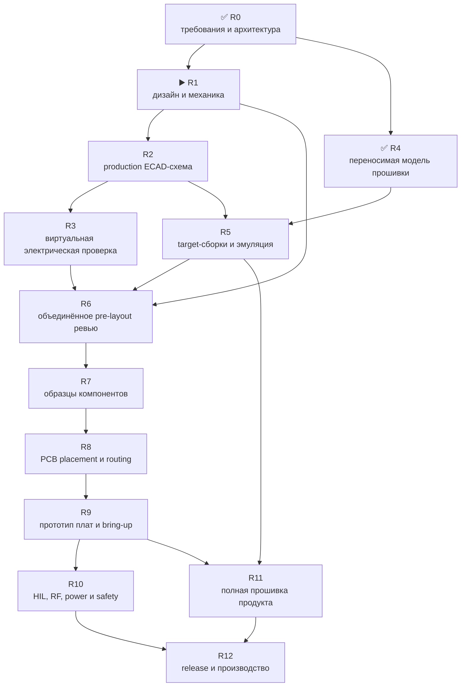

# Leshy2 — роадмап до готового продукта

[English](roadmap.md) · [На главную](../README.ru.md)

> **▶️ Сейчас: R1 — дизайн и механика устройства.** Архитектура и
> переносимая модель общей прошивочной логики прошли ревью, но внешний и
> внутренний мокап ещё не принят. Актуальной production-схемы, PCB-разводки,
> target-сборок и прогонов на эмуляторах пока нет. Заказ компонентов и плат
> заблокирован.

Последняя сверка статуса: **23 августа 2026 года**. Эта страница сопровождает
проект до полной готовности и обновляется при каждом переходе между этапами.

## Обозначения

- ✅ **Проведено ревью** — артефакт и его проверки существуют; этап может быть
  открыт повторно, если следующий этап обнаружит несоответствие.
- ▶️ **Сейчас** — текущий основной этап.
- ⏳ **Ожидает** — пререквизиты ещё не закрыты.
- 🔒 **Заблокировано** — действие запрещено до указанного контрольного рубежа.

## Где мы сейчас

| Область | Фактическое состояние |
|---|---|
| Возможности, владельцы устройств, шины и распиновка | ✅ Проведено ревью для рабочей архитектуры G2F-3I |
| Переносимая логика safety, L2IP, update и пяти доменов | ✅ Проведено ревью: 24 детерминированных host-сценария; чистые ASan/UBSan |
| Внешний и внутренний дизайн | ▶️ Размерный мокап существует, но пользователем не принят и не является production-механикой |
| Принципиальные схемы на сайте | ✅ Концептуальные связи компонентов опубликованы |
| Актуальная production ECAD-схема | ⏳ Не создана; прежняя несовместимая реализация находится в черновиках |
| KiCad placement и PCB routing | 🔒 Не начаты и не разрешены |
| Электрические и переходные симуляции | ⏳ Не проводились |
| Пять target-образов | ⏳ Не созданы |
| Эмуляторы | ⏳ Target-прогонов не было; host-модель не считается эмуляцией МК |
| Физические образцы и HIL | 🔒 Не заказывались и не проводились |
| Заказ production PCB | 🔒 Запрещён до R8 |

Принципиальные диаграммы объясняют, **что с чем связано**. Production
ECAD-схема должна дополнительно содержать точные символы, контакты, номиналы,
питание, защиты, footprints и результаты ERC. PCB layout начинается ещё позже.

## Зависимости этапов

Заказ проверочных компонентов разрешается только на R7. Заказ прототипных PCB
разрешается на R9. Production-заказ возможен только после R12.

## Полный путь

| Этап | Статус | Результат этапа | Критерий выхода |
|---|---|---|---|
| **R0. Требования и архитектура** | ✅ Проведено ревью | Полный перечень функций, пять вычислительных доменов, владельцы всех радио и интерфейсов, pin/resource budget, один активный класс сигналов и полноценные 3×nRF24 | Машинные проверки архитектуры проходят; нет неизвестного владельца, контакта или обязательного интерфейса |
| **R1. Дизайн и механика** | ▶️ Сейчас | Согласованный внешний вид, обе внешние и внутренние стороны, настоящий вид от антенного торца, физические разрезы и порядок сборки | Размеры основаны на выбранных MPN; нет коллизий деталей, крепежа, шелкографии и аксессуаров; понятны все направления, доступ к батареям, U214, кнопкам, портам, микрофону и динамику; пользователь принял мокап |
| **R2. Production ECAD-схема** | ⏳ Ожидает R1 | Новая актуальная принципиальная схема, разбитая на читаемые листы | Точные symbol/footprint/pin/net/value; объяснены NC; ERC без необъяснённых ошибок; machine-net map совпадает с архитектурой; отдельно проверены reset, boot, recovery, no-back-power, quiet state и `FAULT_KILL` |
| **R3. Виртуальная электрическая проверка** | ⏳ Ожидает R2 | Расчёты и симуляции до дорогой физики | Worst-case DC budget; startup/shutdown, USB↔battery handover, brownout, watchdog, eFuse и load-step; thermal/fault tree; display/backlight, audio и IR corners; timing/levels; RF corridors, return paths и pre-layout constraints |
| **R4. Исполняемая переносимая модель** | ✅ Проведено ревью | Общие C-ядра safety, L2IP, atomic update/rollback и пятидоменная fault-injection модель | 24 сценария проходят обычную сборку и ASan/UBSan; проверены CRC, replay, deadlines, queue saturation, TX lease/evidence, thermal, heartbeat, watchdog, fault viewer и rollback |
| **R5. Target-сборки и доступная эмуляция** | ⏳ Ожидает R2 и использует R4 | Сборочные skeleton-образы S3, C5, RP, Pack и Safety с реальными SDK | Все пять образов воспроизводимо собираются; map-файлы укладываются в flash/RAM/rollback; S3 проходит boot/fault/update в официальном QEMU; shared code проходит host-платформы; отсутствующая в эмуляторах периферия занесена в обязательную dev-board матрицу |
| **R6. Объединённое pre-layout ревью** | 🔒 Ожидает R1–R5 | Единая проверка механики, схемы, расчётов и прошивочных контрактов | Нет открытого виртуально проверяемого blocker; оставлены только явно названные физические неопределённости; для каждой есть измерение и план bring-up |
| **R7. Образцы компонентов** | 🔒 Ожидает R6 и отдельного одобрения стоимости | Минимальная доказательная закупка, а не комплект production | Полученные display/U214/connectors/radios измерены; MPN и геометрия подтверждены; результаты сохранены; любое расхождение возвращает проект на нужный этап |
| **R8. PCB placement и routing** | 🔒 Ожидает R7 | Две реальные платы, реализующие принятую схему и механику | Placement review обеих сторон; DRC; impedance и return-current review; RF-развязка, antenna feeds, thermal copper, creepage, test points, сборка и производимость проверены; fab package отдельно принят |
| **R9. Прототип и bring-up** | 🔒 Ожидает R8 и одобрения заказа | Небольшая партия прототипных PCB и зафиксированный bring-up log | Rails запускаются по контракту; все пять МК прошиваются и восстанавливаются; интерфейсы, экран, storage, audio, radio и expansion проходят smoke tests; rework отражён обратно в исходниках |
| **R10. Полная физическая квалификация** | 🔒 Ожидает R9 | HIL, RF, thermal, power, safety и endurance evidence | 3×nRF24 работают одновременно в `3R/1T2R/2T1R/3T`; активная группа не тормозится соседями; выключенные интерфейсы физически тихие; RF coexistence, antenna/VNA, длительная работа, заряд, handover, перегрев, watchdog и single-fault проверки пройдены |
| **R11. Полная прошивка продукта** | ⏳ Начинается после R5, закрывается после R9/R10 | Реальные функции устройства, UI и обновления на пяти target | Меню и waterfall, radio profiles, запись, audio, M5 expansion, три уровня функций, обязательный баннер Controlled Zone, target authorization, акт о ненападении при установке, подписанный открытый update, recovery и fault viewer проходят автоматические и HIL-тесты |
| **R12. Release и производство** | 🔒 Ожидает R10 и R11 | Воспроизводимый готовый продукт | Нет blocker; residual risks явно приняты; BOM, Gerber/ODB++, pick-and-place, assembly, test fixture, calibration, firmware bundles, keys, recovery, лицензии и сайт согласованы; оба репозитория получают совместимые release tags |

## Правила продвижения

1. Следующий этап использует проверенные артефакты предыдущих этапов, а не
   пересказывает решения вручную.
2. Несоответствие исправляется в первичном артефакте и фиксируется в сводке;
   downstream-файлы перегенерируются.
3. Неожиданная дополнительная функция не удаляется молча: сначала проверяется,
   не пропущено ли требование.
4. Улучшение без заметной цены принимается автоматически, если не меняет
   поведение продукта. Изменение функций или существенной стоимости выносится
   на отдельное согласование.
5. Статус **«Проведено ревью»** означает наличие артефакта и доказательств, но
   не запрещает повторное открытие при новом факте.
6. RF-передача и опасные fault-тесты выполняются только в разрешённой среде:
   на своей нагрузке, с разрешения владельца цели или в изолированной
   лаборатории.

## Что происходит следующим

Текущая работа ограничена R1: довести внешний и внутренний мокап до одного
понятного комплекта для пользовательской приёмки. До этого production ECAD,
PCB routing и закупка не начинаются.
