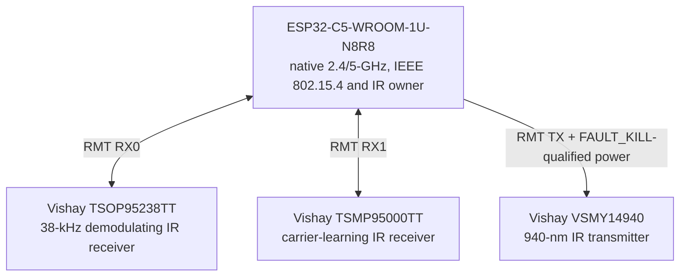
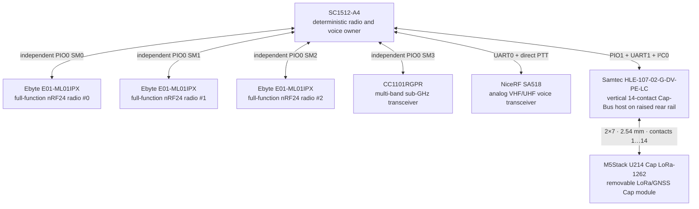
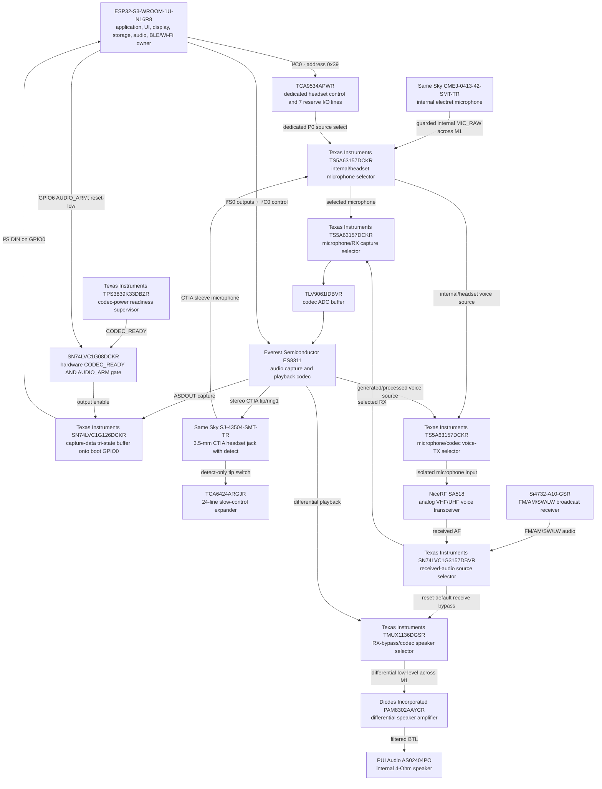
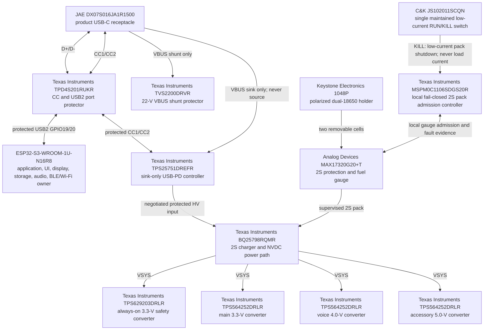

# Leshy2 principle diagrams

[Home](../README.md) · [Hardware](hardware.md) · [Русский](schematics.ru.md)

The diagrams below describe the finished device by functional domain. Exact contacts, signal directions and electrical connections are in the [public pin table](pinout.md). The complete device content is in the [machine-readable BOM](../hardware/architecture/generated/G2F-3I-target-bom.csv). The removable transmitting accessory has its own split principle diagrams on the [Leshy LoRa Cap](lora-cap.md) page.

## Current production ECAD schematic

The functional diagrams below remain the overview of the finished product.
The implemented KiCad sheets are the exact electrical schematic: every
purchased device has an MPN, physical contacts, footprint, nets and explicit
no-connects; fabricated test pads are explicitly excluded from the BOM.

| Sheet | State | Closed electrical content |
|---|---|---|
| [`UI_00_ROOT`](../hardware/ecad/kicad/LESHY2-UI/LESHY2-UI.kicad_sch) | exact ECAD | 9 child sheets, 95 cross-sheet nets and 232 explicit pins/labels |
| [`UI_10_S3_CORE_MEMORY_BOOT`](../hardware/ecad/kicad/LESHY2-UI/UI_10_S3_CORE_MEMORY_BOOT.kicad_sch) | exact ECAD | 32 components, 41 S3 carrier pads, boot/recovery/USB/RF and 39 interfaces |
| [`UI_11_DISPLAY_TOUCH_STORAGE`](../hardware/ecad/kicad/LESHY2-UI/UI_11_DISPLAY_TOUCH_STORAGE.kicad_sch) | exact ECAD | 49 instances, all 40 display contacts, all 11 microSD contacts, backlight/touch/isolation and 18 interfaces |
| [`UI_12_CONTROLS_INDICATORS`](../hardware/ecad/kicad/LESHY2-UI/UI_12_CONTROLS_INDICATORS.kicad_sch) | exact ECAD | 71 components, 15 serial switches, 9 actual-TX LEDs, hardware FAULT LED, thermal/ESD and 45 interfaces |
| [`UI_13_AUDIO_CODEC_HEADSET`](../hardware/ecad/kicad/LESHY2-UI/UI_13_AUDIO_CODEC_HEADSET.kicad_sch) | exact ECAD | 102 components, 21 codec contacts, 6 CTIA-jack contacts, 5 analog selectors, power/interface isolation and 24 interfaces |
| [`UI_20_C5_RADIO_IR_SERVICE`](../hardware/ecad/kicad/LESHY2-UI/UI_20_C5_RADIO_IR_SERVICE.kicad_sch) | exact ECAD | 59 BOM components plus factory ANT1, 32 C5 carrier pads, dual IR RX, fail-closed IR TX, data-only USB/recovery and 18 interfaces |
| [`UI_21_FM_AM_RECEIVER`](../hardware/ecad/kicad/LESHY2-UI/UI_21_FM_AM_RECEIVER.kicad_sch) | exact ECAD | 32 components, separate FM/SW and AM/LW ports, complete Si4732 power/control/clock/audio paths and 8 interfaces |
| [`UI_40_INTERBOARD_M1`](../hardware/ecad/kicad/LESHY2-UI/UI_40_INTERBOARD_M1.kicad_sch) | exact ECAD | one FX8C plug, 80 separate physical contacts, 51 interfaces, 20 `POWER_GROUND`, 7 `3V3_MAIN`, no reserves or NCs |
| [`UI_50_TX_SAFETY_EVIDENCE`](../hardware/ecad/kicad/LESHY2-UI/UI_50_TX_SAFETY_EVIDENCE.kicad_sch) | exact ECAD | 28 components, two RF detectors, a physical optical IR sensor, four comparator channels, two reset sinks, 18 interfaces and one NC |
| [`UI_60_TESTPOINTS_MANUFACTURING`](../hardware/ecad/kicad/LESHY2-UI/UI_60_TESTPOINTS_MANUFACTURING.kicad_sch) | exact ECAD | 11 physical 1.0-mm test pads on exact nets; fabricated PCB copper with no purchased MPN/BOM |
| [`RF_00_ROOT`](../hardware/ecad/kicad/LESHY2-RF/LESHY2-RF.kicad_sch) | exact ECAD | 12 populated child sheets, 149 cross-sheet nets and 351 explicit pins/labels; no child stubs or deferred fixture labels |
| [`RF_01_USB_PD_CHARGE`](../hardware/ecad/kicad/LESHY2-RF/RF_01_USB_PD_CHARGE.kicad_sch) | exact ECAD | 52 components, 208 physical package pads, protected sink-only USB-PD, 2S/750-kHz NVDC charging, 9 interfaces and 10 explained NCs |
| [`RF_02_PACK_SAFETY_AON`](../hardware/ecad/kicad/LESHY2-RF/RF_02_PACK_SAFETY_AON.kicad_sch) | exact ECAD | 61 symbols, 198 physical package/interface contacts, fail-closed 2S pack admission, 14 interfaces and 6 explained NCs |
| [`RF_03_MAIN_RAILS_DOMAIN_GATES`](../hardware/ecad/kicad/LESHY2-RF/RF_03_MAIN_RAILS_DOMAIN_GATES.kicad_sch) | exact ECAD | 69 components, 186 physical contacts, independent AON/main/accessory rails, eFuses and domain gates, 21 interfaces and 3 explained NCs |
| [`RF_30_RP2354_CORE_SERVICE`](../hardware/ecad/kicad/LESHY2-RF/RF_30_RP2354_CORE_SERVICE.kicad_sch) | exact ECAD | 48 components, all 81 SC1512-A4 contacts, official regulator/clock circuits, USB/recovery, 52 interfaces and 13 explained NCs |
| [`RF_31_NRF24_X3`](../hardware/ecad/kicad/LESHY2-RF/RF_31_NRF24_X3.kicad_sch) | exact ECAD | 105 ledger components plus 3 factory-IPEX boundaries, 311 physical contacts, 3 independent PIO SPI/RF paths, 33 interfaces and 2 explained NCs |
| [`RF_32_SUBGHZ_VOICE`](../hardware/ecad/kicad/LESHY2-RF/RF_32_SUBGHZ_VOICE.kicad_sch) | exact electrical ECAD | 116 components, 363 physical contacts, independent CC1101 data and SA518 voice power/control/RF paths, 32 interfaces and 11 explained NCs; SA518 land fit remains an H5 gate |
| [`RF_34_U214_M5_EXT`](../hardware/ecad/kicad/LESHY2-RF/RF_34_U214_M5_EXT.kicad_sch) | exact ECAD | 53 symbols, 52 board-fitted components, 228 contacts, 27 interfaces and separate protected U214/native M5 Unit branches; U214 itself remains an external product |
| [`RF_35_REAR_CONTROLS`](../hardware/ecad/kicad/LESHY2-RF/RF_35_REAR_CONTROLS.kicad_sch) | exact ECAD | 7 fitted components and 36 contacts: independent encoder A/B/push and PTT with local ESD; the serial knob remains an external mechanical item |
| [`RF_36_AUDIO_IO_AMP`](../hardware/ecad/kicad/LESHY2-RF/RF_36_AUDIO_IO_AMP.kicad_sch) | exact ECAD | 14 symbols and 34 contacts: downward-facing microphone, reset-safe U-DFN amplifier and two independent floating-BTL outputs to the wired speaker assembly |
| [`RF_40_INTERBOARD_M1`](../hardware/ecad/kicad/LESHY2-RF/RF_40_INTERBOARD_M1.kicad_sch) | exact ECAD | one FX8C receptacle, 80 separate physical contacts, 51 interfaces and row-for-row equality with UI-side M1, with no reserves/NCs |
| [`RF_50_TX_SAFETY_EVIDENCE`](../hardware/ecad/kicad/LESHY2-RF/RF_50_TX_SAFETY_EVIDENCE.kicad_sch) | exact ECAD | 97 components and 369 contacts: independent RUN/KILL, POR, watchdog/latch/reset and TX gates, five physical RF detectors, five comparator channels, 74 interfaces and 22 explained NCs |
| [`RF_60_TESTPOINTS_MANUFACTURING`](../hardware/ecad/kicad/LESHY2-RF/RF_60_TESTPOINTS_MANUFACTURING.kicad_sch) | exact ECAD | 52 physical 1.0-mm test pads: recovery, USB VBUS sense, PD/EEPROM, watchdog/latch, safe gates, power-good, RF evidence, thermal and rail references; fabricated PCB copper with no purchased MPN/BOM |

Machine outputs: [UI root](../hardware/ecad/generated/H2-UI-root-interface.json),
[S3 core](../hardware/ecad/generated/H2-UI10-S3-core.json) and
[display/touch/storage](../hardware/ecad/generated/H2-UI11-display-touch-storage.json) and
[controls/indicators](../hardware/ecad/generated/H2-UI12-controls-indicators.json) and
[codec/headset audio](../hardware/ecad/generated/H2-UI13-audio-codec-headset.json) and
[C5 radio/IR/service](../hardware/ecad/generated/H2-UI20-c5-radio-ir-service.json) and
[FM/AM/SW/LW receiver](../hardware/ecad/generated/H2-UI21-fm-am-receiver.json), and
[UI-side M1](../hardware/ecad/generated/H2-UI40-interboard-m1.json), and
[UI-side TX safety/evidence](../hardware/ecad/generated/H2-UI50-tx-safety-evidence.json), and
[UI manufacturing/test points](../hardware/ecad/generated/H2-UI60-testpoints-manufacturing.json), and
[RF/power root](../hardware/ecad/generated/H2-RF-root-interface.json), and
[RF USB-PD/charging](../hardware/ecad/generated/H2-RF01-usb-pd-charge.json), and
[RF pack safety/admission](../hardware/ecad/generated/H2-RF02-pack-safety-aon.json), and
[RF main rails/domain gates](../hardware/ecad/generated/H2-RF03-main-rails-domain-gates.json),
[RP2354 core/service](../hardware/ecad/generated/H2-RF30-rp2354-core-service.json), and
[three nRF24 paths](../hardware/ecad/generated/H2-RF31-nrf24-x3.json), and
[Sub-GHz/voice](../hardware/ecad/generated/H2-RF32-subghz-voice.json), and
[U214/M5 expansion](../hardware/ecad/generated/H2-RF34-u214-m5-ext.json), and
[rear controls](../hardware/ecad/generated/H2-RF35-rear-controls.json), and
[audio I/O/amplifier](../hardware/ecad/generated/H2-RF36-audio-io-amp.json), and
[RF-side M1](../hardware/ecad/generated/H2-RF40-interboard-m1.json), and
[RF-side TX safety/evidence](../hardware/ecad/generated/H2-RF50-tx-safety-evidence.json), and
[RF/power manufacturing/test points](../hardware/ecad/generated/H2-RF60-testpoints-manufacturing.json).
These sheets do not yet authorize PCB placement, routing or fabrication.

Read the architecture from its three compute owners, not from the USB port.
The first map shows only inter-processor links; the following maps expand
each owner's devices and the independent power path. Every box is one
physical device with its selected part number or an explicit ‘not selected’
mark and product role; no box combines different devices.

### Compute ownership map

### S3: user interface, storage, audio and native expansion

### C5: native 2.4/5 GHz, 802.15.4 and IR

### RP: deterministic radios, voice and Cap Bus

### Controls: from each physical switch to its owner

```mermaid
flowchart TD
S3["ESP32-S3-WROOM-1U-N16R8<br/>application, UI, display, storage, audio, BLE/Wi-Fi owner"]
RP["SC1512-A4<br/>deterministic radio and voice owner"]
UI_MATRIX_IO["TCA9539PWR<br/>16 direct D-pad and function-key inputs"]
UI_DPAD_UP["OMRON B3S-1100P<br/>independent UP navigation button"]
UI_DPAD_DOWN["OMRON B3S-1100P<br/>independent DOWN navigation button"]
UI_DPAD_LEFT["OMRON B3S-1100P<br/>independent LEFT navigation button"]
UI_DPAD_RIGHT["OMRON B3S-1100P<br/>independent RIGHT navigation button"]
UI_DPAD_OK["OMRON B3S-1100P<br/>independent OK confirmation button"]
UI_SWITCH_BACK["OMRON B3S-1100P<br/>BACK button"]
UI_SWITCH_OPT["OMRON B3S-1100P<br/>OPT button"]
UI_SWITCH_F1["OMRON B3S-1100P<br/>left display-side F1 button"]
UI_SWITCH_F2["OMRON B3S-1100P<br/>left display-side F2 button"]
UI_SWITCH_F3["OMRON B3S-1100P<br/>left display-side F3 button"]
UI_SWITCH_F4["OMRON B3S-1100P<br/>left display-side F4 button"]
UI_SWITCH_F5["OMRON B3S-1100P<br/>right display-side F5 button"]
UI_SWITCH_F6["OMRON B3S-1100P<br/>right display-side F6 button"]
UI_SWITCH_F7["OMRON B3S-1100P<br/>right display-side F7 button"]
UI_SWITCH_F8["OMRON B3S-1100P<br/>right display-side F8 button"]
ENCODER["Alps Alpine EC11E18244AU<br/>rear rotary encoder with push"]
PTT_SWITCH["OMRON B3S-1100P<br/>independent rear PTT button"]
POWER_COMMAND_SWITCH["C&K JS102011SCQN<br/>single maintained low-current RUN/KILL switch"]
SAFETY_CONTROLLER["Texas Instruments MSPM0C1106SDGS20R<br/>independent AON watchdog, thermal and TX-lease controller"]
SAFETY_WATCHDOG["Texas Instruments TPS3435CAKAGDDFR<br/>independent 1.6-s timeout watchdog"]
SAFE_CONDITIONER["74LVC2G14GW,125<br/>physical RUN and S3 fault-reset conditioner"]
SAFE_LATCH["SN74LVC1G74DCUR<br/>asynchronous FAULT_KILL latch"]
  UI_DPAD_UP -->|"direct P00"| UI_MATRIX_IO
  UI_DPAD_DOWN -->|"direct P01"| UI_MATRIX_IO
  UI_DPAD_LEFT -->|"direct P02"| UI_MATRIX_IO
  UI_DPAD_RIGHT -->|"direct P03"| UI_MATRIX_IO
  UI_DPAD_OK -->|"direct P04"| UI_MATRIX_IO
  UI_SWITCH_BACK -->|"direct P05"| UI_MATRIX_IO
  UI_SWITCH_OPT -->|"direct P06"| UI_MATRIX_IO
  UI_SWITCH_F3 -->|"direct P07"| UI_MATRIX_IO
  UI_SWITCH_F1 -->|"direct P10"| UI_MATRIX_IO
  UI_SWITCH_F2 -->|"direct P11"| UI_MATRIX_IO
  ENCODER -->|"push P12 across M1"| UI_MATRIX_IO
  UI_SWITCH_F4 -->|"direct P13"| UI_MATRIX_IO
  UI_SWITCH_F5 -->|"direct P14"| UI_MATRIX_IO
  UI_SWITCH_F6 -->|"direct P15"| UI_MATRIX_IO
  UI_SWITCH_F7 -->|"direct P16"| UI_MATRIX_IO
  UI_SWITCH_F8 -->|"direct P17"| UI_MATRIX_IO
  UI_MATRIX_IO -->|"I²C0 + IRQ"| S3
  ENCODER -->|"A/B direct PCNT"| S3
  PTT_SWITCH -->|"direct active-low PTT"| RP
  POWER_COMMAND_SWITCH -->|"physical KILL / RUN edge"| SAFE_CONDITIONER
  SAFETY_CONTROLLER -->|"deadline service"| SAFETY_WATCHDOG
  SAFETY_WATCHDOG -->|"WDO_N"| SAFE_LATCH
  SAFE_CONDITIONER -->|"KILL / physical re-arm clock"| SAFE_LATCH
```

### Audio path: receive, capture, playback and transmit

### Programming, recovery and diagnostics for all three compute owners

```mermaid
flowchart TD
S3["ESP32-S3-WROOM-1U-N16R8<br/>application, UI, display, storage, audio, BLE/Wi-Fi owner"]
PRODUCT_USB_CONNECTOR["JAE DX07S016JA1R1500<br/>product USB-C receptacle"]
PRODUCT_USB_PROTECTOR["Texas Instruments TPD4S201RUKR<br/>CC and USB2 port protector"]
S3_DBG_HEADER["Samtec FTSH-105-01-L-DV-K-P-TR<br/>internal fallback DBG10: UART0/RESET/BOOT"]
S3_RESET_BUTTON["Alps Alpine SKRTLAE010<br/>external side S3 RESET button"]
S3_BOOT_BUTTON["Alps Alpine SKRTLAE010<br/>external side S3 BOOT button"]
C5["ESP32-C5-WROOM-1U-N8R8<br/>native 2.4/5-GHz, IEEE 802.15.4 and IR owner"]
C5_SERVICE_USB_CONNECTOR["GCT USB4105-GF-A<br/>data-only C5 recovery USB-C"]
C5_SERVICE_USB_SWITCH["onsemi FSUSB42MUX<br/>power-off-protected C5 USB2 switch"]
C5_DBG_HEADER["Samtec FTSH-105-01-L-DV-K-P-TR<br/>internal fallback DBG10: UART0/RESET/BOOT"]
C5_RESET_BUTTON["Alps Alpine SKRTLAE010<br/>external side C5 RESET button"]
C5_BOOT_BUTTON["Alps Alpine SKRTLAE010<br/>external side C5 BOOT button"]
RP["SC1512-A4<br/>deterministic radio and voice owner"]
RP_SERVICE_USB_CONNECTOR["GCT USB4105-GF-A<br/>data-only RP recovery USB-C"]
RP_SERVICE_USB_SWITCH["onsemi FSUSB42MUX<br/>power-off-protected RP USB2 switch"]
RP_DBG_HEADER["Samtec FTSH-105-01-L-DV-K-P-TR<br/>internal fallback DBG10: SWD/RUN/USB_BOOT"]
RP_RESET_BUTTON["Alps Alpine SKRTLAE010<br/>external side RP RUN/RESET button"]
RP_BOOT_BUTTON["Alps Alpine SKRTLAE010<br/>external side RP USB_BOOT button"]
  PRODUCT_USB_CONNECTOR <-->|"USB2 data"| PRODUCT_USB_PROTECTOR <-->|"native USB"| S3
  S3_DBG_HEADER <-->|"UART0 + RESET + BOOT"| S3
  S3_RESET_BUTTON -->|"RESET"| S3
  S3_BOOT_BUTTON -->|"GPIO0; gated I²S_DIN only after boot"| S3
  C5_SERVICE_USB_CONNECTOR <-->|"data only; VBUS sense only"| C5_SERVICE_USB_SWITCH <-->|"native USB"| C5
  C5_DBG_HEADER <-->|"UART0 + RESET + BOOT"| C5
  C5_RESET_BUTTON -->|"RESET"| C5
  C5_BOOT_BUTTON -->|"GPIO28"| C5
  RP_SERVICE_USB_CONNECTOR <-->|"data only; VBUS sense only"| RP_SERVICE_USB_SWITCH <-->|"native USB"| RP
  RP_DBG_HEADER <-->|"SWD + RUN + USB_BOOT"| RP
  RP_RESET_BUTTON -->|"RUN"| RP
  RP_BOOT_BUTTON -->|"QSPI_SS / USB_BOOT"| RP
```

### Nine independent antenna ports

```mermaid
flowchart TD
S3["ESP32-S3-WROOM-1U-N16R8<br/>application, UI, display, storage, audio, BLE/Wi-Fi owner"]
S3_EXTERNAL_RP_SMA["GCT RFPC-SMA32-FN-175-A<br/>external S3 2.4-GHz RP-SMA port"]
C5["ESP32-C5-WROOM-1U-N8R8<br/>native 2.4/5-GHz, IEEE 802.15.4 and IR owner"]
C5_EXTERNAL_RP_SMA["GCT RFPC-SMA32-FN-175-A<br/>external C5 2.4/5-GHz RP-SMA port"]
RECEIVER["Si4732-A10-GSR<br/>FM/AM/SW/LW broadcast receiver"]
RECEIVER_FMSW_EXTERNAL_SMA["GCT RFPC-SMA31-FN-175-A<br/>receive-only FM/SW SMA port"]
RECEIVER_AMLW_EXTERNAL_SMA["GCT RFPC-SMA31-FN-175-A<br/>non-50-Ohm AM/LW loop/pod SMA port"]
NRF0["Ebyte E01-ML01IPX<br/>full-function nRF24 radio #0"]
NRF0_EXTERNAL_SMA["GCT RFPC-SMA31-FN-175-A<br/>independent nRF24 #0 SMA port"]
NRF1["Ebyte E01-ML01IPX<br/>full-function nRF24 radio #1"]
NRF1_EXTERNAL_SMA["GCT RFPC-SMA31-FN-175-A<br/>independent nRF24 #1 SMA port"]
NRF2["Ebyte E01-ML01IPX<br/>full-function nRF24 radio #2"]
NRF2_EXTERNAL_SMA["GCT RFPC-SMA31-FN-175-A<br/>independent nRF24 #2 SMA port"]
CC["CC1101RGPR<br/>multi-band sub-GHz transceiver"]
CC_EXTERNAL_SMA["GCT RFPC-SMA31-FN-175-A<br/>multi-band sub-GHz SMA port"]
VOICE["NiceRF SA518<br/>analog VHF/UHF voice transceiver"]
VOICE_EXTERNAL_SMA["GCT RFPC-SMA31-FN-175-A<br/>VHF/UHF voice SMA port"]
  S3 -->|"50 Ω"| S3_EXTERNAL_RP_SMA
  C5 -->|"50 Ω"| C5_EXTERNAL_RP_SMA
  RECEIVER -->|"FM/SW receive"| RECEIVER_FMSW_EXTERNAL_SMA
  RECEIVER -->|"AM/LW loop/pod"| RECEIVER_AMLW_EXTERNAL_SMA
  NRF0 -->|"50 Ω"| NRF0_EXTERNAL_SMA
  NRF1 -->|"50 Ω"| NRF1_EXTERNAL_SMA
  NRF2 -->|"50 Ω"| NRF2_EXTERNAL_SMA
  CC -->|"50 Ω"| CC_EXTERNAL_SMA
  VOICE -->|"50 Ω"| VOICE_EXTERNAL_SMA
```

### Power as an independent path

### RUN/KILL, watchdog, thermal supervision and physical TX evidence

```mermaid
flowchart TD
POWER_COMMAND_SWITCH["C&K JS102011SCQN<br/>single maintained low-current RUN/KILL switch"]
SAFE_SUPERVISOR["TPS3808G33DBVR<br/>always-on safety-rail supervisor"]
SAFETY_CONTROLLER["Texas Instruments MSPM0C1106SDGS20R<br/>independent AON watchdog, thermal and TX-lease controller"]
SAFETY_WATCHDOG["Texas Instruments TPS3435CAKAGDDFR<br/>independent 1.6-s timeout watchdog"]
SAFE_CONDITIONER["74LVC2G14GW,125<br/>physical RUN and S3 fault-reset conditioner"]
SAFE_LATCH["SN74LVC1G74DCUR<br/>asynchronous FAULT_KILL latch"]
SAFE_GATE_A["SN74LVC08APWR<br/>hardware permits for three nRF24 radios and their rail"]
SAFE_GATE_B["SN74LVC08APWR<br/>hardware permits for CC, voice and expansion"]
IR_SAFE_GATE["SN74LVC1G08DCKR<br/>local hardware permit for the IR carrier"]
EVIDENCE_CMP_A["TLV1824PWR<br/>UI-local physical-TX comparator for S3, C5 and IR"]
EVIDENCE_CMP_B["TLV1824PWR<br/>RF-local physical-TX comparator for 3×nRF24 and CC"]
EVIDENCE_CMP_VOICE["TLV1821DCKR<br/>dedicated RF-local physical voice-TX comparator"]
U214_CONNECTOR["Samtec HLE-107-02-G-DV-PE-LC<br/>vertical 14-contact Cap-Bus host on raised rear rail"]
EXT_EVIDENCE_BUFFER["SN74LVC1G07DCKR<br/>5-V-tolerant LoRa Cap evidence boundary"]
EVIDENCE_MASK["TCA9535PWR<br/>16-bit AON mask register for nine TX evidence sources"]
EVIDENCE_OR_0["BAT54ALT1G<br/>S3 and C5 evidence diode combiner"]
EVIDENCE_OR_1["BAT54ALT1G<br/>nRF24 #1 and #2 evidence diode combiner"]
EVIDENCE_OR_2["BAT54ALT1G<br/>nRF24 #3 and sub-GHz evidence diode combiner"]
EVIDENCE_OR_3["BAT54ALT1G<br/>voice and IR evidence diode combiner"]
EVIDENCE_OR_4["BAT54ALT1G<br/>LoRa/EXT evidence diode combiner"]
EVIDENCE_MAIN_ISOLATOR["SN74LVC3G07DCUR<br/>digital TX-evidence isolation into the main domain"]
  SAFE_SUPERVISOR -->|"power-on reset"| SAFE_LATCH
  POWER_COMMAND_SWITCH -->|"KILL / physical RUN edge"| SAFE_CONDITIONER
  SAFETY_CONTROLLER -->|"deadline service"| SAFETY_WATCHDOG
  SAFETY_WATCHDOG -->|"WDO_N"| SAFE_LATCH
  SAFE_CONDITIONER -->|"KILL / physical re-arm clock"| SAFE_LATCH
  SAFE_LATCH -->|"RUN_PERMIT"| SAFE_GATE_A
  SAFE_LATCH -->|"RUN_PERMIT"| SAFE_GATE_B
  SAFE_LATCH -->|"one digital permit across M1"| IR_SAFE_GATE
  EVIDENCE_CMP_A -->|"three UI-local digital evidence lines"| EVIDENCE_MASK
  EVIDENCE_CMP_B -->|"four RF-local digital evidence lines"| EVIDENCE_MASK
  EVIDENCE_CMP_VOICE -->|"one RF-local digital evidence line"| EVIDENCE_MASK
  U214_CONNECTOR -->|"stock 5V_OUT high or qualified EXT_TX_EVIDENCE_N low"| EXT_EVIDENCE_BUFFER
  EXT_EVIDENCE_BUFFER -->|"ninth active-low evidence line"| EVIDENCE_MASK
  EVIDENCE_CMP_A -->|"C5 / IR evidence"| EVIDENCE_MAIN_ISOLATOR
  EVIDENCE_CMP_A -->|"sources 0 / 1"| EVIDENCE_OR_0
  EVIDENCE_CMP_B -->|"sources 2 / 3"| EVIDENCE_OR_1
  EVIDENCE_CMP_B -->|"sources 4 / 5"| EVIDENCE_OR_2
  EVIDENCE_CMP_VOICE -->|"source 6"| EVIDENCE_OR_3
  EVIDENCE_CMP_A -->|"source 7"| EVIDENCE_OR_3
  EXT_EVIDENCE_BUFFER -->|"source 8"| EVIDENCE_OR_4
  EVIDENCE_OR_0 -->|"wired ANY_TX_AON_N"| EVIDENCE_MAIN_ISOLATOR
  EVIDENCE_OR_1 -->|"wired ANY_TX_AON_N"| EVIDENCE_MAIN_ISOLATOR
  EVIDENCE_OR_2 -->|"wired ANY_TX_AON_N"| EVIDENCE_MAIN_ISOLATOR
  EVIDENCE_OR_3 -->|"wired ANY_TX_AON_N"| EVIDENCE_MAIN_ISOLATOR
  EVIDENCE_OR_4 -->|"wired ANY_TX_AON_N"| EVIDENCE_MAIN_ISOLATOR
```

