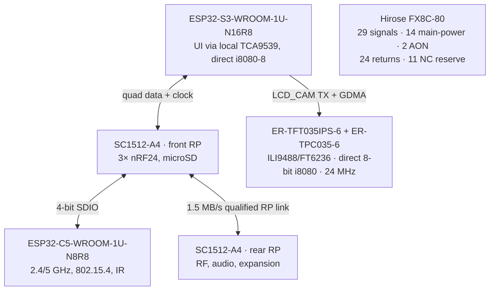

# Leshy2 principle schematics

[Home](../README.md) · [Hardware](hardware.md) · [Русский](schematics.ru.md)

These are the current `H0-R2`/`H1-R2.37` principle diagrams of the finished
device. They explain ownership, buses, RF locality, power and service access.
The exact dual-RP GPIO/M1 map and C5 SDIO/service-mux electrical join are closed
as H1 authority. The native R2 production schematic now exists as three KiCad
projects and passes ERC with zero errors and zero warnings; its cross-sheet and
hardware/firmware reconciliation passes as the reviewed H2-R2.1.5 result. U219
host-body placement, all 18 U219 support bodies, the NFC pickup loop, supplied
antenna swept volume and the exact EastRising display/adapter are closed. H1
is included in the reviewed H1 result and the materialized H2 schematic.

The checked-in G2F/H2/KiCad tree is reviewed historical **single-RP R1**
evidence. Current H0/H1 has six domains, a front Hub RP and a rear RF RP, plus
the rebaselined M1. The old tree is not current R2 authority and must not be
used for firmware pin binding, R2 fabrication or ordering.

## Component and bus architecture

The front UI/radio PCB owns S3, C5, all three complete nRF24 islands, the front
RP and microSD. The rear RF/power PCB owns CC1101, both voice radios,
broadcast/Airband, audio,
M5 and the mutually exclusive U214/U219 Cap slot, the rear RP, power and safety.

Exact working GPIO groups and their budgets are published with the
[H0-R2 architecture](h0-r2-functional-architecture.md#working-principle-pin-design).

## Interboard principle

No nRF payload and no main RF antenna trace crosses M1. The removed onboard
video path leaves six currently uncommitted S3 GPIO and eleven true M1 NC contacts.
M1 is electrical/alignment only; four 11-mm compression stops,
anti-shear enclosure datums and independent PCB capture carry mechanical load.

## Physical implementation of the principle

[Front PCB inner face](images/h1-r2-inner-ui.svg) ·
[Rear PCB inner face](images/h1-r2-inner-rf.svg)

Internal numbers are drawing references, not silkscreen. The current placement
audit reports zero same-face body collisions and 2.59 mm minimum opposing
clearance against the 0.70 mm requirement.

## Dedicated signal and power paths

- [Airband receive filter](h1-airband-filter.md)
- [Power, pack and thermal supervision](h1-r2-power-thermal.md)
- [External programming, recovery and physical sections](h1-r2-physical-layout.md)
- [Safety, watchdog and hard-off architecture](safety.md)

The accepted U219 principle reuses the protected U214 Cap slot and the rear RF
RP's isolated I²C/SPI paths. Pin 8 fails low, pin 10 is fail-disconnected,
CC1101 is RX-only, NFC is poll/read-only and independent physical NFC-field
evidence reaches `ANY_TX_AON_N`. Pin 7 power identity remains a received-unit
gate. The host switch, AON gate, two bridges, comparator, support passives,
pickup-loop geometry and installed-antenna swept volume are registered and
included in the reviewed H1/H2 result.

## ECAD status

The repository retains the former R1 KiCad sheets and machine reports as
historical engineering evidence. They are **not** the production schematic for
R2 and must not be used for fabrication. The current native R2 source is the
three-project [`H2-R2.1.3` result](h2-r2-native-kicad.md): 23 sheets, 1,187
fitted positions, 4,327 physical pins and 826 canonical nets. It is ERC-clean;
the [reviewed H2-R2.1.5 result](h2-acceptance.md) also passes six-domain
cross-sheet/HW↔FW reconciliation. Placement, routing and the later release
gates remain mandatory before fabrication.
