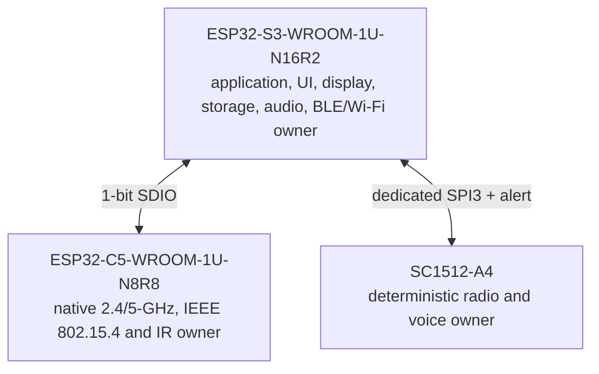
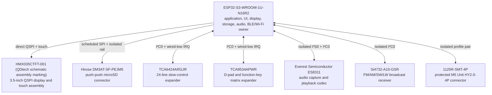
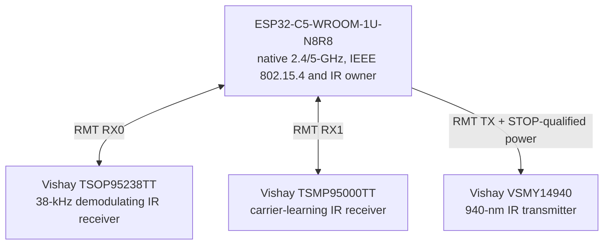
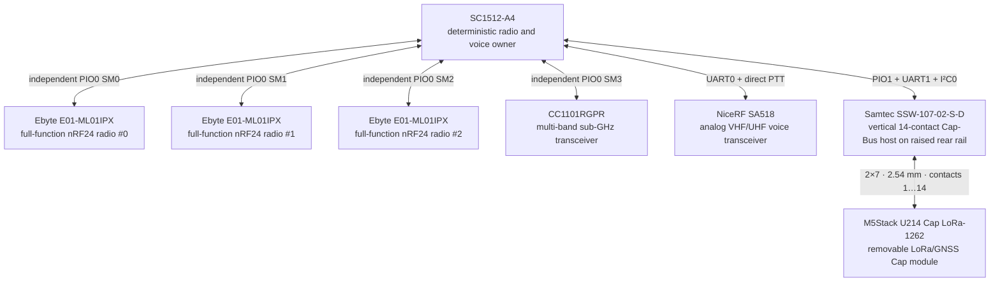
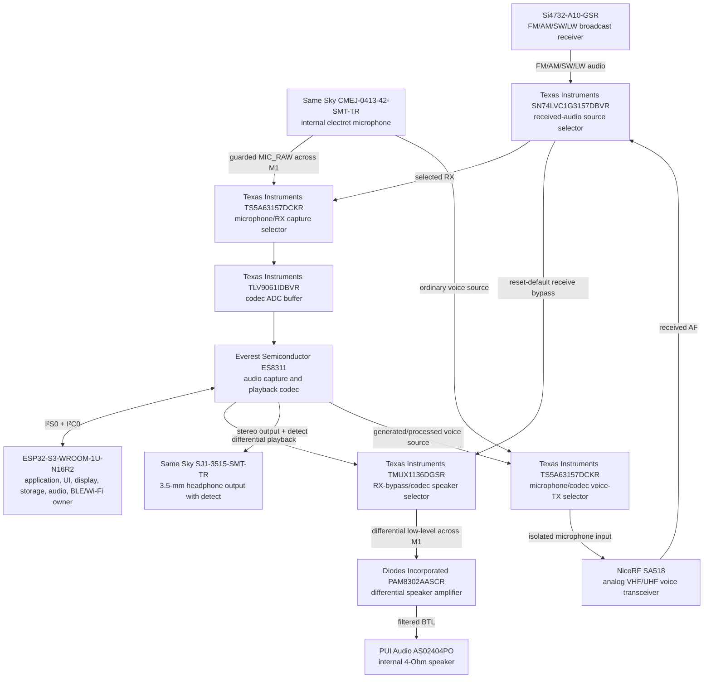
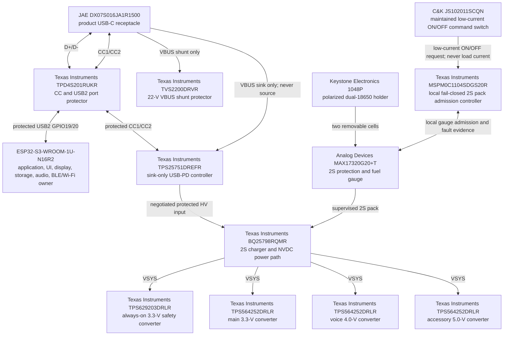
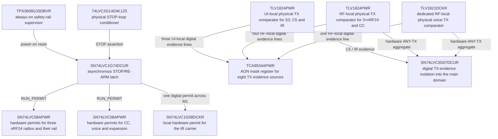

# Leshy2 principle diagrams

[Home](../README.md) · [Hardware](hardware.md) · [Русский](schematics.ru.md)

The diagrams below describe the finished device by functional domain. Exact contacts, signal directions and electrical connections are in the [public pin table](pinout.md). The complete device content is in the [machine-readable BOM](../hardware/architecture/generated/G2F-3I-target-bom.csv).

Read the architecture from its three compute owners, not from the USB port.
The first map shows only inter-processor links; the following maps expand
each owner's devices and the independent power path. Every box is one
physical device with its selected part number or an explicit ‘not selected’
mark and product role; no box combines different devices.

### Compute ownership map

### S3: user interface, storage, audio and native expansion

### C5: native 2.4/5 GHz, 802.15.4 and IR

### RP: deterministic radios, voice and U214

### Controls: from each physical switch to its owner

```mermaid
flowchart TD
S3["ESP32-S3-WROOM-1U-N16R2<br/>application, UI, display, storage, audio, BLE/Wi-Fi owner"]
RP["SC1512-A4<br/>deterministic radio and voice owner"]
UI_MATRIX_IO["TCA9534APWR<br/>D-pad and function-key matrix expander"]
UI_SWITCH_UP["C&K Y78B23214FP<br/>up contact below the single D-pad cross"]
UI_SWITCH_DOWN["C&K Y78B23214FP<br/>down contact below the single D-pad cross"]
UI_SWITCH_LEFT["C&K Y78B23214FP<br/>left contact below the single D-pad cross"]
UI_SWITCH_RIGHT["C&K Y78B23214FP<br/>right contact below the single D-pad cross"]
UI_SWITCH_OK["C&K Y78B23214FP<br/>centre OK contact below the single D-pad"]
UI_SWITCH_BACK["C&K Y78B23214FP<br/>BACK button"]
UI_SWITCH_OPT["C&K Y78B23214FP<br/>OPT button"]
UI_SWITCH_F1["C&K Y78B23214FP<br/>rear F1 function button"]
UI_SWITCH_F2["C&K Y78B23214FP<br/>rear F2 function button"]
ENCODER["Alps Alpine EC11E18244AU<br/>rear rotary encoder with push"]
PTT_SWITCH["C&K Y78B23214FP<br/>independent rear PTT button"]
STOP_SWITCH["Panasonic AEQ10410<br/>normally-closed hardware STOP button"]
REARM_SWITCH["C&K Y78B23214FP<br/>recessed hardware RE-ARM button"]
SAFE_CONDITIONER["74LVC2G14GW,125<br/>physical STOP-loop conditioner"]
SAFE_LATCH["SN74LVC1G74DCUR<br/>asynchronous STOP/RE-ARM latch"]
  UI_SWITCH_UP -->|"R0/C0"| UI_MATRIX_IO
  UI_SWITCH_DOWN -->|"R0/C1"| UI_MATRIX_IO
  UI_SWITCH_LEFT -->|"R0/C2"| UI_MATRIX_IO
  UI_SWITCH_RIGHT -->|"R1/C0"| UI_MATRIX_IO
  UI_SWITCH_OK -->|"R1/C1"| UI_MATRIX_IO
  UI_SWITCH_BACK -->|"R1/C2"| UI_MATRIX_IO
  UI_SWITCH_OPT -->|"R2/C0"| UI_MATRIX_IO
  UI_SWITCH_F1 -->|"R2/C1"| UI_MATRIX_IO
  UI_SWITCH_F2 -->|"R2/C2"| UI_MATRIX_IO
  ENCODER -->|"push R3/C0"| UI_MATRIX_IO
  UI_MATRIX_IO -->|"I²C0 + IRQ"| S3
  ENCODER -->|"A/B direct PCNT"| S3
  PTT_SWITCH -->|"direct active-low PTT"| RP
  STOP_SWITCH -->|"fail-open STOP loop"| SAFE_CONDITIONER
  REARM_SWITCH -->|"fresh physical edge"| SAFE_CONDITIONER
  SAFE_CONDITIONER -->|"asynchronous set/clock"| SAFE_LATCH
```

### Audio path: receive, capture, playback and transmit

### Programming, recovery and diagnostics for all three compute owners

```mermaid
flowchart TD
S3["ESP32-S3-WROOM-1U-N16R2<br/>application, UI, display, storage, audio, BLE/Wi-Fi owner"]
PRODUCT_USB_CONNECTOR["JAE DX07S016JA1R1500<br/>product USB-C receptacle"]
PRODUCT_USB_PROTECTOR["Texas Instruments TPD4S201RUKR<br/>CC and USB2 port protector"]
S3_DBG_HEADER["Samtec FTSH-105-01-L-DV-K-P-TR<br/>keyed DBG10: UART0/RESET/BOOT"]
S3_RESET_BUTTON["Alps Alpine SKQGADE010<br/>S3 service RESET button"]
S3_BOOT_BUTTON["Alps Alpine SKQGADE010<br/>S3 service BOOT button"]
C5["ESP32-C5-WROOM-1U-N8R8<br/>native 2.4/5-GHz, IEEE 802.15.4 and IR owner"]
C5_SERVICE_USB_CONNECTOR["GCT USB4105-GF-A<br/>data-only C5 recovery USB-C"]
C5_SERVICE_USB_SWITCH["onsemi FSUSB42MUX<br/>power-off-protected C5 USB2 switch"]
C5_DBG_HEADER["Samtec FTSH-105-01-L-DV-K-P-TR<br/>keyed DBG10: UART0/RESET/BOOT"]
C5_RESET_BUTTON["Alps Alpine SKQGADE010<br/>C5 service RESET button"]
C5_BOOT_BUTTON["Alps Alpine SKQGADE010<br/>C5 service BOOT button"]
RP["SC1512-A4<br/>deterministic radio and voice owner"]
RP_SERVICE_USB_CONNECTOR["GCT USB4105-GF-A<br/>data-only RP recovery USB-C"]
RP_SERVICE_USB_SWITCH["onsemi FSUSB42MUX<br/>power-off-protected RP USB2 switch"]
RP_DBG_HEADER["Samtec FTSH-105-01-L-DV-K-P-TR<br/>keyed DBG10: SWD/RUN/USB_BOOT"]
RP_RESET_BUTTON["Alps Alpine SKQGADE010<br/>RP service RUN/RESET button"]
RP_BOOT_BUTTON["Alps Alpine SKQGADE010<br/>RP service USB_BOOT button"]
  PRODUCT_USB_CONNECTOR <-->|"USB2 data"| PRODUCT_USB_PROTECTOR <-->|"native USB"| S3
  S3_DBG_HEADER <-->|"UART0 + RESET + BOOT"| S3
  S3_RESET_BUTTON -->|"RESET"| S3
  S3_BOOT_BUTTON -->|"GPIO0"| S3
  C5_SERVICE_USB_CONNECTOR <-->|"data only; VBUS sense only"| C5_SERVICE_USB_SWITCH <-->|"native USB"| C5
  C5_DBG_HEADER <-->|"UART0 + RESET + BOOT"| C5
  C5_RESET_BUTTON -->|"RESET"| C5
  C5_BOOT_BUTTON -->|"GPIO28"| C5
  RP_SERVICE_USB_CONNECTOR <-->|"data only; VBUS sense only"| RP_SERVICE_USB_SWITCH <-->|"native USB"| RP
  RP_DBG_HEADER <-->|"SWD + RUN + USB_BOOT"| RP
  RP_RESET_BUTTON -->|"RUN"| RP
  RP_BOOT_BUTTON -->|"QSPI_SS / USB_BOOT"| RP
```

### Nine independent antenna ports

### Power as an independent path

### Hardware STOP and physical transmission evidence

