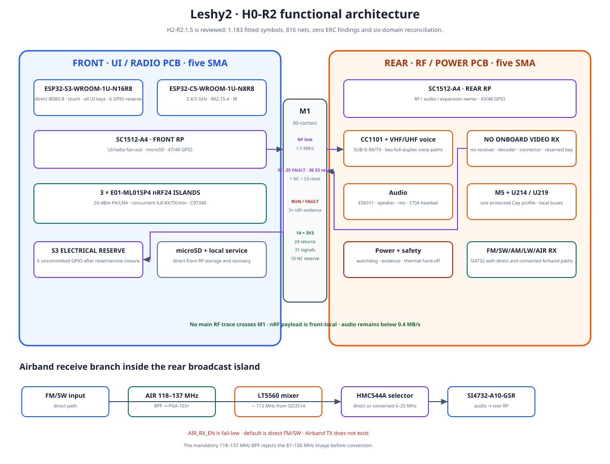
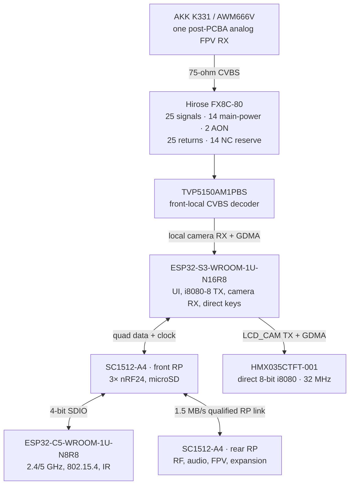

# Leshy2 principle schematics

[Home](../README.md) · [Hardware](hardware.md) · [Русский](schematics.ru.md)

These are the current `H0-R2`/`H1-R2.22` principle diagrams of the finished
device. They explain ownership, buses, RF locality, power and service access.
The R2 production ECAD schematic does **not** exist yet: H2 starts only after
the complete H1 mock-up is accepted.

## Component and bus architecture

The front UI/radio PCB owns S3, C5, all three complete nRF24 islands, the front
RP, microSD and TVP5150. The rear RF/power PCB owns CC1101, both voice radios,
broadcast/Airband, audio, the one-of-two post-PCBA K331/AWM666V FPV bay, M5/U214, the rear RP, power and safety.

Exact working GPIO groups and their budgets are published with the
[H0-R2 architecture](h0-r2-functional-architecture.md#working-principle-pin-design).

## Interboard principle

No nRF payload and no main RF antenna trace crosses M1. Only the one analog
video signal crosses before decoding; the 11-line decoded video bus stays on
the front PCB. M1 is electrical/alignment only; four 11-mm compression stops,
anti-shear enclosure datums and independent PCB capture carry mechanical load.

## Physical implementation of the principle

[Front PCB inner face](images/h1-r2-inner-ui.svg) ·
[Rear PCB inner face](images/h1-r2-inner-rf.svg)

Internal numbers are drawing references, not silkscreen. The current placement
audit reports zero same-face body collisions and 1.05 mm minimum opposing
clearance against the 0.70 mm requirement.

## Dedicated signal and power paths

- [Analog-FPV receive path and rear MMCX](h1-r2-fpv.md)
- [Airband receive filter](h1-airband-filter.md)
- [Power, pack and thermal supervision](h1-r2-power-thermal.md)
- [External programming, recovery and physical sections](h1-r2-physical-layout.md)
- [Safety, watchdog and hard-off architecture](safety.md)

## ECAD status

The repository retains the former R1 KiCad sheets and machine reports as
historical engineering evidence. They are **not** the production schematic for
R2 and must not be used for fabrication. H2 will replace them with exact R2
symbols, contacts, nets, values, protection and footprints; only an ERC-clean
reviewed H2 result may be presented here as current production ECAD.
