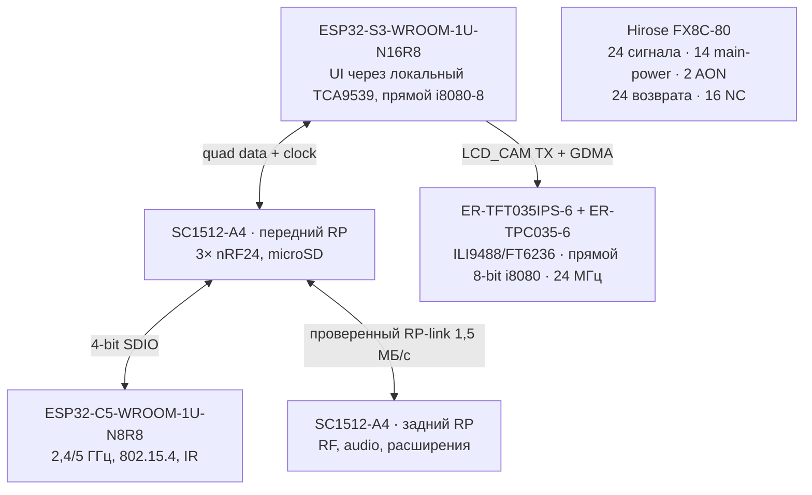

# Принципиальные схемы Leshy2

[На главную](../README.ru.md) · [Аппаратная часть](hardware.ru.md) · [English](schematics.md)

Здесь собраны актуальные принципиальные схемы `H0-R2`/`H1-R2.37` готового
устройства: владельцы функций, шины, локальность RF, питание и сервисный
доступ. Точные dual-RP GPIO/M1 и электрический стык C5 SDIO/service-mux закрыты
как authority H1. Production ECAD-схемы R2 пока **нет**. Placement
host-корпусов, все 18 компонентов U219, NFC pickup-loop, swept volume штатной
антенны и точный дисплей EastRising с адаптером уже закрыты. H1 ждёт только
принятия полного мокапа; затем у R2 H2 останутся три электрических prerequisites.

Сохранённое дерево G2F/H2/KiCad — проведённое ревью исторического **single-RP
R1**. В текущем H0/H1 шесть доменов, передний Hub RP, задний RF RP и новый M1.
Старое дерево не является authority R2 и не может использоваться для firmware
pin binding, печати R2 или заказа.

## Архитектура компонентов и шин

Передняя UI/radio-плата содержит S3, C5, все три полных острова nRF24,
передний RP и microSD. Задняя RF/power-плата содержит CC1101, оба
voice-радио, broadcast/Airband, аудио, M5 и взаимоисключающий Cap-слот U214/U219, задний RP,
питание и безопасность.

Точные рабочие группы GPIO и их бюджеты опубликованы в
[архитектуре H0-R2](h0-r2-functional-architecture.ru.md#рабочая-принципиальная-распиновка).

## Принцип межплатной связи

Через M1 не проходят ни payload nRF, ни основной антенный RF-тракт. Удалённый
бортовой видеотракт оставляет одиннадцать резервных GPIO S3 и два дополнительных
NC-контакта M1. M1 выполняет только
электрическую функцию и совмещение; силовую нагрузку несут четыре 11-мм упора,
anti-shear datums корпуса и независимые захваты PCB.

## Физическая реализация принципа

[Внутренняя сторона передней платы](images/h1-r2-inner-ui.svg) ·
[Внутренняя сторона задней платы](images/h1-r2-inner-rf.svg)

Внутренние номера — ссылки чертежа, а не шелкография. Текущий аудит размещения:
ноль коллизий корпусов на одной стороне и минимальный встречный зазор 2,59 мм
при требовании 0,70 мм.

## Отдельные сигнальные и силовые тракты

- [Входной фильтр Airband](h1-airband-filter.ru.md)
- [Питание, аккумуляторный pack и thermal supervision](h1-r2-power-thermal.ru.md)
- [Внешнее программирование, recovery и физические разрезы](h1-r2-physical-layout.ru.md)
- [Безопасность, watchdog и жёсткое отключение](safety.ru.md)

Принятый принцип U219 использует защищённый Cap-слот U214 и изолированные
I²C/SPI-тракты заднего RF RP. Pin 8 fail-low, pin 10 fail-disconnected, CC1101
RX-only, NFC poll/read-only, а независимое физическое evidence NFC-поля входит
в `ANY_TX_AON_N`. Идентичность питания pin 7 остаётся received-unit gate. Новые
Host-switch, AON gate, два bridge и comparator уже зарегистрированы полными
официальными package-envelope и source-backed courtyards. Вспомогательные
пассивы, геометрия reserve pickup-loop и swept volume установленной антенны ещё
не закрыты, поэтому мокап U219 остаётся на ревью.

## Статус ECAD

Прежние KiCad-листы R1 и машинные отчёты сохранены в репозитории как
историческое инженерное evidence. Это **не** production-схема R2, и печатать
по ним нельзя. H2 заменит их точными R2 symbols, contacts, nets, values,
protection и footprints. Только ERC-clean результат с проведённым ревью H2
может быть показан здесь как актуальный production ECAD.
