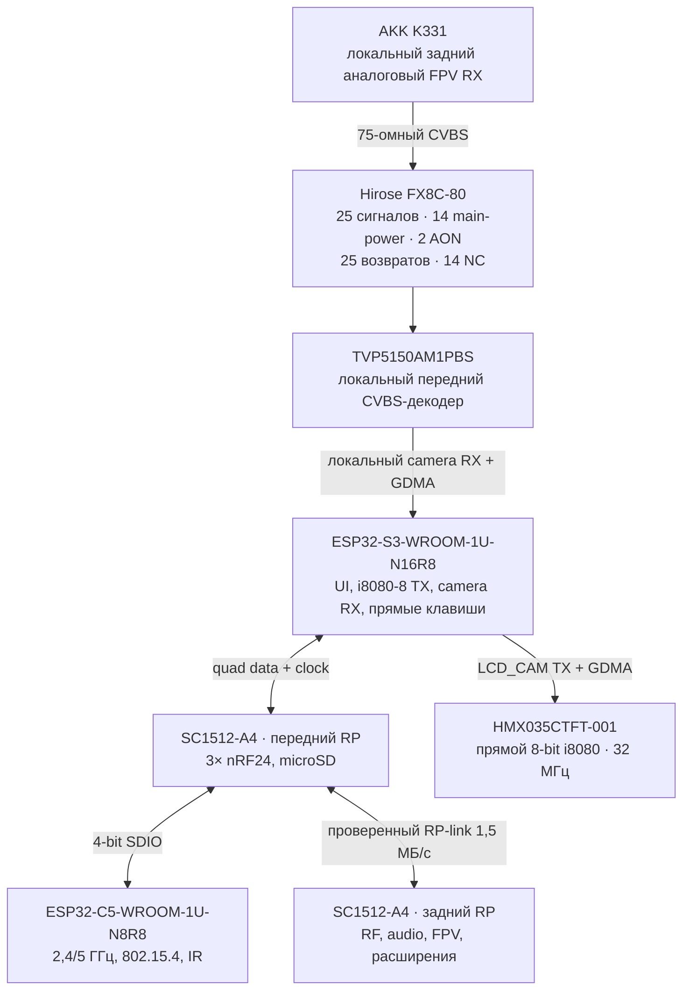

# Принципиальные схемы Leshy2

[На главную](../README.ru.md) · [Аппаратная часть](hardware.ru.md) · [English](schematics.md)

Здесь собраны актуальные принципиальные схемы `H0-R2`/`H1-R2.18` готового
устройства: владельцы функций, шины, локальность RF, питание и сервисный
доступ. Production ECAD-схемы R2 пока **нет**: H2 начнётся только после
принятия полного мокапа H1.

## Архитектура компонентов и шин

Передняя UI/radio-плата содержит S3, C5, все три полных острова nRF24,
передний RP, microSD и TVP5150. Задняя RF/power-плата содержит CC1101, оба
voice-радио, broadcast/Airband, аудио, K331 FPV, M5/U214, задний RP, питание и
безопасность.

Точные рабочие группы GPIO и их бюджеты опубликованы в
[архитектуре H0-R2](h0-r2-functional-architecture.ru.md#рабочая-принципиальная-распиновка).

## Принцип межплатной связи

Через M1 не проходят ни payload nRF, ни основной антенный RF-тракт. До
декодирования пересекается только один аналоговый видеосигнал; 11-линейная
декодированная шина остаётся на передней плате. M1 выполняет только
электрическую функцию и совмещение; силовую нагрузку несут четыре 11-мм упора,
anti-shear datums корпуса и независимые захваты PCB.

## Физическая реализация принципа

[Внутренняя сторона передней платы](images/h1-r2-inner-ui.svg) ·
[Внутренняя сторона задней платы](images/h1-r2-inner-rf.svg)

Внутренние номера — ссылки чертежа, а не шелкография. Текущий аудит размещения:
ноль коллизий корпусов на одной стороне и минимальный встречный зазор 1,44 мм
при требовании 0,70 мм.

## Отдельные сигнальные и силовые тракты

- [Аналоговый FPV RX и задний MMCX](h1-r2-fpv.ru.md)
- [Входной фильтр Airband](h1-airband-filter.ru.md)
- [Питание, аккумуляторный pack и thermal supervision](h1-r2-power-thermal.ru.md)
- [Внешнее программирование, recovery и физические разрезы](h1-r2-physical-layout.ru.md)
- [Безопасность, watchdog и жёсткое отключение](safety.ru.md)

## Статус ECAD

Прежние KiCad-листы R1 и машинные отчёты сохранены в репозитории как
историческое инженерное evidence. Это **не** production-схема R2, и печатать
по ним нельзя. H2 заменит их точными R2 symbols, contacts, nets, values,
protection и footprints. Только ERC-clean результат с проведённым ревью H2
может быть показан здесь как актуальный production ECAD.
