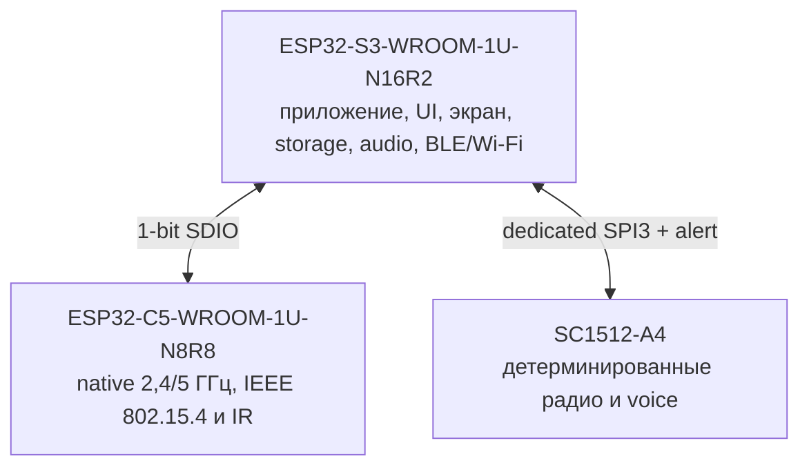
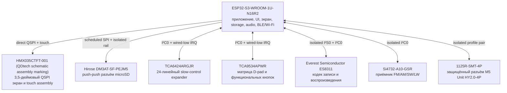
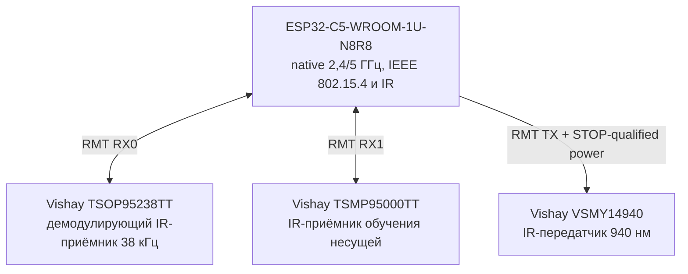
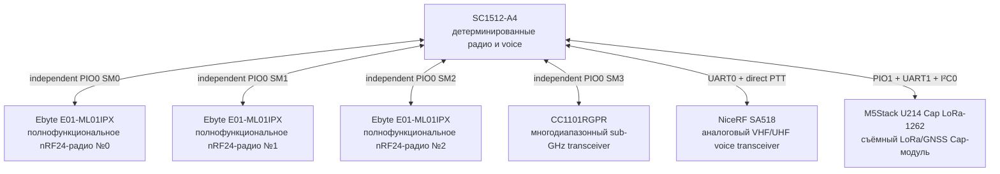
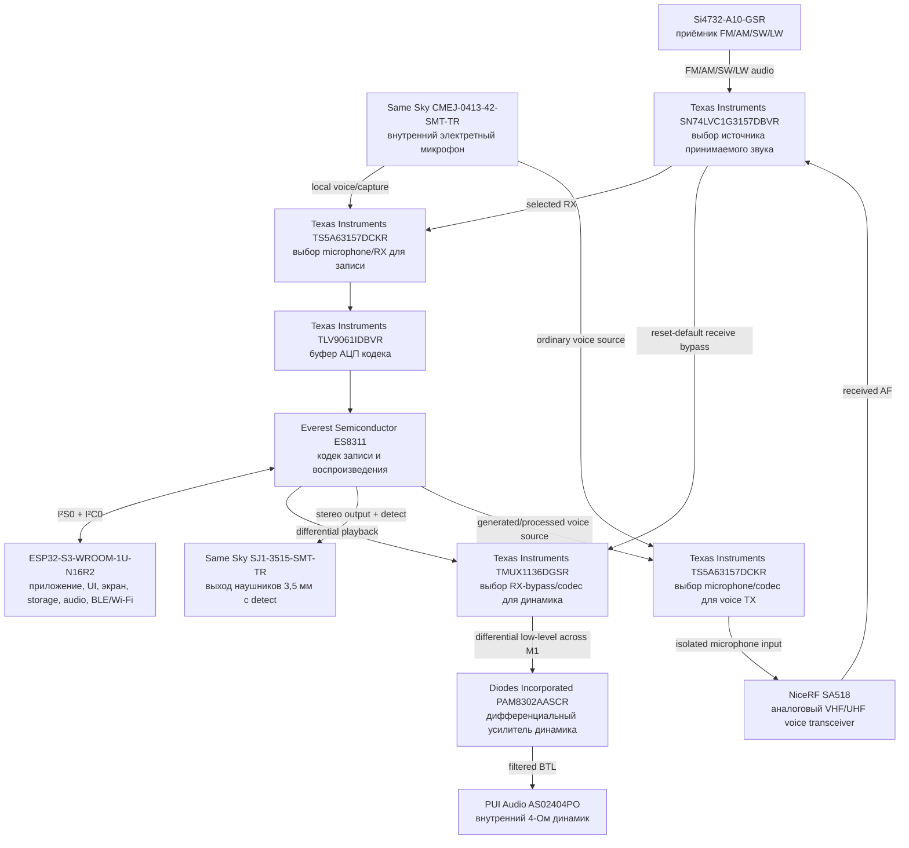
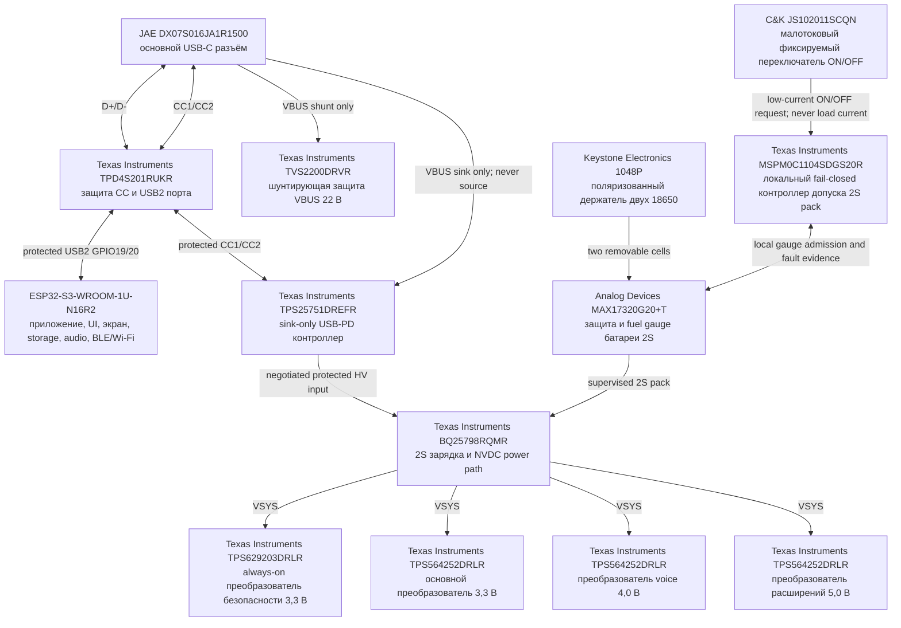
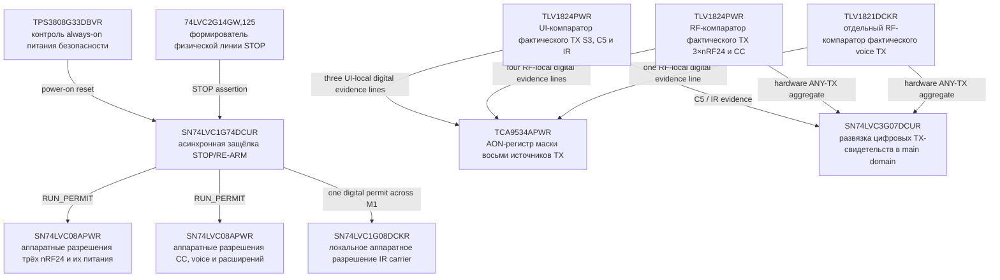

# Принципиальные схемы Leshy2

[На главную](../README.ru.md) · [Аппаратная часть](hardware.ru.md) · [English](schematics.md)

Схемы ниже показывают конечное устройство по функциональным доменам. Точные контакты, направления сигналов и электрические связи находятся в [публичной таблице распиновки](pinout.ru.md). Полный состав устройства — в [машинном BOM](../hardware/architecture/generated/G2F-3I-target-bom.csv).

Архитектура читается от трёх вычислительных владельцев, а не от USB-порта.
Первая схема показывает только межпроцессорные связи; следующие схемы
разворачивают устройства каждого владельца и отдельный тракт питания.
Каждый прямоугольник — одно физическое устройство с выбранным партномером
или явной пометкой «партномер не выбран», а также его ролью в продукте.

### Карта вычислительных владельцев

### S3: интерфейс пользователя, storage, audio и native expansion

### C5: native 2,4/5 ГГц, 802.15.4 и IR

### RP: детерминированные радио, voice и U214

### Органы управления: от физической кнопки до владельца

```mermaid
flowchart TD
S3["ESP32-S3-WROOM-1U-N16R2<br/>приложение, UI, экран, storage, audio, BLE/Wi-Fi"]
RP["SC1512-A4<br/>детерминированные радио и voice"]
UI_MATRIX_IO["TCA9534APWR<br/>матрица D-pad и функциональных кнопок"]
UI_SWITCH_UP["C&K Y78B23214FP<br/>контакт ↑ под единой крестовиной D-pad"]
UI_SWITCH_DOWN["C&K Y78B23214FP<br/>контакт ↓ под единой крестовиной D-pad"]
UI_SWITCH_LEFT["C&K Y78B23214FP<br/>контакт ← под единой крестовиной D-pad"]
UI_SWITCH_RIGHT["C&K Y78B23214FP<br/>контакт → под единой крестовиной D-pad"]
UI_SWITCH_OK["C&K Y78B23214FP<br/>центральный контакт OK единого D-pad"]
UI_SWITCH_BACK["C&K Y78B23214FP<br/>кнопка BACK"]
UI_SWITCH_OPT["C&K Y78B23214FP<br/>кнопка OPT"]
UI_SWITCH_F1["C&K Y78B23214FP<br/>задняя функциональная кнопка F1"]
UI_SWITCH_F2["C&K Y78B23214FP<br/>задняя функциональная кнопка F2"]
ENCODER["Alps Alpine EC11E18244AU<br/>задний энкодер с нажатием"]
PTT_SWITCH["C&K Y78B23214FP<br/>независимая задняя кнопка PTT"]
STOP_SWITCH["Panasonic AEQ10410<br/>нормально-замкнутая аппаратная кнопка STOP"]
REARM_SWITCH["C&K Y78B23214FP<br/>утопленная аппаратная кнопка RE-ARM"]
SAFE_CONDITIONER["74LVC2G14GW,125<br/>формирователь физической линии STOP"]
SAFE_LATCH["SN74LVC1G74DCUR<br/>асинхронная защёлка STOP/RE-ARM"]
  UI_SWITCH_UP -->|"R0/C0"| UI_MATRIX_IO
  UI_SWITCH_DOWN -->|"R0/C1"| UI_MATRIX_IO
  UI_SWITCH_LEFT -->|"R0/C2"| UI_MATRIX_IO
  UI_SWITCH_RIGHT -->|"R1/C0"| UI_MATRIX_IO
  UI_SWITCH_OK -->|"R1/C1"| UI_MATRIX_IO
  UI_SWITCH_BACK -->|"R1/C2"| UI_MATRIX_IO
  UI_SWITCH_OPT -->|"R2/C0"| UI_MATRIX_IO
  UI_SWITCH_F1 -->|"R2/C1"| UI_MATRIX_IO
  UI_SWITCH_F2 -->|"R2/C2"| UI_MATRIX_IO
  ENCODER -->|"push R3/C0"| UI_MATRIX_IO
  UI_MATRIX_IO -->|"I²C0 + IRQ"| S3
  ENCODER -->|"A/B direct PCNT"| S3
  PTT_SWITCH -->|"direct active-low PTT"| RP
  STOP_SWITCH -->|"fail-open STOP loop"| SAFE_CONDITIONER
  REARM_SWITCH -->|"fresh physical edge"| SAFE_CONDITIONER
  SAFE_CONDITIONER -->|"asynchronous set/clock"| SAFE_LATCH
```

### Аудиотракт: приём, запись, воспроизведение и передача

### Прошивка, восстановление и диагностика трёх вычислителей

```mermaid
flowchart TD
S3["ESP32-S3-WROOM-1U-N16R2<br/>приложение, UI, экран, storage, audio, BLE/Wi-Fi"]
PRODUCT_USB_CONNECTOR["JAE DX07S016JA1R1500<br/>основной USB-C разъём"]
PRODUCT_USB_PROTECTOR["Texas Instruments TPD4S201RUKR<br/>защита CC и USB2 порта"]
S3_DBG_HEADER["Samtec FTSH-105-01-L-DV-K-P-TR<br/>ключевой DBG10: UART0/RESET/BOOT"]
S3_RESET_BUTTON["Alps Alpine SKQGADE010<br/>технологическая кнопка RESET S3"]
S3_BOOT_BUTTON["Alps Alpine SKQGADE010<br/>технологическая кнопка BOOT S3"]
C5["ESP32-C5-WROOM-1U-N8R8<br/>native 2,4/5 ГГц, IEEE 802.15.4 и IR"]
C5_SERVICE_USB_CONNECTOR["GCT USB4105-GF-A<br/>data-only USB-C восстановления C5"]
C5_SERVICE_USB_SWITCH["onsemi FSUSB42MUX<br/>power-off-защищённый USB2 ключ C5"]
C5_DBG_HEADER["Samtec FTSH-105-01-L-DV-K-P-TR<br/>ключевой DBG10: UART0/RESET/BOOT"]
C5_RESET_BUTTON["Alps Alpine SKQGADE010<br/>технологическая кнопка RESET C5"]
C5_BOOT_BUTTON["Alps Alpine SKQGADE010<br/>технологическая кнопка BOOT C5"]
RP["SC1512-A4<br/>детерминированные радио и voice"]
RP_SERVICE_USB_CONNECTOR["GCT USB4105-GF-A<br/>data-only USB-C восстановления RP"]
RP_SERVICE_USB_SWITCH["onsemi FSUSB42MUX<br/>power-off-защищённый USB2 ключ RP"]
RP_DBG_HEADER["Samtec FTSH-105-01-L-DV-K-P-TR<br/>ключевой DBG10: SWD/RUN/USB_BOOT"]
RP_RESET_BUTTON["Alps Alpine SKQGADE010<br/>технологическая кнопка RUN/RESET RP"]
RP_BOOT_BUTTON["Alps Alpine SKQGADE010<br/>технологическая кнопка USB_BOOT RP"]
  PRODUCT_USB_CONNECTOR <-->|"USB2 data"| PRODUCT_USB_PROTECTOR <-->|"native USB"| S3
  S3_DBG_HEADER <-->|"UART0 + RESET + BOOT"| S3
  S3_RESET_BUTTON -->|"RESET"| S3
  S3_BOOT_BUTTON -->|"GPIO0"| S3
  C5_SERVICE_USB_CONNECTOR <-->|"data only; VBUS sense only"| C5_SERVICE_USB_SWITCH <-->|"native USB"| C5
  C5_DBG_HEADER <-->|"UART0 + RESET + BOOT"| C5
  C5_RESET_BUTTON -->|"RESET"| C5
  C5_BOOT_BUTTON -->|"GPIO28"| C5
  RP_SERVICE_USB_CONNECTOR <-->|"data only; VBUS sense only"| RP_SERVICE_USB_SWITCH <-->|"native USB"| RP
  RP_DBG_HEADER <-->|"SWD + RUN + USB_BOOT"| RP
  RP_RESET_BUTTON -->|"RUN"| RP
  RP_BOOT_BUTTON -->|"QSPI_SS / USB_BOOT"| RP
```

### Девять независимых антенных портов

```mermaid
flowchart TD
S3["ESP32-S3-WROOM-1U-N16R2<br/>приложение, UI, экран, storage, audio, BLE/Wi-Fi"]
S3_EXTERNAL_RP_SMA["GCT RFPC-SMA32-FN-175-A<br/>внешний RP-SMA порт S3 2,4 ГГц"]
C5["ESP32-C5-WROOM-1U-N8R8<br/>native 2,4/5 ГГц, IEEE 802.15.4 и IR"]
C5_EXTERNAL_RP_SMA["GCT RFPC-SMA32-FN-175-A<br/>внешний RP-SMA порт C5 2,4/5 ГГц"]
RECEIVER["Si4732-A10-GSR<br/>приёмник FM/AM/SW/LW"]
RECEIVER_FMSW_EXTERNAL_SMA["GCT RFPC-SMA31-FN-175-A<br/>приёмный SMA порт FM/SW"]
RECEIVER_AMLW_EXTERNAL_SMA["GCT RFPC-SMA31-FN-175-A<br/>не-50-омный SMA порт AM/LW loop/pod"]
NRF0["Ebyte E01-ML01IPX<br/>полнофункциональное nRF24-радио №0"]
NRF0_EXTERNAL_SMA["GCT RFPC-SMA31-FN-175-A<br/>независимый SMA порт nRF24 №0"]
NRF1["Ebyte E01-ML01IPX<br/>полнофункциональное nRF24-радио №1"]
NRF1_EXTERNAL_SMA["GCT RFPC-SMA31-FN-175-A<br/>независимый SMA порт nRF24 №1"]
NRF2["Ebyte E01-ML01IPX<br/>полнофункциональное nRF24-радио №2"]
NRF2_EXTERNAL_SMA["GCT RFPC-SMA31-FN-175-A<br/>независимый SMA порт nRF24 №2"]
CC["CC1101RGPR<br/>многодиапазонный sub-GHz transceiver"]
CC_EXTERNAL_SMA["GCT RFPC-SMA31-FN-175-A<br/>многодиапазонный SMA порт sub-GHz"]
VOICE["NiceRF SA518<br/>аналоговый VHF/UHF voice transceiver"]
VOICE_EXTERNAL_SMA["GCT RFPC-SMA31-FN-175-A<br/>SMA порт VHF/UHF voice"]
  S3 -->|"50 Ω"| S3_EXTERNAL_RP_SMA
  C5 -->|"50 Ω"| C5_EXTERNAL_RP_SMA
  RECEIVER -->|"FM/SW receive"| RECEIVER_FMSW_EXTERNAL_SMA
  RECEIVER -->|"AM/LW loop/pod"| RECEIVER_AMLW_EXTERNAL_SMA
  NRF0 -->|"50 Ω"| NRF0_EXTERNAL_SMA
  NRF1 -->|"50 Ω"| NRF1_EXTERNAL_SMA
  NRF2 -->|"50 Ω"| NRF2_EXTERNAL_SMA
  CC -->|"50 Ω"| CC_EXTERNAL_SMA
  VOICE -->|"50 Ω"| VOICE_EXTERNAL_SMA
```

### Питание как отдельный тракт

### Аппаратный STOP и подтверждение фактической передачи

