# G2F-3I — generated principled pinout atlas

- Статус: **историческая single-RP R1/G2F распиновка; ревью сохранено как reference, но это не current R2 authority и не разрешение на R2 KiCad**
- Source of truth: `hardware/architecture/devices.json` and `hardware/architecture/candidates/G2F-3I.json`
- Regenerate: `python3 hardware/architecture/generate.py --write`
- Verify: `python3 hardware/architecture/generate.py --check`

> Файл сгенерирован. Ручные изменения будут отвергнуты `--check`.

## Как читать артефакт

Диаграмма — навигатор по owners и физически независимым interface groups.
Она намеренно строится сверху вниз и остаётся живой проекцией текущей
начинки: изменение machine source обязано регенерировать этот atlas и
синхронно обновить diagram-срезы обеих стартовых страниц.
Каждый прямоугольник физического устройства содержит его exact/current
paper MPN и роль. Разные устройства не объединяются в один прямоугольник.
Если production part ещё не выбран, узел явно помечается `MPN TBD`;
пассивная цепь отдельно помечается как circuit, а не как заказной компонент.
Нормативные pin/net значения находятся в следующих за ней таблицах и
получены из того же JSON. `abstract:*` означает зарезервированную функцию,
для которой exact peripheral MPN/electrical circuit ещё не принят; это не
разрешение рисовать вымышленный pin в KiCad.

## Отрисовываемый атлас физических устройств

Исчерпывающая one-device-per-node проекция разбита по функциональным
доменам и автоматически режется дальше до безопасного размера Mermaid.
Диаграммы показывают внутренние связи своего среза; междоменные pin/net
связи без потерь перечислены в machine-derived таблицах ниже. Полный
монолитный исходник сохраняется рядом как
`G2F-3I-principled-projection.mmd` для машинного diff/review.

### 1. Вычислительные владельцы и межпроцессорные связи

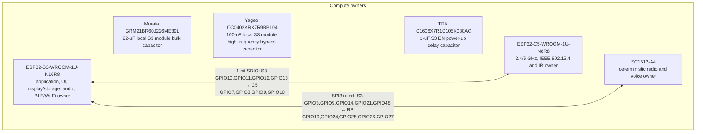

### 2. Экран, storage и органы управления — узлы 1/3

```mermaid
flowchart TD
  subgraph UI_STORAGE_1["UI and storage devices"]
  S3["ESP32-S3-WROOM-1U-N16R8<br/>application, UI, display/storage, audio, BLE/Wi-Fi owner"]
  MAIN_EFUSE["Texas Instruments TPS25974LRPWR<br/>main latch-off overvoltage circuit-breaker eFuse with protected PG"]
  DISPLAY_CONNECTOR["Hirose DF40C(2.0)-40DS-0.4V(51)<br/>40-position 0.4-mm UI-board receptacle for the replaceable display adapter"]
  DISPLAY_ADAPTER_PLUG["Hirose DF40C-40DP-0.4V(51)<br/>40-position 0.4-mm adapter-board plug; exact 2-mm DF40 mate"]
  DISPLAY_PANEL_CONNECTOR["Hirose FH34SRJ-40S-0.5SH(99)<br/>40-position 0.5-mm dual-contact ZIF on the replaceable adapter"]
  DISPLAY["HMX035CTFT-001 (QDtech schematic assembly marking)<br/>3.5-inch QSPI IPS display and capacitive-touch assembly"]
  DISPLAY_TOUCH_CONTROLLER["Sitronix ST77922<br/>integrated display plus capacitive-touch TDDI COG"]
  DISPLAY_LOGIC_BULK_CAP["Murata GRM188R60J106ME47D<br/>10-uF protected-main display-logic bulk capacitor"]
  DISPLAY_LOGIC_HF_CAP["Yageo CC0402KRX7R9BB104<br/>100-nF display-logic high-frequency bypass capacitor"]
  DISPLAY_RESET_PULLDOWN["Yageo RC0402FR-0710KL<br/>10-kOhm display RESX reset-default pull-down"]
  TOUCH_RESET_PULLDOWN["Yageo RC0402FR-0710KL<br/>10-kOhm touch TP_RESXP reset-default pull-down"]
  BACKLIGHT_EFUSE["Texas Instruments TPS2553DRVR-1<br/>latch-off and reverse-blocking LEDA power switch"]
  BACKLIGHT_EFUSE_ILIM["UNI-ROYAL 0402WGF1333TCE<br/>133-kOhm 1% approximately 200-mA backlight-limit resistor"]
  BACKLIGHT_EFUSE_INPUT_CAP["Yageo CC0402KRX7R9BB104<br/>100-nF backlight-switch input bypass capacitor"]
  BACKLIGHT_EFUSE_OUTPUT_BULK["Murata GRM188R60J106ME47D<br/>10-uF protected-LEDA output bulk capacitor"]
  BACKLIGHT_EFUSE_OUTPUT_HF["Yageo CC0402KRX7R9BB104<br/>100-nF protected-LEDA output bypass capacitor"]
  BACKLIGHT_FAULT_PULLUP["Yageo RC0402FR-0710KL<br/>10-kOhm open-drain backlight-fault pull-up"]
  BACKLIGHT_SERIES_RESISTOR["Yageo RC0402JR-070RL<br/>0-Ohm donor-equivalent LED cathode link"]
  BACKLIGHT_MOSFET["Diodes Incorporated DMN2056U-7<br/>low-gate-drive LED cathode PWM MOSFET"]
  BACKLIGHT_GATE_SERIES["Yageo RC0402FR-07100RL<br/>100-Ohm PWM gate series resistor"]
  BACKLIGHT_GATE_PULLDOWN["Yageo RC0402FR-0710KL<br/>10-kOhm PWM gate reset-off pull-down"]
  SD["Hirose DM3AT-SF-PEJM5<br/>push-push microSD card connector"]
  SD_HOST_BUFFER["SN74LVC3G34DCUR<br/>three-channel Ioff SCK/CMD/CS card-side buffer"]
  SD_MISO_BUFFER["Texas Instruments SN74LVC1G125DCKR<br/>CS-gated Ioff DAT0/MISO return buffer"]
  SD_ESD_A["Texas Instruments TPD4E05U06DQAR<br/>four-channel low-capacitance microSD signal ESD array A"]
  SD_ESD_B["Texas Instruments TPD4E05U06DQAR<br/>four-channel low-capacitance microSD supply/signal/detect ESD array B"]
  SD_POWER_INPUT_CAP["TDK C1608X7R1C105K080AC<br/>1-uF storage-switch input bypass capacitor"]
  SD_POWER_BULK_CAP["Murata GRM21BR60J226ME39L<br/>22-uF switched-card bulk capacitor"]
  SD_POWER_HF_CAP["Yageo CC0402KRX7R9BB104<br/>100-nF switched-card high-frequency bypass capacitor"]
  SD_HOST_BUFFER_BYPASS["Yageo CC0402KRX7R9BB104<br/>100-nF triple-buffer bypass capacitor"]
  SD_MISO_BUFFER_BYPASS["Yageo CC0402KRX7R9BB104<br/>100-nF return-buffer bypass capacitor"]
  SD_ON_PULLDOWN["Yageo RC0402FR-0710KL<br/>10-kOhm storage-power reset-off pull-down"]
  SD_HOST_SCK_PULLDOWN["Yageo RC0402FR-0710KL<br/>10-kOhm shared-clock reset-low pull-down"]
  SD_HOST_D0_PULLDOWN["Yageo RC0402FR-0710KL<br/>10-kOhm GPIO46/QSPI-D0 reset-low pull-down"]
  SD_HOST_D1_PULLUP["Yageo RC0402FR-0710KL<br/>10-kOhm shared-D1 reset-high pull-up"]
  SD_HOST_CS_PULLUP["Yageo RC0402FR-0710KL<br/>10-kOhm card-CS reset-high pull-up"]
  LCD_HOST_CS_PULLUP["Yageo RC0402FR-0710KL<br/>10-kOhm display-CS reset-high pull-up"]
  SD_CARD_CMD_PULLUP["Yageo RC0402FR-0710KL<br/>10-kOhm switched-card CMD pull-up"]
  SD_CARD_DAT0_PULLUP["Yageo RC0402FR-0710KL<br/>10-kOhm switched-card DAT0 pull-up"]
  SD_CARD_DAT1_PULLUP["Yageo RC0402FR-0710KL<br/>10-kOhm switched-card DAT1 pull-up"]
  SD_CARD_DAT2_PULLUP["Yageo RC0402FR-0710KL<br/>10-kOhm switched-card DAT2 pull-up"]
  SD_CARD_DAT3_PULLUP["Yageo RC0402FR-0710KL<br/>10-kOhm switched-card DAT3/CS pull-up"]
  SD_SCK_SERIES["Panasonic ERJ-2RKF22R0X<br/>22-Ohm buffered-card clock source-series resistor"]
  SD_CMD_SERIES["Panasonic ERJ-2RKF22R0X<br/>22-Ohm buffered-card CMD source-series resistor"]
  end
  S3 ~~~ MAIN_EFUSE ~~~ DISPLAY_CONNECTOR ~~~ DISPLAY_ADAPTER_PLUG ~~~ DISPLAY_PANEL_CONNECTOR ~~~ DISPLAY ~~~ DISPLAY_TOUCH_CONTROLLER ~~~ DISPLAY_LOGIC_BULK_CAP ~~~ DISPLAY_LOGIC_HF_CAP ~~~ DISPLAY_RESET_PULLDOWN ~~~ TOUCH_RESET_PULLDOWN ~~~ BACKLIGHT_EFUSE
  BACKLIGHT_EFUSE_ILIM ~~~ BACKLIGHT_EFUSE_INPUT_CAP ~~~ BACKLIGHT_EFUSE_OUTPUT_BULK ~~~ BACKLIGHT_EFUSE_OUTPUT_HF ~~~ BACKLIGHT_FAULT_PULLUP ~~~ BACKLIGHT_SERIES_RESISTOR ~~~ BACKLIGHT_MOSFET ~~~ BACKLIGHT_GATE_SERIES ~~~ BACKLIGHT_GATE_PULLDOWN ~~~ SD ~~~ SD_HOST_BUFFER ~~~ SD_MISO_BUFFER
  SD_ESD_A ~~~ SD_ESD_B ~~~ SD_POWER_INPUT_CAP ~~~ SD_POWER_BULK_CAP ~~~ SD_POWER_HF_CAP ~~~ SD_HOST_BUFFER_BYPASS ~~~ SD_MISO_BUFFER_BYPASS ~~~ SD_ON_PULLDOWN ~~~ SD_HOST_SCK_PULLDOWN ~~~ SD_HOST_D0_PULLDOWN ~~~ SD_HOST_D1_PULLUP ~~~ SD_HOST_CS_PULLUP
  LCD_HOST_CS_PULLUP ~~~ SD_CARD_CMD_PULLUP ~~~ SD_CARD_DAT0_PULLUP ~~~ SD_CARD_DAT1_PULLUP ~~~ SD_CARD_DAT2_PULLUP ~~~ SD_CARD_DAT3_PULLUP ~~~ SD_SCK_SERIES ~~~ SD_CMD_SERIES
  MAIN_EFUSE -->|"local input bypass"| SD_POWER_INPUT_CAP
  SD_HOST_SCK_PULLDOWN -->|"reset low"| S3
  SD_HOST_D0_PULLDOWN -->|"reset low"| S3
  MAIN_EFUSE --> SD_HOST_D1_PULLUP --> S3
  MAIN_EFUSE --> SD_HOST_CS_PULLUP --> S3
  MAIN_EFUSE --> LCD_HOST_CS_PULLUP --> S3
  S3 -->|"shared SCK/CMD + card CS"| SD_HOST_BUFFER
  SD_HOST_BUFFER -->|"SCK"| SD_SCK_SERIES --> SD
  SD_HOST_BUFFER -->|"CMD"| SD_CMD_SERIES --> SD
  S3 -->|"SD_CS_N output enable"| SD_MISO_BUFFER
  SD_ESD_A -.->|"CLK/CMD/DAT0/DAT3 shunt clamps"| SD
  SD_ESD_B -.->|"DAT1/DAT2/VDD/detect shunt clamps"| SD
  S3 -->|"QSPI/touch/PWM: GPIO4,GPIO18,GPIO38,GPIO40,GPIO41,GPIO42,GPIO46"| DISPLAY_CONNECTOR
  DISPLAY_CONNECTOR <-->|"exact 2-mm 40-contact DF40 mate"| DISPLAY_ADAPTER_PLUG
  DISPLAY_ADAPTER_PLUG <-->|"one-to-one adapter copper"| DISPLAY_PANEL_CONNECTOR
  DISPLAY_PANEL_CONNECTOR <-->|"dual-contact 40-position ZIF; received-tail fit H5"| DISPLAY
  DISPLAY -->|"integrated exact COG"| DISPLAY_TOUCH_CONTROLLER
  DISPLAY_RESET_PULLDOWN -->|"RESX default low"| DISPLAY_CONNECTOR
  TOUCH_RESET_PULLDOWN -->|"TP_RESXP default low"| DISPLAY_CONNECTOR
  MAIN_EFUSE -->|"protected 3.3 V logic"| DISPLAY_LOGIC_BULK_CAP --> DISPLAY_CONNECTOR
  MAIN_EFUSE --> DISPLAY_LOGIC_HF_CAP --> DISPLAY_CONNECTOR
  MAIN_EFUSE -->|"LEDA branch"| BACKLIGHT_EFUSE --> DISPLAY_CONNECTOR
  BACKLIGHT_EFUSE --> BACKLIGHT_EFUSE_ILIM
  BACKLIGHT_EFUSE --> BACKLIGHT_EFUSE_INPUT_CAP
  BACKLIGHT_EFUSE --> BACKLIGHT_EFUSE_OUTPUT_BULK
  BACKLIGHT_EFUSE --> BACKLIGHT_EFUSE_OUTPUT_HF
  BACKLIGHT_FAULT_PULLUP --> BACKLIGHT_EFUSE
  DISPLAY_CONNECTOR -->|"3 x LEDK"| BACKLIGHT_SERIES_RESISTOR --> BACKLIGHT_MOSFET
  S3 -->|"GPIO40 PWM"| BACKLIGHT_GATE_SERIES --> BACKLIGHT_MOSFET
  BACKLIGHT_GATE_PULLDOWN -->|"reset off"| BACKLIGHT_MOSFET
  S3 -.->|"logical scheduler contract; no electrical bypass: GPIO4,GPIO5,GPIO18,GPIO46"| SD
```

### 3. Экран, storage и органы управления — узлы 2/3

```mermaid
flowchart TD
  subgraph UI_STORAGE_2["UI and storage devices"]
  S3["ESP32-S3-WROOM-1U-N16R8<br/>application, UI, display/storage, audio, BLE/Wi-Fi owner"]
  MAIN_EFUSE["Texas Instruments TPS25974LRPWR<br/>main latch-off overvoltage circuit-breaker eFuse with protected PG"]
  SD_CS_SERIES["Panasonic ERJ-2RKF22R0X<br/>22-Ohm buffered-card CS source-series resistor"]
  SD_MISO_SERIES["Panasonic ERJ-2RKF22R0X<br/>22-Ohm card-MISO buffer source-series resistor"]
  SD_DETECT_SERIES["Yageo RC0603FR-071KL<br/>1-kOhm card-detect input series resistor"]
  SD_DETECT_PULLUP["Yageo RC0402FR-0710KL<br/>10-kOhm always-readable card-detect pull-up"]
  SD_DETECT_CAP["Yageo CC0402KRX7R9BB104<br/>100-nF card-detect hardware filter capacitor"]
  SLOW_IO["TCA6424ARGJR<br/>24-line main slow-control expander; all P00-P27 contacts allocated"]
  SLOW_IO_VCCI_BYPASS["Yageo CC0402KRX7R9BB104<br/>100-nF main slow-I/O VCCI bypass capacitor"]
  SLOW_IO_VCCP_BYPASS["Yageo CC0402KRX7R9BB104<br/>100-nF main slow-I/O VCCP bypass capacitor"]
  SLOW_IO_BULK_CAP["TDK C1608X7R1C105K080AC<br/>1-uF main slow-I/O local bulk capacitor"]
  SLOW_IO_RESET_PULLUP["Yageo RC0402FR-0710KL<br/>10-kOhm main slow-I/O RESET_N pull-up"]
  SLOW_IO_RESET(("SLOW_IO_RESET_N<br/>protected fixture-reset node"))
  SLOW_IO_FAULT_SENSE_ISO["SN74LVC1G07DCKR<br/>AON-powered open-drain FAULT-sense domain isolator"]
  SLOW_IO_FAULT_SENSE_ISO_BYPASS["Yageo CC0402KRX7R9BB104<br/>100-nF FAULT-sense-isolator bypass capacitor"]
  SLOW_IO_FAULT_SENSE_PULLUP["Yageo RC0402FR-0710KL<br/>10-kOhm main-domain FAULT-sense pull-up"]
  SLOW_IO_S3_EVIDENCE_ISO["SN74LVC1G07DCKR<br/>AON-powered open-drain S3-evidence domain isolator"]
  SLOW_IO_S3_EVIDENCE_ISO_BYPASS["Yageo CC0402KRX7R9BB104<br/>100-nF S3-evidence-isolator bypass capacitor"]
  SLOW_IO_S3_EVIDENCE_PULLUP["Yageo RC0402FR-0710KL<br/>10-kOhm main-domain S3-evidence pull-up"]
  UI_MATRIX_IO["TCA9539PWR<br/>interrupt-capable 16-bit direct-control input expander"]
  UI_MATRIX_IO_BYPASS["Yageo CC0402KRX7R9BB104<br/>100-nF UI-expander bypass capacitor"]
  UI_INPUT_UP_PULLUP["Yageo RC0402FR-0710KL<br/>10-kOhm D-pad UP pull-up"]
  UI_INPUT_DOWN_PULLUP["Yageo RC0402FR-0710KL<br/>10-kOhm D-pad DOWN pull-up"]
  UI_INPUT_LEFT_PULLUP["Yageo RC0402FR-0710KL<br/>10-kOhm D-pad LEFT pull-up"]
  UI_INPUT_RIGHT_PULLUP["Yageo RC0402FR-0710KL<br/>10-kOhm D-pad RIGHT pull-up"]
  UI_INPUT_OK_PULLUP["Yageo RC0402FR-0710KL<br/>10-kOhm D-pad center-push pull-up"]
  UI_INPUT_BACK_PULLUP["Yageo RC0402FR-073K32L<br/>3.32-kOhm BACK contact-current pull-up"]
  UI_INPUT_OPT_PULLUP["Yageo RC0402FR-073K32L<br/>3.32-kOhm OPT contact-current pull-up"]
  UI_INPUT_F1_PULLUP["Yageo RC0402FR-073K32L<br/>3.32-kOhm F1 contact-current pull-up"]
  UI_INPUT_F2_PULLUP["Yageo RC0402FR-073K32L<br/>3.32-kOhm F2 contact-current pull-up"]
  UI_INPUT_F3_PULLUP["Yageo RC0402FR-073K32L<br/>3.32-kOhm F3 contact-current pull-up"]
  UI_INPUT_F4_PULLUP["Yageo RC0402FR-073K32L<br/>3.32-kOhm F4 contact-current pull-up"]
  UI_INPUT_F5_PULLUP["Yageo RC0402FR-073K32L<br/>3.32-kOhm F5 contact-current pull-up"]
  UI_INPUT_F6_PULLUP["Yageo RC0402FR-073K32L<br/>3.32-kOhm F6 contact-current pull-up"]
  UI_INPUT_F7_PULLUP["Yageo RC0402FR-073K32L<br/>3.32-kOhm F7 contact-current pull-up"]
  UI_INPUT_F8_PULLUP["Yageo RC0402FR-073K32L<br/>3.32-kOhm F8 contact-current pull-up"]
  UI_INPUT_ENCODER_PULLUP["Yageo RC0402FR-073K32L<br/>3.32-kOhm encoder-push contact-current pull-up"]
  UI_MATRIX_ESD["Texas Instruments TPD8E003DQDR<br/>eight-channel front-control ESD array"]
  FRONT_FUNCTION_ESD["Texas Instruments TPD8E003DQDR<br/>eight-channel display-side function-key ESD array"]
  REAR_CONTROL_ESD["Texas Instruments TPD4E05U06DQAR<br/>four-channel rear encoder-push ESD array"]
  UI_DPAD_UP["OMRON B3S-1100P<br/>independent UP navigation button"]
  UI_DPAD_DOWN["OMRON B3S-1100P<br/>independent DOWN navigation button"]
  UI_DPAD_LEFT["OMRON B3S-1100P<br/>independent LEFT navigation button"]
  UI_DPAD_RIGHT["OMRON B3S-1100P<br/>independent RIGHT navigation button"]
  UI_DPAD_OK["OMRON B3S-1100P<br/>independent OK confirmation button"]
  UI_SWITCH_BACK["OMRON B3S-1100P<br/>BACK ultra-low-current ordinary control"]
  UI_SWITCH_OPT["OMRON B3S-1100P<br/>OPT ultra-low-current ordinary control"]
  UI_SWITCH_F1["OMRON B3S-1100P<br/>F1 ultra-low-current ordinary control"]
  UI_SWITCH_F2["OMRON B3S-1100P<br/>F2 ultra-low-current ordinary control"]
  end
  S3 ~~~ MAIN_EFUSE ~~~ SD_CS_SERIES ~~~ SD_MISO_SERIES ~~~ SD_DETECT_SERIES ~~~ SD_DETECT_PULLUP ~~~ SD_DETECT_CAP ~~~ SLOW_IO ~~~ SLOW_IO_VCCI_BYPASS ~~~ SLOW_IO_VCCP_BYPASS ~~~ SLOW_IO_BULK_CAP ~~~ SLOW_IO_RESET_PULLUP
  SLOW_IO_RESET ~~~ SLOW_IO_FAULT_SENSE_ISO ~~~ SLOW_IO_FAULT_SENSE_ISO_BYPASS ~~~ SLOW_IO_FAULT_SENSE_PULLUP ~~~ SLOW_IO_S3_EVIDENCE_ISO ~~~ SLOW_IO_S3_EVIDENCE_ISO_BYPASS ~~~ SLOW_IO_S3_EVIDENCE_PULLUP ~~~ UI_MATRIX_IO ~~~ UI_MATRIX_IO_BYPASS ~~~ UI_INPUT_UP_PULLUP ~~~ UI_INPUT_DOWN_PULLUP ~~~ UI_INPUT_LEFT_PULLUP
  UI_INPUT_RIGHT_PULLUP ~~~ UI_INPUT_OK_PULLUP ~~~ UI_INPUT_BACK_PULLUP ~~~ UI_INPUT_OPT_PULLUP ~~~ UI_INPUT_F1_PULLUP ~~~ UI_INPUT_F2_PULLUP ~~~ UI_INPUT_F3_PULLUP ~~~ UI_INPUT_F4_PULLUP ~~~ UI_INPUT_F5_PULLUP ~~~ UI_INPUT_F6_PULLUP ~~~ UI_INPUT_F7_PULLUP ~~~ UI_INPUT_F8_PULLUP
  UI_INPUT_ENCODER_PULLUP ~~~ UI_MATRIX_ESD ~~~ FRONT_FUNCTION_ESD ~~~ REAR_CONTROL_ESD ~~~ UI_DPAD_UP ~~~ UI_DPAD_DOWN ~~~ UI_DPAD_LEFT ~~~ UI_DPAD_RIGHT ~~~ UI_DPAD_OK ~~~ UI_SWITCH_BACK ~~~ UI_SWITCH_OPT ~~~ UI_SWITCH_F1
  MAIN_EFUSE -->|"protected PG to fault aggregate"| SLOW_IO
  MAIN_EFUSE -->|"3V3_MAIN: VCCI/VCCP"| SLOW_IO
  MAIN_EFUSE --> SLOW_IO_VCCI_BYPASS --> SLOW_IO
  MAIN_EFUSE --> SLOW_IO_VCCP_BYPASS --> SLOW_IO
  MAIN_EFUSE --> SLOW_IO_BULK_CAP --> SLOW_IO
  MAIN_EFUSE --> SLOW_IO_RESET_PULLUP --> SLOW_IO_RESET --> SLOW_IO
  MAIN_EFUSE --> SD_DETECT_PULLUP --> SLOW_IO
  SLOW_IO --> SD_DETECT_CAP
  S3 <-->|"I²C0+INT: GPIO1,GPIO2"| SLOW_IO
  MAIN_EFUSE --> SLOW_IO_FAULT_SENSE_PULLUP --> SLOW_IO
  MAIN_EFUSE --> SLOW_IO_S3_EVIDENCE_PULLUP --> SLOW_IO
  S3 <-->|"SYS I²C0 + shared wired-low IRQ"| UI_MATRIX_IO
  UI_MATRIX_IO_BYPASS --> UI_MATRIX_IO
  UI_MATRIX_IO -.->|"P00..P07 front shunt protection"| UI_MATRIX_ESD
  UI_DPAD_UP -->|"direct P00"| UI_MATRIX_IO
  UI_DPAD_DOWN -->|"direct P01"| UI_MATRIX_IO
  UI_DPAD_LEFT -->|"direct P02"| UI_MATRIX_IO
  UI_DPAD_RIGHT -->|"direct P03"| UI_MATRIX_IO
  UI_DPAD_OK -->|"direct P04"| UI_MATRIX_IO
  UI_SWITCH_BACK -->|"direct P05"| UI_MATRIX_IO
  UI_SWITCH_OPT -->|"direct P06"| UI_MATRIX_IO
  UI_SWITCH_F1 -->|"direct P10"| UI_MATRIX_IO
  UI_SWITCH_F2 -->|"direct P11"| UI_MATRIX_IO
  FRONT_FUNCTION_ESD -.->|"F1/F2/F4..F8 shunt protection"| UI_MATRIX_IO
  REAR_CONTROL_ESD -.->|"encoder-push shunt protection"| UI_MATRIX_IO
  UI_INPUT_UP_PULLUP --> UI_MATRIX_IO
  UI_INPUT_DOWN_PULLUP --> UI_MATRIX_IO
  UI_INPUT_LEFT_PULLUP --> UI_MATRIX_IO
  UI_INPUT_RIGHT_PULLUP --> UI_MATRIX_IO
  UI_INPUT_OK_PULLUP --> UI_MATRIX_IO
  UI_INPUT_BACK_PULLUP --> UI_MATRIX_IO
  UI_INPUT_OPT_PULLUP --> UI_MATRIX_IO
  UI_INPUT_F1_PULLUP --> UI_MATRIX_IO
  UI_INPUT_F2_PULLUP --> UI_MATRIX_IO
  UI_INPUT_F3_PULLUP --> UI_MATRIX_IO
  UI_INPUT_F4_PULLUP --> UI_MATRIX_IO
  UI_INPUT_F5_PULLUP --> UI_MATRIX_IO
  UI_INPUT_F6_PULLUP --> UI_MATRIX_IO
  UI_INPUT_F7_PULLUP --> UI_MATRIX_IO
  UI_INPUT_F8_PULLUP --> UI_MATRIX_IO
  UI_INPUT_ENCODER_PULLUP --> UI_MATRIX_IO
```

### 4. Экран, storage и органы управления — узлы 3/3

```mermaid
flowchart TD
  subgraph UI_STORAGE_3["UI and storage devices"]
  S3["ESP32-S3-WROOM-1U-N16R8<br/>application, UI, display/storage, audio, BLE/Wi-Fi owner"]
  MAIN_EFUSE["Texas Instruments TPS25974LRPWR<br/>main latch-off overvoltage circuit-breaker eFuse with protected PG"]
  UI_SWITCH_F3["OMRON B3S-1100P<br/>F3 ultra-low-current ordinary control"]
  UI_SWITCH_F4["OMRON B3S-1100P<br/>F4 ultra-low-current ordinary control"]
  UI_SWITCH_F5["OMRON B3S-1100P<br/>F5 ultra-low-current ordinary control"]
  UI_SWITCH_F6["OMRON B3S-1100P<br/>F6 ultra-low-current ordinary control"]
  UI_SWITCH_F7["OMRON B3S-1100P<br/>F7 ultra-low-current ordinary control"]
  UI_SWITCH_F8["OMRON B3S-1100P<br/>F8 ultra-low-current ordinary control"]
  ENCODER["Alps Alpine EC11E18244AU<br/>36-detent/18-pulse rotary encoder with push"]
  ENCODER_KNOB["Davies Molding 1227-J<br/>15-mm soft-touch 6x4.5-mm D-shaft encoder knob"]
  ENCODER_A_PULLUP["Yageo RC0402FR-073K32L<br/>3.32-kOhm encoder-phase-A contact-current pull-up"]
  ENCODER_B_PULLUP["Yageo RC0402FR-073K32L<br/>3.32-kOhm encoder-phase-B contact-current pull-up"]
  ENCODER_PTT_ESD["Texas Instruments TPD4E05U06DQAR<br/>four-channel encoder/PTT low-capacitance ESD array"]
  PTT_PULLUP["Yageo RC0402FR-0710KL<br/>10-kOhm direct-PTT contact-current pull-up"]
  PTT_SERIES["Yageo RC0603FR-071KL<br/>1-kOhm direct-PTT input series resistor"]
  PTT_FILTER_CAP["Yageo CC0402KRX7R9BB104<br/>100-nF direct-PTT hardware filter capacitor"]
  PTT_RAW(("PTT_BUTTON_RAW_N<br/>active-low direct-PTT node"))
  TOUCH_IRQ_BUFFER["SN74LVC1G07DCKR<br/>fixed non-inverting open-drain touch-interrupt normalizer"]
  TOUCH_IRQ_PULLUP["Yageo RC0402FR-0710KL<br/>10-kOhm active-low TP_INT raw pull-up"]
  TOUCH_IRQ_BUFFER_BYPASS["Yageo CC0402KRX7R9BB104<br/>100-nF touch-interrupt-buffer bypass capacitor"]
  TOUCH_IRQ_RAW(("LCD_TOUCH_INT_RAW_N<br/>active-low ST77922 touch node"))
  end
  S3 ~~~ MAIN_EFUSE ~~~ UI_SWITCH_F3 ~~~ UI_SWITCH_F4 ~~~ UI_SWITCH_F5 ~~~ UI_SWITCH_F6 ~~~ UI_SWITCH_F7 ~~~ UI_SWITCH_F8 ~~~ ENCODER ~~~ ENCODER_KNOB ~~~ ENCODER_A_PULLUP ~~~ ENCODER_B_PULLUP
  ENCODER_PTT_ESD ~~~ PTT_PULLUP ~~~ PTT_SERIES ~~~ PTT_FILTER_CAP ~~~ PTT_RAW ~~~ TOUCH_IRQ_BUFFER ~~~ TOUCH_IRQ_PULLUP ~~~ TOUCH_IRQ_BUFFER_BYPASS ~~~ TOUCH_IRQ_RAW
  TOUCH_IRQ_PULLUP -->|"10 kOhm to 3V3_MAIN"| TOUCH_IRQ_RAW
  TOUCH_IRQ_RAW --> TOUCH_IRQ_BUFFER -->|"open-drain SYS_INT_N"| S3
  ENCODER_A_PULLUP --> ENCODER
  ENCODER_B_PULLUP --> ENCODER
  ENCODER_KNOB -->|"6x4.5-mm D-shaft interference fit"| ENCODER
  ENCODER -->|"GPIO39/GPIO47 PCNT0 quadrature"| S3
  PTT_PULLUP -->|"10 kOhm to 3V3_MAIN"| PTT_RAW
  PTT_FILTER_CAP -->|"100 nF to power ground"| PTT_RAW
  PTT_RAW --> ENCODER_PTT_ESD
  ENCODER --> ENCODER_PTT_ESD
```

### 5. Приём, запись, воспроизведение и voice audio — узлы 1/6

```mermaid
flowchart TD
  subgraph AUDIO_PATH_1["Broadcast, voice and fail-safe audio devices"]
  S3["ESP32-S3-WROOM-1U-N16R8<br/>application, UI, display/storage, audio, BLE/Wi-Fi owner"]
  RP["SC1512-A4<br/>deterministic radio and voice owner"]
  SLOW_IO["TCA6424ARGJR<br/>24-line main slow-control expander; all P00-P27 contacts allocated"]
  MAIN_EFUSE["Texas Instruments TPS25974LRPWR<br/>main latch-off overvoltage circuit-breaker eFuse with protected PG"]
  VOICE_EFUSE["Texas Instruments TPS25974LRPWR<br/>voice latch-off overvoltage circuit-breaker eFuse with protected PG"]
  RECEIVER_FMSW_EXTERNAL_SMA["GCT RFPC-SMA31-FN-175-A<br/>dedicated FM/SW standard-SMA receive jack"]
  RECEIVER_AMLW_EXTERNAL_SMA["GCT RFPC-SMA31-FN-175-A<br/>dedicated non-50-Ohm AM/LW loop-pod standard-SMA jack"]
  VOICE_EXTERNAL_SMA["GCT RFPC-SMA31-FN-175-A<br/>UHF dedicated 6-GHz IP67 standard-SMA edge-launch jack"]
  VOICE_V_EXTERNAL_SMA["GCT RFPC-SMA31-FN-175-A<br/>VHF dedicated 6-GHz IP67 standard-SMA edge-launch jack"]
  VOICE["G-NiceRF SA818S-U<br/>UHF 400–480-MHz analog voice transceiver"]
  VOICE_V["G-NiceRF SA818S-V<br/>VHF 134–174-MHz analog voice transceiver"]
  VOICE_RF_ESD["Nexperia PESD24VY1BSF<br/>24-V ultra-low-capacitance external voice RF ESD diode"]
  VOICE_DETECTOR_SERIES_ATTENUATOR["Yageo RC0402FR-075K1L<br/>actual-TX 5.1-kOhm RF series sampler"]
  VOICE_DETECTOR_MATCH["Yageo RC0402FR-0752R3L<br/>AD8314 52.3-Ohm detector input shunt"]
  VOICE_DETECTOR_FILTER["Murata GRM1555C1H121JA01D<br/>AD8314 response filter capacitor"]
  VOICE_DETECTOR_BYPASS["Yageo CC0402KRX7R9BB104<br/>AD8314 local bypass capacitor"]
  VOICE_EVIDENCE_HOLD_DIODE["Diodes Incorporated BAT54-7-F<br/>actual-TX evidence hold isolation diode"]
  VOICE_EVIDENCE_HOLD_CAP["TDK C1608X7R1C105K080AC<br/>actual-TX evidence enable hold capacitor"]
  VOICE_EVIDENCE_HOLD_PULLDOWN["Yageo RC0402FR-0710KL<br/>actual-TX evidence hold discharge resistor"]
  VOICE_V_RF_ESD["Nexperia PESD24VY1BSF<br/>24-V ultra-low-capacitance external VHF RF ESD diode"]
  VOICE_V_DETECTOR_SERIES_ATTENUATOR["Yageo RC0402FR-075K1L<br/>VHF actual-TX 5.1-kOhm RF series sampler"]
  VOICE_V_DETECTOR_MATCH["Yageo RC0402FR-0752R3L<br/>VHF AD8314 52.3-Ohm detector input shunt"]
  VOICE_V_DETECTOR_FILTER["Murata GRM1555C1H121JA01D<br/>VHF AD8314 response filter capacitor"]
  VOICE_V_DETECTOR_BYPASS["Yageo CC0402KRX7R9BB104<br/>VHF AD8314 local bypass capacitor"]
  VOICE_V_EVIDENCE_HOLD_DIODE["Diodes Incorporated BAT54-7-F<br/>VHF actual-TX evidence hold isolation diode"]
  VOICE_V_EVIDENCE_HOLD_CAP["TDK C1608X7R1C105K080AC<br/>VHF actual-TX evidence enable hold capacitor"]
  VOICE_V_EVIDENCE_HOLD_PULLDOWN["Yageo RC0402FR-0710KL<br/>VHF actual-TX evidence hold discharge resistor"]
  RECEIVER["Si4732-A10-GSR<br/>AM/FM/SW/LW broadcast receiver"]
  CODEC["Everest Semiconductor ES8311<br/>mono ADC/DAC audio codec"]
  AUDIO_RX_MUX["Texas Instruments SN74LVC1G3157DBVR<br/>Si4732/selected-SA818S receive-audio source selector"]
  AUDIO_RX_MUX_BYPASS["Yageo CC0402KRX7R9BB104<br/>audio rx mux bypass physical component"]
  AUDIO_RX_SEL_PULLDOWN["Yageo RC0402FR-0710KL<br/>audio rx sel pulldown physical component"]
  AUDIO_VMID_TOP["Yageo RC0402FR-07100KL<br/>audio vmid top physical component"]
  AUDIO_VMID_BOTTOM["Yageo RC0402FR-07100KL<br/>audio vmid bottom physical component"]
  AUDIO_VMID_CAP["TDK C1608X7R1C105K080AC<br/>audio vmid cap physical component"]
  AUDIO_GROUND_LINK["Yageo RC0402JR-070RL<br/>audio ground link physical component"]
  SI_AUDIO_L_COUPLING["TDK C1608X7R1C105K080AC<br/>si audio l coupling physical component"]
  SI_AUDIO_R_COUPLING["TDK C1608X7R1C105K080AC<br/>si audio r coupling physical component"]
  SI_AUDIO_L_SUM["Yageo RC0402FR-0710KL<br/>si audio l sum physical component"]
  SI_AUDIO_R_SUM["Yageo RC0402FR-0710KL<br/>si audio r sum physical component"]
  SI_AUDIO_SUM_BIAS["Yageo RC0402FR-07100KL<br/>si audio sum bias physical component"]
  VOICE_RX_COUPLING["TDK C1608X7R1C105K080AC<br/>voice rx coupling physical component"]
  VOICE_RX_SERIES["Yageo RC0402FR-0710KL<br/>voice rx series physical component"]
  VOICE_RX_BIAS["Yageo RC0402FR-07100KL<br/>voice rx bias physical component"]
  AUDIO_CAPTURE_SELECTOR["Texas Instruments TS5A63157DCKR<br/>RX/microphone recording-source selector"]
  AUDIO_CAPTURE_SELECTOR_BYPASS["Yageo CC0402KRX7R9BB104<br/>audio capture selector bypass physical component"]
  AUDIO_CAPTURE_SEL_PULLDOWN["Yageo RC0402FR-0710KL<br/>audio capture sel pulldown physical component"]
  AUDIO_CAPTURE_RX_COUPLING["TDK C1608X7R1C105K080AC<br/>audio capture rx coupling physical component"]
  AUDIO_CAPTURE_RX_BIAS["Yageo RC0402FR-07100KL<br/>audio capture rx bias physical component"]
  end
  S3 ~~~ RP ~~~ SLOW_IO ~~~ MAIN_EFUSE ~~~ VOICE_EFUSE ~~~ RECEIVER_FMSW_EXTERNAL_SMA ~~~ RECEIVER_AMLW_EXTERNAL_SMA ~~~ VOICE_EXTERNAL_SMA ~~~ VOICE_V_EXTERNAL_SMA ~~~ VOICE ~~~ VOICE_V ~~~ VOICE_RF_ESD
  VOICE_DETECTOR_SERIES_ATTENUATOR ~~~ VOICE_DETECTOR_MATCH ~~~ VOICE_DETECTOR_FILTER ~~~ VOICE_DETECTOR_BYPASS ~~~ VOICE_EVIDENCE_HOLD_DIODE ~~~ VOICE_EVIDENCE_HOLD_CAP ~~~ VOICE_EVIDENCE_HOLD_PULLDOWN ~~~ VOICE_V_RF_ESD ~~~ VOICE_V_DETECTOR_SERIES_ATTENUATOR ~~~ VOICE_V_DETECTOR_MATCH ~~~ VOICE_V_DETECTOR_FILTER ~~~ VOICE_V_DETECTOR_BYPASS
  VOICE_V_EVIDENCE_HOLD_DIODE ~~~ VOICE_V_EVIDENCE_HOLD_CAP ~~~ VOICE_V_EVIDENCE_HOLD_PULLDOWN ~~~ RECEIVER ~~~ CODEC ~~~ AUDIO_RX_MUX ~~~ AUDIO_RX_MUX_BYPASS ~~~ AUDIO_RX_SEL_PULLDOWN ~~~ AUDIO_VMID_TOP ~~~ AUDIO_VMID_BOTTOM ~~~ AUDIO_VMID_CAP ~~~ AUDIO_GROUND_LINK
  SI_AUDIO_L_COUPLING ~~~ SI_AUDIO_R_COUPLING ~~~ SI_AUDIO_L_SUM ~~~ SI_AUDIO_R_SUM ~~~ SI_AUDIO_SUM_BIAS ~~~ VOICE_RX_COUPLING ~~~ VOICE_RX_SERIES ~~~ VOICE_RX_BIAS ~~~ AUDIO_CAPTURE_SELECTOR ~~~ AUDIO_CAPTURE_SELECTOR_BYPASS ~~~ AUDIO_CAPTURE_SEL_PULLDOWN ~~~ AUDIO_CAPTURE_RX_COUPLING
  VOICE -->|"short controlled 50-Ohm line"| VOICE_EXTERNAL_SMA
  VOICE -->|"24-V shunt at external boundary"| VOICE_RF_ESD
  VOICE_EVIDENCE_HOLD_DIODE --> VOICE_EVIDENCE_HOLD_PULLDOWN
  VOICE_V -->|"short controlled 50-Ohm line"| VOICE_V_EXTERNAL_SMA
  VOICE_V -->|"24-V shunt at external boundary"| VOICE_V_RF_ESD
  VOICE_V_EVIDENCE_HOLD_DIODE --> VOICE_V_EVIDENCE_HOLD_PULLDOWN
  RP <-->|"UART0/PTT request: GPIO16,GPIO17,GPIO18,GPIO20,GPIO21"| VOICE
  RECEIVER --> SI_AUDIO_L_COUPLING --> SI_AUDIO_L_SUM --> AUDIO_RX_MUX
  RECEIVER --> SI_AUDIO_R_COUPLING --> SI_AUDIO_R_SUM --> AUDIO_RX_MUX
  SLOW_IO -->|"P27 source request"| AUDIO_RX_MUX
  AUDIO_RX_MUX --> AUDIO_CAPTURE_RX_COUPLING --> AUDIO_CAPTURE_SELECTOR
  SLOW_IO -->|"P00 RX/microphone capture select"| AUDIO_CAPTURE_SELECTOR
```

### 6. Приём, запись, воспроизведение и voice audio — узлы 2/6

```mermaid
flowchart TD
  subgraph AUDIO_PATH_2["Broadcast, voice and fail-safe audio devices"]
  S3["ESP32-S3-WROOM-1U-N16R8<br/>application, UI, display/storage, audio, BLE/Wi-Fi owner"]
  RP["SC1512-A4<br/>deterministic radio and voice owner"]
  SLOW_IO["TCA6424ARGJR<br/>24-line main slow-control expander; all P00-P27 contacts allocated"]
  MAIN_EFUSE["Texas Instruments TPS25974LRPWR<br/>main latch-off overvoltage circuit-breaker eFuse with protected PG"]
  VOICE_EFUSE["Texas Instruments TPS25974LRPWR<br/>voice latch-off overvoltage circuit-breaker eFuse with protected PG"]
  AUDIO_CAPTURE_MIC_COUPLING["TDK C1608X7R1C105K080AC<br/>audio capture mic coupling physical component"]
  AUDIO_CAPTURE_MIC_BIAS["Yageo RC0402FR-07100KL<br/>audio capture mic bias physical component"]
  AUDIO_CAPTURE_INPUT_COUPLING["TDK C1608X7R1C105K080AC<br/>audio capture input coupling physical component"]
  AUDIO_CAPTURE_LOCAL_BIAS_TOP["Yageo RC0402FR-07100KL<br/>audio capture local bias top physical component"]
  AUDIO_CAPTURE_LOCAL_BIAS_BOTTOM["Yageo RC0402FR-07100KL<br/>audio capture local bias bottom physical component"]
  AUDIO_CAPTURE_LOCAL_BIAS_CAP["TDK C1608X7R1C105K080AC<br/>audio capture local bias cap physical component"]
  AUDIO_CAPTURE_BUFFER["TLV9061IDBVR<br/>active high-impedance capture buffer"]
  AUDIO_CAPTURE_BUFFER_BYPASS["Yageo CC0402KRX7R9BB104<br/>audio capture buffer bypass physical component"]
  CODEC_ADC_P_COUPLING["TDK C1608X7R1C105K080AC<br/>codec adc p coupling physical component"]
  CODEC_ADC_P_SERIES["Yageo RC0402JR-070RL<br/>codec adc p series physical component"]
  CODEC_ADC_N_COUPLING["TDK C1608X7R1C105K080AC<br/>codec adc n coupling physical component"]
  CODEC_ADC_N_SERIES["Yageo RC0402JR-070RL<br/>codec adc n series physical component"]
  AUDIO_SPEAKER_SELECTOR["Texas Instruments TMUX1136DGSR<br/>dual differential RX-bypass/codec speaker selector"]
  AUDIO_SPEAKER_SELECTOR_BYPASS["Yageo CC0402KRX7R9BB104<br/>audio speaker selector bypass physical component"]
  SPEAKER_INPUT_P_COUPLING["TDK C1608X7R1C105K080AC<br/>speaker input p coupling physical component"]
  SPEAKER_INPUT_N_COUPLING["TDK C1608X7R1C105K080AC<br/>speaker input n coupling physical component"]
  SPEAKER_INPUT_P_GAIN["Yageo RC0402FR-0747KL<br/>speaker input p gain physical component"]
  SPEAKER_INPUT_N_GAIN["Yageo RC0402FR-0747KL<br/>speaker input n gain physical component"]
  AUDIO_TX_SELECTOR["Texas Instruments TS5A63157DCKR<br/>electret/codec transmit-audio selector"]
  AUDIO_TX_SELECTOR_BYPASS["Yageo CC0402KRX7R9BB104<br/>audio tx selector bypass physical component"]
  MIC_TX_COUPLING["TDK C1608X7R1C105K080AC<br/>mic tx coupling physical component"]
  MIC_TX_BIAS["Yageo RC0402FR-07100KL<br/>mic tx bias physical component"]
  CODEC_TX_COUPLING["TDK C1608X7R1C105K080AC<br/>codec tx coupling physical component"]
  CODEC_TX_ATTEN_TOP["UNI-ROYAL 0402WGF1603TCE<br/>codec tx atten top physical component"]
  CODEC_TX_ATTEN_BOTTOM["UNI-ROYAL 0402WGF2201TCE<br/>codec tx atten bottom physical component"]
  CODEC_TX_FILTER["Murata GRM155R71H103KA88D<br/>codec tx filter physical component"]
  VOICE_MIC_COUPLING["TDK C1608X7R1C105K080AC<br/>voice mic coupling physical component"]
  VOICE_V_MIC_COUPLING["TDK C1608X7R1C105K080AC<br/>voice v mic coupling physical component"]
  AUDIO_SAFE_GATE["Texas Instruments SN74LVC2G08DCUR<br/>direct-AUDIO_ARM dual selector-request gate"]
  AUDIO_SAFE_GATE_BYPASS["Yageo CC0402KRX7R9BB104<br/>audio safe gate bypass physical component"]
  AUDIO_SPEAKER_REQ_PULLDOWN["Yageo RC0402FR-0710KL<br/>audio speaker req pulldown physical component"]
  AUDIO_TX_REQ_PULLDOWN["Yageo RC0402FR-0710KL<br/>audio tx req pulldown physical component"]
  AUDIO_ARM_PULLDOWN["Yageo RC0402FR-0710KL<br/>audio arm pulldown physical component"]
  AUDIO_SPEAKER_SAFE_PULLDOWN["Yageo RC0402FR-0710KL<br/>audio speaker safe pulldown physical component"]
  AUDIO_TX_SAFE_PULLDOWN["Yageo RC0402FR-0710KL<br/>audio tx safe pulldown physical component"]
  SPEAKER_AMP["Diodes Incorporated PAM8302AAYCR<br/>reset-off mono Class-D speaker amplifier"]
  SPEAKER_AMP_INPUT_CAP["TDK C1608X7R1C105K080AC<br/>speaker amp input cap physical component"]
  SPEAKER_AMP_BULK_CAP["Murata GRM188R60J106ME47D<br/>speaker amp bulk cap physical component"]
  SPEAKER_AMP_ENABLE_PULLDOWN["Yageo RC0402FR-0710KL<br/>speaker amp enable pulldown physical component"]
  SPEAKER_OUTPUT_BEAD_P["Murata BLM18PG181SN1D<br/>speaker output bead p physical component"]
  SPEAKER_OUTPUT_BEAD_N["Murata BLM18PG181SN1D<br/>speaker output bead n physical component"]
  SPEAKER_OUTPUT_CAP_P["Murata GRM1555C1H221JA01D<br/>speaker output cap p physical component"]
  SPEAKER_OUTPUT_CAP_N["Murata GRM1555C1H221JA01D<br/>speaker output cap n physical component"]
  end
  S3 ~~~ RP ~~~ SLOW_IO ~~~ MAIN_EFUSE ~~~ VOICE_EFUSE ~~~ AUDIO_CAPTURE_MIC_COUPLING ~~~ AUDIO_CAPTURE_MIC_BIAS ~~~ AUDIO_CAPTURE_INPUT_COUPLING ~~~ AUDIO_CAPTURE_LOCAL_BIAS_TOP ~~~ AUDIO_CAPTURE_LOCAL_BIAS_BOTTOM ~~~ AUDIO_CAPTURE_LOCAL_BIAS_CAP ~~~ AUDIO_CAPTURE_BUFFER
  AUDIO_CAPTURE_BUFFER_BYPASS ~~~ CODEC_ADC_P_COUPLING ~~~ CODEC_ADC_P_SERIES ~~~ CODEC_ADC_N_COUPLING ~~~ CODEC_ADC_N_SERIES ~~~ AUDIO_SPEAKER_SELECTOR ~~~ AUDIO_SPEAKER_SELECTOR_BYPASS ~~~ SPEAKER_INPUT_P_COUPLING ~~~ SPEAKER_INPUT_N_COUPLING ~~~ SPEAKER_INPUT_P_GAIN ~~~ SPEAKER_INPUT_N_GAIN ~~~ AUDIO_TX_SELECTOR
  AUDIO_TX_SELECTOR_BYPASS ~~~ MIC_TX_COUPLING ~~~ MIC_TX_BIAS ~~~ CODEC_TX_COUPLING ~~~ CODEC_TX_ATTEN_TOP ~~~ CODEC_TX_ATTEN_BOTTOM ~~~ CODEC_TX_FILTER ~~~ VOICE_MIC_COUPLING ~~~ VOICE_V_MIC_COUPLING ~~~ AUDIO_SAFE_GATE ~~~ AUDIO_SAFE_GATE_BYPASS ~~~ AUDIO_SPEAKER_REQ_PULLDOWN
  AUDIO_TX_REQ_PULLDOWN ~~~ AUDIO_ARM_PULLDOWN ~~~ AUDIO_SPEAKER_SAFE_PULLDOWN ~~~ AUDIO_TX_SAFE_PULLDOWN ~~~ SPEAKER_AMP ~~~ SPEAKER_AMP_INPUT_CAP ~~~ SPEAKER_AMP_BULK_CAP ~~~ SPEAKER_AMP_ENABLE_PULLDOWN ~~~ SPEAKER_OUTPUT_BEAD_P ~~~ SPEAKER_OUTPUT_BEAD_N ~~~ SPEAKER_OUTPUT_CAP_P ~~~ SPEAKER_OUTPUT_CAP_N
  AUDIO_SPEAKER_SELECTOR --> SPEAKER_INPUT_P_COUPLING --> SPEAKER_AMP
  AUDIO_SPEAKER_SELECTOR --> SPEAKER_INPUT_N_COUPLING --> SPEAKER_AMP
  SLOW_IO -->|"P01 reset-off speaker enable"| SPEAKER_AMP
  SLOW_IO -->|"P11/P12 requests"| AUDIO_SAFE_GATE
  S3 -->|"GPIO6 AUDIO_ARM"| AUDIO_SAFE_GATE
  AUDIO_SAFE_GATE --> AUDIO_SPEAKER_SELECTOR
  AUDIO_SAFE_GATE --> AUDIO_TX_SELECTOR
```

### 7. Приём, запись, воспроизведение и voice audio — узлы 3/6

```mermaid
flowchart TD
  subgraph AUDIO_PATH_3["Broadcast, voice and fail-safe audio devices"]
  S3["ESP32-S3-WROOM-1U-N16R8<br/>application, UI, display/storage, audio, BLE/Wi-Fi owner"]
  RP["SC1512-A4<br/>deterministic radio and voice owner"]
  SLOW_IO["TCA6424ARGJR<br/>24-line main slow-control expander; all P00-P27 contacts allocated"]
  MAIN_EFUSE["Texas Instruments TPS25974LRPWR<br/>main latch-off overvoltage circuit-breaker eFuse with protected PG"]
  VOICE_EFUSE["Texas Instruments TPS25974LRPWR<br/>voice latch-off overvoltage circuit-breaker eFuse with protected PG"]
  SPEAKER["PUI Audio AS02404PO<br/>24-by-12-mm 4-Ohm internal loudspeaker"]
  MICROPHONE["Same Sky CMEJ-0413-42-SMT-TR<br/>top-port analog electret microphone"]
  MICROPHONE_BIAS_FILTER_RES["Yageo RC0402FR-07220RL<br/>microphone bias filter res physical component"]
  MICROPHONE_BIAS_FILTER_CAP["Murata GRM188R60J106ME47D<br/>microphone bias filter cap physical component"]
  MICROPHONE_BIAS_RES["UNI-ROYAL 0402WGF2201TCE<br/>microphone bias res physical component"]
  HEADPHONE_JACK["Same Sky SJ-43504-SMT-TR<br/>shielded 3.5-mm CTIA TRRS headset jack with insertion switches"]
  HEADSET_MIC_SELECTOR["Texas Instruments TS5A63157DCKR<br/>controlled internal/CTIA-headset microphone selector"]
  HEADSET_MIC_SELECTOR_BYPASS["Yageo CC0402KRX7R9BB104<br/>headset-microphone selector bypass capacitor"]
  HEADSET_MICROPHONE_BIAS_FILTER_RES["Yageo RC0402FR-07220RL<br/>headset microphone bias filter res physical component"]
  HEADSET_MICROPHONE_BIAS_FILTER_CAP["Murata GRM188R60J106ME47D<br/>headset microphone bias filter cap physical component"]
  HEADSET_MIC_BIAS_RES["UNI-ROYAL 0402WGF2201TCE<br/>separate 2.2-kOhm CTIA microphone-bias resistor"]
  HEADSET_CONTROL_IO["TCA9534APWR<br/>0x39 microphone-source controller with seven pulled reserve I/O lines"]
  HEADSET_CONTROL_IO_BYPASS["Yageo CC0402KRX7R9BB104<br/>headset-controller bypass capacitor"]
  HEADSET_MIC_SELECT_PULLUP["Yageo RC0402FR-07100KL<br/>internal-microphone reset-default pull-up"]
  HEADSET_CONTROL_P1_PULLDOWN["Yageo RC0402FR-07100KL<br/>headset control p1 pulldown physical component"]
  HEADSET_CONTROL_P2_PULLDOWN["Yageo RC0402FR-07100KL<br/>headset control p2 pulldown physical component"]
  HEADSET_CONTROL_P3_PULLDOWN["Yageo RC0402FR-07100KL<br/>headset control p3 pulldown physical component"]
  HEADSET_CONTROL_P4_PULLDOWN["Yageo RC0402FR-07100KL<br/>headset control p4 pulldown physical component"]
  HEADSET_CONTROL_P5_PULLDOWN["Yageo RC0402FR-07100KL<br/>headset control p5 pulldown physical component"]
  HEADSET_CONTROL_P6_PULLDOWN["Yageo RC0402FR-07100KL<br/>headset control p6 pulldown physical component"]
  HEADSET_CONTROL_P7_PULLDOWN["Yageo RC0402FR-07100KL<br/>headset control p7 pulldown physical component"]
  HEADPHONE_ESD["Texas Instruments TPD4E05U06DQAR<br/>independent left/right/headset-microphone IEC-ESD array"]
  HEADPHONE_L_COUPLING0["Murata GRM21BR60J226ME39L<br/>headphone l coupling0 physical component"]
  HEADPHONE_L_COUPLING1["Murata GRM21BR60J226ME39L<br/>headphone l coupling1 physical component"]
  HEADPHONE_R_COUPLING0["Murata GRM21BR60J226ME39L<br/>headphone r coupling0 physical component"]
  HEADPHONE_R_COUPLING1["Murata GRM21BR60J226ME39L<br/>headphone r coupling1 physical component"]
  HEADPHONE_L_SERIES["Panasonic ERJ-2RKF22R0X<br/>headphone l series physical component"]
  HEADPHONE_R_SERIES["Panasonic ERJ-2RKF22R0X<br/>headphone r series physical component"]
  HEADPHONE_TIP_DETECT_PULLUP["Yageo RC0402FR-0710KL<br/>headphone tip detect pullup physical component"]
  HEADSET_DETECT_SERIES["Yageo RC0402FR-0710KL<br/>10-kOhm plug-detect input protection"]
  HEADSET_ABSENT_PULLDOWN["Yageo RC0402FR-07100KL<br/>headset absent pulldown physical component"]
  CODEC_POWER_INPUT_CAP["TDK C1608X7R1C105K080AC<br/>codec power input cap physical component"]
  CODEC_POWER_OUTPUT_CAP["Murata GRM188R60J106ME47D<br/>codec power output cap physical component"]
  CODEC_POWER_ON_PULLDOWN["Yageo RC0402FR-0710KL<br/>codec power on pulldown physical component"]
  CODEC_SUPERVISOR["Texas Instruments TPS3839K33DBZR<br/>3.08-V 200-ms codec interface supervisor"]
  CODEC_SUPERVISOR_BYPASS["Yageo CC0402KRX7R9BB104<br/>codec supervisor bypass physical component"]
  CODEC_READY_PULLDOWN["Yageo RC0402FR-07100KL<br/>codec ready pulldown physical component"]
  CODEC_I2C_ISO["Texas Instruments SN74LVC2G66DCUR<br/>dual bilateral codec-I2C power isolation"]
  CODEC_I2C_ISO_BYPASS["Yageo CC0402KRX7R9BB104<br/>codec i2c iso bypass physical component"]
  CODEC_I2C_SCL_PULLUP["UNI-ROYAL 0402WGF2201TCE<br/>codec i2c scl pullup physical component"]
  CODEC_I2C_SDA_PULLUP["UNI-ROYAL 0402WGF2201TCE<br/>codec i2c sda pullup physical component"]
  end
  S3 ~~~ RP ~~~ SLOW_IO ~~~ MAIN_EFUSE ~~~ VOICE_EFUSE ~~~ SPEAKER ~~~ MICROPHONE ~~~ MICROPHONE_BIAS_FILTER_RES ~~~ MICROPHONE_BIAS_FILTER_CAP ~~~ MICROPHONE_BIAS_RES ~~~ HEADPHONE_JACK ~~~ HEADSET_MIC_SELECTOR
  HEADSET_MIC_SELECTOR_BYPASS ~~~ HEADSET_MICROPHONE_BIAS_FILTER_RES ~~~ HEADSET_MICROPHONE_BIAS_FILTER_CAP ~~~ HEADSET_MIC_BIAS_RES ~~~ HEADSET_CONTROL_IO ~~~ HEADSET_CONTROL_IO_BYPASS ~~~ HEADSET_MIC_SELECT_PULLUP ~~~ HEADSET_CONTROL_P1_PULLDOWN ~~~ HEADSET_CONTROL_P2_PULLDOWN ~~~ HEADSET_CONTROL_P3_PULLDOWN ~~~ HEADSET_CONTROL_P4_PULLDOWN ~~~ HEADSET_CONTROL_P5_PULLDOWN
  HEADSET_CONTROL_P6_PULLDOWN ~~~ HEADSET_CONTROL_P7_PULLDOWN ~~~ HEADPHONE_ESD ~~~ HEADPHONE_L_COUPLING0 ~~~ HEADPHONE_L_COUPLING1 ~~~ HEADPHONE_R_COUPLING0 ~~~ HEADPHONE_R_COUPLING1 ~~~ HEADPHONE_L_SERIES ~~~ HEADPHONE_R_SERIES ~~~ HEADPHONE_TIP_DETECT_PULLUP ~~~ HEADSET_DETECT_SERIES ~~~ HEADSET_ABSENT_PULLDOWN
  CODEC_POWER_INPUT_CAP ~~~ CODEC_POWER_OUTPUT_CAP ~~~ CODEC_POWER_ON_PULLDOWN ~~~ CODEC_SUPERVISOR ~~~ CODEC_SUPERVISOR_BYPASS ~~~ CODEC_READY_PULLDOWN ~~~ CODEC_I2C_ISO ~~~ CODEC_I2C_ISO_BYPASS ~~~ CODEC_I2C_SCL_PULLUP ~~~ CODEC_I2C_SDA_PULLUP
  S3 <-->|"I²C0 host side: GPIO1,GPIO2"| CODEC_I2C_ISO
  MICROPHONE --> HEADSET_MIC_SELECTOR
  HEADPHONE_JACK -->|"CTIA sleeve microphone"| HEADSET_MIC_SELECTOR
  HEADSET_MIC_BIAS_RES --> HEADPHONE_JACK
  SLOW_IO -->|"P02 plug state / inserted-only override"| HEADSET_MIC_SELECTOR
  HEADPHONE_JACK --> HEADPHONE_ESD
  HEADPHONE_JACK -->|"P02 insertion state"| SLOW_IO
```

### 8. Приём, запись, воспроизведение и voice audio — узлы 4/6

```mermaid
flowchart TD
  subgraph AUDIO_PATH_4["Broadcast, voice and fail-safe audio devices"]
  S3["ESP32-S3-WROOM-1U-N16R8<br/>application, UI, display/storage, audio, BLE/Wi-Fi owner"]
  RP["SC1512-A4<br/>deterministic radio and voice owner"]
  SLOW_IO["TCA6424ARGJR<br/>24-line main slow-control expander; all P00-P27 contacts allocated"]
  MAIN_EFUSE["Texas Instruments TPS25974LRPWR<br/>main latch-off overvoltage circuit-breaker eFuse with protected PG"]
  VOICE_EFUSE["Texas Instruments TPS25974LRPWR<br/>voice latch-off overvoltage circuit-breaker eFuse with protected PG"]
  CODEC_I2S_BCLK_ISO["Texas Instruments SN74LVC1G126DCKR<br/>physical BCLK tri-state isolation buffer"]
  CODEC_I2S_WS_ISO["Texas Instruments SN74LVC1G126DCKR<br/>physical word-select tri-state isolation buffer"]
  CODEC_I2S_DOUT_ISO["Texas Instruments SN74LVC1G126DCKR<br/>physical playback-data tri-state isolation buffer"]
  CODEC_I2S_DIN_ISO["Texas Instruments SN74LVC1G126DCKR<br/>physical capture-data tri-state isolation buffer"]
  CODEC_I2S_DIN_BOOT_GATE["SN74LVC1G08DCKR<br/>codec i2s din boot gate physical component"]
  CODEC_I2S_BCLK_ISO_BYPASS["Yageo CC0402KRX7R9BB104<br/>codec i2s bclk iso bypass physical component"]
  CODEC_I2S_WS_ISO_BYPASS["Yageo CC0402KRX7R9BB104<br/>codec i2s ws iso bypass physical component"]
  CODEC_I2S_DOUT_ISO_BYPASS["Yageo CC0402KRX7R9BB104<br/>codec i2s dout iso bypass physical component"]
  CODEC_I2S_DIN_ISO_BYPASS["Yageo CC0402KRX7R9BB104<br/>codec i2s din iso bypass physical component"]
  CODEC_I2S_DIN_BOOT_GATE_BYPASS["Yageo CC0402KRX7R9BB104<br/>codec i2s din boot gate bypass physical component"]
  CODEC_PVDD_BYPASS["Yageo CC0402KRX7R9BB104<br/>codec pvdd bypass physical component"]
  CODEC_DVDD_BEAD["Murata BLM18PG181SN1D<br/>codec dvdd bead physical component"]
  CODEC_DVDD_BYPASS["Yageo CC0402KRX7R9BB104<br/>codec dvdd bypass physical component"]
  CODEC_AVDD_BEAD["Murata BLM18PG181SN1D<br/>codec avdd bead physical component"]
  CODEC_AVDD_BYPASS["Yageo CC0402KRX7R9BB104<br/>codec avdd bypass physical component"]
  CODEC_DACVREF_CAP["TDK C1608X7R1C105K080AC<br/>codec dacvref cap physical component"]
  CODEC_ADCVREF_CAP["TDK C1608X7R1C105K080AC<br/>codec adcvref cap physical component"]
  CODEC_VMID_CAP["TDK C1608X7R1C105K080AC<br/>codec vmid cap physical component"]
  CODEC_CE_PULLUP["Yageo RC0402FR-0710KL<br/>codec ce pullup physical component"]
  RECEIVER_POWER_INPUT_CAP["TDK C1608X7R1C105K080AC<br/>receiver power input cap physical component"]
  RECEIVER_POWER_OUTPUT_CAP["Murata GRM188R60J106ME47D<br/>receiver power output cap physical component"]
  RECEIVER_POWER_ON_PULLDOWN["Yageo RC0402FR-0710KL<br/>receiver power on pulldown physical component"]
  RECEIVER_SUPERVISOR["Texas Instruments TPS3839K33DBZR<br/>3.08-V 200-ms receiver reset/interface supervisor"]
  RECEIVER_SUPERVISOR_BYPASS["Yageo CC0402KRX7R9BB104<br/>receiver supervisor bypass physical component"]
  RECEIVER_READY_PULLDOWN["Yageo RC0402FR-07100KL<br/>receiver ready pulldown physical component"]
  RECEIVER_I2C_ISO["Texas Instruments SN74LVC2G66DCUR<br/>dual bilateral receiver-I2C power isolation"]
  RECEIVER_I2C_ISO_BYPASS["Yageo CC0402KRX7R9BB104<br/>receiver i2c iso bypass physical component"]
  RECEIVER_I2C_SCL_PULLUP["UNI-ROYAL 0402WGF2201TCE<br/>receiver i2c scl pullup physical component"]
  RECEIVER_I2C_SDA_PULLUP["UNI-ROYAL 0402WGF2201TCE<br/>receiver i2c sda pullup physical component"]
  RECEIVER_IRQ_ISO["SN74LVC1G07DCKR<br/>Ioff open-drain receiver-interrupt isolator"]
  RECEIVER_IRQ_ISO_BYPASS["Yageo CC0402KRX7R9BB104<br/>receiver irq iso bypass physical component"]
  RECEIVER_IRQ_PULLUP["Yageo RC0402FR-0710KL<br/>receiver irq pullup physical component"]
  RECEIVER_VDD_BYPASS["Yageo CC0402KRX7R9BB104<br/>receiver vdd bypass physical component"]
  RECEIVER_CLOCK["Seiko Epson Q13FC13500005<br/>32.768-kHz receiver reference crystal"]
  RECEIVER_CLOCK_CAP_RCLK["Murata GRM1555C1H220JA01D<br/>receiver clock cap rclk physical component"]
  RECEIVER_CLOCK_CAP_GPO3["Murata GRM1555C1H220JA01D<br/>receiver clock cap gpo3 physical component"]
  RECEIVER_SENB_PULLDOWN["Yageo RC0402FR-0710KL<br/>receiver senb pulldown physical component"]
  RECEIVER_FMI_ESD["Littelfuse SESD0402X1UN-0020-090<br/>FM/SW-boundary 0.2-pF RF ESD shunt"]
  RECEIVER_FMI_MATCH_INDUCTOR["Murata LQW15AN56NG00D<br/>56-nH high-Q FM first target on FM/SW port"]
  RECEIVER_FMI_COUPLING_CAP["Murata GRM1555C1H102JA01D<br/>1-nF C0G FMI AC-coupling capacitor"]
  RECEIVER_AMI_ESD["Littelfuse SESD0402X1UN-0020-090<br/>AM/LW-boundary 0.2-pF RF ESD shunt"]
  RECEIVER_AMI_COUPLING_CAP["Murata GRM155R71A474KE01D<br/>0.47-uF AMI AC-coupling capacitor"]
  VOICE_SUPERVISOR["TPS3808G33DBVR<br/>FAULT_KILL-qualified protected-4-V voice supervisor"]
  end
  S3 ~~~ RP ~~~ SLOW_IO ~~~ MAIN_EFUSE ~~~ VOICE_EFUSE ~~~ CODEC_I2S_BCLK_ISO ~~~ CODEC_I2S_WS_ISO ~~~ CODEC_I2S_DOUT_ISO ~~~ CODEC_I2S_DIN_ISO ~~~ CODEC_I2S_DIN_BOOT_GATE ~~~ CODEC_I2S_BCLK_ISO_BYPASS ~~~ CODEC_I2S_WS_ISO_BYPASS
  CODEC_I2S_DOUT_ISO_BYPASS ~~~ CODEC_I2S_DIN_ISO_BYPASS ~~~ CODEC_I2S_DIN_BOOT_GATE_BYPASS ~~~ CODEC_PVDD_BYPASS ~~~ CODEC_DVDD_BEAD ~~~ CODEC_DVDD_BYPASS ~~~ CODEC_AVDD_BEAD ~~~ CODEC_AVDD_BYPASS ~~~ CODEC_DACVREF_CAP ~~~ CODEC_ADCVREF_CAP ~~~ CODEC_VMID_CAP ~~~ CODEC_CE_PULLUP
  RECEIVER_POWER_INPUT_CAP ~~~ RECEIVER_POWER_OUTPUT_CAP ~~~ RECEIVER_POWER_ON_PULLDOWN ~~~ RECEIVER_SUPERVISOR ~~~ RECEIVER_SUPERVISOR_BYPASS ~~~ RECEIVER_READY_PULLDOWN ~~~ RECEIVER_I2C_ISO ~~~ RECEIVER_I2C_ISO_BYPASS ~~~ RECEIVER_I2C_SCL_PULLUP ~~~ RECEIVER_I2C_SDA_PULLUP ~~~ RECEIVER_IRQ_ISO ~~~ RECEIVER_IRQ_ISO_BYPASS
  RECEIVER_IRQ_PULLUP ~~~ RECEIVER_VDD_BYPASS ~~~ RECEIVER_CLOCK ~~~ RECEIVER_CLOCK_CAP_RCLK ~~~ RECEIVER_CLOCK_CAP_GPO3 ~~~ RECEIVER_SENB_PULLDOWN ~~~ RECEIVER_FMI_ESD ~~~ RECEIVER_FMI_MATCH_INDUCTOR ~~~ RECEIVER_FMI_COUPLING_CAP ~~~ RECEIVER_AMI_ESD ~~~ RECEIVER_AMI_COUPLING_CAP ~~~ VOICE_SUPERVISOR
  S3 -->|"I²S0 outputs: GPIO15,GPIO16,GPIO17"| CODEC_I2S_BCLK_ISO
  S3 -->|"GPIO6 AUDIO_ARM; reset-low"| CODEC_I2S_DIN_BOOT_GATE
  CODEC_I2S_DIN_BOOT_GATE -->|"output enable"| CODEC_I2S_DIN_ISO
  S3 <-->|"I²C0 host side"| RECEIVER_I2C_ISO
  RECEIVER_SUPERVISOR -->|"reset + 200-ms isolation release"| RECEIVER_I2C_ISO
```

### 9. Приём, запись, воспроизведение и voice audio — узлы 5/6

```mermaid
flowchart TD
  subgraph AUDIO_PATH_5["Broadcast, voice and fail-safe audio devices"]
  S3["ESP32-S3-WROOM-1U-N16R8<br/>application, UI, display/storage, audio, BLE/Wi-Fi owner"]
  RP["SC1512-A4<br/>deterministic radio and voice owner"]
  SLOW_IO["TCA6424ARGJR<br/>24-line main slow-control expander; all P00-P27 contacts allocated"]
  MAIN_EFUSE["Texas Instruments TPS25974LRPWR<br/>main latch-off overvoltage circuit-breaker eFuse with protected PG"]
  VOICE_EFUSE["Texas Instruments TPS25974LRPWR<br/>voice latch-off overvoltage circuit-breaker eFuse with protected PG"]
  VOICE_SUPERVISOR_BYPASS["Yageo CC0402KRX7R9BB104<br/>voice supervisor bypass physical component"]
  VOICE_SUPERVISOR_SENSE_TOP["Yageo RC0402FR-0747KL<br/>voice supervisor sense top physical component"]
  VOICE_SUPERVISOR_SENSE_BOTTOM["Yageo RC0402FR-07220KL<br/>voice supervisor sense bottom physical component"]
  VOICE_SUPERVISOR_CT["Murata GRM155R71H103KA88D<br/>voice supervisor ct physical component"]
  VOICE_SUPERVISOR_PULLUP["Yageo RC0402FR-0710KL<br/>voice supervisor pullup physical component"]
  VOICE_IO_POWER_SWITCH["Texas Instruments TPS22919DCKR<br/>discharged local voice-interface supply switch"]
  VOICE_IO_POWER_INPUT_CAP["TDK C1608X7R1C105K080AC<br/>voice io power input cap physical component"]
  VOICE_IO_POWER_OUTPUT_CAP["TDK C1608X7R1C105K080AC<br/>voice io power output cap physical component"]
  VOICE_BAND_IO["TCA9534APWR<br/>0x3A reset-default-UHF band selector"]
  VOICE_BAND_IO_BYPASS["Yageo CC0402KRX7R9BB104<br/>voice band io bypass physical component"]
  VOICE_BAND_SELECT_PULLDOWN["Yageo RC0402FR-0710KL<br/>voice band select pulldown physical component"]
  VOICE_BAND_P1_PULLDOWN["Yageo RC0402FR-0710KL<br/>voice band p1 pulldown physical component"]
  VOICE_BAND_P2_PULLDOWN["Yageo RC0402FR-0710KL<br/>voice band p2 pulldown physical component"]
  VOICE_BAND_P3_PULLDOWN["Yageo RC0402FR-0710KL<br/>voice band p3 pulldown physical component"]
  VOICE_BAND_P4_PULLDOWN["Yageo RC0402FR-0710KL<br/>voice band p4 pulldown physical component"]
  VOICE_BAND_P5_PULLDOWN["Yageo RC0402FR-0710KL<br/>voice band p5 pulldown physical component"]
  VOICE_BAND_P6_PULLDOWN["Yageo RC0402FR-0710KL<br/>voice band p6 pulldown physical component"]
  VOICE_BAND_P7_PULLDOWN["Yageo RC0402FR-0710KL<br/>voice band p7 pulldown physical component"]
  VOICE_BAND_INVERTER["74LVC2G14GV,125<br/>always-on hardware complement for one-hot band selection"]
  VOICE_BAND_INVERTER_BYPASS["Yageo CC0402KRX7R9BB104<br/>voice band inverter bypass physical component"]
  VOICE_PD_GATE["Texas Instruments SN74LVC2G08DCUR<br/>always-on one-hot SA818S-U/V power-down gate"]
  VOICE_PD_GATE_BYPASS["Yageo CC0402KRX7R9BB104<br/>voice pd gate bypass physical component"]
  VOICE_CONTROL_MUX_A["Texas Instruments TMUX1136DGSR<br/>selected-band UART TX/RX selector"]
  VOICE_CONTROL_MUX_A_BYPASS["Yageo CC0402KRX7R9BB104<br/>voice control mux a bypass physical component"]
  VOICE_CONTROL_MUX_B["Texas Instruments TMUX1136DGSR<br/>selected-band PTT/AUDIO_ON selector"]
  VOICE_CONTROL_MUX_B_BYPASS["Yageo CC0402KRX7R9BB104<br/>voice control mux b bypass physical component"]
  VOICE_AUDIO_MUX["Texas Instruments TMUX1136DGSR<br/>selected-band AFOUT/MIC_IN selector"]
  VOICE_AUDIO_MUX_BYPASS["Yageo CC0402KRX7R9BB104<br/>voice audio mux bypass physical component"]
  VOICE_PTT_PULLUP["Yageo RC0402FR-0710KL<br/>voice ptt pullup physical component"]
  VOICE_V_PTT_PULLUP["Yageo RC0402FR-0710KL<br/>voice v ptt pullup physical component"]
  VOICE_UART_RX_PULLDOWN["Yageo RC0402FR-07100KL<br/>voice uart rx pulldown physical component"]
  VOICE_V_UART_RX_PULLDOWN["Yageo RC0402FR-07100KL<br/>voice v uart rx pulldown physical component"]
  VOICE_UART_TX_PULLDOWN["Yageo RC0402FR-07100KL<br/>voice uart tx pulldown physical component"]
  VOICE_HL_DRIVER["SN74LVC1G07DCKR<br/>shared low-or-open SA818S H/L driver"]
  VOICE_HL_DRIVER_BYPASS["Yageo CC0402KRX7R9BB104<br/>voice hl driver bypass physical component"]
  VOICE_HL_REQ_PULLDOWN["Yageo RC0402FR-0710KL<br/>voice hl req pulldown physical component"]
  VOICE_AUDIO_ON_PULLDOWN["Yageo RC0402FR-07100KL<br/>voice audio on pulldown physical component"]
  VOICE_EFUSE_EN_PULLUP["Yageo RC0402FR-0710KL<br/>voice efuse en pullup physical component"]
  VOICE_EVIDENCE_THRESHOLD_TOP["Yageo RC0402FR-07100KL<br/>voice first-population 100-kOhm threshold upper resistor"]
  VOICE_EVIDENCE_THRESHOLD_BOTTOM["Yageo RC0402FR-0710KL<br/>voice first-population 10-kOhm threshold lower resistor"]
  VOICE_EVIDENCE_HYSTERESIS["Yageo RC0402FR-071ML<br/>voice 1-MOhm evidence-hysteresis feedback resistor"]
  VOICE_EVIDENCE_OUTPUT_PULLUP["Yageo RC0402FR-0710KL<br/>voice 10-kOhm AON comparator-output pull-up resistor"]
  end
  S3 ~~~ RP ~~~ SLOW_IO ~~~ MAIN_EFUSE ~~~ VOICE_EFUSE ~~~ VOICE_SUPERVISOR_BYPASS ~~~ VOICE_SUPERVISOR_SENSE_TOP ~~~ VOICE_SUPERVISOR_SENSE_BOTTOM ~~~ VOICE_SUPERVISOR_CT ~~~ VOICE_SUPERVISOR_PULLUP ~~~ VOICE_IO_POWER_SWITCH ~~~ VOICE_IO_POWER_INPUT_CAP
  VOICE_IO_POWER_OUTPUT_CAP ~~~ VOICE_BAND_IO ~~~ VOICE_BAND_IO_BYPASS ~~~ VOICE_BAND_SELECT_PULLDOWN ~~~ VOICE_BAND_P1_PULLDOWN ~~~ VOICE_BAND_P2_PULLDOWN ~~~ VOICE_BAND_P3_PULLDOWN ~~~ VOICE_BAND_P4_PULLDOWN ~~~ VOICE_BAND_P5_PULLDOWN ~~~ VOICE_BAND_P6_PULLDOWN ~~~ VOICE_BAND_P7_PULLDOWN ~~~ VOICE_BAND_INVERTER
  VOICE_BAND_INVERTER_BYPASS ~~~ VOICE_PD_GATE ~~~ VOICE_PD_GATE_BYPASS ~~~ VOICE_CONTROL_MUX_A ~~~ VOICE_CONTROL_MUX_A_BYPASS ~~~ VOICE_CONTROL_MUX_B ~~~ VOICE_CONTROL_MUX_B_BYPASS ~~~ VOICE_AUDIO_MUX ~~~ VOICE_AUDIO_MUX_BYPASS ~~~ VOICE_PTT_PULLUP ~~~ VOICE_V_PTT_PULLUP ~~~ VOICE_UART_RX_PULLDOWN
  VOICE_V_UART_RX_PULLDOWN ~~~ VOICE_UART_TX_PULLDOWN ~~~ VOICE_HL_DRIVER ~~~ VOICE_HL_DRIVER_BYPASS ~~~ VOICE_HL_REQ_PULLDOWN ~~~ VOICE_AUDIO_ON_PULLDOWN ~~~ VOICE_EFUSE_EN_PULLUP ~~~ VOICE_EVIDENCE_THRESHOLD_TOP ~~~ VOICE_EVIDENCE_THRESHOLD_BOTTOM ~~~ VOICE_EVIDENCE_HYSTERESIS ~~~ VOICE_EVIDENCE_OUTPUT_PULLUP
  VOICE_IO_POWER_SWITCH --> VOICE_CONTROL_MUX_B
  VOICE_IO_POWER_SWITCH --> VOICE_AUDIO_MUX
```

### 10. Приём, запись, воспроизведение и voice audio — узлы 6/6

```mermaid
flowchart TD
  subgraph AUDIO_PATH_6["Broadcast, voice and fail-safe audio devices"]
  S3["ESP32-S3-WROOM-1U-N16R8<br/>application, UI, display/storage, audio, BLE/Wi-Fi owner"]
  RP["SC1512-A4<br/>deterministic radio and voice owner"]
  SLOW_IO["TCA6424ARGJR<br/>24-line main slow-control expander; all P00-P27 contacts allocated"]
  MAIN_EFUSE["Texas Instruments TPS25974LRPWR<br/>main latch-off overvoltage circuit-breaker eFuse with protected PG"]
  VOICE_EFUSE["Texas Instruments TPS25974LRPWR<br/>voice latch-off overvoltage circuit-breaker eFuse with protected PG"]
  VOICE_V_EVIDENCE_THRESHOLD_TOP["Yageo RC0402FR-07100KL<br/>voice_v first-population 100-kOhm threshold upper resistor"]
  VOICE_V_EVIDENCE_THRESHOLD_BOTTOM["Yageo RC0402FR-0710KL<br/>voice_v first-population 10-kOhm threshold lower resistor"]
  VOICE_V_EVIDENCE_HYSTERESIS["Yageo RC0402FR-071ML<br/>voice_v 1-MOhm evidence-hysteresis feedback resistor"]
  VOICE_TX_LED["LTST-C190KRKT<br/>voice antenna-local actual-TX indicator"]
  VOICE_TX_LED_SERIES["UNI-ROYAL 0402WGF2201TCE<br/>voice actual-TX indicator 2.2-kOhm current limit"]
  end
  S3 ~~~ RP ~~~ SLOW_IO ~~~ MAIN_EFUSE ~~~ VOICE_EFUSE ~~~ VOICE_V_EVIDENCE_THRESHOLD_TOP ~~~ VOICE_V_EVIDENCE_THRESHOLD_BOTTOM ~~~ VOICE_V_EVIDENCE_HYSTERESIS ~~~ VOICE_TX_LED ~~~ VOICE_TX_LED_SERIES
```

### 11. Радиотракты и внешние расширения — узлы 1/7

```mermaid
flowchart TD
  subgraph RADIO_ACCESSORY_1["Radio and external-accessory devices"]
  S3["ESP32-S3-WROOM-1U-N16R8<br/>application, UI, display/storage, audio, BLE/Wi-Fi owner"]
  C5["ESP32-C5-WROOM-1U-N8R8<br/>2.4/5 GHz, IEEE 802.15.4 and IR owner"]
  RP["SC1512-A4<br/>deterministic radio and voice owner"]
  SLOW_IO["TCA6424ARGJR<br/>24-line main slow-control expander; all P00-P27 contacts allocated"]
  MAIN_EFUSE["Texas Instruments TPS25974LRPWR<br/>main latch-off overvoltage circuit-breaker eFuse with protected PG"]
  SAFE_GATE_A["SN74LVC08APWR<br/>four FAULT_KILL-dominant nRF request gates"]
  SAFE_GATE_B["SN74LVC08APWR<br/>four FAULT_KILL-dominant rail/IR/accessory gates"]
  DET_S3["LTC5532ES6#TRMPBF<br/>S3 2.4-GHz RF power detector"]
  DET_C5["LTC5532ES6#TRMPBF<br/>C5 2.4/5-GHz RF power detector"]
  DET_NRF0["Analog Devices AD8314ACPZ-RL7<br/>nRF0 2.4-GHz RF power detector"]
  DET_NRF1["Analog Devices AD8314ACPZ-RL7<br/>nRF1 2.4-GHz RF power detector"]
  DET_NRF2["Analog Devices AD8314ACPZ-RL7<br/>nRF2 2.4-GHz RF power detector"]
  DET_CC["Analog Devices AD8314ACPZ-RL7<br/>CC1101 sub-GHz RF power detector"]
  DET_VOICE["Analog Devices AD8314ACPZ-RL7<br/>SA818S-U UHF RF power detector"]
  EVIDENCE_CMP_A["TLV1824PWR<br/>UI-local S3/C5/IR AON evidence comparator; fourth channel inert"]
  EVIDENCE_CMP_B["TLV1824PWR<br/>RF-local nRF0/nRF1/nRF2/CC AON evidence comparator"]
  S3_RF_JUMPER["TE Connectivity 2118651-2<br/>S3 exact 30-mm UMCC Gen1 module jumper"]
  S3_RF_BOARD_CONNECTOR["Hirose U.FL-R-SMT-1(80)<br/>S3 module-jumper board receptacle"]
  S3_RF_COUPLER["KYOCERA AVX CP0603Q5425ENTR<br/>S3 2.4-GHz forward-power directional coupler"]
  S3_RF_COUPLER_TERMINATION["Yageo RC0402FR-0749R9L<br/>S3 coupler 49.9-Ohm termination"]
  S3_DETECTOR_INPUT_CAP["Murata GRM1555C1H390JA01D<br/>S3 detector RF-input DC block"]
  S3_DETECTOR_FEEDBACK_RES["Yageo RC0402FR-0710KL<br/>S3 detector gain feedback resistor"]
  S3_DETECTOR_GROUND_RES["Yageo RC0402FR-0710KL<br/>S3 detector gain ground resistor"]
  S3_DETECTOR_OUTPUT_CAP["KEMET C0402C330J5GACTU<br/>S3 detector output-load capacitor"]
  S3_DETECTOR_BYPASS["Yageo CC0402KRX7R9BB104<br/>S3 detector local bypass capacitor"]
  C5_RF_JUMPER["TE Connectivity 2118651-2<br/>C5 exact 30-mm UMCC Gen1 module jumper"]
  C5_RF_BOARD_CONNECTOR["Hirose U.FL-R-SMT-1(80)<br/>C5 module-jumper board receptacle"]
  C5_RF_COUPLER["KYOCERA AVX CP0603Q5425ENTR<br/>C5 2.4/5-GHz forward-power directional coupler"]
  C5_RF_COUPLER_TERMINATION["Yageo RC0402FR-0749R9L<br/>C5 coupler 49.9-Ohm termination"]
  C5_DETECTOR_INPUT_CAP["Murata GRM1555C1H390JA01D<br/>C5 detector RF-input DC block"]
  C5_DETECTOR_FEEDBACK_RES["Yageo RC0402FR-0710KL<br/>C5 detector gain feedback resistor"]
  C5_DETECTOR_GROUND_RES["Yageo RC0402FR-0710KL<br/>C5 detector gain ground resistor"]
  C5_DETECTOR_OUTPUT_CAP["KEMET C0402C330J5GACTU<br/>C5 detector output-load capacitor"]
  C5_DETECTOR_BYPASS["Yageo CC0402KRX7R9BB104<br/>C5 detector local bypass capacitor"]
  S3_TX_LED["LTST-C190KRKT<br/>S3 antenna-local actual-TX indicator"]
  S3_TX_LED_SERIES["UNI-ROYAL 0402WGF2201TCE<br/>S3 actual-TX indicator 2.2-kOhm current limit"]
  C5_TX_LED["LTST-C190KRKT<br/>C5 antenna-local actual-TX indicator"]
  C5_TX_LED_SERIES["UNI-ROYAL 0402WGF2201TCE<br/>C5 actual-TX indicator 2.2-kOhm current limit"]
  S3_EXTERNAL_RP_SMA["GCT RFPC-SMA32-FN-175-A<br/>S3 dedicated 6-GHz IP67 RP-SMA edge-launch jack"]
  C5_EXTERNAL_RP_SMA["GCT RFPC-SMA32-FN-175-A<br/>C5 dedicated 6-GHz IP67 RP-SMA edge-launch jack"]
  NRF0_EXTERNAL_SMA["GCT RFPC-SMA31-FN-175-A<br/>nRF0 dedicated 6-GHz IP67 standard-SMA edge-launch jack"]
  NRF1_EXTERNAL_SMA["GCT RFPC-SMA31-FN-175-A<br/>nRF1 dedicated 6-GHz IP67 standard-SMA edge-launch jack"]
  NRF2_EXTERNAL_SMA["GCT RFPC-SMA31-FN-175-A<br/>nRF2 dedicated 6-GHz IP67 standard-SMA edge-launch jack"]
  NRF0["Ebyte E01-ML01SP4<br/>nRF24-compatible full-function radio 0"]
  NRF1["Ebyte E01-ML01SP4<br/>nRF24-compatible full-function radio 1"]
  NRF2["Ebyte E01-ML01SP4<br/>nRF24-compatible full-function radio 2"]
  NRF0_RF_JUMPER["TE Connectivity 2118651-2<br/>nrf0 rf jumper physical component"]
  NRF1_RF_JUMPER["TE Connectivity 2118651-2<br/>nrf1 rf jumper physical component"]
  NRF2_RF_JUMPER["TE Connectivity 2118651-2<br/>nrf2 rf jumper physical component"]
  NRF0_RF_BOARD_CONNECTOR["Hirose U.FL-R-SMT-1(80)<br/>nrf0 rf board connector physical component"]
  NRF1_RF_BOARD_CONNECTOR["Hirose U.FL-R-SMT-1(80)<br/>nrf1 rf board connector physical component"]
  NRF2_RF_BOARD_CONNECTOR["Hirose U.FL-R-SMT-1(80)<br/>nrf2 rf board connector physical component"]
  NRF_POWER_INPUT_CAP["TDK C1608X7R1C105K080AC<br/>common nRF switch-input bypass capacitor"]
  NRF_POWER_ON_PULLDOWN["Yageo RC0402FR-0710KL<br/>common nRF rail fail-low resistor"]
  NRF_EVIDENCE_HOLD_DIODE["Diodes Incorporated BAT54-7-F<br/>actual-TX evidence hold isolation diode"]
  NRF_EVIDENCE_HOLD_CAP["TDK C1608X7R1C105K080AC<br/>actual-TX evidence enable hold capacitor"]
  NRF_EVIDENCE_HOLD_PULLDOWN["Yageo RC0402FR-0710KL<br/>actual-TX evidence hold discharge resistor"]
  NRF0_HOST_BUFFER["Nexperia 74LVC126APW,118<br/>CE/CSN/SCK/MOSI switched-rail Ioff buffer"]
  NRF0_RETURN_BUFFER["Nexperia 74LVC2G126DP,125<br/>MISO/IRQ switched-rail Ioff buffer"]
  NRF0_HOST_BUFFER_BYPASS["Yageo CC0402KRX7R9BB104<br/>host-buffer local bypass capacitor"]
  NRF0_RETURN_BUFFER_BYPASS["Yageo CC0402KRX7R9BB104<br/>return-buffer local bypass capacitor"]
  NRF0_MODULE_BULK_CAP["Murata GRM188R60J106ME47D<br/>radio-module local bulk capacitor"]
  end
  S3 ~~~ C5 ~~~ RP ~~~ SLOW_IO ~~~ MAIN_EFUSE ~~~ SAFE_GATE_A ~~~ SAFE_GATE_B ~~~ DET_S3 ~~~ DET_C5 ~~~ DET_NRF0 ~~~ DET_NRF1 ~~~ DET_NRF2
  DET_CC ~~~ DET_VOICE ~~~ EVIDENCE_CMP_A ~~~ EVIDENCE_CMP_B ~~~ S3_RF_JUMPER ~~~ S3_RF_BOARD_CONNECTOR ~~~ S3_RF_COUPLER ~~~ S3_RF_COUPLER_TERMINATION ~~~ S3_DETECTOR_INPUT_CAP ~~~ S3_DETECTOR_FEEDBACK_RES ~~~ S3_DETECTOR_GROUND_RES ~~~ S3_DETECTOR_OUTPUT_CAP
  S3_DETECTOR_BYPASS ~~~ C5_RF_JUMPER ~~~ C5_RF_BOARD_CONNECTOR ~~~ C5_RF_COUPLER ~~~ C5_RF_COUPLER_TERMINATION ~~~ C5_DETECTOR_INPUT_CAP ~~~ C5_DETECTOR_FEEDBACK_RES ~~~ C5_DETECTOR_GROUND_RES ~~~ C5_DETECTOR_OUTPUT_CAP ~~~ C5_DETECTOR_BYPASS ~~~ S3_TX_LED ~~~ S3_TX_LED_SERIES
  C5_TX_LED ~~~ C5_TX_LED_SERIES ~~~ S3_EXTERNAL_RP_SMA ~~~ C5_EXTERNAL_RP_SMA ~~~ NRF0_EXTERNAL_SMA ~~~ NRF1_EXTERNAL_SMA ~~~ NRF2_EXTERNAL_SMA ~~~ NRF0 ~~~ NRF1 ~~~ NRF2 ~~~ NRF0_RF_JUMPER ~~~ NRF1_RF_JUMPER
  NRF2_RF_JUMPER ~~~ NRF0_RF_BOARD_CONNECTOR ~~~ NRF1_RF_BOARD_CONNECTOR ~~~ NRF2_RF_BOARD_CONNECTOR ~~~ NRF_POWER_INPUT_CAP ~~~ NRF_POWER_ON_PULLDOWN ~~~ NRF_EVIDENCE_HOLD_DIODE ~~~ NRF_EVIDENCE_HOLD_CAP ~~~ NRF_EVIDENCE_HOLD_PULLDOWN ~~~ NRF0_HOST_BUFFER ~~~ NRF0_RETURN_BUFFER ~~~ NRF0_HOST_BUFFER_BYPASS
  NRF0_RETURN_BUFFER_BYPASS ~~~ NRF0_MODULE_BULK_CAP
  RP -->|"PIO0 SM0 outputs: GPIO0,GPIO1,GPIO2,GPIO30,GPIO31,GPIO32"| NRF0_HOST_BUFFER --> NRF0
  NRF0 -->|"MISO + IRQ"| NRF0_RETURN_BUFFER --> RP
  SAFE_GATE_A -->|"CE0"| NRF0_HOST_BUFFER
  SAFE_GATE_A --> NRF_EVIDENCE_HOLD_DIODE --> NRF_EVIDENCE_HOLD_CAP
  NRF_EVIDENCE_HOLD_DIODE --> NRF_EVIDENCE_HOLD_PULLDOWN
  NRF_EVIDENCE_HOLD_DIODE --> DET_NRF0
  NRF_EVIDENCE_HOLD_DIODE --> DET_NRF1
  NRF_EVIDENCE_HOLD_DIODE --> DET_NRF2
  S3 -->|"ANT receptacle"| S3_RF_JUMPER -->|"30-mm UMCC Gen1"| S3_RF_BOARD_CONNECTOR --> S3_RF_COUPLER -->|"dedicated RP-SMA boundary"| S3_EXTERNAL_RP_SMA
  S3_RF_COUPLER -->|"-20-dB forward sample"| S3_DETECTOR_INPUT_CAP --> DET_S3 --> EVIDENCE_CMP_A
  S3_RF_COUPLER --> S3_RF_COUPLER_TERMINATION
  S3_DETECTOR_FEEDBACK_RES --> DET_S3
  S3_DETECTOR_GROUND_RES --> DET_S3
  S3_DETECTOR_OUTPUT_CAP --> DET_S3
  S3_DETECTOR_BYPASS --> DET_S3
  C5 -->|"ANT1 receptacle"| C5_RF_JUMPER -->|"30-mm UMCC Gen1"| C5_RF_BOARD_CONNECTOR --> C5_RF_COUPLER -->|"dedicated RP-SMA boundary"| C5_EXTERNAL_RP_SMA
  C5_RF_COUPLER -->|"-20/-13-dB forward sample"| C5_DETECTOR_INPUT_CAP --> DET_C5 --> EVIDENCE_CMP_A
  C5_RF_COUPLER --> C5_RF_COUPLER_TERMINATION
  C5_DETECTOR_FEEDBACK_RES --> DET_C5
  C5_DETECTOR_GROUND_RES --> DET_C5
  C5_DETECTOR_OUTPUT_CAP --> DET_C5
  C5_DETECTOR_BYPASS --> DET_C5
```

### 12. Радиотракты и внешние расширения — узлы 2/7

```mermaid
flowchart TD
  subgraph RADIO_ACCESSORY_2["Radio and external-accessory devices"]
  S3["ESP32-S3-WROOM-1U-N16R8<br/>application, UI, display/storage, audio, BLE/Wi-Fi owner"]
  C5["ESP32-C5-WROOM-1U-N8R8<br/>2.4/5 GHz, IEEE 802.15.4 and IR owner"]
  RP["SC1512-A4<br/>deterministic radio and voice owner"]
  SLOW_IO["TCA6424ARGJR<br/>24-line main slow-control expander; all P00-P27 contacts allocated"]
  MAIN_EFUSE["Texas Instruments TPS25974LRPWR<br/>main latch-off overvoltage circuit-breaker eFuse with protected PG"]
  SAFE_GATE_A["SN74LVC08APWR<br/>four FAULT_KILL-dominant nRF request gates"]
  SAFE_GATE_B["SN74LVC08APWR<br/>four FAULT_KILL-dominant rail/IR/accessory gates"]
  DET_S3["LTC5532ES6#TRMPBF<br/>S3 2.4-GHz RF power detector"]
  DET_C5["LTC5532ES6#TRMPBF<br/>C5 2.4/5-GHz RF power detector"]
  DET_NRF0["Analog Devices AD8314ACPZ-RL7<br/>nRF0 2.4-GHz RF power detector"]
  DET_NRF1["Analog Devices AD8314ACPZ-RL7<br/>nRF1 2.4-GHz RF power detector"]
  DET_NRF2["Analog Devices AD8314ACPZ-RL7<br/>nRF2 2.4-GHz RF power detector"]
  DET_CC["Analog Devices AD8314ACPZ-RL7<br/>CC1101 sub-GHz RF power detector"]
  DET_VOICE["Analog Devices AD8314ACPZ-RL7<br/>SA818S-U UHF RF power detector"]
  EVIDENCE_CMP_A["TLV1824PWR<br/>UI-local S3/C5/IR AON evidence comparator; fourth channel inert"]
  EVIDENCE_CMP_B["TLV1824PWR<br/>RF-local nRF0/nRF1/nRF2/CC AON evidence comparator"]
  NRF0_MODULE_HF_CAP["Yageo CC0402KRX7R9BB104<br/>radio-module high-frequency bypass capacitor"]
  NRF0_CE_SERIES["Panasonic ERJ-2RKF22R0X<br/>22-Ohm isolated-interface source resistor"]
  NRF0_CSN_SERIES["Panasonic ERJ-2RKF22R0X<br/>22-Ohm isolated-interface source resistor"]
  NRF0_SCK_SERIES["Panasonic ERJ-2RKF22R0X<br/>22-Ohm isolated-interface source resistor"]
  NRF0_MOSI_SERIES["Panasonic ERJ-2RKF22R0X<br/>22-Ohm isolated-interface source resistor"]
  NRF0_MISO_SERIES["Panasonic ERJ-2RKF22R0X<br/>22-Ohm isolated-interface source resistor"]
  NRF0_IRQ_SERIES["Panasonic ERJ-2RKF22R0X<br/>22-Ohm isolated-interface source resistor"]
  NRF0_HOST_CE_PULLDOWN["Yageo RC0402FR-0710KL<br/>10-kOhm deterministic interface-state resistor"]
  NRF0_HOST_CSN_PULLUP["Yageo RC0402FR-0710KL<br/>10-kOhm deterministic interface-state resistor"]
  NRF0_HOST_SCK_PULLDOWN["Yageo RC0402FR-0710KL<br/>10-kOhm deterministic interface-state resistor"]
  NRF0_HOST_MOSI_PULLDOWN["Yageo RC0402FR-0710KL<br/>10-kOhm deterministic interface-state resistor"]
  NRF0_HOST_MISO_PULLDOWN["Yageo RC0402FR-0710KL<br/>10-kOhm deterministic interface-state resistor"]
  NRF0_HOST_IRQ_PULLUP["Yageo RC0402FR-0710KL<br/>10-kOhm deterministic interface-state resistor"]
  NRF0_MODULE_CE_PULLDOWN["Yageo RC0402FR-0710KL<br/>10-kOhm deterministic interface-state resistor"]
  NRF0_MODULE_CSN_PULLUP["Yageo RC0402FR-0710KL<br/>10-kOhm deterministic interface-state resistor"]
  NRF0_MODULE_SCK_PULLDOWN["Yageo RC0402FR-0710KL<br/>10-kOhm deterministic interface-state resistor"]
  NRF0_MODULE_MOSI_PULLDOWN["Yageo RC0402FR-0710KL<br/>10-kOhm deterministic interface-state resistor"]
  NRF0_MODULE_MISO_PULLDOWN["Yageo RC0402FR-0710KL<br/>10-kOhm deterministic interface-state resistor"]
  NRF0_MODULE_IRQ_PULLUP["Yageo RC0402FR-0710KL<br/>10-kOhm deterministic interface-state resistor"]
  NRF0_COUPLER["TTM Technologies DC2337J5010AHF<br/>full-band forward-power directional coupler"]
  NRF0_COUPLER_TERMINATION["Yageo RC0402FR-0749R9L<br/>coupler isolated-port 49.9-Ohm termination"]
  NRF0_DETECTOR_MATCH["Yageo RC0402FR-0752R3L<br/>AD8314 52.3-Ohm broadband input match"]
  NRF0_DETECTOR_FILTER["Murata GRM1555C1H121JA01D<br/>AD8314 response filter capacitor"]
  NRF0_DETECTOR_BYPASS["Yageo CC0402KRX7R9BB104<br/>AD8314 local bypass capacitor"]
  NRF1_HOST_BUFFER["Nexperia 74LVC126APW,118<br/>CE/CSN/SCK/MOSI switched-rail Ioff buffer"]
  NRF1_RETURN_BUFFER["Nexperia 74LVC2G126DP,125<br/>MISO/IRQ switched-rail Ioff buffer"]
  NRF1_HOST_BUFFER_BYPASS["Yageo CC0402KRX7R9BB104<br/>host-buffer local bypass capacitor"]
  NRF1_RETURN_BUFFER_BYPASS["Yageo CC0402KRX7R9BB104<br/>return-buffer local bypass capacitor"]
  NRF1_MODULE_BULK_CAP["Murata GRM188R60J106ME47D<br/>radio-module local bulk capacitor"]
  NRF1_MODULE_HF_CAP["Yageo CC0402KRX7R9BB104<br/>radio-module high-frequency bypass capacitor"]
  NRF1_CE_SERIES["Panasonic ERJ-2RKF22R0X<br/>22-Ohm isolated-interface source resistor"]
  NRF1_CSN_SERIES["Panasonic ERJ-2RKF22R0X<br/>22-Ohm isolated-interface source resistor"]
  NRF1_SCK_SERIES["Panasonic ERJ-2RKF22R0X<br/>22-Ohm isolated-interface source resistor"]
  NRF1_MOSI_SERIES["Panasonic ERJ-2RKF22R0X<br/>22-Ohm isolated-interface source resistor"]
  NRF1_MISO_SERIES["Panasonic ERJ-2RKF22R0X<br/>22-Ohm isolated-interface source resistor"]
  NRF1_IRQ_SERIES["Panasonic ERJ-2RKF22R0X<br/>22-Ohm isolated-interface source resistor"]
  NRF1_HOST_CE_PULLDOWN["Yageo RC0402FR-0710KL<br/>10-kOhm deterministic interface-state resistor"]
  NRF1_HOST_CSN_PULLUP["Yageo RC0402FR-0710KL<br/>10-kOhm deterministic interface-state resistor"]
  NRF1_HOST_SCK_PULLDOWN["Yageo RC0402FR-0710KL<br/>10-kOhm deterministic interface-state resistor"]
  NRF1_HOST_MOSI_PULLDOWN["Yageo RC0402FR-0710KL<br/>10-kOhm deterministic interface-state resistor"]
  NRF1_HOST_MISO_PULLDOWN["Yageo RC0402FR-0710KL<br/>10-kOhm deterministic interface-state resistor"]
  NRF1_HOST_IRQ_PULLUP["Yageo RC0402FR-0710KL<br/>10-kOhm deterministic interface-state resistor"]
  NRF1_MODULE_CE_PULLDOWN["Yageo RC0402FR-0710KL<br/>10-kOhm deterministic interface-state resistor"]
  end
  S3 ~~~ C5 ~~~ RP ~~~ SLOW_IO ~~~ MAIN_EFUSE ~~~ SAFE_GATE_A ~~~ SAFE_GATE_B ~~~ DET_S3 ~~~ DET_C5 ~~~ DET_NRF0 ~~~ DET_NRF1 ~~~ DET_NRF2
  DET_CC ~~~ DET_VOICE ~~~ EVIDENCE_CMP_A ~~~ EVIDENCE_CMP_B ~~~ NRF0_MODULE_HF_CAP ~~~ NRF0_CE_SERIES ~~~ NRF0_CSN_SERIES ~~~ NRF0_SCK_SERIES ~~~ NRF0_MOSI_SERIES ~~~ NRF0_MISO_SERIES ~~~ NRF0_IRQ_SERIES ~~~ NRF0_HOST_CE_PULLDOWN
  NRF0_HOST_CSN_PULLUP ~~~ NRF0_HOST_SCK_PULLDOWN ~~~ NRF0_HOST_MOSI_PULLDOWN ~~~ NRF0_HOST_MISO_PULLDOWN ~~~ NRF0_HOST_IRQ_PULLUP ~~~ NRF0_MODULE_CE_PULLDOWN ~~~ NRF0_MODULE_CSN_PULLUP ~~~ NRF0_MODULE_SCK_PULLDOWN ~~~ NRF0_MODULE_MOSI_PULLDOWN ~~~ NRF0_MODULE_MISO_PULLDOWN ~~~ NRF0_MODULE_IRQ_PULLUP ~~~ NRF0_COUPLER
  NRF0_COUPLER_TERMINATION ~~~ NRF0_DETECTOR_MATCH ~~~ NRF0_DETECTOR_FILTER ~~~ NRF0_DETECTOR_BYPASS ~~~ NRF1_HOST_BUFFER ~~~ NRF1_RETURN_BUFFER ~~~ NRF1_HOST_BUFFER_BYPASS ~~~ NRF1_RETURN_BUFFER_BYPASS ~~~ NRF1_MODULE_BULK_CAP ~~~ NRF1_MODULE_HF_CAP ~~~ NRF1_CE_SERIES ~~~ NRF1_CSN_SERIES
  NRF1_SCK_SERIES ~~~ NRF1_MOSI_SERIES ~~~ NRF1_MISO_SERIES ~~~ NRF1_IRQ_SERIES ~~~ NRF1_HOST_CE_PULLDOWN ~~~ NRF1_HOST_CSN_PULLUP ~~~ NRF1_HOST_SCK_PULLDOWN ~~~ NRF1_HOST_MOSI_PULLDOWN ~~~ NRF1_HOST_MISO_PULLDOWN ~~~ NRF1_HOST_IRQ_PULLUP ~~~ NRF1_MODULE_CE_PULLDOWN
  SAFE_GATE_A -->|"CE1"| NRF1_HOST_BUFFER
  NRF0_COUPLER -->|"10-dB forward sample"| DET_NRF0 --> EVIDENCE_CMP_B
```

### 13. Радиотракты и внешние расширения — узлы 3/7

```mermaid
flowchart TD
  subgraph RADIO_ACCESSORY_3["Radio and external-accessory devices"]
  S3["ESP32-S3-WROOM-1U-N16R8<br/>application, UI, display/storage, audio, BLE/Wi-Fi owner"]
  C5["ESP32-C5-WROOM-1U-N8R8<br/>2.4/5 GHz, IEEE 802.15.4 and IR owner"]
  RP["SC1512-A4<br/>deterministic radio and voice owner"]
  SLOW_IO["TCA6424ARGJR<br/>24-line main slow-control expander; all P00-P27 contacts allocated"]
  MAIN_EFUSE["Texas Instruments TPS25974LRPWR<br/>main latch-off overvoltage circuit-breaker eFuse with protected PG"]
  SAFE_GATE_A["SN74LVC08APWR<br/>four FAULT_KILL-dominant nRF request gates"]
  SAFE_GATE_B["SN74LVC08APWR<br/>four FAULT_KILL-dominant rail/IR/accessory gates"]
  DET_S3["LTC5532ES6#TRMPBF<br/>S3 2.4-GHz RF power detector"]
  DET_C5["LTC5532ES6#TRMPBF<br/>C5 2.4/5-GHz RF power detector"]
  DET_NRF0["Analog Devices AD8314ACPZ-RL7<br/>nRF0 2.4-GHz RF power detector"]
  DET_NRF1["Analog Devices AD8314ACPZ-RL7<br/>nRF1 2.4-GHz RF power detector"]
  DET_NRF2["Analog Devices AD8314ACPZ-RL7<br/>nRF2 2.4-GHz RF power detector"]
  DET_CC["Analog Devices AD8314ACPZ-RL7<br/>CC1101 sub-GHz RF power detector"]
  DET_VOICE["Analog Devices AD8314ACPZ-RL7<br/>SA818S-U UHF RF power detector"]
  EVIDENCE_CMP_A["TLV1824PWR<br/>UI-local S3/C5/IR AON evidence comparator; fourth channel inert"]
  EVIDENCE_CMP_B["TLV1824PWR<br/>RF-local nRF0/nRF1/nRF2/CC AON evidence comparator"]
  NRF1_MODULE_CSN_PULLUP["Yageo RC0402FR-0710KL<br/>10-kOhm deterministic interface-state resistor"]
  NRF1_MODULE_SCK_PULLDOWN["Yageo RC0402FR-0710KL<br/>10-kOhm deterministic interface-state resistor"]
  NRF1_MODULE_MOSI_PULLDOWN["Yageo RC0402FR-0710KL<br/>10-kOhm deterministic interface-state resistor"]
  NRF1_MODULE_MISO_PULLDOWN["Yageo RC0402FR-0710KL<br/>10-kOhm deterministic interface-state resistor"]
  NRF1_MODULE_IRQ_PULLUP["Yageo RC0402FR-0710KL<br/>10-kOhm deterministic interface-state resistor"]
  NRF1_COUPLER["TTM Technologies DC2337J5010AHF<br/>full-band forward-power directional coupler"]
  NRF1_COUPLER_TERMINATION["Yageo RC0402FR-0749R9L<br/>coupler isolated-port 49.9-Ohm termination"]
  NRF1_DETECTOR_MATCH["Yageo RC0402FR-0752R3L<br/>AD8314 52.3-Ohm broadband input match"]
  NRF1_DETECTOR_FILTER["Murata GRM1555C1H121JA01D<br/>AD8314 response filter capacitor"]
  NRF1_DETECTOR_BYPASS["Yageo CC0402KRX7R9BB104<br/>AD8314 local bypass capacitor"]
  NRF2_HOST_BUFFER["Nexperia 74LVC126APW,118<br/>CE/CSN/SCK/MOSI switched-rail Ioff buffer"]
  NRF2_RETURN_BUFFER["Nexperia 74LVC2G126DP,125<br/>MISO/IRQ switched-rail Ioff buffer"]
  NRF2_HOST_BUFFER_BYPASS["Yageo CC0402KRX7R9BB104<br/>host-buffer local bypass capacitor"]
  NRF2_RETURN_BUFFER_BYPASS["Yageo CC0402KRX7R9BB104<br/>return-buffer local bypass capacitor"]
  NRF2_MODULE_BULK_CAP["Murata GRM188R60J106ME47D<br/>radio-module local bulk capacitor"]
  NRF2_MODULE_HF_CAP["Yageo CC0402KRX7R9BB104<br/>radio-module high-frequency bypass capacitor"]
  NRF2_CE_SERIES["Panasonic ERJ-2RKF22R0X<br/>22-Ohm isolated-interface source resistor"]
  NRF2_CSN_SERIES["Panasonic ERJ-2RKF22R0X<br/>22-Ohm isolated-interface source resistor"]
  NRF2_SCK_SERIES["Panasonic ERJ-2RKF22R0X<br/>22-Ohm isolated-interface source resistor"]
  NRF2_MOSI_SERIES["Panasonic ERJ-2RKF22R0X<br/>22-Ohm isolated-interface source resistor"]
  NRF2_MISO_SERIES["Panasonic ERJ-2RKF22R0X<br/>22-Ohm isolated-interface source resistor"]
  NRF2_IRQ_SERIES["Panasonic ERJ-2RKF22R0X<br/>22-Ohm isolated-interface source resistor"]
  NRF2_HOST_CE_PULLDOWN["Yageo RC0402FR-0710KL<br/>10-kOhm deterministic interface-state resistor"]
  NRF2_HOST_CSN_PULLUP["Yageo RC0402FR-0710KL<br/>10-kOhm deterministic interface-state resistor"]
  NRF2_HOST_SCK_PULLDOWN["Yageo RC0402FR-0710KL<br/>10-kOhm deterministic interface-state resistor"]
  NRF2_HOST_MOSI_PULLDOWN["Yageo RC0402FR-0710KL<br/>10-kOhm deterministic interface-state resistor"]
  NRF2_HOST_MISO_PULLDOWN["Yageo RC0402FR-0710KL<br/>10-kOhm deterministic interface-state resistor"]
  NRF2_HOST_IRQ_PULLUP["Yageo RC0402FR-0710KL<br/>10-kOhm deterministic interface-state resistor"]
  NRF2_MODULE_CE_PULLDOWN["Yageo RC0402FR-0710KL<br/>10-kOhm deterministic interface-state resistor"]
  NRF2_MODULE_CSN_PULLUP["Yageo RC0402FR-0710KL<br/>10-kOhm deterministic interface-state resistor"]
  NRF2_MODULE_SCK_PULLDOWN["Yageo RC0402FR-0710KL<br/>10-kOhm deterministic interface-state resistor"]
  NRF2_MODULE_MOSI_PULLDOWN["Yageo RC0402FR-0710KL<br/>10-kOhm deterministic interface-state resistor"]
  NRF2_MODULE_MISO_PULLDOWN["Yageo RC0402FR-0710KL<br/>10-kOhm deterministic interface-state resistor"]
  NRF2_MODULE_IRQ_PULLUP["Yageo RC0402FR-0710KL<br/>10-kOhm deterministic interface-state resistor"]
  NRF2_COUPLER["TTM Technologies DC2337J5010AHF<br/>full-band forward-power directional coupler"]
  NRF2_COUPLER_TERMINATION["Yageo RC0402FR-0749R9L<br/>coupler isolated-port 49.9-Ohm termination"]
  NRF2_DETECTOR_MATCH["Yageo RC0402FR-0752R3L<br/>AD8314 52.3-Ohm broadband input match"]
  NRF2_DETECTOR_FILTER["Murata GRM1555C1H121JA01D<br/>AD8314 response filter capacitor"]
  NRF2_DETECTOR_BYPASS["Yageo CC0402KRX7R9BB104<br/>AD8314 local bypass capacitor"]
  NRF0_TX_LED["LTST-C190KRKT<br/>antenna-local actual-TX indicator"]
  NRF0_TX_LED_SERIES["UNI-ROYAL 0402WGF2201TCE<br/>antenna-local actual-TX indicator 2.2-kOhm current limit"]
  NRF1_TX_LED["LTST-C190KRKT<br/>antenna-local actual-TX indicator"]
  NRF1_TX_LED_SERIES["UNI-ROYAL 0402WGF2201TCE<br/>antenna-local actual-TX indicator 2.2-kOhm current limit"]
  NRF2_TX_LED["LTST-C190KRKT<br/>antenna-local actual-TX indicator"]
  end
  S3 ~~~ C5 ~~~ RP ~~~ SLOW_IO ~~~ MAIN_EFUSE ~~~ SAFE_GATE_A ~~~ SAFE_GATE_B ~~~ DET_S3 ~~~ DET_C5 ~~~ DET_NRF0 ~~~ DET_NRF1 ~~~ DET_NRF2
  DET_CC ~~~ DET_VOICE ~~~ EVIDENCE_CMP_A ~~~ EVIDENCE_CMP_B ~~~ NRF1_MODULE_CSN_PULLUP ~~~ NRF1_MODULE_SCK_PULLDOWN ~~~ NRF1_MODULE_MOSI_PULLDOWN ~~~ NRF1_MODULE_MISO_PULLDOWN ~~~ NRF1_MODULE_IRQ_PULLUP ~~~ NRF1_COUPLER ~~~ NRF1_COUPLER_TERMINATION ~~~ NRF1_DETECTOR_MATCH
  NRF1_DETECTOR_FILTER ~~~ NRF1_DETECTOR_BYPASS ~~~ NRF2_HOST_BUFFER ~~~ NRF2_RETURN_BUFFER ~~~ NRF2_HOST_BUFFER_BYPASS ~~~ NRF2_RETURN_BUFFER_BYPASS ~~~ NRF2_MODULE_BULK_CAP ~~~ NRF2_MODULE_HF_CAP ~~~ NRF2_CE_SERIES ~~~ NRF2_CSN_SERIES ~~~ NRF2_SCK_SERIES ~~~ NRF2_MOSI_SERIES
  NRF2_MISO_SERIES ~~~ NRF2_IRQ_SERIES ~~~ NRF2_HOST_CE_PULLDOWN ~~~ NRF2_HOST_CSN_PULLUP ~~~ NRF2_HOST_SCK_PULLDOWN ~~~ NRF2_HOST_MOSI_PULLDOWN ~~~ NRF2_HOST_MISO_PULLDOWN ~~~ NRF2_HOST_IRQ_PULLUP ~~~ NRF2_MODULE_CE_PULLDOWN ~~~ NRF2_MODULE_CSN_PULLUP ~~~ NRF2_MODULE_SCK_PULLDOWN ~~~ NRF2_MODULE_MOSI_PULLDOWN
  NRF2_MODULE_MISO_PULLDOWN ~~~ NRF2_MODULE_IRQ_PULLUP ~~~ NRF2_COUPLER ~~~ NRF2_COUPLER_TERMINATION ~~~ NRF2_DETECTOR_MATCH ~~~ NRF2_DETECTOR_FILTER ~~~ NRF2_DETECTOR_BYPASS ~~~ NRF0_TX_LED ~~~ NRF0_TX_LED_SERIES ~~~ NRF1_TX_LED ~~~ NRF1_TX_LED_SERIES ~~~ NRF2_TX_LED
  SAFE_GATE_A -->|"CE2"| NRF2_HOST_BUFFER
  NRF1_COUPLER -->|"10-dB forward sample"| DET_NRF1 --> EVIDENCE_CMP_B
  NRF2_COUPLER -->|"10-dB forward sample"| DET_NRF2 --> EVIDENCE_CMP_B
```

### 14. Радиотракты и внешние расширения — узлы 4/7

```mermaid
flowchart TD
  subgraph RADIO_ACCESSORY_4["Radio and external-accessory devices"]
  S3["ESP32-S3-WROOM-1U-N16R8<br/>application, UI, display/storage, audio, BLE/Wi-Fi owner"]
  C5["ESP32-C5-WROOM-1U-N8R8<br/>2.4/5 GHz, IEEE 802.15.4 and IR owner"]
  RP["SC1512-A4<br/>deterministic radio and voice owner"]
  SLOW_IO["TCA6424ARGJR<br/>24-line main slow-control expander; all P00-P27 contacts allocated"]
  MAIN_EFUSE["Texas Instruments TPS25974LRPWR<br/>main latch-off overvoltage circuit-breaker eFuse with protected PG"]
  SAFE_GATE_A["SN74LVC08APWR<br/>four FAULT_KILL-dominant nRF request gates"]
  SAFE_GATE_B["SN74LVC08APWR<br/>four FAULT_KILL-dominant rail/IR/accessory gates"]
  DET_S3["LTC5532ES6#TRMPBF<br/>S3 2.4-GHz RF power detector"]
  DET_C5["LTC5532ES6#TRMPBF<br/>C5 2.4/5-GHz RF power detector"]
  DET_NRF0["Analog Devices AD8314ACPZ-RL7<br/>nRF0 2.4-GHz RF power detector"]
  DET_NRF1["Analog Devices AD8314ACPZ-RL7<br/>nRF1 2.4-GHz RF power detector"]
  DET_NRF2["Analog Devices AD8314ACPZ-RL7<br/>nRF2 2.4-GHz RF power detector"]
  DET_CC["Analog Devices AD8314ACPZ-RL7<br/>CC1101 sub-GHz RF power detector"]
  DET_VOICE["Analog Devices AD8314ACPZ-RL7<br/>SA818S-U UHF RF power detector"]
  EVIDENCE_CMP_A["TLV1824PWR<br/>UI-local S3/C5/IR AON evidence comparator; fourth channel inert"]
  EVIDENCE_CMP_B["TLV1824PWR<br/>RF-local nRF0/nRF1/nRF2/CC AON evidence comparator"]
  NRF2_TX_LED_SERIES["UNI-ROYAL 0402WGF2201TCE<br/>antenna-local actual-TX indicator 2.2-kOhm current limit"]
  NRF0_EXTERNAL_SMA["GCT RFPC-SMA31-FN-175-A<br/>nRF0 dedicated 6-GHz IP67 standard-SMA edge-launch jack"]
  NRF1_EXTERNAL_SMA["GCT RFPC-SMA31-FN-175-A<br/>nRF1 dedicated 6-GHz IP67 standard-SMA edge-launch jack"]
  NRF2_EXTERNAL_SMA["GCT RFPC-SMA31-FN-175-A<br/>nRF2 dedicated 6-GHz IP67 standard-SMA edge-launch jack"]
  CC["CC1101RGPR<br/>sub-GHz transceiver"]
  CC_EXTERNAL_SMA["GCT RFPC-SMA31-FN-175-A<br/>CC dedicated 6-GHz IP67 standard-SMA edge-launch jack"]
  CC_HOST_BUFFER["Nexperia 74LVC126APW,118<br/>SCLK/SI/CSN switched-rail Ioff buffer"]
  CC_RETURN_BUFFER["Nexperia 74LVC126APW,118<br/>SO/GDO0/GDO2 switched-rail Ioff buffer"]
  CC_BAND_BUFFER["Nexperia 74LVC2G126DP,125<br/>rail-off V1/V2 band-control Ioff buffer"]
  CC_HOST_BUFFER_BYPASS["Yageo CC0402KRX7R9BB104<br/>local switched-domain bypass capacitor"]
  CC_RETURN_BUFFER_BYPASS["Yageo CC0402KRX7R9BB104<br/>local switched-domain bypass capacitor"]
  CC_BAND_BUFFER_BYPASS["Yageo CC0402KRX7R9BB104<br/>local switched-domain bypass capacitor"]
  CC_POWER_INPUT_CAP["TDK C1608X7R1C105K080AC<br/>CC load-switch input bypass capacitor"]
  CC_LOCAL_BULK_CAP["TDK C1608X7R1C105K080AC<br/>CC switched-rail local bulk capacitor"]
  CC_POWER_ON_PULLDOWN["Yageo RC0402FR-0710KL<br/>CC load-switch reset-off resistor"]
  CC_DVDD_BYPASS["Yageo CC0402KRX7R9BB104<br/>local switched-domain bypass capacitor"]
  CC_AVDD9_BYPASS["Yageo CC0402KRX7R9BB104<br/>local switched-domain bypass capacitor"]
  CC_AVDD11_BYPASS["Yageo CC0402KRX7R9BB104<br/>local switched-domain bypass capacitor"]
  CC_AVDD14_BYPASS["Yageo CC0402KRX7R9BB104<br/>local switched-domain bypass capacitor"]
  CC_AVDD15_BYPASS["Yageo CC0402KRX7R9BB104<br/>local switched-domain bypass capacitor"]
  CC_DCOUPL_CAP["Yageo CC0402KRX7R9BB104<br/>CC1101 DCOUPL capacitor"]
  CC_RBIAS_RES["Yageo RC0402FR-0756KL<br/>CC1101 56-kOhm RBIAS resistor"]
  CC_CRYSTAL["Abracon ABM8-26.000MHZ-10-D-1-G-T<br/>CC1101 exact 26-MHz reference crystal"]
  CC_CRYSTAL_LOAD_Q1["Murata GJM1555C1H150JB01D<br/>CC crystal Q1 load capacitor"]
  CC_CRYSTAL_LOAD_Q2["Murata GJM1555C1H150JB01D<br/>CC crystal Q2 load capacitor"]
  CC_SCLK_SERIES["Panasonic ERJ-2RKF22R0X<br/>22-Ohm switched-interface source resistor"]
  CC_SI_SERIES["Panasonic ERJ-2RKF22R0X<br/>22-Ohm switched-interface source resistor"]
  CC_CSN_SERIES["Panasonic ERJ-2RKF22R0X<br/>22-Ohm switched-interface source resistor"]
  CC_SO_SERIES["Panasonic ERJ-2RKF22R0X<br/>22-Ohm switched-interface source resistor"]
  CC_GDO0_SERIES["Panasonic ERJ-2RKF22R0X<br/>22-Ohm switched-interface source resistor"]
  CC_GDO2_SERIES["Panasonic ERJ-2RKF22R0X<br/>22-Ohm switched-interface source resistor"]
  CC_BAND_V1_SERIES["Panasonic ERJ-2RKF22R0X<br/>22-Ohm switched-interface source resistor"]
  CC_BAND_V2_SERIES["Panasonic ERJ-2RKF22R0X<br/>22-Ohm switched-interface source resistor"]
  CC_HOST_SCLK_PULLDOWN["Yageo RC0402FR-0710KL<br/>10-kOhm deterministic interface-state resistor"]
  CC_HOST_SI_PULLDOWN["Yageo RC0402FR-0710KL<br/>10-kOhm deterministic interface-state resistor"]
  CC_HOST_CSN_PULLUP["Yageo RC0402FR-0710KL<br/>10-kOhm deterministic interface-state resistor"]
  CC_HOST_SO_PULLDOWN["Yageo RC0402FR-0710KL<br/>10-kOhm deterministic interface-state resistor"]
  CC_HOST_GDO0_PULLDOWN["Yageo RC0402FR-0710KL<br/>10-kOhm deterministic interface-state resistor"]
  CC_HOST_GDO2_PULLDOWN["Yageo RC0402FR-0710KL<br/>10-kOhm deterministic interface-state resistor"]
  CC_BAND_V1_HOST_PULLDOWN["Yageo RC0402FR-0710KL<br/>10-kOhm deterministic interface-state resistor"]
  CC_BAND_V2_HOST_PULLDOWN["Yageo RC0402FR-0710KL<br/>10-kOhm deterministic interface-state resistor"]
  CC_SWITCH_A_V1_PULLDOWN["Yageo RC0402FR-0710KL<br/>10-kOhm deterministic interface-state resistor"]
  CC_SWITCH_A_V2_PULLDOWN["Yageo RC0402FR-0710KL<br/>10-kOhm deterministic interface-state resistor"]
  CC_SWITCH_B_V1_PULLDOWN["Yageo RC0402FR-0710KL<br/>10-kOhm deterministic interface-state resistor"]
  CC_SWITCH_B_V2_PULLDOWN["Yageo RC0402FR-0710KL<br/>10-kOhm deterministic interface-state resistor"]
  end
  S3 ~~~ C5 ~~~ RP ~~~ SLOW_IO ~~~ MAIN_EFUSE ~~~ SAFE_GATE_A ~~~ SAFE_GATE_B ~~~ DET_S3 ~~~ DET_C5 ~~~ DET_NRF0 ~~~ DET_NRF1 ~~~ DET_NRF2
  DET_CC ~~~ DET_VOICE ~~~ EVIDENCE_CMP_A ~~~ EVIDENCE_CMP_B ~~~ NRF2_TX_LED_SERIES ~~~ NRF0_EXTERNAL_SMA ~~~ NRF1_EXTERNAL_SMA ~~~ NRF2_EXTERNAL_SMA ~~~ CC ~~~ CC_EXTERNAL_SMA ~~~ CC_HOST_BUFFER ~~~ CC_RETURN_BUFFER
  CC_BAND_BUFFER ~~~ CC_HOST_BUFFER_BYPASS ~~~ CC_RETURN_BUFFER_BYPASS ~~~ CC_BAND_BUFFER_BYPASS ~~~ CC_POWER_INPUT_CAP ~~~ CC_LOCAL_BULK_CAP ~~~ CC_POWER_ON_PULLDOWN ~~~ CC_DVDD_BYPASS ~~~ CC_AVDD9_BYPASS ~~~ CC_AVDD11_BYPASS ~~~ CC_AVDD14_BYPASS ~~~ CC_AVDD15_BYPASS
  CC_DCOUPL_CAP ~~~ CC_RBIAS_RES ~~~ CC_CRYSTAL ~~~ CC_CRYSTAL_LOAD_Q1 ~~~ CC_CRYSTAL_LOAD_Q2 ~~~ CC_SCLK_SERIES ~~~ CC_SI_SERIES ~~~ CC_CSN_SERIES ~~~ CC_SO_SERIES ~~~ CC_GDO0_SERIES ~~~ CC_GDO2_SERIES ~~~ CC_BAND_V1_SERIES
  CC_BAND_V2_SERIES ~~~ CC_HOST_SCLK_PULLDOWN ~~~ CC_HOST_SI_PULLDOWN ~~~ CC_HOST_CSN_PULLUP ~~~ CC_HOST_SO_PULLDOWN ~~~ CC_HOST_GDO0_PULLDOWN ~~~ CC_HOST_GDO2_PULLDOWN ~~~ CC_BAND_V1_HOST_PULLDOWN ~~~ CC_BAND_V2_HOST_PULLDOWN ~~~ CC_SWITCH_A_V1_PULLDOWN ~~~ CC_SWITCH_A_V2_PULLDOWN ~~~ CC_SWITCH_B_V1_PULLDOWN
  RP -->|"SCLK / SI / CSN"| CC_HOST_BUFFER --> CC
  CC -->|"SO / GDO0 / GDO2"| CC_RETURN_BUFFER --> RP
  SLOW_IO -->|"P03/P04; rail-off only"| CC_BAND_BUFFER
  RP <-->|"PIO0 SM3 + GDO/power: GPIO9,GPIO10,GPIO11,GPIO23,GPIO39,GPIO42,GPIO43"| CC
```

### 15. Радиотракты и внешние расширения — узлы 5/7

```mermaid
flowchart TD
  subgraph RADIO_ACCESSORY_5["Radio and external-accessory devices"]
  S3["ESP32-S3-WROOM-1U-N16R8<br/>application, UI, display/storage, audio, BLE/Wi-Fi owner"]
  C5["ESP32-C5-WROOM-1U-N8R8<br/>2.4/5 GHz, IEEE 802.15.4 and IR owner"]
  RP["SC1512-A4<br/>deterministic radio and voice owner"]
  SLOW_IO["TCA6424ARGJR<br/>24-line main slow-control expander; all P00-P27 contacts allocated"]
  MAIN_EFUSE["Texas Instruments TPS25974LRPWR<br/>main latch-off overvoltage circuit-breaker eFuse with protected PG"]
  SAFE_GATE_A["SN74LVC08APWR<br/>four FAULT_KILL-dominant nRF request gates"]
  SAFE_GATE_B["SN74LVC08APWR<br/>four FAULT_KILL-dominant rail/IR/accessory gates"]
  DET_S3["LTC5532ES6#TRMPBF<br/>S3 2.4-GHz RF power detector"]
  DET_C5["LTC5532ES6#TRMPBF<br/>C5 2.4/5-GHz RF power detector"]
  DET_NRF0["Analog Devices AD8314ACPZ-RL7<br/>nRF0 2.4-GHz RF power detector"]
  DET_NRF1["Analog Devices AD8314ACPZ-RL7<br/>nRF1 2.4-GHz RF power detector"]
  DET_NRF2["Analog Devices AD8314ACPZ-RL7<br/>nRF2 2.4-GHz RF power detector"]
  DET_CC["Analog Devices AD8314ACPZ-RL7<br/>CC1101 sub-GHz RF power detector"]
  DET_VOICE["Analog Devices AD8314ACPZ-RL7<br/>SA818S-U UHF RF power detector"]
  EVIDENCE_CMP_A["TLV1824PWR<br/>UI-local S3/C5/IR AON evidence comparator; fourth channel inert"]
  EVIDENCE_CMP_B["TLV1824PWR<br/>RF-local nRF0/nRF1/nRF2/CC AON evidence comparator"]
  CC_RF_P_DC_BLOCK["Murata GJM1555C1H101JB01D<br/>RF_P high-Q series DC-block capacitor"]
  CC_RF_N_DC_BLOCK["Murata GJM1555C1H101JB01D<br/>RF_N high-Q series DC-block capacitor"]
  CC_RF_DIFF_CAP["Murata GJM1555C1HR60BB01D<br/>differential RF trim capacitor"]
  CC_BALUN["TTM Technologies B0310J50100AHF<br/>300-MHz-to-1-GHz 50-to-100-Ohm RF balun"]
  CC_MATCH_L3N3["Murata LQG15HS3N3S02D<br/>balun-output 3.3-nH series match"]
  CC_MATCH_C1P2["Murata GJM1555C1H1R2BB01D<br/>balun-output 1.2-pF shunt match"]
  CC_MATCH_L6N8["Murata LQG15HS6N8J02D<br/>balun-output 6.8-nH series match"]
  CC_SWITCH_A["Infineon BGS13SN8E6327XTSA1<br/>transceiver-side three-band SP3T isolator"]
  CC_SWITCH_B["Infineon BGS13SN8E6327XTSA1<br/>antenna-side three-band SP3T isolator"]
  CC_315_L10_IN["Murata LQG15HS10NJ02D<br/>315-MHz input series inductor"]
  CC_315_SHUNT_L3N6["Murata LQG15HS3N6S02D<br/>315-MHz shunt-trap inductor"]
  CC_315_SHUNT_C8P["Murata GJM1555C1H8R0DB01D<br/>315-MHz shunt-trap capacitor"]
  CC_315_L10_OUT["Murata LQG15HS10NJ02D<br/>315-MHz output series inductor"]
  CC_433_SHUNT_C10P["Murata GJM1555C1H100JB01D<br/>433-MHz input shunt capacitor"]
  CC_433_L15["Murata LQG15HS15NJ02D<br/>433-MHz series inductor"]
  CC_433_SHUNT_C6P2["Murata GJM1555C1H6R2DB01D<br/>433-MHz output shunt capacitor"]
  CC_868_915_L10["Murata LQG15HS10NJ02D<br/>combined 868/915-MHz series inductor"]
  CC_OUTPUT_L2N2["Murata LQG15HS2N2S02D<br/>selected-path output matching inductor"]
  CC_RF_ESD["Littelfuse SESD0402X1UN-0020-090<br/>external CC RF line ultra-low-capacitance ESD diode"]
  CC_DETECTOR_TAP_CAP["Murata GJM1555C1HR47BB01D<br/>actual-TX high-impedance RF sample capacitor"]
  CC_DETECTOR_FILTER["Murata GRM1555C1H121JA01D<br/>AD8314 response filter capacitor"]
  CC_DETECTOR_BYPASS["Yageo CC0402KRX7R9BB104<br/>AD8314 local bypass capacitor"]
  CC_EVIDENCE_HOLD_DIODE["Diodes Incorporated BAT54-7-F<br/>actual-TX evidence hold isolation diode"]
  CC_EVIDENCE_HOLD_CAP["TDK C1608X7R1C105K080AC<br/>actual-TX evidence enable hold capacitor"]
  CC_EVIDENCE_HOLD_PULLDOWN["Yageo RC0402FR-0710KL<br/>actual-TX evidence hold discharge resistor"]
  CC_BACKUP_GATE["SN74LVC1G08DCKR<br/>backup gate CC physical component"]
  CC_BACKUP_GATE_BYPASS["Yageo CC0402KRX7R9BB104<br/>local switched-domain bypass capacitor"]
  CC_TX_LED["LTST-C190KRKT<br/>CC antenna-local actual-TX indicator"]
  CC_TX_LED_SERIES["UNI-ROYAL 0402WGF2201TCE<br/>CC actual-TX indicator 2.2-kOhm current limit"]
  CC_EXTERNAL_SMA["GCT RFPC-SMA31-FN-175-A<br/>CC dedicated 6-GHz IP67 standard-SMA edge-launch jack"]
  VOICE["G-NiceRF SA818S-U<br/>UHF 400–480-MHz analog voice transceiver"]
  VOICE_V["G-NiceRF SA818S-V<br/>VHF 134–174-MHz analog voice transceiver"]
  VOICE_RF_ESD["Nexperia PESD24VY1BSF<br/>24-V ultra-low-capacitance external voice RF ESD diode"]
  VOICE_DETECTOR_SERIES_ATTENUATOR["Yageo RC0402FR-075K1L<br/>actual-TX 5.1-kOhm RF series sampler"]
  VOICE_DETECTOR_MATCH["Yageo RC0402FR-0752R3L<br/>AD8314 52.3-Ohm detector input shunt"]
  VOICE_DETECTOR_FILTER["Murata GRM1555C1H121JA01D<br/>AD8314 response filter capacitor"]
  VOICE_DETECTOR_BYPASS["Yageo CC0402KRX7R9BB104<br/>AD8314 local bypass capacitor"]
  VOICE_EVIDENCE_HOLD_DIODE["Diodes Incorporated BAT54-7-F<br/>actual-TX evidence hold isolation diode"]
  VOICE_EVIDENCE_HOLD_CAP["TDK C1608X7R1C105K080AC<br/>actual-TX evidence enable hold capacitor"]
  VOICE_EVIDENCE_HOLD_PULLDOWN["Yageo RC0402FR-0710KL<br/>actual-TX evidence hold discharge resistor"]
  VOICE_V_RF_ESD["Nexperia PESD24VY1BSF<br/>24-V ultra-low-capacitance external VHF RF ESD diode"]
  VOICE_V_DETECTOR_SERIES_ATTENUATOR["Yageo RC0402FR-075K1L<br/>VHF actual-TX 5.1-kOhm RF series sampler"]
  VOICE_V_DETECTOR_MATCH["Yageo RC0402FR-0752R3L<br/>VHF AD8314 52.3-Ohm detector input shunt"]
  VOICE_V_DETECTOR_FILTER["Murata GRM1555C1H121JA01D<br/>VHF AD8314 response filter capacitor"]
  VOICE_V_DETECTOR_BYPASS["Yageo CC0402KRX7R9BB104<br/>VHF AD8314 local bypass capacitor"]
  VOICE_V_EVIDENCE_HOLD_DIODE["Diodes Incorporated BAT54-7-F<br/>VHF actual-TX evidence hold isolation diode"]
  end
  S3 ~~~ C5 ~~~ RP ~~~ SLOW_IO ~~~ MAIN_EFUSE ~~~ SAFE_GATE_A ~~~ SAFE_GATE_B ~~~ DET_S3 ~~~ DET_C5 ~~~ DET_NRF0 ~~~ DET_NRF1 ~~~ DET_NRF2
  DET_CC ~~~ DET_VOICE ~~~ EVIDENCE_CMP_A ~~~ EVIDENCE_CMP_B ~~~ CC_RF_P_DC_BLOCK ~~~ CC_RF_N_DC_BLOCK ~~~ CC_RF_DIFF_CAP ~~~ CC_BALUN ~~~ CC_MATCH_L3N3 ~~~ CC_MATCH_C1P2 ~~~ CC_MATCH_L6N8 ~~~ CC_SWITCH_A
  CC_SWITCH_B ~~~ CC_315_L10_IN ~~~ CC_315_SHUNT_L3N6 ~~~ CC_315_SHUNT_C8P ~~~ CC_315_L10_OUT ~~~ CC_433_SHUNT_C10P ~~~ CC_433_L15 ~~~ CC_433_SHUNT_C6P2 ~~~ CC_868_915_L10 ~~~ CC_OUTPUT_L2N2 ~~~ CC_RF_ESD ~~~ CC_DETECTOR_TAP_CAP
  CC_DETECTOR_FILTER ~~~ CC_DETECTOR_BYPASS ~~~ CC_EVIDENCE_HOLD_DIODE ~~~ CC_EVIDENCE_HOLD_CAP ~~~ CC_EVIDENCE_HOLD_PULLDOWN ~~~ CC_BACKUP_GATE ~~~ CC_BACKUP_GATE_BYPASS ~~~ CC_TX_LED ~~~ CC_TX_LED_SERIES ~~~ CC_EXTERNAL_SMA ~~~ VOICE ~~~ VOICE_V
  VOICE_RF_ESD ~~~ VOICE_DETECTOR_SERIES_ATTENUATOR ~~~ VOICE_DETECTOR_MATCH ~~~ VOICE_DETECTOR_FILTER ~~~ VOICE_DETECTOR_BYPASS ~~~ VOICE_EVIDENCE_HOLD_DIODE ~~~ VOICE_EVIDENCE_HOLD_CAP ~~~ VOICE_EVIDENCE_HOLD_PULLDOWN ~~~ VOICE_V_RF_ESD ~~~ VOICE_V_DETECTOR_SERIES_ATTENUATOR ~~~ VOICE_V_DETECTOR_MATCH ~~~ VOICE_V_DETECTOR_FILTER
  VOICE_V_DETECTOR_BYPASS ~~~ VOICE_V_EVIDENCE_HOLD_DIODE
  CC_RF_P_DC_BLOCK --> CC_RF_DIFF_CAP
  CC_RF_N_DC_BLOCK --> CC_RF_DIFF_CAP
  CC_BALUN --> CC_MATCH_L3N3 --> CC_MATCH_L6N8 --> CC_SWITCH_A
  CC_MATCH_L3N3 -->|"shunt"| CC_MATCH_C1P2
  CC_SWITCH_A -->|"RF1 = 315 MHz"| CC_315_L10_IN --> CC_315_L10_OUT --> CC_SWITCH_B
  CC_315_L10_IN -->|"shunt trap"| CC_315_SHUNT_L3N6 --> CC_315_SHUNT_C8P
  CC_SWITCH_A -->|"RF2 = 433 MHz"| CC_433_L15 --> CC_SWITCH_B
  CC_SWITCH_A -->|"433 input shunt"| CC_433_SHUNT_C10P
  CC_433_L15 -->|"433 output shunt"| CC_433_SHUNT_C6P2
  CC_SWITCH_A -->|"RF3 = 868/915 MHz"| CC_868_915_L10 --> CC_SWITCH_B
  CC_SWITCH_B --> CC_OUTPUT_L2N2 --> CC_RF_ESD --> CC_EXTERNAL_SMA
  CC_OUTPUT_L2N2 -->|"0.47-pF actual-TX sample"| CC_DETECTOR_TAP_CAP --> DET_CC
  VOICE -->|"24-V shunt at external boundary"| VOICE_RF_ESD
  VOICE -->|"5.1-kOhm actual-TX sample"| VOICE_DETECTOR_SERIES_ATTENUATOR --> DET_VOICE
  DET_VOICE -->|"52.3-Ohm RFIN shunt"| VOICE_DETECTOR_MATCH
  VOICE_DETECTOR_FILTER --> DET_VOICE
  VOICE_DETECTOR_BYPASS --> DET_VOICE
  SAFE_GATE_B --> VOICE_EVIDENCE_HOLD_DIODE --> VOICE_EVIDENCE_HOLD_CAP
  VOICE_EVIDENCE_HOLD_DIODE --> VOICE_EVIDENCE_HOLD_PULLDOWN
  VOICE_EVIDENCE_HOLD_DIODE --> DET_VOICE
  VOICE_V -->|"24-V shunt at external boundary"| VOICE_V_RF_ESD
  RP <-->|"UART0/PTT request: GPIO16,GPIO17,GPIO18,GPIO20,GPIO21"| VOICE
```

### 16. Радиотракты и внешние расширения — узлы 6/7

```mermaid
flowchart TD
  subgraph RADIO_ACCESSORY_6["Radio and external-accessory devices"]
  S3["ESP32-S3-WROOM-1U-N16R8<br/>application, UI, display/storage, audio, BLE/Wi-Fi owner"]
  C5["ESP32-C5-WROOM-1U-N8R8<br/>2.4/5 GHz, IEEE 802.15.4 and IR owner"]
  RP["SC1512-A4<br/>deterministic radio and voice owner"]
  SLOW_IO["TCA6424ARGJR<br/>24-line main slow-control expander; all P00-P27 contacts allocated"]
  MAIN_EFUSE["Texas Instruments TPS25974LRPWR<br/>main latch-off overvoltage circuit-breaker eFuse with protected PG"]
  SAFE_GATE_A["SN74LVC08APWR<br/>four FAULT_KILL-dominant nRF request gates"]
  SAFE_GATE_B["SN74LVC08APWR<br/>four FAULT_KILL-dominant rail/IR/accessory gates"]
  DET_S3["LTC5532ES6#TRMPBF<br/>S3 2.4-GHz RF power detector"]
  DET_C5["LTC5532ES6#TRMPBF<br/>C5 2.4/5-GHz RF power detector"]
  DET_NRF0["Analog Devices AD8314ACPZ-RL7<br/>nRF0 2.4-GHz RF power detector"]
  DET_NRF1["Analog Devices AD8314ACPZ-RL7<br/>nRF1 2.4-GHz RF power detector"]
  DET_NRF2["Analog Devices AD8314ACPZ-RL7<br/>nRF2 2.4-GHz RF power detector"]
  DET_CC["Analog Devices AD8314ACPZ-RL7<br/>CC1101 sub-GHz RF power detector"]
  DET_VOICE["Analog Devices AD8314ACPZ-RL7<br/>SA818S-U UHF RF power detector"]
  EVIDENCE_CMP_A["TLV1824PWR<br/>UI-local S3/C5/IR AON evidence comparator; fourth channel inert"]
  EVIDENCE_CMP_B["TLV1824PWR<br/>RF-local nRF0/nRF1/nRF2/CC AON evidence comparator"]
  VOICE_V_EVIDENCE_HOLD_CAP["TDK C1608X7R1C105K080AC<br/>VHF actual-TX evidence enable hold capacitor"]
  VOICE_V_EVIDENCE_HOLD_PULLDOWN["Yageo RC0402FR-0710KL<br/>VHF actual-TX evidence hold discharge resistor"]
  VOICE_TX_LED["LTST-C190KRKT<br/>voice antenna-local actual-TX indicator"]
  VOICE_TX_LED_SERIES["UNI-ROYAL 0402WGF2201TCE<br/>voice actual-TX indicator 2.2-kOhm current limit"]
  VOICE_EXTERNAL_SMA["GCT RFPC-SMA31-FN-175-A<br/>UHF dedicated 6-GHz IP67 standard-SMA edge-launch jack"]
  VOICE_V_EXTERNAL_SMA["GCT RFPC-SMA31-FN-175-A<br/>VHF dedicated 6-GHz IP67 standard-SMA edge-launch jack"]
  RECEIVER_FMSW_EXTERNAL_SMA["GCT RFPC-SMA31-FN-175-A<br/>dedicated FM/SW standard-SMA receive jack"]
  RECEIVER_AMLW_EXTERNAL_SMA["GCT RFPC-SMA31-FN-175-A<br/>dedicated non-50-Ohm AM/LW loop-pod standard-SMA jack"]
  U214["M5Stack U214 Cap LoRa-1262<br/>external LoRa/GNSS Cap module"]
  U214_CONNECTOR["Samtec HLE-107-02-G-DV-PE-LC<br/>vertical 14-contact Cap-Bus host socket on raised rear rail"]
  U214_I2C_ISO["TCA4307DGKR<br/>external I2C stuck-bus isolator"]
  U214_I2C_ISO_BYPASS["Yageo CC0402KRX7R9BB104<br/>100-nF external-I2C-isolator bypass capacitor"]
  U214_I2C_HOST_SDA_PULLUP["UNI-ROYAL 0402WGF2201TCE<br/>2.2-kOhm U214 controller-side SDA pull-up"]
  U214_I2C_HOST_SCL_PULLUP["UNI-ROYAL 0402WGF2201TCE<br/>2.2-kOhm U214 controller-side SCL pull-up"]
  U214_HOST_BUFFER_A["Nexperia 74LVC126APW,118<br/>U214 RST/GPS-RX/SCK/MOSI Ioff buffer"]
  U214_HOST_BUFFER_B["Nexperia 74LVC126APW,118<br/>U214 NSS plus disabled-spare Ioff buffer"]
  U214_RETURN_BUFFER["Nexperia 74LVC126APW,118<br/>U214 BUSY/IRQ/GPS-TX/MISO Ioff return buffer"]
  U214_HOST_BUFFER_A_BYPASS["Yageo CC0402KRX7R9BB104<br/>100-nF first U214 host-buffer bypass capacitor"]
  U214_HOST_BUFFER_B_BYPASS["Yageo CC0402KRX7R9BB104<br/>100-nF second U214 host-buffer bypass capacitor"]
  U214_RETURN_BUFFER_BYPASS["Yageo CC0402KRX7R9BB104<br/>100-nF U214 return-buffer bypass capacitor"]
  U214_SERIES_RST["Panasonic ERJ-2RKF22R0X<br/>22-Ohm U214 reset source-series resistor"]
  U214_SERIES_GPS_RX["Panasonic ERJ-2RKF22R0X<br/>22-Ohm U214 GPS-RX source-series resistor"]
  U214_SERIES_SCK["Panasonic ERJ-2RKF22R0X<br/>22-Ohm U214 SPI-clock source-series resistor"]
  U214_SERIES_MOSI["Panasonic ERJ-2RKF22R0X<br/>22-Ohm U214 MOSI source-series resistor"]
  U214_SERIES_NSS["Panasonic ERJ-2RKF22R0X<br/>22-Ohm U214 NSS source-series resistor"]
  U214_SERIES_BUSY["Panasonic ERJ-2RKF22R0X<br/>22-Ohm U214 BUSY return-series resistor"]
  U214_SERIES_IRQ["Panasonic ERJ-2RKF22R0X<br/>22-Ohm U214 IRQ return-series resistor"]
  U214_SERIES_GPS_TX["Panasonic ERJ-2RKF22R0X<br/>22-Ohm U214 GPS-TX return-series resistor"]
  U214_SERIES_MISO["Panasonic ERJ-2RKF22R0X<br/>22-Ohm U214 MISO return-series resistor"]
  U214_ESD_A["Texas Instruments TPD4E05U06DQAR<br/>four-channel U214 I2C/RST/GPS-RX ESD array"]
  U214_ESD_B["Texas Instruments TPD4E05U06DQAR<br/>four-channel U214 SCK/MOSI/NSS/BUSY ESD array"]
  U214_ESD_C["Texas Instruments TPD4E05U06DQAR<br/>four-channel U214 IRQ/GPS-TX/MISO/contact-5 evidence ESD array"]
  EXT_REQUEST_OR["74LVC1G32GV,125<br/>U214/native-Unit branch-request OR gate"]
  EXT_REQUEST_OR_BYPASS["Yageo CC0402KRX7R9BB104<br/>100-nF external-request-OR bypass capacitor"]
  EXT_ANY_REQ_PULLDOWN["Yageo RC0402FR-0710KL<br/>10-kOhm shared-5-V request fail-low resistor"]
  EXT_BRANCH_GATE["Texas Instruments SN74LVC2G08DCUR<br/>dual FAULT_KILL-qualified U214/native-Unit branch gate"]
  EXT_BRANCH_GATE_BYPASS["Yageo CC0402KRX7R9BB104<br/>100-nF external-branch-gate bypass capacitor"]
  U214_REQ_PULLDOWN["Yageo RC0402FR-0710KL<br/>10-kOhm U214 request fail-low resistor"]
  UNIT_REQ_PULLDOWN["Yageo RC0402FR-0710KL<br/>10-kOhm native-Unit request fail-low resistor"]
  U214_SUPERVISOR["TPS3808G33DBVR<br/>protected-U214-5-V readiness supervisor"]
  U214_SUPERVISOR_BYPASS["Yageo CC0402KRX7R9BB104<br/>100-nF U214-supervisor bypass capacitor"]
  U214_SUPERVISOR_SENSE_TOP["Yageo RC0402FR-07110KL<br/>110-kOhm U214-ready threshold top resistor"]
  U214_SUPERVISOR_SENSE_BOTTOM["Yageo RC0402FR-07220KL<br/>220-kOhm U214-ready threshold bottom resistor"]
  end
  S3 ~~~ C5 ~~~ RP ~~~ SLOW_IO ~~~ MAIN_EFUSE ~~~ SAFE_GATE_A ~~~ SAFE_GATE_B ~~~ DET_S3 ~~~ DET_C5 ~~~ DET_NRF0 ~~~ DET_NRF1 ~~~ DET_NRF2
  DET_CC ~~~ DET_VOICE ~~~ EVIDENCE_CMP_A ~~~ EVIDENCE_CMP_B ~~~ VOICE_V_EVIDENCE_HOLD_CAP ~~~ VOICE_V_EVIDENCE_HOLD_PULLDOWN ~~~ VOICE_TX_LED ~~~ VOICE_TX_LED_SERIES ~~~ VOICE_EXTERNAL_SMA ~~~ VOICE_V_EXTERNAL_SMA ~~~ RECEIVER_FMSW_EXTERNAL_SMA ~~~ RECEIVER_AMLW_EXTERNAL_SMA
  U214 ~~~ U214_CONNECTOR ~~~ U214_I2C_ISO ~~~ U214_I2C_ISO_BYPASS ~~~ U214_I2C_HOST_SDA_PULLUP ~~~ U214_I2C_HOST_SCL_PULLUP ~~~ U214_HOST_BUFFER_A ~~~ U214_HOST_BUFFER_B ~~~ U214_RETURN_BUFFER ~~~ U214_HOST_BUFFER_A_BYPASS ~~~ U214_HOST_BUFFER_B_BYPASS ~~~ U214_RETURN_BUFFER_BYPASS
  U214_SERIES_RST ~~~ U214_SERIES_GPS_RX ~~~ U214_SERIES_SCK ~~~ U214_SERIES_MOSI ~~~ U214_SERIES_NSS ~~~ U214_SERIES_BUSY ~~~ U214_SERIES_IRQ ~~~ U214_SERIES_GPS_TX ~~~ U214_SERIES_MISO ~~~ U214_ESD_A ~~~ U214_ESD_B ~~~ U214_ESD_C
  EXT_REQUEST_OR ~~~ EXT_REQUEST_OR_BYPASS ~~~ EXT_ANY_REQ_PULLDOWN ~~~ EXT_BRANCH_GATE ~~~ EXT_BRANCH_GATE_BYPASS ~~~ U214_REQ_PULLDOWN ~~~ UNIT_REQ_PULLDOWN ~~~ U214_SUPERVISOR ~~~ U214_SUPERVISOR_BYPASS ~~~ U214_SUPERVISOR_SENSE_TOP ~~~ U214_SUPERVISOR_SENSE_BOTTOM
  RP -->|"PIO1/UART1 outputs: GPIO12,GPIO13,GPIO14,GPIO40,GPIO41,GPIO44,GPIO45,GPIO46,GPIO47"| U214_HOST_BUFFER_A --> U214_CONNECTOR --> U214
  RP --> U214_HOST_BUFFER_B --> U214_CONNECTOR
  U214 --> U214_CONNECTOR -->|"BUSY/IRQ/GPS-TX/MISO"| U214_RETURN_BUFFER --> RP
  RP <-->|"I²C0"| U214_I2C_ISO
  U214_I2C_ISO <-->|"isolated external I²C"| U214_CONNECTOR
  U214_CONNECTOR <-->|"contacts 1..14"| U214
  U214_ESD_A -.->|"I²C/RST/GPS-RX shunt protection"| U214_CONNECTOR
  U214_ESD_B -.->|"SCK/MOSI/NSS/BUSY shunt protection"| U214_CONNECTOR
  U214_ESD_C -.->|"IRQ/GPS-TX/MISO shunt protection"| U214_CONNECTOR
  SLOW_IO -->|"P17/P05 independent requests"| EXT_REQUEST_OR --> SAFE_GATE_B
  SAFE_GATE_B --> EXT_BRANCH_GATE
  U214_SUPERVISOR --> U214_I2C_ISO
```

### 17. Радиотракты и внешние расширения — узлы 7/7

```mermaid
flowchart TD
  subgraph RADIO_ACCESSORY_7["Radio and external-accessory devices"]
  S3["ESP32-S3-WROOM-1U-N16R8<br/>application, UI, display/storage, audio, BLE/Wi-Fi owner"]
  C5["ESP32-C5-WROOM-1U-N8R8<br/>2.4/5 GHz, IEEE 802.15.4 and IR owner"]
  RP["SC1512-A4<br/>deterministic radio and voice owner"]
  SLOW_IO["TCA6424ARGJR<br/>24-line main slow-control expander; all P00-P27 contacts allocated"]
  MAIN_EFUSE["Texas Instruments TPS25974LRPWR<br/>main latch-off overvoltage circuit-breaker eFuse with protected PG"]
  SAFE_GATE_A["SN74LVC08APWR<br/>four FAULT_KILL-dominant nRF request gates"]
  SAFE_GATE_B["SN74LVC08APWR<br/>four FAULT_KILL-dominant rail/IR/accessory gates"]
  DET_S3["LTC5532ES6#TRMPBF<br/>S3 2.4-GHz RF power detector"]
  DET_C5["LTC5532ES6#TRMPBF<br/>C5 2.4/5-GHz RF power detector"]
  DET_NRF0["Analog Devices AD8314ACPZ-RL7<br/>nRF0 2.4-GHz RF power detector"]
  DET_NRF1["Analog Devices AD8314ACPZ-RL7<br/>nRF1 2.4-GHz RF power detector"]
  DET_NRF2["Analog Devices AD8314ACPZ-RL7<br/>nRF2 2.4-GHz RF power detector"]
  DET_CC["Analog Devices AD8314ACPZ-RL7<br/>CC1101 sub-GHz RF power detector"]
  DET_VOICE["Analog Devices AD8314ACPZ-RL7<br/>SA818S-U UHF RF power detector"]
  EVIDENCE_CMP_A["TLV1824PWR<br/>UI-local S3/C5/IR AON evidence comparator; fourth channel inert"]
  EVIDENCE_CMP_B["TLV1824PWR<br/>RF-local nRF0/nRF1/nRF2/CC AON evidence comparator"]
  U214_SUPERVISOR_CT["Murata GRM155R71H103KA88D<br/>10-nF U214-ready delay capacitor"]
  U214_SUPERVISOR_PULLUP["Yageo RC0402FR-0710KL<br/>10-kOhm U214-ready main-domain pull-up"]
  UNIT_EFUSE["Texas Instruments TPS259470LRPWR<br/>native-Unit true-reverse-blocking latch-off eFuse"]
  UNIT_RILM["Yageo RC0402FR-071K82L<br/>1.82-kOhm native-Unit eFuse current-limit resistor"]
  UNIT_DVDT_CAP["Murata GRM155R71H472KA01D<br/>4.7-nF native-Unit eFuse slew capacitor"]
  UNIT_ITIMER_CAP["Murata GRM188R71E224KA88D<br/>220-nF native-Unit post-start transient timer"]
  UNIT_OVLO_TOP["Yageo RC0402FR-07169KL<br/>169-kOhm native-Unit OVLO top resistor"]
  UNIT_OVLO_BOTTOM["Yageo RC0402FR-0747KL<br/>47-kOhm native-Unit OVLO bottom resistor"]
  UNIT_INPUT_CAP["Murata GRM21BR71E225KE11L<br/>2.2-uF native-Unit eFuse input capacitor"]
  UNIT_OUTPUT_CAP["Murata GRM21BR71E225KE11L<br/>2.2-uF native-Unit eFuse output capacitor"]
  UNIT_BLEEDER["Yageo RC0603FR-071KL<br/>1-kOhm native-Unit protected-output discharge resistor"]
  UNIT_SUPERVISOR["TPS3808G33DBVR<br/>protected-native-Unit-5-V readiness supervisor"]
  UNIT_SUPERVISOR_BYPASS["Yageo CC0402KRX7R9BB104<br/>100-nF native-Unit-supervisor bypass capacitor"]
  UNIT_SUPERVISOR_SENSE_TOP["Yageo RC0402FR-07110KL<br/>110-kOhm native-Unit-ready threshold top resistor"]
  UNIT_SUPERVISOR_SENSE_BOTTOM["Yageo RC0402FR-07220KL<br/>220-kOhm native-Unit-ready threshold bottom resistor"]
  UNIT_SUPERVISOR_CT["Murata GRM155R71H103KA88D<br/>10-nF native-Unit-ready delay capacitor"]
  UNIT_SUPERVISOR_PULLUP["Yageo RC0402FR-0710KL<br/>10-kOhm native-Unit-ready main-domain pull-up"]
  UNIT_SIGNAL_ISO["Texas Instruments TXS0102DCUR<br/>dual bidirectional I2C/UART/GPIO Unit signal isolator"]
  UNIT_SIGNAL_ISO_VCCA_BYPASS["Yageo CC0402KRX7R9BB104<br/>100-nF Unit-isolator VCCA bypass capacitor"]
  UNIT_SIGNAL_ISO_VCCB_BYPASS["Yageo CC0402KRX7R9BB104<br/>100-nF Unit-isolator VCCB bypass capacitor"]
  UNIT_SIGNAL_ISO_OE_PULLDOWN["Yageo RC0402FR-0710KL<br/>10-kOhm Unit-isolator OE fail-low resistor"]
  UNIT_ESD["Texas Instruments TPD4E05U06DQAR<br/>four-channel native-Unit connector ESD array"]
  UNIT_CONNECTOR["1125R-SMT-4P<br/>exact protected HY2.0-4P M5 Unit connector"]
  end
  S3 ~~~ C5 ~~~ RP ~~~ SLOW_IO ~~~ MAIN_EFUSE ~~~ SAFE_GATE_A ~~~ SAFE_GATE_B ~~~ DET_S3 ~~~ DET_C5 ~~~ DET_NRF0 ~~~ DET_NRF1 ~~~ DET_NRF2
  DET_CC ~~~ DET_VOICE ~~~ EVIDENCE_CMP_A ~~~ EVIDENCE_CMP_B ~~~ U214_SUPERVISOR_CT ~~~ U214_SUPERVISOR_PULLUP ~~~ UNIT_EFUSE ~~~ UNIT_RILM ~~~ UNIT_DVDT_CAP ~~~ UNIT_ITIMER_CAP ~~~ UNIT_OVLO_TOP ~~~ UNIT_OVLO_BOTTOM
  UNIT_INPUT_CAP ~~~ UNIT_OUTPUT_CAP ~~~ UNIT_BLEEDER ~~~ UNIT_SUPERVISOR ~~~ UNIT_SUPERVISOR_BYPASS ~~~ UNIT_SUPERVISOR_SENSE_TOP ~~~ UNIT_SUPERVISOR_SENSE_BOTTOM ~~~ UNIT_SUPERVISOR_CT ~~~ UNIT_SUPERVISOR_PULLUP ~~~ UNIT_SIGNAL_ISO ~~~ UNIT_SIGNAL_ISO_VCCA_BYPASS ~~~ UNIT_SIGNAL_ISO_VCCB_BYPASS
  UNIT_SIGNAL_ISO_OE_PULLDOWN ~~~ UNIT_ESD ~~~ UNIT_CONNECTOR
  S3 <-->|"profile port: GPIO7,GPIO8"| UNIT_CONNECTOR
  S3 <-->|"GPIO7/GPIO8 profile signals"| UNIT_SIGNAL_ISO <-->|"isolated I²C/UART/GPIO"| UNIT_CONNECTOR
  UNIT_ESD -.->|"two signal shunt clamps"| UNIT_CONNECTOR
  UNIT_EFUSE --> UNIT_SUPERVISOR --> UNIT_SIGNAL_ISO
```

### 18. Инфракрасный приём, передача и оптическое evidence

```mermaid
flowchart TD
  subgraph IR_PATH_1["IR frontend devices"]
  C5["ESP32-C5-WROOM-1U-N8R8<br/>2.4/5 GHz, IEEE 802.15.4 and IR owner"]
  SAFE_GATE_B["SN74LVC08APWR<br/>four FAULT_KILL-dominant rail/IR/accessory gates"]
  DET_IR["VEMD1060X01<br/>IR optical-evidence photodiode"]
  IR_POWER_SWITCH["Texas Instruments TPS22919DCKR<br/>independent reset-off IR-receiver load switch"]
  IR_POWER_INPUT_CAP["TDK C1608X7R1C105K080AC<br/>IR-receiver switch input capacitor"]
  IR_POWER_OUTPUT_CAP["Murata GRM188R60J106ME47D<br/>IR switched-rail bulk capacitor"]
  IR_POWER_OUTPUT_BYPASS["Yageo CC0402KRX7R9BB104<br/>IR switched-rail high-frequency bypass capacitor"]
  IR_POWER_ON_PULLDOWN["Yageo RC0402FR-0710KL<br/>IR receive-rail reset-off resistor"]
  IR_DEMOD["Vishay TSOP75238TR<br/>38-kHz AGC2 demodulating IR receiver"]
  IR_DEMOD_SUPPLY_RES["Yageo RC0402FR-07100RL<br/>demodulator 100-Ohm supply-filter resistor"]
  IR_DEMOD_SUPPLY_CAP["Murata GRM188Z71A475ME15D<br/>demodulator 4.7-uF supply-filter capacitor"]
  IR_CARRIER["Vishay TSMP95000TT<br/>30-to-60-kHz carrier-learning IR receiver"]
  IR_CARRIER_SUPPLY_RES["Yageo RC0402FR-07100RL<br/>carrier receiver 100-Ohm supply-filter resistor"]
  IR_CARRIER_SUPPLY_CAP["Murata GRM188Z71A475ME15D<br/>carrier receiver 4.7-uF supply-filter capacitor"]
  IR_CARRIER_PULLUP["Yageo RC0402FR-074K7L<br/>carrier-output 4.7-kOhm pull-up resistor"]
  IR_RETURN_BUFFER["Nexperia 74LVC2G126DP,125<br/>dual switched-rail Ioff IR-return buffer"]
  IR_RETURN_BUFFER_BYPASS["Yageo CC0402KRX7R9BB104<br/>IR-return-buffer bypass capacitor"]
  IR_DEMOD_SERIES["Yageo RC0402FR-07100RL<br/>demodulated-envelope 100-Ohm source resistor"]
  IR_CARRIER_SERIES["Yageo RC0402FR-07100RL<br/>carrier-cycle 100-Ohm source resistor"]
  IR_DEMOD_HOST_PULLUP["Yageo RC0402FR-0710KL<br/>host-side demodulated-input idle pull-up"]
  IR_CARRIER_HOST_PULLUP["Yageo RC0402FR-0710KL<br/>host-side carrier-input idle pull-up"]
  IR_EMITTER["Vishay VSMY14940<br/>side-view 940-nm consumer IR transmit emitter"]
  IR_EMITTER_LIMIT["FH RS-06K47R0FT<br/>47-Ohm 1206 derated emitter current-limit resistor"]
  IR_TX_MOSFET["Diodes Incorporated DMN2056U-7<br/>FAULT_KILL-qualified low-side IR emitter switch"]
  IR_TX_CARRIER_PULLDOWN["Yageo RC0402FR-0710KL<br/>10-kOhm IR-carrier input fail-low resistor"]
  IR_TX_GATE_SERIES["Yageo RC0402FR-07100RL<br/>100-Ohm IR-switch gate resistor"]
  IR_TX_GATE_PULLDOWN["Yageo RC0402FR-0710KL<br/>10-kOhm IR-switch fail-low resistor"]
  IR_EVIDENCE_AMP["TLV9061IDBVR<br/>AON physical-optical transimpedance amplifier"]
  IR_EVIDENCE_AMP_BYPASS["Yageo CC0402KRX7R9BB104<br/>optical-evidence amplifier bypass capacitor"]
  IR_EVIDENCE_VREF_TOP["Yageo RC0402FR-07100KL<br/>optical-evidence 100-kOhm reference upper leg"]
  IR_EVIDENCE_VREF_BOTTOM["Yageo RC0402FR-0710KL<br/>optical-evidence 10-kOhm reference lower leg"]
  IR_EVIDENCE_VREF_CAP["Yageo CC0402KRX7R9BB104<br/>optical-evidence reference filter capacitor"]
  IR_EVIDENCE_FEEDBACK["Yageo RC0402FR-0747KL<br/>47-kOhm optical transimpedance feedback resistor"]
  IR_EVIDENCE_FEEDBACK_CAP["KEMET C0402C102K5RACTU<br/>1-nF optical-evidence response capacitor"]
  IR_SAFE_GATE["SN74LVC1G08DCKR<br/>UI-local FAULT_KILL-qualified IR carrier gate"]
  IR_SAFE_GATE_BYPASS["Yageo CC0402KRX7R9BB104<br/>IR safety-gate local bypass capacitor"]
  IR_TX_LED["LTST-C190KRKT<br/>IR-local physical-optical actual-TX indicator"]
  IR_TX_LED_SERIES["UNI-ROYAL 0402WGF2201TCE<br/>IR actual-TX indicator 2.2-kOhm current limit"]
  end
  C5 ~~~ SAFE_GATE_B ~~~ DET_IR ~~~ IR_POWER_SWITCH ~~~ IR_POWER_INPUT_CAP ~~~ IR_POWER_OUTPUT_CAP ~~~ IR_POWER_OUTPUT_BYPASS ~~~ IR_POWER_ON_PULLDOWN ~~~ IR_DEMOD ~~~ IR_DEMOD_SUPPLY_RES ~~~ IR_DEMOD_SUPPLY_CAP ~~~ IR_CARRIER
  IR_CARRIER_SUPPLY_RES ~~~ IR_CARRIER_SUPPLY_CAP ~~~ IR_CARRIER_PULLUP ~~~ IR_RETURN_BUFFER ~~~ IR_RETURN_BUFFER_BYPASS ~~~ IR_DEMOD_SERIES ~~~ IR_CARRIER_SERIES ~~~ IR_DEMOD_HOST_PULLUP ~~~ IR_CARRIER_HOST_PULLUP ~~~ IR_EMITTER ~~~ IR_EMITTER_LIMIT ~~~ IR_TX_MOSFET
  IR_TX_CARRIER_PULLDOWN ~~~ IR_TX_GATE_SERIES ~~~ IR_TX_GATE_PULLDOWN ~~~ IR_EVIDENCE_AMP ~~~ IR_EVIDENCE_AMP_BYPASS ~~~ IR_EVIDENCE_VREF_TOP ~~~ IR_EVIDENCE_VREF_BOTTOM ~~~ IR_EVIDENCE_VREF_CAP ~~~ IR_EVIDENCE_FEEDBACK ~~~ IR_EVIDENCE_FEEDBACK_CAP ~~~ IR_SAFE_GATE ~~~ IR_SAFE_GATE_BYPASS
  IR_TX_LED ~~~ IR_TX_LED_SERIES
  C5 <-->|"RMT RX0/power: GPIO0,GPIO1,GPIO4,GPIO6,GPIO24"| IR_DEMOD
  C5 <-->|"RMT RX1/power"| IR_CARRIER
  SAFE_GATE_B --> IR_EMITTER
```

### 19. Независимая прошивка, recovery и диагностика — узлы 1/2

```mermaid
flowchart TD
  subgraph SERVICE_RECOVERY_1["Independent three-domain service and recovery devices"]
  S3["ESP32-S3-WROOM-1U-N16R8<br/>application, UI, display/storage, audio, BLE/Wi-Fi owner"]
  C5["ESP32-C5-WROOM-1U-N8R8<br/>2.4/5 GHz, IEEE 802.15.4 and IR owner"]
  RP["SC1512-A4<br/>deterministic radio and voice owner"]
  M1_UI_PLUG["Hirose FX8C-80P-SV1(92)<br/>UI-board half of the exact 80-contact 11-mm inter-board link"]
  M1_RF_RECEPTACLE["Hirose FX8C-80S-SV5(92)<br/>RF/power-board half of the exact 80-contact 11-mm inter-board link"]
  C5_SERVICE_USB_CONNECTOR["GCT USB4105-GF-A<br/>C5 independent data-only USB-C service receptacle"]
  C5_SERVICE_USB_ESD["Texas Instruments TPD2EUSB30ADRTR<br/>C5 service USB D+/D- low-capacitance ESD shunt"]
  C5_SERVICE_USB_SWITCH["onsemi FSUSB42MUX<br/>C5 board-off D+/D- backfeed-isolation switch"]
  C5_SERVICE_USB_SWITCH_BYPASS["Yageo CC0402KRX7R9BB104<br/>C5 USB isolation-switch local bypass capacitor"]
  C5_SERVICE_USB_CC1_RD["Yageo RC0402FR-075K1L<br/>C5 service-port passive Type-C Rd resistor"]
  C5_SERVICE_USB_CC2_RD["Yageo RC0402FR-075K1L<br/>C5 service-port passive Type-C Rd resistor"]
  C5_SERVICE_USB_VBUS_BLEEDER["Yageo RC0402FR-071ML<br/>C5 no-power service-VBUS bleeder resistor"]
  C5_SERVICE_USB_DM_SERIES["Panasonic ERJ-2RKF22R0X<br/>C5 USB Full-Speed D- MCU-side series resistor"]
  C5_SERVICE_USB_DP_SERIES["Panasonic ERJ-2RKF22R0X<br/>C5 USB Full-Speed D+ MCU-side series resistor"]
  RP_SERVICE_USB_CONNECTOR["GCT USB4105-GF-A<br/>RP independent data-only USB-C service receptacle"]
  RP_SERVICE_USB_ESD["Texas Instruments TPD2EUSB30ADRTR<br/>RP service USB D+/D- low-capacitance ESD shunt"]
  RP_SERVICE_USB_SWITCH["onsemi FSUSB42MUX<br/>RP board-off D+/D- backfeed-isolation switch"]
  RP_SERVICE_USB_SWITCH_BYPASS["Yageo CC0402KRX7R9BB104<br/>RP USB isolation-switch local bypass capacitor"]
  RP_SERVICE_USB_CC1_RD["Yageo RC0402FR-075K1L<br/>RP service-port passive Type-C Rd resistor"]
  RP_SERVICE_USB_CC2_RD["Yageo RC0402FR-075K1L<br/>RP service-port passive Type-C Rd resistor"]
  RP_SERVICE_USB_VBUS_BLEEDER["Yageo RC0402FR-071ML<br/>RP no-power service-VBUS bleeder resistor"]
  RP_SERVICE_USB_DM_SERIES["Panasonic ERJ-2RKF27R0X<br/>RP USB Full-Speed D- MCU-side series resistor"]
  RP_SERVICE_USB_DP_SERIES["Panasonic ERJ-2RKF27R0X<br/>RP USB Full-Speed D+ MCU-side series resistor"]
  S3_DBG_HEADER["Samtec FTSH-105-01-L-DV-K-P-TR<br/>S3 keyed ten-contact independent debug header"]
  C5_DBG_HEADER["Samtec FTSH-105-01-L-DV-K-P-TR<br/>C5 keyed ten-contact independent debug header"]
  RP_DBG_HEADER["Samtec FTSH-105-01-L-DV-K-P-TR<br/>RP keyed ten-contact independent debug header"]
  S3_DBG_ESD["Texas Instruments TPD4E05U06DQAR<br/>S3 RESET/BOOT/debug four-line ESD array"]
  C5_DBG_ESD["Texas Instruments TPD4E05U06DQAR<br/>C5 RESET/BOOT/debug four-line ESD array"]
  RP_DBG_ESD["Texas Instruments TPD4E05U06DQAR<br/>RP RESET/BOOT/debug four-line ESD array"]
  S3_RESET_BUTTON["Alps Alpine SKRTLAE010<br/>S3 separate physical RESET service control"]
  S3_BOOT_BUTTON["Alps Alpine SKRTLAE010<br/>S3 separate physical BOOT service control"]
  C5_RESET_BUTTON["Alps Alpine SKRTLAE010<br/>C5 separate physical RESET service control"]
  C5_BOOT_BUTTON["Alps Alpine SKRTLAE010<br/>C5 separate physical BOOT service control"]
  RP_RESET_BUTTON["Alps Alpine SKRTLAE010<br/>RP separate physical RESET service control"]
  RP_BOOT_BUTTON["Alps Alpine SKRTLAE010<br/>RP separate physical BOOT service control"]
  S3_DBG_VTREF_SERIES["Yageo RC0402FR-071KL<br/>S3 fixture VTREF sense-current resistor"]
  S3_DBG_RESET_SERIES["Yageo RC0402FR-071KL<br/>S3 active-low RESET fixture-current resistor"]
  S3_DBG_BOOT_SERIES["Yageo RC0402FR-071KL<br/>S3 active-low BOOT fixture-current resistor"]
  S3_DBG0_SERIES["Yageo RC0402FR-07470RL<br/>S3 UART/SWD fixture-current and edge resistor"]
  S3_DBG1_SERIES["Yageo RC0402FR-07470RL<br/>S3 UART/SWD fixture-current and edge resistor"]
  S3_DBG_ID0_STRAP["Yageo RC0402FR-0710KL<br/>S3 passive DBG10 identity strap resistor"]
  S3_DBG_ID1_STRAP["Yageo RC0402FR-0710KL<br/>S3 passive DBG10 identity strap resistor"]
  C5_DBG_VTREF_SERIES["Yageo RC0402FR-071KL<br/>C5 fixture VTREF sense-current resistor"]
  C5_DBG_RESET_SERIES["Yageo RC0402FR-071KL<br/>C5 active-low RESET fixture-current resistor"]
  C5_DBG_BOOT_SERIES["Yageo RC0402FR-071KL<br/>C5 active-low BOOT fixture-current resistor"]
  C5_DBG0_SERIES["Yageo RC0402FR-07470RL<br/>C5 UART/SWD fixture-current and edge resistor"]
  end
  S3 ~~~ C5 ~~~ RP ~~~ M1_UI_PLUG ~~~ M1_RF_RECEPTACLE ~~~ C5_SERVICE_USB_CONNECTOR ~~~ C5_SERVICE_USB_ESD ~~~ C5_SERVICE_USB_SWITCH ~~~ C5_SERVICE_USB_SWITCH_BYPASS ~~~ C5_SERVICE_USB_CC1_RD ~~~ C5_SERVICE_USB_CC2_RD ~~~ C5_SERVICE_USB_VBUS_BLEEDER
  C5_SERVICE_USB_DM_SERIES ~~~ C5_SERVICE_USB_DP_SERIES ~~~ RP_SERVICE_USB_CONNECTOR ~~~ RP_SERVICE_USB_ESD ~~~ RP_SERVICE_USB_SWITCH ~~~ RP_SERVICE_USB_SWITCH_BYPASS ~~~ RP_SERVICE_USB_CC1_RD ~~~ RP_SERVICE_USB_CC2_RD ~~~ RP_SERVICE_USB_VBUS_BLEEDER ~~~ RP_SERVICE_USB_DM_SERIES ~~~ RP_SERVICE_USB_DP_SERIES ~~~ S3_DBG_HEADER
  C5_DBG_HEADER ~~~ RP_DBG_HEADER ~~~ S3_DBG_ESD ~~~ C5_DBG_ESD ~~~ RP_DBG_ESD ~~~ S3_RESET_BUTTON ~~~ S3_BOOT_BUTTON ~~~ C5_RESET_BUTTON ~~~ C5_BOOT_BUTTON ~~~ RP_RESET_BUTTON ~~~ RP_BOOT_BUTTON ~~~ S3_DBG_VTREF_SERIES
  S3_DBG_RESET_SERIES ~~~ S3_DBG_BOOT_SERIES ~~~ S3_DBG0_SERIES ~~~ S3_DBG1_SERIES ~~~ S3_DBG_ID0_STRAP ~~~ S3_DBG_ID1_STRAP ~~~ C5_DBG_VTREF_SERIES ~~~ C5_DBG_RESET_SERIES ~~~ C5_DBG_BOOT_SERIES ~~~ C5_DBG0_SERIES
  C5_SERVICE_USB_CONNECTOR <-->|"D+/D-; VBUS sense-only"| C5_SERVICE_USB_ESD
  C5_SERVICE_USB_CONNECTOR <-->|"board-off isolated data"| C5_SERVICE_USB_SWITCH <-->|"22 Ω D+/D-"| C5
  RP_SERVICE_USB_CONNECTOR <-->|"D+/D-; VBUS sense-only"| RP_SERVICE_USB_ESD
  RP_SERVICE_USB_CONNECTOR <-->|"board-off isolated data"| RP_SERVICE_USB_SWITCH <-->|"27 Ω D+/D-"| RP
  S3_DBG_HEADER <-->|"protected UART0 + RESET/BOOT"| S3_DBG_ESD <-->|"current-limited"| S3
  C5_DBG_HEADER <-->|"protected UART0 + RESET/BOOT"| C5_DBG_ESD <-->|"current-limited"| C5
  RP_DBG_HEADER <-->|"protected SWD + RESET/BOOT"| RP_DBG_ESD <-->|"current-limited"| RP
```

### 20. Независимая прошивка, recovery и диагностика — узлы 2/2

```mermaid
flowchart TD
  subgraph SERVICE_RECOVERY_2["Independent three-domain service and recovery devices"]
  S3["ESP32-S3-WROOM-1U-N16R8<br/>application, UI, display/storage, audio, BLE/Wi-Fi owner"]
  C5["ESP32-C5-WROOM-1U-N8R8<br/>2.4/5 GHz, IEEE 802.15.4 and IR owner"]
  RP["SC1512-A4<br/>deterministic radio and voice owner"]
  C5_DBG1_SERIES["Yageo RC0402FR-07470RL<br/>C5 UART/SWD fixture-current and edge resistor"]
  C5_DBG_ID0_STRAP["Yageo RC0402FR-0710KL<br/>C5 passive DBG10 identity strap resistor"]
  C5_DBG_ID1_STRAP["Yageo RC0402FR-0710KL<br/>C5 passive DBG10 identity strap resistor"]
  RP_DBG_VTREF_SERIES["Yageo RC0402FR-071KL<br/>RP fixture VTREF sense-current resistor"]
  RP_DBG_RESET_SERIES["Yageo RC0402FR-071KL<br/>RP active-low RESET fixture-current resistor"]
  RP_DBG_BOOT_SERIES["Yageo RC0402FR-071KL<br/>RP active-low BOOT fixture-current resistor"]
  RP_DBG0_SERIES["Yageo RC0402FR-07470RL<br/>RP UART/SWD fixture-current and edge resistor"]
  RP_DBG1_SERIES["Yageo RC0402FR-07470RL<br/>RP UART/SWD fixture-current and edge resistor"]
  RP_DBG_ID0_STRAP["Yageo RC0402FR-0710KL<br/>RP passive DBG10 identity strap resistor"]
  RP_DBG_ID1_STRAP["Yageo RC0402FR-0710KL<br/>RP passive DBG10 identity strap resistor"]
  S3_BOOT_PULLUP["Yageo RC0402FR-0710KL<br/>S3 deterministic normal-boot pull-up resistor"]
  C5_BOOT_PULLUP["Yageo RC0402FR-0710KL<br/>C5 deterministic normal-boot pull-up resistor"]
  RP_BOOT_PULLUP["Yageo RC0402FR-0710KL<br/>RP deterministic normal-boot pull-up resistor"]
  C5_GPIO27_PULLUP["Yageo RC0402FR-0710KL<br/>C5 fixed-high normal-boot and ROM-log strap resistor"]
  RP_VREG_INDUCTOR["Abracon AOTA-B201610S3R3-101-T<br/>RP2354B exact dot-oriented 3.3-uH core-regulator inductor"]
  RP_VREG_VIN_BULK["TDK C1005X5R0J475K050BC<br/>RP2354B internal-regulator 4.7-uF input capacitor"]
  RP_VREG_OUTPUT_BULK["TDK C1005X5R0J475K050BC<br/>RP2354B internal-regulator 4.7-uF switching-loop output capacitor"]
  RP_VREG_AVDD_FILTER_RES["Yageo RC0402FR-0733RL<br/>RP2354B regulator-analogue 33-Ohm filter resistor"]
  RP_VREG_AVDD_FILTER_CAP["TDK C1005X5R0J475K050BC<br/>RP2354B regulator-analogue 4.7-uF filter capacitor"]
  RP_DVDD_REMOTE_BULK["TDK C1005X5R0J475K050BC<br/>RP2354B remote-side 4.7-uF core-rail capacitor"]
  RP_CLOCK["Abracon ABM8-272-T3<br/>RP2354B exact 12-MHz USB reference crystal"]
  RP_CLOCK_SERIES["Yageo RC0402FR-071KL<br/>RP2354B crystal-drive 1-kOhm series resistor"]
  RP_CLOCK_LOAD_XIN["Murata GJM1555C1H150JB01D<br/>RP2354B XIN 15-pF crystal load capacitor"]
  RP_CLOCK_LOAD_XOUT["Murata GJM1555C1H150JB01D<br/>RP2354B XOUT 15-pF crystal load capacitor"]
  RP_DVDD10_BYPASS["Yageo CC0402KRX7R9BB104<br/>RP2354B dedicated 1.1-V core-contact 100-nF bypass capacitor"]
  RP_DVDD32_BYPASS["Yageo CC0402KRX7R9BB104<br/>RP2354B dedicated 1.1-V core-contact 100-nF bypass capacitor"]
  RP_DVDD51_BYPASS["Yageo CC0402KRX7R9BB104<br/>RP2354B dedicated 1.1-V core-contact 100-nF bypass capacitor"]
  RP_IOVDD5_BYPASS["Yageo CC0402KRX7R9BB104<br/>RP2354B dedicated 3.3-V I/O-contact 100-nF bypass capacitor"]
  RP_IOVDD15_BYPASS["Yageo CC0402KRX7R9BB104<br/>RP2354B dedicated 3.3-V I/O-contact 100-nF bypass capacitor"]
  RP_IOVDD24_BYPASS["Yageo CC0402KRX7R9BB104<br/>RP2354B dedicated 3.3-V I/O-contact 100-nF bypass capacitor"]
  RP_IOVDD29_BYPASS["Yageo CC0402KRX7R9BB104<br/>RP2354B dedicated 3.3-V I/O-contact 100-nF bypass capacitor"]
  RP_IOVDD41_BYPASS["Yageo CC0402KRX7R9BB104<br/>RP2354B dedicated 3.3-V I/O-contact 100-nF bypass capacitor"]
  RP_IOVDD50_BYPASS["Yageo CC0402KRX7R9BB104<br/>RP2354B dedicated 3.3-V I/O-contact 100-nF bypass capacitor"]
  RP_IOVDD60_BYPASS["Yageo CC0402KRX7R9BB104<br/>RP2354B dedicated 3.3-V I/O-contact 100-nF bypass capacitor"]
  RP_IOVDD76_BYPASS["Yageo CC0402KRX7R9BB104<br/>RP2354B dedicated 3.3-V I/O-contact 100-nF bypass capacitor"]
  RP_ADC_AVDD_BYPASS["Yageo CC0402KRX7R9BB104<br/>RP2354B dedicated ADC analogue-supply 100-nF bypass capacitor"]
  RP_USB_OTP_VDD_BYPASS["Yageo CC0402KRX7R9BB104<br/>RP2354B dedicated USB-PHY/OTP 100-nF bypass capacitor"]
  RP_QSPI_IOVDD_BYPASS["Yageo CC0402KRX7R9BB104<br/>RP2354B dedicated stacked-flash I/O 100-nF bypass capacitor"]
  end
  S3 ~~~ C5 ~~~ RP ~~~ C5_DBG1_SERIES ~~~ C5_DBG_ID0_STRAP ~~~ C5_DBG_ID1_STRAP ~~~ RP_DBG_VTREF_SERIES ~~~ RP_DBG_RESET_SERIES ~~~ RP_DBG_BOOT_SERIES ~~~ RP_DBG0_SERIES ~~~ RP_DBG1_SERIES ~~~ RP_DBG_ID0_STRAP
  RP_DBG_ID1_STRAP ~~~ S3_BOOT_PULLUP ~~~ C5_BOOT_PULLUP ~~~ RP_BOOT_PULLUP ~~~ C5_GPIO27_PULLUP ~~~ RP_VREG_INDUCTOR ~~~ RP_VREG_VIN_BULK ~~~ RP_VREG_OUTPUT_BULK ~~~ RP_VREG_AVDD_FILTER_RES ~~~ RP_VREG_AVDD_FILTER_CAP ~~~ RP_DVDD_REMOTE_BULK ~~~ RP_CLOCK
  RP_CLOCK_SERIES ~~~ RP_CLOCK_LOAD_XIN ~~~ RP_CLOCK_LOAD_XOUT ~~~ RP_DVDD10_BYPASS ~~~ RP_DVDD32_BYPASS ~~~ RP_DVDD51_BYPASS ~~~ RP_IOVDD5_BYPASS ~~~ RP_IOVDD15_BYPASS ~~~ RP_IOVDD24_BYPASS ~~~ RP_IOVDD29_BYPASS ~~~ RP_IOVDD41_BYPASS ~~~ RP_IOVDD50_BYPASS
  RP_IOVDD60_BYPASS ~~~ RP_IOVDD76_BYPASS ~~~ RP_ADC_AVDD_BYPASS ~~~ RP_USB_OTP_VDD_BYPASS ~~~ RP_QSPI_IOVDD_BYPASS
```

### 21. Always-on RUN/KILL, watchdog и аппаратный запрет передачи — узлы 1/2

```mermaid
flowchart TD
  subgraph SAFETY_STOP_1["AON RUN/KILL, watchdog and thermal-safety devices"]
  S3["ESP32-S3-WROOM-1U-N16R8<br/>application, UI, display/storage, audio, BLE/Wi-Fi owner"]
  C5["ESP32-C5-WROOM-1U-N8R8<br/>2.4/5 GHz, IEEE 802.15.4 and IR owner"]
  RP["SC1512-A4<br/>deterministic radio and voice owner"]
  SLOW_IO["TCA6424ARGJR<br/>24-line main slow-control expander; all P00-P27 contacts allocated"]
  AON_EFUSE["Texas Instruments TPS25961DRVR<br/>independent AON overvoltage/current/short cutoff"]
  PTT_SWITCH["OMRON B3S-1100P<br/>separate normally-open hold-to-talk PTT control"]
  POWER_COMMAND_SWITCH["C&K JS102011SCQN<br/>single maintained low-current RUN/KILL switch"]
  RUN_LOOP_PULLUP["Yageo RC0402FR-0710KL<br/>10-kOhm AON RUN-loop pull-up"]
  RUN_LOOP_FILTER["Yageo CC0402KRX7R9BB104<br/>100-nF RUN-loop contact filter"]
  SAFETY_CONTROL_ESD["Texas Instruments TPD4E05U06DQAR<br/>dedicated four-channel RUN/KILL ESD array"]
  RUN_LOOP(("RUN_LOOP_RAW<br/>physical RUN/KILL node"))
  SAFE_SUPERVISOR["TPS3808G33DBVR<br/>AON rail supervisor and power-on reset"]
  SAFE_SUPERVISOR_BYPASS["Yageo CC0402KRX7R9BB104<br/>100-nF AON-supervisor bypass capacitor"]
  SAFE_POR_PULLUP["Yageo RC0402FR-0710KL<br/>10-kOhm 1% AON POR pull-up resistor"]
  SAFETY_CONTROLLER["Texas Instruments MSPM0C1106SDGS20R<br/>independent MSPM0 watchdog, thermal and TX-lease controller"]
  SAFETY_CONTROLLER_BULK["Murata GRM188R60J106ME47D<br/>10-uF safety-controller bulk capacitor"]
  SAFETY_CONTROLLER_BYPASS["Yageo CC0402KRX7R9BB104<br/>100-nF safety-controller bypass capacitor"]
  SAFETY_CONTROLLER_RESET_PULLUP["Yageo RC0402FR-0747KL<br/>47-kOhm safety-controller reset pull-up"]
  SAFETY_CONTROLLER_RESET_CAP["Murata GRM155R71H103KA88D<br/>10-nF safety-controller reset filter"]
  SAFETY_WATCHDOG["Texas Instruments TPS3435CAKAGDDFR<br/>independent 1.6-s timeout watchdog"]
  SAFETY_WATCHDOG_BYPASS["Yageo CC0402KRX7R9BB104<br/>100-nF watchdog bypass capacitor"]
  SAFETY_WATCHDOG_WDO_PULLUP["Yageo RC0402FR-0710KL<br/>10-kOhm open-drain WDO pull-up"]
  SAFETY_WATCHDOG_WDI_PULLDOWN["Yageo RC0402FR-0710KL<br/>10-kOhm watchdog-input reset default"]
  SAFETY_WATCHDOG_MR_PULLUP["Yageo RC0402FR-0710KL<br/>10-kOhm watchdog manual-reset pull-up"]
  SAFETY_FAULT_REQUEST_PULLDOWN["Yageo RC0402FR-0710KL<br/>10-kOhm fail-low controller fault default"]
  SAFETY_FAULT_REQUEST_ISO["SN74LVC1G07DCKR<br/>open-drain safety-controller fault request"]
  SAFETY_FAULT_REQUEST_ISO_BYPASS["Yageo CC0402KRX7R9BB104<br/>100-nF fault-request buffer bypass"]
  SAFE_RUN_FAULT_ISO["SN74LVC1G07DCKR<br/>open-drain physical-KILL fault request"]
  SAFE_RUN_FAULT_ISO_BYPASS["Yageo CC0402KRX7R9BB104<br/>100-nF RUN fault-buffer bypass"]
  FAULT_ASSERT_PULLUP["Yageo RC0402FR-0710KL<br/>10-kOhm wired FAULT_ASSERT_N pull-up"]
  FAULT_ASSERT_BACKUP_PULLDOWN["Yageo RC0402FR-071ML<br/>1-MOhm fail-low FAULT_ASSERT_N backup bias"]
  SAFETY_S3_RESET_ISO["SN74LVC1G07DCKR<br/>open-drain bounded S3 fault-reset request"]
  SAFETY_S3_RESET_ISO_BYPASS["Yageo CC0402KRX7R9BB104<br/>100-nF S3-reset buffer bypass"]
  POWER_ZONE_NTC["TDK B57332V5103F360<br/>POWER-zone 10-kOhm NTC"]
  POWER_ZONE_TEMP_PULLUP["Yageo RC0402FR-0710KL<br/>10-kOhm POWER-zone ADC pull-up"]
  POWER_ZONE_TEMP_FILTER["Yageo CC0402KRX7R9BB104<br/>100-nF POWER-zone ADC filter"]
  RF_ZONE_NTC["TDK B57332V5103F360<br/>RF/VOICE-zone 10-kOhm NTC"]
  RF_ZONE_TEMP_PULLUP["Yageo RC0402FR-0710KL<br/>10-kOhm RF/VOICE-zone ADC pull-up"]
  RF_ZONE_TEMP_FILTER["Yageo CC0402KRX7R9BB104<br/>100-nF RF/VOICE-zone ADC filter"]
  UI_ZONE_NTC["TDK B57332V5103F360<br/>UI/DISPLAY-zone 10-kOhm NTC"]
  UI_ZONE_TEMP_PULLUP["Yageo RC0402FR-0710KL<br/>10-kOhm UI/DISPLAY-zone ADC pull-up"]
  UI_ZONE_TEMP_FILTER["Yageo CC0402KRX7R9BB104<br/>100-nF UI/DISPLAY-zone ADC filter"]
  SAFE_CONDITIONER["74LVC2G14GV,125<br/>physical RUN and S3 fault-reset Schmitt conditioner"]
  SAFE_CONDITIONER_BYPASS["Yageo CC0402KRX7R9BB104<br/>100-nF Schmitt-conditioner bypass capacitor"]
  SAFE_REARM_DELAY_RES["Yageo RC0402FR-07100KL<br/>100-kOhm physical re-arm delay resistor"]
  SAFE_REARM_DELAY_CAP["Murata GRM21BR71E225KE11L<br/>2.2-uF physical re-arm delay capacitor"]
  SAFE_REARM_BUFFER["SN74LVC1G17DCKR<br/>SN74LVC1G17 physical re-arm Schmitt buffer"]
  SAFE_REARM_BUFFER_BYPASS["Yageo CC0402KRX7R9BB104<br/>100-nF re-arm-buffer bypass capacitor"]
  SAFE_LATCH["SN74LVC1G74DCUR<br/>asynchronous RUN_PERMIT / FAULT_KILL latch"]
  SAFE_LATCH_BYPASS["Yageo CC0402KRX7R9BB104<br/>100-nF asynchronous-latch bypass capacitor"]
  SAFE_LATCH_D_PULLUP["Yageo RC0402FR-0710KL<br/>10-kOhm physical fixed-high latch-D resistor"]
  end
  S3 ~~~ C5 ~~~ RP ~~~ SLOW_IO ~~~ AON_EFUSE ~~~ PTT_SWITCH ~~~ POWER_COMMAND_SWITCH ~~~ RUN_LOOP_PULLUP ~~~ RUN_LOOP_FILTER ~~~ SAFETY_CONTROL_ESD ~~~ RUN_LOOP ~~~ SAFE_SUPERVISOR
  SAFE_SUPERVISOR_BYPASS ~~~ SAFE_POR_PULLUP ~~~ SAFETY_CONTROLLER ~~~ SAFETY_CONTROLLER_BULK ~~~ SAFETY_CONTROLLER_BYPASS ~~~ SAFETY_CONTROLLER_RESET_PULLUP ~~~ SAFETY_CONTROLLER_RESET_CAP ~~~ SAFETY_WATCHDOG ~~~ SAFETY_WATCHDOG_BYPASS ~~~ SAFETY_WATCHDOG_WDO_PULLUP ~~~ SAFETY_WATCHDOG_WDI_PULLDOWN ~~~ SAFETY_WATCHDOG_MR_PULLUP
  SAFETY_FAULT_REQUEST_PULLDOWN ~~~ SAFETY_FAULT_REQUEST_ISO ~~~ SAFETY_FAULT_REQUEST_ISO_BYPASS ~~~ SAFE_RUN_FAULT_ISO ~~~ SAFE_RUN_FAULT_ISO_BYPASS ~~~ FAULT_ASSERT_PULLUP ~~~ FAULT_ASSERT_BACKUP_PULLDOWN ~~~ SAFETY_S3_RESET_ISO ~~~ SAFETY_S3_RESET_ISO_BYPASS ~~~ POWER_ZONE_NTC ~~~ POWER_ZONE_TEMP_PULLUP ~~~ POWER_ZONE_TEMP_FILTER
  RF_ZONE_NTC ~~~ RF_ZONE_TEMP_PULLUP ~~~ RF_ZONE_TEMP_FILTER ~~~ UI_ZONE_NTC ~~~ UI_ZONE_TEMP_PULLUP ~~~ UI_ZONE_TEMP_FILTER ~~~ SAFE_CONDITIONER ~~~ SAFE_CONDITIONER_BYPASS ~~~ SAFE_REARM_DELAY_RES ~~~ SAFE_REARM_DELAY_CAP ~~~ SAFE_REARM_BUFFER ~~~ SAFE_REARM_BUFFER_BYPASS
  SAFE_LATCH ~~~ SAFE_LATCH_BYPASS ~~~ SAFE_LATCH_D_PULLUP
  FAULT_ASSERT_PULLUP --> FAULT_ASSERT_BACKUP_PULLDOWN
  SAFE_CONDITIONER -->|"RUN_EDGE"| SAFE_REARM_BUFFER -->|"SAFE_REARM_CLK"| SAFE_LATCH
  AON_EFUSE -->|"POR pull-up"| SAFE_POR_PULLUP --> SAFE_SUPERVISOR
  RUN_LOOP_PULLUP -->|"10 kOhm to AON_SAFE_3V3"| RUN_LOOP
  RUN_LOOP_FILTER -->|"100 nF to safety ground"| RUN_LOOP
  POWER_COMMAND_SWITCH -->|"RUN throw"| RUN_LOOP
  RUN_LOOP --> SAFETY_CONTROL_ESD
  RUN_LOOP --> SAFE_CONDITIONER --> SAFE_REARM_DELAY_RES --> SAFE_REARM_DELAY_CAP
  SAFE_REARM_DELAY_RES --> SAFE_REARM_BUFFER --> SAFE_LATCH
  SAFE_REARM_BUFFER_BYPASS --> SAFE_REARM_BUFFER
  SAFE_CONDITIONER_BYPASS --> SAFE_CONDITIONER
  SAFE_LATCH_BYPASS --> SAFE_LATCH
  SAFE_LATCH_D_PULLUP -->|"fixed D=1"| SAFE_LATCH
  SAFETY_CONTROLLER --> POWER_ZONE_NTC
  SAFETY_CONTROLLER --> RF_ZONE_NTC
  SAFETY_CONTROLLER --> UI_ZONE_NTC
  SAFETY_CONTROLLER -->|"bounded fault reset"| SAFE_CONDITIONER -->|"CHIP_PU"| S3
```

### 22. Always-on RUN/KILL, watchdog и аппаратный запрет передачи — узлы 2/2

```mermaid
flowchart TD
  subgraph SAFETY_STOP_2["AON RUN/KILL, watchdog and thermal-safety devices"]
  S3["ESP32-S3-WROOM-1U-N16R8<br/>application, UI, display/storage, audio, BLE/Wi-Fi owner"]
  C5["ESP32-C5-WROOM-1U-N8R8<br/>2.4/5 GHz, IEEE 802.15.4 and IR owner"]
  RP["SC1512-A4<br/>deterministic radio and voice owner"]
  SLOW_IO["TCA6424ARGJR<br/>24-line main slow-control expander; all P00-P27 contacts allocated"]
  AON_EFUSE["Texas Instruments TPS25961DRVR<br/>independent AON overvoltage/current/short cutoff"]
  SAFE_RESET_BUFFER["Texas Instruments SN74LVC1G06DCKR<br/>AON open-drain RUN-permit inverter"]
  SAFE_RESET_BUFFER_BYPASS["Yageo CC0402KRX7R9BB104<br/>100-nF AON reset-driver bypass capacitor"]
  SAFE_C5_RESET_BUFFER["Texas Instruments SN74LVC1G06DCKR<br/>UI-local RUN_PERMIT C5 reset inverter"]
  SAFE_C5_RESET_BUFFER_BYPASS["Yageo CC0402KRX7R9BB104<br/>100-nF UI-local primary C5 reset bypass"]
  SAFE_C5_RESET_GATE_PULLUP["Yageo RC0402FR-0710KL<br/>10-kOhm UI-local C5 reset-gate pull-up"]
  SAFE_C5_FAULT_RESET_BUFFER["SN74LVC1G07DCKR<br/>UI-local direct FAULT_ASSERT_N C5 reset sink"]
  SAFE_C5_FAULT_RESET_BUFFER_BYPASS["Yageo CC0402KRX7R9BB104<br/>100-nF direct C5 fault-reset bypass"]
  SAFE_FAULT_RESET_BUFFER["SN74LVC3G07DCUR<br/>direct FAULT_ASSERT_N RP reset and voice clamp"]
  SAFE_FAULT_RESET_BUFFER_BYPASS["Yageo CC0402KRX7R9BB104<br/>100-nF independent fault-buffer bypass capacitor"]
  SAFE_RESET_GATE_PULLUP["Yageo RC0402FR-0710KL<br/>10-kOhm C5/RP fail-reset gate pull-up"]
  S3_RESET_GATE_PULLUP["Yageo RC0402FR-0710KL<br/>10-kOhm S3 fault-reset gate pull-up"]
  SAFE_RESET_SINK_A["Diodes Incorporated 2N7002DW-7-F<br/>independent passive-drain S3/C5 reset sinks"]
  SAFE_RESET_SINK_B["Diodes Incorporated 2N7002DW-7-F<br/>independent passive-drain RP reset sink plus inert spare"]
  S3_RESET_PULLUP["Yageo RC0402FR-0710KL<br/>10-kOhm passive S3 EN pull-up resistor"]
  C5_RESET_PULLUP["Yageo RC0402FR-0710KL<br/>10-kOhm passive C5 CHIP_PU pull-up resistor"]
  RP_RESET_PULLUP["Yageo RC0402FR-0710KL<br/>10-kOhm passive RP RUN pull-up resistor"]
  SAFE_GATE_A["SN74LVC08APWR<br/>four FAULT_KILL-dominant nRF request gates"]
  SAFE_GATE_A_BYPASS["Yageo CC0402KRX7R9BB104<br/>100-nF nRF safety-gate bypass capacitor"]
  SAFE_GATE_B["SN74LVC08APWR<br/>four FAULT_KILL-dominant rail/IR/accessory gates"]
  SAFE_GATE_B_BYPASS["Yageo CC0402KRX7R9BB104<br/>100-nF rear-domain safety-gate bypass capacitor"]
  SAFE_PTT_OR["74LVC1G32GV,125<br/>active-low voice PTT force-RX gate"]
  SAFE_PTT_OR_BYPASS["Yageo CC0402KRX7R9BB104<br/>100-nF voice-PTT safety-gate bypass capacitor"]
  FAULT_LED["LTST-C190KFKT<br/>orange physical latched-FAULT indicator"]
  FAULT_LED_SERIES["UNI-ROYAL 0402WGF2201TCE<br/>2.2-kOhm physical FAULT-indicator current limit"]
  end
  S3 ~~~ C5 ~~~ RP ~~~ SLOW_IO ~~~ AON_EFUSE ~~~ SAFE_RESET_BUFFER ~~~ SAFE_RESET_BUFFER_BYPASS ~~~ SAFE_C5_RESET_BUFFER ~~~ SAFE_C5_RESET_BUFFER_BYPASS ~~~ SAFE_C5_RESET_GATE_PULLUP ~~~ SAFE_C5_FAULT_RESET_BUFFER ~~~ SAFE_C5_FAULT_RESET_BUFFER_BYPASS
  SAFE_FAULT_RESET_BUFFER ~~~ SAFE_FAULT_RESET_BUFFER_BYPASS ~~~ SAFE_RESET_GATE_PULLUP ~~~ S3_RESET_GATE_PULLUP ~~~ SAFE_RESET_SINK_A ~~~ SAFE_RESET_SINK_B ~~~ S3_RESET_PULLUP ~~~ C5_RESET_PULLUP ~~~ RP_RESET_PULLUP ~~~ SAFE_GATE_A ~~~ SAFE_GATE_A_BYPASS ~~~ SAFE_GATE_B
  SAFE_GATE_B_BYPASS ~~~ SAFE_PTT_OR ~~~ SAFE_PTT_OR_BYPASS ~~~ FAULT_LED ~~~ FAULT_LED_SERIES
  SAFE_RESET_SINK_A -->|"passive-drain EN"| S3
  SAFE_RESET_SINK_A -->|"passive-drain CHIP_PU"| C5
  SAFE_RESET_SINK_B -->|"passive-drain RUN"| RP
  SAFE_FAULT_RESET_BUFFER -->|"direct passive-drain RUN"| RP
  SAFE_RESET_BUFFER -->|"RUN"| RP
  SAFE_GATE_A_BYPASS --> SAFE_GATE_A
  SAFE_GATE_B_BYPASS --> SAFE_GATE_B
  SAFE_PTT_OR_BYPASS --> SAFE_PTT_OR
  RP -->|"3×CE + nRF rail requests"| SAFE_GATE_A
  RP -->|"CC rail request"| SAFE_GATE_B
  C5 -->|"IR carrier request"| SAFE_GATE_B
  SLOW_IO -->|"voice/accessory rail requests"| SAFE_GATE_B
```

### 23. Физическое evidence фактической передачи — узлы 1/2

```mermaid
flowchart TD
  subgraph TX_EVIDENCE_1["Per-path physical TX-evidence devices"]
  S3["ESP32-S3-WROOM-1U-N16R8<br/>application, UI, display/storage, audio, BLE/Wi-Fi owner"]
  C5["ESP32-C5-WROOM-1U-N8R8<br/>2.4/5 GHz, IEEE 802.15.4 and IR owner"]
  RP["SC1512-A4<br/>deterministic radio and voice owner"]
  SLOW_IO["TCA6424ARGJR<br/>24-line main slow-control expander; all P00-P27 contacts allocated"]
  SAFE_GATE_A["SN74LVC08APWR<br/>four FAULT_KILL-dominant nRF request gates"]
  SAFE_GATE_B["SN74LVC08APWR<br/>four FAULT_KILL-dominant rail/IR/accessory gates"]
  DET_S3["LTC5532ES6#TRMPBF<br/>S3 2.4-GHz RF power detector"]
  DET_C5["LTC5532ES6#TRMPBF<br/>C5 2.4/5-GHz RF power detector"]
  DET_NRF0["Analog Devices AD8314ACPZ-RL7<br/>nRF0 2.4-GHz RF power detector"]
  DET_NRF1["Analog Devices AD8314ACPZ-RL7<br/>nRF1 2.4-GHz RF power detector"]
  DET_NRF2["Analog Devices AD8314ACPZ-RL7<br/>nRF2 2.4-GHz RF power detector"]
  DET_CC["Analog Devices AD8314ACPZ-RL7<br/>CC1101 sub-GHz RF power detector"]
  DET_VOICE["Analog Devices AD8314ACPZ-RL7<br/>SA818S-U UHF RF power detector"]
  DET_VOICE_V["Analog Devices AD8314ACPZ-RL7<br/>SA818S-V VHF RF power detector"]
  DET_IR["VEMD1060X01<br/>IR optical-evidence photodiode"]
  EVIDENCE_CMP_A["TLV1824PWR<br/>UI-local S3/C5/IR AON evidence comparator; fourth channel inert"]
  EVIDENCE_CMP_A_BYPASS["Yageo CC0402KRX7R9BB104<br/>UI evidence-comparator local bypass capacitor"]
  EVIDENCE_CMP_B["TLV1824PWR<br/>RF-local nRF0/nRF1/nRF2/CC AON evidence comparator"]
  EVIDENCE_CMP_B_BYPASS["Yageo CC0402KRX7R9BB104<br/>RF evidence-comparator local bypass capacitor"]
  EVIDENCE_CMP_VOICE["TLV1821DCKR<br/>RF-local dedicated voice AON evidence comparator"]
  EVIDENCE_CMP_VOICE_BYPASS["Yageo CC0402KRX7R9BB104<br/>voice evidence-comparator local bypass capacitor"]
  EVIDENCE_CMP_VOICE_V["TLV1821DCKR<br/>evidence cmp voice v evidence component"]
  EVIDENCE_CMP_VOICE_V_BYPASS["Yageo CC0402KRX7R9BB104<br/>evidence cmp voice v bypass evidence component"]
  S3_EVIDENCE_THRESHOLD_TOP["Yageo RC0402FR-07100KL<br/>s3 first-population 100-kOhm threshold upper resistor"]
  S3_EVIDENCE_THRESHOLD_BOTTOM["Yageo RC0402FR-0710KL<br/>s3 first-population 10-kOhm threshold lower resistor"]
  S3_EVIDENCE_HYSTERESIS["Yageo RC0402FR-071ML<br/>s3 1-MOhm evidence-hysteresis feedback resistor"]
  S3_EVIDENCE_OUTPUT_PULLUP["Yageo RC0402FR-0710KL<br/>s3 10-kOhm AON comparator-output pull-up resistor"]
  C5_EVIDENCE_THRESHOLD_TOP["Yageo RC0402FR-07100KL<br/>c5 first-population 100-kOhm threshold upper resistor"]
  C5_EVIDENCE_THRESHOLD_BOTTOM["Yageo RC0402FR-0710KL<br/>c5 first-population 10-kOhm threshold lower resistor"]
  C5_EVIDENCE_HYSTERESIS["Yageo RC0402FR-071ML<br/>c5 1-MOhm evidence-hysteresis feedback resistor"]
  C5_EVIDENCE_OUTPUT_PULLUP["Yageo RC0402FR-0710KL<br/>c5 10-kOhm AON comparator-output pull-up resistor"]
  NRF0_EVIDENCE_THRESHOLD_TOP["Yageo RC0402FR-07100KL<br/>nRF0 first-population 100-kOhm threshold upper resistor"]
  NRF0_EVIDENCE_THRESHOLD_BOTTOM["Yageo RC0402FR-0710KL<br/>nRF0 first-population 10-kOhm threshold lower resistor"]
  NRF0_EVIDENCE_HYSTERESIS["Yageo RC0402FR-071ML<br/>nRF0 1-MOhm evidence-hysteresis feedback resistor"]
  NRF0_EVIDENCE_OUTPUT_PULLUP["Yageo RC0402FR-0710KL<br/>nRF0 10-kOhm AON comparator-output pull-up resistor"]
  NRF1_EVIDENCE_THRESHOLD_TOP["Yageo RC0402FR-07100KL<br/>nRF1 first-population 100-kOhm threshold upper resistor"]
  NRF1_EVIDENCE_THRESHOLD_BOTTOM["Yageo RC0402FR-0710KL<br/>nRF1 first-population 10-kOhm threshold lower resistor"]
  NRF1_EVIDENCE_HYSTERESIS["Yageo RC0402FR-071ML<br/>nRF1 1-MOhm evidence-hysteresis feedback resistor"]
  NRF1_EVIDENCE_OUTPUT_PULLUP["Yageo RC0402FR-0710KL<br/>nRF1 10-kOhm AON comparator-output pull-up resistor"]
  NRF2_EVIDENCE_THRESHOLD_TOP["Yageo RC0402FR-07100KL<br/>nRF2 first-population 100-kOhm threshold upper resistor"]
  NRF2_EVIDENCE_THRESHOLD_BOTTOM["Yageo RC0402FR-0710KL<br/>nRF2 first-population 10-kOhm threshold lower resistor"]
  NRF2_EVIDENCE_HYSTERESIS["Yageo RC0402FR-071ML<br/>nRF2 1-MOhm evidence-hysteresis feedback resistor"]
  NRF2_EVIDENCE_OUTPUT_PULLUP["Yageo RC0402FR-0710KL<br/>nRF2 10-kOhm AON comparator-output pull-up resistor"]
  CC_EVIDENCE_THRESHOLD_TOP["Yageo RC0402FR-07100KL<br/>cc first-population 100-kOhm threshold upper resistor"]
  CC_EVIDENCE_THRESHOLD_BOTTOM["Yageo RC0402FR-0710KL<br/>cc first-population 10-kOhm threshold lower resistor"]
  CC_EVIDENCE_HYSTERESIS["Yageo RC0402FR-071ML<br/>cc 1-MOhm evidence-hysteresis feedback resistor"]
  CC_EVIDENCE_OUTPUT_PULLUP["Yageo RC0402FR-0710KL<br/>cc 10-kOhm AON comparator-output pull-up resistor"]
  end
  S3 ~~~ C5 ~~~ RP ~~~ SLOW_IO ~~~ SAFE_GATE_A ~~~ SAFE_GATE_B ~~~ DET_S3 ~~~ DET_C5 ~~~ DET_NRF0 ~~~ DET_NRF1 ~~~ DET_NRF2 ~~~ DET_CC
  DET_VOICE ~~~ DET_VOICE_V ~~~ DET_IR ~~~ EVIDENCE_CMP_A ~~~ EVIDENCE_CMP_A_BYPASS ~~~ EVIDENCE_CMP_B ~~~ EVIDENCE_CMP_B_BYPASS ~~~ EVIDENCE_CMP_VOICE ~~~ EVIDENCE_CMP_VOICE_BYPASS ~~~ EVIDENCE_CMP_VOICE_V ~~~ EVIDENCE_CMP_VOICE_V_BYPASS ~~~ S3_EVIDENCE_THRESHOLD_TOP
  S3_EVIDENCE_THRESHOLD_BOTTOM ~~~ S3_EVIDENCE_HYSTERESIS ~~~ S3_EVIDENCE_OUTPUT_PULLUP ~~~ C5_EVIDENCE_THRESHOLD_TOP ~~~ C5_EVIDENCE_THRESHOLD_BOTTOM ~~~ C5_EVIDENCE_HYSTERESIS ~~~ C5_EVIDENCE_OUTPUT_PULLUP ~~~ NRF0_EVIDENCE_THRESHOLD_TOP ~~~ NRF0_EVIDENCE_THRESHOLD_BOTTOM ~~~ NRF0_EVIDENCE_HYSTERESIS ~~~ NRF0_EVIDENCE_OUTPUT_PULLUP ~~~ NRF1_EVIDENCE_THRESHOLD_TOP
  NRF1_EVIDENCE_THRESHOLD_BOTTOM ~~~ NRF1_EVIDENCE_HYSTERESIS ~~~ NRF1_EVIDENCE_OUTPUT_PULLUP ~~~ NRF2_EVIDENCE_THRESHOLD_TOP ~~~ NRF2_EVIDENCE_THRESHOLD_BOTTOM ~~~ NRF2_EVIDENCE_HYSTERESIS ~~~ NRF2_EVIDENCE_OUTPUT_PULLUP ~~~ CC_EVIDENCE_THRESHOLD_TOP ~~~ CC_EVIDENCE_THRESHOLD_BOTTOM ~~~ CC_EVIDENCE_HYSTERESIS ~~~ CC_EVIDENCE_OUTPUT_PULLUP
  DET_CC --> EVIDENCE_CMP_B
  DET_VOICE --> EVIDENCE_CMP_VOICE
  DET_VOICE_V --> EVIDENCE_CMP_VOICE_V
  EVIDENCE_CMP_A_BYPASS --> EVIDENCE_CMP_A
  EVIDENCE_CMP_B_BYPASS --> EVIDENCE_CMP_B
  EVIDENCE_CMP_VOICE_BYPASS --> EVIDENCE_CMP_VOICE
  EVIDENCE_CMP_VOICE_V_BYPASS --> EVIDENCE_CMP_VOICE_V
  S3_EVIDENCE_THRESHOLD_TOP --> S3_EVIDENCE_THRESHOLD_BOTTOM --> EVIDENCE_CMP_A
  S3_EVIDENCE_HYSTERESIS --> EVIDENCE_CMP_A
  S3_EVIDENCE_OUTPUT_PULLUP --> EVIDENCE_CMP_A
  C5_EVIDENCE_THRESHOLD_TOP --> C5_EVIDENCE_THRESHOLD_BOTTOM --> EVIDENCE_CMP_A
  C5_EVIDENCE_HYSTERESIS --> EVIDENCE_CMP_A
  C5_EVIDENCE_OUTPUT_PULLUP --> EVIDENCE_CMP_A
  NRF0_EVIDENCE_THRESHOLD_TOP --> NRF0_EVIDENCE_THRESHOLD_BOTTOM --> EVIDENCE_CMP_B
  NRF0_EVIDENCE_HYSTERESIS --> EVIDENCE_CMP_B
  NRF0_EVIDENCE_OUTPUT_PULLUP --> EVIDENCE_CMP_B
  NRF1_EVIDENCE_THRESHOLD_TOP --> NRF1_EVIDENCE_THRESHOLD_BOTTOM --> EVIDENCE_CMP_B
  NRF1_EVIDENCE_HYSTERESIS --> EVIDENCE_CMP_B
  NRF1_EVIDENCE_OUTPUT_PULLUP --> EVIDENCE_CMP_B
  NRF2_EVIDENCE_THRESHOLD_TOP --> NRF2_EVIDENCE_THRESHOLD_BOTTOM --> EVIDENCE_CMP_B
  NRF2_EVIDENCE_HYSTERESIS --> EVIDENCE_CMP_B
  NRF2_EVIDENCE_OUTPUT_PULLUP --> EVIDENCE_CMP_B
  CC_EVIDENCE_THRESHOLD_TOP --> CC_EVIDENCE_THRESHOLD_BOTTOM --> EVIDENCE_CMP_B
  CC_EVIDENCE_HYSTERESIS --> EVIDENCE_CMP_B
  CC_EVIDENCE_OUTPUT_PULLUP --> EVIDENCE_CMP_B
```

### 24. Физическое evidence фактической передачи — узлы 2/2

```mermaid
flowchart TD
  subgraph TX_EVIDENCE_2["Per-path physical TX-evidence devices"]
  S3["ESP32-S3-WROOM-1U-N16R8<br/>application, UI, display/storage, audio, BLE/Wi-Fi owner"]
  C5["ESP32-C5-WROOM-1U-N8R8<br/>2.4/5 GHz, IEEE 802.15.4 and IR owner"]
  RP["SC1512-A4<br/>deterministic radio and voice owner"]
  SLOW_IO["TCA6424ARGJR<br/>24-line main slow-control expander; all P00-P27 contacts allocated"]
  SAFE_GATE_A["SN74LVC08APWR<br/>four FAULT_KILL-dominant nRF request gates"]
  SAFE_GATE_B["SN74LVC08APWR<br/>four FAULT_KILL-dominant rail/IR/accessory gates"]
  VOICE_EVIDENCE_THRESHOLD_TOP["Yageo RC0402FR-07100KL<br/>voice first-population 100-kOhm threshold upper resistor"]
  VOICE_EVIDENCE_THRESHOLD_BOTTOM["Yageo RC0402FR-0710KL<br/>voice first-population 10-kOhm threshold lower resistor"]
  VOICE_EVIDENCE_HYSTERESIS["Yageo RC0402FR-071ML<br/>voice 1-MOhm evidence-hysteresis feedback resistor"]
  VOICE_EVIDENCE_OUTPUT_PULLUP["Yageo RC0402FR-0710KL<br/>voice 10-kOhm AON comparator-output pull-up resistor"]
  VOICE_V_EVIDENCE_THRESHOLD_TOP["Yageo RC0402FR-07100KL<br/>voice_v first-population 100-kOhm threshold upper resistor"]
  VOICE_V_EVIDENCE_THRESHOLD_BOTTOM["Yageo RC0402FR-0710KL<br/>voice_v first-population 10-kOhm threshold lower resistor"]
  VOICE_V_EVIDENCE_HYSTERESIS["Yageo RC0402FR-071ML<br/>voice_v 1-MOhm evidence-hysteresis feedback resistor"]
  IR_EVIDENCE_THRESHOLD_TOP["Yageo RC0402FR-07100KL<br/>ir first-population 100-kOhm threshold upper resistor"]
  IR_EVIDENCE_THRESHOLD_BOTTOM["Yageo RC0402FR-0712KL<br/>ir first-population 12-kOhm threshold lower resistor"]
  IR_EVIDENCE_HYSTERESIS["Yageo RC0402FR-071ML<br/>ir 1-MOhm evidence-hysteresis feedback resistor"]
  IR_EVIDENCE_OUTPUT_PULLUP["Yageo RC0402FR-0710KL<br/>ir 10-kOhm AON comparator-output pull-up resistor"]
  EXT_EVIDENCE_INPUT_SERIES["Yageo RC0402FR-071KL<br/>1-kOhm protected Cap-contact evidence input resistor"]
  EXT_EVIDENCE_INPUT_PULLUP["Yageo RC0402FR-0710KL<br/>10-kOhm AON no-Cap/no-evidence input pull-up resistor"]
  EXT_EVIDENCE_BUFFER["SN74LVC1G07DCKR<br/>5-V-tolerant non-inverting open-drain LoRa Cap evidence boundary"]
  EXT_EVIDENCE_BUFFER_BYPASS["Yageo CC0402KRX7R9BB104<br/>LoRa Cap evidence-boundary local bypass capacitor"]
  EXT_EVIDENCE_OUTPUT_PULLUP["Yageo RC0402FR-0710KL<br/>10-kOhm ninth-evidence-bit AON pull-up resistor"]
  EVIDENCE_MASK["TCA9535PWR<br/>AON 16-bit evidence source mask on the private safety I2C bus"]
  EVIDENCE_MASK_BYPASS["Yageo CC0402KRX7R9BB104<br/>evidence-mask local bypass capacitor"]
  EVIDENCE_MASK_SCL_PULLUP["Yageo RC0402FR-0710KL<br/>10-kOhm private evidence-clock pull-up resistor"]
  EVIDENCE_MASK_SDA_PULLUP["Yageo RC0402FR-0710KL<br/>10-kOhm private evidence-data pull-up resistor"]
  FAULT_ASSERT_SENSE_SERIES["Yageo RC0402FR-07100KL<br/>100-kOhm isolated FAULT_ASSERT_N proof-sense resistor to P11"]
  EVIDENCE_MASK_P12_PULLDOWN["Yageo RC0402FR-0710KL<br/>10-kOhm unused P12 input pull-down resistor"]
  EVIDENCE_MASK_P13_PULLDOWN["Yageo RC0402FR-0710KL<br/>10-kOhm unused P13 input pull-down resistor"]
  EVIDENCE_MASK_P14_PULLDOWN["Yageo RC0402FR-0710KL<br/>10-kOhm unused P14 input pull-down resistor"]
  EVIDENCE_MASK_P15_PULLDOWN["Yageo RC0402FR-0710KL<br/>10-kOhm unused P15 input pull-down resistor"]
  EVIDENCE_MASK_P16_PULLDOWN["Yageo RC0402FR-0710KL<br/>10-kOhm unused P16 input pull-down resistor"]
  EVIDENCE_MASK_P17_PULLDOWN["Yageo RC0402FR-0710KL<br/>10-kOhm unused P17 input pull-down resistor"]
  EVIDENCE_OR_0["BAT54ALT1G<br/>evidence diode-OR pair 0/1"]
  EVIDENCE_OR_1["BAT54ALT1G<br/>evidence diode-OR pair 2/3"]
  EVIDENCE_OR_2["BAT54ALT1G<br/>evidence diode-OR pair 4/5"]
  EVIDENCE_OR_3["BAT54ALT1G<br/>evidence diode-OR pair 6/7"]
  EVIDENCE_OR_4["BAT54ALT1G<br/>evidence diode-OR source 8 with one unused diode"]
  ANY_TX_AON_PULLUP["Yageo RC0402FR-0710KL<br/>10-kOhm AON ANY-TX logic pull-up resistor"]
  EXT_TX_LED_SERIES["UNI-ROYAL 0402WGF2201TCE<br/>2.2-kOhm LoRa/EXT physical-TX indicator current limit"]
  EXT_TX_LED["LTST-C190KRKT<br/>red physical LoRa/EXT actual-TX indicator"]
  EVIDENCE_MAIN_ISOLATOR["SN74LVC3G07DCUR<br/>triple AON-to-main open-drain evidence isolator"]
  EVIDENCE_MAIN_ISOLATOR_BYPASS["Yageo CC0402KRX7R9BB104<br/>evidence-domain-isolator local bypass capacitor"]
  C5_EVIDENCE_MAIN_PULLUP["Yageo RC0402FR-0710KL<br/>10-kOhm main-domain C5-evidence pull-up resistor"]
  IR_EVIDENCE_MAIN_PULLUP["Yageo RC0402FR-0710KL<br/>10-kOhm main-domain IR-evidence pull-up resistor"]
  RP_ANY_TX_MAIN_PULLUP["Yageo RC0402FR-0710KL<br/>10-kOhm main-domain RP ANY-TX pull-up resistor"]
  end
  S3 ~~~ C5 ~~~ RP ~~~ SLOW_IO ~~~ SAFE_GATE_A ~~~ SAFE_GATE_B ~~~ VOICE_EVIDENCE_THRESHOLD_TOP ~~~ VOICE_EVIDENCE_THRESHOLD_BOTTOM ~~~ VOICE_EVIDENCE_HYSTERESIS ~~~ VOICE_EVIDENCE_OUTPUT_PULLUP ~~~ VOICE_V_EVIDENCE_THRESHOLD_TOP ~~~ VOICE_V_EVIDENCE_THRESHOLD_BOTTOM
  VOICE_V_EVIDENCE_HYSTERESIS ~~~ IR_EVIDENCE_THRESHOLD_TOP ~~~ IR_EVIDENCE_THRESHOLD_BOTTOM ~~~ IR_EVIDENCE_HYSTERESIS ~~~ IR_EVIDENCE_OUTPUT_PULLUP ~~~ EXT_EVIDENCE_INPUT_SERIES ~~~ EXT_EVIDENCE_INPUT_PULLUP ~~~ EXT_EVIDENCE_BUFFER ~~~ EXT_EVIDENCE_BUFFER_BYPASS ~~~ EXT_EVIDENCE_OUTPUT_PULLUP ~~~ EVIDENCE_MASK ~~~ EVIDENCE_MASK_BYPASS
  EVIDENCE_MASK_SCL_PULLUP ~~~ EVIDENCE_MASK_SDA_PULLUP ~~~ FAULT_ASSERT_SENSE_SERIES ~~~ EVIDENCE_MASK_P12_PULLDOWN ~~~ EVIDENCE_MASK_P13_PULLDOWN ~~~ EVIDENCE_MASK_P14_PULLDOWN ~~~ EVIDENCE_MASK_P15_PULLDOWN ~~~ EVIDENCE_MASK_P16_PULLDOWN ~~~ EVIDENCE_MASK_P17_PULLDOWN ~~~ EVIDENCE_OR_0 ~~~ EVIDENCE_OR_1 ~~~ EVIDENCE_OR_2
  EVIDENCE_OR_3 ~~~ EVIDENCE_OR_4 ~~~ ANY_TX_AON_PULLUP ~~~ EXT_TX_LED_SERIES ~~~ EXT_TX_LED ~~~ EVIDENCE_MAIN_ISOLATOR ~~~ EVIDENCE_MAIN_ISOLATOR_BYPASS ~~~ C5_EVIDENCE_MAIN_PULLUP ~~~ IR_EVIDENCE_MAIN_PULLUP ~~~ RP_ANY_TX_MAIN_PULLUP
  EXT_EVIDENCE_INPUT_PULLUP --> EXT_EVIDENCE_BUFFER
  EXT_EVIDENCE_BUFFER_BYPASS --> EXT_EVIDENCE_BUFFER
  EXT_EVIDENCE_OUTPUT_PULLUP --> EXT_EVIDENCE_BUFFER
  EXT_EVIDENCE_BUFFER --> EVIDENCE_MASK
  EVIDENCE_MASK_BYPASS --> EVIDENCE_MASK
  FAULT_ASSERT_SENSE_SERIES --> EVIDENCE_MASK
  EVIDENCE_MASK_P12_PULLDOWN --> EVIDENCE_MASK
  EVIDENCE_MASK_P13_PULLDOWN --> EVIDENCE_MASK
  EVIDENCE_MASK_P14_PULLDOWN --> EVIDENCE_MASK
  EVIDENCE_MASK_P15_PULLDOWN --> EVIDENCE_MASK
  EVIDENCE_MASK_P16_PULLDOWN --> EVIDENCE_MASK
  EVIDENCE_MASK_P17_PULLDOWN --> EVIDENCE_MASK
  EXT_EVIDENCE_BUFFER --> EVIDENCE_OR_4
  EVIDENCE_OR_0 --> ANY_TX_AON_PULLUP
  EVIDENCE_OR_1 --> ANY_TX_AON_PULLUP
  EVIDENCE_OR_2 --> ANY_TX_AON_PULLUP
  EVIDENCE_OR_3 --> ANY_TX_AON_PULLUP
  EVIDENCE_OR_4 --> ANY_TX_AON_PULLUP
  EXT_TX_LED_SERIES --> EXT_TX_LED --> EXT_EVIDENCE_BUFFER
  ANY_TX_AON_PULLUP -->|"AON aggregate"| EVIDENCE_MAIN_ISOLATOR
  EVIDENCE_MAIN_ISOLATOR_BYPASS --> EVIDENCE_MAIN_ISOLATOR
  EVIDENCE_MAIN_ISOLATOR --> C5_EVIDENCE_MAIN_PULLUP -->|"GPIO23 active-low"| C5
  EVIDENCE_MAIN_ISOLATOR --> IR_EVIDENCE_MAIN_PULLUP -->|"GPIO24 active-low"| C5
  EVIDENCE_MAIN_ISOLATOR --> RP_ANY_TX_MAIN_PULLUP -->|"GPIO22 active-low"| RP
```

### 25. Независимые rails и тихое отключение неиспользуемых интерфейсов — узлы 1/2

```mermaid
flowchart TD
  subgraph POWER_RAILS_1["Independent fixed rails and quiet-state switches"]
  NVDC_CHARGER["Texas Instruments BQ25798RQMR<br/>2S-configured buck-boost charger and NVDC system power path"]
  S3["ESP32-S3-WROOM-1U-N16R8<br/>application, UI, display/storage, audio, BLE/Wi-Fi owner"]
  C5["ESP32-C5-WROOM-1U-N8R8<br/>2.4/5 GHz, IEEE 802.15.4 and IR owner"]
  RP["SC1512-A4<br/>deterministic radio and voice owner"]
  SLOW_IO["TCA6424ARGJR<br/>24-line main slow-control expander; all P00-P27 contacts allocated"]
  VOICE["G-NiceRF SA818S-U<br/>UHF 400–480-MHz analog voice transceiver"]
  U214["M5Stack U214 Cap LoRa-1262<br/>external LoRa/GNSS Cap module"]
  AON_BUCK["Texas Instruments TPS629203DRLR<br/>low-IQ always-on 3.3-V safety converter"]
  AON_INDUCTOR["Sunlord WPN201612H2R2MT<br/>2.2-uH shielded AON converter inductor"]
  AON_MODE_RES["Yageo RC0402FR-0742K2L<br/>42.2-kOhm 1% AON mode/configuration resistor"]
  AON_INPUT_CAP["TDK CGA5L1X7R1E475K160AC<br/>4.7-uF 25-V X7R AON input capacitor"]
  AON_OUTPUT_CAP["Murata GRM31CR71A226KE15L<br/>22-uF 10-V X7R AON raw-output capacitor"]
  AON_EFUSE["Texas Instruments TPS25961DRVR<br/>independent AON overvoltage/current/short cutoff"]
  AON_EFUSE_RILIM["Yageo RC0402FR-07240KL<br/>240-kOhm 1% AON eFuse current-limit resistor"]
  AON_EFUSE_OVLO_TOP["Yageo RC0402FR-07196KL<br/>196-kOhm 1% AON eFuse OVLO top resistor"]
  AON_EFUSE_OVLO_BOTTOM["Yageo RC0402FR-07100KL<br/>100-kOhm 1% AON eFuse OVLO bottom resistor"]
  AON_EFUSE_INPUT_CAP["Yageo CC0402KRX7R9BB104<br/>100-nF 50-V X7R AON eFuse input capacitor"]
  AON_EFUSE_OUTPUT_CAP["Murata GRM188R60J106ME47D<br/>10-uF 6.3-V X5R protected-AON output capacitor"]
  AON_PG_PULLUP["Yageo RC0402FR-0747KL<br/>47-kOhm 1% AON power-good pull-up resistor"]
  MAIN_BUCK["Texas Instruments TPS564252DRLR<br/>feedback-set 3.222-V 4-A main converter"]
  MAIN_INDUCTOR["Sunlord MWSA0503S-3R3MT<br/>3.3-uH main-rail power inductor"]
  MAIN_INPUT_CAP["Murata GRM32ER71E226KE15L<br/>22-uF 25-V X7R main-converter bulk input capacitor"]
  MAIN_HF_INPUT_CAP["Yageo CC0402KRX7R9BB104<br/>100-nF 50-V X7R main-converter HF input capacitor"]
  MAIN_FB_TOP["Vishay TNPW040243K7BEED<br/>43.7-kOhm 0.1% main feedback top resistor"]
  MAIN_FB_BOTTOM["Vishay TNPW040210K0BEED<br/>10-kOhm 0.1% main feedback bottom resistor"]
  MAIN_FF_CAP["KEMET C0402C330J5GACTU<br/>33-pF 50-V C0G main feed-forward capacitor"]
  MAIN_OUTPUT_CAP0["Murata GRM32ER71E226KE15L<br/>22-uF 25-V X7R main raw-output capacitor #0"]
  MAIN_OUTPUT_CAP1["Murata GRM32ER71E226KE15L<br/>22-uF 25-V X7R main raw-output capacitor #1"]
  MAIN_EFUSE["Texas Instruments TPS25974LRPWR<br/>main latch-off overvoltage circuit-breaker eFuse with protected PG"]
  MAIN_EFUSE_RILM["UNI-ROYAL 0402WGF1651TCE<br/>1.65-kOhm 1% main eFuse threshold resistor"]
  MAIN_EFUSE_DVDT_CAP["Murata GRM155R71H472KA01D<br/>4.7-nF 50-V X7R main eFuse slew capacitor"]
  MAIN_EFUSE_ITIMER_CAP["Murata GRM1555C1H121JA01D<br/>120-pF 50-V C0G main eFuse transient timer"]
  MAIN_EFUSE_OVLO_TOP["Yageo RT0402BRD07191KL<br/>191-kOhm 0.1% main eFuse OVLO top resistor"]
  MAIN_EFUSE_OVLO_BOTTOM["Yageo RT0402BRD07100KL<br/>100-kOhm 0.1% main eFuse OVLO bottom resistor"]
  MAIN_EFUSE_PG_TOP["Yageo RC0402FR-0745K3L<br/>45.3-kOhm 1% main protected-PG top resistor"]
  MAIN_EFUSE_PG_BOTTOM["Yageo RC0402FR-0730KL<br/>30-kOhm 1% main protected-PG bottom resistor"]
  MAIN_EFUSE_OUTPUT_CAP["Murata GRM188R60J106ME47D<br/>10-uF 6.3-V X5R protected-main output capacitor"]
  MAIN_EN_PULLDOWN["Yageo RC0402FR-07100KL<br/>100-kOhm 1% main-enable fail-low resistor"]
  POWER_FAULT_PULLUP["Yageo RC0402FR-0710KL<br/>10-kOhm 1% wired-low power-fault pull-up resistor"]
  VOICE_BUCK["Texas Instruments TPS564252DRLR<br/>fixed 4.0-V 4-A voice converter"]
  VOICE_INDUCTOR["Sunlord MWSA0503S-3R3MT<br/>3.3-uH voice-rail power inductor"]
  VOICE_INPUT_CAP["Murata GRM32ER71E226KE15L<br/>22-uF 25-V X7R voice-converter bulk input capacitor"]
  VOICE_HF_INPUT_CAP["Yageo CC0402KRX7R9BB104<br/>100-nF 50-V X7R voice-converter HF input capacitor"]
  VOICE_FB_TOP["Yageo RC0402FR-0768KL<br/>68-kOhm 1% voice feedback top resistor"]
  VOICE_FB_BOTTOM["Yageo RC0402FR-0712KL<br/>12-kOhm 1% voice feedback bottom resistor"]
  VOICE_FF_CAP["KEMET C0402C330J5GACTU<br/>33-pF 50-V C0G voice feed-forward capacitor"]
  VOICE_OUTPUT_CAP0["Murata GRM32ER71E226KE15L<br/>22-uF 25-V X7R voice raw-output capacitor #0"]
  VOICE_OUTPUT_CAP1["Murata GRM32ER71E226KE15L<br/>22-uF 25-V X7R voice raw-output capacitor #1"]
  VOICE_EFUSE["Texas Instruments TPS25974LRPWR<br/>voice latch-off overvoltage circuit-breaker eFuse with protected PG"]
  VOICE_EFUSE_RILM["Yageo RC0402FR-073K32L<br/>3.32-kOhm 1% voice eFuse threshold resistor"]
  VOICE_EFUSE_DVDT_CAP["Murata GRM155R71H472KA01D<br/>4.7-nF 50-V X7R voice eFuse slew capacitor"]
  end
  NVDC_CHARGER ~~~ S3 ~~~ C5 ~~~ RP ~~~ SLOW_IO ~~~ VOICE ~~~ U214 ~~~ AON_BUCK ~~~ AON_INDUCTOR ~~~ AON_MODE_RES ~~~ AON_INPUT_CAP ~~~ AON_OUTPUT_CAP
  AON_EFUSE ~~~ AON_EFUSE_RILIM ~~~ AON_EFUSE_OVLO_TOP ~~~ AON_EFUSE_OVLO_BOTTOM ~~~ AON_EFUSE_INPUT_CAP ~~~ AON_EFUSE_OUTPUT_CAP ~~~ AON_PG_PULLUP ~~~ MAIN_BUCK ~~~ MAIN_INDUCTOR ~~~ MAIN_INPUT_CAP ~~~ MAIN_HF_INPUT_CAP ~~~ MAIN_FB_TOP
  MAIN_FB_BOTTOM ~~~ MAIN_FF_CAP ~~~ MAIN_OUTPUT_CAP0 ~~~ MAIN_OUTPUT_CAP1 ~~~ MAIN_EFUSE ~~~ MAIN_EFUSE_RILM ~~~ MAIN_EFUSE_DVDT_CAP ~~~ MAIN_EFUSE_ITIMER_CAP ~~~ MAIN_EFUSE_OVLO_TOP ~~~ MAIN_EFUSE_OVLO_BOTTOM ~~~ MAIN_EFUSE_PG_TOP ~~~ MAIN_EFUSE_PG_BOTTOM
  MAIN_EFUSE_OUTPUT_CAP ~~~ MAIN_EN_PULLDOWN ~~~ POWER_FAULT_PULLUP ~~~ VOICE_BUCK ~~~ VOICE_INDUCTOR ~~~ VOICE_INPUT_CAP ~~~ VOICE_HF_INPUT_CAP ~~~ VOICE_FB_TOP ~~~ VOICE_FB_BOTTOM ~~~ VOICE_FF_CAP ~~~ VOICE_OUTPUT_CAP0 ~~~ VOICE_OUTPUT_CAP1
  VOICE_EFUSE ~~~ VOICE_EFUSE_RILM ~~~ VOICE_EFUSE_DVDT_CAP
  AON_BUCK -->|"MODE/S-CONF"| AON_MODE_RES
  NVDC_CHARGER -->|"SYS local bypass"| AON_INPUT_CAP
  AON_INDUCTOR -->|"raw local bypass"| AON_OUTPUT_CAP
  AON_INDUCTOR --> AON_EFUSE_INPUT_CAP
  AON_EFUSE -->|"ILIM"| AON_EFUSE_RILIM
  AON_INDUCTOR -->|"OVLO divider"| AON_EFUSE_OVLO_TOP --> AON_EFUSE_OVLO_BOTTOM
  AON_EFUSE --> AON_EFUSE_OUTPUT_CAP
  AON_EFUSE -->|"PG pull-up source"| AON_PG_PULLUP --> AON_BUCK
  NVDC_CHARGER -->|"SYS"| MAIN_BUCK --> MAIN_INDUCTOR -->|"MAIN_RAW_3V3"| MAIN_EFUSE -->|"3V3_MAIN"| S3
  NVDC_CHARGER -->|"SYS local bulk"| MAIN_INPUT_CAP
  NVDC_CHARGER -->|"SYS local HF"| MAIN_HF_INPUT_CAP
  MAIN_INDUCTOR -->|"feedback"| MAIN_FB_TOP --> MAIN_FB_BOTTOM
  MAIN_INDUCTOR -->|"feed-forward"| MAIN_FF_CAP
  MAIN_INDUCTOR -->|"local output bank"| MAIN_OUTPUT_CAP0
  MAIN_INDUCTOR -->|"local output bank"| MAIN_OUTPUT_CAP1
  MAIN_EFUSE -->|"ILM"| MAIN_EFUSE_RILM
  MAIN_EFUSE -->|"dVdt"| MAIN_EFUSE_DVDT_CAP
  MAIN_EFUSE -->|"ITIMER"| MAIN_EFUSE_ITIMER_CAP
  MAIN_INDUCTOR -->|"OVLO divider"| MAIN_EFUSE_OVLO_TOP --> MAIN_EFUSE_OVLO_BOTTOM
  MAIN_EFUSE -->|"PGTH divider"| MAIN_EFUSE_PG_TOP --> MAIN_EFUSE_PG_BOTTOM
  MAIN_EFUSE --> MAIN_EFUSE_OUTPUT_CAP
  MAIN_BUCK -->|"100-kOhm EN fail-low"| MAIN_EN_PULLDOWN
  MAIN_EFUSE -->|"protected PG to fault aggregate"| SLOW_IO
  MAIN_EFUSE -->|"POWER_FAULT_N pull-up source"| POWER_FAULT_PULLUP --> SLOW_IO
  MAIN_EFUSE -->|"3V3_MAIN: VCCI/VCCP"| SLOW_IO
  MAIN_EFUSE -->|"3V3_MAIN"| C5
  MAIN_EFUSE -->|"3V3_MAIN"| RP
  NVDC_CHARGER -->|"SYS"| VOICE_BUCK --> VOICE_INDUCTOR -->|"VVOICE_RAW_4V"| VOICE_EFUSE -->|"protected 4.0 V"| VOICE
  NVDC_CHARGER -->|"SYS local bulk"| VOICE_INPUT_CAP
  NVDC_CHARGER -->|"SYS local HF"| VOICE_HF_INPUT_CAP
  VOICE_INDUCTOR -->|"feedback"| VOICE_FB_TOP --> VOICE_FB_BOTTOM
  VOICE_INDUCTOR -->|"feed-forward"| VOICE_FF_CAP
  VOICE_INDUCTOR -->|"local output bank"| VOICE_OUTPUT_CAP0
  VOICE_INDUCTOR -->|"local output bank"| VOICE_OUTPUT_CAP1
  VOICE_EFUSE -->|"ILM"| VOICE_EFUSE_RILM
  VOICE_EFUSE -->|"dVdt"| VOICE_EFUSE_DVDT_CAP
```

### 26. Независимые rails и тихое отключение неиспользуемых интерфейсов — узлы 2/2

```mermaid
flowchart TD
  subgraph POWER_RAILS_2["Independent fixed rails and quiet-state switches"]
  NVDC_CHARGER["Texas Instruments BQ25798RQMR<br/>2S-configured buck-boost charger and NVDC system power path"]
  S3["ESP32-S3-WROOM-1U-N16R8<br/>application, UI, display/storage, audio, BLE/Wi-Fi owner"]
  C5["ESP32-C5-WROOM-1U-N8R8<br/>2.4/5 GHz, IEEE 802.15.4 and IR owner"]
  RP["SC1512-A4<br/>deterministic radio and voice owner"]
  SLOW_IO["TCA6424ARGJR<br/>24-line main slow-control expander; all P00-P27 contacts allocated"]
  VOICE["G-NiceRF SA818S-U<br/>UHF 400–480-MHz analog voice transceiver"]
  U214["M5Stack U214 Cap LoRa-1262<br/>external LoRa/GNSS Cap module"]
  VOICE_EFUSE_ITIMER_CAP["Murata GRM1555C1H121JA01D<br/>120-pF 50-V C0G voice eFuse transient timer"]
  VOICE_EFUSE_OVLO_TOP["UNI-ROYAL 0402WGF2703TCE<br/>270-kOhm 1% voice eFuse OVLO top resistor"]
  VOICE_EFUSE_OVLO_BOTTOM["Yageo RC0402FR-07100KL<br/>100-kOhm 1% voice eFuse OVLO bottom resistor"]
  VOICE_EFUSE_PG_TOP["Yageo RC0402FR-0768KL<br/>68-kOhm 1% voice protected-PG top resistor"]
  VOICE_EFUSE_PG_BOTTOM["Yageo RC0402FR-0733KL<br/>33-kOhm 1% voice protected-PG bottom resistor"]
  VOICE_EFUSE_OUTPUT_CAP["Murata GRM188R60J106ME47D<br/>10-uF 6.3-V X5R protected-voice output capacitor"]
  VOICE_EN_PULLDOWN["Yageo RC0402FR-0710KL<br/>10-kOhm 1% voice-enable fail-low resistor"]
  VOICE_PG_PULLUP["Yageo RC0402FR-0710KL<br/>10-kOhm 1% voice power-good pull-up resistor"]
  VOICE_PG_BASE_RES["Yageo RC0402FR-0768KL<br/>68-kOhm 1% voice PG-qualifier base resistor"]
  VOICE_PG_QUALIFIER["Diodes Incorporated MMBT3904-7-F<br/>voice-rail enable-qualified PG fault transistor"]
  EXT_BUCK["Texas Instruments TPS564252DRLR<br/>fixed 5.0-V 4-A accessory converter"]
  EXT_INDUCTOR["Sunlord MWSA0503S-4R7MT<br/>4.7-uH accessory-rail power inductor"]
  EXT_BUCK_INPUT_CAP["Murata GRM32ER71E226KE15L<br/>22-uF 25-V X7R accessory-converter bulk input capacitor"]
  EXT_BUCK_HF_INPUT_CAP["Yageo CC0402KRX7R9BB104<br/>100-nF 50-V X7R accessory-converter HF input capacitor"]
  EXT_BUCK_FB_TOP["Yageo RC0402FR-07220KL<br/>220-kOhm 1% accessory feedback top resistor"]
  EXT_BUCK_FB_BOTTOM["Yageo RC0402FR-0730KL<br/>30-kOhm 1% accessory feedback bottom resistor"]
  EXT_BUCK_FF_CAP["KEMET C0402C330J5GACTU<br/>33-pF 50-V C0G accessory feed-forward capacitor"]
  EXT_BUCK_OUTPUT_CAP0["Murata GRM32ER71E226KE15L<br/>22-uF 25-V X7R accessory output capacitor #0"]
  EXT_BUCK_OUTPUT_CAP1["Murata GRM32ER71E226KE15L<br/>22-uF 25-V X7R accessory output capacitor #1"]
  EXT_EN_PULLDOWN["Yageo RC0402FR-0710KL<br/>10-kOhm 1% accessory-enable fail-low resistor"]
  EXT_PG_PULLUP["Yageo RC0402FR-0710KL<br/>10-kOhm 1% accessory power-good pull-up resistor"]
  EXT_PG_BASE_RES["Yageo RC0402FR-0768KL<br/>68-kOhm 1% accessory PG-qualifier base resistor"]
  EXT_PG_QUALIFIER["Diodes Incorporated MMBT3904-7-F<br/>accessory-rail enable-qualified PG fault transistor"]
  EXT_EFUSE["Texas Instruments TPS259470LRPWR<br/>true-reverse-blocking latch-off accessory eFuse and current monitor"]
  EXT_RILM["Yageo RC0402FR-071K82L<br/>1.82-kOhm 1% eFuse current-limit resistor"]
  EXT_DVDT_CAP["Murata GRM155R71H472KA01D<br/>4.7-nF 50-V X7R eFuse startup-slew capacitor"]
  EXT_ITIMER_CAP["Murata GRM188R71E224KA88D<br/>220-nF 25-V X7R post-start transient-timer capacitor"]
  EXT_OVLO_TOP["Yageo RC0402FR-07169KL<br/>169-kOhm 1% eFuse OVLO top resistor"]
  EXT_OVLO_BOTTOM["Yageo RC0402FR-0747KL<br/>47-kOhm 1% eFuse OVLO bottom resistor"]
  EXT_INPUT_CAP["Murata GRM21BR71E225KE11L<br/>2.2-uF 25-V X7R local eFuse input capacitor"]
  EXT_OUTPUT_CAP["Murata GRM21BR71E225KE11L<br/>2.2-uF 25-V X7R local eFuse output capacitor"]
  EXT_BLEEDER["Yageo RC0603FR-071KL<br/>1-kOhm 1% protected-output discharge resistor"]
  NRF_POWER_SWITCH["Texas Instruments TPS22919DCKR<br/>three-radio nRF quiet-state load switch"]
  NRF_BACKUP_GATE["SN74LVC1G08DCKR<br/>independent FAULT_ASSERT_N nRF rail qualifier"]
  NRF_BACKUP_GATE_BYPASS["Yageo CC0402KRX7R9BB104<br/>100-nF nRF backup-gate bypass capacitor"]
  CC_POWER_SWITCH["Texas Instruments TPS22919DCKR<br/>CC1101 quiet-state load switch"]
  SD_POWER_SWITCH["Texas Instruments TPS22919DCKR<br/>microSD quiet-state load switch"]
  CODEC_POWER_SWITCH["Texas Instruments TPS22919DCKR<br/>ES8311 quiet-state load switch"]
  RECEIVER_POWER_SWITCH["Texas Instruments TPS22919DCKR<br/>Si4732 quiet-state load switch"]
  end
  NVDC_CHARGER ~~~ S3 ~~~ C5 ~~~ RP ~~~ SLOW_IO ~~~ VOICE ~~~ U214 ~~~ VOICE_EFUSE_ITIMER_CAP ~~~ VOICE_EFUSE_OVLO_TOP ~~~ VOICE_EFUSE_OVLO_BOTTOM ~~~ VOICE_EFUSE_PG_TOP ~~~ VOICE_EFUSE_PG_BOTTOM
  VOICE_EFUSE_OUTPUT_CAP ~~~ VOICE_EN_PULLDOWN ~~~ VOICE_PG_PULLUP ~~~ VOICE_PG_BASE_RES ~~~ VOICE_PG_QUALIFIER ~~~ EXT_BUCK ~~~ EXT_INDUCTOR ~~~ EXT_BUCK_INPUT_CAP ~~~ EXT_BUCK_HF_INPUT_CAP ~~~ EXT_BUCK_FB_TOP ~~~ EXT_BUCK_FB_BOTTOM ~~~ EXT_BUCK_FF_CAP
  EXT_BUCK_OUTPUT_CAP0 ~~~ EXT_BUCK_OUTPUT_CAP1 ~~~ EXT_EN_PULLDOWN ~~~ EXT_PG_PULLUP ~~~ EXT_PG_BASE_RES ~~~ EXT_PG_QUALIFIER ~~~ EXT_EFUSE ~~~ EXT_RILM ~~~ EXT_DVDT_CAP ~~~ EXT_ITIMER_CAP ~~~ EXT_OVLO_TOP ~~~ EXT_OVLO_BOTTOM
  EXT_INPUT_CAP ~~~ EXT_OUTPUT_CAP ~~~ EXT_BLEEDER ~~~ NRF_POWER_SWITCH ~~~ NRF_BACKUP_GATE ~~~ NRF_BACKUP_GATE_BYPASS ~~~ CC_POWER_SWITCH ~~~ SD_POWER_SWITCH ~~~ CODEC_POWER_SWITCH ~~~ RECEIVER_POWER_SWITCH
  NVDC_CHARGER -->|"SYS"| EXT_BUCK --> EXT_INDUCTOR
  NVDC_CHARGER -->|"SYS local bulk"| EXT_BUCK_INPUT_CAP
  NVDC_CHARGER -->|"SYS local HF"| EXT_BUCK_HF_INPUT_CAP
  EXT_INDUCTOR -->|"feedback"| EXT_BUCK_FB_TOP --> EXT_BUCK_FB_BOTTOM
  EXT_INDUCTOR -->|"feed-forward"| EXT_BUCK_FF_CAP
  EXT_INDUCTOR -->|"local output bank"| EXT_BUCK_OUTPUT_CAP0
  EXT_INDUCTOR -->|"local output bank"| EXT_BUCK_OUTPUT_CAP1
  EXT_BUCK -->|"EN fail-low"| EXT_EN_PULLDOWN
  EXT_BUCK -->|"PG"| EXT_PG_QUALIFIER -->|"qualified open collector"| SLOW_IO
  EXT_EFUSE -->|"ILM"| EXT_RILM
  EXT_EFUSE -->|"dVdt"| EXT_DVDT_CAP
  EXT_EFUSE -->|"ITIMER"| EXT_ITIMER_CAP
  EXT_INDUCTOR -->|"OVLO divider"| EXT_OVLO_TOP --> EXT_OVLO_BOTTOM
  EXT_INDUCTOR --> EXT_INPUT_CAP
  EXT_EFUSE --> EXT_OUTPUT_CAP
  EXT_EFUSE --> EXT_BLEEDER
  SLOW_IO -->|"P20 session enable"| SD_POWER_SWITCH
```

### 27. USB-PD, зарядка, сменные элементы и допуск батареи — узлы 1/3

```mermaid
flowchart TD
  subgraph POWER_INPUT_1["Sink-only USB-PD and replaceable-cell power path"]
  AON_BUCK["Texas Instruments TPS629203DRLR<br/>low-IQ always-on 3.3-V safety converter"]
  MAIN_BUCK["Texas Instruments TPS564252DRLR<br/>feedback-set 3.222-V 4-A main converter"]
  VOICE_BUCK["Texas Instruments TPS564252DRLR<br/>fixed 4.0-V 4-A voice converter"]
  EXT_BUCK["Texas Instruments TPS564252DRLR<br/>fixed 5.0-V 4-A accessory converter"]
  PRODUCT_USB_CONNECTOR["JAE DX07S016JA1R1500<br/>product USB-C receptacle: protected S3 USB2 data and sink-only power"]
  PRODUCT_USB_PROTECTOR["Texas Instruments TPD4S201RUKR<br/>CC1/CC2 and USB2 D+/D- short-to-VBUS/ESD protector"]
  PRODUCT_USB_DP_SERIES["Panasonic ERJ-2RKF22R0X<br/>22-Ohm S3 USB Full-Speed D+ series resistor"]
  PRODUCT_USB_DM_SERIES["Panasonic ERJ-2RKF22R0X<br/>22-Ohm S3 USB Full-Speed D- series resistor"]
  PRODUCT_USB_VBIAS_CAP["Yageo CC0603KRX7R0BB104<br/>100-nF 100-V port-protector VBIAS capacitor"]
  PRODUCT_USB_VPWR_CAP["TDK C1608X7R1C105K080AC<br/>1-uF 16-V port-protector VPWR capacitor"]
  PRODUCT_USB_FAULT_PULLUP["Yageo RC0402FR-0710KL<br/>10-kOhm port-protector fault pull-up"]
  PD_CC1_CAP["Murata GRM1555C1H221JA01D<br/>220-pF C0G protected USB-C CC1 capacitor"]
  PD_CC2_CAP["Murata GRM1555C1H221JA01D<br/>220-pF C0G protected USB-C CC2 capacitor"]
  PD_VBUS_TVS["Texas Instruments TVS2200DRVR<br/>22-V flat-clamp VBUS surge protection"]
  PD_CONTROLLER["Texas Instruments TPS25751DREFR<br/>sink-only USB-PD policy and protected high-voltage path"]
  PD_CONFIG_EEPROM["onsemi CAT24C512WI-GT3<br/>dedicated PD patch/configuration EEPROM"]
  PD_VIN_CAP["Murata GRM188R60J106ME47D<br/>10-uF PD-controller VIN_3V3 capacitor"]
  PD_LDO3V3_CAP["Murata GRM188R60J106ME47D<br/>10-uF PD-controller 3.3-V LDO capacitor"]
  PD_LDO1V5_CAP["Murata GRM188R60J106ME47D<br/>10-uF PD-controller 1.5-V LDO capacitor"]
  PD_PPHV_CAP0["Murata GRM32ER71E226KE15L<br/>22-uF 25-V protected-VBUS capacitor #0"]
  PD_PPHV_CAP1["Murata GRM32ER71E226KE15L<br/>22-uF 25-V protected-VBUS capacitor #1"]
  PD_PPHV_CAP2["Murata GRM32ER71E226KE15L<br/>22-uF 25-V protected-VBUS capacitor #2"]
  PD_PPHV_CAP3["Murata GRM32ER71E226KE15L<br/>22-uF 25-V protected-VBUS capacitor #3"]
  PD_VBUS_CAP["TDK CGA5L1X7R1E475K160AC<br/>4.7-uF 25-V raw-VBUS startup capacitor"]
  PD_EEPROM_BYPASS["Yageo CC0402KRX7R9BB104<br/>100-nF PD EEPROM bypass capacitor"]
  PD_EEPROM_WP_PULLUP["Yageo RC0402FR-0710KL<br/>10-kOhm reset-high EEPROM write-protect pull-up"]
  PD_LOCAL_SCL_PULLUP["UNI-ROYAL 0402WGF2201TCE<br/>2.2-kOhm local PD-bus SCL pull-up"]
  PD_LOCAL_SDA_PULLUP["UNI-ROYAL 0402WGF2201TCE<br/>2.2-kOhm local PD-bus SDA pull-up"]
  SYS_I2C_SCL_PULLUP["UNI-ROYAL 0402WGF2201TCE<br/>2.2-kOhm system host-bus SCL pull-up"]
  SYS_I2C_SDA_PULLUP["UNI-ROYAL 0402WGF2201TCE<br/>2.2-kOhm system host-bus SDA pull-up"]
  SYS_INT_PULLUP["Yageo RC0402FR-0710KL<br/>10-kOhm shared wired-low system IRQ pull-up"]
  NVDC_CHARGER["Texas Instruments BQ25798RQMR<br/>2S-configured buck-boost charger and NVDC system power path"]
  CHARGER_INDUCTOR["Sunlord MWSA0503S-2R2MT<br/>2.2-uH 7-A 750-kHz charger inductor"]
  CHARGER_VBUS_CAP0["Murata GRM31CR71E106MA12L<br/>10-uF 25-V X7R charger VBUS capacitor #0"]
  CHARGER_VBUS_CAP1["Murata GRM31CR71E106MA12L<br/>10-uF 25-V X7R charger VBUS capacitor #1"]
  CHARGER_VBUS_HF_CAP["Yageo CC0402KRX7R9BB104<br/>100-nF 50-V charger VBUS HF capacitor"]
  CHARGER_PMID_CAP0["Murata GRM31CR71E106MA12L<br/>10-uF 25-V X7R charger PMID capacitor #0"]
  CHARGER_PMID_CAP1["Murata GRM31CR71E106MA12L<br/>10-uF 25-V X7R charger PMID capacitor #1"]
  CHARGER_PMID_CAP2["Murata GRM31CR71E106MA12L<br/>10-uF 25-V X7R charger PMID capacitor #2"]
  CHARGER_PMID_HF_CAP["Yageo CC0402KRX7R9BB104<br/>100-nF 50-V charger PMID HF capacitor"]
  CHARGER_SYS_CAP0["Murata GRM31CR71E106MA12L<br/>10-uF 25-V X7R charger SYS capacitor #0"]
  CHARGER_SYS_CAP1["Murata GRM31CR71E106MA12L<br/>10-uF 25-V X7R charger SYS capacitor #1"]
  CHARGER_SYS_CAP2["Murata GRM31CR71E106MA12L<br/>10-uF 25-V X7R charger SYS capacitor #2"]
  CHARGER_SYS_CAP3["Murata GRM31CR71E106MA12L<br/>10-uF 25-V X7R charger SYS capacitor #3"]
  CHARGER_SYS_CAP4["Murata GRM31CR71E106MA12L<br/>10-uF 25-V X7R charger SYS capacitor #4"]
  CHARGER_SYS_HF_CAP["Yageo CC0402KRX7R9BB104<br/>100-nF 50-V charger SYS HF capacitor"]
  CHARGER_BAT_CAP0["Murata GRM31CR71E106MA12L<br/>10-uF 25-V X7R charger BAT capacitor #0"]
  CHARGER_BAT_CAP1["Murata GRM31CR71E106MA12L<br/>10-uF 25-V X7R charger BAT capacitor #1"]
  CHARGER_BTST1_CAP["Murata GRM155R71E473KA88D<br/>47-nF 25-V charger bootstrap capacitor #1"]
  end
  AON_BUCK ~~~ MAIN_BUCK ~~~ VOICE_BUCK ~~~ EXT_BUCK ~~~ PRODUCT_USB_CONNECTOR ~~~ PRODUCT_USB_PROTECTOR ~~~ PRODUCT_USB_DP_SERIES ~~~ PRODUCT_USB_DM_SERIES ~~~ PRODUCT_USB_VBIAS_CAP ~~~ PRODUCT_USB_VPWR_CAP ~~~ PRODUCT_USB_FAULT_PULLUP ~~~ PD_CC1_CAP
  PD_CC2_CAP ~~~ PD_VBUS_TVS ~~~ PD_CONTROLLER ~~~ PD_CONFIG_EEPROM ~~~ PD_VIN_CAP ~~~ PD_LDO3V3_CAP ~~~ PD_LDO1V5_CAP ~~~ PD_PPHV_CAP0 ~~~ PD_PPHV_CAP1 ~~~ PD_PPHV_CAP2 ~~~ PD_PPHV_CAP3 ~~~ PD_VBUS_CAP
  PD_EEPROM_BYPASS ~~~ PD_EEPROM_WP_PULLUP ~~~ PD_LOCAL_SCL_PULLUP ~~~ PD_LOCAL_SDA_PULLUP ~~~ SYS_I2C_SCL_PULLUP ~~~ SYS_I2C_SDA_PULLUP ~~~ SYS_INT_PULLUP ~~~ NVDC_CHARGER ~~~ CHARGER_INDUCTOR ~~~ CHARGER_VBUS_CAP0 ~~~ CHARGER_VBUS_CAP1 ~~~ CHARGER_VBUS_HF_CAP
  CHARGER_PMID_CAP0 ~~~ CHARGER_PMID_CAP1 ~~~ CHARGER_PMID_CAP2 ~~~ CHARGER_PMID_HF_CAP ~~~ CHARGER_SYS_CAP0 ~~~ CHARGER_SYS_CAP1 ~~~ CHARGER_SYS_CAP2 ~~~ CHARGER_SYS_CAP3 ~~~ CHARGER_SYS_CAP4 ~~~ CHARGER_SYS_HF_CAP ~~~ CHARGER_BAT_CAP0 ~~~ CHARGER_BAT_CAP1
  PRODUCT_USB_CONNECTOR -->|"VBUS sink only"| PD_CONTROLLER
  PRODUCT_USB_CONNECTOR -->|"VBUS shunt"| PD_VBUS_TVS
  PRODUCT_USB_CONNECTOR <-->|"CC1/CC2 + D+/D-"| PRODUCT_USB_PROTECTOR
  PRODUCT_USB_PROTECTOR <-->|"protected CC1/CC2"| PD_CONTROLLER
  PRODUCT_USB_PROTECTOR --> PRODUCT_USB_VBIAS_CAP
  PD_CONTROLLER -->|"LDO_3V3"| PRODUCT_USB_VPWR_CAP --> PRODUCT_USB_PROTECTOR
  PD_CONTROLLER --> PRODUCT_USB_FAULT_PULLUP --> PRODUCT_USB_PROTECTOR
  PD_CONTROLLER -->|"protected CC shunts"| PD_CC1_CAP
  PD_CONTROLLER --> PD_CC2_CAP
  PD_CONTROLLER <-->|"local I²C boot image"| PD_CONFIG_EEPROM
  PD_CONTROLLER <-->|"protected VBUS + local I²C/IRQ"| NVDC_CHARGER
```

### 28. USB-PD, зарядка, сменные элементы и допуск батареи — узлы 2/3

```mermaid
flowchart TD
  subgraph POWER_INPUT_2["Sink-only USB-PD and replaceable-cell power path"]
  AON_BUCK["Texas Instruments TPS629203DRLR<br/>low-IQ always-on 3.3-V safety converter"]
  MAIN_BUCK["Texas Instruments TPS564252DRLR<br/>feedback-set 3.222-V 4-A main converter"]
  VOICE_BUCK["Texas Instruments TPS564252DRLR<br/>fixed 4.0-V 4-A voice converter"]
  EXT_BUCK["Texas Instruments TPS564252DRLR<br/>fixed 5.0-V 4-A accessory converter"]
  CHARGER_BTST2_CAP["Murata GRM155R71E473KA88D<br/>47-nF 25-V charger bootstrap capacitor #2"]
  CHARGER_REGN_CAP["TDK CGA5L1X7R1E475K160AC<br/>4.7-uF 25-V charger REGN capacitor"]
  CHARGER_SDRV_CAP["KEMET C0402C102K5RACTU<br/>1-nF 50-V no-ship-FET SDRV capacitor"]
  CHARGER_PROG_RES["UNI-ROYAL 0402WGF8201TCE<br/>8.2-kOhm 1% 2S/750-kHz PROG resistor"]
  CHARGER_BATP_RES["Yageo RC0402FR-07100RL<br/>100-Ohm 1% BATP sense resistor"]
  CHARGER_TS_TOP["UNI-ROYAL 0402WGF5231TCE<br/>5.23-kOhm 1% charger TS upper resistor"]
  CHARGER_TS_BOTTOM["Yageo RC0402FR-0730K1L<br/>30.1-kOhm 1% charger TS lower resistor"]
  CHARGER_TS_NTC["TDK B57332V5103F360<br/>independent 10-kOhm charger battery NTC"]
  CHARGER_ILIM_TOP["Yageo RC0402FR-0744K2L<br/>44.2-kOhm 1% hardware ILIM upper resistor"]
  CHARGER_ILIM_BOTTOM["Yageo RC0402FR-07100KL<br/>100-kOhm 1% hardware ILIM lower resistor"]
  CHARGER_INT_PULLUP["Yageo RC0402FR-0710KL<br/>10-kOhm charger INT pull-up resistor"]
  CHARGER_CE_PULLUP["Yageo RC0402FR-0710KL<br/>10-kOhm reset-high charger CE pull-up resistor"]
  PACK_HOLDER["Keystone Electronics 1048P<br/>polarized dual protected-button-top 18650 retention and four independent contacts"]
  PACK_CELL0["XTAR 18650 4000mAh<br/>individually replaceable protected button-top 4-Ah cell #0"]
  PACK_FUSE0["Littelfuse 0451005.MRL<br/>slot-0 independent 5-A fast fuse"]
  PACK_NTC0["TDK B57332V5103F360<br/>cell-0 temperature sensor"]
  PACK_CELL1["XTAR 18650 4000mAh<br/>individually replaceable protected button-top 4-Ah cell #1"]
  PACK_FUSE1["Littelfuse 0451005.MRL<br/>slot-1 independent 5-A fast fuse"]
  PACK_NTC1["TDK B57332V5103F360<br/>cell-1 temperature sensor"]
  PACK_GAUGE["Analog Devices MAX17320G20+T<br/>2S high-side protection, gauging, temperature and balancing"]
  PACK_IN_RES["Panasonic ERJ-P08F10R0V<br/>10-Ohm MAX17320 IN series resistor"]
  PACK_IN_BYPASS["Yageo CC0402KRX7R9BB104<br/>100-nF 50-V MAX17320 IN bypass capacitor"]
  PACK_CP_CAP["Murata GRM188R71E474KA12D<br/>0.47-uF 25-V MAX17320 CP-to-IN capacitor"]
  PACK_AOLDO_CAP["Murata GRM188R71E474KA12D<br/>0.47-uF 25-V MAX17320 AOLDO bypass capacitor"]
  PACK_REG3_CAP["Murata GRM188R71E474KA12D<br/>0.47-uF 25-V MAX17320 REG3 bypass capacitor"]
  PACK_REG2_CAP["Murata GRM188R71E474KA12D<br/>0.47-uF 25-V MAX17320 REG2 bypass capacitor"]
  PACK_CELL1_RBAL["Panasonic ERJ-P08F49R9V<br/>49.9-Ohm 0.66-W bottom-cell balancing resistor"]
  PACK_BATTS_RBAL["Panasonic ERJ-P08F49R9V<br/>49.9-Ohm 0.66-W top-cell balancing resistor"]
  PACK_CELL1_FILTER_CAP["Yageo CC0402KRX7R9BB104<br/>100-nF 50-V bottom-cell sense filter capacitor"]
  PACK_BATTS_FILTER_CAP["Yageo CC0402KRX7R9BB104<br/>100-nF 50-V top-cell sense filter capacitor"]
  PACK_PCKP_RES["Yageo RC0402FR-071KL<br/>1-kOhm protected-pack PCKP series resistor"]
  PACK_SHUNT["Vishay WSL25125L000FEA<br/>5-mOhm Kelvin current shunt"]
  PACK_POWER_FET["Texas Instruments CSD87313DMS<br/>fully-switching common-drain CHG/DIS power pair"]
  PACK_CHG_GATE_CAP["Yageo CC0402KRX7R9BB104<br/>100-nF charge-FET gate-to-source capacitor"]
  PACK_DIS_GATE_CAP["Yageo CC0402KRX7R9BB104<br/>100-nF discharge-FET gate-to-source capacitor"]
  PACK_HOLD["Diodes Incorporated 2N7002DW-7-F<br/>reset-default ALRT hold and explicit release"]
  PACK_HOLD_PULLUP["Yageo RC0402FR-0710KL<br/>10-kOhm reset-default ALRT-hold pull-up resistor"]
  PACK_HOLD_RELEASE_PULLDOWN["Yageo RC0402FR-0710KL<br/>10-kOhm hold-release fail-low resistor"]
  PACK_ALRT_PULLUP["Yageo RC0402FR-0710KL<br/>10-kOhm REG3-referenced ALRT release pull-up resistor"]
  PACK_STATUS_BUFFER["Diodes Incorporated 2N7002DW-7-F<br/>dual PFAIL level translator and passive-drain system IRQ"]
  PACK_PFAIL_PULLUP["Yageo RC0402FR-0710KL<br/>10-kOhm admission-referenced PFAIL_N pull-up resistor"]
  PACK_IRQ_GATE_PULLDOWN["Yageo RC0402FR-0710KL<br/>10-kOhm shared-IRQ gate fail-low resistor"]
  PACK_GAUGE_SCL_PULLUP["Yageo RC0402FR-0710KL<br/>10-kOhm private gauge-clock pull-up resistor"]
  PACK_GAUGE_SDA_PULLUP["Yageo RC0402FR-0710KL<br/>10-kOhm private gauge-data pull-up resistor"]
  PACK_SUPPLY_OR["onsemi BAV70LT1G<br/>AOLDO/fixture source isolation"]
  end
  AON_BUCK ~~~ MAIN_BUCK ~~~ VOICE_BUCK ~~~ EXT_BUCK ~~~ CHARGER_BTST2_CAP ~~~ CHARGER_REGN_CAP ~~~ CHARGER_SDRV_CAP ~~~ CHARGER_PROG_RES ~~~ CHARGER_BATP_RES ~~~ CHARGER_TS_TOP ~~~ CHARGER_TS_BOTTOM ~~~ CHARGER_TS_NTC
  CHARGER_ILIM_TOP ~~~ CHARGER_ILIM_BOTTOM ~~~ CHARGER_INT_PULLUP ~~~ CHARGER_CE_PULLUP ~~~ PACK_HOLDER ~~~ PACK_CELL0 ~~~ PACK_FUSE0 ~~~ PACK_NTC0 ~~~ PACK_CELL1 ~~~ PACK_FUSE1 ~~~ PACK_NTC1 ~~~ PACK_GAUGE
  PACK_IN_RES ~~~ PACK_IN_BYPASS ~~~ PACK_CP_CAP ~~~ PACK_AOLDO_CAP ~~~ PACK_REG3_CAP ~~~ PACK_REG2_CAP ~~~ PACK_CELL1_RBAL ~~~ PACK_BATTS_RBAL ~~~ PACK_CELL1_FILTER_CAP ~~~ PACK_BATTS_FILTER_CAP ~~~ PACK_PCKP_RES ~~~ PACK_SHUNT
  PACK_POWER_FET ~~~ PACK_CHG_GATE_CAP ~~~ PACK_DIS_GATE_CAP ~~~ PACK_HOLD ~~~ PACK_HOLD_PULLUP ~~~ PACK_HOLD_RELEASE_PULLDOWN ~~~ PACK_ALRT_PULLUP ~~~ PACK_STATUS_BUFFER ~~~ PACK_PFAIL_PULLUP ~~~ PACK_IRQ_GATE_PULLDOWN ~~~ PACK_GAUGE_SCL_PULLUP ~~~ PACK_GAUGE_SDA_PULLUP
  PACK_CELL0 -->|"protected button-top contacts"| PACK_HOLDER
  PACK_CELL1 -->|"protected button-top contacts"| PACK_HOLDER
  PACK_HOLDER -->|"independent slot-0 contacts"| PACK_FUSE0 --> PACK_GAUGE
  PACK_NTC0 -->|"TH1"| PACK_GAUGE
  PACK_HOLDER -->|"independent slot-1 contacts"| PACK_FUSE1 --> PACK_GAUGE
  PACK_NTC1 -->|"TH2"| PACK_GAUGE
  PACK_NTC0 -.->|"insulated compliant mid-can contact"| PACK_CELL0
  PACK_NTC1 -.->|"insulated compliant mid-can contact"| PACK_CELL1
  CHARGER_TS_NTC -.->|"indexed thermally worst-slot contact"| PACK_HOLDER
  PACK_FUSE1 -->|"fused stack positive"| PACK_IN_RES --> PACK_GAUGE
  PACK_GAUGE --> PACK_IN_BYPASS
  PACK_GAUGE -->|"CP to IN"| PACK_CP_CAP
  PACK_GAUGE -->|"AOLDO/REG3/REG2 local bypass"| PACK_AOLDO_CAP
  PACK_GAUGE --> PACK_REG3_CAP
  PACK_GAUGE --> PACK_REG2_CAP
  PACK_FUSE0 -->|"2S midpoint"| PACK_CELL1_RBAL --> PACK_GAUGE
  PACK_FUSE1 -->|"top of 2S stack"| PACK_BATTS_RBAL --> PACK_GAUGE
  PACK_GAUGE -->|"CELL1 to GND"| PACK_CELL1_FILTER_CAP
  PACK_GAUGE -->|"BATTS to shorted CELL3"| PACK_BATTS_FILTER_CAP
  PACK_SHUNT -->|"CSP/CSN Kelvin plus force path"| PACK_GAUGE
  PACK_GAUGE -->|"PCKP through 1 kΩ"| PACK_PCKP_RES --> PACK_POWER_FET
  PACK_GAUGE -->|"CHG/DIS gates; no prequal"| PACK_POWER_FET
  PACK_POWER_FET --> PACK_CHG_GATE_CAP
  PACK_POWER_FET --> PACK_DIS_GATE_CAP
  PACK_HOLD_PULLUP --> PACK_HOLD
  PACK_HOLD_RELEASE_PULLDOWN --> PACK_HOLD
  PACK_ALRT_PULLUP --> PACK_GAUGE
  PACK_HOLD -->|"ALRT low by default"| PACK_GAUGE
  PACK_PFAIL_PULLUP --> PACK_STATUS_BUFFER
  PACK_IRQ_GATE_PULLDOWN --> PACK_STATUS_BUFFER
  PACK_GAUGE_SCL_PULLUP --> PACK_GAUGE
  PACK_GAUGE_SDA_PULLUP --> PACK_GAUGE
```

### 29. USB-PD, зарядка, сменные элементы и допуск батареи — узлы 3/3

```mermaid
flowchart TD
  subgraph POWER_INPUT_3["Sink-only USB-PD and replaceable-cell power path"]
  AON_BUCK["Texas Instruments TPS629203DRLR<br/>low-IQ always-on 3.3-V safety converter"]
  MAIN_BUCK["Texas Instruments TPS564252DRLR<br/>feedback-set 3.222-V 4-A main converter"]
  VOICE_BUCK["Texas Instruments TPS564252DRLR<br/>fixed 4.0-V 4-A voice converter"]
  EXT_BUCK["Texas Instruments TPS564252DRLR<br/>fixed 5.0-V 4-A accessory converter"]
  PACK_SYSTEM_DIODE["Diodes Incorporated BAT54-7-F<br/>admitted-system source isolation and priority"]
  PACK_ADMISSION["Texas Instruments MSPM0C1106SDGS20R<br/>fail-closed pair admission, watchdog and service bridge"]
  PACK_ADMISSION_BULK_CAP["Murata GRM188R60J106ME47D<br/>10-uF admission-controller bulk decoupling capacitor"]
  PACK_ADMISSION_BYPASS["Yageo CC0402KRX7R9BB104<br/>100-nF admission-controller bypass capacitor"]
  PACK_ADMISSION_RESET_PULLUP["Yageo RC0402FR-0747KL<br/>47-kOhm admission-controller NRST pull-up resistor"]
  PACK_ADMISSION_RESET_CAP["Murata GRM155R71H103KA88D<br/>10-nF admission-controller NRST capacitor"]
  POWER_COMMAND_SWITCH["C&K JS102011SCQN<br/>single maintained low-current RUN/KILL switch"]
  POWER_COMMAND_PULLUP["Yageo RC0402FR-0747KL<br/>47-kOhm admission-domain ON-command pull-up resistor"]
  POWER_COMMAND_FILTER["Yageo CC0402KRX7R9BB104<br/>100-nF power-command contact filter capacitor"]
  PACK_DIAG_TIMER["Texas Instruments TPUL2G223BQBR<br/>non-retriggerable pulse limiter and refractory lockout"]
  PACK_DIAG_TIMER_RES["Yageo RC0402FR-07169KL<br/>169-kOhm 1% diagnostic-pulse timing resistor"]
  PACK_DIAG_TIMER_CAP["Murata GRM31C5C1H224JE02L<br/>220-nF 50-V C0G diagnostic-pulse timing capacitor"]
  PACK_DIAG_LOCKOUT_RES["Yageo RC0402FR-07620KL<br/>620-kOhm 1% refractory-lockout timing resistor"]
  PACK_DIAG_LOCKOUT_CAP["TDK C1608X7R1C105K080AC<br/>1-uF 16-V X7R refractory-lockout timing capacitor"]
  PACK_DIAG_TIMER_BYPASS["Yageo CC0402KRX7R9BB104<br/>100-nF 50-V X7R one-shot bypass capacitor"]
  PACK_DIAG_TRIGGER_PULLDOWN["Yageo RC0402FR-0710KL<br/>10-kOhm 1% diagnostic-trigger fail-low resistor"]
  PACK_DIAG_GATE_PULLDOWN["Yageo RC0402FR-0710KL<br/>10-kOhm 1% diagnostic-gate fail-low resistor"]
  PACK_DIAG_SWITCH["Diodes Incorporated DMN2056U-7<br/>20-V low-gate-drive diagnostic-load MOSFET"]
  PACK_DIAG_RES0["Bourns CRM2512-FX-20R0ELF<br/>20-Ohm 2-W pulse-rated diagnostic-load branch #0"]
  PACK_DIAG_RES1["Bourns CRM2512-FX-20R0ELF<br/>20-Ohm 2-W pulse-rated diagnostic-load branch #1"]
  PACK_MID_ADC_TOP0["Yageo RC0402FR-07220KL<br/>220-kOhm 1% midpoint-divider top resistor #0"]
  PACK_MID_ADC_TOP1["Yageo RC0402FR-07220KL<br/>220-kOhm 1% midpoint-divider top resistor #1"]
  PACK_MID_ADC_BOTTOM["Yageo RC0402FR-07169KL<br/>169-kOhm 1% midpoint-divider bottom resistor"]
  PACK_MID_ADC_FILTER["Murata GRM155R71H103KA88D<br/>10-nF 50-V X7R midpoint ADC filter capacitor"]
  PACK_STACK_ADC_TOP0["Yageo RC0402FR-07220KL<br/>220-kOhm 1% stack-divider top resistor #0"]
  PACK_STACK_ADC_TOP1["Yageo RC0402FR-07220KL<br/>220-kOhm 1% stack-divider top resistor #1"]
  PACK_STACK_ADC_TOP2["Yageo RC0402FR-07220KL<br/>220-kOhm 1% stack-divider top resistor #2"]
  PACK_STACK_ADC_TOP3["Yageo RC0402FR-07220KL<br/>220-kOhm 1% stack-divider top resistor #3"]
  PACK_STACK_ADC_TOP4["Yageo RC0402FR-07220KL<br/>220-kOhm 1% stack-divider top resistor #4"]
  PACK_STACK_ADC_BOTTOM["Yageo RC0402FR-07169KL<br/>169-kOhm 1% stack-divider bottom resistor"]
  PACK_STACK_ADC_FILTER["Murata GRM155R71H103KA88D<br/>10-nF 50-V X7R stack ADC filter capacitor"]
  end
  AON_BUCK ~~~ MAIN_BUCK ~~~ VOICE_BUCK ~~~ EXT_BUCK ~~~ PACK_SYSTEM_DIODE ~~~ PACK_ADMISSION ~~~ PACK_ADMISSION_BULK_CAP ~~~ PACK_ADMISSION_BYPASS ~~~ PACK_ADMISSION_RESET_PULLUP ~~~ PACK_ADMISSION_RESET_CAP ~~~ POWER_COMMAND_SWITCH ~~~ POWER_COMMAND_PULLUP
  POWER_COMMAND_FILTER ~~~ PACK_DIAG_TIMER ~~~ PACK_DIAG_TIMER_RES ~~~ PACK_DIAG_TIMER_CAP ~~~ PACK_DIAG_LOCKOUT_RES ~~~ PACK_DIAG_LOCKOUT_CAP ~~~ PACK_DIAG_TIMER_BYPASS ~~~ PACK_DIAG_TRIGGER_PULLDOWN ~~~ PACK_DIAG_GATE_PULLDOWN ~~~ PACK_DIAG_SWITCH ~~~ PACK_DIAG_RES0 ~~~ PACK_DIAG_RES1
  PACK_MID_ADC_TOP0 ~~~ PACK_MID_ADC_TOP1 ~~~ PACK_MID_ADC_BOTTOM ~~~ PACK_MID_ADC_FILTER ~~~ PACK_STACK_ADC_TOP0 ~~~ PACK_STACK_ADC_TOP1 ~~~ PACK_STACK_ADC_TOP2 ~~~ PACK_STACK_ADC_TOP3 ~~~ PACK_STACK_ADC_TOP4 ~~~ PACK_STACK_ADC_BOTTOM ~~~ PACK_STACK_ADC_FILTER
  PACK_SYSTEM_DIODE -->|"admitted 3V3"| PACK_ADMISSION
  PACK_ADMISSION --> PACK_ADMISSION_BULK_CAP
  PACK_ADMISSION --> PACK_ADMISSION_BYPASS
  PACK_ADMISSION -->|"NRST"| PACK_ADMISSION_RESET_PULLUP
  PACK_ADMISSION --> PACK_ADMISSION_RESET_CAP
  POWER_COMMAND_SWITCH -->|"OFF grounds low-current request"| PACK_ADMISSION
  POWER_COMMAND_PULLUP -->|"ON default"| PACK_ADMISSION
  POWER_COMMAND_FILTER -->|"contact transient filter"| PACK_ADMISSION
  PACK_ADMISSION -->|"PA22 edge"| PACK_DIAG_TIMER
  PACK_ADMISSION --> PACK_DIAG_TRIGGER_PULLDOWN
  PACK_DIAG_TIMER -->|"169 kΩ / 220 nF; ≤50 ms"| PACK_DIAG_TIMER_RES --> PACK_DIAG_TIMER_CAP
  PACK_DIAG_TIMER -->|"falling Q edge; ≥350-ms lockout"| PACK_DIAG_LOCKOUT_RES --> PACK_DIAG_LOCKOUT_CAP
  PACK_DIAG_TIMER --> PACK_DIAG_TIMER_BYPASS
  PACK_DIAG_TIMER -->|"bounded gate pulse"| PACK_DIAG_SWITCH
  PACK_DIAG_TIMER --> PACK_DIAG_GATE_PULLDOWN
  PACK_DIAG_RES0 -->|"fused full-stack load; 10 Ω total"| PACK_DIAG_SWITCH
  PACK_DIAG_RES1 --> PACK_DIAG_SWITCH
  PACK_ADMISSION --> PACK_MID_ADC_BOTTOM
  PACK_ADMISSION --> PACK_MID_ADC_FILTER
  PACK_ADMISSION --> PACK_STACK_ADC_BOTTOM
  PACK_ADMISSION --> PACK_STACK_ADC_FILTER
```


## Сводный pin budget

| Domain | Exact exposed boundary | Used | Reserved | Free | Total |
|---|---|---:|---:|---:|---:|
| `s3` | `ESP32-S3-WROOM-1U-N16R8` | 33 | 0 | 0 | 33 |
| `c5` | `ESP32-C5-WROOM-1U-N8R8` | 14 | 6 | 1 | 21 |
| `rp` | `SC1512-A4` | 48 | 0 | 0 | 48 |
| `slow_io` | `TCA6424ARGJR` | 24 | 0 | 0 | 24 |

`RP=0 free` является текущим честным результатом после direct quiet-state
controls `NRF_GROUP_PWR_EN` и `CC_PWR_EN`, а не ошибкой округления. Новый
direct RP endpoint требует явного remap/review; service pins SWD/USB/RUN/
BOOTSEL не входят в GPIO budget и остаются выведенными независимо.

## Ещё абстрактные electrical endpoints

Следующие функции имеют pin reservation, но не exact production MPN/circuit:

- `3V3_MAIN`
- `AON_RAW_3V3`
- `AON_SAFE_3V3`
- `MAIN_RAW_3V3`
- `SYS_INT_N_WIRED_LOW`
- `TP_EVIDENCE_MASK_INT_N`
- `TP_LCD_BACKLIGHT_FAULT_N`
- `TP_PACK_NRST_N`
- `TP_PACK_SWCLK`
- `TP_PACK_SWDIO`
- `TP_PACK_UART_RX`
- `TP_PACK_UART_TX`
- `TP_SLOW_IO_RESET_N`
- `TP_U214_5V_ILM`
- `TP_UNIT_5V_ILM`
- `TP_USB_PROTECTOR_FAULT_N`
- `TP_VOICE_EFUSE_PG_N`
- `VVOICE_RAW_4V`
- `admitted-system-3v3`
- `audio-ground`
- `c5-gpio27-read-only-test-pad`
- `c5-service-vbus-high-impedance-test-pad`
- `chassis-rf-ground`
- `internal-pack-fet-common-drain`
- `isolated-pack-fixture-3v3`
- `main-raw-converter-pg-test`
- `no-connect`
- `no-connect-open-vset`
- `pack service fixture`
- `pd-eeprom-factory-scl-pad`
- `pd-eeprom-factory-sda-pad`
- `pd-eeprom-factory-wp-pad`
- `power-current-thermal-fault`
- `power-ground`
- `power-ground-dedicated-via`
- `power-ground-multivia`
- `protected-2s-midpoint`
- `qualified-2s-positive`
- `rf-ground`
- `rf-ground-dedicated-via`
- `rp-service-vbus-high-impedance-test-pad`
- `safety SWD fixture`
- `safety service fixture`
- `safety-ground`
- `safety-ground-dedicated-via`
- `voice-raw-converter-pg-test`

Эти строки блокируют final schematic/BOM, но не нарушают проверенную
арифметику MCU pins. Их нельзя молча удалить либо объявить реализованными.

## Exact pin/net tables

### `s3` — `ESP32-S3-WROOM-1U-N16R8`

| Contact | Physical pad | Net | Dir | Controller | Exact/abstract peers | Strap/reset proof |
|---|---:|---|---|---|---|---|
| `GPIO0` | 27 | `I2S_DIN` | `i` | `I2S0` | `codec_i2s_din_iso.Y`, `s3_boot_pullup.END_2`, `s3_dbg_boot_series.END_2` | the exact 10-kOhm pull-up preserves normal boot; CODEC_READY is ANDed with reset-low AUDIO_ARM before the DIN buffer can drive, so GPIO0 remains fixture-controllable throughout ROM strap sampling; the 1-kOhm service path bounds accidental runtime contention |
| `GPIO1` | 39 | `SYS_I2C_SDA` | `io` | `I2C0` | `slow_io.SDA`, `ui_matrix_io.SDA`, `headset_control_io.SDA`, `voice_band_io.SDA`, `receiver_i2c_iso.1A`, `display_connector.PIN_2`, `codec_i2c_iso.1A`, `pd_controller.I2Ct_SDA`, `pack_admission.PA0`, `safety_controller.PA0` | — |
| `GPIO2` | 38 | `SYS_I2C_SCL` | `o` | `I2C0` | `slow_io.SCL`, `ui_matrix_io.SCL`, `headset_control_io.SCL`, `voice_band_io.SCL`, `receiver_i2c_iso.2A`, `display_connector.PIN_1`, `codec_i2c_iso.2A`, `pd_controller.I2Ct_SCL`, `pack_admission.PA11`, `safety_controller.PA11` | — |
| `GPIO3` | 15 | `RP_ALERT_N` | `i` | `GPIO_IRQ` | `rp.GPIO19` | RP is held reset/high-Z through S3 strap sampling; an external pull fixes the accepted S3 boot state |
| `GPIO4` | 4 | `DISPLAY_SD_SPI_D1` | `io` | `SPI2` | `sd_miso_series.END_2`, `sd_host_d1_pullup.END_1`, `display_connector.PIN_10` | — |
| `GPIO5` | 5 | `SD_SPI_CS_N` | `o` | `SPI2` | `sd_host_buffer.3A`, `sd_miso_buffer.OE_N`, `sd_host_cs_pullup.END_1` | — |
| `GPIO6` | 6 | `AUDIO_ARM` | `o` | `GPIO` | `audio_safe_gate.1B`, `audio_safe_gate.2B`, `codec_i2s_din_boot_gate.B` | — |
| `GPIO7` | 7 | `UNIT_HOST_SIG0` | `io` | `I2C1_OR_UART1_OR_GPIO` | `unit_signal_iso.A1` | — |
| `GPIO8` | 12 | `UNIT_HOST_SIG1` | `io` | `I2C1_OR_UART1_OR_GPIO` | `unit_signal_iso.A2` | — |
| `GPIO9` | 17 | `S3_RP_IPC_CS_N` | `o` | `SPI3` | `rp.GPIO25` | — |
| `GPIO10` | 18 | `S3_C5_SDIO_CLK` | `o` | `SDMMC_SLOT1_1BIT` | `c5.GPIO9` | — |
| `GPIO11` | 19 | `S3_C5_SDIO_CMD` | `io` | `SDMMC_SLOT1_1BIT` | `c5.GPIO10` | — |
| `GPIO12` | 20 | `S3_C5_SDIO_D0` | `io` | `SDMMC_SLOT1_1BIT` | `c5.GPIO8` | — |
| `GPIO13` | 21 | `S3_C5_SDIO_D1_IRQ` | `io` | `SDMMC_SLOT1_1BIT` | `c5.GPIO7` | — |
| `GPIO14` | 22 | `S3_RP_IPC_MISO` | `i` | `SPI3` | `rp.GPIO27` | — |
| `GPIO15` | 8 | `I2S_BCLK` | `o` | `I2S0` | `codec_i2s_bclk_iso.A` | — |
| `GPIO16` | 9 | `I2S_WS` | `o` | `I2S0` | `codec_i2s_ws_iso.A` | — |
| `GPIO17` | 10 | `I2S_DOUT` | `o` | `I2S0` | `codec_i2s_dout_iso.A` | — |
| `GPIO18` | 11 | `DISPLAY_SD_SPI_SCK` | `o` | `SPI2` | `sd_host_buffer.1A`, `sd_host_sck_pulldown.END_1`, `display_connector.PIN_11` | — |
| `GPIO19` | 13 | `S3_USB_DM_LOCAL` | `io` | `USB_SERIAL_JTAG` | `product_usb_dm_series.END_2` | — |
| `GPIO20` | 14 | `S3_USB_DP_LOCAL` | `io` | `USB_SERIAL_JTAG` | `product_usb_dp_series.END_2` | — |
| `GPIO21` | 23 | `S3_RP_IPC_MOSI` | `o` | `SPI3` | `rp.GPIO24` | — |
| `GPIO38` | 31 | `LCD_CS_N` | `o` | `SPI2` | `display_connector.PIN_9`, `lcd_host_cs_pullup.END_1` | — |
| `GPIO39` | 32 | `ENCODER_A` | `i` | `PCNT0` | `encoder.A`, `encoder_a_pullup.END_2` | — |
| `GPIO40` | 33 | `LCD_BL_PWM` | `o` | `LEDC` | `backlight_gate_series.END_1` | — |
| `GPIO41` | 34 | `LCD_QSPI_D2` | `o` | `SPI2` | `display_connector.PIN_17` | — |
| `GPIO42` | 35 | `LCD_QSPI_D3` | `o` | `SPI2` | `display_connector.PIN_18` | — |
| `GPIO43` | 37 | `S3_UART_SERVICE_TX` | `o` | `UART0` | `s3_dbg0_series.END_2` | — |
| `GPIO44` | 36 | `S3_UART_SERVICE_RX` | `i` | `UART0` | `s3_dbg1_series.END_2` | — |
| `GPIO45` | 26 | `SYS_INT_N` | `i` | `GPIO_IRQ` | `slow_io.INT`, `ui_matrix_io.INT_N`, `headset_control_io.INT_N`, `pd_controller.I2Ct_IRQ`, `touch_irq_buffer.Y`, `pack_status_buffer.D2` | the exact N16R8 module fixes 3.3-V VDD_SPI by eFuse, so the external interrupt pull-up cannot alter memory voltage during strap sampling |
| `GPIO46` | 16 | `DISPLAY_SD_SPI_D0` | `o` | `SPI2` | `sd_host_buffer.2A`, `sd_host_d0_pulldown.END_1`, `display_connector.PIN_13` | one physical 10-kOhm pull-down holds GPIO46 low through ROM sampling, including joint-download entry, then becomes only a weak defined idle load on the push-pull QSPI D0 output |
| `GPIO47` | 24 | `ENCODER_B` | `i` | `PCNT0` | `encoder.B`, `encoder_b_pullup.END_2` | — |
| `GPIO48` | 25 | `S3_RP_IPC_SCK` | `o` | `SPI3` | `rp.GPIO26` | — |

Budget: **33 used + 0 reserved + 0 free = 33 exposed GPIO**.
Reserved: none. Free: none.

### `c5` — `ESP32-C5-WROOM-1U-N8R8`

| Contact | Physical pad | Net | Dir | Controller | Exact/abstract peers | Strap/reset proof |
|---|---:|---|---|---|---|---|
| `GPIO0` | 6 | `IR_RX_DEMOD` | `i` | `RMT_RX0` | `ir_demod_series.END_2`, `ir_demod_host_pullup.END_1` | — |
| `GPIO1` | 7 | `IR_RX_CARRIER` | `i` | `RMT_RX1` | `ir_carrier_series.END_2`, `ir_carrier_host_pullup.END_1` | — |
| `GPIO4` | 17 | `IR_FRONTEND_PWR_EN` | `o` | `GPIO` | `ir_power_switch.ON`, `ir_power_on_pulldown.END_1` | — |
| `GPIO6` | 8 | `IR_TX_CARRIER` | `o` | `RMT_TX0` | `ir_safe_gate.A` | — |
| `GPIO7` | 9 | `S3_C5_SDIO_D1_IRQ` | `io` | `SDIO_SLAVE` | `s3.GPIO13` | external pull-up and documented SDIO edge profile are verified before runtime ownership |
| `GPIO8` | 10 | `S3_C5_SDIO_D0` | `io` | `SDIO_SLAVE` | `s3.GPIO12` | — |
| `GPIO9` | 11 | `S3_C5_SDIO_CLK` | `i` | `SDIO_SLAVE` | `s3.GPIO10` | — |
| `GPIO10` | 12 | `S3_C5_SDIO_CMD` | `io` | `SDIO_SLAVE` | `s3.GPIO11` | — |
| `GPIO11` | 25 | `C5_UART_SERVICE_TX` | `o` | `UART0` | `c5_dbg0_series.END_2` | — |
| `GPIO12` | 24 | `C5_UART_SERVICE_RX` | `i` | `UART0` | `c5_dbg1_series.END_2` | — |
| `GPIO13` | 13 | `C5_USB_DM` | `io` | `USB_SERIAL_JTAG` | `c5_service_usb_dm_series.END_2` | — |
| `GPIO14` | 14 | `C5_USB_DP` | `io` | `USB_SERIAL_JTAG` | `c5_service_usb_dp_series.END_2` | — |
| `GPIO23` | 21 | `C5_RF_TX_EVIDENCE_N` | `i` | `GPIO_IRQ` | `evidence_main_isolator.1Y`, `c5_evidence_main_pullup.END_2` | — |
| `GPIO24` | 23 | `IR_TX_EVIDENCE_N` | `i` | `GPIO_IRQ` | `evidence_main_isolator.2Y`, `ir_evidence_main_pullup.END_2` | — |

Budget: **14 used + 6 reserved + 1 free = 21 exposed GPIO**.
Reserved: `GPIO2`, `GPIO3`, `GPIO25`, `GPIO26`, `GPIO27`, `GPIO28`. Free: `GPIO5`.

### `rp` — `SC1512-A4`

| Contact | Physical pad | Net | Dir | Controller | Exact/abstract peers | Strap/reset proof |
|---|---:|---|---|---|---|---|
| `GPIO0` | 77 | `NRF0_CSN_N` | `o` | `GPIO` | `nrf0_host_buffer.2A`, `nrf0_host_csn_pullup.END_1` | — |
| `GPIO1` | 78 | `NRF0_CE_REQ` | `o` | `GPIO` | `safe_gate_a.1A` | — |
| `GPIO2` | 79 | `NRF0_IRQ_N` | `i` | `GPIO_IRQ` | `nrf0_irq_series.END_2`, `nrf0_host_irq_pullup.END_1` | — |
| `GPIO3` | 80 | `NRF1_CSN_N` | `o` | `GPIO` | `nrf1_host_buffer.2A`, `nrf1_host_csn_pullup.END_1` | — |
| `GPIO4` | 1 | `NRF1_CE_REQ` | `o` | `GPIO` | `safe_gate_a.2A` | — |
| `GPIO5` | 2 | `NRF1_IRQ_N` | `i` | `GPIO_IRQ` | `nrf1_irq_series.END_2`, `nrf1_host_irq_pullup.END_1` | — |
| `GPIO6` | 3 | `NRF2_CSN_N` | `o` | `GPIO` | `nrf2_host_buffer.2A`, `nrf2_host_csn_pullup.END_1` | — |
| `GPIO7` | 4 | `NRF2_CE_REQ` | `o` | `GPIO` | `safe_gate_a.3A` | — |
| `GPIO8` | 6 | `NRF2_IRQ_N` | `i` | `GPIO_IRQ` | `nrf2_irq_series.END_2`, `nrf2_host_irq_pullup.END_1` | — |
| `GPIO9` | 7 | `CC_CSN_N` | `o` | `GPIO` | `cc_host_buffer.3A`, `cc_host_csn_pullup.END_1` | — |
| `GPIO10` | 8 | `CC_GDO0` | `i` | `GPIO_IRQ` | `cc_gdo0_series.END_2`, `cc_host_gdo0_pulldown.END_1` | — |
| `GPIO11` | 9 | `CC_GDO2` | `i` | `GPIO_IRQ` | `cc_gdo2_series.END_2`, `cc_host_gdo2_pulldown.END_1` | — |
| `GPIO12` | 11 | `U214_HOST_BUSY` | `i` | `GPIO_IRQ` | `u214_series_busy.END_2` | — |
| `GPIO13` | 12 | `U214_HOST_IRQ` | `i` | `GPIO_IRQ` | `u214_series_irq.END_2` | — |
| `GPIO14` | 13 | `U214_HOST_RST_N` | `o` | `GPIO` | `u214_host_buffer_a.1A` | — |
| `GPIO15` | 14 | `NRF_GROUP_PWR_EN` | `o` | `GPIO` | `safe_gate_a.4A` | — |
| `GPIO16` | 16 | `VOICE_UART_TX` | `o` | `UART0` | `voice_control_mux_a.D1` | — |
| `GPIO17` | 17 | `VOICE_UART_RX` | `i` | `UART0` | `voice_control_mux_a.D2` | — |
| `GPIO18` | 18 | `VOICE_PTT_REQ_N` | `o` | `GPIO` | `safe_ptt_or.1A` | — |
| `GPIO19` | 19 | `RP_ALERT_N` | `od` | `GPIO_IRQ` | `s3.GPIO3` | — |
| `GPIO20` | 20 | `VOICE_AUDIO_ON_N` | `i` | `GPIO_IRQ` | `voice_control_mux_b.D2`, `voice_audio_on_pulldown.END_1` | — |
| `GPIO21` | 21 | `PTT_BUTTON_N` | `i` | `GPIO_IRQ` | `ptt_series.END_2` | — |
| `GPIO22` | 22 | `RP_ANY_TX_N` | `i` | `GPIO_IRQ` | `evidence_main_isolator.3Y`, `rp_any_tx_main_pullup.END_2` | — |
| `GPIO23` | 23 | `CC_PWR_EN` | `o` | `GPIO` | `safe_gate_b.1A` | — |
| `GPIO24` | 25 | `S3_RP_IPC_MOSI` | `i` | `SPI1_IPC` | `s3.GPIO21` | — |
| `GPIO25` | 26 | `S3_RP_IPC_CS_N` | `i` | `SPI1_IPC` | `s3.GPIO9` | — |
| `GPIO26` | 27 | `S3_RP_IPC_SCK` | `i` | `SPI1_IPC` | `s3.GPIO48` | — |
| `GPIO27` | 28 | `S3_RP_IPC_MISO` | `o` | `SPI1_IPC` | `s3.GPIO14` | — |
| `GPIO28` | 36 | `U214_I2C_SDA_IN` | `io` | `I2C0_EXT` | `u214_i2c_iso.SDAIN` | — |
| `GPIO29` | 37 | `U214_I2C_SCL_IN` | `o` | `I2C0_EXT` | `u214_i2c_iso.SCLIN` | — |
| `GPIO30` | 38 | `NRF0_MISO` | `i` | `PIO0_SM0_RF_SPI` | `nrf0_miso_series.END_2`, `nrf0_host_miso_pulldown.END_1` | — |
| `GPIO31` | 39 | `NRF0_SCK` | `o` | `PIO0_SM0_RF_SPI` | `nrf0_host_buffer.3A`, `nrf0_host_sck_pulldown.END_1` | — |
| `GPIO32` | 40 | `NRF0_MOSI` | `o` | `PIO0_SM0_RF_SPI` | `nrf0_host_buffer.4A`, `nrf0_host_mosi_pulldown.END_1` | — |
| `GPIO33` | 42 | `NRF1_MISO` | `i` | `PIO0_SM1_RF_SPI` | `nrf1_miso_series.END_2`, `nrf1_host_miso_pulldown.END_1` | — |
| `GPIO34` | 43 | `NRF1_SCK` | `o` | `PIO0_SM1_RF_SPI` | `nrf1_host_buffer.3A`, `nrf1_host_sck_pulldown.END_1` | — |
| `GPIO35` | 44 | `NRF1_MOSI` | `o` | `PIO0_SM1_RF_SPI` | `nrf1_host_buffer.4A`, `nrf1_host_mosi_pulldown.END_1` | — |
| `GPIO36` | 45 | `NRF2_MISO` | `i` | `PIO0_SM2_RF_SPI` | `nrf2_miso_series.END_2`, `nrf2_host_miso_pulldown.END_1` | — |
| `GPIO37` | 46 | `NRF2_SCK` | `o` | `PIO0_SM2_RF_SPI` | `nrf2_host_buffer.3A`, `nrf2_host_sck_pulldown.END_1` | — |
| `GPIO38` | 47 | `NRF2_MOSI` | `o` | `PIO0_SM2_RF_SPI` | `nrf2_host_buffer.4A`, `nrf2_host_mosi_pulldown.END_1` | — |
| `GPIO39` | 48 | `CC_MISO` | `i` | `PIO0_SM3_RF_SPI` | `cc_so_series.END_2`, `cc_host_so_pulldown.END_1` | — |
| `GPIO40` | 49 | `U214_HOST_GPS_TX` | `o` | `UART1` | `u214_host_buffer_a.2A` | — |
| `GPIO41` | 52 | `U214_HOST_GPS_RX` | `i` | `UART1` | `u214_series_gps_tx.END_2` | — |
| `GPIO42` | 53 | `CC_SCK` | `o` | `PIO0_SM3_RF_SPI` | `cc_host_buffer.1A`, `cc_host_sclk_pulldown.END_1` | — |
| `GPIO43` | 54 | `CC_MOSI` | `o` | `PIO0_SM3_RF_SPI` | `cc_host_buffer.2A`, `cc_host_si_pulldown.END_1` | — |
| `GPIO44` | 55 | `U214_HOST_MISO` | `i` | `PIO1_SM0_EXT_SPI` | `u214_series_miso.END_2` | — |
| `GPIO45` | 56 | `U214_HOST_SCK` | `o` | `PIO1_SM0_EXT_SPI` | `u214_host_buffer_a.3A` | — |
| `GPIO46` | 57 | `U214_HOST_MOSI` | `o` | `PIO1_SM0_EXT_SPI` | `u214_host_buffer_a.4A` | — |
| `GPIO47` | 58 | `U214_HOST_NSS_N` | `o` | `GPIO` | `u214_host_buffer_b.1A` | — |

Budget: **48 used + 0 reserved + 0 free = 48 exposed GPIO**.
Reserved: none. Free: none.

### `pd_controller` — `Texas Instruments TPS25751DREFR`

| Contact | Physical pad | Net | Dir | Controller | Exact/abstract peers | Strap/reset proof |
|---|---:|---|---|---|---|---|
| `GPIO0` | 5 | `PD_EEPROM_WP` | `od` | `GPIO` | `pd_config_eeprom.WP` | — |
| `GPIO1` | 6 | `CHARGE_EN_N` | `od` | `GPIO` | `nvdc_charger.CE` | — |
| `I2Ct_IRQ` | 10 (I2C target IRQ / GPIO10) | `SYS_INT_N` | `od` | `I2C_TARGET` | `s3.GPIO45` | — |
| `I2Ct_SCL` | 9 (fixed I2C target clock) | `SYS_I2C_SCL` | `i` | `I2C_TARGET` | `s3.GPIO2` | — |
| `I2Ct_SDA` | 8 (fixed I2C target data) | `SYS_I2C_SDA` | `io` | `I2C_TARGET` | `s3.GPIO1` | — |

Budget: **5 used + 5 reserved + 0 free = 10 exposed GPIO**.
Reserved: `GPIO2`, `GPIO3`, `GPIO6`, `GPIO7`, `GPIO11`. Free: none.

### `pack_admission` — `Texas Instruments MSPM0C1106SDGS20R`

| Contact | Physical pad | Net | Dir | Controller | Exact/abstract peers | Strap/reset proof |
|---|---:|---|---|---|---|---|
| `PA0` | 4 | `SYS_I2C_SDA` | `io` | `I2C_TARGET` | `s3.GPIO1` | — |
| `PA2` | 8 | `PACK_GAUGE_I2C_SCL` | `io` | `BITBANG_I2C` | `pack_gauge.SCL_OD`, `pack_gauge_scl_pullup.END_2` | — |
| `PA4` | 9 | `PACK_GAUGE_I2C_SDA` | `io` | `BITBANG_I2C` | `pack_gauge.SDA_DQ`, `pack_gauge_sda_pullup.END_2` | — |
| `PA6` | 10 | `PACK_FET_HOLD_RELEASE` | `o` | `GPIO` | `pack_hold.G2`, `pack_hold_release_pulldown.END_1` | — |
| `PA11` | 11 | `SYS_I2C_SCL` | `i` | `I2C_TARGET` | `s3.GPIO2` | — |
| `PA16` | 12 | `PACK_PFAIL_N` | `i` | `GPIO_IRQ` | `pack_status_buffer.D1`, `pack_pfail_pullup.END_2` | — |
| `PA17` | 13 | `PACK_ADMISSION_UART_TX` | `o` | `UART1` | `abstract:pack service fixture` | — |
| `PA18` | 14 | `PACK_ADMISSION_UART_RX` | `i` | `UART1` | `abstract:pack service fixture` | — |
| `PA22` | 17 | `PACK_DIAG_TRIGGER` | `o` | `GPIO` | `pack_diag_timer.CH1_T`, `pack_diag_trigger_pulldown.END_1` | — |
| `PA23` | 18 | `PACK_SYS_INT_REQ` | `o` | `GPIO` | `pack_status_buffer.G2`, `pack_irq_gate_pulldown.END_1` | — |
| `PA24` | 19 | `POWER_COMMAND_OFF_N` | `i` | `GPIO_IRQ` | `power_command_pullup.END_2`, `power_command_filter.END_1`, `power_command_switch.THROW_B` | — |
| `PA25` | 20 | `PACK_CELL0_ADC` | `i` | `ADC` | `pack_mid_adc_top1.END_2`, `pack_mid_adc_bottom.END_1`, `pack_mid_adc_filter.END_1` | — |
| `PA26` | 1 | `PACK_STACK_ADC` | `i` | `ADC` | `pack_stack_adc_top4.END_2`, `pack_stack_adc_bottom.END_1`, `pack_stack_adc_filter.END_1` | — |

Budget: **13 used + 3 reserved + 2 free = 18 exposed GPIO**.
Reserved: `PA19_SWDIO`, `PA1_NRST`, `PA20_SWCLK`. Free: `PA27`, `PA30`.

### `safety_controller` — `Texas Instruments MSPM0C1106SDGS20R`

| Contact | Physical pad | Net | Dir | Controller | Exact/abstract peers | Strap/reset proof |
|---|---:|---|---|---|---|---|
| `PA0` | 4 | `SYS_I2C_SDA` | `io` | `I2C_TARGET` | `s3.GPIO1` | — |
| `PA2` | 8 | `SAFETY_EVIDENCE_I2C_SCL` | `io` | `BITBANG_I2C` | `evidence_mask.SCL`, `evidence_mask_scl_pullup.END_2` | — |
| `PA4` | 9 | `SAFETY_EVIDENCE_I2C_SDA` | `io` | `BITBANG_I2C` | `evidence_mask.SDA`, `evidence_mask_sda_pullup.END_2` | — |
| `PA6` | 10 | `SAFETY_WATCHDOG_WDI` | `o` | `GPIO` | `safety_watchdog.WDI`, `safety_watchdog_wdi_pulldown.END_1` | — |
| `PA11` | 11 | `SYS_I2C_SCL` | `i` | `I2C_TARGET` | `s3.GPIO2` | — |
| `PA16` | 12 | `UI_ZONE_TEMP_ADC` | `i` | `ADC` | `ui_zone_ntc.END_1`, `ui_zone_temp_pullup.END_2`, `ui_zone_temp_filter.END_1` | — |
| `PA17` | 13 | `SAFETY_SERVICE_UART_TX` | `o` | `UART1` | `abstract:safety service fixture` | — |
| `PA18` | 14 | `SAFETY_SERVICE_UART_RX` | `i` | `UART1` | `abstract:safety service fixture` | — |
| `PA22` | 17 | `ANY_TX_AON_N` | `i` | `GPIO_IRQ` | `any_tx_aon_pullup.END_2`, `evidence_or_4.A_COMMON` | — |
| `PA23` | 18 | `S3_FAULT_RESET_REQUEST` | `o` | `GPIO` | `safety_s3_reset_iso.A` | — |
| `PA24` | 19 | `RUN_EDGE` | `i` | `GPIO_IRQ` | `safe_conditioner.1Y`, `safe_rearm_delay_res.END_1`, `safe_run_fault_iso.A` | — |
| `PA25` | 20 | `SAFETY_FAULT_REQUEST` | `o` | `GPIO` | `safety_fault_request_iso.A`, `safety_fault_request_pulldown.END_1` | — |
| `PA26` | 1 | `POWER_ZONE_TEMP_ADC` | `i` | `ADC` | `power_zone_ntc.END_1`, `power_zone_temp_pullup.END_2`, `power_zone_temp_filter.END_1` | — |
| `PA27` | 2 | `RF_ZONE_TEMP_ADC` | `i` | `ADC` | `rf_zone_ntc.END_1`, `rf_zone_temp_pullup.END_2`, `rf_zone_temp_filter.END_1` | — |
| `PA30` | 3 | `POWER_FAULT_N` | `i` | `GPIO_IRQ` | `abstract:power-current-thermal-fault` | — |
| `PA19_SWDIO` | 15 (PA19 / SWDIO) | `SAFETY_SWDIO` | `io` | `SWD` | `abstract:safety SWD fixture` | — |
| `PA20_SWCLK` | 16 (PA20 / SWCLK) | `SAFETY_SWCLK` | `i` | `SWD` | `abstract:safety SWD fixture` | — |

Budget: **17 used + 1 reserved + 0 free = 18 exposed GPIO**.
Reserved: `PA1_NRST`. Free: none.

### Fixed-function/control routes

| Net | From | To | Reset/safety rule |
|---|---|---|---|
| `S3_SMA_RF_GROUND` | `s3_external_rp_sma.GROUND_TOP_LEFT` | `abstract:rf-ground-dedicated-via` | first connector ground pad enters the local stitched RF return |
| `S3_SMA_RF_GROUND` | `s3_external_rp_sma.GROUND_TOP_RIGHT` | `abstract:rf-ground-dedicated-via` | second connector ground pad enters the local stitched RF return |
| `S3_SMA_RF_GROUND` | `s3_external_rp_sma.GROUND_BOTTOM_LEFT` | `abstract:rf-ground-dedicated-via` | third connector ground pad enters the local stitched RF return |
| `S3_SMA_RF_GROUND` | `s3_external_rp_sma.GROUND_BOTTOM_RIGHT` | `abstract:rf-ground-dedicated-via` | fourth connector ground pad enters the local stitched RF return |
| `C5_SMA_RF_GROUND` | `c5_external_rp_sma.GROUND_TOP_LEFT` | `abstract:rf-ground-dedicated-via` | first connector ground pad enters the local stitched RF return |
| `C5_SMA_RF_GROUND` | `c5_external_rp_sma.GROUND_TOP_RIGHT` | `abstract:rf-ground-dedicated-via` | second connector ground pad enters the local stitched RF return |
| `C5_SMA_RF_GROUND` | `c5_external_rp_sma.GROUND_BOTTOM_LEFT` | `abstract:rf-ground-dedicated-via` | third connector ground pad enters the local stitched RF return |
| `C5_SMA_RF_GROUND` | `c5_external_rp_sma.GROUND_BOTTOM_RIGHT` | `abstract:rf-ground-dedicated-via` | fourth connector ground pad enters the local stitched RF return |
| `RX_FMSW_SMA_RF_GROUND` | `receiver_fmsw_external_sma.GROUND_TOP_LEFT` | `abstract:rf-ground-dedicated-via` | first connector ground pad enters the local stitched RF return |
| `RX_FMSW_SMA_RF_GROUND` | `receiver_fmsw_external_sma.GROUND_TOP_RIGHT` | `abstract:rf-ground-dedicated-via` | second connector ground pad enters the local stitched RF return |
| `RX_FMSW_SMA_RF_GROUND` | `receiver_fmsw_external_sma.GROUND_BOTTOM_LEFT` | `abstract:rf-ground-dedicated-via` | third connector ground pad enters the local stitched RF return |
| `RX_FMSW_SMA_RF_GROUND` | `receiver_fmsw_external_sma.GROUND_BOTTOM_RIGHT` | `abstract:rf-ground-dedicated-via` | fourth connector ground pad enters the local stitched RF return |
| `RX_AMLW_SMA_RF_GROUND` | `receiver_amlw_external_sma.GROUND_TOP_LEFT` | `abstract:rf-ground-dedicated-via` | first connector ground pad enters the local stitched RF return |
| `RX_AMLW_SMA_RF_GROUND` | `receiver_amlw_external_sma.GROUND_TOP_RIGHT` | `abstract:rf-ground-dedicated-via` | second connector ground pad enters the local stitched RF return |
| `RX_AMLW_SMA_RF_GROUND` | `receiver_amlw_external_sma.GROUND_BOTTOM_LEFT` | `abstract:rf-ground-dedicated-via` | third connector ground pad enters the local stitched RF return |
| `RX_AMLW_SMA_RF_GROUND` | `receiver_amlw_external_sma.GROUND_BOTTOM_RIGHT` | `abstract:rf-ground-dedicated-via` | fourth connector ground pad enters the local stitched RF return |
| `NRF0_SMA_RF_GROUND` | `nrf0_external_sma.GROUND_TOP_LEFT` | `abstract:rf-ground-dedicated-via` | first connector ground pad enters the local stitched RF return |
| `NRF0_SMA_RF_GROUND` | `nrf0_external_sma.GROUND_TOP_RIGHT` | `abstract:rf-ground-dedicated-via` | second connector ground pad enters the local stitched RF return |
| `NRF0_SMA_RF_GROUND` | `nrf0_external_sma.GROUND_BOTTOM_LEFT` | `abstract:rf-ground-dedicated-via` | third connector ground pad enters the local stitched RF return |
| `NRF0_SMA_RF_GROUND` | `nrf0_external_sma.GROUND_BOTTOM_RIGHT` | `abstract:rf-ground-dedicated-via` | fourth connector ground pad enters the local stitched RF return |
| `NRF1_SMA_RF_GROUND` | `nrf1_external_sma.GROUND_TOP_LEFT` | `abstract:rf-ground-dedicated-via` | first connector ground pad enters the local stitched RF return |
| `NRF1_SMA_RF_GROUND` | `nrf1_external_sma.GROUND_TOP_RIGHT` | `abstract:rf-ground-dedicated-via` | second connector ground pad enters the local stitched RF return |
| `NRF1_SMA_RF_GROUND` | `nrf1_external_sma.GROUND_BOTTOM_LEFT` | `abstract:rf-ground-dedicated-via` | third connector ground pad enters the local stitched RF return |
| `NRF1_SMA_RF_GROUND` | `nrf1_external_sma.GROUND_BOTTOM_RIGHT` | `abstract:rf-ground-dedicated-via` | fourth connector ground pad enters the local stitched RF return |
| `NRF2_SMA_RF_GROUND` | `nrf2_external_sma.GROUND_TOP_LEFT` | `abstract:rf-ground-dedicated-via` | first connector ground pad enters the local stitched RF return |
| `NRF2_SMA_RF_GROUND` | `nrf2_external_sma.GROUND_TOP_RIGHT` | `abstract:rf-ground-dedicated-via` | second connector ground pad enters the local stitched RF return |
| `NRF2_SMA_RF_GROUND` | `nrf2_external_sma.GROUND_BOTTOM_LEFT` | `abstract:rf-ground-dedicated-via` | third connector ground pad enters the local stitched RF return |
| `NRF2_SMA_RF_GROUND` | `nrf2_external_sma.GROUND_BOTTOM_RIGHT` | `abstract:rf-ground-dedicated-via` | fourth connector ground pad enters the local stitched RF return |
| `CC_SMA_RF_GROUND` | `cc_external_sma.GROUND_TOP_LEFT` | `abstract:rf-ground-dedicated-via` | first connector ground pad enters the local stitched RF return |
| `CC_SMA_RF_GROUND` | `cc_external_sma.GROUND_TOP_RIGHT` | `abstract:rf-ground-dedicated-via` | second connector ground pad enters the local stitched RF return |
| `CC_SMA_RF_GROUND` | `cc_external_sma.GROUND_BOTTOM_LEFT` | `abstract:rf-ground-dedicated-via` | third connector ground pad enters the local stitched RF return |
| `CC_SMA_RF_GROUND` | `cc_external_sma.GROUND_BOTTOM_RIGHT` | `abstract:rf-ground-dedicated-via` | fourth connector ground pad enters the local stitched RF return |
| `VOICE_SMA_RF_GROUND` | `voice_external_sma.GROUND_TOP_LEFT` | `abstract:rf-ground-dedicated-via` | first connector ground pad enters the local stitched RF return |
| `VOICE_SMA_RF_GROUND` | `voice_external_sma.GROUND_TOP_RIGHT` | `abstract:rf-ground-dedicated-via` | second connector ground pad enters the local stitched RF return |
| `VOICE_SMA_RF_GROUND` | `voice_external_sma.GROUND_BOTTOM_LEFT` | `abstract:rf-ground-dedicated-via` | third connector ground pad enters the local stitched RF return |
| `VOICE_SMA_RF_GROUND` | `voice_external_sma.GROUND_BOTTOM_RIGHT` | `abstract:rf-ground-dedicated-via` | fourth connector ground pad enters the local stitched RF return |
| `VOICE_V_SMA_RF_GROUND` | `voice_v_external_sma.GROUND_TOP_LEFT` | `abstract:rf-ground-dedicated-via` | first VHF connector ground pad enters the local stitched RF return |
| `VOICE_V_SMA_RF_GROUND` | `voice_v_external_sma.GROUND_TOP_RIGHT` | `abstract:rf-ground-dedicated-via` | second VHF connector ground pad enters the local stitched RF return |
| `VOICE_V_SMA_RF_GROUND` | `voice_v_external_sma.GROUND_BOTTOM_LEFT` | `abstract:rf-ground-dedicated-via` | third VHF connector ground pad enters the local stitched RF return |
| `VOICE_V_SMA_RF_GROUND` | `voice_v_external_sma.GROUND_BOTTOM_RIGHT` | `abstract:rf-ground-dedicated-via` | fourth VHF connector ground pad enters the local stitched RF return |
| `POWER_GROUND` | `c5_service_usb_connector.A1_GND` | `c5_service_usb_connector.A12_GND` | all four C5 service-port ground contacts join the local connector return |
| `POWER_GROUND` | `c5_service_usb_connector.A12_GND` | `c5_service_usb_connector.B1_GND` | second C5 service-port ground pair is physically soldered |
| `POWER_GROUND` | `c5_service_usb_connector.B1_GND` | `c5_service_usb_connector.B12_GND` | all C5 service-port ground contacts remain present |
| `POWER_GROUND` | `c5_service_usb_connector.B12_GND` | `abstract:power-ground` | short connector-zone return |
| `C5_SERVICE_USB_SHIELD` | `c5_service_usb_connector.SHIELD` | `abstract:power-ground` | all four shell stakes bond directly through multiple short local vias |
| `C5_SERVICE_VBUS_SENSE_ONLY` | `c5_service_usb_connector.A4_VBUS` | `c5_service_usb_connector.A9_VBUS` | VBUS contacts join only the no-power service sense island |
| `C5_SERVICE_VBUS_SENSE_ONLY` | `c5_service_usb_connector.A9_VBUS` | `c5_service_usb_connector.B4_VBUS` | no product rail attaches to service VBUS |
| `C5_SERVICE_VBUS_SENSE_ONLY` | `c5_service_usb_connector.B4_VBUS` | `c5_service_usb_connector.B9_VBUS` | all physical VBUS contacts are accounted without a board-power path |
| `C5_SERVICE_VBUS_SENSE_ONLY` | `c5_service_usb_connector.B9_VBUS` | `c5_service_usb_vbus_bleeder.END_1` | exact 1-MOhm bleeder is the only populated service-VBUS load |
| `C5_SERVICE_VBUS_SENSE_ONLY` | `c5_service_usb_connector.B9_VBUS` | `abstract:c5-service-vbus-high-impedance-test-pad` | read-only test pad permits attach diagnosis; no active load or board-power path |
| `POWER_GROUND` | `c5_service_usb_vbus_bleeder.END_2` | `abstract:power-ground` | service VBUS bleeds harmlessly after detach |
| `C5_SERVICE_CC1` | `c5_service_usb_connector.A5_CC1` | `c5_service_usb_cc1_rd.END_1` | exact passive Type-C sink declaration |
| `POWER_GROUND` | `c5_service_usb_cc1_rd.END_2` | `abstract:power-ground` | 5.1-kOhm Rd return |
| `C5_SERVICE_CC2` | `c5_service_usb_connector.B5_CC2` | `c5_service_usb_cc2_rd.END_1` | both plug orientations declare a passive sink |
| `POWER_GROUND` | `c5_service_usb_cc2_rd.END_2` | `abstract:power-ground` | 5.1-kOhm Rd return |
| `C5_SERVICE_USB_DP_CONNECTOR` | `c5_service_usb_connector.A6_DP` | `c5_service_usb_connector.B6_DP` | both D+ orientation contacts join at the receptacle |
| `C5_SERVICE_USB_DP_CONNECTOR` | `c5_service_usb_connector.B6_DP` | `c5_service_usb_esd.D_PLUS` | connector-side low-capacitance ESD shunt |
| `C5_SERVICE_USB_DP_CONNECTOR` | `c5_service_usb_connector.B6_DP` | `c5_service_usb_switch.D_PLUS` | data enters the power-off-protected common switch port |
| `C5_SERVICE_USB_DM_CONNECTOR` | `c5_service_usb_connector.A7_DM` | `c5_service_usb_connector.B7_DM` | both D- orientation contacts join at the receptacle |
| `C5_SERVICE_USB_DM_CONNECTOR` | `c5_service_usb_connector.B7_DM` | `c5_service_usb_esd.D_MINUS` | connector-side low-capacitance ESD shunt |
| `C5_SERVICE_USB_DM_CONNECTOR` | `c5_service_usb_connector.B7_DM` | `c5_service_usb_switch.D_MINUS` | data enters the power-off-protected common switch port |
| `C5_SERVICE_USB_ESD_RETURN` | `c5_service_usb_esd.GND` | `abstract:power-ground-dedicated-via` | short low-inductance connector-zone return |
| `3V3_MAIN` | `abstract:3V3_MAIN` | `c5_service_usb_switch.VCC` | the USB path exists only while the product main rail is valid |
| `POWER_GROUND` | `c5_service_usb_switch.GND` | `abstract:power-ground` | local switch return |
| `C5_SERVICE_USB_SWITCH_ENABLE_N` | `c5_service_usb_switch.OE` | `abstract:power-ground` | hard-low OE selects the switch without firmware only while VCC is present |
| `C5_SERVICE_USB_SWITCH_SELECT` | `c5_service_usb_switch.SEL` | `abstract:power-ground` | hard-low selects HSD1; no firmware-controlled alternate path |
| `3V3_MAIN` | `abstract:3V3_MAIN` | `c5_service_usb_switch_bypass.END_1` | exact local 100-nF switch bypass |
| `POWER_GROUND` | `c5_service_usb_switch_bypass.END_2` | `abstract:power-ground` | local bypass return |
| `C5_SERVICE_USB_DP_SWITCHED` | `c5_service_usb_switch.HSD1_PLUS` | `c5_service_usb_dp_series.END_1` | selected Full-Speed D+ path reaches the MCU-side exact 22-Ohm termination |
| `C5_USB_DP` | `c5_service_usb_dp_series.END_2` | `c5.GPIO14` | series element stays close to the real exposed module GPIO14 |
| `C5_SERVICE_USB_DM_SWITCHED` | `c5_service_usb_switch.HSD1_MINUS` | `c5_service_usb_dm_series.END_1` | selected Full-Speed D- path reaches the MCU-side exact 22-Ohm termination |
| `C5_USB_DM` | `c5_service_usb_dm_series.END_2` | `c5.GPIO13` | series element stays close to the real exposed module GPIO13 |
| `NO_CONNECT` | `c5_service_usb_switch.HSD2_PLUS` | `abstract:no-connect` | no hidden second data destination |
| `NO_CONNECT` | `c5_service_usb_switch.HSD2_MINUS` | `abstract:no-connect` | no hidden second data destination |
| `NO_CONNECT` | `c5_service_usb_connector.A8_SBU1` | `abstract:no-connect` | service port implements no Alt Mode |
| `NO_CONNECT` | `c5_service_usb_connector.B8_SBU2` | `abstract:no-connect` | service port implements no Alt Mode |
| `3V3_MAIN` | `abstract:3V3_MAIN` | `rp.IOVDD_5` | first real RP2354B I/O supply contact is explicitly powered |
| `3V3_MAIN` | `abstract:3V3_MAIN` | `rp.IOVDD_15` | second real RP2354B I/O supply contact is explicitly powered |
| `3V3_MAIN` | `abstract:3V3_MAIN` | `rp.IOVDD_24` | third real RP2354B I/O supply contact is explicitly powered |
| `3V3_MAIN` | `abstract:3V3_MAIN` | `rp.IOVDD_29` | fourth real RP2354B I/O supply contact is explicitly powered |
| `3V3_MAIN` | `abstract:3V3_MAIN` | `rp.IOVDD_41` | fifth real RP2354B I/O supply contact is explicitly powered |
| `3V3_MAIN` | `abstract:3V3_MAIN` | `rp.IOVDD_50` | sixth real RP2354B I/O supply contact is explicitly powered |
| `3V3_MAIN` | `abstract:3V3_MAIN` | `rp.IOVDD_60` | seventh real RP2354B I/O supply contact is explicitly powered |
| `3V3_MAIN` | `abstract:3V3_MAIN` | `rp.IOVDD_76` | eighth real RP2354B I/O supply contact is explicitly powered |
| `3V3_MAIN` | `abstract:3V3_MAIN` | `rp.ADC_AVDD` | ADC analogue supply is present even when ADC functionality is not the active signal group |
| `3V3_MAIN` | `abstract:3V3_MAIN` | `rp.USB_OTP_VDD` | USB PHY and OTP supply is present for independent recovery |
| `3V3_MAIN` | `abstract:3V3_MAIN` | `rp.QSPI_IOVDD` | stacked-flash QSPI I/O supply is explicitly powered |
| `3V3_MAIN` | `abstract:3V3_MAIN` | `rp.VREG_VIN` | the internal 1.1-V regulator input follows the official 3.3-V reference circuit |
| `3V3_MAIN` | `abstract:3V3_MAIN` | `rp_vreg_vin_bulk.END_1` | exact 4.7-uF regulator input capacitor follows the official reference |
| `POWER_GROUND` | `rp_vreg_vin_bulk.END_2` | `abstract:power-ground` | regulator input loop returns locally to the package power ground |
| `3V3_MAIN` | `abstract:3V3_MAIN` | `rp_vreg_avdd_filter_res.END_1` | exact 33-Ohm regulator-analogue RC filter input |
| `RP_VREG_AVDD_FILTERED` | `rp_vreg_avdd_filter_res.END_2` | `rp.VREG_AVDD` | noise-sensitive regulator analogue supply is not tied directly to the noisy input rail |
| `RP_VREG_AVDD_FILTERED` | `rp.VREG_AVDD` | `rp_vreg_avdd_filter_cap.END_1` | exact 4.7-uF filter capacitor follows the official reference |
| `POWER_GROUND` | `rp_vreg_avdd_filter_cap.END_2` | `abstract:power-ground` | regulator analogue filter returns outside the switching-current loop |
| `RP_VREG_LX_SW` | `rp.VREG_LX` | `rp_vreg_inductor.END_2` | switched package contact reaches the non-dot end of the exact reference inductor |
| `RP_CORE_1V1` | `rp_vreg_inductor.END_1` | `rp.VREG_FB` | dot-marked inductor end faces the filtered 1.1-V node exactly as in the qualified reference layout |
| `RP_CORE_1V1` | `rp.VREG_FB` | `rp.DVDD_10` | first digital-core supply contact is fed by the filtered regulator output |
| `RP_CORE_1V1` | `rp.VREG_FB` | `rp.DVDD_32` | second digital-core supply contact is fed by the filtered regulator output |
| `RP_CORE_1V1` | `rp.VREG_FB` | `rp.DVDD_51` | third digital-core supply contact is fed by the filtered regulator output |
| `RP_CORE_1V1` | `rp.VREG_FB` | `rp_vreg_output_bulk.END_1` | exact 4.7-uF regulator output capacitor sits inside the switching loop |
| `RP_VREG_POWER_GROUND` | `rp_vreg_output_bulk.END_2` | `rp.VREG_PGND` | regulator output return closes directly at the dedicated package power-ground contact |
| `RP_VREG_POWER_GROUND` | `rp.VREG_PGND` | `abstract:power-ground-dedicated-via` | the high-current switching return joins the ground plane only at its controlled local node |
| `RP_CORE_1V1` | `rp.VREG_FB` | `rp_dvdd_remote_bulk.END_1` | official remote-side 4.7-uF core capacitor improves regulator stability |
| `POWER_GROUND` | `rp_dvdd_remote_bulk.END_2` | `abstract:power-ground` | remote core bulk returns locally on the opposite package side |
| `POWER_GROUND` | `rp.GND_EP` | `abstract:power-ground-multivia` | real exposed pad 81 is explicitly bonded through a low-impedance via array |
| `RP_CORE_1V1` | `rp.DVDD_10` | `rp_dvdd10_bypass.END_1` | one 100-nF capacitor is reserved at DVDD contact 10 |
| `POWER_GROUND` | `rp_dvdd10_bypass.END_2` | `abstract:power-ground` | DVDD10 high-frequency return |
| `RP_CORE_1V1` | `rp.DVDD_32` | `rp_dvdd32_bypass.END_1` | one 100-nF capacitor is reserved at DVDD contact 32 |
| `POWER_GROUND` | `rp_dvdd32_bypass.END_2` | `abstract:power-ground` | DVDD32 high-frequency return |
| `RP_CORE_1V1` | `rp.DVDD_51` | `rp_dvdd51_bypass.END_1` | one 100-nF capacitor is reserved at DVDD contact 51 |
| `POWER_GROUND` | `rp_dvdd51_bypass.END_2` | `abstract:power-ground` | DVDD51 high-frequency return |
| `3V3_MAIN` | `rp.IOVDD_5` | `rp_iovdd5_bypass.END_1` | one 100-nF capacitor per IOVDD contact avoids the two-layer reference compromise |
| `POWER_GROUND` | `rp_iovdd5_bypass.END_2` | `abstract:power-ground` | IOVDD5 high-frequency return |
| `3V3_MAIN` | `rp.IOVDD_15` | `rp_iovdd15_bypass.END_1` | one 100-nF capacitor per IOVDD contact avoids the two-layer reference compromise |
| `POWER_GROUND` | `rp_iovdd15_bypass.END_2` | `abstract:power-ground` | IOVDD15 high-frequency return |
| `3V3_MAIN` | `rp.IOVDD_24` | `rp_iovdd24_bypass.END_1` | one 100-nF capacitor per IOVDD contact avoids the two-layer reference compromise |
| `POWER_GROUND` | `rp_iovdd24_bypass.END_2` | `abstract:power-ground` | IOVDD24 high-frequency return |
| `3V3_MAIN` | `rp.IOVDD_29` | `rp_iovdd29_bypass.END_1` | one 100-nF capacitor per IOVDD contact avoids the two-layer reference compromise |
| `POWER_GROUND` | `rp_iovdd29_bypass.END_2` | `abstract:power-ground` | IOVDD29 high-frequency return |
| `3V3_MAIN` | `rp.IOVDD_41` | `rp_iovdd41_bypass.END_1` | one 100-nF capacitor per IOVDD contact avoids the two-layer reference compromise |
| `POWER_GROUND` | `rp_iovdd41_bypass.END_2` | `abstract:power-ground` | IOVDD41 high-frequency return |
| `3V3_MAIN` | `rp.IOVDD_50` | `rp_iovdd50_bypass.END_1` | one 100-nF capacitor per IOVDD contact avoids the two-layer reference compromise |
| `POWER_GROUND` | `rp_iovdd50_bypass.END_2` | `abstract:power-ground` | IOVDD50 high-frequency return |
| `3V3_MAIN` | `rp.IOVDD_60` | `rp_iovdd60_bypass.END_1` | one 100-nF capacitor per IOVDD contact avoids the two-layer reference compromise |
| `POWER_GROUND` | `rp_iovdd60_bypass.END_2` | `abstract:power-ground` | IOVDD60 high-frequency return |
| `3V3_MAIN` | `rp.IOVDD_76` | `rp_iovdd76_bypass.END_1` | one 100-nF capacitor per IOVDD contact avoids the two-layer reference compromise |
| `POWER_GROUND` | `rp_iovdd76_bypass.END_2` | `abstract:power-ground` | IOVDD76 high-frequency return |
| `3V3_MAIN` | `rp.ADC_AVDD` | `rp_adc_avdd_bypass.END_1` | dedicated 100-nF ADC supply bypass |
| `POWER_GROUND` | `rp_adc_avdd_bypass.END_2` | `abstract:power-ground` | ADC analogue supply high-frequency return |
| `3V3_MAIN` | `rp.USB_OTP_VDD` | `rp_usb_otp_vdd_bypass.END_1` | dedicated 100-nF USB PHY and OTP supply bypass |
| `POWER_GROUND` | `rp_usb_otp_vdd_bypass.END_2` | `abstract:power-ground` | USB PHY and OTP supply high-frequency return |
| `3V3_MAIN` | `rp.QSPI_IOVDD` | `rp_qspi_iovdd_bypass.END_1` | dedicated 100-nF stacked-flash I/O supply bypass |
| `POWER_GROUND` | `rp_qspi_iovdd_bypass.END_2` | `abstract:power-ground` | QSPI I/O supply high-frequency return |
| `RP_XIN` | `rp.XIN` | `rp_clock.X1` | exact 12-MHz reference crystal is required for reliable USB timing |
| `RP_XIN` | `rp.XIN` | `rp_clock_load_xin.END_1` | official 15-pF XIN load capacitor |
| `POWER_GROUND` | `rp_clock_load_xin.END_2` | `abstract:power-ground` | short crystal-load return |
| `RP_XOUT_CRYSTAL` | `rp_clock.X2` | `rp_clock_series.END_1` | official crystal-side XOUT node |
| `RP_XOUT_CRYSTAL` | `rp_clock.X2` | `rp_clock_load_xout.END_1` | official 15-pF XOUT load capacitor stays on the crystal side of the series resistor |
| `POWER_GROUND` | `rp_clock_load_xout.END_2` | `abstract:power-ground` | short crystal-load return |
| `RP_XOUT` | `rp_clock_series.END_2` | `rp.XOUT` | official 1-kOhm series resistance prevents crystal overdrive at 3.3-V IOVDD |
| `POWER_GROUND` | `rp_clock.GND_2` | `abstract:power-ground` | first crystal case pad is grounded |
| `POWER_GROUND` | `rp_clock.GND_4` | `abstract:power-ground` | second crystal case pad is grounded |
| `NO_CONNECT` | `rp.QSPI_SD3` | `abstract:no-connect` | stacked-flash bus remains package-visible but no secondary external flash is populated |
| `NO_CONNECT` | `rp.QSPI_SCLK` | `abstract:no-connect` | stacked-flash clock remains package-visible but no secondary external flash is populated |
| `NO_CONNECT` | `rp.QSPI_SD0` | `abstract:no-connect` | stacked-flash bus remains package-visible but no secondary external flash is populated |
| `NO_CONNECT` | `rp.QSPI_SD2` | `abstract:no-connect` | stacked-flash bus remains package-visible but no secondary external flash is populated |
| `NO_CONNECT` | `rp.QSPI_SD1` | `abstract:no-connect` | stacked-flash bus remains package-visible but no secondary external flash is populated |
| `POWER_GROUND` | `rp_service_usb_connector.A1_GND` | `rp_service_usb_connector.A12_GND` | all four RP service-port ground contacts join the local connector return |
| `POWER_GROUND` | `rp_service_usb_connector.A12_GND` | `rp_service_usb_connector.B1_GND` | second RP service-port ground pair is physically soldered |
| `POWER_GROUND` | `rp_service_usb_connector.B1_GND` | `rp_service_usb_connector.B12_GND` | all RP service-port ground contacts remain present |
| `POWER_GROUND` | `rp_service_usb_connector.B12_GND` | `abstract:power-ground` | short connector-zone return |
| `RP_SERVICE_USB_SHIELD` | `rp_service_usb_connector.SHIELD` | `abstract:power-ground` | all four shell stakes bond directly through multiple short local vias |
| `RP_SERVICE_VBUS_SENSE_ONLY` | `rp_service_usb_connector.A4_VBUS` | `rp_service_usb_connector.A9_VBUS` | VBUS contacts join only the no-power service sense island |
| `RP_SERVICE_VBUS_SENSE_ONLY` | `rp_service_usb_connector.A9_VBUS` | `rp_service_usb_connector.B4_VBUS` | no product rail attaches to service VBUS |
| `RP_SERVICE_VBUS_SENSE_ONLY` | `rp_service_usb_connector.B4_VBUS` | `rp_service_usb_connector.B9_VBUS` | all physical VBUS contacts are accounted without a board-power path |
| `RP_SERVICE_VBUS_SENSE_ONLY` | `rp_service_usb_connector.B9_VBUS` | `rp_service_usb_vbus_bleeder.END_1` | exact 1-MOhm bleeder is the only populated service-VBUS load |
| `RP_SERVICE_VBUS_SENSE_ONLY` | `rp_service_usb_connector.B9_VBUS` | `abstract:rp-service-vbus-high-impedance-test-pad` | read-only test pad permits attach diagnosis; no active load or board-power path |
| `POWER_GROUND` | `rp_service_usb_vbus_bleeder.END_2` | `abstract:power-ground` | service VBUS bleeds harmlessly after detach |
| `RP_SERVICE_CC1` | `rp_service_usb_connector.A5_CC1` | `rp_service_usb_cc1_rd.END_1` | exact passive Type-C sink declaration |
| `POWER_GROUND` | `rp_service_usb_cc1_rd.END_2` | `abstract:power-ground` | 5.1-kOhm Rd return |
| `RP_SERVICE_CC2` | `rp_service_usb_connector.B5_CC2` | `rp_service_usb_cc2_rd.END_1` | both plug orientations declare a passive sink |
| `POWER_GROUND` | `rp_service_usb_cc2_rd.END_2` | `abstract:power-ground` | 5.1-kOhm Rd return |
| `RP_SERVICE_USB_DP_CONNECTOR` | `rp_service_usb_connector.A6_DP` | `rp_service_usb_connector.B6_DP` | both D+ orientation contacts join at the receptacle |
| `RP_SERVICE_USB_DP_CONNECTOR` | `rp_service_usb_connector.B6_DP` | `rp_service_usb_esd.D_PLUS` | connector-side low-capacitance ESD shunt |
| `RP_SERVICE_USB_DP_CONNECTOR` | `rp_service_usb_connector.B6_DP` | `rp_service_usb_switch.D_PLUS` | data enters the power-off-protected common switch port |
| `RP_SERVICE_USB_DM_CONNECTOR` | `rp_service_usb_connector.A7_DM` | `rp_service_usb_connector.B7_DM` | both D- orientation contacts join at the receptacle |
| `RP_SERVICE_USB_DM_CONNECTOR` | `rp_service_usb_connector.B7_DM` | `rp_service_usb_esd.D_MINUS` | connector-side low-capacitance ESD shunt |
| `RP_SERVICE_USB_DM_CONNECTOR` | `rp_service_usb_connector.B7_DM` | `rp_service_usb_switch.D_MINUS` | data enters the power-off-protected common switch port |
| `RP_SERVICE_USB_ESD_RETURN` | `rp_service_usb_esd.GND` | `abstract:power-ground-dedicated-via` | short low-inductance connector-zone return |
| `3V3_MAIN` | `abstract:3V3_MAIN` | `rp_service_usb_switch.VCC` | the USB path exists only while the product main rail is valid |
| `POWER_GROUND` | `rp_service_usb_switch.GND` | `abstract:power-ground` | local switch return |
| `RP_SERVICE_USB_SWITCH_ENABLE_N` | `rp_service_usb_switch.OE` | `abstract:power-ground` | hard-low OE selects the switch without firmware only while VCC is present |
| `RP_SERVICE_USB_SWITCH_SELECT` | `rp_service_usb_switch.SEL` | `abstract:power-ground` | hard-low selects HSD1; no firmware-controlled alternate path |
| `3V3_MAIN` | `abstract:3V3_MAIN` | `rp_service_usb_switch_bypass.END_1` | exact local 100-nF switch bypass |
| `POWER_GROUND` | `rp_service_usb_switch_bypass.END_2` | `abstract:power-ground` | local bypass return |
| `RP_SERVICE_USB_DP_SWITCHED` | `rp_service_usb_switch.HSD1_PLUS` | `rp_service_usb_dp_series.END_1` | selected Full-Speed D+ path reaches the MCU-side exact 27-Ohm termination |
| `RP_USB_DP` | `rp_service_usb_dp_series.END_2` | `rp.USB_DP` | series element follows the RP2350 hardware-design requirement and stays close to the real package contact |
| `RP_SERVICE_USB_DM_SWITCHED` | `rp_service_usb_switch.HSD1_MINUS` | `rp_service_usb_dm_series.END_1` | selected Full-Speed D- path reaches the MCU-side exact 27-Ohm termination |
| `RP_USB_DM` | `rp_service_usb_dm_series.END_2` | `rp.USB_DM` | series element follows the RP2350 hardware-design requirement and stays close to the real package contact |
| `NO_CONNECT` | `rp_service_usb_switch.HSD2_PLUS` | `abstract:no-connect` | no hidden second data destination |
| `NO_CONNECT` | `rp_service_usb_switch.HSD2_MINUS` | `abstract:no-connect` | no hidden second data destination |
| `NO_CONNECT` | `rp_service_usb_connector.A8_SBU1` | `abstract:no-connect` | service port implements no Alt Mode |
| `NO_CONNECT` | `rp_service_usb_connector.B8_SBU2` | `abstract:no-connect` | service port implements no Alt Mode |
| `S3_DBG_VTREF_SENSE` | `s3_dbg_header.P1` | `s3_dbg_vtref_series.END_1` | fixture senses target voltage through exact 1 kOhm and never powers the target |
| `3V3_MAIN` | `s3_dbg_vtref_series.END_2` | `abstract:3V3_MAIN` | target-side reference |
| `POWER_GROUND` | `s3_dbg_header.P2` | `abstract:power-ground` | fixture ground |
| `POWER_GROUND` | `s3_dbg_header.P7` | `abstract:power-ground` | adjacent debug return |
| `POWER_GROUND` | `s3_dbg_header.P9` | `abstract:power-ground` | identity guard return |
| `S3_DBG_RESET_CONNECTOR_N` | `s3_dbg_header.P3` | `s3_dbg_esd.D1_PLUS` | header-side active-low reset has connector ESD protection |
| `S3_DBG_RESET_CONNECTOR_N` | `s3_dbg_header.P3` | `s3_dbg_reset_series.END_1` | exact 1-kOhm fixture current limit |
| `S3_DBG_RESET_CONNECTOR_N` | `s3_reset_button.C1` | `s3_dbg_reset_series.END_1` | external side button joins the protected header side |
| `S3_DBG_RESET_CONNECTOR_N` | `s3_reset_button.C1` | `s3_reset_button.C2` | the exact switch's internally common physical terminals 1 and 3 are represented |
| `POWER_GROUND` | `s3_reset_button.NO` | `abstract:power-ground` | momentary terminal 2 can only pull low |
| `S3_RESET_N` | `s3_dbg_reset_series.END_2` | `s3.EN` | manual and fixture reset meet only a passive pull-up and open-drain safety sink |
| `S3_DBG_BOOT_CONNECTOR_N` | `s3_dbg_header.P4` | `s3_dbg_esd.D1_MINUS` | header-side active-low boot control has connector ESD protection |
| `S3_DBG_BOOT_CONNECTOR_N` | `s3_dbg_header.P4` | `s3_dbg_boot_series.END_1` | exact 1-kOhm fixture current limit |
| `S3_DBG_BOOT_CONNECTOR_N` | `s3_boot_button.C1` | `s3_dbg_boot_series.END_1` | external side button joins the protected header side |
| `S3_DBG_BOOT_CONNECTOR_N` | `s3_boot_button.C1` | `s3_boot_button.C2` | the exact switch's internally common physical terminals 1 and 3 are represented |
| `POWER_GROUND` | `s3_boot_button.NO` | `abstract:power-ground` | momentary terminal 2 can only pull low |
| `I2S_DIN` | `s3_dbg_boot_series.END_2` | `s3.GPIO0` | the protected 1-kOhm service path retains physical BOOT control on the runtime codec-data input; the separately gated DIN driver is high-Z throughout reset and ROM sampling |
| `S3_DBG0_CONNECTOR` | `s3_dbg_header.P5` | `s3_dbg_esd.D2_PLUS` | UART TX connector ESD shunt |
| `S3_DBG0_CONNECTOR` | `s3_dbg_header.P5` | `s3_dbg0_series.END_1` | exact 470-Ohm fixture-current and edge limit |
| `S3_UART_SERVICE_TX` | `s3_dbg0_series.END_2` | `s3.GPIO43` | real exposed module UART0 TX contact |
| `S3_DBG1_CONNECTOR` | `s3_dbg_header.P6` | `s3_dbg_esd.D2_MINUS` | UART RX connector ESD shunt |
| `S3_DBG1_CONNECTOR` | `s3_dbg_header.P6` | `s3_dbg1_series.END_1` | exact 470-Ohm fixture-current and edge limit |
| `S3_UART_SERVICE_RX` | `s3_dbg1_series.END_2` | `s3.GPIO44` | real exposed module UART0 RX contact |
| `S3_DBG_ID0` | `s3_dbg_header.P8` | `s3_dbg_id0_strap.END_1` | passive low identity bit |
| `POWER_GROUND` | `s3_dbg_id0_strap.END_2` | `abstract:power-ground` | 00 identifies S3 without a hard strap |
| `S3_DBG_ID1` | `s3_dbg_header.P10` | `s3_dbg_id1_strap.END_1` | passive low identity bit |
| `POWER_GROUND` | `s3_dbg_id1_strap.END_2` | `abstract:power-ground` | 00 identifies S3 without a hard strap |
| `S3_DBG_ESD_RETURN` | `s3_dbg_esd.GND_3` | `abstract:power-ground-dedicated-via` | first short ESD return |
| `S3_DBG_ESD_RETURN` | `s3_dbg_esd.GND_8` | `abstract:power-ground-dedicated-via` | second short ESD return |
| `NO_CONNECT` | `s3_dbg_esd.NC_6` | `abstract:no-connect` | manufacturer NC remains open |
| `NO_CONNECT` | `s3_dbg_esd.NC_7` | `abstract:no-connect` | manufacturer NC remains open |
| `NO_CONNECT` | `s3_dbg_esd.NC_9` | `abstract:no-connect` | manufacturer NC remains open |
| `NO_CONNECT` | `s3_dbg_esd.NC_10` | `abstract:no-connect` | manufacturer NC remains open |
| `C5_DBG_VTREF_SENSE` | `c5_dbg_header.P1` | `c5_dbg_vtref_series.END_1` | fixture senses target voltage through exact 1 kOhm and never powers the target |
| `3V3_MAIN` | `c5_dbg_vtref_series.END_2` | `abstract:3V3_MAIN` | target-side reference |
| `POWER_GROUND` | `c5_dbg_header.P2` | `abstract:power-ground` | fixture ground |
| `POWER_GROUND` | `c5_dbg_header.P7` | `abstract:power-ground` | adjacent debug return |
| `POWER_GROUND` | `c5_dbg_header.P9` | `abstract:power-ground` | identity guard return |
| `C5_DBG_RESET_CONNECTOR_N` | `c5_dbg_header.P3` | `c5_dbg_esd.D1_PLUS` | header-side active-low reset has connector ESD protection |
| `C5_DBG_RESET_CONNECTOR_N` | `c5_dbg_header.P3` | `c5_dbg_reset_series.END_1` | exact 1-kOhm fixture current limit |
| `C5_DBG_RESET_CONNECTOR_N` | `c5_reset_button.C1` | `c5_dbg_reset_series.END_1` | external side button joins the protected header side |
| `C5_DBG_RESET_CONNECTOR_N` | `c5_reset_button.C1` | `c5_reset_button.C2` | the exact switch's internally common physical terminals 1 and 3 are represented |
| `POWER_GROUND` | `c5_reset_button.NO` | `abstract:power-ground` | momentary terminal 2 can only pull low |
| `C5_RESET_N` | `c5_dbg_reset_series.END_2` | `c5.EN` | manual and fixture reset meet only a passive pull-up and open-drain safety sink |
| `C5_DBG_BOOT_CONNECTOR_N` | `c5_dbg_header.P4` | `c5_dbg_esd.D1_MINUS` | header-side active-low boot control has connector ESD protection |
| `C5_DBG_BOOT_CONNECTOR_N` | `c5_dbg_header.P4` | `c5_dbg_boot_series.END_1` | exact 1-kOhm fixture current limit |
| `C5_DBG_BOOT_CONNECTOR_N` | `c5_boot_button.C1` | `c5_dbg_boot_series.END_1` | external side button joins the protected header side |
| `C5_DBG_BOOT_CONNECTOR_N` | `c5_boot_button.C1` | `c5_boot_button.C2` | the exact switch's internally common physical terminals 1 and 3 are represented |
| `POWER_GROUND` | `c5_boot_button.NO` | `abstract:power-ground` | momentary terminal 2 can only pull low |
| `C5_BOOT_N` | `c5_dbg_boot_series.END_2` | `c5.GPIO28` | real exposed GPIO28 selects joint-download boot |
| `C5_DBG0_CONNECTOR` | `c5_dbg_header.P5` | `c5_dbg_esd.D2_PLUS` | UART TX connector ESD shunt |
| `C5_DBG0_CONNECTOR` | `c5_dbg_header.P5` | `c5_dbg0_series.END_1` | exact 470-Ohm fixture-current and edge limit |
| `C5_UART_SERVICE_TX` | `c5_dbg0_series.END_2` | `c5.GPIO11` | real exposed module UART0 TX contact |
| `C5_DBG1_CONNECTOR` | `c5_dbg_header.P6` | `c5_dbg_esd.D2_MINUS` | UART RX connector ESD shunt |
| `C5_DBG1_CONNECTOR` | `c5_dbg_header.P6` | `c5_dbg1_series.END_1` | exact 470-Ohm fixture-current and edge limit |
| `C5_UART_SERVICE_RX` | `c5_dbg1_series.END_2` | `c5.GPIO12` | real exposed module UART0 RX contact |
| `C5_DBG_ID0` | `c5_dbg_header.P8` | `c5_dbg_id0_strap.END_1` | passive high identity bit |
| `3V3_MAIN` | `c5_dbg_id0_strap.END_2` | `abstract:3V3_MAIN` | 01 identifies C5 through a resistive strap |
| `C5_DBG_ID1` | `c5_dbg_header.P10` | `c5_dbg_id1_strap.END_1` | passive low identity bit |
| `POWER_GROUND` | `c5_dbg_id1_strap.END_2` | `abstract:power-ground` | 01 identifies C5 through a resistive strap |
| `C5_DBG_ESD_RETURN` | `c5_dbg_esd.GND_3` | `abstract:power-ground-dedicated-via` | first short ESD return |
| `C5_DBG_ESD_RETURN` | `c5_dbg_esd.GND_8` | `abstract:power-ground-dedicated-via` | second short ESD return |
| `NO_CONNECT` | `c5_dbg_esd.NC_6` | `abstract:no-connect` | manufacturer NC remains open |
| `NO_CONNECT` | `c5_dbg_esd.NC_7` | `abstract:no-connect` | manufacturer NC remains open |
| `NO_CONNECT` | `c5_dbg_esd.NC_9` | `abstract:no-connect` | manufacturer NC remains open |
| `NO_CONNECT` | `c5_dbg_esd.NC_10` | `abstract:no-connect` | manufacturer NC remains open |
| `RP_DBG_VTREF_SENSE` | `rp_dbg_header.P1` | `rp_dbg_vtref_series.END_1` | fixture senses target voltage through exact 1 kOhm and never powers the target |
| `3V3_MAIN` | `rp_dbg_vtref_series.END_2` | `abstract:3V3_MAIN` | target-side reference |
| `POWER_GROUND` | `rp_dbg_header.P2` | `abstract:power-ground` | fixture ground |
| `POWER_GROUND` | `rp_dbg_header.P7` | `abstract:power-ground` | adjacent debug return |
| `POWER_GROUND` | `rp_dbg_header.P9` | `abstract:power-ground` | identity guard return |
| `RP_DBG_RESET_CONNECTOR_N` | `rp_dbg_header.P3` | `rp_dbg_esd.D1_PLUS` | header-side active-low reset has connector ESD protection |
| `RP_DBG_RESET_CONNECTOR_N` | `rp_dbg_header.P3` | `rp_dbg_reset_series.END_1` | exact 1-kOhm fixture current limit |
| `RP_DBG_RESET_CONNECTOR_N` | `rp_reset_button.C1` | `rp_dbg_reset_series.END_1` | external side button joins the protected header side |
| `RP_DBG_RESET_CONNECTOR_N` | `rp_reset_button.C1` | `rp_reset_button.C2` | the exact switch's internally common physical terminals 1 and 3 are represented |
| `POWER_GROUND` | `rp_reset_button.NO` | `abstract:power-ground` | momentary terminal 2 can only pull low |
| `RP_RESET_N` | `rp_dbg_reset_series.END_2` | `rp.RUN` | manual and fixture reset meet only a passive pull-up and open-drain safety sink |
| `RP_DBG_BOOT_CONNECTOR_N` | `rp_dbg_header.P4` | `rp_dbg_esd.D1_MINUS` | header-side active-low boot control has connector ESD protection |
| `RP_DBG_BOOT_CONNECTOR_N` | `rp_dbg_header.P4` | `rp_dbg_boot_series.END_1` | exact 1-kOhm path follows the RP2350 USB_BOOT reference |
| `RP_DBG_BOOT_CONNECTOR_N` | `rp_boot_button.C1` | `rp_dbg_boot_series.END_1` | external side button joins the protected header side |
| `RP_DBG_BOOT_CONNECTOR_N` | `rp_boot_button.C1` | `rp_boot_button.C2` | the exact switch's internally common physical terminals 1 and 3 are represented |
| `POWER_GROUND` | `rp_boot_button.NO` | `abstract:power-ground` | momentary terminal 2 can only pull low |
| `RP_USB_BOOT_N` | `rp_dbg_boot_series.END_2` | `rp.QSPI_SS_USB_BOOT` | real RP2354B package contact reaches BOOTSEL without consuming a GPIO |
| `RP_DBG0_CONNECTOR` | `rp_dbg_header.P5` | `rp_dbg_esd.D2_PLUS` | SWDIO connector ESD shunt |
| `RP_DBG0_CONNECTOR` | `rp_dbg_header.P5` | `rp_dbg0_series.END_1` | exact 470-Ohm fixture-current and edge limit |
| `RP_SWDIO` | `rp_dbg0_series.END_2` | `rp.SWDIO` | dedicated real RP2354B SWD contact |
| `RP_DBG1_CONNECTOR` | `rp_dbg_header.P6` | `rp_dbg_esd.D2_MINUS` | SWCLK connector ESD shunt |
| `RP_DBG1_CONNECTOR` | `rp_dbg_header.P6` | `rp_dbg1_series.END_1` | exact 470-Ohm fixture-current and edge limit |
| `RP_SWCLK` | `rp_dbg1_series.END_2` | `rp.SWCLK` | dedicated real RP2354B SWD contact |
| `RP_DBG_ID0` | `rp_dbg_header.P8` | `rp_dbg_id0_strap.END_1` | passive low identity bit |
| `POWER_GROUND` | `rp_dbg_id0_strap.END_2` | `abstract:power-ground` | 10 identifies RP through a resistive strap |
| `RP_DBG_ID1` | `rp_dbg_header.P10` | `rp_dbg_id1_strap.END_1` | passive high identity bit |
| `3V3_MAIN` | `rp_dbg_id1_strap.END_2` | `abstract:3V3_MAIN` | 10 identifies RP through a resistive strap |
| `RP_DBG_ESD_RETURN` | `rp_dbg_esd.GND_3` | `abstract:power-ground-dedicated-via` | first short ESD return |
| `RP_DBG_ESD_RETURN` | `rp_dbg_esd.GND_8` | `abstract:power-ground-dedicated-via` | second short ESD return |
| `NO_CONNECT` | `rp_dbg_esd.NC_6` | `abstract:no-connect` | manufacturer NC remains open |
| `NO_CONNECT` | `rp_dbg_esd.NC_7` | `abstract:no-connect` | manufacturer NC remains open |
| `NO_CONNECT` | `rp_dbg_esd.NC_9` | `abstract:no-connect` | manufacturer NC remains open |
| `NO_CONNECT` | `rp_dbg_esd.NC_10` | `abstract:no-connect` | manufacturer NC remains open |
| `3V3_MAIN` | `abstract:3V3_MAIN` | `s3_boot_pullup.END_1` | exact normal-boot pull-up |
| `I2S_DIN` | `s3_boot_pullup.END_2` | `s3.GPIO0` | the exact 10-kOhm target-side pull-up preserves deterministic normal boot and is a weak load after GPIO0 becomes the codec-data input |
| `3V3_MAIN` | `abstract:3V3_MAIN` | `s3_supply_bulk.END_1` | exact 22-uF local module bulk follows the ESP32-S3-WROOM-1U peripheral schematic and bounds transmit-current rail steps |
| `POWER_GROUND` | `s3_supply_bulk.END_2` | `abstract:power-ground` | short local return for the S3 module bulk capacitor |
| `3V3_MAIN` | `abstract:3V3_MAIN` | `s3_supply_bypass.END_1` | exact 100-nF high-frequency bypass stays at the S3 module 3V3 contact |
| `POWER_GROUND` | `s3_supply_bypass.END_2` | `abstract:power-ground` | short local return for the S3 module high-frequency bypass |
| `S3_RESET_N` | `s3.EN` | `s3_reset_delay_cap.END_1` | exact 1-uF EN delay capacitor implements Espressif's usual 10-kOhm/1-uF power-up target without weakening any active-low reset sink |
| `POWER_GROUND` | `s3_reset_delay_cap.END_2` | `abstract:power-ground` | EN delay capacitor returns directly to local power ground |
| `3V3_MAIN` | `abstract:3V3_MAIN` | `c5_boot_pullup.END_1` | exact normal-boot pull-up |
| `C5_BOOT_N` | `c5_boot_pullup.END_2` | `c5.GPIO28` | C5 normal boot remains deterministic without a fixture |
| `3V3_MAIN` | `abstract:3V3_MAIN` | `rp_boot_pullup.END_1` | exact normal-boot pull-up |
| `RP_USB_BOOT_N` | `rp_boot_pullup.END_2` | `rp.QSPI_SS_USB_BOOT` | RP flash-select/USB_BOOT remains high in normal operation |
| `3V3_MAIN` | `abstract:3V3_MAIN` | `c5_gpio27_pullup.END_1` | exact fixed-high C5 download-mode strap |
| `C5_GPIO27_FIXED_HIGH` | `c5_gpio27_pullup.END_2` | `c5.GPIO27` | normal-boot and deterministic ROM logging strap; read-only test pad may observe but never drive |
| `C5_GPIO27_FIXED_HIGH` | `c5.GPIO27` | `abstract:c5-gpio27-read-only-test-pad` | fixture observation only |
| `USB_C_VBUS_RAW` | `product_usb_connector.A4_VBUS` | `product_usb_connector.A9_VBUS` | both A-side VBUS contacts join one short wide connector-side copper region |
| `USB_C_VBUS_RAW` | `product_usb_connector.A9_VBUS` | `product_usb_connector.B4_VBUS` | all four exact receptacle VBUS contacts share the raw input plane |
| `USB_C_VBUS_RAW` | `product_usb_connector.B4_VBUS` | `product_usb_connector.B9_VBUS` | all four exact receptacle VBUS contacts are electrically present and independently soldered |
| `USB_C_VBUS_RAW` | `product_usb_connector.B9_VBUS` | `pd_controller.VBUS` | the separate controller VBUS pins power dead-battery attach detection, safe discharge and the internal startup LDO before any application rail exists |
| `USB_C_VBUS_RAW` | `product_usb_connector.B9_VBUS` | `pd_controller.VBUS_IN` | the separate VBUS_IN pins feed only the protected PPHV input path; SafeMode keeps that path off until a valid configuration is loaded |
| `USB_C_VBUS_RAW` | `product_usb_connector.B9_VBUS` | `pd_vbus_tvs.IN` | TVS2200DRVR is a shunt clamp physically adjacent to the receptacle, not a series element |
| `USB_C_VBUS_TVS_RETURN` | `pd_vbus_tvs.GND` | `abstract:power-ground` | short low-inductance surge return; exact placement and return geometry remain I4/layout gates |
| `POWER_GROUND` | `product_usb_connector.A1_GND` | `product_usb_connector.A12_GND` | both A-side ground contacts reach the local connector return plane |
| `POWER_GROUND` | `product_usb_connector.A12_GND` | `product_usb_connector.B1_GND` | all four signal/power ground contacts share the low-impedance local return |
| `POWER_GROUND` | `product_usb_connector.B1_GND` | `product_usb_connector.B12_GND` | all four exact ground contacts remain independently soldered |
| `POWER_GROUND` | `product_usb_connector.B12_GND` | `abstract:power-ground` | connector ground reaches the product power-ground plane through a short low-inductance region |
| `USB_C_SHIELD` | `product_usb_connector.SHIELD` | `abstract:power-ground` | all four shell locks bond directly to the local power/ESD ground through multiple short entry-zone vias; a separate unproved chassis network is not inserted |
| `USB_C_CC1_CONNECTOR` | `product_usb_connector.A5_CC1` | `product_usb_protector.C_CC1` | connector-side CC1 reaches only the 28-V short-to-VBUS and IEC-ESD protector input |
| `USB_C_CC2_CONNECTOR` | `product_usb_connector.B5_CC2` | `product_usb_protector.C_CC2` | connector-side CC2 reaches only the 28-V short-to-VBUS and IEC-ESD protector input |
| `USB_C_CC1_PROTECTED` | `product_usb_protector.CC1` | `pd_controller.CC1` | protected sink-only Type-C/PD detection; source, VCONN and power-bank roles are disabled |
| `USB_C_CC2_PROTECTED` | `product_usb_protector.CC2` | `pd_controller.CC2` | protected sink-only Type-C/PD detection; source, VCONN and power-bank roles are disabled |
| `USB_C_CC1_CONNECTOR` | `product_usb_protector.RPD_G1` | `product_usb_protector.C_CC1` | TI dead-battery ground-loop contact stays on connector-side CC1 exactly as required |
| `USB_C_CC2_CONNECTOR` | `product_usb_protector.RPD_G2` | `product_usb_protector.C_CC2` | TI dead-battery ground-loop contact stays on connector-side CC2 exactly as required |
| `USB2_DP_CONNECTOR` | `product_usb_connector.A6_DP` | `product_usb_connector.B6_DP` | both orientation-dependent D+ contacts join at the receptacle before protection |
| `USB2_DP_CONNECTOR` | `product_usb_connector.B6_DP` | `product_usb_protector.C_SBU1` | the first explicitly USB2-capable protector channel carries D+; it is not an Alt-Mode SBU route |
| `S3_USB_DP` | `product_usb_protector.SBU1` | `product_usb_dp_series.END_1` | protected USB2 D+ crosses M1 before reaching the UI-side source-termination position |
| `S3_USB_DP_LOCAL` | `product_usb_dp_series.END_2` | `s3.GPIO20` | series termination stays close to the S3 module; a 0402 shunt-capacitor position is reserved DNP pending Full-Speed signal-integrity HIL |
| `USB2_DM_CONNECTOR` | `product_usb_connector.A7_DM` | `product_usb_connector.B7_DM` | both orientation-dependent D- contacts join at the receptacle before protection |
| `USB2_DM_CONNECTOR` | `product_usb_connector.B7_DM` | `product_usb_protector.C_SBU2` | the second explicitly USB2-capable protector channel carries D-; it is not an Alt-Mode SBU route |
| `S3_USB_DM` | `product_usb_protector.SBU2` | `product_usb_dm_series.END_1` | protected USB2 D- crosses M1 before reaching the UI-side source-termination position |
| `S3_USB_DM_LOCAL` | `product_usb_dm_series.END_2` | `s3.GPIO19` | series termination stays close to the S3 module; a 0402 shunt-capacitor position is reserved DNP pending Full-Speed signal-integrity HIL |
| `NO_CONNECT` | `product_usb_connector.A8_SBU1` | `abstract:no-connect` | the base product implements no Type-C Alt Mode or SBU accessory path |
| `NO_CONNECT` | `product_usb_connector.B8_SBU2` | `abstract:no-connect` | the base product implements no Type-C Alt Mode or SBU accessory path |
| `PD_LOCAL_3V3` | `pd_controller.LDO_3V3` | `product_usb_protector.VPWR` | the port protector is powered from the autonomous TPS local rail during dead-battery attach |
| `PD_LOCAL_3V3` | `product_usb_protector.VPWR` | `product_usb_vpwr_cap.END_1` | exact 1-uF 16-V X7R bypass follows the protector VPWR requirement |
| `POWER_GROUND` | `product_usb_vpwr_cap.END_2` | `abstract:power-ground` | VPWR bypass return is short and local |
| `USB_PROTECTOR_VBIAS` | `product_usb_protector.VBIAS` | `product_usb_vbias_cap.END_1` | exact 100-nF 100-V X7S capacitor provides the required high-voltage bias reservoir |
| `POWER_GROUND` | `product_usb_vbias_cap.END_2` | `abstract:power-ground` | VBIAS reservoir return is short and local |
| `PD_LOCAL_3V3` | `pd_controller.LDO_3V3` | `product_usb_fault_pullup.END_1` | fault evidence is pulled only to the protector supply and cannot back-power a disabled main rail |
| `USB_PROTECTOR_FAULT_N` | `product_usb_fault_pullup.END_2` | `product_usb_protector.FLT` | exact 10-kOhm pull-up exposes the open-drain fault without consuming a scarce MCU GPIO |
| `USB_PROTECTOR_FAULT_N` | `product_usb_protector.FLT` | `abstract:TP_USB_PROTECTOR_FAULT_N` | protected fixture test point provides automated electrical evidence; runtime detach and PD status remain the product-visible fault path |
| `POWER_GROUND` | `product_usb_protector.GND_8` | `abstract:power-ground` | first protector ground contact reaches the local entry-zone plane |
| `POWER_GROUND` | `product_usb_protector.GND_13` | `abstract:power-ground` | second protector ground contact reaches the local entry-zone plane |
| `POWER_GROUND` | `product_usb_protector.GND_18` | `abstract:power-ground` | third protector ground contact reaches the local entry-zone plane |
| `POWER_GROUND` | `product_usb_protector.GND_PAD` | `abstract:power-ground` | exposed pad uses the datasheet thermal/ESD via structure |
| `NO_CONNECT` | `product_usb_protector.NC_16` | `abstract:no-connect` | datasheet NC remains physically unconnected |
| `NO_CONNECT` | `product_usb_protector.NC_17` | `abstract:no-connect` | datasheet NC remains physically unconnected |
| `NO_CONNECT` | `product_usb_protector.NC_19` | `abstract:no-connect` | datasheet NC remains physically unconnected |
| `NO_CONNECT` | `product_usb_protector.NC_20` | `abstract:no-connect` | datasheet NC remains physically unconnected |
| `PD_NEGOTIATED_VBUS` | `pd_controller.PPHV` | `nvdc_charger.VBUS` | accepted profiles stop at 15 V/2 A; the integrated protected path remains off above the negotiated envelope |
| `AON_SAFE_3V3` | `abstract:AON_SAFE_3V3` | `pd_controller.VIN_3V3` | after autonomous dead-battery startup the PD controller runs from the admitted always-on rail; maximum active load is included in the 15-mA continuous budget |
| `PD_VIN_3V3` | `pd_controller.VIN_3V3` | `pd_vin_cap.END_1` | one exact 10-uF 6.3-V X5R capacitor is placed at VIN_3V3 |
| `POWER_GROUND` | `pd_vin_cap.END_2` | `abstract:power-ground` | VIN capacitor return is short and local |
| `PD_LOCAL_3V3` | `pd_controller.LDO_3V3` | `pd_ldo3v3_cap.END_1` | one exact 10-uF capacitor stays inside the allowed 5-25-uF LDO_3V3 range |
| `POWER_GROUND` | `pd_ldo3v3_cap.END_2` | `abstract:power-ground` | LDO_3V3 capacitor return is short and local |
| `PD_LOCAL_1V5` | `pd_controller.LDO_1V5` | `pd_ldo1v5_cap.END_1` | one exact 10-uF capacitor stays inside the allowed 4.5-12-uF LDO_1V5 range |
| `POWER_GROUND` | `pd_ldo1v5_cap.END_2` | `abstract:power-ground` | LDO_1V5 capacitor return is short and local |
| `PD_NEGOTIATED_VBUS` | `pd_controller.PPHV` | `pd_pphv_cap0.END_1` | first exact 22-uF 25-V X7R output capacitor supports the protected path |
| `PD_NEGOTIATED_VBUS` | `pd_controller.PPHV` | `pd_pphv_cap1.END_1` | second physical 22-uF output capacitor is independent |
| `PD_NEGOTIATED_VBUS` | `pd_controller.PPHV` | `pd_pphv_cap2.END_1` | third physical 22-uF output capacitor is independent |
| `PD_NEGOTIATED_VBUS` | `pd_controller.PPHV` | `pd_pphv_cap3.END_1` | fourth physical 22-uF output capacitor brings nominal PPHV bulk to 88 uF inside the 47-100-uF requirement |
| `POWER_GROUND` | `pd_pphv_cap0.END_2` | `abstract:power-ground` | PPHV bulk return stays in the high-current local plane |
| `POWER_GROUND` | `pd_pphv_cap1.END_2` | `abstract:power-ground` | second PPHV capacitor has its own short return |
| `POWER_GROUND` | `pd_pphv_cap2.END_2` | `abstract:power-ground` | third PPHV capacitor has its own short return |
| `POWER_GROUND` | `pd_pphv_cap3.END_2` | `abstract:power-ground` | fourth PPHV capacitor has its own short return |
| `USB_C_VBUS_RAW` | `pd_controller.VBUS` | `pd_vbus_cap.END_1` | one exact 4.7-uF 25-V capacitor supports dead-battery attach and safe-discharge operation |
| `POWER_GROUND` | `pd_vbus_cap.END_2` | `abstract:power-ground` | VBUS capacitor is placed directly at the separate VBUS pins |
| `USB_C_CC1_PROTECTED` | `pd_controller.CC1` | `pd_cc1_cap.END_1` | 220-pF +/-5% C0G plus 120-pF TPS input and 40-120-pF protector totals 369-471 pF before route parasitics, leaving 129 pF to the USB-PD 600-pF ceiling |
| `POWER_GROUND` | `pd_cc1_cap.END_2` | `abstract:power-ground` | CC1 shunt stays adjacent and on the same layer as the controller contact |
| `USB_C_CC2_PROTECTED` | `pd_controller.CC2` | `pd_cc2_cap.END_1` | the identical 220-pF protected CC2 network preserves the same 369-471-pF paper range and route-parasitic margin |
| `POWER_GROUND` | `pd_cc2_cap.END_2` | `abstract:power-ground` | CC2 shunt stays adjacent and on the same layer as the controller contact |
| `PD_ADCIN1_SAFE_MODE_HIGH` | `pd_controller.LDO_3V3` | `pd_controller.ADCIN1` | decoded strap 7 selects the TI SafeMode boot row and target address index 1 |
| `PD_ADCIN2_SAFE_MODE_LOW` | `pd_controller.ADCIN2` | `abstract:power-ground` | decoded strap 0 completes the hardware SafeMode selection |
| `POWER_GROUND` | `pd_controller.PP5V` | `abstract:power-ground` | unused source/VCONN rail is grounded for the accepted sink-only application |
| `PD_DRAIN_COPPER` | `pd_controller.DRAIN_15` | `pd_controller.DRAIN_30` | both exposed drain contacts share the compact high-current thermal copper required by the integrated PPHV path |
| `PD_DRAIN_COPPER` | `pd_controller.DRAIN_30` | `pd_controller.DRAIN_PAD` | the exposed drain pad joins the same local drain copper and is not tied to ground |
| `POWER_GROUND` | `pd_controller.GND_11` | `abstract:power-ground` | every numbered controller ground contact reaches the local plane |
| `POWER_GROUND` | `pd_controller.GND_12` | `abstract:power-ground` | every numbered controller ground contact reaches the local plane |
| `POWER_GROUND` | `pd_controller.GND_14` | `abstract:power-ground` | every numbered controller ground contact reaches the local plane |
| `POWER_GROUND` | `pd_controller.GND_31` | `abstract:power-ground` | every numbered controller ground contact reaches the local plane |
| `POWER_GROUND` | `pd_controller.GND_PAD` | `abstract:power-ground` | the exposed ground pad receives the datasheet via array and thermal return |
| `POWER_GROUND` | `pd_controller.GPIO2` | `abstract:power-ground` | unused GPIO is never left floating |
| `POWER_GROUND` | `pd_controller.GPIO3` | `abstract:power-ground` | unused GPIO is never left floating |
| `POWER_GROUND` | `pd_controller.GPIO6` | `abstract:power-ground` | unused GPIO is never left floating |
| `POWER_GROUND` | `pd_controller.GPIO7` | `abstract:power-ground` | unused GPIO is never left floating |
| `POWER_GROUND` | `pd_controller.GPIO11` | `abstract:power-ground` | unused GPIO is never left floating |
| `CHARGER_VBUS_SENSE` | `nvdc_charger.VBUS` | `nvdc_charger.VAC1` | VAC1 is tied to VBUS exactly as required when the first external ACFET/RBFET pair is omitted |
| `CHARGER_VBUS_SENSE` | `nvdc_charger.VBUS` | `nvdc_charger.VAC2` | VAC2 is also tied to VBUS exactly as required when the second external ACFET/RBFET pair is omitted |
| `POWER_GROUND` | `nvdc_charger.ACDRV1` | `abstract:power-ground` | unused input-FET driver 1 is tied to ground per the exact pin requirement |
| `POWER_GROUND` | `nvdc_charger.ACDRV2` | `abstract:power-ground` | unused input-FET driver 2 is tied to ground per the exact pin requirement |
| `POWER_GROUND` | `nvdc_charger.GND` | `abstract:power-ground` | charger exposed ground return joins the compact converter ground plane |
| `CHARGER_VBUS` | `nvdc_charger.VBUS` | `charger_vbus_cap0.END_1` | first physical 10-uF 25-V X7R input capacitor supports the accepted 15-V source |
| `POWER_GROUND` | `charger_vbus_cap0.END_2` | `abstract:power-ground` | VBUS bulk return uses the short local charger power-ground path |
| `CHARGER_VBUS` | `nvdc_charger.VBUS` | `charger_vbus_cap1.END_1` | second independent 10-uF 25-V X7R input capacitor completes the required VBUS bank |
| `POWER_GROUND` | `charger_vbus_cap1.END_2` | `abstract:power-ground` | second VBUS bulk return stays local to the charger |
| `CHARGER_VBUS` | `nvdc_charger.VBUS` | `charger_vbus_hf_cap.END_1` | one exact 100-nF 50-V capacitor is placed directly at the VBUS pins |
| `POWER_GROUND` | `charger_vbus_hf_cap.END_2` | `abstract:power-ground` | VBUS HF return is direct and low inductance |
| `CHARGER_PMID` | `nvdc_charger.PMID` | `charger_pmid_cap0.END_1` | first physical 10-uF 25-V X7R PMID capacitor supports discontinuous buck current |
| `POWER_GROUND` | `charger_pmid_cap0.END_2` | `abstract:power-ground` | PMID bulk return stays inside the high-frequency converter loop |
| `CHARGER_PMID` | `nvdc_charger.PMID` | `charger_pmid_cap1.END_1` | second independent 10-uF 25-V X7R PMID capacitor is not collapsed into a quantity label |
| `POWER_GROUND` | `charger_pmid_cap1.END_2` | `abstract:power-ground` | second PMID bulk return stays local |
| `CHARGER_PMID` | `nvdc_charger.PMID` | `charger_pmid_cap2.END_1` | third independent 10-uF 25-V X7R PMID capacitor completes the required bank |
| `POWER_GROUND` | `charger_pmid_cap2.END_2` | `abstract:power-ground` | third PMID bulk return stays local |
| `CHARGER_PMID` | `nvdc_charger.PMID` | `charger_pmid_hf_cap.END_1` | one exact 100-nF 50-V capacitor sits directly at PMID and ground |
| `POWER_GROUND` | `charger_pmid_hf_cap.END_2` | `abstract:power-ground` | PMID HF return minimizes the switching-current loop |
| `CHARGER_SW1` | `nvdc_charger.SW1` | `charger_inductor.END_1` | the 750-kHz buck-side switching node reaches only the exact 2.2-uH power inductor |
| `CHARGER_SW2` | `charger_inductor.END_2` | `nvdc_charger.SW2` | 7-A saturation rating exceeds the calculated <=6.42-A device-limited peak before HIL margin |
| `CHARGER_BTST1` | `nvdc_charger.BTST1` | `charger_btst1_cap.END_1` | first exact 47-nF 25-V bootstrap capacitor follows the 750-kHz converter requirement |
| `CHARGER_SW1` | `charger_btst1_cap.END_2` | `nvdc_charger.SW1` | BTST1 capacitor returns directly to SW1 |
| `CHARGER_BTST2` | `nvdc_charger.BTST2` | `charger_btst2_cap.END_1` | second exact 47-nF 25-V bootstrap capacitor drives the SYS-side high switch |
| `CHARGER_SW2` | `charger_btst2_cap.END_2` | `nvdc_charger.SW2` | BTST2 capacitor returns directly to SW2 |
| `NVDC_SYS` | `nvdc_charger.SYS` | `charger_sys_cap0.END_1` | first physical 10-uF 25-V X7R SYS capacitor supports boost-output ripple |
| `POWER_GROUND` | `charger_sys_cap0.END_2` | `abstract:power-ground` | first SYS bulk return stays local |
| `NVDC_SYS` | `nvdc_charger.SYS` | `charger_sys_cap1.END_1` | second independent 10-uF SYS capacitor is physically instantiated |
| `POWER_GROUND` | `charger_sys_cap1.END_2` | `abstract:power-ground` | second SYS bulk return stays local |
| `NVDC_SYS` | `nvdc_charger.SYS` | `charger_sys_cap2.END_1` | third independent 10-uF SYS capacitor is physically instantiated |
| `POWER_GROUND` | `charger_sys_cap2.END_2` | `abstract:power-ground` | third SYS bulk return stays local |
| `NVDC_SYS` | `nvdc_charger.SYS` | `charger_sys_cap3.END_1` | fourth independent 10-uF SYS capacitor is physically instantiated |
| `POWER_GROUND` | `charger_sys_cap3.END_2` | `abstract:power-ground` | fourth SYS bulk return stays local |
| `NVDC_SYS` | `nvdc_charger.SYS` | `charger_sys_cap4.END_1` | fifth independent 10-uF SYS capacitor completes the required bank |
| `POWER_GROUND` | `charger_sys_cap4.END_2` | `abstract:power-ground` | fifth SYS bulk return stays local |
| `NVDC_SYS` | `nvdc_charger.SYS` | `charger_sys_hf_cap.END_1` | one exact 100-nF 50-V capacitor sits directly at SYS and ground |
| `POWER_GROUND` | `charger_sys_hf_cap.END_2` | `abstract:power-ground` | SYS HF return minimizes the boost switching loop |
| `PROTECTED_PACK_POSITIVE` | `nvdc_charger.BAT` | `charger_bat_cap0.END_1` | first physical 10-uF 25-V X7R BAT capacitor stabilizes the admitted 2S boundary |
| `POWER_GROUND` | `charger_bat_cap0.END_2` | `abstract:power-ground` | first BAT bulk return stays local |
| `PROTECTED_PACK_POSITIVE` | `nvdc_charger.BAT` | `charger_bat_cap1.END_1` | second independent 10-uF BAT capacitor completes the required bank |
| `POWER_GROUND` | `charger_bat_cap1.END_2` | `abstract:power-ground` | second BAT bulk return stays local |
| `CHARGER_REGN` | `nvdc_charger.REGN` | `charger_regn_cap.END_1` | one exact 4.7-uF 25-V X7R capacitor stabilizes the internal gate-driver and TS-bias regulator |
| `POWER_GROUND` | `charger_regn_cap.END_2` | `abstract:power-ground` | REGN return follows the dedicated short-via layout rule |
| `CHARGER_SDRV_UNUSED` | `nvdc_charger.SDRV` | `charger_sdrv_cap.END_1` | latest Rev-C requirement for no external ship FET is exactly 1 nF, 50 V, 0402 to ground |
| `POWER_GROUND` | `charger_sdrv_cap.END_2` | `abstract:power-ground` | SDRV has no resistor and no BAT connection in the accepted no-ship-FET path |
| `CHARGER_PROG_2S_750KHZ` | `nvdc_charger.PROG` | `charger_prog_res.END_1` | 8.2-kOhm 1% strap selects 2S and 750 kHz at every POR and register reset |
| `POWER_GROUND` | `charger_prog_res.END_2` | `abstract:power-ground` | PROG strap is a permanent physical default rather than firmware state |
| `PROTECTED_PACK_POSITIVE` | `pack_power_fet.S2` | `charger_batp_res.END_1` | BATP senses the admitted pack boundary rather than a raw holder contact |
| `CHARGER_BATP_SENSE` | `charger_batp_res.END_2` | `nvdc_charger.BATP` | exact 100-Ohm series resistor follows the BATP pin requirement |
| `CHARGER_REGN` | `nvdc_charger.REGN` | `charger_ts_top.END_1` | 5.23-kOhm 1% top resistor biases the direct charger thermistor gate |
| `CHARGER_TS` | `charger_ts_top.END_2` | `nvdc_charger.TS` | TS feedback remains enabled and independent of host firmware |
| `CHARGER_TS` | `nvdc_charger.TS` | `charger_ts_bottom.END_1` | 30.1-kOhm 1% bottom resistor completes the JEITA threshold network |
| `POWER_GROUND` | `charger_ts_bottom.END_2` | `abstract:power-ground` | fixed TS lower leg preserves open/short fault detection |
| `CHARGER_TS` | `nvdc_charger.TS` | `charger_ts_ntc.END_1` | third independent B57332V5103F360 gives BQ25798 a direct battery-temperature gate without loading either MAX17320 cell sensor |
| `POWER_GROUND` | `charger_ts_ntc.END_2` | `abstract:power-ground` | the third sensor is populated at one of two indexed compliant-contact locations on the thermally worst slot; open, short, lift and response-time behavior remain HIL gates |
| `CHARGER_REGN` | `nvdc_charger.REGN` | `charger_ilim_top.END_1` | 44.2-kOhm 1% upper leg begins the independent hardware input-current ceiling |
| `CHARGER_ILIM_HIZ` | `charger_ilim_top.END_2` | `nvdc_charger.ILIM_HIZ` | physical target spans about 2.71-3.29 A over REGN and resistor corners and never replaces negotiated IINDPM |
| `CHARGER_ILIM_HIZ` | `nvdc_charger.ILIM_HIZ` | `charger_ilim_bottom.END_1` | 100-kOhm 1% lower leg keeps the pin above HIZ and below the 3.3-A recommended input ceiling |
| `POWER_GROUND` | `charger_ilim_bottom.END_2` | `abstract:power-ground` | hardware ILIM reference is independent of controller software |
| `PD_LOCAL_3V3` | `pd_controller.LDO_3V3` | `pd_local_scl_pullup.END_1` | local-bus pull-up remains inside TPS, EEPROM and BQ digital voltage ranges |
| `PD_LOCAL_I2C_SCL` | `pd_local_scl_pullup.END_2` | `nvdc_charger.SCL` | one exact 2.2-kOhm pull-up follows the complete TPS25751 plus EEPROM plus charger bus reference |
| `PD_LOCAL_3V3` | `pd_controller.LDO_3V3` | `pd_local_sda_pullup.END_1` | local data pull-up uses the autonomous TPS switched 3.3-V rail |
| `PD_LOCAL_I2C_SDA` | `pd_local_sda_pullup.END_2` | `nvdc_charger.SDA` | one exact 2.2-kOhm pull-up bounds rise time on the complete local multi-device bus |
| `PD_LOCAL_3V3` | `pd_controller.LDO_3V3` | `charger_int_pullup.END_1` | charger interrupt pull-up stays valid while the TPS local controller is active |
| `CHARGER_INT_N` | `charger_int_pullup.END_2` | `nvdc_charger.INT` | one physical 10-kOhm pull-up preserves the 256-us active-low interrupt pulse |
| `CHARGER_REGN` | `nvdc_charger.REGN` | `charger_ce_pullup.END_1` | REGN rises before converter start and makes reset/default charge-disable independent of TPS firmware |
| `CHARGE_EN_N` | `charger_ce_pullup.END_2` | `nvdc_charger.CE` | 10-kOhm keeps CE high while TPS GPIO1 is Hi-Z; a valid image uses GPIO1 only as an open-drain active-low enable |
| `3V3_MAIN` | `abstract:3V3_MAIN` | `sys_i2c_scl_pullup.END_1` | the host I2C pull-up exists only with the S3 application domain and cannot back-power an off host |
| `SYS_I2C_SCL` | `sys_i2c_scl_pullup.END_2` | `s3.GPIO2` | one exact 2.2-kOhm pull-up serves the complete scheduled host-control bus |
| `3V3_MAIN` | `abstract:3V3_MAIN` | `sys_i2c_sda_pullup.END_1` | host data pull-up uses the common live logic domain |
| `SYS_I2C_SDA` | `sys_i2c_sda_pullup.END_2` | `s3.GPIO1` | one exact 2.2-kOhm pull-up serves the complete scheduled host-control bus |
| `3V3_MAIN` | `abstract:3V3_MAIN` | `sys_int_pullup.END_1` | the shared interrupt pull-up exists only with the host domain |
| `SYS_INT_N` | `sys_int_pullup.END_2` | `s3.GPIO45` | one exact 10-kOhm pull-up completes the wired-low interrupt tree; the exact N16R8 module's fixed VDD_SPI eFuse makes this GPIO45 runtime load strap-neutral |
| `3V3_MAIN` | `abstract:3V3_MAIN` | `slow_io.VCCI` | the TCA6424A I2C interface domain shares the protected host rail |
| `3V3_MAIN` | `abstract:3V3_MAIN` | `slow_io.VCCP` | the TCA6424A P-port domain uses the same protected rail as VCCI, avoiding a second partial-power sequence |
| `3V3_MAIN` | `abstract:3V3_MAIN` | `slow_io_vcci_bypass.END_1` | one exact 100-nF capacitor is local to VCCI |
| `POWER_GROUND` | `slow_io_vcci_bypass.END_2` | `abstract:power-ground` | VCCI high-frequency return is short and local |
| `3V3_MAIN` | `abstract:3V3_MAIN` | `slow_io_vccp_bypass.END_1` | one separate exact 100-nF capacitor is local to VCCP |
| `POWER_GROUND` | `slow_io_vccp_bypass.END_2` | `abstract:power-ground` | VCCP high-frequency return is short and local |
| `3V3_MAIN` | `abstract:3V3_MAIN` | `slow_io_bulk_cap.END_1` | one exact 1-uF local bulk capacitor supports the complete expander |
| `POWER_GROUND` | `slow_io_bulk_cap.END_2` | `abstract:power-ground` | slow-I/O bulk return joins the local main-domain plane |
| `POWER_GROUND` | `slow_io.GND` | `abstract:power-ground` | exact package ground contact is accounted |
| `POWER_GROUND` | `slow_io.EPAD` | `abstract:power-ground` | exposed pad is grounded with the datasheet-compatible local via structure |
| `SLOW_IO_ADDR_LOW` | `slow_io.ADDR` | `abstract:power-ground` | direct low strap selects exact 7-bit address 0x22 |
| `3V3_MAIN` | `abstract:3V3_MAIN` | `slow_io_reset_pullup.END_1` | exact 10-kOhm pull-up follows the datasheet RESET recommendation when no runtime GPIO is consumed |
| `SLOW_IO_RESET_N` | `slow_io_reset_pullup.END_2` | `slow_io.RESET` | RESET remains deasserted in product operation and can be asserted only by the protected fixture pad |
| `SLOW_IO_RESET_N` | `slow_io.RESET` | `abstract:TP_SLOW_IO_RESET_N` | fixture access provides direct reset diagnostics; product recovery uses bus recovery then a full main-rail power cycle below 0.2 V |
| `SYS_I2C_SCL` | `slow_io.SCL` | `s3.GPIO2` | exact TCA6424A clock endpoint shares the single host pull-up and stays at or below 400 kHz |
| `SYS_I2C_SDA` | `slow_io.SDA` | `s3.GPIO1` | exact TCA6424A data endpoint joins the scheduled host-control bus |
| `SYS_INT_N` | `slow_io.INT` | `s3.GPIO45` | open-drain interrupt shares the single host-domain pull-up; firmware reads expander status before release |
| `CHARGER_QON_NC` | `nvdc_charger.QON` | `abstract:no-connect` | QON uses its specified internal pull-up; no external system-reset or ship-FET function is claimed |
| `CHARGER_STAT_NC` | `nvdc_charger.STAT` | `abstract:no-connect` | unused open-drain STAT is disabled in the charger image; status and faults use INT/I2C |
| `PD_LOCAL_I2C_SDA` | `pd_controller.I2Cc_SDA` | `pd_config_eeprom.SDA` | dedicated address-0x50 boot image; one EEPROM per controller |
| `PD_LOCAL_I2C_SCL` | `pd_controller.I2Cc_SCL` | `pd_config_eeprom.SCL` | controller loads patch/config autonomously before S3 availability is assumed |
| `PD_LOCAL_I2C_SDA` | `pd_controller.I2Cc_SDA` | `nvdc_charger.SDA` | charger is controlled through the officially supported TPS25751D local-controller topology |
| `PD_LOCAL_I2C_SCL` | `pd_controller.I2Cc_SCL` | `nvdc_charger.SCL` | charger transactions never occupy an RF, display or storage bus |
| `PACK_AOLDO` | `pack_gauge.AOLDO` | `pack_aoldo_cap.END_1` | one exact 0.47-uF 25-V X7R part exceeds the MAX17320 10-V AOLDO bypass requirement and is placed at pin 12 |
| `PACK_LOCAL_GND` | `pack_aoldo_cap.END_2` | `pack_gauge.GND` | AOLDO bypass returns directly to the gauge ground rather than through the CSP Kelvin trace |
| `PACK_REG3_3V4` | `pack_gauge.REG3` | `pack_reg3_cap.END_1` | one exact 0.47-uF 25-V X7R part satisfies the required REG3 bypass at pin 13 |
| `PACK_LOCAL_GND` | `pack_reg3_cap.END_2` | `pack_gauge.GND` | REG3 bypass has a short local return |
| `PACK_REG2_1V8` | `pack_gauge.REG2` | `pack_reg2_cap.END_1` | one exact 0.47-uF 25-V X7R part satisfies the required REG2 bypass at pin 17 |
| `PACK_LOCAL_GND` | `pack_reg2_cap.END_2` | `pack_gauge.GND` | REG2 bypass has a short local return |
| `PACK_AOLDO` | `pack_gauge.AOLDO` | `pack_supply_or.A1` | AOLDO is configured for 3.4 V and supplies only measured low-clock admission below the MAX17320 2-mA source budget; BAV70LT1G blocks fixture/system backfeed |
| `PACK_FIXTURE_3V3` | `abstract:isolated-pack-fixture-3v3` | `pack_supply_or.A2` | fixture supply is isolated from USB/system power and is used for blank-device programming and recovery |
| `PACK_ADMISSION_VDD` | `pack_supply_or.K_COMMON` | `pack_admission.VDD` | common cathode passively ORs AOLDO and fixture sources without firmware control |
| `3V3_MAIN` | `abstract:admitted-system-3v3` | `pack_system_diode.A` | the admitted main system rail exists only after complete pair admission and uses the lower-drop branch |
| `PACK_ADMISSION_VDD` | `pack_system_diode.K` | `pack_admission.VDD` | BAT54-7-F blocks admission VDD from back-powering the admitted system rail |
| `PACK_ADMISSION_VDD` | `pack_admission.VDD` | `pack_admission_bulk_cap.END_1` | exact 10-uF low-ESR ceramic implements the MSPM0C1106 recommended local bulk decoupling after source isolation |
| `PACK_LOCAL_GND` | `pack_admission_bulk_cap.END_2` | `pack_gauge.GND` | bulk return is within millimeters of the admission-controller supply pair |
| `PACK_ADMISSION_VDD` | `pack_admission.VDD` | `pack_admission_bypass.END_1` | exact 100-nF ceramic implements the MSPM0C1106 high-frequency bypass recommendation |
| `PACK_LOCAL_GND` | `pack_admission_bypass.END_2` | `pack_gauge.GND` | high-frequency bypass has a separate short return |
| `PACK_ADMISSION_VDD` | `pack_admission.VDD` | `pack_admission_reset_pullup.END_1` | exact 47-kOhm external pull-up follows the MSPM0C1106 NRST recommendation and remains valid on every admitted or fixture supply source |
| `PACK_ADMISSION_NRST_N` | `pack_admission_reset_pullup.END_2` | `pack_admission.PA1_NRST` | NRST defaults deasserted without consuming PA1 as runtime GPIO |
| `PACK_ADMISSION_NRST_N` | `pack_admission.PA1_NRST` | `pack_admission_reset_cap.END_1` | exact 10-nF reset capacitor implements the TI typical-application profile |
| `PACK_LOCAL_GND` | `pack_admission_reset_cap.END_2` | `pack_gauge.GND` | reset capacitor returns locally and remains accessible to the isolated service fixture |
| `PACK_ADMISSION_NRST_N` | `pack_admission.PA1_NRST` | `abstract:TP_PACK_NRST_N` | permanent isolated fixture access can pull reset low without fighting a push-pull source |
| `PACK_ADMISSION_UART_TX` | `pack_admission.PA17` | `abstract:TP_PACK_UART_TX` | permanent isolated fixture access exposes the physical DGS20 UART1 transmit contact without powering the product or releasing the pack FET hold |
| `PACK_ADMISSION_UART_RX` | `pack_admission.PA18` | `abstract:TP_PACK_UART_RX` | permanent isolated fixture access exposes the physical DGS20 UART1 receive contact; fixture drive remains bounded to the live admission-VDD domain |
| `PACK_ADMISSION_SWDIO` | `pack_admission.PA19_SWDIO` | `abstract:TP_PACK_SWDIO` | permanent owner SWD access reaches the real DGS20 pin 15 and cannot itself release the fail-closed external hold |
| `PACK_ADMISSION_SWCLK` | `pack_admission.PA20_SWCLK` | `abstract:TP_PACK_SWCLK` | permanent owner SWD clock reaches the real DGS20 pin 16 and remains available for blank-device recovery |
| `PACK_ADMISSION_PA27_NC` | `pack_admission.PA27` | `abstract:no-connect` | unused physical DGS20 pin 2 is intentionally open and remains recorded as free GPIO |
| `PACK_ADMISSION_PA30_NC` | `pack_admission.PA30` | `abstract:no-connect` | unused physical DGS20 pin 3 is intentionally open and remains recorded as free GPIO |
| `PACK_ADMISSION_VDD` | `pack_admission.VDD` | `power_command_pullup.END_1` | the exact 47-kOhm pull-up keeps the low-current power command asserted ON when the switch is open |
| `POWER_COMMAND_OFF_N` | `power_command_pullup.END_2` | `pack_admission.PA24` | the admission MCU receives a bounded, admission-domain command instead of switched pack or system current |
| `POWER_COMMAND_OFF_N` | `power_command_pullup.END_2` | `power_command_switch.THROW_B` | the maintained OFF position grounds only the filtered logic command |
| `POWER_GROUND` | `power_command_switch.COMMON` | `abstract:power-ground` | the common contact is a local low-current logic return; it never carries cell, SYS, charge or load current |
| `AON_SAFE_3V3` | `abstract:AON_SAFE_3V3` | `run_loop_pullup.END_1` | the RUN/KILL safety loop remains independent of pack-admission power |
| `RUN_LOOP_RAW` | `run_loop_pullup.END_2` | `power_command_switch.THROW_A` | the maintained RUN position grounds the AON loop through the same physical switch that releases the pack shutdown command |
| `RUN_LOOP_RAW` | `run_loop_pullup.END_2` | `run_loop_filter.END_1` | exact 100-nF local filter suppresses contact transients before the Schmitt input |
| `SAFETY_GROUND` | `run_loop_filter.END_2` | `abstract:safety-ground` | RUN-loop filtering returns only to the safety domain |
| `RUN_LOOP_RAW` | `run_loop_pullup.END_2` | `safety_control_esd.D1_PLUS` | dedicated low-capacitance IEC channel protects the externally accessible RUN/KILL conductor |
| `RUN_LOOP_RAW` | `run_loop_pullup.END_2` | `safe_conditioner.1A` | RUN is conditioned high at RUN_EDGE; KILL, transition open time or open wiring produces low |
| `POWER_COMMAND_OFF_N` | `power_command_pullup.END_2` | `power_command_filter.END_1` | one local 100-nF filter rejects contact transients before PA24/A3 |
| `POWER_GROUND` | `power_command_filter.END_2` | `abstract:power-ground` | the command filter returns locally in the admission domain |
| `PACK_ADMISSION_VDD` | `pack_admission.VDD` | `pack_gauge_scl_pullup.END_1` | the private gauge clock pull-up follows the live admission domain rather than REG3 or the off system domain |
| `PACK_GAUGE_I2C_SCL` | `pack_gauge_scl_pullup.END_2` | `pack_gauge.SCL_OD` | exact 10-kOhm pull-up overcomes the bounded disconnect-sense pulldown and supports the intentionally low-clock private bus |
| `PACK_GAUGE_I2C_SCL` | `pack_admission.PA2` | `pack_gauge.SCL_OD` | dedicated bit-banged clock has no other client and remains below the measured pull-up rise-time limit |
| `PACK_ADMISSION_VDD` | `pack_admission.VDD` | `pack_gauge_sda_pullup.END_1` | the private data pull-up remains inside both the MAX17320 and MSPM0 I/O voltage windows |
| `PACK_GAUGE_I2C_SDA` | `pack_gauge_sda_pullup.END_2` | `pack_gauge.SDA_DQ` | exact 10-kOhm pull-up completes the MAX17320 open-drain data path |
| `PACK_GAUGE_I2C_SDA` | `pack_admission.PA4` | `pack_gauge.SDA_DQ` | dedicated bit-banged data path reads both MAX17320 address spaces before hold release |
| `SYS_I2C_SDA` | `pack_admission.PA0` | `s3.GPIO1` | PA0 is the actual 5-V-tolerant open-drain MSPM0 contact; it cannot source the host bus while main power is absent |
| `SYS_I2C_SCL` | `pack_admission.PA11` | `s3.GPIO2` | PA11 is input-only in the pack I2C-target role and never drives the host clock high |
| `PACK_ADMISSION_VDD` | `pack_supply_or.K_COMMON` | `pack_diag_timer.VCC` | the hardware pulse limiter is alive whenever the admission MCU can request a diagnostic; its ready-state current remains inside the AOLDO budget |
| `PACK_DIAG_TIMER_VCC` | `pack_diag_timer.VCC` | `pack_diag_timer_bypass.END_1` | one exact 100-nF local bypass capacitor supports one-shot switching without coupling the diagnostic edge into the admission ADC reference |
| `PACK_LOCAL_GND` | `pack_diag_timer_bypass.END_2` | `pack_gauge.GND` | timer bypass return stays local to the admission controller and gauge |
| `PACK_LOCAL_GND` | `pack_diag_timer.GND` | `pack_gauge.GND` | one-shot and admission MCU share the same pack-side logic reference |
| `PACK_DIAG_TRIGGER` | `pack_admission.PA22` | `pack_diag_timer.CH1_T` | firmware emits a rising edge only; holding or repeatedly toggling the pin cannot extend an active non-retriggerable pulse |
| `PACK_DIAG_TRIGGER` | `pack_admission.PA22` | `pack_diag_trigger_pulldown.END_1` | the exact 10-kOhm pull-down prevents a reset-default high-impedance contact from producing a diagnostic pulse |
| `PACK_LOCAL_GND` | `pack_diag_trigger_pulldown.END_2` | `pack_gauge.GND` | trigger default is low in reset, fixture handover and unpowered-MCU states |
| `PACK_DIAG_CH1_FALLING_TRIGGER_DISABLED` | `pack_diag_timer.CH1_T_N` | `pack_gauge.GND` | the unused falling-edge trigger is fixed low for rising-edge-only operation |
| `PACK_DIAG_REFRACTORY_CLEAR_N` | `pack_diag_timer.CH2_Q_N` | `pack_diag_timer.CH1_CLR_N` | complementary channel-2 output is high while ready and asynchronously holds channel 1 clear throughout every hardware refractory interval |
| `PACK_DIAG_TIMER_RC_SUPPLY` | `pack_diag_timer.VCC` | `pack_diag_timer_res.END_1` | 169-kOhm 1% timing resistance reuses an existing BOM line |
| `PACK_DIAG_TIMER_RC` | `pack_diag_timer_res.END_2` | `pack_diag_timer.CH1_RC` | the timing node follows the TPUL2G223 manufacturer connection |
| `PACK_DIAG_TIMER_RC` | `pack_diag_timer.CH1_RC` | `pack_diag_timer_cap.END_1` | 169-kOhm with 220-nF yields about 34.4 ms typical |
| `PACK_DIAG_TIMER_C` | `pack_diag_timer_cap.END_2` | `pack_diag_timer.CH1_C` | the exact C0G timing capacitor bounds both sides of the paper pulse window without X7R DC-bias or aging ambiguity |
| `PACK_LOCAL_GND` | `pack_diag_timer.CH1_C` | `pack_gauge.GND` | the optional external C-terminal ground is used to give the timing capacitor an explicit local return |
| `PACK_DIAG_GATE` | `pack_diag_timer.CH1_Q` | `pack_diag_switch.G` | only the hardware one-shot output, never a direct MCU level, can hold the diagnostic MOSFET on |
| `PACK_DIAG_GATE` | `pack_diag_switch.G` | `pack_diag_gate_pulldown.END_1` | the MOSFET gate remains low if the one-shot supply is absent or its output is high impedance |
| `PACK_LOCAL_GND` | `pack_diag_gate_pulldown.END_2` | `pack_gauge.GND` | 10-kOhm gate pull-down fails the diagnostic load off |
| `PACK_DIAG_CH1_Q_N_NC` | `pack_diag_timer.CH1_Q_N` | `abstract:no-connect` | unused push-pull complementary channel-1 output is left open as required |
| `PACK_DIAG_PULSE_ACTIVE` | `pack_diag_timer.CH1_Q` | `pack_diag_timer.CH2_T_N` | the falling edge at the natural end of channel 1 starts channel 2; the rising edge at pulse start cannot trigger the falling-edge input |
| `PACK_DIAG_CH2_RISING_GATE_HIGH` | `pack_diag_timer.VCC` | `pack_diag_timer.CH2_T` | the channel-2 rising-edge gate is fixed high so only the channel-1 Q falling edge is accepted |
| `PACK_DIAG_CH2_CLEAR_RELEASED` | `pack_diag_timer.VCC` | `pack_diag_timer.CH2_CLR_N` | channel 2 remains independently non-retriggerable and cannot be shortened by firmware |
| `PACK_DIAG_LOCKOUT_RC_SUPPLY` | `pack_diag_timer.VCC` | `pack_diag_lockout_res.END_1` | exact 620-kOhm 1% resistance begins the bounded hardware refractory timer |
| `PACK_DIAG_LOCKOUT_RC` | `pack_diag_lockout_res.END_2` | `pack_diag_timer.CH2_RC` | the channel-2 timing node follows the manufacturer connection |
| `PACK_DIAG_LOCKOUT_RC` | `pack_diag_timer.CH2_RC` | `pack_diag_lockout_cap.END_1` | 620-kOhm and 1-uF yield about 569 ms typical and remain inside the TPUL2G223 supported pulse-width range |
| `PACK_DIAG_LOCKOUT_C` | `pack_diag_lockout_cap.END_2` | `pack_diag_timer.CH2_C` | the exact TDK X7R part is screened with initial, temperature and 3.3-V DC-bias loss for at least 350 ms hardware lockout |
| `PACK_LOCAL_GND` | `pack_diag_timer.CH2_C` | `pack_gauge.GND` | the channel-2 timing capacitor has an explicit local return |
| `PACK_DIAG_CH2_Q_NC` | `pack_diag_timer.CH2_Q` | `abstract:no-connect` | unused push-pull active-high channel-2 output is left open as required |
| `PACK_LOCAL_GND` | `pack_admission.VSS` | `pack_gauge.GND` | local controller, gauge and fixture share one bounded pack-side reference; USB/system isolation and touch-safe access remain exact circuit gates |
| `PACK_HOLD_PULLUP_SOURCE` | `pack_gauge.AOLDO` | `pack_hold_pullup.END_1` | exact 10-kOhm pull-up makes the ALRT override hold independent of admission-controller reset |
| `PACK_HOLD_GATE` | `pack_hold_pullup.END_2` | `pack_hold.G1` | reset or unpowered admission MCU turns Q1 on and asserts the hold |
| `PACK_FET_OVERRIDE_N` | `pack_hold.D1` | `pack_gauge.ALRT` | Q1 asserts ALRT low before MCU code; release follows protected gauge image/readback and complete pair admission only |
| `PACK_LOCAL_GND` | `pack_hold.S1` | `pack_gauge.GND` | Q1 has a local pack-side return |
| `PACK_HOLD_GATE` | `pack_hold.D2` | `pack_hold.G1` | Q2 can pull the Q1 gate low only after PA6 explicitly requests release |
| `PACK_LOCAL_GND` | `pack_hold.S2` | `pack_gauge.GND` | Q2 has a local pack-side return |
| `PACK_FET_HOLD_RELEASE` | `pack_admission.PA6` | `pack_hold.G2` | PA6 may energize release Q2 only after the complete protected image, cell pair and diagnostic admission checks pass |
| `PACK_FET_HOLD_RELEASE` | `pack_admission.PA6` | `pack_hold_release_pulldown.END_1` | PA6 and Q2 gate share one exact reset-default node |
| `PACK_LOCAL_GND` | `pack_hold_release_pulldown.END_2` | `pack_gauge.GND` | 10-kOhm gate pull-down prevents a reset, erased image or fixture transition from releasing the hold |
| `PACK_REG3_3V4` | `pack_gauge.REG3` | `pack_alrt_pullup.END_1` | REG3 provides the documented local logic level for the dual-use ALRT input/output pin |
| `PACK_FET_OVERRIDE_N` | `pack_alrt_pullup.END_2` | `pack_gauge.ALRT` | exact 10-kOhm pull-up produces a deterministic release level while Q1 can still sink only about 0.34 mA |
| `PACK_PFAIL_RAW` | `pack_gauge.PFAIL` | `pack_status_buffer.G1` | push-pull REG3-referenced permanent-failure indication drives only a MOSFET gate and never a lower-voltage standard MCU input directly |
| `PACK_LOCAL_GND` | `pack_status_buffer.S1` | `pack_gauge.GND` | PFAIL translator Q1 uses the admission reference |
| `PACK_PFAIL_N` | `pack_status_buffer.D1` | `pack_admission.PA16` | Q1 inverts permanent failure into an admission-VDD-referenced active-low MCU input |
| `PACK_ADMISSION_VDD` | `pack_admission.VDD` | `pack_pfail_pullup.END_1` | status pull-up cannot exceed the standard PA16 input supply |
| `PACK_PFAIL_N` | `pack_pfail_pullup.END_2` | `pack_status_buffer.D1` | exact 10-kOhm pull-up completes the safe PFAIL level translator |
| `PACK_SYS_INT_REQ` | `pack_admission.PA23` | `pack_status_buffer.G2` | firmware high means assert; the system-facing node remains a passive drain |
| `PACK_SYS_INT_REQ` | `pack_admission.PA23` | `pack_irq_gate_pulldown.END_1` | exact 10-kOhm gate pull-down prevents spurious shared-IRQ assertion through reset |
| `PACK_LOCAL_GND` | `pack_irq_gate_pulldown.END_2` | `pack_gauge.GND` | IRQ request defaults inactive even when the main system rail is absent |
| `PACK_LOCAL_GND` | `pack_status_buffer.S2` | `pack_gauge.GND` | IRQ translator Q2 has a passive local source return |
| `SYS_INT_N` | `pack_status_buffer.D2` | `s3.GPIO45` | exact 2N7002DW passive drain cannot drive the shared host interrupt high or back-power an off main domain |
| `BATTERY_STACK_POSITIVE` | `abstract:qualified-2s-positive` | `pack_in_res.END_1` | MAX17320 IN begins at the fused top of the accepted 2S stack |
| `PACK_GAUGE_IN` | `pack_in_res.END_2` | `pack_gauge.IN` | exact 10-Ohm 0.66-W resistor implements the Rev.12 IN requirement while reusing an active BOM line |
| `PACK_GAUGE_IN` | `pack_gauge.IN` | `pack_in_bypass.END_1` | exact 100-nF 50-V X7R bypass exceeds the required 25-V rating |
| `PACK_LOCAL_GND` | `pack_in_bypass.END_2` | `pack_gauge.GND` | IN bypass closes locally at the gauge |
| `PACK_CHARGE_PUMP` | `pack_gauge.CP` | `pack_cp_cap.END_1` | exact 0.47-uF 25-V X7R implements the Rev.12 charge-pump bypass |
| `PACK_GAUGE_IN` | `pack_cp_cap.END_2` | `pack_gauge.IN` | CP bypass returns to IN, not ground, exactly as required |
| `PACK_CHG_GATE` | `pack_gauge.CHG` | `pack_power_fet.G1` | CSD87313DMS FET1 source is the cell-stack side required by MAX17320 CHG referenced to IN |
| `PACK_FET_COMMON_DRAIN` | `pack_power_fet.D_COMMON` | `abstract:internal-pack-fet-common-drain` | the two drain leads and exposed clip are one internal common-drain island; all three copper pads are soldered together but intentionally reach no other circuit node |
| `PACK_CHG_GATE` | `pack_power_fet.G1` | `pack_chg_gate_cap.END_1` | exact 100-nF gate capacitor is placed at charge-FET gate |
| `BATTERY_STACK_POSITIVE` | `pack_chg_gate_cap.END_2` | `pack_power_fet.S1` | charge gate capacitor returns to its battery-side source as required |
| `PACK_DIS_GATE` | `pack_gauge.DIS` | `pack_power_fet.G2` | CSD87313DMS FET2 source is the protected-pack side required by MAX17320 DIS referenced to PCKP |
| `PACK_DIS_GATE` | `pack_power_fet.G2` | `pack_dis_gate_cap.END_1` | exact 100-nF gate capacitor is placed at discharge-FET gate |
| `PROTECTED_PACK_POSITIVE` | `pack_dis_gate_cap.END_2` | `pack_power_fet.S2` | discharge gate capacitor returns to its pack-side source |
| `PACK_PCKP_SENSE` | `pack_gauge.PCKP` | `pack_pckp_res.END_1` | the exact Rev.12 pack-positive sense path begins at pin 6 |
| `PROTECTED_PACK_POSITIVE` | `pack_pckp_res.END_2` | `pack_power_fet.S2` | exact 1-kOhm series resistance connects PCKP to the protected pack terminal |
| `PACK_ZVC_UNUSED` | `pack_gauge.ZVC` | `abstract:no-connect` | The product does not implement in-device zero-volt recovery; the datasheet requires ZVC open when unused |
| `PACK_SYSTEM_DIODE_NC` | `pack_system_diode.NC` | `abstract:no-connect` | the BAT54 SOT-23 center pin is physically not connected and remains explicitly open |
| `PACK_LOCAL_GND` | `pack_gauge.EP_GND` | `pack_gauge.GND` | the 24-TQFN exposed pad is explicitly soldered to the local gauge ground per the manufacturer pack-layout guide and never joins the CSP Kelvin trace |
| `BATTERY_STACK_POSITIVE` | `abstract:qualified-2s-positive` | `pack_power_fet.S1` | battery-side source enters a common-drain back-to-back pair; zero-volt and prequal recovery remain disabled |
| `PROTECTED_PACK_POSITIVE` | `pack_power_fet.S2` | `nvdc_charger.BAT` | pack-side source reaches the charger only after complete admission and MAX17320 protection permission |
| `PACK_SHUNT_CSP` | `pack_gauge.CSP` | `pack_shunt.END_1` | Kelvin pickup follows the ADI Figure-24 current-sense orientation |
| `PACK_SHUNT_CSN` | `pack_shunt.END_2` | `pack_gauge.CSN` | 5-mOhm shunt yields the accepted measurement range; force/kelvin copper geometry remains an I4 gate |
| `BATTERY_STACK_NEGATIVE_CELL_SIDE` | `pack_holder.SLOT0_NEG` | `pack_shunt.END_1` | the lower-cell negative force path reaches the cell-side shunt terminal; CSP remains a separate Kelvin pickup |
| `POWER_GROUND` | `pack_shunt.END_2` | `abstract:power-ground` | the pack/system negative force path exits only from the load-side shunt terminal; CSN remains a separate Kelvin pickup |
| `PACK_2S_MIDPOINT` | `abstract:protected-2s-midpoint` | `pack_cell1_rbal.END_1` | the physical 2S midpoint feeds the mandatory CELL1 balancing resistor |
| `PACK_CELL1_SENSE` | `pack_cell1_rbal.END_2` | `pack_gauge.CELL1` | 49.9 Ohm at the 4.3-V screen corner limits balance current to about 73 mA and dissipates about 0.267 W below the 0.66-W rating before derating |
| `PACK_CELL1_SENSE` | `pack_gauge.CELL1` | `pack_gauge.CELL2` | Rev.12 Figure 24 replaces the CELL1-CELL2 capacitor with a direct short for 2S |
| `PACK_CELL1_SENSE` | `pack_gauge.CELL2` | `pack_gauge.CELL3` | Rev.12 Figure 24 replaces the CELL2-CELL3 capacitor with a direct short for 2S |
| `PACK_CELL1_SENSE` | `pack_gauge.CELL1` | `pack_cell1_filter_cap.END_1` | exact 100-nF 50-V filter implements the retained bottom-cell capacitor in Figure 24 |
| `PACK_LOCAL_GND` | `pack_cell1_filter_cap.END_2` | `pack_gauge.GND` | bottom-cell sense filter returns to the cell-side gauge reference |
| `BATTERY_STACK_POSITIVE` | `abstract:qualified-2s-positive` | `pack_batts_rbal.END_1` | the fused top of stack feeds the mandatory BATTS balancing resistor |
| `PACK_BATTS_SENSE` | `pack_batts_rbal.END_2` | `pack_gauge.BATTS` | exact 49.9-Ohm 0.66-W resistor provides wide thermal margin for the top-cell balancing path |
| `PACK_BATTS_SENSE` | `pack_gauge.BATTS` | `pack_batts_filter_cap.END_1` | exact 100-nF 50-V filter implements the retained BATTS-to-CELL3 capacitor in Figure 24 |
| `PACK_CELL1_SENSE` | `pack_batts_filter_cap.END_2` | `pack_gauge.CELL3` | top-cell filter closes at the shorted CELL3/CELL2/CELL1 midpoint node |
| `PACK_TH3_UNUSED_LOW` | `pack_gauge.TH3` | `pack_gauge.GND` | unused TH3 is tied to GND, one of the two explicit Rev.12 dispositions |
| `PACK_TH4_UNUSED_LOW` | `pack_gauge.TH4` | `pack_gauge.GND` | unused TH4 is tied to GND, avoiding the obsolete REG3 connection forbidden by later datasheet revisions |
| `PACK_CELL0_TEMP` | `pack_gauge.TH1` | `pack_ntc0.END_1` | one exact 10-kOhm NTC uses a dedicated insulated compliant contact through the open holder window to the middle third of cell 0; compression and response remain G11 prototype-HIL gates |
| `PACK_LOCAL_GND` | `pack_ntc0.END_2` | `pack_gauge.GND` | TH1 uses the MAX17320 internal pullup and protected 10-kOhm mode |
| `PACK_CELL1_TEMP` | `pack_gauge.TH2` | `pack_ntc1.END_1` | one exact 10-kOhm NTC uses a dedicated insulated compliant contact through the open holder window to the middle third of cell 1; compression and response remain G11 prototype-HIL gates |
| `PACK_LOCAL_GND` | `pack_ntc1.END_2` | `pack_gauge.GND` | TH2 uses the MAX17320 internal pullup and protected 10-kOhm mode |
| `PACK_SLOT0_POSITIVE_RAW` | `pack_cell0.POS` | `pack_holder.SLOT0_POS` | only the exact protected button-top qualification target is modeled; physical polarity and received-lot identity remain admission prerequisites |
| `PACK_LOCAL_GND` | `pack_cell0.NEG` | `pack_holder.SLOT0_NEG` | the exact cell negative end reaches local pack ground only through the mechanically polarized holder contact |
| `PACK_SLOT1_POSITIVE_RAW` | `pack_cell1.POS` | `pack_holder.SLOT1_POS` | the upper exact protected cell remains a separately replaceable physical device with its own holder contact and fuse path |
| `PACK_2S_MIDPOINT` | `pack_cell1.NEG` | `pack_holder.SLOT1_NEG` | the upper cell negative end forms the supervised midpoint only after correct physical insertion into the exact holder |
| `PACK_SLOT0_POSITIVE_RAW` | `pack_holder.SLOT0_POS` | `pack_fuse0.END_1` | the polarized holder exposes the lower-cell positive contact separately and the adjacent 5-A fuse remains slot-specific |
| `PACK_2S_MIDPOINT` | `pack_fuse0.END_2` | `abstract:protected-2s-midpoint` | slot-0 fuse opens independently; holder polarity and reverse-insertion blocking remain mechanical/electrical gates |
| `PACK_LOCAL_GND` | `pack_holder.SLOT0_NEG` | `pack_gauge.GND` | the lower-cell negative contact is independently exposed; reverse insertion remains open before this local reference is reached |
| `PACK_2S_MIDPOINT` | `pack_holder.SLOT1_NEG` | `abstract:protected-2s-midpoint` | the upper-cell negative contact is independently exposed and forms the supervised 2S midpoint only in the PCB routing |
| `PACK_SLOT1_POSITIVE_RAW` | `pack_holder.SLOT1_POS` | `pack_fuse1.END_1` | the polarized holder exposes the upper-cell positive contact separately and the adjacent 5-A fuse remains slot-specific |
| `BATTERY_STACK_POSITIVE` | `pack_fuse1.END_2` | `abstract:qualified-2s-positive` | slot-1 fuse opens independently; holder polarity and reverse-insertion blocking remain mechanical/electrical gates |
| `BATTERY_STACK_POSITIVE` | `abstract:qualified-2s-positive` | `pack_diag_res0.END_1` | the first 20-Ohm 2-W pulse-rated branch samples the fused full stack ahead of the normally-open CHG/DIS pair |
| `BATTERY_STACK_POSITIVE` | `abstract:qualified-2s-positive` | `pack_diag_res1.END_1` | the second equal branch provides exact 10-Ohm total resistance and shares both pulse and hostile-repetition heat |
| `PACK_DIAG_LOAD_DRAIN` | `pack_diag_res0.END_2` | `pack_diag_switch.D` | one-percent matched-value branches bound effective load resistance to 9.9-10.1 Ohm before MOSFET resistance |
| `PACK_DIAG_LOAD_DRAIN` | `pack_diag_res1.END_2` | `pack_diag_switch.D` | each resistor sees half the approximately 7.82-W worst-screen load and remains below the official 50-ms pulse curve |
| `PACK_LOCAL_GND` | `pack_diag_switch.S` | `pack_gauge.GND` | the 20-V low-gate-drive MOSFET closes only the bounded pre-admission diagnostic path |
| `PACK_2S_MIDPOINT` | `abstract:protected-2s-midpoint` | `pack_mid_adc_top0.END_1` | first 220-kOhm series element begins directly at the protected physical midpoint |
| `PACK_MID_DIV_SERIES` | `pack_mid_adc_top0.END_2` | `pack_mid_adc_top1.END_1` | two physical top resistors limit fault and injection current rather than relying on one high-side element |
| `PACK_CELL0_ADC` | `pack_mid_adc_top1.END_2` | `pack_admission.PA25` | 2x220-kOhm over 169-kOhm keeps the 4.3-V screen corner below 1.21 V with 1% resistor tolerance |
| `PACK_CELL0_ADC` | `pack_admission.PA25` | `pack_mid_adc_bottom.END_1` | 169-kOhm bottom resistor reuses an active stocked BOM value |
| `PACK_LOCAL_GND` | `pack_mid_adc_bottom.END_2` | `pack_gauge.GND` | midpoint divider return shares the quiet admission ADC reference |
| `PACK_CELL0_ADC` | `pack_admission.PA25` | `pack_mid_adc_filter.END_1` | 10-nF filter supports a bounded settled sample rather than sampling the load edge |
| `PACK_LOCAL_GND` | `pack_mid_adc_filter.END_2` | `pack_gauge.GND` | midpoint ADC filter return stays at the admission reference |
| `BATTERY_STACK_POSITIVE` | `abstract:qualified-2s-positive` | `pack_stack_adc_top0.END_1` | first of five 220-kOhm series elements begins directly at the fused physical full-stack node |
| `PACK_STACK_DIV_SERIES_01` | `pack_stack_adc_top0.END_2` | `pack_stack_adc_top1.END_1` | series construction distributes voltage and bounds single-element stress |
| `PACK_STACK_DIV_SERIES_12` | `pack_stack_adc_top1.END_2` | `pack_stack_adc_top2.END_1` | series construction distributes voltage and bounds single-element stress |
| `PACK_STACK_DIV_SERIES_23` | `pack_stack_adc_top2.END_2` | `pack_stack_adc_top3.END_1` | series construction distributes voltage and bounds single-element stress |
| `PACK_STACK_DIV_SERIES_34` | `pack_stack_adc_top3.END_2` | `pack_stack_adc_top4.END_1` | series construction distributes voltage and bounds single-element stress |
| `PACK_STACK_ADC` | `pack_stack_adc_top4.END_2` | `pack_admission.PA26` | 5x220-kOhm over 169-kOhm keeps the 8.6-V screen corner below 1.17 V with 1% resistor tolerance |
| `PACK_STACK_ADC` | `pack_admission.PA26` | `pack_stack_adc_bottom.END_1` | 169-kOhm bottom resistor completes the full-stack divider |
| `PACK_LOCAL_GND` | `pack_stack_adc_bottom.END_2` | `pack_gauge.GND` | stack divider return shares the quiet admission ADC reference |
| `PACK_STACK_ADC` | `pack_admission.PA26` | `pack_stack_adc_filter.END_1` | 10-nF filter supports a bounded settled sample and rejects the load-switch edge |
| `PACK_LOCAL_GND` | `pack_stack_adc_filter.END_2` | `pack_gauge.GND` | stack ADC filter return stays at the admission reference |
| `CHARGER_INT_N` | `nvdc_charger.INT` | `pd_controller.I2Cc_IRQ` | active-low charger status/fault returns to the PD controller without a new MCU contact |
| `PD_EEPROM_WP` | `pd_controller.GPIO0` | `pd_config_eeprom.WP` | external pull-up protects the image at reset; TPS may drive low only inside an S3-authorized signed update window |
| `CHARGE_EN_N` | `pd_controller.GPIO1` | `nvdc_charger.CE` | GPIO1 is open-drain only; exact REGN pull-up disables charge while TPS configuration is absent/invalid and valid policy sinks only after IINDPM is written |
| `PD_LOCAL_3V3` | `pd_controller.LDO_3V3` | `pd_config_eeprom.VCC` | the boot EEPROM is powered by the controller LDO during raw-VBUS dead-battery startup |
| `PD_LOCAL_3V3` | `pd_config_eeprom.VCC` | `pd_eeprom_bypass.END_1` | one exact 100-nF 50-V X7R bypass is placed at the EEPROM supply |
| `POWER_GROUND` | `pd_eeprom_bypass.END_2` | `abstract:power-ground` | EEPROM bypass return is short and local |
| `POWER_GROUND` | `pd_config_eeprom.VSS` | `abstract:power-ground` | EEPROM ground is explicit for both product and recovery fixtures |
| `PD_LOCAL_3V3` | `pd_controller.LDO_3V3` | `pd_eeprom_wp_pullup.END_1` | WP defaults high whenever the EEPROM is powered |
| `PD_EEPROM_WP` | `pd_eeprom_wp_pullup.END_2` | `pd_config_eeprom.WP` | exact 10-kOhm pull-up dominates reset Hi-Z while allowing the controller open-drain output to authorize writes |
| `PD_EEPROM_A0_LOW` | `abstract:power-ground` | `pd_config_eeprom.A0` | fixed 7-bit address 0x50 |
| `PD_EEPROM_A1_LOW` | `abstract:power-ground` | `pd_config_eeprom.A1` | fixed 7-bit address 0x50 |
| `PD_EEPROM_A2_LOW` | `abstract:power-ground` | `pd_config_eeprom.A2` | fixed 7-bit address 0x50 |
| `PD_USB_P_UNUSED_LOW` | `pd_controller.GPIO4_USB_P_LD1` | `abstract:power-ground` | BC1.2/liquid detection is disabled here so product D+ remains direct to S3; datasheet requires unused contact low |
| `PD_USB_N_UNUSED_LOW` | `pd_controller.GPIO5_USB_N_LD2` | `abstract:power-ground` | BC1.2/liquid detection is disabled here so product D- remains direct to S3; datasheet requires unused contact low |
| `CHARGER_DP_NC` | `nvdc_charger.D_PLUS` | `abstract:no-connect` | BQ DPDM detection is disabled and isolated from the protected native S3 USB2 data pair |
| `CHARGER_DM_NC` | `nvdc_charger.D_MINUS` | `abstract:no-connect` | BQ DPDM detection is disabled and isolated from the protected native S3 USB2 data pair |
| `NVDC_SYS` | `nvdc_charger.SYS` | `aon_buck.VIN` | the AON source is independent of every application rail and remains available on admitted battery or valid USB system power |
| `NVDC_SYS` | `nvdc_charger.SYS` | `aon_input_cap.END_1` | one exact 4.7-uF 25-V X7R input capacitor is the TPS629203 nominal local input target |
| `POWER_GROUND` | `aon_input_cap.END_2` | `abstract:power-ground` | the AON input-capacitor loop must be placed directly at VIN and GND |
| `NVDC_SYS` | `nvdc_charger.SYS` | `aon_buck.EN` | direct hardware strap is manufacturer-valid, has no uncertain divider against the internal fail-low pull-down and enables AON without application firmware; EN and SYS are one physical copper net, not a separately named control |
| `POWER_GROUND` | `aon_buck.GND` | `abstract:power-ground` | exact converter ground contact closes the always-on switching loop at the local input and output capacitors |
| `AON_BUCK_SW` | `aon_buck.SW` | `aon_inductor.END_1` | 2.2-uH shielded inductor is the manufacturer-nominal 2.5-MHz first target |
| `AON_RAW_3V3` | `aon_inductor.END_2` | `abstract:AON_RAW_3V3` | regulated converter output is deliberately separated from the safety rail by an independent overvoltage/current boundary |
| `AON_RAW_3V3` | `aon_inductor.END_2` | `aon_output_cap.END_1` | one exact 22-uF 10-V X7R capacitor provides the recommended nominal converter output capacitance before the protection boundary |
| `POWER_GROUND` | `aon_output_cap.END_2` | `abstract:power-ground` | VOS senses the capacitor positive terminal and its return remains local to the converter |
| `AON_RAW_3V3` | `aon_inductor.END_2` | `aon_efuse.IN` | TPS25961 is an independent series cutoff for a shorted converter high-side switch, overload, short and thermal fault |
| `AON_EFUSE_EN` | `aon_inductor.END_2` | `aon_efuse.EN_UVLO` | direct raw-rail tie is manufacturer-valid below 5 V and gives firmware no bypass path |
| `POWER_GROUND` | `aon_efuse.GND` | `abstract:power-ground` | ground contact uses the short local power return |
| `POWER_GROUND` | `aon_efuse.EP_GND` | `aon_efuse.GND` | mandatory DRV exposed pad 7 is soldered directly to the same local ground plane as pin 4 |
| `AON_RAW_3V3` | `aon_inductor.END_2` | `aon_efuse_input_cap.END_1` | 100-nF 50-V X7R sits directly at the eFuse input in addition to the converter output bank |
| `POWER_GROUND` | `aon_efuse_input_cap.END_2` | `abstract:power-ground` | local high-frequency eFuse input return |
| `AON_EFUSE_ILIM` | `aon_efuse.ILIM` | `aon_efuse_rilim.END_1` | 240-kOhm sets about 0.208-A nominal limit, above protected AON startup and load demand but below converter capability |
| `POWER_GROUND` | `aon_efuse_rilim.END_2` | `abstract:power-ground` | one exact current-limit resistor; open moves TPS25961 toward its minimum limit rather than disabling protection |
| `AON_RAW_3V3` | `aon_inductor.END_2` | `aon_efuse_ovlo_top.END_1` | 196-kOhm 1% starts the independent AON overvoltage divider |
| `AON_EFUSE_OVLO` | `aon_efuse_ovlo_top.END_2` | `aon_efuse.OVLO` | 196/100-kOhm divider yields a 3.505-to-3.809-V full-corner cutoff window |
| `AON_EFUSE_OVLO` | `aon_efuse.OVLO` | `aon_efuse_ovlo_bottom.END_1` | OVLO is never left floating |
| `POWER_GROUND` | `aon_efuse_ovlo_bottom.END_2` | `abstract:power-ground` | 100-kOhm 1% completes the OVLO divider |
| `AON_SAFE_3V3` | `aon_efuse.OUT` | `abstract:AON_SAFE_3V3` | only the independently protected output powers the supervisor, RUN/KILL latch logic and PD VIN_3V3 |
| `AON_SAFE_3V3` | `aon_efuse.OUT` | `aon_efuse_output_cap.END_1` | 10-uF 6.3-V X5R is the exact protected-side hold-up and local output capacitor |
| `POWER_GROUND` | `aon_efuse_output_cap.END_2` | `abstract:power-ground` | protected AON local return |
| `AON_SAFE_3V3` | `aon_efuse.OUT` | `aon_pg_pullup.END_1` | 47-kOhm pull-up exists only after the independent cutoff and limits the always-on PG load to about 70 uA |
| `AON_PG_N` | `aon_pg_pullup.END_2` | `aon_buck.PG` | open-drain AON evidence has a defined high only after its own output rail exists |
| `AON_RAW_3V3_SENSE` | `abstract:AON_RAW_3V3` | `aon_buck.VOS` | converter remote sense remains at its own pre-eFuse output capacitor; the supervisor independently validates the protected output |
| `AON_VSET_3V3_NC` | `abstract:no-connect-open-vset` | `aon_buck.FB_VSET` | FB/VSET is deliberately left open; the datasheet decodes open or at least 249 kOhm as fixed 3.3 V |
| `AON_MODE_SET` | `aon_buck.MODE_SCONF` | `aon_mode_res.END_1` | 42.2-kOhm 1% selects VSET, up-to-2.5-MHz auto-PFM/PWM AEE and disabled output discharge |
| `POWER_GROUND` | `aon_mode_res.END_2` | `abstract:power-ground` | fixed resistor strap is read at startup and cannot be changed by application firmware |
| `AON_PG_N` | `aon_buck.PG` | `safe_supervisor.MR_N` | the pulled-up converter PG directly holds the exact AON supervisor in manual reset until the converter reports valid output; there is no programmable source-sequencer dependency |
| `NVDC_SYS` | `nvdc_charger.SYS` | `main_buck.VIN` | independent fixed converter prevents compute transients from changing voice or accessory voltage |
| `NVDC_SYS` | `nvdc_charger.SYS` | `main_input_cap.END_1` | 22-uF 25-V X7R local bulk input capacitor exceeds the TPS564252 nominal input recommendation |
| `POWER_GROUND` | `main_input_cap.END_2` | `abstract:power-ground` | main bulk input return stays inside the high-current switching loop |
| `NVDC_SYS` | `nvdc_charger.SYS` | `main_hf_input_cap.END_1` | 100-nF 50-V X7R directly shunts high-frequency VIN current |
| `POWER_GROUND` | `main_hf_input_cap.END_2` | `abstract:power-ground` | main high-frequency input return is placed directly at converter ground |
| `POWER_GROUND` | `main_buck.GND` | `abstract:power-ground` | exact converter ground contact closes the independent main switching loop |
| `POR_N` | `safe_supervisor.RESET_N` | `main_buck.EN` | the exact open-drain AON supervisor releases the main converter only after AON PG, the 3.07-V SENSE threshold and the CT delay all pass |
| `POR_N` | `main_buck.EN` | `main_en_pulldown.END_1` | external 100-kOhm reset-low default with the exact 10-kOhm POR pull-up releases to about 3.0V, above the converter's 1.25-V maximum rising threshold |
| `POWER_GROUND` | `main_en_pulldown.END_2` | `abstract:power-ground` | main converter stays disabled if the AON POR pull-up or AON source is absent |
| `MAIN_BUCK_SW` | `main_buck.SW` | `main_inductor.END_1` | 3.3-uH exact first target keeps the 3-A load-step peak below its minimum saturation current |
| `MAIN_RAW_3V3` | `main_inductor.END_2` | `abstract:MAIN_RAW_3V3` | regulated output is a raw converter rail until the independent latch-off protection accepts it |
| `MAIN_RAW_3V3` | `main_inductor.END_2` | `main_fb_top.END_1` | exact 43.7-kOhm 0.1% top resistor starts the fixed main feedback divider |
| `MAIN_3V3_FB` | `main_fb_top.END_2` | `main_buck.FB` | 43.7-kOhm over 10-kOhm sets nominal 3.222 V without a selector or firmware control |
| `MAIN_3V3_FB` | `main_buck.FB` | `main_fb_bottom.END_1` | exact 10-kOhm 0.1% bottom resistor completes the fixed main feedback divider |
| `POWER_GROUND` | `main_fb_bottom.END_2` | `abstract:power-ground` | quiet Kelvin feedback return must not share the switching-current return |
| `MAIN_RAW_3V3` | `main_inductor.END_2` | `main_ff_cap.END_1` | 33-pF C0G feed-forward capacitor stays inside the datasheet 10-to-100-pF high-output range |
| `MAIN_3V3_FB` | `main_ff_cap.END_2` | `main_buck.FB` | feed-forward element is physically across the top divider resistor |
| `MAIN_RAW_3V3` | `main_inductor.END_2` | `main_output_cap0.END_1` | first physical 22-uF 25-V X7R pre-eFuse capacitor contributes to the recommended 44-uF nominal converter bank |
| `POWER_GROUND` | `main_output_cap0.END_2` | `abstract:power-ground` | first main output capacitor closes the local power loop |
| `MAIN_RAW_3V3` | `main_inductor.END_2` | `main_output_cap1.END_1` | second independent 22-uF 25-V X7R pre-eFuse capacitor preserves DC-bias and transient margin |
| `POWER_GROUND` | `main_output_cap1.END_2` | `abstract:power-ground` | second main output capacitor closes the local power loop |
| `MAIN_RAW_3V3_PG_N` | `main_buck.PG` | `abstract:main-raw-converter-pg-test` | raw converter PG is a fixture-pulled diagnostic point and cannot certify the protected load side |
| `MAIN_RAW_3V3` | `main_inductor.END_2` | `main_efuse.IN` | independent latch-off circuit breaker interrupts converter high-side short overvoltage and downstream overload faults |
| `MAIN_EFUSE_EN` | `main_inductor.END_2` | `main_efuse.EN_UVLO` | direct sub-5-V raw-rail tie is manufacturer-valid and cannot be bypassed by firmware |
| `POWER_GROUND` | `main_efuse.GND` | `abstract:power-ground` | short low-inductance protection return |
| `MAIN_EFUSE_ILM` | `main_efuse.ILM` | `main_efuse_rilm.END_1` | 1.65-kOhm sets a guaranteed 3.2-to-3.715-A circuit-breaker threshold above the accepted 3.0-A step |
| `POWER_GROUND` | `main_efuse_rilm.END_2` | `abstract:power-ground` | ILM open or short are both detected fail-safe single-point states by TPS25974 |
| `MAIN_EFUSE_DVDT` | `main_efuse.DVDT` | `main_efuse_dvdt_cap.END_1` | 4.7-nF controls protected-output rise to about 4.7 ms at 3.3 V |
| `POWER_GROUND` | `main_efuse_dvdt_cap.END_2` | `abstract:power-ground` | exact slew capacitor limits protected-side inrush |
| `MAIN_EFUSE_ITIMER` | `main_efuse.ITIMER` | `main_efuse_itimer_cap.END_1` | 120-pF C0G permits only about 0.09-ms nominal sub-fast-trip overload before latch-off |
| `POWER_GROUND` | `main_efuse_itimer_cap.END_2` | `abstract:power-ground` | bounded timer does not defeat the independent fast-trip path |
| `MAIN_RAW_3V3` | `main_inductor.END_2` | `main_efuse_ovlo_top.END_1` | 191-kOhm 0.1% thin-film top resistor begins the tight main-rail OVLO divider |
| `MAIN_EFUSE_OVLO` | `main_efuse_ovlo_top.END_2` | `main_efuse.OVLO` | precision divider keeps full-corner cutoff between 3.438 and 3.578 V |
| `MAIN_EFUSE_OVLO` | `main_efuse.OVLO` | `main_efuse_ovlo_bottom.END_1` | OVLO is never left floating |
| `POWER_GROUND` | `main_efuse_ovlo_bottom.END_2` | `abstract:power-ground` | 100-kOhm 0.1% thin-film bottom resistor completes the narrow safe window |
| `3V3_MAIN` | `main_efuse.OUT` | `abstract:3V3_MAIN` | only the protected output supplies compute, UI and quiet-state switches at 2.5-A continuous and 3.0-A step demand |
| `3V3_MAIN` | `main_efuse.OUT` | `main_efuse_output_cap.END_1` | 10-uF 6.3-V X5R is the exact local protected-side capacitor |
| `POWER_GROUND` | `main_efuse_output_cap.END_2` | `abstract:power-ground` | protected main local return |
| `3V3_MAIN` | `main_efuse.OUT` | `main_efuse_pg_top.END_1` | 45.3-kOhm 1% starts the protected-output power-good divider |
| `MAIN_EFUSE_PGTH` | `main_efuse_pg_top.END_2` | `main_efuse.PGTH` | 45.3/30-kOhm divider asserts only after the protected rail crosses approximately 3.0 V |
| `MAIN_EFUSE_PGTH` | `main_efuse.PGTH` | `main_efuse_pg_bottom.END_1` | PGTH directly measures protected output, not raw converter output |
| `POWER_GROUND` | `main_efuse_pg_bottom.END_2` | `abstract:power-ground` | 30-kOhm 1% completes the PG divider |
| `POWER_FAULT_N` | `main_efuse.PG` | `abstract:power-current-thermal-fault` | protected-rail PG is an open-drain source on the shared diagnostic aggregate |
| `3V3_MAIN` | `main_efuse.OUT` | `power_fault_pullup.END_1` | one exact pull-up serves the entire wired-low fault aggregate only while its protected diagnostic domain is powered |
| `POWER_FAULT_N` | `power_fault_pullup.END_2` | `abstract:power-current-thermal-fault` | 10-kOhm limits any asserting PG, FLT or qualifier sink to about 0.33 mA |
| `NVDC_SYS` | `nvdc_charger.SYS` | `voice_buck.VIN` | voice has a physically independent fixed-voltage converter rather than a shared 4/5-V selector |
| `POWER_GROUND` | `voice_buck.GND` | `abstract:power-ground` | exact converter ground contact closes the independent voice switching loop |
| `NVDC_SYS` | `nvdc_charger.SYS` | `voice_input_cap.END_1` | 22-uF 25-V X7R local bulk input capacitor keeps the voice switching loop independent |
| `POWER_GROUND` | `voice_input_cap.END_2` | `abstract:power-ground` | voice bulk input return stays inside its own high-current switching loop |
| `NVDC_SYS` | `nvdc_charger.SYS` | `voice_hf_input_cap.END_1` | 100-nF 50-V X7R directly shunts high-frequency voice-converter VIN current |
| `POWER_GROUND` | `voice_hf_input_cap.END_2` | `abstract:power-ground` | voice high-frequency input return is placed directly at converter ground |
| `VOICE_BUCK_SW` | `voice_buck.SW` | `voice_inductor.END_1` | 3.3-uH exact first target has margin over the qualified 1.5-A transient peak current |
| `VVOICE_RAW_4V` | `voice_inductor.END_2` | `abstract:VVOICE_RAW_4V` | fixed 4.0-V converter output is raw until the independent latch-off protection accepts it |
| `VVOICE_RAW_4V` | `voice_inductor.END_2` | `voice_fb_top.END_1` | 68-kOhm 1% top resistor starts the physically fixed voice feedback divider |
| `VOICE_4V_FB` | `voice_fb_top.END_2` | `voice_buck.FB` | 68-kOhm over 12-kOhm sets nominal 4.000 V without a selector |
| `VOICE_4V_FB` | `voice_buck.FB` | `voice_fb_bottom.END_1` | 12-kOhm 1% bottom resistor completes the fixed voice divider |
| `POWER_GROUND` | `voice_fb_bottom.END_2` | `abstract:power-ground` | quiet Kelvin return prevents load current from shifting the voice set point |
| `VVOICE_RAW_4V` | `voice_inductor.END_2` | `voice_ff_cap.END_1` | 33-pF C0G feed-forward capacitor follows the datasheet high-output recommendation |
| `VOICE_4V_FB` | `voice_ff_cap.END_2` | `voice_buck.FB` | feed-forward element is physically across the voice top divider resistor |
| `VVOICE_RAW_4V` | `voice_inductor.END_2` | `voice_output_cap0.END_1` | first physical 22-uF 25-V X7R pre-eFuse capacitor supports converter stability and startup |
| `POWER_GROUND` | `voice_output_cap0.END_2` | `abstract:power-ground` | first voice output capacitor closes its local power loop |
| `VVOICE_RAW_4V` | `voice_inductor.END_2` | `voice_output_cap1.END_1` | second independent 22-uF 25-V X7R pre-eFuse capacitor completes the 44-uF nominal converter bank |
| `POWER_GROUND` | `voice_output_cap1.END_2` | `abstract:power-ground` | second voice output capacitor closes its local power loop |
| `VOICE_RAW_4V_PG_N` | `voice_buck.PG` | `abstract:voice-raw-converter-pg-test` | raw converter PG is fixture-only and cannot certify the protected module supply |
| `VVOICE_RAW_4V` | `voice_inductor.END_2` | `voice_efuse.IN` | independent latch-off circuit breaker interrupts converter high-side short overvoltage and downstream overload faults |
| `VVOICE_RAW_4V` | `voice_inductor.END_2` | `voice_efuse_en_pullup.END_1` | exact 10-kOhm raw-rail pull-up preserves the manufacturer-valid sub-5-V eFuse enable while allowing an independent open-drain fault clamp |
| `VOICE_EFUSE_BACKUP_EN_N` | `voice_efuse_en_pullup.END_2` | `voice_efuse.EN_UVLO` | healthy FAULT_ASSERT_N leaves the eFuse enabled from its own raw rail; the independent backup buffer clamps this node low on a fault |
| `POWER_GROUND` | `voice_efuse.GND` | `abstract:power-ground` | short low-inductance protection return |
| `VOICE_EFUSE_ILM` | `voice_efuse.ILM` | `voice_efuse_rilm.END_1` | 3.32-kOhm sets a guaranteed 1.55-to-1.905-A circuit-breaker threshold above the accepted 1.5-A transient |
| `POWER_GROUND` | `voice_efuse_rilm.END_2` | `abstract:power-ground` | ILM open or short are both detected fail-safe single-point states by TPS25974 |
| `VOICE_EFUSE_DVDT` | `voice_efuse.DVDT` | `voice_efuse_dvdt_cap.END_1` | 4.7-nF controls protected-output rise to about 5.7 ms at 4.0 V |
| `POWER_GROUND` | `voice_efuse_dvdt_cap.END_2` | `abstract:power-ground` | exact slew capacitor limits module-side inrush |
| `VOICE_EFUSE_ITIMER` | `voice_efuse.ITIMER` | `voice_efuse_itimer_cap.END_1` | 120-pF C0G permits only about 0.09-ms nominal sub-fast-trip overload before latch-off |
| `POWER_GROUND` | `voice_efuse_itimer_cap.END_2` | `abstract:power-ground` | bounded timer preserves fast-trip short protection |
| `VVOICE_RAW_4V` | `voice_inductor.END_2` | `voice_efuse_ovlo_top.END_1` | 270-kOhm 1% starts the independent voice-rail overvoltage divider |
| `VOICE_EFUSE_OVLO` | `voice_efuse_ovlo_top.END_2` | `voice_efuse.OVLO` | 270/100-kOhm divider yields a 4.314-to-4.610-V full-corner cutoff window |
| `VOICE_EFUSE_OVLO` | `voice_efuse.OVLO` | `voice_efuse_ovlo_bottom.END_1` | OVLO is never left floating |
| `POWER_GROUND` | `voice_efuse_ovlo_bottom.END_2` | `abstract:power-ground` | 100-kOhm 1% completes the OVLO divider |
| `VVOICE_4V` | `voice_efuse.OUT` | `voice.VCC` | the protected fixed 4.0-V rail powers the UHF SA818S; PD keeps it asleep unless UHF is selected |
| `VVOICE_4V` | `voice_efuse.OUT` | `voice_v.VCC` | the same protected fixed 4.0-V rail powers the VHF SA818S; PD keeps it asleep unless VHF is selected |
| `VVOICE_4V` | `voice_efuse.OUT` | `voice_efuse_output_cap.END_1` | 10-uF 6.3-V X5R is the exact local protected-side capacitor |
| `POWER_GROUND` | `voice_efuse_output_cap.END_2` | `abstract:power-ground` | protected voice local return |
| `VVOICE_4V` | `voice_efuse.OUT` | `voice_efuse_pg_top.END_1` | 68-kOhm 1% starts the protected-output power-good divider |
| `VOICE_EFUSE_PGTH` | `voice_efuse_pg_top.END_2` | `voice_efuse.PGTH` | 68/33-kOhm divider asserts only after the protected rail crosses approximately 3.67 V |
| `VOICE_EFUSE_PGTH` | `voice_efuse.PGTH` | `voice_efuse_pg_bottom.END_1` | PGTH directly measures protected output, not raw converter output |
| `POWER_GROUND` | `voice_efuse_pg_bottom.END_2` | `abstract:power-ground` | 33-kOhm 1% completes the PG divider |
| `VOICE_4V_PG_N` | `voice_efuse.PG` | `abstract:TP_VOICE_EFUSE_PG_N` | diagnostic power-good remains observable; the exact analog supervisor independently controls PD and all voice interfaces |
| `3V3_MAIN` | `main_efuse.OUT` | `voice_pg_pullup.END_1` | voice protected-PG is referenced only to the powered diagnostic domain |
| `VOICE_4V_PG_N` | `voice_pg_pullup.END_2` | `voice_efuse.PG` | 10-kOhm draws at most about 0.33 mA when the open-drain protected PG is low |
| `VOICE_4V_PG_N` | `voice_efuse.PG` | `voice_pg_qualifier.E` | the protected-rail PG input is qualified by the same RUN_PERMIT-qualified enable request |
| `POWER_FAULT_N` | `voice_pg_qualifier.C` | `abstract:power-current-thermal-fault` | open collector sinks the shared aggregate only for EN=1 and PG=0; a normally disabled voice rail releases POWER_FAULT_N |
| `NVDC_SYS` | `nvdc_charger.SYS` | `ext_buck.VIN` | external 5 V has a dedicated converter and cannot disturb fixed voice voltage |
| `NVDC_SYS` | `nvdc_charger.SYS` | `ext_buck_input_cap.END_1` | 22-uF 25-V X7R local bulk input capacitor keeps accessory load steps out of the other converter loops |
| `POWER_GROUND` | `ext_buck_input_cap.END_2` | `abstract:power-ground` | accessory-buck bulk input return stays inside its own switching loop |
| `NVDC_SYS` | `nvdc_charger.SYS` | `ext_buck_hf_input_cap.END_1` | 100-nF 50-V X7R directly shunts high-frequency accessory-converter VIN current |
| `POWER_GROUND` | `ext_buck_hf_input_cap.END_2` | `abstract:power-ground` | accessory-buck high-frequency input return is placed directly at converter ground |
| `POWER_GROUND` | `ext_buck.GND` | `abstract:power-ground` | exact converter ground contact closes the independent accessory switching loop |
| `EXT_BUCK_SW` | `ext_buck.SW` | `ext_inductor.END_1` | 4.7-uH exact first target limits ripple while preserving the 2-A transient envelope |
| `5V_EXT_PREPROTECT` | `ext_inductor.END_2` | `ext_efuse.IN` | the eFuse is the final series element before the externally accessible connector |
| `5V_EXT_PREPROTECT` | `ext_inductor.END_2` | `ext_buck_fb_top.END_1` | 220-kOhm 1% top resistor starts the physically fixed accessory feedback divider |
| `EXT_5V_FB` | `ext_buck_fb_top.END_2` | `ext_buck.FB` | 220-kOhm over 30-kOhm sets nominal 5.000 V without a shared voice/accessory selector |
| `EXT_5V_FB` | `ext_buck.FB` | `ext_buck_fb_bottom.END_1` | 30-kOhm 1% bottom resistor completes the fixed accessory divider |
| `POWER_GROUND` | `ext_buck_fb_bottom.END_2` | `abstract:power-ground` | quiet Kelvin feedback return prevents connector current from shifting the set point |
| `5V_EXT_PREPROTECT` | `ext_inductor.END_2` | `ext_buck_ff_cap.END_1` | 33-pF C0G feed-forward capacitor follows the datasheet 5-V recommendation |
| `EXT_5V_FB` | `ext_buck_ff_cap.END_2` | `ext_buck.FB` | feed-forward element is physically across the accessory top divider resistor |
| `5V_EXT_PREPROTECT` | `ext_inductor.END_2` | `ext_buck_output_cap0.END_1` | first physical 22-uF 25-V X7R output capacitor supports eFuse startup and post-start load steps |
| `POWER_GROUND` | `ext_buck_output_cap0.END_2` | `abstract:power-ground` | first accessory-buck output capacitor closes its local power loop |
| `5V_EXT_PREPROTECT` | `ext_inductor.END_2` | `ext_buck_output_cap1.END_1` | second independent 22-uF 25-V X7R output capacitor completes the recommended 44-uF nominal bank |
| `POWER_GROUND` | `ext_buck_output_cap1.END_2` | `abstract:power-ground` | second accessory-buck output capacitor closes its local power loop |
| `3V3_MAIN` | `main_efuse.OUT` | `ext_pg_pullup.END_1` | accessory PG is referenced only to the protected powered diagnostic domain |
| `EXT_5V_PG_N` | `ext_pg_pullup.END_2` | `ext_buck.PG` | 10-kOhm draws at most about 0.33 mA when the open-drain PG is low, far below its 4-mA rating |
| `EXT_5V_PG_N` | `ext_buck.PG` | `ext_pg_qualifier.E` | the open-drain PG emitter input is qualified by the same RUN_PERMIT-qualified enable request; PG is pulled up only inside the powered 3V3_MAIN diagnostic domain |
| `POWER_FAULT_N` | `ext_pg_qualifier.C` | `abstract:power-current-thermal-fault` | open collector sinks the shared aggregate only for EN=1 and PG=0; a normally disabled accessory converter releases POWER_FAULT_N |
| `5V_U214_PROTECTED` | `ext_efuse.OUT` | `u214_connector.PIN_7` | a U214-only true-reverse-blocking branch reaches exact Cap-Bus host contact 7 with bounded inrush and active current limit |
| `5V_U214_PROTECTED` | `u214_connector.PIN_7` | `u214.5V_IN` | SSW mating cavity 7 maps one-to-one to exact U214 5V_IN contact 7 |
| `U214_PIN5_PROFILE` | `u214.5V_OUT` | `u214_connector.PIN_5` | stock U214 presents 5V_OUT high; an evidence-aware Cap instead presents only open-drain active-low EXT_TX_EVIDENCE_N on the same contact |
| `U214_PIN5_PROFILE` | `u214_connector.PIN_5` | `u214_esd_c.D2_MINUS` | the previously spare twelfth U214 ESD channel protects the dual-profile contact before any AON circuit |
| `U214_PIN5_PROFILE` | `u214_esd_c.D2_MINUS` | `ext_evidence_input_series.END_1` | exact 1-kOhm series resistance bounds connector injection and transient current |
| `U214_PIN5_SENSE` | `ext_evidence_input_series.END_2` | `ext_evidence_buffer.A` | 5-V-tolerant LVC input accepts stock U214 5V_OUT without exposing the 3.3-V evidence plane |
| `AON_SAFE_3V3` | `abstract:AON_SAFE_3V3` | `ext_evidence_input_pullup.END_1` | absence or a high-impedance accessory is defined as no external TX evidence |
| `U214_PIN5_SENSE` | `ext_evidence_input_pullup.END_2` | `ext_evidence_buffer.A` | exact 10-kOhm AON pull-up; an evidence-aware Cap can assert low through the 1-kOhm series path |
| `AON_SAFE_3V3` | `abstract:AON_SAFE_3V3` | `ext_evidence_buffer.VCC` | the external-evidence level boundary remains alive whenever safety evidence is evaluated |
| `SAFETY_GROUND` | `ext_evidence_buffer.GND` | `abstract:safety-ground` | short AON evidence return |
| `AON_SAFE_3V3` | `abstract:AON_SAFE_3V3` | `ext_evidence_buffer_bypass.END_1` | exact 100-nF local buffer bypass |
| `SAFETY_GROUND` | `ext_evidence_buffer_bypass.END_2` | `abstract:safety-ground` | local bypass return |
| `EXT_EVIDENCE_BUFFER_NC` | `ext_evidence_buffer.NC` | `abstract:no-connect` | datasheet no-connect remains open |
| `POWER_GROUND` | `ext_efuse.GND` | `abstract:power-ground` | U214 eFuse ground and exposed-pad return are local to the branch |
| `U214_EFUSE_AUXOFF_NC` | `ext_efuse.AUXOFF` | `abstract:no-connect` | unused TPS259470 open-drain auxiliary-output contact is left open; it must never be shorted to ground |
| `POWER_FAULT_N` | `ext_efuse.FLT` | `abstract:power-current-thermal-fault` | active-low open-drain current/thermal/voltage fault joins the shared POWER_FAULT_N net |
| `U214_5V_CURRENT_MONITOR` | `ext_efuse.ILM` | `abstract:TP_U214_5V_ILM` | analog current evidence is accessible at a protected test point without consuming another MCU GPIO |
| `EXT_EFUSE_ILM_SET` | `ext_efuse.ILM` | `ext_rilm.END_1` | 1.82-kOhm 1% resistor sets 1.832-A nominal and 1.632-A guaranteed-minimum current limit, preserving 30.6% steady reserve above 1.25 A |
| `POWER_GROUND` | `ext_rilm.END_2` | `abstract:power-ground` | short quiet return preserves the current-limit accuracy |
| `EXT_EFUSE_DVDT` | `ext_efuse.DVDT` | `ext_dvdt_cap.END_1` | 4.7-nF 10% capacitor controls the startup slew instead of relying on ITIMER |
| `POWER_GROUND` | `ext_dvdt_cap.END_2` | `abstract:power-ground` | local return completes the controlled-slew network |
| `EXT_EFUSE_ITIMER` | `ext_efuse.ITIMER` | `ext_itimer_cap.END_1` | 220-nF 10% capacitor bounds only post-start operation between ILIM and 2xILIM; it does not defer startup limiting |
| `POWER_GROUND` | `ext_itimer_cap.END_2` | `abstract:power-ground` | local return completes the post-start transient timer |
| `5V_EXT_PREPROTECT` | `ext_efuse.IN` | `ext_ovlo_top.END_1` | 169-kOhm 1% top element begins the fixed OVLO divider |
| `EXT_EFUSE_OVLO_SENSE` | `ext_ovlo_top.END_2` | `ext_efuse.OVLO` | divider sets about 5.515-V nominal input overvoltage cutoff |
| `EXT_EFUSE_OVLO_SENSE` | `ext_efuse.OVLO` | `ext_ovlo_bottom.END_1` | 47-kOhm 1% bottom element completes the fixed OVLO divider |
| `POWER_GROUND` | `ext_ovlo_bottom.END_2` | `abstract:power-ground` | fixed OVLO return has no firmware-controlled overvoltage setting |
| `5V_EXT_PREPROTECT` | `ext_efuse.IN` | `ext_input_cap.END_1` | local 2.2-uF 25-V X7R capacitor exceeds the eFuse input bypass minimum and retains voltage-rating margin |
| `POWER_GROUND` | `ext_input_cap.END_2` | `abstract:power-ground` | input bypass return stays local to the eFuse high-current path |
| `5V_U214_PROTECTED` | `ext_efuse.OUT` | `ext_output_cap.END_1` | local 2.2-uF 25-V X7R capacitor provides the required close output capacitance |
| `POWER_GROUND` | `ext_output_cap.END_2` | `abstract:power-ground` | output bypass return stays local to the eFuse high-current path |
| `5V_U214_PROTECTED` | `ext_efuse.OUT` | `ext_bleeder.END_1` | 1-kOhm 1% bleeder discharges the unplugged Cap dock without creating an external backfeed sink path |
| `POWER_GROUND` | `ext_bleeder.END_2` | `abstract:power-ground` | 5-mA nominal passive discharge remains active whenever protected 5 V is present |
| `5V_EXT_PREPROTECT` | `ext_inductor.END_2` | `unit_efuse.IN` | the native Unit branch is parallel only on the internal raw 5-V source and remains isolated from U214 after its own eFuse |
| `UNIT_5V_EN_SAFE` | `ext_branch_gate.2Y` | `unit_efuse.EN_UVLO` | only the native Unit request plus RUN_PERMIT-qualified common source can enable this branch |
| `POWER_GROUND` | `unit_efuse.GND` | `abstract:power-ground` | native Unit eFuse return is local to the connector branch |
| `UNIT_EFUSE_AUXOFF_NC` | `unit_efuse.AUXOFF` | `abstract:no-connect` | unused TPS259470 open-drain auxiliary-output contact is left open; it must never be shorted to ground |
| `5V_UNIT_PROTECTED` | `unit_efuse.OUT` | `unit_connector.5V` | only reverse-blocked, current-limited, slew-controlled 5 V reaches exact 1125R-SMT-4P contact 5V |
| `POWER_FAULT_N` | `unit_efuse.FLT` | `abstract:power-current-thermal-fault` | native Unit overcurrent/thermal/voltage fault joins the shared POWER_FAULT_N net |
| `UNIT_5V_CURRENT_MONITOR` | `unit_efuse.ILM` | `abstract:TP_UNIT_5V_ILM` | branch current evidence remains fixture-visible without another MCU input |
| `UNIT_EFUSE_ILM_SET` | `unit_efuse.ILM` | `unit_rilm.END_1` | exact 1.82-kOhm 1% resistor sets 1.832-A nominal and 1.632-A guaranteed-minimum immediate current limit |
| `POWER_GROUND` | `unit_rilm.END_2` | `abstract:power-ground` | short quiet ILM return |
| `UNIT_EFUSE_DVDT` | `unit_efuse.DVDT` | `unit_dvdt_cap.END_1` | exact 4.7-nF capacitor controls connector rise |
| `POWER_GROUND` | `unit_dvdt_cap.END_2` | `abstract:power-ground` | local slew return |
| `UNIT_EFUSE_ITIMER` | `unit_efuse.ITIMER` | `unit_itimer_cap.END_1` | exact 220-nF capacitor bounds only the accepted post-start transient |
| `POWER_GROUND` | `unit_itimer_cap.END_2` | `abstract:power-ground` | local timer return |
| `5V_EXT_PREPROTECT` | `unit_efuse.IN` | `unit_ovlo_top.END_1` | exact 169-kOhm top begins the fixed Unit OVLO divider |
| `UNIT_EFUSE_OVLO_SENSE` | `unit_ovlo_top.END_2` | `unit_efuse.OVLO` | same exact 5.515-V nominal branch cutoff as U214 |
| `UNIT_EFUSE_OVLO_SENSE` | `unit_efuse.OVLO` | `unit_ovlo_bottom.END_1` | exact 47-kOhm bottom completes fixed OVLO |
| `POWER_GROUND` | `unit_ovlo_bottom.END_2` | `abstract:power-ground` | fixed Unit OVLO return |
| `5V_EXT_PREPROTECT` | `unit_efuse.IN` | `unit_input_cap.END_1` | exact 2.2-uF 25-V local eFuse input capacitor |
| `POWER_GROUND` | `unit_input_cap.END_2` | `abstract:power-ground` | Unit eFuse input bypass return |
| `5V_UNIT_PROTECTED` | `unit_efuse.OUT` | `unit_output_cap.END_1` | exact 2.2-uF 25-V close output capacitor |
| `POWER_GROUND` | `unit_output_cap.END_2` | `abstract:power-ground` | Unit protected-output bypass return |
| `5V_UNIT_PROTECTED` | `unit_efuse.OUT` | `unit_bleeder.END_1` | exact 1-kOhm passive discharge removes an unused connector rail |
| `POWER_GROUND` | `unit_bleeder.END_2` | `abstract:power-ground` | 5-mA nominal Unit-branch discharge |
| `3V3_MAIN` | `abstract:3V3_MAIN` | `nrf_power_input_cap.END_1` | exact 1-uF switch-input bypass follows the TPS22919 application profile |
| `POWER_GROUND` | `nrf_power_input_cap.END_2` | `abstract:power-ground` | short local switch-input return |
| `3V3_MAIN` | `abstract:3V3_MAIN` | `nrf_power_switch.IN` | one 1.5-A protected branch serves all three simultaneously active nRF modules |
| `POWER_GROUND` | `nrf_power_switch.GND` | `abstract:power-ground` | short local switch return |
| `NRF_GROUP_PWR_EN_SAFE` | `nrf_power_switch.ON` | `nrf_power_on_pulldown.END_1` | exact 10-kOhm fail-low keeps the common radio rail off through reset or open gate output |
| `POWER_GROUND` | `nrf_power_on_pulldown.END_2` | `abstract:power-ground` | hardware off default does not depend on firmware |
| `NRF_QOD` | `nrf_power_switch.QOD` | `nrf_power_switch.VOUT` | internal 24-Ohm discharge removes the unused radio rail; capacitance and fall time remain HIL gates |
| `3V3_NRF_GROUP` | `nrf_power_switch.VOUT` | `nrf0.VCC` | all three modules share one commanded quiet-state domain but retain independent data, CE and IRQ |
| `3V3_NRF_GROUP` | `nrf_power_switch.VOUT` | `nrf0_host_buffer.VCC` | host-to-radio isolation exists only while the module rail is valid |
| `3V3_NRF_GROUP` | `nrf_power_switch.VOUT` | `nrf0_return_buffer.VCC` | radio-to-host outputs use specified Ioff when the group rail is absent |
| `3V3_NRF_GROUP` | `nrf_power_switch.VOUT` | `nrf0_host_buffer_bypass.END_1` | exact 100-nF local quad-buffer bypass |
| `3V3_NRF_GROUP` | `nrf_power_switch.VOUT` | `nrf0_return_buffer_bypass.END_1` | exact 100-nF local return-buffer bypass |
| `3V3_NRF_GROUP` | `nrf_power_switch.VOUT` | `nrf0_module_bulk_cap.END_1` | exact 10-uF module-local transient reservoir |
| `3V3_NRF_GROUP` | `nrf_power_switch.VOUT` | `nrf0_module_hf_cap.END_1` | exact 100-nF module-local high-frequency bypass |
| `3V3_NRF_GROUP` | `nrf_power_switch.VOUT` | `nrf1.VCC` | full three-radio PTX/PRX mix remains an accepted simultaneous load |
| `3V3_NRF_GROUP` | `nrf_power_switch.VOUT` | `nrf1_host_buffer.VCC` | host-to-radio isolation follows radio 1 power |
| `3V3_NRF_GROUP` | `nrf_power_switch.VOUT` | `nrf1_return_buffer.VCC` | radio 1 return paths expose specified Ioff while off |
| `3V3_NRF_GROUP` | `nrf_power_switch.VOUT` | `nrf1_host_buffer_bypass.END_1` | exact 100-nF local quad-buffer bypass |
| `3V3_NRF_GROUP` | `nrf_power_switch.VOUT` | `nrf1_return_buffer_bypass.END_1` | exact 100-nF local return-buffer bypass |
| `3V3_NRF_GROUP` | `nrf_power_switch.VOUT` | `nrf1_module_bulk_cap.END_1` | exact 10-uF module-local transient reservoir |
| `3V3_NRF_GROUP` | `nrf_power_switch.VOUT` | `nrf1_module_hf_cap.END_1` | exact 100-nF module-local high-frequency bypass |
| `3V3_NRF_GROUP` | `nrf_power_switch.VOUT` | `nrf2.VCC` | full three-radio PTX/PRX mix remains an accepted simultaneous load |
| `3V3_NRF_GROUP` | `nrf_power_switch.VOUT` | `nrf2_host_buffer.VCC` | host-to-radio isolation follows radio 2 power |
| `3V3_NRF_GROUP` | `nrf_power_switch.VOUT` | `nrf2_return_buffer.VCC` | radio 2 return paths expose specified Ioff while off |
| `3V3_NRF_GROUP` | `nrf_power_switch.VOUT` | `nrf2_host_buffer_bypass.END_1` | exact 100-nF local quad-buffer bypass |
| `3V3_NRF_GROUP` | `nrf_power_switch.VOUT` | `nrf2_return_buffer_bypass.END_1` | exact 100-nF local return-buffer bypass |
| `3V3_NRF_GROUP` | `nrf_power_switch.VOUT` | `nrf2_module_bulk_cap.END_1` | exact 10-uF module-local transient reservoir |
| `3V3_NRF_GROUP` | `nrf_power_switch.VOUT` | `nrf2_module_hf_cap.END_1` | exact 100-nF module-local high-frequency bypass |
| `NRF0_RF_GROUND` | `nrf0.GND` | `abstract:rf-ground` | module and coupler reference use a short local RF ground |
| `NRF0_RF_GROUND` | `nrf0.GND_9` | `abstract:rf-ground` | side ground land closes the PA/LNA return at the module edge |
| `NRF0_RF_GROUND` | `nrf0.GND_10` | `abstract:rf-ground` | opposite side ground land closes the PA/LNA return at the module edge |
| `NRF1_RF_GROUND` | `nrf1.GND` | `abstract:rf-ground` | module and coupler reference use a short local RF ground |
| `NRF1_RF_GROUND` | `nrf1.GND_9` | `abstract:rf-ground` | side ground land closes the PA/LNA return at the module edge |
| `NRF1_RF_GROUND` | `nrf1.GND_10` | `abstract:rf-ground` | opposite side ground land closes the PA/LNA return at the module edge |
| `NRF2_RF_GROUND` | `nrf2.GND` | `abstract:rf-ground` | module and coupler reference use a short local RF ground |
| `NRF2_RF_GROUND` | `nrf2.GND_9` | `abstract:rf-ground` | side ground land closes the PA/LNA return at the module edge |
| `NRF2_RF_GROUND` | `nrf2.GND_10` | `abstract:rf-ground` | opposite side ground land closes the PA/LNA return at the module edge |
| `POWER_GROUND` | `nrf0_host_buffer.GND` | `abstract:power-ground` | local digital return |
| `POWER_GROUND` | `nrf0_return_buffer.GND` | `abstract:power-ground` | local digital return |
| `POWER_GROUND` | `nrf1_host_buffer.GND` | `abstract:power-ground` | local digital return |
| `POWER_GROUND` | `nrf1_return_buffer.GND` | `abstract:power-ground` | local digital return |
| `POWER_GROUND` | `nrf2_host_buffer.GND` | `abstract:power-ground` | local digital return |
| `POWER_GROUND` | `nrf2_return_buffer.GND` | `abstract:power-ground` | local digital return |
| `POWER_GROUND` | `nrf0_host_buffer_bypass.END_2` | `abstract:power-ground` | local bypass return |
| `POWER_GROUND` | `nrf0_return_buffer_bypass.END_2` | `abstract:power-ground` | local bypass return |
| `NRF0_RF_GROUND` | `nrf0_module_bulk_cap.END_2` | `abstract:rf-ground` | module-local bulk return |
| `NRF0_RF_GROUND` | `nrf0_module_hf_cap.END_2` | `abstract:rf-ground` | module-local high-frequency return |
| `POWER_GROUND` | `nrf1_host_buffer_bypass.END_2` | `abstract:power-ground` | local bypass return |
| `POWER_GROUND` | `nrf1_return_buffer_bypass.END_2` | `abstract:power-ground` | local bypass return |
| `NRF1_RF_GROUND` | `nrf1_module_bulk_cap.END_2` | `abstract:rf-ground` | module-local bulk return |
| `NRF1_RF_GROUND` | `nrf1_module_hf_cap.END_2` | `abstract:rf-ground` | module-local high-frequency return |
| `POWER_GROUND` | `nrf2_host_buffer_bypass.END_2` | `abstract:power-ground` | local bypass return |
| `POWER_GROUND` | `nrf2_return_buffer_bypass.END_2` | `abstract:power-ground` | local bypass return |
| `NRF2_RF_GROUND` | `nrf2_module_bulk_cap.END_2` | `abstract:rf-ground` | module-local bulk return |
| `NRF2_RF_GROUND` | `nrf2_module_hf_cap.END_2` | `abstract:rf-ground` | module-local high-frequency return |
| `3V3_MAIN` | `abstract:3V3_MAIN` | `cc_power_switch.IN` | compatibility radio receives an independent reset-off branch |
| `POWER_GROUND` | `cc_power_switch.GND` | `abstract:power-ground` | the physical TPS22919 ground contact closes the independent CC1101 load-switch control and discharge path |
| `3V3_MAIN` | `abstract:3V3_MAIN` | `cc_power_input_cap.END_1` | exact 1-uF switch-input bypass is local to the CC branch |
| `POWER_GROUND` | `cc_power_input_cap.END_2` | `abstract:power-ground` | CC branch input bypass has a short local return |
| `CC_PWR_EN_SAFE` | `cc_backup_gate.Y` | `cc_power_on_pulldown.END_1` | exact 10-kOhm reset-off pull sits after both RUN_PERMIT and FAULT_ASSERT_N qualifications |
| `POWER_GROUND` | `cc_power_on_pulldown.END_2` | `abstract:power-ground` | CC rail cannot enable from a floating request |
| `3V3_CC_SWITCHED` | `cc_power_switch.VOUT` | `cc.DVDD` | exact switched rail powers CC1101 digital supply |
| `3V3_CC_SWITCHED` | `cc_power_switch.VOUT` | `cc.AVDD_9` | exact switched rail powers CC1101 AVDD pin 9 |
| `3V3_CC_SWITCHED` | `cc_power_switch.VOUT` | `cc.AVDD_11` | exact switched rail powers CC1101 AVDD pin 11 |
| `3V3_CC_SWITCHED` | `cc_power_switch.VOUT` | `cc.AVDD_14` | exact switched rail powers CC1101 AVDD pin 14 |
| `3V3_CC_SWITCHED` | `cc_power_switch.VOUT` | `cc.AVDD_15` | exact switched rail powers CC1101 AVDD pin 15 |
| `3V3_CC_SWITCHED` | `cc_power_switch.VOUT` | `cc_host_buffer.VCC` | host-to-radio buffer exists only with valid CC power and exposes specified Ioff while off |
| `3V3_CC_SWITCHED` | `cc_power_switch.VOUT` | `cc_return_buffer.VCC` | radio-to-host buffer exists only with valid CC power and exposes specified Ioff while off |
| `3V3_CC_SWITCHED` | `cc_power_switch.VOUT` | `cc_band_buffer.VCC` | band requests cannot reach RF-switch controls while the CC rail is absent |
| `3V3_CC_SWITCHED` | `cc_power_switch.VOUT` | `cc_switch_a.VDD` | transceiver-side SP3T follows the CC quiet-state domain |
| `3V3_CC_SWITCHED` | `cc_power_switch.VOUT` | `cc_switch_b.VDD` | antenna-side SP3T follows the CC quiet-state domain |
| `3V3_CC_SWITCHED` | `cc_power_switch.VOUT` | `cc_local_bulk_cap.END_1` | exact 1-uF local bulk supports CC1101 and both low-current RF switches |
| `CC_RF_GROUND` | `cc_local_bulk_cap.END_2` | `abstract:rf-ground` | local switched-domain energy returns in the RF zone |
| `3V3_CC_SWITCHED` | `cc_power_switch.VOUT` | `cc_dvdd_bypass.END_1` | independent exact 100-nF DVDD bypass |
| `3V3_CC_SWITCHED` | `cc_power_switch.VOUT` | `cc_avdd9_bypass.END_1` | independent exact 100-nF AVDD9 bypass |
| `3V3_CC_SWITCHED` | `cc_power_switch.VOUT` | `cc_avdd11_bypass.END_1` | independent exact 100-nF AVDD11 bypass |
| `3V3_CC_SWITCHED` | `cc_power_switch.VOUT` | `cc_avdd14_bypass.END_1` | independent exact 100-nF AVDD14 bypass |
| `3V3_CC_SWITCHED` | `cc_power_switch.VOUT` | `cc_avdd15_bypass.END_1` | independent exact 100-nF AVDD15 bypass |
| `3V3_CC_SWITCHED` | `cc_power_switch.VOUT` | `cc_host_buffer_bypass.END_1` | exact local host-buffer bypass |
| `3V3_CC_SWITCHED` | `cc_power_switch.VOUT` | `cc_return_buffer_bypass.END_1` | exact local return-buffer bypass |
| `3V3_CC_SWITCHED` | `cc_power_switch.VOUT` | `cc_band_buffer_bypass.END_1` | exact local band-buffer bypass |
| `CC_RF_GROUND` | `cc_dvdd_bypass.END_2` | `abstract:rf-ground` | DVDD bypass return |
| `CC_RF_GROUND` | `cc_avdd9_bypass.END_2` | `abstract:rf-ground` | AVDD9 bypass return |
| `CC_RF_GROUND` | `cc_avdd11_bypass.END_2` | `abstract:rf-ground` | AVDD11 bypass return |
| `CC_RF_GROUND` | `cc_avdd14_bypass.END_2` | `abstract:rf-ground` | AVDD14 bypass return |
| `CC_RF_GROUND` | `cc_avdd15_bypass.END_2` | `abstract:rf-ground` | AVDD15 bypass return |
| `CC_RF_GROUND` | `cc_host_buffer_bypass.END_2` | `abstract:rf-ground` | host-buffer bypass return |
| `CC_RF_GROUND` | `cc_return_buffer_bypass.END_2` | `abstract:rf-ground` | return-buffer bypass return |
| `CC_RF_GROUND` | `cc_band_buffer_bypass.END_2` | `abstract:rf-ground` | band-buffer bypass return |
| `CC_RF_GROUND` | `cc.GND_16` | `abstract:rf-ground` | CC1101 ground pin 16 and exposed pad join the local via field |
| `CC_RF_GROUND` | `cc.GND_19` | `abstract:rf-ground` | CC1101 ground pin 19 joins the local via field |
| `CC_RF_GROUND` | `cc.EPAD` | `abstract:rf-ground` | CC1101 exposed pad receives the required low-inductance ground connection |
| `CC_RF_GROUND` | `cc.DGUARD` | `abstract:rf-ground` | DGUARD is grounded exactly as the TI reference requires |
| `CC_RF_GROUND` | `cc_host_buffer.GND` | `abstract:rf-ground` | host-buffer local return |
| `CC_RF_GROUND` | `cc_return_buffer.GND` | `abstract:rf-ground` | return-buffer local return |
| `CC_RF_GROUND` | `cc_band_buffer.GND` | `abstract:rf-ground` | band-buffer local return |
| `CC_RF_GROUND` | `cc_switch_a.GND` | `abstract:rf-ground` | transceiver-side RF-switch ground |
| `CC_RF_GROUND` | `cc_switch_b.GND` | `abstract:rf-ground` | antenna-side RF-switch ground |
| `CC_DCOUPL` | `cc.DCOUPL` | `cc_dcoupl_cap.END_1` | exact 100-nF DCOUPL capacitor follows TI's reference requirement |
| `CC_RF_GROUND` | `cc_dcoupl_cap.END_2` | `abstract:rf-ground` | DCOUPL capacitor local return |
| `CC_RBIAS` | `cc.RBIAS` | `cc_rbias_res.END_1` | exact 56-kOhm one-percent bias resistor |
| `CC_RF_GROUND` | `cc_rbias_res.END_2` | `abstract:rf-ground` | RBIAS return remains local |
| `CC_XOSC_Q1` | `cc.XOSC_Q1` | `cc_crystal.X1` | exact 26-MHz crystal terminal 1 |
| `CC_XOSC_Q2` | `cc.XOSC_Q2` | `cc_crystal.X2` | exact 26-MHz crystal terminal 2 |
| `CC_XOSC_Q1` | `cc.XOSC_Q1` | `cc_crystal_load_q1.END_1` | 15-pF C0G load plus typical 2.5-pF parasitic targets the exact 10-pF crystal load |
| `CC_XOSC_Q2` | `cc.XOSC_Q2` | `cc_crystal_load_q2.END_1` | second matched 15-pF C0G load targets the exact 10-pF crystal load |
| `CC_RF_GROUND` | `cc_crystal_load_q1.END_2` | `abstract:rf-ground` | crystal load return |
| `CC_RF_GROUND` | `cc_crystal_load_q2.END_2` | `abstract:rf-ground` | crystal load return |
| `CC_RF_GROUND` | `cc_crystal.GND_2` | `abstract:rf-ground` | crystal case pad 2 ground |
| `CC_RF_GROUND` | `cc_crystal.GND_4` | `abstract:rf-ground` | crystal case pad 4 ground |
| `CC_SCK` | `rp.GPIO42` | `cc_host_buffer.1A` | dedicated PIO0 SM3 clock enters the switched-domain Ioff buffer |
| `CC_MOSI` | `rp.GPIO43` | `cc_host_buffer.2A` | dedicated PIO0 SM3 data enters the switched-domain Ioff buffer |
| `CC_CSN_N` | `rp.GPIO9` | `cc_host_buffer.3A` | dedicated active-low select enters the switched-domain Ioff buffer |
| `CC_SCLK_BUFFERED` | `cc_host_buffer.1Y` | `cc_sclk_series.END_1` | exact switched-domain source bounds the SCLK edge |
| `CC_SCLK_DEVICE` | `cc_sclk_series.END_2` | `cc.SCLK` | exact 22-Ohm source series resistor reaches physical CC1101 pin 1 |
| `CC_SI_BUFFERED` | `cc_host_buffer.2Y` | `cc_si_series.END_1` | exact switched-domain source bounds the SI edge |
| `CC_SI_DEVICE` | `cc_si_series.END_2` | `cc.SI` | exact 22-Ohm source series resistor reaches physical CC1101 pin 20 |
| `CC_CSN_BUFFERED_N` | `cc_host_buffer.3Y` | `cc_csn_series.END_1` | exact switched-domain source bounds the CSN edge |
| `CC_CSN_DEVICE_N` | `cc_csn_series.END_2` | `cc.CSN` | exact 22-Ohm source series resistor reaches physical CC1101 pin 7 |
| `CC_SO_DEVICE` | `cc.SO_GDO1` | `cc_return_buffer.1A` | physical SO/GDO1 enters a switched-rail Ioff return buffer |
| `CC_GDO0_DEVICE` | `cc.GDO0` | `cc_return_buffer.2A` | physical GDO0 enters a switched-rail Ioff return buffer |
| `CC_GDO2_DEVICE` | `cc.GDO2` | `cc_return_buffer.3A` | physical GDO2 enters a switched-rail Ioff return buffer |
| `CC_SO_BUFFERED` | `cc_return_buffer.1Y` | `cc_so_series.END_1` | return-buffer output becomes high-Z when the CC rail is absent |
| `CC_MISO` | `cc_so_series.END_2` | `rp.GPIO39` | exact 22-Ohm return-source resistor bounds the PIO input edge |
| `CC_GDO0_BUFFERED` | `cc_return_buffer.2Y` | `cc_gdo0_series.END_1` | GDO0 return becomes high-Z when the CC rail is absent |
| `CC_GDO0` | `cc_gdo0_series.END_2` | `rp.GPIO10` | exact 22-Ohm return-source resistor bounds the asynchronous GDO0 edge |
| `CC_GDO2_BUFFERED` | `cc_return_buffer.3Y` | `cc_gdo2_series.END_1` | GDO2 return becomes high-Z when the CC rail is absent |
| `CC_GDO2` | `cc_gdo2_series.END_2` | `rp.GPIO11` | exact 22-Ohm return-source resistor bounds the asynchronous GDO2 edge |
| `3V3_CC_SWITCHED` | `cc_power_switch.VOUT` | `cc_host_buffer.1OE` | active-high OE cannot enable without valid CC power |
| `3V3_CC_SWITCHED` | `cc_power_switch.VOUT` | `cc_host_buffer.2OE` | active-high OE follows switched power |
| `3V3_CC_SWITCHED` | `cc_power_switch.VOUT` | `cc_host_buffer.3OE` | active-high OE follows switched power |
| `3V3_CC_SWITCHED` | `cc_power_switch.VOUT` | `cc_return_buffer.1OE` | active-high return OE follows switched power |
| `3V3_CC_SWITCHED` | `cc_power_switch.VOUT` | `cc_return_buffer.2OE` | active-high return OE follows switched power |
| `3V3_CC_SWITCHED` | `cc_power_switch.VOUT` | `cc_return_buffer.3OE` | active-high return OE follows switched power |
| `CC_HOST_SPARE_DISABLED` | `abstract:rf-ground` | `cc_host_buffer.4OE` | unused host-buffer channel is permanently disabled |
| `CC_HOST_SPARE_LOW` | `abstract:rf-ground` | `cc_host_buffer.4A` | unused host-buffer input cannot float |
| `CC_HOST_SPARE_Y_NC` | `cc_host_buffer.4Y` | `abstract:no-connect` | disabled spare output is unconnected |
| `CC_RETURN_SPARE_DISABLED` | `abstract:rf-ground` | `cc_return_buffer.4OE` | unused return-buffer channel is permanently disabled |
| `CC_RETURN_SPARE_LOW` | `abstract:rf-ground` | `cc_return_buffer.4A` | unused return-buffer input cannot float |
| `CC_RETURN_SPARE_Y_NC` | `cc_return_buffer.4Y` | `abstract:no-connect` | disabled spare output is unconnected |
| `CC_SCK` | `cc_host_sclk_pulldown.END_1` | `cc_host_buffer.1A` | host clock defaults low before rail enable |
| `CC_MOSI` | `cc_host_si_pulldown.END_1` | `cc_host_buffer.2A` | host SI defaults low before rail enable |
| `CC_CSN_N` | `cc_host_csn_pullup.END_1` | `cc_host_buffer.3A` | host CSN defaults high before rail enable |
| `CC_MISO` | `cc_host_so_pulldown.END_1` | `rp.GPIO39` | host SO input has a deterministic low state while isolated |
| `CC_GDO0` | `cc_host_gdo0_pulldown.END_1` | `rp.GPIO10` | host GDO0 input has a deterministic low state while isolated |
| `CC_GDO2` | `cc_host_gdo2_pulldown.END_1` | `rp.GPIO11` | host GDO2 input has a deterministic low state while isolated |
| `POWER_GROUND` | `cc_host_sclk_pulldown.END_2` | `abstract:power-ground` | host SCLK fail-low return |
| `POWER_GROUND` | `cc_host_si_pulldown.END_2` | `abstract:power-ground` | host SI fail-low return |
| `3V3_MAIN` | `abstract:3V3_MAIN` | `cc_host_csn_pullup.END_2` | host CSN fail-high source |
| `POWER_GROUND` | `cc_host_so_pulldown.END_2` | `abstract:power-ground` | host SO fail-low return |
| `POWER_GROUND` | `cc_host_gdo0_pulldown.END_2` | `abstract:power-ground` | host GDO0 fail-low return |
| `POWER_GROUND` | `cc_host_gdo2_pulldown.END_2` | `abstract:power-ground` | host GDO2 fail-low return |
| `CC_BAND_V1_REQ` | `slow_io.P03` | `cc_band_buffer.1A` | slow control is changed only while the CC rail is off |
| `CC_BAND_V2_REQ` | `slow_io.P04` | `cc_band_buffer.2A` | slow control is changed only while the CC rail is off |
| `CC_BAND_V1_REQ` | `slow_io.P03` | `cc_band_v1_host_pulldown.END_1` | uninitialized expander state requests BGS isolation |
| `CC_BAND_V2_REQ` | `slow_io.P04` | `cc_band_v2_host_pulldown.END_1` | uninitialized expander state requests BGS isolation |
| `POWER_GROUND` | `cc_band_v1_host_pulldown.END_2` | `abstract:power-ground` | band V1 host fail-low return |
| `POWER_GROUND` | `cc_band_v2_host_pulldown.END_2` | `abstract:power-ground` | band V2 host fail-low return |
| `3V3_CC_SWITCHED` | `cc_power_switch.VOUT` | `cc_band_buffer.1OE` | band V1 output cannot drive an unpowered RF switch |
| `3V3_CC_SWITCHED` | `cc_power_switch.VOUT` | `cc_band_buffer.2OE` | band V2 output cannot drive an unpowered RF switch |
| `CC_BAND_V1_BUFFERED` | `cc_band_buffer.1Y` | `cc_band_v1_series.END_1` | one source drives both same-name V1 controls |
| `CC_BAND_V2_BUFFERED` | `cc_band_buffer.2Y` | `cc_band_v2_series.END_1` | one source drives both same-name V2 controls |
| `CC_BAND_V1` | `cc_band_v1_series.END_2` | `cc_switch_a.V1` | transceiver-side switch receives the same V1 truth bit as antenna-side switch |
| `CC_BAND_V1` | `cc_band_v1_series.END_2` | `cc_switch_b.V1` | identical controls keep both switch ends on the same branch |
| `CC_BAND_V2` | `cc_band_v2_series.END_2` | `cc_switch_a.V2` | transceiver-side switch receives the same V2 truth bit as antenna-side switch |
| `CC_BAND_V2` | `cc_band_v2_series.END_2` | `cc_switch_b.V2` | identical controls keep both switch ends on the same branch |
| `CC_BAND_V1` | `cc_switch_a.V1` | `cc_switch_a_v1_pulldown.END_1` | switch A V1 defaults to the 00 isolation state |
| `CC_BAND_V2` | `cc_switch_a.V2` | `cc_switch_a_v2_pulldown.END_1` | switch A V2 defaults to the 00 isolation state |
| `CC_BAND_V1` | `cc_switch_b.V1` | `cc_switch_b_v1_pulldown.END_1` | switch B V1 defaults to the 00 isolation state |
| `CC_BAND_V2` | `cc_switch_b.V2` | `cc_switch_b_v2_pulldown.END_1` | switch B V2 defaults to the 00 isolation state |
| `CC_RF_GROUND` | `cc_switch_a_v1_pulldown.END_2` | `abstract:rf-ground` | switch A V1 fail-low return |
| `CC_RF_GROUND` | `cc_switch_a_v2_pulldown.END_2` | `abstract:rf-ground` | switch A V2 fail-low return |
| `CC_RF_GROUND` | `cc_switch_b_v1_pulldown.END_2` | `abstract:rf-ground` | switch B V1 fail-low return |
| `CC_RF_GROUND` | `cc_switch_b_v2_pulldown.END_2` | `abstract:rf-ground` | switch B V2 fail-low return |
| `CC_RF_P` | `cc.RF_P` | `cc_rf_p_dc_block.END_1` | exact 100-pF C0G series block follows the first-pass real-device reference |
| `CC_RF_N` | `cc.RF_N` | `cc_rf_n_dc_block.END_1` | exact 100-pF C0G series block follows the first-pass real-device reference |
| `CC_RF_BAL_A` | `cc_rf_p_dc_block.END_2` | `cc_balun.BALANCED_A` | physical B0310 balanced contact A |
| `CC_RF_BAL_B` | `cc_rf_n_dc_block.END_2` | `cc_balun.BALANCED_B` | physical B0310 balanced contact B |
| `CC_RF_BAL_A` | `cc_rf_p_dc_block.END_2` | `cc_rf_diff_cap.END_1` | exact 0.6-pF differential trim capacitor first end |
| `CC_RF_BAL_B` | `cc_rf_n_dc_block.END_2` | `cc_rf_diff_cap.END_2` | exact 0.6-pF differential trim capacitor second end |
| `CC_RF_GROUND` | `cc_balun.GND` | `abstract:rf-ground` | balun ground contact receives a short via return |
| `CC_BALUN_DNC5` | `cc_balun.DNC_5` | `abstract:no-connect` | datasheet do-not-connect contact remains isolated |
| `CC_BALUN_DNC6` | `cc_balun.DNC_6` | `abstract:no-connect` | datasheet do-not-connect contact remains isolated |
| `CC_RF_UNBALANCED` | `cc_balun.UNBALANCED` | `cc_match_l3n3.END_1` | exact 3.3-nH first matching element |
| `CC_RF_MATCH_MID` | `cc_match_l3n3.END_2` | `cc_match_c1p2.END_1` | exact 1.2-pF shunt is located between the two series inductors |
| `CC_RF_GROUND` | `cc_match_c1p2.END_2` | `abstract:rf-ground` | balun-output shunt return |
| `CC_RF_MATCH_MID` | `cc_match_l3n3.END_2` | `cc_match_l6n8.END_1` | exact 6.8-nH second matching element |
| `CC_RF_SWITCH_INPUT` | `cc_match_l6n8.END_2` | `cc_switch_a.RFIN` | transceiver-side SP3T common port |
| `CC_RF_315_IN` | `cc_switch_a.RF1` | `cc_315_l10_in.END_1` | BGS truth 10 selects RF1 as the 315-MHz branch |
| `CC_RF_315_MID` | `cc_315_l10_in.END_2` | `cc_315_shunt_l3n6.END_1` | 315-MHz shunt-series trap starts at the branch midpoint |
| `CC_RF_315_TRAP` | `cc_315_shunt_l3n6.END_2` | `cc_315_shunt_c8p.END_1` | exact 3.6-nH plus 8-pF series shunt coupon |
| `CC_RF_GROUND` | `cc_315_shunt_c8p.END_2` | `abstract:rf-ground` | 315-MHz shunt-trap return |
| `CC_RF_315_MID` | `cc_315_l10_in.END_2` | `cc_315_l10_out.END_1` | second exact 10-nH series element completes the branch |
| `CC_RF_315_OUT` | `cc_315_l10_out.END_2` | `cc_switch_b.RF1` | antenna-side switch disconnects the 315-MHz branch unless RF1 is selected |
| `CC_RF_433_IN` | `cc_switch_a.RF2` | `cc_433_shunt_c10p.END_1` | BGS truth 01 selects RF2 as the 433-MHz branch |
| `CC_RF_GROUND` | `cc_433_shunt_c10p.END_2` | `abstract:rf-ground` | 433-MHz input shunt return |
| `CC_RF_433_IN` | `cc_switch_a.RF2` | `cc_433_l15.END_1` | exact 15-nH series element follows the first shunt |
| `CC_RF_433_OUT` | `cc_433_l15.END_2` | `cc_433_shunt_c6p2.END_1` | exact 6.2-pF output shunt |
| `CC_RF_GROUND` | `cc_433_shunt_c6p2.END_2` | `abstract:rf-ground` | 433-MHz output shunt return |
| `CC_RF_433_OUT` | `cc_433_l15.END_2` | `cc_switch_b.RF2` | antenna-side switch disconnects the 433-MHz branch unless RF2 is selected |
| `CC_RF_868_915_IN` | `cc_switch_a.RF3` | `cc_868_915_l10.END_1` | BGS truth 11 selects RF3 as the combined common-band branch |
| `CC_RF_868_915_OUT` | `cc_868_915_l10.END_2` | `cc_switch_b.RF3` | exact 10-nH first-pass coupon; both 868 and 915 profiles require conducted qualification |
| `CC_RF_SELECTED` | `cc_switch_b.RFIN` | `cc_output_l2n2.END_1` | one antenna-side common port prevents unselected filter stubs from loading the output |
| `CC_EXTERNAL_RF_50R` | `cc_output_l2n2.END_2` | `cc_rf_esd.K` | exact 2.2-nH final element feeds the low-capacitance protected external line |
| `CC_RF_ESD_RETURN` | `cc_rf_esd.A` | `abstract:chassis-rf-ground` | 0.2-pF IEC-ESD diode returns at the connector boundary through a short via field |
| `CC_EXTERNAL_RF_50R` | `cc_output_l2n2.END_2` | `cc_external_sma.RF` | short controlled-50-Ohm end-launch route reaches the exact standard-SMA centre contact |
| `CC_EXTERNAL_RF_50R` | `cc_output_l2n2.END_2` | `cc_detector_tap_cap.END_1` | 0.47-pF high-Q sample is taken after both switches and every populated branch element |
| `CC_RF_SAMPLE` | `cc_detector_tap_cap.END_2` | `det_cc.RFIN` | unmatched high-impedance AD8314 voltage sample avoids a 50-Ohm mainline shunt |
| `AON_SAFE_3V3` | `abstract:AON_SAFE_3V3` | `det_cc.VPOS` | actual-TX detector remains alive independently of the CC application rail |
| `AON_SAFE_3V3` | `abstract:AON_SAFE_3V3` | `cc_detector_bypass.END_1` | exact 100-nF local AD8314 bypass |
| `SAFETY_GROUND` | `cc_detector_bypass.END_2` | `abstract:safety-ground` | detector bypass returns in the AON evidence domain |
| `SAFETY_GROUND` | `det_cc.COMM` | `abstract:safety-ground` | AD8314 signal ground |
| `SAFETY_GROUND` | `det_cc.EPAD` | `abstract:safety-ground` | AD8314 exposed paddle ground |
| `CC_DETECT_V` | `det_cc.VSET` | `det_cc.V_UP` | measurement-mode connection follows the AD8314 datasheet |
| `CC_DETECT_FILTER` | `det_cc.FLTR` | `cc_detector_filter.END_1` | exact 120-pF response capacitor |
| `CC_DETECT_V` | `cc_detector_filter.END_2` | `det_cc.V_UP` | filter capacitor is placed between FLTR and V_UP |
| `CC_DETECT_VDN_NC` | `det_cc.V_DN` | `abstract:no-connect` | unused controller output remains unconnected |
| `CC_PWR_EN_SAFE` | `cc_backup_gate.Y` | `cc_evidence_hold_diode.A` | the post-primary-and-backup enable pre-arms actual-TX evidence before the radio rail rises |
| `CC_EVIDENCE_HOLD` | `cc_evidence_hold_diode.K` | `cc_evidence_hold_cap.END_1` | Schottky isolation retains detector enable through QOD fall |
| `CC_EVIDENCE_HOLD` | `cc_evidence_hold_diode.K` | `cc_evidence_hold_pulldown.END_1` | 10-kOhm and 1-uF create an approximately 10-ms nominal discharge constant |
| `CC_EVIDENCE_HOLD` | `cc_evidence_hold_diode.K` | `det_cc.ENBL` | AD8314 remains active through commanded rail fall before low-current shutdown |
| `SAFETY_GROUND` | `cc_evidence_hold_cap.END_2` | `abstract:safety-ground` | hold capacitor returns in the AON evidence domain |
| `SAFETY_GROUND` | `cc_evidence_hold_pulldown.END_2` | `abstract:safety-ground` | detector cannot remain enabled indefinitely after CC shutdown |
| `CC_EVIDENCE_DIODE_NC` | `cc_evidence_hold_diode.NC` | `abstract:no-connect` | manufacturer no-connect remains open |
| `CC_QOD` | `cc_power_switch.QOD` | `cc_power_switch.VOUT` | internal discharge produces a measured quiet state |
| `3V3_MAIN` | `abstract:3V3_MAIN` | `sd_power_input_cap.END_1` | exact 1-uF local switch-input bypass follows the TPS22919 evaluation profile |
| `POWER_GROUND` | `sd_power_input_cap.END_2` | `abstract:power-ground` | short local input-capacitor return |
| `3V3_MAIN` | `abstract:3V3_MAIN` | `sd_power_switch.IN` | controlled-rise self-protected switch isolates card inrush and hard shorts from the shared compute rail |
| `POWER_GROUND` | `sd_power_switch.GND` | `abstract:power-ground` | short local switch return |
| `SD_CARD_3V3` | `sd_power_switch.VOUT` | `sd.VDD` | card rail exists only during a bounded storage session |
| `SD_CARD_3V3` | `sd_power_switch.QOD` | `sd_power_switch.VOUT` | direct internal 24-Ohm QOD is physically tied to the switched card rail and discharges card, buffer and local bulk after a qualified flush/unmount sequence |
| `SD_CARD_3V3` | `sd_power_switch.VOUT` | `sd_power_bulk_cap.END_1` | exact 22-uF 6.3-V X5R local bulk supports card write-current transients |
| `POWER_GROUND` | `sd_power_bulk_cap.END_2` | `abstract:power-ground` | bulk return stays beside the socket and signal isolators |
| `SD_CARD_3V3` | `sd_power_switch.VOUT` | `sd_power_hf_cap.END_1` | exact 100-nF high-frequency card-rail bypass |
| `POWER_GROUND` | `sd_power_hf_cap.END_2` | `abstract:power-ground` | high-frequency return stays local |
| `SD_CARD_3V3` | `sd_power_switch.VOUT` | `sd_host_buffer.VCC` | host-to-card buffer disappears electrically with the card rail and uses Ioff against live host signals |
| `POWER_GROUND` | `sd_host_buffer.GND` | `abstract:power-ground` | short logic return |
| `SD_CARD_3V3` | `sd_power_switch.VOUT` | `sd_host_buffer_bypass.END_1` | one exact local 100-nF bypass per physical buffer |
| `POWER_GROUND` | `sd_host_buffer_bypass.END_2` | `abstract:power-ground` | local triple-buffer bypass return |
| `SD_CARD_3V3` | `sd_power_switch.VOUT` | `sd_miso_buffer.VCC` | return buffer powers down with the card and exposes an Ioff high-Z host output |
| `POWER_GROUND` | `sd_miso_buffer.GND` | `abstract:power-ground` | short return-buffer ground |
| `SD_CARD_3V3` | `sd_power_switch.VOUT` | `sd_miso_buffer_bypass.END_1` | separate exact 100-nF return-buffer bypass |
| `POWER_GROUND` | `sd_miso_buffer_bypass.END_2` | `abstract:power-ground` | local return-buffer bypass return |
| `POWER_GROUND` | `sd_host_sck_pulldown.END_2` | `abstract:power-ground` | 10-kOhm host-side default keeps shared SPI2 clock low across reset |
| `POWER_GROUND` | `sd_host_d0_pulldown.END_2` | `abstract:power-ground` | 10-kOhm host default holds strap GPIO46 and shared QSPI D0 low through reset; firmware takes push-pull ownership only after ROM sampling |
| `3V3_MAIN` | `abstract:3V3_MAIN` | `sd_host_d1_pullup.END_2` | 10-kOhm host default prevents the shared QSPI D1/MISO node from floating |
| `3V3_MAIN` | `abstract:3V3_MAIN` | `sd_host_cs_pullup.END_2` | 10-kOhm host default deselects the card and disables its return buffer before firmware |
| `3V3_MAIN` | `abstract:3V3_MAIN` | `lcd_host_cs_pullup.END_2` | 10-kOhm host default keeps the display deselected during card SPI-mode admission |
| `SD_CLK_BUFFERED` | `sd_host_buffer.1Y` | `sd_sck_series.END_1` | first Ioff channel drives only the powered card branch |
| `SD_CLK_PROTECTED` | `sd_sck_series.END_2` | `sd.CLK` | exact 22-Ohm source series limits clock ringing at the removable socket |
| `SD_CLK_PROTECTED` | `sd_sck_series.END_2` | `sd_esd_a.D1_PLUS` | first low-capacitance IEC channel clamps the exposed clock contact |
| `SD_CMD_BUFFERED` | `sd_host_buffer.2Y` | `sd_cmd_series.END_1` | second Ioff channel drives CMD/MOSI only while card power is present |
| `SD_CMD_PROTECTED` | `sd_cmd_series.END_2` | `sd.CMD` | exact 22-Ohm source series limits CMD edge energy |
| `SD_CMD_PROTECTED` | `sd_cmd_series.END_2` | `sd_esd_a.D1_MINUS` | second low-capacitance IEC channel clamps the exposed CMD contact |
| `SD_CS_BUFFERED_N` | `sd_host_buffer.3Y` | `sd_cs_series.END_1` | third Ioff channel carries the reset-high card select |
| `SD_DAT3_CS_PROTECTED_N` | `sd_cs_series.END_2` | `sd.CD_DAT3` | exact 22-Ohm source series terminates the card-select branch |
| `SD_DAT3_CS_PROTECTED_N` | `sd_cs_series.END_2` | `sd_esd_a.D2_PLUS` | third IEC channel clamps the exposed DAT3/CS contact |
| `SD_DAT0_MISO_PROTECTED` | `sd.DAT0` | `sd_miso_buffer.A` | only the card's selected DAT0 return reaches the explicit tri-state buffer |
| `SD_DAT0_MISO_PROTECTED` | `sd.DAT0` | `sd_esd_a.D2_MINUS` | fourth IEC channel clamps the exposed DAT0 contact |
| `SD_MISO_BUFFERED` | `sd_miso_buffer.Y` | `sd_miso_series.END_1` | buffer output is high-Z whenever SD_CS_N is high or the card rail is absent |
| `DISPLAY_SD_SPI_D1` | `sd_miso_series.END_2` | `s3.GPIO4` | exact 22-Ohm source series bounds the return edge at the real shared S3 GPIO4 display-D1 endpoint |
| `SD_CARD_3V3` | `sd_power_switch.VOUT` | `sd_card_cmd_pullup.END_1` | switched-rail pull cannot back-power an off card |
| `SD_CMD_PROTECTED` | `sd_card_cmd_pullup.END_2` | `sd.CMD` | exact 10-kOhm CMD pull-up required for ESP32-S3 SD SPI mode |
| `SD_CARD_3V3` | `sd_power_switch.VOUT` | `sd_card_dat0_pullup.END_1` | switched-rail DAT0 pull-up |
| `SD_DAT0_MISO_PROTECTED` | `sd_card_dat0_pullup.END_2` | `sd.DAT0` | exact 10-kOhm DAT0 pull-up required for ESP32-S3 SD SPI mode |
| `SD_CARD_3V3` | `sd_power_switch.VOUT` | `sd_card_dat1_pullup.END_1` | unused card data pins still receive required switched-rail pulls |
| `SD_DAT1_PROTECTED` | `sd_card_dat1_pullup.END_2` | `sd.DAT1` | exact 10-kOhm DAT1 pull-up prevents an invalid card state |
| `SD_DAT1_PROTECTED` | `sd.DAT1` | `sd_esd_b.D1_PLUS` | fifth card-signal IEC channel clamps DAT1 |
| `SD_CARD_3V3` | `sd_power_switch.VOUT` | `sd_card_dat2_pullup.END_1` | unused card data pins still receive required switched-rail pulls |
| `SD_DAT2_PROTECTED` | `sd_card_dat2_pullup.END_2` | `sd.DAT2` | exact 10-kOhm DAT2 pull-up prevents an invalid card state |
| `SD_DAT2_PROTECTED` | `sd.DAT2` | `sd_esd_b.D1_MINUS` | sixth card-signal IEC channel clamps DAT2 |
| `SD_CARD_3V3` | `sd_power_switch.VOUT` | `sd_card_dat3_pullup.END_1` | switched DAT3 pull follows the SD SPI requirement without leaking into an off rail |
| `SD_DAT3_CS_PROTECTED_N` | `sd_card_dat3_pullup.END_2` | `sd.CD_DAT3` | exact 10-kOhm DAT3/CS pull-up keeps the card deselected during rail rise |
| `SD_CARD_3V3` | `sd.VDD` | `sd_esd_b.D2_PLUS` | seventh required ESD channel protects the exposed 2.6-to-3.3-V card supply contact |
| `POWER_GROUND` | `sd.VSS` | `abstract:power-ground` | short card return beside the socket |
| `SD_SHIELD_GROUND` | `sd.SHIELD` | `abstract:power-ground-multivia` | four shield tabs use a short multi-via ESD return outside the protected signal path |
| `SD_ESD_GROUND_A` | `sd_esd_a.GND_3` | `abstract:power-ground-dedicated-via` | first independent shortest-path IEC return |
| `SD_ESD_GROUND_A` | `sd_esd_a.GND_8` | `abstract:power-ground-dedicated-via` | both array ground contacts receive local vias |
| `SD_ESD_GROUND_B` | `sd_esd_b.GND_3` | `abstract:power-ground-dedicated-via` | second independent shortest-path IEC return |
| `SD_ESD_GROUND_B` | `sd_esd_b.GND_8` | `abstract:power-ground-dedicated-via` | both array ground contacts receive local vias |
| `SD_ESD_A_NC6` | `sd_esd_a.NC_6` | `abstract:no-connect` | manufacturer no-connect remains open |
| `SD_ESD_A_NC7` | `sd_esd_a.NC_7` | `abstract:no-connect` | manufacturer no-connect remains open |
| `SD_ESD_A_NC9` | `sd_esd_a.NC_9` | `abstract:no-connect` | manufacturer no-connect remains open |
| `SD_ESD_A_NC10` | `sd_esd_a.NC_10` | `abstract:no-connect` | manufacturer no-connect remains open |
| `SD_ESD_B_NC6` | `sd_esd_b.NC_6` | `abstract:no-connect` | manufacturer no-connect remains open |
| `SD_ESD_B_NC7` | `sd_esd_b.NC_7` | `abstract:no-connect` | manufacturer no-connect remains open |
| `SD_ESD_B_NC9` | `sd_esd_b.NC_9` | `abstract:no-connect` | manufacturer no-connect remains open |
| `SD_ESD_B_NC10` | `sd_esd_b.NC_10` | `abstract:no-connect` | manufacturer no-connect remains open |
| `3V3_MAIN` | `abstract:3V3_MAIN` | `codec_power_switch.IN` | codec branch starts at one independently reset-off, self-protected load switch |
| `3V3_MAIN` | `abstract:3V3_MAIN` | `codec_power_input_cap.END_1` | one exact 1-uF input capacitor is local to the codec switch |
| `POWER_GROUND` | `codec_power_input_cap.END_2` | `abstract:power-ground` | codec-switch input bypass has a short return |
| `POWER_GROUND` | `codec_power_switch.GND` | `abstract:power-ground` | load-switch ground follows the main power return |
| `3V3_CODEC_SWITCHED` | `codec_power_switch.VOUT` | `codec_power_output_cap.END_1` | one exact 10-uF output capacitor supports codec, op-amp and local references |
| `AUDIO_GROUND` | `codec_power_output_cap.END_2` | `abstract:audio-ground` | switched codec bulk returns inside the quiet audio region |
| `CODEC_QOD` | `codec_power_switch.QOD` | `codec_power_switch.VOUT` | powered-off codec rail is actively discharged before interfaces can reopen |
| `CODEC_PWR_EN` | `codec_power_switch.ON` | `codec_power_on_pulldown.END_1` | exact 10-kOhm pull-down makes codec power fail off while the expander is input or absent |
| `POWER_GROUND` | `codec_power_on_pulldown.END_2` | `abstract:power-ground` | codec-enable default is physically low |
| `3V3_CODEC_SWITCHED` | `codec_power_switch.VOUT` | `codec_supervisor.VDD` | 3.08-V supervisor releases local interfaces only after about 200 ms of valid codec power |
| `AUDIO_GROUND` | `codec_supervisor.GND` | `abstract:audio-ground` | codec supervisor shares the local quiet return |
| `3V3_CODEC_SWITCHED` | `codec_power_switch.VOUT` | `codec_supervisor_bypass.END_1` | exact 100-nF supervisor bypass |
| `AUDIO_GROUND` | `codec_supervisor_bypass.END_2` | `abstract:audio-ground` | supervisor bypass returns locally |
| `CODEC_READY` | `codec_supervisor.RESET_N` | `codec_ready_pulldown.END_1` | 100-kOhm keeps every isolator disabled below the supervisor's guaranteed-output voltage |
| `AUDIO_GROUND` | `codec_ready_pulldown.END_2` | `abstract:audio-ground` | codec readiness fails low |
| `3V3_MAIN` | `abstract:3V3_MAIN` | `codec_i2c_iso.VCC` | host-powered bilateral switch stays controllable while the codec is off |
| `POWER_GROUND` | `codec_i2c_iso.GND` | `abstract:power-ground` | I2C-isolator logic return |
| `3V3_MAIN` | `abstract:3V3_MAIN` | `codec_i2c_iso_bypass.END_1` | exact 100-nF codec-I2C isolator bypass |
| `POWER_GROUND` | `codec_i2c_iso_bypass.END_2` | `abstract:power-ground` | codec-I2C bypass returns locally |
| `CODEC_READY` | `codec_supervisor.RESET_N` | `codec_i2c_iso.1C` | SDA remains physically open until codec power is valid |
| `CODEC_READY` | `codec_supervisor.RESET_N` | `codec_i2c_iso.2C` | SCL remains physically open until codec power is valid |
| `SYS_I2C_SDA` | `s3.GPIO1` | `codec_i2c_iso.1A` | codec isolation does not disturb the always-live scheduled host bus |
| `CODEC_I2C_SDA` | `codec_i2c_iso.1B` | `codec.CDATA` | local data reaches only the powered codec |
| `3V3_CODEC_SWITCHED` | `codec_power_switch.VOUT` | `codec_i2c_sda_pullup.END_1` | exact 2.2-kOhm local data pull-up disappears with codec power |
| `CODEC_I2C_SDA` | `codec_i2c_sda_pullup.END_2` | `codec.CDATA` | no host pull-up can back-power CDATA while isolation is open |
| `SYS_I2C_SCL` | `s3.GPIO2` | `codec_i2c_iso.2A` | host clock enters a separately enabled bilateral channel |
| `CODEC_I2C_SCL` | `codec_i2c_iso.2B` | `codec.CCLK` | local clock reaches only the powered codec |
| `3V3_CODEC_SWITCHED` | `codec_power_switch.VOUT` | `codec_i2c_scl_pullup.END_1` | exact 2.2-kOhm local clock pull-up |
| `CODEC_I2C_SCL` | `codec_i2c_scl_pullup.END_2` | `codec.CCLK` | local clock defaults high only with valid codec power |
| `3V3_MAIN` | `abstract:3V3_MAIN` | `codec_i2s_bclk_iso.VCC` | one Ioff-capable physical buffer owns BCLK isolation |
| `3V3_MAIN` | `abstract:3V3_MAIN` | `codec_i2s_ws_iso.VCC` | one separate physical buffer owns WS isolation |
| `3V3_MAIN` | `abstract:3V3_MAIN` | `codec_i2s_dout_iso.VCC` | one separate physical buffer owns playback-data isolation |
| `3V3_MAIN` | `abstract:3V3_MAIN` | `codec_i2s_din_iso.VCC` | one separate physical buffer owns capture-data isolation |
| `POWER_GROUND` | `codec_i2s_bclk_iso.GND` | `abstract:power-ground` | BCLK buffer return |
| `POWER_GROUND` | `codec_i2s_ws_iso.GND` | `abstract:power-ground` | WS buffer return |
| `POWER_GROUND` | `codec_i2s_dout_iso.GND` | `abstract:power-ground` | DOUT buffer return |
| `POWER_GROUND` | `codec_i2s_din_iso.GND` | `abstract:power-ground` | DIN buffer return |
| `3V3_MAIN` | `abstract:3V3_MAIN` | `codec_i2s_din_boot_gate.VCC` | host-powered AND gate remains available to enforce the reset-time GPIO0 boundary |
| `POWER_GROUND` | `codec_i2s_din_boot_gate.GND` | `abstract:power-ground` | short local boot-gate return |
| `3V3_MAIN` | `abstract:3V3_MAIN` | `codec_i2s_din_boot_gate_bypass.END_1` | exact 100-nF local boot-gate bypass |
| `POWER_GROUND` | `codec_i2s_din_boot_gate_bypass.END_2` | `abstract:power-ground` | short local bypass return |
| `CODEC_READY` | `codec_supervisor.RESET_N` | `codec_i2s_bclk_iso.OE` | BCLK output is high impedance until valid codec power |
| `CODEC_READY` | `codec_supervisor.RESET_N` | `codec_i2s_ws_iso.OE` | WS output is high impedance until valid codec power |
| `CODEC_READY` | `codec_supervisor.RESET_N` | `codec_i2s_dout_iso.OE` | playback data is high impedance until valid codec power |
| `CODEC_READY` | `codec_supervisor.RESET_N` | `codec_i2s_din_boot_gate.A` | a powered codec alone cannot enable its GPIO0 driver |
| `AUDIO_ARM` | `s3.GPIO6` | `codec_i2s_din_boot_gate.B` | the physical reset pull-down keeps the codec-data driver disabled throughout every S3 reset and ROM strap window |
| `CODEC_DIN_READY` | `codec_i2s_din_boot_gate.Y` | `codec_i2s_din_iso.OE` | capture data reaches boot GPIO0 only after both codec readiness and explicit post-boot AUDIO_ARM |
| `I2S_BCLK` | `s3.GPIO15` | `codec_i2s_bclk_iso.A` | dedicated I2S0 BCLK never shares a controller with display or storage |
| `CODEC_I2S_BCLK` | `codec_i2s_bclk_iso.Y` | `codec.SCLK` | ES8311 derives its internal master clock from the admitted BCLK mode |
| `I2S_WS` | `s3.GPIO16` | `codec_i2s_ws_iso.A` | dedicated I2S0 word select |
| `CODEC_I2S_WS` | `codec_i2s_ws_iso.Y` | `codec.LRCK` | word select reaches only the powered codec |
| `I2S_DOUT` | `s3.GPIO17` | `codec_i2s_dout_iso.A` | dedicated playback data |
| `CODEC_I2S_DOUT` | `codec_i2s_dout_iso.Y` | `codec.DSDIN` | playback data reaches only the powered codec |
| `CODEC_I2S_DIN_LOCAL` | `codec.ASDOUT` | `codec_i2s_din_iso.A` | codec capture data enters a host-powered receive buffer |
| `I2S_DIN` | `codec_i2s_din_iso.Y` | `s3.GPIO0` | S3 sees high impedance throughout reset and whenever codec readiness or AUDIO_ARM is absent; the target-side boot pull-up is only a weak runtime load |
| `3V3_MAIN` | `abstract:3V3_MAIN` | `codec_i2s_bclk_iso_bypass.END_1` | exact 100-nF BCLK-buffer bypass |
| `POWER_GROUND` | `codec_i2s_bclk_iso_bypass.END_2` | `abstract:power-ground` | BCLK bypass return |
| `3V3_MAIN` | `abstract:3V3_MAIN` | `codec_i2s_ws_iso_bypass.END_1` | exact 100-nF WS-buffer bypass |
| `POWER_GROUND` | `codec_i2s_ws_iso_bypass.END_2` | `abstract:power-ground` | WS bypass return |
| `3V3_MAIN` | `abstract:3V3_MAIN` | `codec_i2s_dout_iso_bypass.END_1` | exact 100-nF DOUT-buffer bypass |
| `POWER_GROUND` | `codec_i2s_dout_iso_bypass.END_2` | `abstract:power-ground` | DOUT bypass return |
| `3V3_MAIN` | `abstract:3V3_MAIN` | `codec_i2s_din_iso_bypass.END_1` | exact 100-nF DIN-buffer bypass |
| `POWER_GROUND` | `codec_i2s_din_iso_bypass.END_2` | `abstract:power-ground` | DIN bypass return |
| `CODEC_PVDD` | `codec_power_switch.VOUT` | `codec.PVDD` | PVDD uses the directly switched rail with local high-frequency bypass |
| `CODEC_PVDD` | `codec_power_switch.VOUT` | `codec_pvdd_bypass.END_1` | exact 100-nF PVDD bypass |
| `AUDIO_GROUND` | `codec_pvdd_bypass.END_2` | `abstract:audio-ground` | PVDD bypass returns inside the codec region |
| `3V3_CODEC_SWITCHED` | `codec_power_switch.VOUT` | `codec_dvdd_bead.END_1` | exact 180-Ohm-at-100-MHz bead separates digital-core noise |
| `CODEC_DVDD` | `codec_dvdd_bead.END_2` | `codec.DVDD` | DVDD remains within the common switched-rail sequencing |
| `CODEC_DVDD` | `codec.DVDD` | `codec_dvdd_bypass.END_1` | exact 100-nF DVDD bypass |
| `AUDIO_GROUND` | `codec_dvdd_bypass.END_2` | `abstract:audio-ground` | DVDD HF return stays local |
| `3V3_CODEC_SWITCHED` | `codec_power_switch.VOUT` | `codec_avdd_bead.END_1` | separate exact bead isolates the analog supply |
| `CODEC_AVDD` | `codec_avdd_bead.END_2` | `codec.AVDD` | AVDD receives the filtered switched rail |
| `CODEC_AVDD` | `codec.AVDD` | `codec_avdd_bypass.END_1` | exact 100-nF AVDD bypass |
| `AUDIO_GROUND` | `codec_avdd_bypass.END_2` | `abstract:audio-ground` | AVDD return avoids the class-D output loop |
| `AUDIO_GROUND` | `codec.DGND` | `abstract:audio-ground` | codec digital ground joins the local audio plane |
| `AUDIO_GROUND` | `codec.AGND` | `abstract:audio-ground` | codec analog ground joins the local audio plane |
| `AUDIO_GROUND` | `codec.EPAD` | `abstract:audio-ground` | the exposed pad is grounded as required by the user guide |
| `CODEC_DACVREF` | `codec.DACVREF` | `codec_dacvref_cap.END_1` | exact 1-uF DAC reference capacitor |
| `AUDIO_GROUND` | `codec_dacvref_cap.END_2` | `abstract:audio-ground` | DAC reference return is local |
| `CODEC_ADCVREF` | `codec.ADCVREF` | `codec_adcvref_cap.END_1` | exact 1-uF ADC reference capacitor |
| `AUDIO_GROUND` | `codec_adcvref_cap.END_2` | `abstract:audio-ground` | ADC reference return is local |
| `CODEC_VMID` | `codec.VMID` | `codec_vmid_cap.END_1` | exact 1-uF codec midpoint capacitor; VMID is not exported as a rail |
| `AUDIO_GROUND` | `codec_vmid_cap.END_2` | `abstract:audio-ground` | VMID return is local |
| `3V3_CODEC_SWITCHED` | `codec_power_switch.VOUT` | `codec_ce_pullup.END_1` | exact 10-kOhm CE strap exists only with codec power |
| `CODEC_I2C_ADDR_0X19` | `codec_ce_pullup.END_2` | `codec.CE` | physical high strap selects documented 7-bit address 0x19 |
| `CODEC_MCLK_NC` | `codec.MCLK` | `abstract:no-connect` | reviewed BCLK-derived-clock mode consumes no hidden S3 contact |
| `3V3_MAIN` | `abstract:3V3_MAIN` | `receiver_power_switch.IN` | receive-only radio has an independent reset-off branch |
| `3V3_MAIN` | `abstract:3V3_MAIN` | `receiver_power_input_cap.END_1` | exact 1-uF receiver-switch input capacitor |
| `POWER_GROUND` | `receiver_power_input_cap.END_2` | `abstract:power-ground` | receiver input bypass return |
| `POWER_GROUND` | `receiver_power_switch.GND` | `abstract:power-ground` | receiver switch ground |
| `3V3_RECEIVER_SWITCHED` | `receiver_power_switch.VOUT` | `receiver_power_output_cap.END_1` | exact 10-uF local receiver bulk |
| `POWER_GROUND` | `receiver_power_output_cap.END_2` | `abstract:power-ground` | receiver bulk return stays by the SOIC |
| `RECEIVER_QOD` | `receiver_power_switch.QOD` | `receiver_power_switch.VOUT` | off receiver rail is actively discharged |
| `RX_DOMAIN_EN` | `receiver_power_switch.ON` | `receiver_power_on_pulldown.END_1` | exact 10-kOhm reset-off default |
| `POWER_GROUND` | `receiver_power_on_pulldown.END_2` | `abstract:power-ground` | receiver power fails low |
| `3V3_RECEIVER_SWITCHED` | `receiver_power_switch.VOUT` | `receiver_supervisor.VDD` | 3.08-V supervisor holds reset and bus isolation for about 200 ms |
| `POWER_GROUND` | `receiver_supervisor.GND` | `abstract:power-ground` | receiver supervisor return |
| `3V3_RECEIVER_SWITCHED` | `receiver_power_switch.VOUT` | `receiver_supervisor_bypass.END_1` | exact 100-nF supervisor bypass |
| `POWER_GROUND` | `receiver_supervisor_bypass.END_2` | `abstract:power-ground` | receiver supervisor bypass return |
| `RECEIVER_READY` | `receiver_supervisor.RESET_N` | `receiver_ready_pulldown.END_1` | 100-kOhm guarantees reset and isolation remain asserted below valid supervisor output |
| `POWER_GROUND` | `receiver_ready_pulldown.END_2` | `abstract:power-ground` | receiver readiness fails low |
| `RX_RST_N` | `receiver_supervisor.RESET_N` | `receiver.RST` | the exact receiver remains reset through power ramp and discharge |
| `3V3_MAIN` | `abstract:3V3_MAIN` | `receiver_i2c_iso.VCC` | host-powered bilateral switch prevents an off receiver from loading SYS-I2C |
| `POWER_GROUND` | `receiver_i2c_iso.GND` | `abstract:power-ground` | receiver-I2C isolator return |
| `3V3_MAIN` | `abstract:3V3_MAIN` | `receiver_i2c_iso_bypass.END_1` | exact 100-nF receiver-I2C isolator bypass |
| `POWER_GROUND` | `receiver_i2c_iso_bypass.END_2` | `abstract:power-ground` | receiver-I2C bypass return |
| `RECEIVER_READY` | `receiver_supervisor.RESET_N` | `receiver_i2c_iso.1C` | SDIO channel opens only after reset release |
| `RECEIVER_READY` | `receiver_supervisor.RESET_N` | `receiver_i2c_iso.2C` | SCLK channel opens only after reset release |
| `SYS_I2C_SDA` | `s3.GPIO1` | `receiver_i2c_iso.1A` | receiver data branch is independently isolatable |
| `RX_I2C_SDA` | `receiver_i2c_iso.1B` | `receiver.SDIO` | local data reaches only the valid receiver domain |
| `3V3_RECEIVER_SWITCHED` | `receiver_power_switch.VOUT` | `receiver_i2c_sda_pullup.END_1` | exact 2.2-kOhm local data pull-up |
| `RX_I2C_SDA` | `receiver_i2c_sda_pullup.END_2` | `receiver.SDIO` | no pull-up remains when the receiver is off |
| `SYS_I2C_SCL` | `s3.GPIO2` | `receiver_i2c_iso.2A` | receiver clock branch is independently isolatable |
| `RX_I2C_SCL` | `receiver_i2c_iso.2B` | `receiver.SCLK` | local clock reaches only the valid receiver domain |
| `3V3_RECEIVER_SWITCHED` | `receiver_power_switch.VOUT` | `receiver_i2c_scl_pullup.END_1` | exact 2.2-kOhm local clock pull-up |
| `RX_I2C_SCL` | `receiver_i2c_scl_pullup.END_2` | `receiver.SCLK` | local clock defaults high only while powered |
| `3V3_RECEIVER_SWITCHED` | `receiver_power_switch.VOUT` | `receiver_irq_iso.VCC` | Ioff open-drain IRQ buffer loses power with the receiver |
| `POWER_GROUND` | `receiver_irq_iso.GND` | `abstract:power-ground` | receiver IRQ buffer return |
| `RX_IRQ_ISO_NC` | `receiver_irq_iso.NC` | `abstract:no-connect` | SC70 no-connect remains open |
| `3V3_RECEIVER_SWITCHED` | `receiver_power_switch.VOUT` | `receiver_irq_iso_bypass.END_1` | exact 100-nF IRQ-buffer bypass |
| `POWER_GROUND` | `receiver_irq_iso_bypass.END_2` | `abstract:power-ground` | IRQ bypass return |
| `RX_STATUS_LOCAL_N` | `receiver.GPO2_INTB` | `receiver_irq_iso.A` | exact active-low receiver interrupt enters a non-inverting open-drain isolator |
| `RX_STATUS_N` | `receiver_irq_iso.Y` | `slow_io.P24` | read-only status cannot back-power the receiver |
| `3V3_MAIN` | `abstract:3V3_MAIN` | `receiver_irq_pullup.END_1` | exact 10-kOhm status pull-up belongs to the live expander domain |
| `RX_STATUS_N` | `receiver_irq_pullup.END_2` | `slow_io.P24` | receiver-off and wire-open state reads high |
| `3V3_RECEIVER_SWITCHED` | `receiver_power_switch.VOUT` | `receiver.VDD` | exact 3.3-V receiver supply |
| `3V3_RECEIVER_SWITCHED` | `receiver.VDD` | `receiver_vdd_bypass.END_1` | exact 100-nF receiver bypass |
| `POWER_GROUND` | `receiver_vdd_bypass.END_2` | `abstract:power-ground` | receiver HF return |
| `RX_RF_GROUND` | `receiver.RFGND` | `abstract:power-ground` | RF input ground receives a short RF return |
| `POWER_GROUND` | `receiver.GND` | `abstract:power-ground` | receiver signal ground |
| `RX_XTAL_RCLK` | `receiver.RCLK` | `receiver_clock.X1` | exact 32.768-kHz crystal is connected directly at RCLK |
| `RX_XTAL_GPO3` | `receiver.GPO3_DCLK` | `receiver_clock.X2` | internal-crystal mode uses GPO3/DCLK as the second crystal terminal |
| `RX_XTAL_RCLK` | `receiver.RCLK` | `receiver_clock_cap_rclk.END_1` | first exact 22-pF load capacitor is a placement/HIL starting value |
| `POWER_GROUND` | `receiver_clock_cap_rclk.END_2` | `abstract:power-ground` | first crystal capacitor returns locally |
| `RX_XTAL_GPO3` | `receiver.GPO3_DCLK` | `receiver_clock_cap_gpo3.END_1` | second exact 22-pF load capacitor is a placement/HIL starting value |
| `POWER_GROUND` | `receiver_clock_cap_gpo3.END_2` | `abstract:power-ground` | second crystal capacitor returns locally |
| `RX_SENB_LOW` | `receiver.SENB` | `receiver_senb_pulldown.END_1` | 10-kOhm first population target selects the two-wire boot state |
| `POWER_GROUND` | `receiver_senb_pulldown.END_2` | `abstract:power-ground` | firmware still probes both documented/publicly conflicting 0x11 and 0x63 identities; specimen HIL freezes the address |
| `3V3_MAIN` | `abstract:3V3_MAIN` | `ir_power_switch.IN` | one reset-off protected branch supplies both receive paths and the emitter so direct C5 reset is an independent optical-energy cutoff |
| `3V3_MAIN` | `abstract:3V3_MAIN` | `ir_power_input_cap.END_1` | exact 1-uF load-switch input capacitor |
| `POWER_GROUND` | `ir_power_input_cap.END_2` | `abstract:power-ground` | IR receive-switch input bypass return |
| `POWER_GROUND` | `ir_power_switch.GND` | `abstract:power-ground` | IR receive-switch ground |
| `IR_FRONTEND_PWR_EN` | `c5.GPIO4` | `ir_power_switch.ON` | direct C5 control enables only admitted receive/learning phases |
| `IR_FRONTEND_PWR_EN` | `ir_power_switch.ON` | `ir_power_on_pulldown.END_1` | exact 10-kOhm external fail-low default |
| `POWER_GROUND` | `ir_power_on_pulldown.END_2` | `abstract:power-ground` | receive frontend remains off through C5 reset or absence |
| `IR_RX_QOD` | `ir_power_switch.QOD` | `ir_power_switch.VOUT` | off receive rail is actively discharged |
| `3V3_IR_SWITCHED` | `ir_power_switch.VOUT` | `ir_power_output_cap.END_1` | exact 10-uF switched-rail energy |
| `POWER_GROUND` | `ir_power_output_cap.END_2` | `abstract:power-ground` | switched-rail bulk return |
| `3V3_IR_SWITCHED` | `ir_power_switch.VOUT` | `ir_power_output_bypass.END_1` | exact 100-nF high-frequency switched-rail bypass |
| `POWER_GROUND` | `ir_power_output_bypass.END_2` | `abstract:power-ground` | IR receive bypass return |
| `3V3_IR_SWITCHED` | `ir_power_switch.VOUT` | `ir_demod_supply_res.END_1` | separate exact 100-Ohm supply filter prevents one optical receiver from modulating the other |
| `IR_DEMOD_VS` | `ir_demod_supply_res.END_2` | `ir_demod.VS` | TSOP75238TR physical contact 2 receives the filtered 2.5-to-5.5-V supply |
| `IR_DEMOD_VS` | `ir_demod.VS` | `ir_demod_supply_cap.END_1` | exact 4.7-uF local receiver filter capacitor |
| `POWER_GROUND` | `ir_demod_supply_cap.END_2` | `abstract:power-ground` | demodulator filter return stays beside both ground contacts |
| `POWER_GROUND` | `ir_demod.GND_1` | `abstract:power-ground` | TSOP75238TR physical contact 1 is grounded |
| `POWER_GROUND` | `ir_demod.GND_4` | `abstract:power-ground` | TSOP75238TR physical contact 4 is independently accounted |
| `3V3_IR_SWITCHED` | `ir_power_switch.VOUT` | `ir_carrier_supply_res.END_1` | separate exact 100-Ohm supply filter follows the TSMP application circuit |
| `IR_CARRIER_VS` | `ir_carrier_supply_res.END_2` | `ir_carrier.VS` | TSMP95000TT physical contact 2 receives the filtered 2.0-to-5.5-V supply |
| `IR_CARRIER_VS` | `ir_carrier.VS` | `ir_carrier_supply_cap.END_1` | exact 4.7-uF local filter follows the manufacturer recommendation |
| `POWER_GROUND` | `ir_carrier_supply_cap.END_2` | `abstract:power-ground` | carrier receiver filter return stays beside both ground contacts |
| `POWER_GROUND` | `ir_carrier.GND_1` | `abstract:power-ground` | TSMP95000TT physical contact 1 is grounded |
| `POWER_GROUND` | `ir_carrier.GND_4` | `abstract:power-ground` | TSMP95000TT physical contact 4 is independently accounted |
| `IR_CARRIER_VS` | `ir_carrier.VS` | `ir_carrier_pullup.END_2` | exact 4.7-kOhm output pull-up follows the TSMP95000 application circuit |
| `IR_CARRIER_LOCAL_N` | `ir_carrier_pullup.END_1` | `ir_carrier.CARRIER_OUT` | pull-up sharpens active-low carrier cycles without relying on a C5 internal pull |
| `3V3_IR_SWITCHED` | `ir_power_switch.VOUT` | `ir_return_buffer.VCC` | Ioff buffer loses power with both optical receivers |
| `POWER_GROUND` | `ir_return_buffer.GND` | `abstract:power-ground` | IR return-buffer ground |
| `3V3_IR_SWITCHED` | `ir_power_switch.VOUT` | `ir_return_buffer.1OE` | demodulated return is enabled only while the switched rail exists |
| `3V3_IR_SWITCHED` | `ir_power_switch.VOUT` | `ir_return_buffer.2OE` | carrier return is enabled only while the switched rail exists |
| `3V3_IR_SWITCHED` | `ir_power_switch.VOUT` | `ir_return_buffer_bypass.END_1` | exact 100-nF return-buffer bypass |
| `POWER_GROUND` | `ir_return_buffer_bypass.END_2` | `abstract:power-ground` | return-buffer bypass return |
| `IR_DEMOD_LOCAL_N` | `ir_demod.OUT` | `ir_return_buffer.1A` | active-low demodulated envelope enters its own physical buffer channel |
| `IR_DEMOD_BUFFERED_N` | `ir_return_buffer.1Y` | `ir_demod_series.END_1` | Ioff output becomes high impedance when the receive rail is off |
| `IR_RX_DEMOD` | `ir_demod_series.END_2` | `c5.GPIO0` | exact 100-Ohm source resistor bounds the direct RMT_RX0 edge |
| `3V3_MAIN` | `abstract:3V3_MAIN` | `ir_demod_host_pullup.END_2` | host-side 10-kOhm pull-up keeps RMT_RX0 idle-high while isolated |
| `IR_RX_DEMOD` | `ir_demod_host_pullup.END_1` | `c5.GPIO0` | powered-off receiver cannot back-power the C5 input |
| `IR_CARRIER_LOCAL_N` | `ir_carrier.CARRIER_OUT` | `ir_return_buffer.2A` | active-low carrier cycles use the second independent buffer channel |
| `IR_CARRIER_BUFFERED_N` | `ir_return_buffer.2Y` | `ir_carrier_series.END_1` | Ioff output becomes high impedance when the receive rail is off |
| `IR_RX_CARRIER` | `ir_carrier_series.END_2` | `c5.GPIO1` | exact 100-Ohm source resistor bounds the direct RMT_RX1 edge |
| `3V3_MAIN` | `abstract:3V3_MAIN` | `ir_carrier_host_pullup.END_2` | host-side 10-kOhm pull-up keeps RMT_RX1 idle-high while isolated |
| `IR_RX_CARRIER` | `ir_carrier_host_pullup.END_1` | `c5.GPIO1` | powered-off learning receiver cannot back-power the C5 input |
| `3V3_IR_SWITCHED` | `ir_power_switch.VOUT` | `ir_emitter_limit.END_1` | the emitter shares the reset-off protected rail, adding direct C5-reset containment without changing optical current |
| `IR_LED_ANODE_LIMITED` | `ir_emitter_limit.END_2` | `ir_emitter.ANODE` | exact 47-Ohm 1206 resistor guarantees the characterized 20-mA optical point and bounds the conservative 85-C instantaneous corner to 50.6 mA rather than operating at the 70-mA absolute maximum |
| `IR_LED_CATHODE` | `ir_emitter.CATHODE` | `ir_tx_mosfet.D` | physical VSMY14940 cathode reaches only the low-side switch |
| `POWER_GROUND` | `ir_tx_mosfet.S` | `abstract:power-ground` | low-side source uses a short local return away from optical-receiver filters |
| `IR_TX_GATE` | `ir_tx_gate_series.END_2` | `ir_tx_mosfet.G` | exact 100-Ohm gate resistor limits edge current and ringing |
| `IR_TX_GATE` | `ir_tx_mosfet.G` | `ir_tx_gate_pulldown.END_1` | external 10-kOhm pull-down makes reset, disconnect and high-impedance states dark |
| `POWER_GROUND` | `ir_tx_gate_pulldown.END_2` | `abstract:power-ground` | MOSFET gate fail-low return |
| `RX_GPO1_NC` | `receiver.GPO1` | `abstract:no-connect` | unused multifunction output remains open |
| `RX_PACKAGE_NC` | `receiver.NC` | `abstract:no-connect` | SOIC physical pin 5 remains open |
| `NRF_SWITCH_NC` | `nrf_power_switch.NC` | `abstract:no-connect` | SC70 pin 4 is left floating as required |
| `CC_SWITCH_NC` | `cc_power_switch.NC` | `abstract:no-connect` | SC70 pin 4 is left floating as required |
| `SD_SWITCH_NC` | `sd_power_switch.NC` | `abstract:no-connect` | SC70 pin 4 is left floating as required |
| `CODEC_SWITCH_NC` | `codec_power_switch.NC` | `abstract:no-connect` | SC70 pin 4 is left floating as required |
| `RECEIVER_SWITCH_NC` | `receiver_power_switch.NC` | `abstract:no-connect` | SC70 pin 4 is left floating as required |
| `PD_LOCAL_I2C_SDA` | `pd_config_eeprom.SDA` | `abstract:pd-eeprom-factory-sda-pad` | blank-device programming and recovery remain possible without booted product firmware |
| `PD_LOCAL_I2C_SCL` | `pd_config_eeprom.SCL` | `abstract:pd-eeprom-factory-scl-pad` | blank-device programming and recovery remain possible without booted product firmware |
| `PD_EEPROM_WP` | `pd_config_eeprom.WP` | `abstract:pd-eeprom-factory-wp-pad` | fixture can verify protected and writable states; normal reset state remains protected |
| `AON_SAFE_3V3` | `abstract:AON_SAFE_3V3` | `u214_supervisor.VDD` | U214 readiness remains valid across application reset |
| `SAFETY_GROUND` | `u214_supervisor.GND` | `abstract:safety-ground` | U214 supervisor return stays in the AON gate domain |
| `AON_SAFE_3V3` | `abstract:AON_SAFE_3V3` | `u214_supervisor_bypass.END_1` | exact 100-nF local U214-supervisor bypass |
| `SAFETY_GROUND` | `u214_supervisor_bypass.END_2` | `abstract:safety-ground` | U214-supervisor bypass return |
| `5V_U214_PROTECTED` | `ext_efuse.OUT` | `u214_supervisor_sense_top.END_1` | readiness senses the connector-side protected rail, not raw converter PG |
| `U214_5V_SENSE` | `u214_supervisor_sense_top.END_2` | `u214_supervisor.SENSE` | 110-kOhm over 220-kOhm raises the G33 threshold into the 5-V valid window |
| `U214_5V_SENSE` | `u214_supervisor.SENSE` | `u214_supervisor_sense_bottom.END_1` | exact lower divider leg prevents a false valid state |
| `SAFETY_GROUND` | `u214_supervisor_sense_bottom.END_2` | `abstract:safety-ground` | U214 readiness threshold return |
| `U214_5V_EN_SAFE` | `ext_branch_gate.1Y` | `u214_supervisor.MR_N` | KILL/FAULT_KILL or branch revocation immediately forces U214_READY low |
| `U214_READY_DELAY` | `u214_supervisor.CT` | `u214_supervisor_ct.END_1` | exact 10-nF timing capacitor gives about 57.6-ms typical post-threshold delay |
| `SAFETY_GROUND` | `u214_supervisor_ct.END_2` | `abstract:safety-ground` | U214 delay return |
| `3V3_MAIN` | `abstract:3V3_MAIN` | `u214_supervisor_pullup.END_1` | READY cannot rise when the host signal domain is absent |
| `U214_READY` | `u214_supervisor_pullup.END_2` | `u214_supervisor.RESET_N` | open-drain readiness enables every U214 signal boundary only after qualified power |
| `AON_SAFE_3V3` | `abstract:AON_SAFE_3V3` | `unit_supervisor.VDD` | native Unit readiness remains valid across application reset |
| `SAFETY_GROUND` | `unit_supervisor.GND` | `abstract:safety-ground` | native Unit supervisor return |
| `AON_SAFE_3V3` | `abstract:AON_SAFE_3V3` | `unit_supervisor_bypass.END_1` | exact 100-nF local Unit-supervisor bypass |
| `SAFETY_GROUND` | `unit_supervisor_bypass.END_2` | `abstract:safety-ground` | Unit-supervisor bypass return |
| `5V_UNIT_PROTECTED` | `unit_efuse.OUT` | `unit_supervisor_sense_top.END_1` | readiness senses the protected connector rail |
| `UNIT_5V_SENSE` | `unit_supervisor_sense_top.END_2` | `unit_supervisor.SENSE` | exact 110-kOhm top leg raises the G33 threshold into the 5-V valid window |
| `UNIT_5V_SENSE` | `unit_supervisor.SENSE` | `unit_supervisor_sense_bottom.END_1` | exact 220-kOhm lower divider leg |
| `SAFETY_GROUND` | `unit_supervisor_sense_bottom.END_2` | `abstract:safety-ground` | Unit readiness threshold return |
| `UNIT_5V_EN_SAFE` | `ext_branch_gate.2Y` | `unit_supervisor.MR_N` | KILL/FAULT_KILL or branch revocation immediately forces UNIT_READY low |
| `UNIT_READY_DELAY` | `unit_supervisor.CT` | `unit_supervisor_ct.END_1` | exact 10-nF timing capacitor gives about 57.6-ms typical post-threshold delay |
| `SAFETY_GROUND` | `unit_supervisor_ct.END_2` | `abstract:safety-ground` | Unit delay return |
| `3V3_MAIN` | `abstract:3V3_MAIN` | `unit_supervisor_pullup.END_1` | UNIT_READY cannot rise while S3 and the signal isolator are unpowered |
| `UNIT_READY` | `unit_supervisor_pullup.END_2` | `unit_supervisor.RESET_N` | open-drain protected-rail readiness |
| `3V3_MAIN` | `abstract:3V3_MAIN` | `u214_i2c_iso.VCC` | controller-side hot-swap buffer uses the protected host logic rail |
| `POWER_GROUND` | `u214_i2c_iso.GND` | `abstract:power-ground` | short local TCA4307 return |
| `3V3_MAIN` | `abstract:3V3_MAIN` | `u214_i2c_iso_bypass.END_1` | exact 100-nF TCA4307 bypass |
| `POWER_GROUND` | `u214_i2c_iso_bypass.END_2` | `abstract:power-ground` | TCA4307 bypass return |
| `3V3_MAIN` | `abstract:3V3_MAIN` | `u214_i2c_host_sda_pullup.END_1` | exact controller-side 2.2-kOhm I2C pull-up |
| `U214_I2C_SDA_IN` | `u214_i2c_host_sda_pullup.END_2` | `u214_i2c_iso.SDAIN` | external pull-up is not placed on the unpowered Cap side |
| `3V3_MAIN` | `abstract:3V3_MAIN` | `u214_i2c_host_scl_pullup.END_1` | exact controller-side 2.2-kOhm I2C pull-up |
| `U214_I2C_SCL_IN` | `u214_i2c_host_scl_pullup.END_2` | `u214_i2c_iso.SCLIN` | controller-side clock remains defined independently of Cap power |
| `U214_READY` | `u214_supervisor.RESET_N` | `u214_i2c_iso.EN` | I2C segments connect only after protected Cap power has remained valid through the delay |
| `U214_I2C_SDA_OUT` | `u214_i2c_iso.SDAOUT` | `u214_esd_a.D1_PLUS` | low-capacitance connector ESD precedes the exact Cap contact |
| `U214_I2C_SDA_OUT` | `u214_esd_a.D1_PLUS` | `u214_connector.PIN_4` | connector ESD precedes exact Cap-Bus host contact 4 |
| `U214_I2C_SDA_OUT` | `u214_connector.PIN_4` | `u214.SDA` | SSW mating cavity 4 maps one-to-one to exact U214 SDA contact 4; the Cap-side pull-up supplies only the powered external segment |
| `U214_I2C_SCL_OUT` | `u214_i2c_iso.SCLOUT` | `u214_esd_a.D1_MINUS` | low-capacitance connector ESD protects the clock path |
| `U214_I2C_SCL_OUT` | `u214_esd_a.D1_MINUS` | `u214_connector.PIN_3` | connector ESD precedes exact Cap-Bus host contact 3 |
| `U214_I2C_SCL_OUT` | `u214_connector.PIN_3` | `u214.SCL` | SSW mating cavity 3 maps one-to-one to exact U214 SCL contact 3; TCA4307 stuck-low recovery keeps this segment from stalling the host |
| `U214_I2C_READY` | `u214_i2c_iso.READY` | `slow_io.P16` | read-only status; no safety function depends on firmware polling |
| `3V3_MAIN` | `abstract:3V3_MAIN` | `u214_host_buffer_a.VCC` | first host-to-Cap quad buffer uses the protected host domain and specified Ioff |
| `3V3_MAIN` | `abstract:3V3_MAIN` | `u214_host_buffer_b.VCC` | second host-to-Cap quad buffer uses the protected host domain and specified Ioff |
| `3V3_MAIN` | `abstract:3V3_MAIN` | `u214_return_buffer.VCC` | Cap-to-host quad buffer uses the protected host domain and specified Ioff |
| `POWER_GROUND` | `u214_host_buffer_a.GND` | `abstract:power-ground` | first U214 buffer return |
| `POWER_GROUND` | `u214_host_buffer_b.GND` | `abstract:power-ground` | second U214 buffer return |
| `POWER_GROUND` | `u214_return_buffer.GND` | `abstract:power-ground` | U214 return-buffer ground |
| `3V3_MAIN` | `abstract:3V3_MAIN` | `u214_host_buffer_a_bypass.END_1` | exact first quad-buffer bypass |
| `3V3_MAIN` | `abstract:3V3_MAIN` | `u214_host_buffer_b_bypass.END_1` | exact second quad-buffer bypass |
| `3V3_MAIN` | `abstract:3V3_MAIN` | `u214_return_buffer_bypass.END_1` | exact return-buffer bypass |
| `POWER_GROUND` | `u214_host_buffer_a_bypass.END_2` | `abstract:power-ground` | first quad-buffer bypass return |
| `POWER_GROUND` | `u214_host_buffer_b_bypass.END_2` | `abstract:power-ground` | second quad-buffer bypass return |
| `POWER_GROUND` | `u214_return_buffer_bypass.END_2` | `abstract:power-ground` | return-buffer bypass return |
| `U214_READY` | `u214_supervisor.RESET_N` | `u214_host_buffer_a.1OE` | RST output is high-Z until protected power is ready |
| `U214_READY` | `u214_supervisor.RESET_N` | `u214_host_buffer_a.2OE` | GPS RX input is not driven before Cap readiness |
| `U214_READY` | `u214_supervisor.RESET_N` | `u214_host_buffer_a.3OE` | SPI clock is isolated before Cap readiness |
| `U214_READY` | `u214_supervisor.RESET_N` | `u214_host_buffer_a.4OE` | MOSI is isolated before Cap readiness |
| `U214_READY` | `u214_supervisor.RESET_N` | `u214_host_buffer_b.1OE` | NSS is isolated before Cap readiness |
| `U214_UNUSED_OE_LOW` | `u214_host_buffer_b.2OE` | `abstract:power-ground` | unused channel permanently disabled |
| `U214_UNUSED_A_LOW` | `u214_host_buffer_b.2A` | `abstract:power-ground` | unused input cannot float |
| `U214_UNUSED_Y_NC` | `u214_host_buffer_b.2Y` | `abstract:no-connect` | disabled output unconnected |
| `U214_UNUSED_OE_LOW` | `u214_host_buffer_b.3OE` | `abstract:power-ground` | unused channel permanently disabled |
| `U214_UNUSED_A_LOW` | `u214_host_buffer_b.3A` | `abstract:power-ground` | unused input cannot float |
| `U214_UNUSED_Y_NC` | `u214_host_buffer_b.3Y` | `abstract:no-connect` | disabled output unconnected |
| `U214_UNUSED_OE_LOW` | `u214_host_buffer_b.4OE` | `abstract:power-ground` | unused channel permanently disabled |
| `U214_UNUSED_A_LOW` | `u214_host_buffer_b.4A` | `abstract:power-ground` | unused input cannot float |
| `U214_UNUSED_Y_NC` | `u214_host_buffer_b.4Y` | `abstract:no-connect` | disabled output unconnected |
| `U214_READY` | `u214_supervisor.RESET_N` | `u214_return_buffer.1OE` | BUSY return isolated before readiness |
| `U214_READY` | `u214_supervisor.RESET_N` | `u214_return_buffer.2OE` | IRQ return isolated before readiness |
| `U214_READY` | `u214_supervisor.RESET_N` | `u214_return_buffer.3OE` | GNSS TX return isolated before readiness |
| `U214_READY` | `u214_supervisor.RESET_N` | `u214_return_buffer.4OE` | MISO return isolated before readiness |
| `U214_RST_BUFFERED` | `u214_host_buffer_a.1Y` | `u214_series_rst.END_1` | exact source series starts at the driving buffer |
| `U214_RST_CONNECTOR` | `u214_series_rst.END_2` | `u214_esd_a.D2_PLUS` | connector-side reset path is ESD protected |
| `U214_RST_CONNECTOR` | `u214_esd_a.D2_PLUS` | `u214_connector.PIN_8` | connector-side reset reaches exact host contact 8 |
| `U214_RST_CONNECTOR` | `u214_connector.PIN_8` | `u214.LORA_RST` | SSW mating cavity 8 maps one-to-one to exact U214 LoRa reset contact 8 |
| `U214_GPS_RX_BUFFERED` | `u214_host_buffer_a.2Y` | `u214_series_gps_rx.END_1` | host UART TX source termination |
| `U214_GPS_RX_CONNECTOR` | `u214_series_gps_rx.END_2` | `u214_esd_a.D2_MINUS` | connector ESD for exact Cap GPS_RX contact |
| `U214_GPS_RX_CONNECTOR` | `u214_esd_a.D2_MINUS` | `u214_connector.PIN_2` | connector ESD precedes exact host contact 2 |
| `U214_GPS_RX_CONNECTOR` | `u214_connector.PIN_2` | `u214.GPS_RX` | SSW mating cavity 2 maps one-to-one to exact U214 GPS_RX contact 2 |
| `U214_SCK_BUFFERED` | `u214_host_buffer_a.3Y` | `u214_series_sck.END_1` | SPI clock source termination |
| `U214_SCK_CONNECTOR` | `u214_series_sck.END_2` | `u214_esd_b.D1_PLUS` | low-capacitance clock ESD |
| `U214_SCK_CONNECTOR` | `u214_esd_b.D1_PLUS` | `u214_connector.PIN_11` | connector ESD precedes exact host contact 11 |
| `U214_SCK_CONNECTOR` | `u214_connector.PIN_11` | `u214.SCK` | SSW mating cavity 11 maps one-to-one to exact U214 SCK contact 11 |
| `U214_MOSI_BUFFERED` | `u214_host_buffer_a.4Y` | `u214_series_mosi.END_1` | MOSI source termination |
| `U214_MOSI_CONNECTOR` | `u214_series_mosi.END_2` | `u214_esd_b.D1_MINUS` | low-capacitance MOSI ESD |
| `U214_MOSI_CONNECTOR` | `u214_esd_b.D1_MINUS` | `u214_connector.PIN_12` | connector ESD precedes exact host contact 12 |
| `U214_MOSI_CONNECTOR` | `u214_connector.PIN_12` | `u214.MOSI` | SSW mating cavity 12 maps one-to-one to exact U214 MOSI contact 12 |
| `U214_NSS_BUFFERED` | `u214_host_buffer_b.1Y` | `u214_series_nss.END_1` | NSS source termination |
| `U214_NSS_CONNECTOR` | `u214_series_nss.END_2` | `u214_esd_b.D2_PLUS` | low-capacitance NSS ESD |
| `U214_NSS_CONNECTOR` | `u214_esd_b.D2_PLUS` | `u214_connector.PIN_14` | connector ESD precedes exact host contact 14 |
| `U214_NSS_CONNECTOR` | `u214_connector.PIN_14` | `u214.NSS` | SSW mating cavity 14 maps one-to-one to exact U214 NSS contact 14 |
| `U214_BUSY_CONNECTOR` | `u214.LORA_BUSY` | `u214_connector.PIN_10` | exact U214 BUSY contact 10 maps one-to-one to the host socket |
| `U214_BUSY_CONNECTOR` | `u214_connector.PIN_10` | `u214_esd_b.D2_MINUS` | host contact 10 receives connector ESD before the return buffer |
| `U214_BUSY_CONNECTOR` | `u214_esd_b.D2_MINUS` | `u214_return_buffer.1A` | powered Cap return cannot back-power RP |
| `U214_BUSY_BUFFERED` | `u214_return_buffer.1Y` | `u214_series_busy.END_1` | return source termination sits at the buffer |
| `U214_IRQ_CONNECTOR` | `u214.LORA_IRQ` | `u214_connector.PIN_9` | exact U214 IRQ contact 9 maps one-to-one to the host socket |
| `U214_IRQ_CONNECTOR` | `u214_connector.PIN_9` | `u214_esd_c.D1_PLUS` | host contact 9 receives connector ESD before the return buffer |
| `U214_IRQ_CONNECTOR` | `u214_esd_c.D1_PLUS` | `u214_return_buffer.2A` | IRQ return isolated before RP |
| `U214_IRQ_BUFFERED` | `u214_return_buffer.2Y` | `u214_series_irq.END_1` | IRQ source termination |
| `U214_GPS_TX_CONNECTOR` | `u214.GPS_TX` | `u214_connector.PIN_1` | exact U214 GPS_TX contact 1 maps one-to-one to the host socket |
| `U214_GPS_TX_CONNECTOR` | `u214_connector.PIN_1` | `u214_esd_c.D1_MINUS` | host contact 1 receives connector ESD before the return buffer |
| `U214_GPS_TX_CONNECTOR` | `u214_esd_c.D1_MINUS` | `u214_return_buffer.3A` | continuous GNSS return remains isolated when off |
| `U214_GPS_TX_BUFFERED` | `u214_return_buffer.3Y` | `u214_series_gps_tx.END_1` | GNSS TX source termination |
| `U214_MISO_CONNECTOR` | `u214.MISO` | `u214_connector.PIN_13` | exact U214 MISO contact 13 maps one-to-one to the host socket |
| `U214_MISO_CONNECTOR` | `u214_connector.PIN_13` | `u214_esd_c.D2_PLUS` | host contact 13 receives connector ESD before the return buffer |
| `U214_MISO_CONNECTOR` | `u214_esd_c.D2_PLUS` | `u214_return_buffer.4A` | MISO return isolated when the Cap is off |
| `U214_MISO_BUFFERED` | `u214_return_buffer.4Y` | `u214_series_miso.END_1` | MISO source termination |
| `POWER_GROUND` | `u214.GND` | `u214_connector.PIN_6` | exact U214 ground contact 6 maps one-to-one to the host socket |
| `POWER_GROUND` | `u214_connector.PIN_6` | `abstract:power-ground` | host contact 6 has a short return beside power and signal entry |
| `U214_ESD_GROUND` | `u214_esd_a.GND_3` | `abstract:power-ground-dedicated-via` | first ESD ground contact receives a shortest entry-zone via |
| `U214_ESD_GROUND` | `u214_esd_a.GND_8` | `abstract:power-ground-dedicated-via` | second first-array ground contact receives a separate via |
| `U214_ESD_GROUND` | `u214_esd_b.GND_3` | `abstract:power-ground-dedicated-via` | second-array first ground via |
| `U214_ESD_GROUND` | `u214_esd_b.GND_8` | `abstract:power-ground-dedicated-via` | second-array second ground via |
| `U214_ESD_GROUND` | `u214_esd_c.GND_3` | `abstract:power-ground-dedicated-via` | third-array first ground via |
| `U214_ESD_GROUND` | `u214_esd_c.GND_8` | `abstract:power-ground-dedicated-via` | third-array second ground via |
| `3V3_MAIN` | `abstract:3V3_MAIN` | `unit_signal_iso.VCCA` | A side follows the S3 host domain |
| `3V3_MAIN` | `abstract:3V3_MAIN` | `unit_signal_iso.VCCB` | B side deliberately uses the same 3.3-V logic level; VCCA never exceeds VCCB |
| `POWER_GROUND` | `unit_signal_iso.GND` | `abstract:power-ground` | native Unit translator return |
| `3V3_MAIN` | `abstract:3V3_MAIN` | `unit_signal_iso_vcca_bypass.END_1` | exact VCCA 100-nF bypass |
| `POWER_GROUND` | `unit_signal_iso_vcca_bypass.END_2` | `abstract:power-ground` | VCCA bypass return |
| `3V3_MAIN` | `abstract:3V3_MAIN` | `unit_signal_iso_vccb_bypass.END_1` | exact VCCB 100-nF bypass |
| `POWER_GROUND` | `unit_signal_iso_vccb_bypass.END_2` | `abstract:power-ground` | VCCB bypass return |
| `UNIT_READY` | `unit_supervisor.RESET_N` | `unit_signal_iso.OE` | both connector signals stay high-Z until protected 5 V and host 3.3 V are valid |
| `UNIT_READY` | `unit_signal_iso.OE` | `unit_signal_iso_oe_pulldown.END_1` | exact 10-kOhm OE fail-low default |
| `POWER_GROUND` | `unit_signal_iso_oe_pulldown.END_2` | `abstract:power-ground` | translator cannot enable from a floating supervisor output |
| `UNIT_CONNECTOR_SIG0` | `unit_signal_iso.B1` | `unit_esd.D1_PLUS` | first configurable I2C/UART/GPIO signal receives low-capacitance IEC protection |
| `UNIT_CONNECTOR_SIG0` | `unit_esd.D1_PLUS` | `unit_connector.SIG0` | third M5 mating-view contact is the protected configurable SIG0 path; received-cable polarity remains HIL |
| `UNIT_CONNECTOR_SIG1` | `unit_signal_iso.B2` | `unit_esd.D1_MINUS` | second configurable signal receives low-capacitance IEC protection |
| `UNIT_CONNECTOR_SIG1` | `unit_esd.D1_MINUS` | `unit_connector.SIG1` | rightmost M5 mating-view contact is SIG1; the profile manifest assigns I2C/UART/GPIO meaning before power is admitted |
| `UNIT_ESD_SPARE_NC` | `unit_esd.D2_PLUS` | `abstract:no-connect` | unused ESD channel is not tied to a connector contact |
| `UNIT_ESD_SPARE_NC` | `unit_esd.D2_MINUS` | `abstract:no-connect` | unused ESD channel is not tied to a connector contact |
| `UNIT_ESD_GROUND` | `unit_esd.GND_3` | `abstract:power-ground-dedicated-via` | first ESD ground contact receives a shortest connector-zone via |
| `UNIT_ESD_GROUND` | `unit_esd.GND_8` | `abstract:power-ground-dedicated-via` | second ESD ground contact receives a separate via |
| `POWER_GROUND` | `unit_connector.GND` | `abstract:power-ground` | leftmost M5 mating-view contact returns beside protected 5 V and the connector ESD array |
| `3V3_MAIN` | `abstract:3V3_MAIN` | `ui_matrix_io.VCC` | dedicated direct-control expander shares the protected SYS-I2C logic domain |
| `POWER_GROUND` | `ui_matrix_io.GND` | `abstract:power-ground` | short local digital return |
| `SYS_I2C_SDA` | `s3.GPIO1` | `ui_matrix_io.SDA` | bounded ordinary-control reads share the internal bus but no encoder-phase or PTT edge depends on them |
| `SYS_I2C_SCL` | `s3.GPIO2` | `ui_matrix_io.SCL` | exact 400-kHz-capable service; physical bus timing remains HIL |
| `SYS_INT_N` | `ui_matrix_io.INT_N` | `abstract:SYS_INT_N_WIRED_LOW` | open-drain interrupt asserts on any of the sixteen independent input changes |
| `UI_INPUT_ADDR_A0_LOW` | `abstract:power-ground` | `ui_matrix_io.A0` | A1/A0 00 selects exact 7-bit address 0x74 |
| `UI_INPUT_ADDR_A1_LOW` | `abstract:power-ground` | `ui_matrix_io.A1` | A1/A0 00 selects exact 7-bit address 0x74 |
| `S3_RESET_N` | `s3.EN` | `ui_matrix_io.RESET_N` | manual, fixture or KILL/FAULT_KILL S3 reset also returns the UI expander and I2C state machine to defaults |
| `3V3_MAIN` | `abstract:3V3_MAIN` | `ui_matrix_io_bypass.END_1` | 100-nF local expander bypass |
| `POWER_GROUND` | `ui_matrix_io_bypass.END_2` | `abstract:power-ground` | short local bypass return |
| `UI_DPAD_UP_N` | `ui_matrix_io.P00` | `ui_matrix_esd.IO1` | front UP input receives one exact ESD channel |
| `UI_DPAD_DOWN_N` | `ui_matrix_io.P01` | `ui_matrix_esd.IO2` | front DOWN input receives one exact ESD channel |
| `UI_DPAD_LEFT_N` | `ui_matrix_io.P02` | `ui_matrix_esd.IO3` | front LEFT input receives one exact ESD channel |
| `UI_DPAD_RIGHT_N` | `ui_matrix_io.P03` | `ui_matrix_esd.IO4` | front RIGHT input receives one exact ESD channel |
| `UI_DPAD_OK_N` | `ui_matrix_io.P04` | `ui_matrix_esd.IO5` | front center-push input receives one exact ESD channel |
| `UI_BACK_N` | `ui_matrix_io.P05` | `ui_matrix_esd.IO6` | front BACK input receives one exact ESD channel |
| `UI_OPT_N` | `ui_matrix_io.P06` | `ui_matrix_esd.IO7` | front OPT input receives one exact ESD channel |
| `UI_F3_N` | `ui_matrix_io.P07` | `ui_matrix_esd.IO8` | front F3 input receives the eighth exact ESD channel |
| `UI_INPUT_ESD_GROUND` | `ui_matrix_esd.GND` | `abstract:power-ground-dedicated-via` | exposed pad receives a shortest-path local ESD return |
| `3V3_MAIN` | `abstract:3V3_MAIN` | `ui_input_up_pullup.END_1` | exact 10-kOhm UP input pull-up source |
| `UI_DPAD_UP_N` | `ui_input_up_pullup.END_2` | `ui_matrix_io.P00` | B3S minimum applicable load is exceeded |
| `UI_DPAD_UP_N` | `ui_matrix_io.P00` | `ui_dpad_up.SIDE_A_1` | independent direct UP button |
| `UI_DPAD_UP_N` | `ui_matrix_io.P00` | `ui_dpad_up.SIDE_A_2` | both internally common signal lands are routed |
| `POWER_GROUND` | `ui_dpad_up.SIDE_B_1` | `abstract:power-ground` | UP closes directly to ground |
| `POWER_GROUND` | `ui_dpad_up.SIDE_B_2` | `abstract:power-ground` | both internally common return lands are routed |
| `3V3_MAIN` | `abstract:3V3_MAIN` | `ui_input_down_pullup.END_1` | exact 10-kOhm DOWN input pull-up source |
| `UI_DPAD_DOWN_N` | `ui_input_down_pullup.END_2` | `ui_matrix_io.P01` | B3S minimum applicable load is exceeded |
| `UI_DPAD_DOWN_N` | `ui_matrix_io.P01` | `ui_dpad_down.SIDE_A_1` | independent direct DOWN button |
| `UI_DPAD_DOWN_N` | `ui_matrix_io.P01` | `ui_dpad_down.SIDE_A_2` | both internally common signal lands are routed |
| `POWER_GROUND` | `ui_dpad_down.SIDE_B_1` | `abstract:power-ground` | DOWN closes directly to ground |
| `POWER_GROUND` | `ui_dpad_down.SIDE_B_2` | `abstract:power-ground` | both internally common return lands are routed |
| `3V3_MAIN` | `abstract:3V3_MAIN` | `ui_input_left_pullup.END_1` | exact 10-kOhm LEFT input pull-up source |
| `UI_DPAD_LEFT_N` | `ui_input_left_pullup.END_2` | `ui_matrix_io.P02` | B3S minimum applicable load is exceeded |
| `UI_DPAD_LEFT_N` | `ui_matrix_io.P02` | `ui_dpad_left.SIDE_A_1` | independent direct LEFT button |
| `UI_DPAD_LEFT_N` | `ui_matrix_io.P02` | `ui_dpad_left.SIDE_A_2` | both internally common signal lands are routed |
| `POWER_GROUND` | `ui_dpad_left.SIDE_B_1` | `abstract:power-ground` | LEFT closes directly to ground |
| `POWER_GROUND` | `ui_dpad_left.SIDE_B_2` | `abstract:power-ground` | both internally common return lands are routed |
| `3V3_MAIN` | `abstract:3V3_MAIN` | `ui_input_right_pullup.END_1` | exact 10-kOhm RIGHT input pull-up source |
| `UI_DPAD_RIGHT_N` | `ui_input_right_pullup.END_2` | `ui_matrix_io.P03` | B3S minimum applicable load is exceeded |
| `UI_DPAD_RIGHT_N` | `ui_matrix_io.P03` | `ui_dpad_right.SIDE_A_1` | independent direct RIGHT button |
| `UI_DPAD_RIGHT_N` | `ui_matrix_io.P03` | `ui_dpad_right.SIDE_A_2` | both internally common signal lands are routed |
| `POWER_GROUND` | `ui_dpad_right.SIDE_B_1` | `abstract:power-ground` | RIGHT closes directly to ground |
| `POWER_GROUND` | `ui_dpad_right.SIDE_B_2` | `abstract:power-ground` | both internally common return lands are routed |
| `3V3_MAIN` | `abstract:3V3_MAIN` | `ui_input_ok_pullup.END_1` | exact 10-kOhm center-push input pull-up source |
| `UI_DPAD_OK_N` | `ui_input_ok_pullup.END_2` | `ui_matrix_io.P04` | B3S minimum applicable load is exceeded |
| `UI_DPAD_OK_N` | `ui_matrix_io.P04` | `ui_dpad_ok.SIDE_A_1` | independent direct OK button |
| `UI_DPAD_OK_N` | `ui_matrix_io.P04` | `ui_dpad_ok.SIDE_A_2` | both internally common signal lands are routed |
| `POWER_GROUND` | `ui_dpad_ok.SIDE_B_1` | `abstract:power-ground` | OK closes directly to ground |
| `POWER_GROUND` | `ui_dpad_ok.SIDE_B_2` | `abstract:power-ground` | both internally common return lands are routed |
| `3V3_MAIN` | `abstract:3V3_MAIN` | `ui_input_back_pullup.END_1` | exact 3.32-kOhm BACK contact-current pull-up source |
| `UI_BACK_N` | `ui_input_back_pullup.END_2` | `ui_matrix_io.P05` | approximately 1-mA closed-contact current |
| `UI_BACK_N` | `ui_matrix_io.P05` | `ui_switch_back.SIDE_A_1` | direct independent BACK input |
| `UI_BACK_N` | `ui_matrix_io.P05` | `ui_switch_back.SIDE_A_2` | both internally common signal lands are routed |
| `POWER_GROUND` | `ui_switch_back.SIDE_B_1` | `abstract:power-ground` | BACK closes directly to ground |
| `POWER_GROUND` | `ui_switch_back.SIDE_B_2` | `abstract:power-ground` | both internally common return lands are routed |
| `3V3_MAIN` | `abstract:3V3_MAIN` | `ui_input_opt_pullup.END_1` | exact 3.32-kOhm OPT contact-current pull-up source |
| `UI_OPT_N` | `ui_input_opt_pullup.END_2` | `ui_matrix_io.P06` | approximately 1-mA closed-contact current |
| `UI_OPT_N` | `ui_matrix_io.P06` | `ui_switch_opt.SIDE_A_1` | direct independent OPT input |
| `UI_OPT_N` | `ui_matrix_io.P06` | `ui_switch_opt.SIDE_A_2` | both internally common signal lands are routed |
| `POWER_GROUND` | `ui_switch_opt.SIDE_B_1` | `abstract:power-ground` | OPT closes directly to ground |
| `POWER_GROUND` | `ui_switch_opt.SIDE_B_2` | `abstract:power-ground` | both internally common return lands are routed |
| `3V3_MAIN` | `abstract:3V3_MAIN` | `ui_input_f3_pullup.END_1` | exact 3.32-kOhm F3 contact-current pull-up source |
| `UI_F3_N` | `ui_input_f3_pullup.END_2` | `ui_matrix_io.P07` | approximately 1-mA closed-contact current |
| `UI_F3_N` | `ui_matrix_io.P07` | `ui_switch_f3.SIDE_A_1` | direct UI-local F3 input |
| `UI_F3_N` | `ui_matrix_io.P07` | `ui_switch_f3.SIDE_A_2` | both internally common signal lands are routed |
| `POWER_GROUND` | `ui_switch_f3.SIDE_B_1` | `abstract:power-ground` | F3 closes directly to UI-board ground |
| `POWER_GROUND` | `ui_switch_f3.SIDE_B_2` | `abstract:power-ground` | both internally common return lands are routed |
| `3V3_MAIN` | `abstract:3V3_MAIN` | `ui_input_f1_pullup.END_1` | exact 3.32-kOhm F1 contact-current pull-up source |
| `UI_F1_N` | `ui_input_f1_pullup.END_2` | `ui_matrix_io.P10` | approximately 1-mA closed-contact current |
| `UI_F1_N` | `ui_matrix_io.P10` | `ui_switch_f1.SIDE_A_1` | direct UI-local F1 input |
| `UI_F1_N` | `ui_matrix_io.P10` | `ui_switch_f1.SIDE_A_2` | both internally common signal lands are routed |
| `POWER_GROUND` | `ui_switch_f1.SIDE_B_1` | `abstract:power-ground` | F1 closes directly to UI-board ground |
| `POWER_GROUND` | `ui_switch_f1.SIDE_B_2` | `abstract:power-ground` | both internally common return lands are routed |
| `3V3_MAIN` | `abstract:3V3_MAIN` | `ui_input_f2_pullup.END_1` | exact 3.32-kOhm F2 contact-current pull-up source |
| `UI_F2_N` | `ui_input_f2_pullup.END_2` | `ui_matrix_io.P11` | approximately 1-mA closed-contact current |
| `UI_F2_N` | `ui_matrix_io.P11` | `ui_switch_f2.SIDE_A_1` | direct UI-local F2 input |
| `UI_F2_N` | `ui_matrix_io.P11` | `ui_switch_f2.SIDE_A_2` | both internally common signal lands are routed |
| `POWER_GROUND` | `ui_switch_f2.SIDE_B_1` | `abstract:power-ground` | F2 closes directly to UI-board ground |
| `POWER_GROUND` | `ui_switch_f2.SIDE_B_2` | `abstract:power-ground` | both internally common return lands are routed |
| `3V3_MAIN` | `abstract:3V3_MAIN` | `ui_input_encoder_pullup.END_1` | exact 3.32-kOhm encoder-push contact-current pull-up source |
| `UI_ENCODER_PUSH_N` | `ui_input_encoder_pullup.END_2` | `ui_matrix_io.P12` | direct independent encoder-push input |
| `UI_ENCODER_PUSH_N` | `ui_matrix_io.P12` | `encoder.SW1` | one direct rear-to-UI M1 signal replaces shared matrix row and column |
| `POWER_GROUND` | `encoder.C` | `abstract:power-ground` | quadrature common is a short local digital return |
| `POWER_GROUND` | `encoder.SW2` | `abstract:power-ground` | encoder push closes directly to rear-board ground |
| `3V3_MAIN` | `abstract:3V3_MAIN` | `ui_input_f4_pullup.END_1` | exact 3.32-kOhm F4 contact-current pull-up source |
| `UI_F4_N` | `ui_input_f4_pullup.END_2` | `ui_matrix_io.P13` | approximately 1-mA closed-contact current |
| `UI_F4_N` | `ui_matrix_io.P13` | `ui_switch_f4.SIDE_A_1` | direct UI-local F4 input |
| `UI_F4_N` | `ui_matrix_io.P13` | `ui_switch_f4.SIDE_A_2` | both internally common signal lands are routed |
| `POWER_GROUND` | `ui_switch_f4.SIDE_B_1` | `abstract:power-ground` | F4 closes directly to UI-board ground |
| `POWER_GROUND` | `ui_switch_f4.SIDE_B_2` | `abstract:power-ground` | both internally common return lands are routed |
| `3V3_MAIN` | `abstract:3V3_MAIN` | `ui_input_f5_pullup.END_1` | exact 3.32-kOhm F5 contact-current pull-up source |
| `UI_F5_N` | `ui_input_f5_pullup.END_2` | `ui_matrix_io.P14` | approximately 1-mA closed-contact current |
| `UI_F5_N` | `ui_matrix_io.P14` | `ui_switch_f5.SIDE_A_1` | direct UI-local F5 input |
| `UI_F5_N` | `ui_matrix_io.P14` | `ui_switch_f5.SIDE_A_2` | both internally common signal lands are routed |
| `POWER_GROUND` | `ui_switch_f5.SIDE_B_1` | `abstract:power-ground` | F5 closes directly to UI-board ground |
| `POWER_GROUND` | `ui_switch_f5.SIDE_B_2` | `abstract:power-ground` | both internally common return lands are routed |
| `3V3_MAIN` | `abstract:3V3_MAIN` | `ui_input_f6_pullup.END_1` | exact 3.32-kOhm F6 contact-current pull-up source |
| `UI_F6_N` | `ui_input_f6_pullup.END_2` | `ui_matrix_io.P15` | approximately 1-mA closed-contact current |
| `UI_F6_N` | `ui_matrix_io.P15` | `ui_switch_f6.SIDE_A_1` | direct UI-local F6 input |
| `UI_F6_N` | `ui_matrix_io.P15` | `ui_switch_f6.SIDE_A_2` | both internally common signal lands are routed |
| `POWER_GROUND` | `ui_switch_f6.SIDE_B_1` | `abstract:power-ground` | F6 closes directly to UI-board ground |
| `POWER_GROUND` | `ui_switch_f6.SIDE_B_2` | `abstract:power-ground` | both internally common return lands are routed |
| `3V3_MAIN` | `abstract:3V3_MAIN` | `ui_input_f7_pullup.END_1` | exact 3.32-kOhm F7 contact-current pull-up source |
| `UI_F7_N` | `ui_input_f7_pullup.END_2` | `ui_matrix_io.P16` | approximately 1-mA closed-contact current |
| `UI_F7_N` | `ui_matrix_io.P16` | `ui_switch_f7.SIDE_A_1` | direct UI-local F7 input |
| `UI_F7_N` | `ui_matrix_io.P16` | `ui_switch_f7.SIDE_A_2` | both internally common signal lands are routed |
| `POWER_GROUND` | `ui_switch_f7.SIDE_B_1` | `abstract:power-ground` | F7 closes directly to UI-board ground |
| `POWER_GROUND` | `ui_switch_f7.SIDE_B_2` | `abstract:power-ground` | both internally common return lands are routed |
| `3V3_MAIN` | `abstract:3V3_MAIN` | `ui_input_f8_pullup.END_1` | exact 3.32-kOhm F8 contact-current pull-up source |
| `UI_F8_N` | `ui_input_f8_pullup.END_2` | `ui_matrix_io.P17` | approximately 1-mA closed-contact current |
| `UI_F8_N` | `ui_matrix_io.P17` | `ui_switch_f8.SIDE_A_1` | direct UI-local F8 input |
| `UI_F8_N` | `ui_matrix_io.P17` | `ui_switch_f8.SIDE_A_2` | both internally common signal lands are routed |
| `POWER_GROUND` | `ui_switch_f8.SIDE_B_1` | `abstract:power-ground` | F8 closes directly to UI-board ground |
| `POWER_GROUND` | `ui_switch_f8.SIDE_B_2` | `abstract:power-ground` | both internally common return lands are routed |
| `UI_F1_N` | `ui_matrix_io.P10` | `front_function_esd.IO1` | front F1 input receives a local low-capacitance ESD channel |
| `UI_F2_N` | `ui_matrix_io.P11` | `front_function_esd.IO2` | front F2 input receives a local low-capacitance ESD channel |
| `UI_F4_N` | `ui_matrix_io.P13` | `front_function_esd.IO3` | front F4 input receives a local low-capacitance ESD channel |
| `UI_F5_N` | `ui_matrix_io.P14` | `front_function_esd.IO4` | front F5 input receives a local low-capacitance ESD channel |
| `UI_F6_N` | `ui_matrix_io.P15` | `front_function_esd.IO5` | front F6 input receives a local low-capacitance ESD channel |
| `UI_F7_N` | `ui_matrix_io.P16` | `front_function_esd.IO6` | front F7 input receives a local low-capacitance ESD channel |
| `UI_F8_N` | `ui_matrix_io.P17` | `front_function_esd.IO7` | front F8 input receives a local low-capacitance ESD channel |
| `FRONT_FUNCTION_ESD_SPARE` | `front_function_esd.IO8` | `abstract:no-connect` | eighth function-key ESD channel is intentionally unused |
| `FRONT_FUNCTION_ESD_GROUND` | `front_function_esd.GND` | `abstract:power-ground-dedicated-via` | exposed pad receives a shortest-path local ESD return |
| `UI_ENCODER_PUSH_N` | `ui_matrix_io.P12` | `rear_control_esd.D1_PLUS` | rear encoder-push entry receives one exact low-capacitance ESD channel beside the encoder |
| `REAR_CONTROL_ESD_SPARE` | `rear_control_esd.D1_MINUS` | `abstract:no-connect` | second rear-control ESD channel is intentionally unused |
| `REAR_CONTROL_ESD_SPARE` | `rear_control_esd.D2_PLUS` | `abstract:no-connect` | third rear-control ESD channel is intentionally unused |
| `REAR_CONTROL_ESD_SPARE` | `rear_control_esd.D2_MINUS` | `abstract:no-connect` | fourth rear-control ESD channel is intentionally unused |
| `REAR_CONTROL_ESD_GROUND` | `rear_control_esd.GND_3` | `abstract:power-ground-dedicated-via` | first ground contact receives a shortest rear-control return |
| `REAR_CONTROL_ESD_GROUND` | `rear_control_esd.GND_8` | `abstract:power-ground-dedicated-via` | second ground contact receives a shortest rear-control return |
| `REAR_CONTROL_ESD_NC6` | `rear_control_esd.NC_6` | `abstract:no-connect` | manufacturer no-connect remains open |
| `REAR_CONTROL_ESD_NC7` | `rear_control_esd.NC_7` | `abstract:no-connect` | manufacturer no-connect remains open |
| `REAR_CONTROL_ESD_NC9` | `rear_control_esd.NC_9` | `abstract:no-connect` | manufacturer no-connect remains open |
| `REAR_CONTROL_ESD_NC10` | `rear_control_esd.NC_10` | `abstract:no-connect` | manufacturer no-connect remains open |
| `POWER_GROUND` | `ui_dpad_up.GROUND` | `abstract:power-ground` | UP switch ground pin bonds the exposed metal shell |
| `POWER_GROUND` | `ui_dpad_down.GROUND` | `abstract:power-ground` | DOWN switch ground pin bonds the exposed metal shell |
| `POWER_GROUND` | `ui_dpad_left.GROUND` | `abstract:power-ground` | LEFT switch ground pin bonds the exposed metal shell |
| `POWER_GROUND` | `ui_dpad_right.GROUND` | `abstract:power-ground` | RIGHT switch ground pin bonds the exposed metal shell |
| `POWER_GROUND` | `ui_dpad_ok.GROUND` | `abstract:power-ground` | OK switch ground pin bonds the exposed metal shell |
| `POWER_GROUND` | `ui_switch_back.GROUND` | `abstract:power-ground` | switch ground pin bonds the exposed metal shell |
| `POWER_GROUND` | `ui_switch_opt.GROUND` | `abstract:power-ground` | switch ground pin bonds the exposed metal shell |
| `POWER_GROUND` | `ui_switch_f1.GROUND` | `abstract:power-ground` | switch ground pin bonds the exposed metal shell |
| `POWER_GROUND` | `ui_switch_f2.GROUND` | `abstract:power-ground` | switch ground pin bonds the exposed metal shell |
| `POWER_GROUND` | `ui_switch_f3.GROUND` | `abstract:power-ground` | switch ground pin bonds the exposed metal shell |
| `POWER_GROUND` | `ui_switch_f4.GROUND` | `abstract:power-ground` | switch ground pin bonds the exposed metal shell |
| `POWER_GROUND` | `ui_switch_f5.GROUND` | `abstract:power-ground` | switch ground pin bonds the exposed metal shell |
| `POWER_GROUND` | `ui_switch_f6.GROUND` | `abstract:power-ground` | switch ground pin bonds the exposed metal shell |
| `POWER_GROUND` | `ui_switch_f7.GROUND` | `abstract:power-ground` | switch ground pin bonds the exposed metal shell |
| `POWER_GROUND` | `ui_switch_f8.GROUND` | `abstract:power-ground` | switch ground pin bonds the exposed metal shell |
| `3V3_MAIN` | `abstract:3V3_MAIN` | `encoder_a_pullup.END_1` | external phase pull-up keeps the direct PCNT input deterministic |
| `ENCODER_A` | `encoder_a_pullup.END_2` | `encoder.A` | exact 3.32-kOhm pull-up targets approximately 1 mA closed-contact current at 3.3 V; chatter and EMI remain HIL |
| `3V3_MAIN` | `abstract:3V3_MAIN` | `encoder_b_pullup.END_1` | external phase pull-up keeps the direct PCNT input deterministic |
| `ENCODER_B` | `encoder_b_pullup.END_2` | `encoder.B` | exact 3.32-kOhm pull-up targets approximately 1 mA closed-contact current at 3.3 V; chatter and EMI remain HIL |
| `ENCODER_A` | `encoder.A` | `encoder_ptt_esd.D1_PLUS` | first low-capacitance IEC channel protects the direct PCNT phase |
| `ENCODER_B` | `encoder.B` | `encoder_ptt_esd.D1_MINUS` | second low-capacitance IEC channel protects the direct PCNT phase |
| `3V3_MAIN` | `abstract:3V3_MAIN` | `ptt_pullup.END_1` | PTT has an exact external pull-up and does not depend on the RP internal pull |
| `PTT_BUTTON_RAW_N` | `ptt_pullup.END_2` | `ptt_switch.SIDE_A_1` | 10-kOhm pull-up provides about 0.33 mA closed-contact current, above the B3S minimum applicable load |
| `PTT_BUTTON_RAW_N` | `ptt_pullup.END_2` | `ptt_switch.SIDE_A_2` | both internally common switch lands are physically routed |
| `POWER_GROUND` | `ptt_switch.SIDE_B_1` | `abstract:power-ground` | PTT is active low and normally open |
| `POWER_GROUND` | `ptt_switch.SIDE_B_2` | `abstract:power-ground` | both internally common switch lands are physically routed |
| `POWER_GROUND` | `ptt_switch.GROUND` | `abstract:power-ground` | PTT ground pin bonds the exposed metal shell |
| `PTT_BUTTON_RAW_N` | `ptt_pullup.END_2` | `ptt_filter_cap.END_1` | 100-nF hardware filter gives approximately 1 ms release time constant before firmware debounce |
| `POWER_GROUND` | `ptt_filter_cap.END_2` | `abstract:power-ground` | short local PTT filter return |
| `PTT_BUTTON_RAW_N` | `ptt_pullup.END_2` | `encoder_ptt_esd.D2_PLUS` | third low-capacitance IEC channel protects the direct PTT path |
| `PTT_BUTTON_RAW_N` | `ptt_pullup.END_2` | `ptt_series.END_1` | 1-kOhm series limits injected current into the RP input without adding a shared bus |
| `PTT_BUTTON_N` | `ptt_series.END_2` | `rp.GPIO21` | direct interrupt input; hold state is debounced in firmware but never scanned through I2C |
| `ENCODER_PTT_ESD_SPARE` | `encoder_ptt_esd.D2_MINUS` | `abstract:no-connect` | fourth ESD signal channel is intentionally unused |
| `ENCODER_PTT_ESD_GROUND` | `encoder_ptt_esd.GND_3` | `abstract:power-ground-dedicated-via` | first ground contact receives a shortest-path local ESD return |
| `ENCODER_PTT_ESD_GROUND` | `encoder_ptt_esd.GND_8` | `abstract:power-ground-dedicated-via` | second ground contact receives a shortest-path local ESD return |
| `ENCODER_PTT_ESD_NC6` | `encoder_ptt_esd.NC_6` | `abstract:no-connect` | manufacturer no-connect remains open |
| `ENCODER_PTT_ESD_NC7` | `encoder_ptt_esd.NC_7` | `abstract:no-connect` | manufacturer no-connect remains open |
| `ENCODER_PTT_ESD_NC9` | `encoder_ptt_esd.NC_9` | `abstract:no-connect` | manufacturer no-connect remains open |
| `ENCODER_PTT_ESD_NC10` | `encoder_ptt_esd.NC_10` | `abstract:no-connect` | manufacturer no-connect remains open |
| `SYS_I2C_SCL` | `display_connector.PIN_1` | `display_adapter_plug.PIN_1` | exact DF40 board-to-board mate preserves contact 1 |
| `SYS_I2C_SCL` | `display_adapter_plug.PIN_1` | `display_panel_connector.PIN_1` | adapter copper is a direct one-to-one contact map |
| `SYS_I2C_SDA` | `display_connector.PIN_2` | `display_adapter_plug.PIN_2` | exact DF40 board-to-board mate preserves contact 2 |
| `SYS_I2C_SDA` | `display_adapter_plug.PIN_2` | `display_panel_connector.PIN_2` | adapter copper is a direct one-to-one contact map |
| `LCD_TOUCH_INT_RAW_N` | `display_connector.PIN_3` | `display_adapter_plug.PIN_3` | exact DF40 board-to-board mate preserves contact 3 |
| `LCD_TOUCH_INT_RAW_N` | `display_adapter_plug.PIN_3` | `display_panel_connector.PIN_3` | adapter copper is a direct one-to-one contact map |
| `TOUCH_RST_N` | `display_connector.PIN_4` | `display_adapter_plug.PIN_4` | exact DF40 board-to-board mate preserves contact 4 |
| `TOUCH_RST_N` | `display_adapter_plug.PIN_4` | `display_panel_connector.PIN_4` | adapter copper is a direct one-to-one contact map |
| `POWER_GROUND` | `display_connector.PIN_5` | `display_adapter_plug.PIN_5` | exact DF40 board-to-board mate preserves contact 5 |
| `POWER_GROUND` | `display_adapter_plug.PIN_5` | `display_panel_connector.PIN_5` | adapter copper is a direct one-to-one contact map |
| `LCD_VDDI_3V3` | `display_connector.PIN_6` | `display_adapter_plug.PIN_6` | exact DF40 board-to-board mate preserves contact 6 |
| `LCD_VDDI_3V3` | `display_adapter_plug.PIN_6` | `display_panel_connector.PIN_6` | adapter copper is a direct one-to-one contact map |
| `LCD_VDD_3V3` | `display_connector.PIN_7` | `display_adapter_plug.PIN_7` | exact DF40 board-to-board mate preserves contact 7 |
| `LCD_VDD_3V3` | `display_adapter_plug.PIN_7` | `display_panel_connector.PIN_7` | adapter copper is a direct one-to-one contact map |
| `LCD_TE_NC` | `display_connector.PIN_8` | `display_adapter_plug.PIN_8` | exact DF40 board-to-board mate preserves contact 8 |
| `LCD_TE_NC` | `display_adapter_plug.PIN_8` | `display_panel_connector.PIN_8` | adapter copper is a direct one-to-one contact map |
| `LCD_CS_N` | `display_connector.PIN_9` | `display_adapter_plug.PIN_9` | exact DF40 board-to-board mate preserves contact 9 |
| `LCD_CS_N` | `display_adapter_plug.PIN_9` | `display_panel_connector.PIN_9` | adapter copper is a direct one-to-one contact map |
| `DISPLAY_SD_SPI_D1` | `display_connector.PIN_10` | `display_adapter_plug.PIN_10` | exact DF40 board-to-board mate preserves contact 10 |
| `DISPLAY_SD_SPI_D1` | `display_adapter_plug.PIN_10` | `display_panel_connector.PIN_10` | adapter copper is a direct one-to-one contact map |
| `DISPLAY_SD_SPI_SCK` | `display_connector.PIN_11` | `display_adapter_plug.PIN_11` | exact DF40 board-to-board mate preserves contact 11 |
| `DISPLAY_SD_SPI_SCK` | `display_adapter_plug.PIN_11` | `display_panel_connector.PIN_11` | adapter copper is a direct one-to-one contact map |
| `LCD_RD_NC` | `display_connector.PIN_12` | `display_adapter_plug.PIN_12` | exact DF40 board-to-board mate preserves contact 12 |
| `LCD_RD_NC` | `display_adapter_plug.PIN_12` | `display_panel_connector.PIN_12` | adapter copper is a direct one-to-one contact map |
| `DISPLAY_SD_SPI_D0` | `display_connector.PIN_13` | `display_adapter_plug.PIN_13` | exact DF40 board-to-board mate preserves contact 13 |
| `DISPLAY_SD_SPI_D0` | `display_adapter_plug.PIN_13` | `display_panel_connector.PIN_13` | adapter copper is a direct one-to-one contact map |
| `LCD_NC_14` | `display_connector.PIN_14` | `display_adapter_plug.PIN_14` | exact DF40 board-to-board mate preserves contact 14 |
| `LCD_NC_14` | `display_adapter_plug.PIN_14` | `display_panel_connector.PIN_14` | adapter copper is a direct one-to-one contact map |
| `LCD_RST_N` | `display_connector.PIN_15` | `display_adapter_plug.PIN_15` | exact DF40 board-to-board mate preserves contact 15 |
| `LCD_RST_N` | `display_adapter_plug.PIN_15` | `display_panel_connector.PIN_15` | adapter copper is a direct one-to-one contact map |
| `POWER_GROUND` | `display_connector.PIN_16` | `display_adapter_plug.PIN_16` | exact DF40 board-to-board mate preserves contact 16 |
| `POWER_GROUND` | `display_adapter_plug.PIN_16` | `display_panel_connector.PIN_16` | adapter copper is a direct one-to-one contact map |
| `LCD_QSPI_D2` | `display_connector.PIN_17` | `display_adapter_plug.PIN_17` | exact DF40 board-to-board mate preserves contact 17 |
| `LCD_QSPI_D2` | `display_adapter_plug.PIN_17` | `display_panel_connector.PIN_17` | adapter copper is a direct one-to-one contact map |
| `LCD_QSPI_D3` | `display_connector.PIN_18` | `display_adapter_plug.PIN_18` | exact DF40 board-to-board mate preserves contact 18 |
| `LCD_QSPI_D3` | `display_adapter_plug.PIN_18` | `display_panel_connector.PIN_18` | adapter copper is a direct one-to-one contact map |
| `LCD_DB2_LOW` | `display_connector.PIN_19` | `display_adapter_plug.PIN_19` | exact DF40 board-to-board mate preserves contact 19 |
| `LCD_DB2_LOW` | `display_adapter_plug.PIN_19` | `display_panel_connector.PIN_19` | adapter copper is a direct one-to-one contact map |
| `LCD_DB3_LOW` | `display_connector.PIN_20` | `display_adapter_plug.PIN_20` | exact DF40 board-to-board mate preserves contact 20 |
| `LCD_DB3_LOW` | `display_adapter_plug.PIN_20` | `display_panel_connector.PIN_20` | adapter copper is a direct one-to-one contact map |
| `LCD_DB4_LOW` | `display_connector.PIN_21` | `display_adapter_plug.PIN_21` | exact DF40 board-to-board mate preserves contact 21 |
| `LCD_DB4_LOW` | `display_adapter_plug.PIN_21` | `display_panel_connector.PIN_21` | adapter copper is a direct one-to-one contact map |
| `LCD_DB5_LOW` | `display_connector.PIN_22` | `display_adapter_plug.PIN_22` | exact DF40 board-to-board mate preserves contact 22 |
| `LCD_DB5_LOW` | `display_adapter_plug.PIN_22` | `display_panel_connector.PIN_22` | adapter copper is a direct one-to-one contact map |
| `LCD_DB6_LOW` | `display_connector.PIN_23` | `display_adapter_plug.PIN_23` | exact DF40 board-to-board mate preserves contact 23 |
| `LCD_DB6_LOW` | `display_adapter_plug.PIN_23` | `display_panel_connector.PIN_23` | adapter copper is a direct one-to-one contact map |
| `LCD_DB7_LOW` | `display_connector.PIN_24` | `display_adapter_plug.PIN_24` | exact DF40 board-to-board mate preserves contact 24 |
| `LCD_DB7_LOW` | `display_adapter_plug.PIN_24` | `display_panel_connector.PIN_24` | adapter copper is a direct one-to-one contact map |
| `LCD_NC_25` | `display_connector.PIN_25` | `display_adapter_plug.PIN_25` | exact DF40 board-to-board mate preserves contact 25 |
| `LCD_NC_25` | `display_adapter_plug.PIN_25` | `display_panel_connector.PIN_25` | adapter copper is a direct one-to-one contact map |
| `LCD_NC_26` | `display_connector.PIN_26` | `display_adapter_plug.PIN_26` | exact DF40 board-to-board mate preserves contact 26 |
| `LCD_NC_26` | `display_adapter_plug.PIN_26` | `display_panel_connector.PIN_26` | adapter copper is a direct one-to-one contact map |
| `LCD_NC_27` | `display_connector.PIN_27` | `display_adapter_plug.PIN_27` | exact DF40 board-to-board mate preserves contact 27 |
| `LCD_NC_27` | `display_adapter_plug.PIN_27` | `display_panel_connector.PIN_27` | adapter copper is a direct one-to-one contact map |
| `LCD_NC_28` | `display_connector.PIN_28` | `display_adapter_plug.PIN_28` | exact DF40 board-to-board mate preserves contact 28 |
| `LCD_NC_28` | `display_adapter_plug.PIN_28` | `display_panel_connector.PIN_28` | adapter copper is a direct one-to-one contact map |
| `LCD_NC_29` | `display_connector.PIN_29` | `display_adapter_plug.PIN_29` | exact DF40 board-to-board mate preserves contact 29 |
| `LCD_NC_29` | `display_adapter_plug.PIN_29` | `display_panel_connector.PIN_29` | adapter copper is a direct one-to-one contact map |
| `LCD_NC_30` | `display_connector.PIN_30` | `display_adapter_plug.PIN_30` | exact DF40 board-to-board mate preserves contact 30 |
| `LCD_NC_30` | `display_adapter_plug.PIN_30` | `display_panel_connector.PIN_30` | adapter copper is a direct one-to-one contact map |
| `LCD_NC_31` | `display_connector.PIN_31` | `display_adapter_plug.PIN_31` | exact DF40 board-to-board mate preserves contact 31 |
| `LCD_NC_31` | `display_adapter_plug.PIN_31` | `display_panel_connector.PIN_31` | adapter copper is a direct one-to-one contact map |
| `LCD_NC_32` | `display_connector.PIN_32` | `display_adapter_plug.PIN_32` | exact DF40 board-to-board mate preserves contact 32 |
| `LCD_NC_32` | `display_adapter_plug.PIN_32` | `display_panel_connector.PIN_32` | adapter copper is a direct one-to-one contact map |
| `LCD_LEDA_PROTECTED` | `display_connector.PIN_33` | `display_adapter_plug.PIN_33` | exact DF40 board-to-board mate preserves contact 33 |
| `LCD_LEDA_PROTECTED` | `display_adapter_plug.PIN_33` | `display_panel_connector.PIN_33` | adapter copper is a direct one-to-one contact map |
| `LCD_LEDK` | `display_connector.PIN_34` | `display_adapter_plug.PIN_34` | exact DF40 board-to-board mate preserves contact 34 |
| `LCD_LEDK` | `display_adapter_plug.PIN_34` | `display_panel_connector.PIN_34` | adapter copper is a direct one-to-one contact map |
| `LCD_LEDK` | `display_connector.PIN_35` | `display_adapter_plug.PIN_35` | exact DF40 board-to-board mate preserves contact 35 |
| `LCD_LEDK` | `display_adapter_plug.PIN_35` | `display_panel_connector.PIN_35` | adapter copper is a direct one-to-one contact map |
| `LCD_LEDK` | `display_connector.PIN_36` | `display_adapter_plug.PIN_36` | exact DF40 board-to-board mate preserves contact 36 |
| `LCD_LEDK` | `display_adapter_plug.PIN_36` | `display_panel_connector.PIN_36` | adapter copper is a direct one-to-one contact map |
| `POWER_GROUND` | `display_connector.PIN_37` | `display_adapter_plug.PIN_37` | exact DF40 board-to-board mate preserves contact 37 |
| `POWER_GROUND` | `display_adapter_plug.PIN_37` | `display_panel_connector.PIN_37` | adapter copper is a direct one-to-one contact map |
| `LCD_IM0_LOW` | `display_connector.PIN_38` | `display_adapter_plug.PIN_38` | exact DF40 board-to-board mate preserves contact 38 |
| `LCD_IM0_LOW` | `display_adapter_plug.PIN_38` | `display_panel_connector.PIN_38` | adapter copper is a direct one-to-one contact map |
| `LCD_IM1_HIGH` | `display_connector.PIN_39` | `display_adapter_plug.PIN_39` | exact DF40 board-to-board mate preserves contact 39 |
| `LCD_IM1_HIGH` | `display_adapter_plug.PIN_39` | `display_panel_connector.PIN_39` | adapter copper is a direct one-to-one contact map |
| `LCD_IM2_LOW` | `display_connector.PIN_40` | `display_adapter_plug.PIN_40` | exact DF40 board-to-board mate preserves contact 40 |
| `LCD_IM2_LOW` | `display_adapter_plug.PIN_40` | `display_panel_connector.PIN_40` | adapter copper is a direct one-to-one contact map |
| `SYS_I2C_SCL` | `display_panel_connector.PIN_1` | `display.TP_I2C_SCL` | replaceable adapter contact 1 maps one-to-one; physical tail fit remains received-lot HIL |
| `SYS_I2C_SCL` | `display.TP_I2C_SCL` | `display_touch_controller.TP_I2C_SCL` | exact assembly contact terminates on ST77922 die pad 28; touch supports up to 400-kHz I2C |
| `SYS_I2C_SDA` | `display_panel_connector.PIN_2` | `display.TP_I2C_SDA` | one existing exact 2.2-kOhm host pull-up pair serves the complete bus; no duplicate panel pull-ups |
| `SYS_I2C_SDA` | `display.TP_I2C_SDA` | `display_touch_controller.TP_I2C_SDA` | exact assembly contact terminates on ST77922 die pad 29 at published 7-bit address 0x38 |
| `LCD_TOUCH_INT_RAW_N` | `display_panel_connector.PIN_3` | `display.TP_INT` | the exact assembly specification defines low during a touch event |
| `LCD_TOUCH_INT_RAW_N` | `display.TP_INT` | `display_touch_controller.TP_INT` | exact assembly contact terminates on ST77922 die pad 31 |
| `3V3_MAIN` | `abstract:3V3_MAIN` | `touch_irq_pullup.END_1` | a physical raw-line pull-up makes either push-pull or open-drain panel output deterministic |
| `LCD_TOUCH_INT_RAW_N` | `touch_irq_pullup.END_2` | `display_connector.PIN_3` | exact 10-kOhm pull-up removes the former electrical-type dependency without loading an active-low output materially |
| `LCD_TOUCH_INT_RAW_N` | `display_connector.PIN_3` | `touch_irq_buffer.A` | fixed non-inverting buffer preserves the published active-low polarity; no inverting population alternative remains |
| `SYS_INT_N` | `touch_irq_buffer.Y` | `abstract:SYS_INT_N_WIRED_LOW` | open-drain output joins the existing shared interrupt without consuming another GPIO |
| `3V3_MAIN` | `abstract:3V3_MAIN` | `touch_irq_buffer.VCC` | Ioff-capable buffer is supplied from protected main logic |
| `POWER_GROUND` | `touch_irq_buffer.GND` | `abstract:power-ground` | short local digital return |
| `TOUCH_IRQ_BUFFER_NC` | `touch_irq_buffer.NC` | `abstract:no-connect` | SC70 pin 1 is intentionally unconnected |
| `3V3_MAIN` | `abstract:3V3_MAIN` | `touch_irq_buffer_bypass.END_1` | 100-nF local buffer bypass |
| `POWER_GROUND` | `touch_irq_buffer_bypass.END_2` | `abstract:power-ground` | short local bypass return |
| `TOUCH_RST_N` | `slow_io.P07` | `display_connector.PIN_4` | TP_RESXP is held low by a physical pull-down and released only after display power is stable |
| `TOUCH_RST_N` | `display_panel_connector.PIN_4` | `display.TP_RESET` | official ST77922 timing requires a reset pulse of at least 10 us and at least 100 ms after release before touch operation |
| `TOUCH_RST_N` | `display.TP_RESET` | `display_touch_controller.TP_RESXP` | exact assembly contact terminates on ST77922 die pad 49 |
| `TOUCH_RST_N` | `display_connector.PIN_4` | `touch_reset_pulldown.END_1` | separate physical reset-default resistor remains effective while the slow-I/O output is high-impedance |
| `POWER_GROUND` | `touch_reset_pulldown.END_2` | `abstract:power-ground` | 10-kOhm exact pull-down makes touch reset assert by default |
| `POWER_GROUND` | `display_panel_connector.PIN_5` | `display.GND_5` | first panel return contact |
| `POWER_GROUND` | `display.GND_5` | `display_touch_controller.GND` | first assembly return reaches the documented ST77922 ground-pad group |
| `POWER_GROUND` | `display_connector.PIN_5` | `abstract:power-ground` | short local return at the connector |
| `LCD_VDDI_3V3` | `abstract:3V3_MAIN` | `display_connector.PIN_6` | protected common main rail avoids back-power through live QSPI/I2C when a separate display switch would trip |
| `LCD_VDDI_3V3` | `display_panel_connector.PIN_6` | `display.VDDI` | verified connector 3.109-to-3.286-V corner remains inside the ST77922 recommended 1.65-to-3.3-V VDDI range |
| `LCD_VDDI_3V3` | `display.VDDI` | `display_touch_controller.VDDI` | assembly VDDI reaches the exact documented ST77922 VDDI die-pad group |
| `LCD_VDD_3V3` | `abstract:3V3_MAIN` | `display_connector.PIN_7` | VDD and VDDI may be applied in either order; both are one protected source here |
| `LCD_VDD_3V3` | `display_panel_connector.PIN_7` | `display.VDD` | verified connector 3.109-to-3.286-V corner remains inside the ST77922 recommended 2.65-to-3.3-V VDD range |
| `LCD_VDD_3V3` | `display.VDD` | `display_touch_controller.VDD` | assembly VDD reaches the exact documented ST77922 VDD die-pad group |
| `LCD_LOGIC_3V3` | `abstract:3V3_MAIN` | `display_logic_bulk_cap.END_1` | exact 10-uF local bulk target at the connector |
| `POWER_GROUND` | `display_logic_bulk_cap.END_2` | `abstract:power-ground` | display logic bulk return stays local |
| `LCD_LOGIC_3V3` | `abstract:3V3_MAIN` | `display_logic_hf_cap.END_1` | exact 100-nF high-frequency bypass at the connector |
| `POWER_GROUND` | `display_logic_hf_cap.END_2` | `abstract:power-ground` | display logic high-frequency return stays local |
| `LCD_TE_NC` | `display_panel_connector.PIN_8` | `display.TE` | tearing-effect output is not required by the bounded dirty-region renderer |
| `LCD_TE_NC` | `display.TE` | `display_touch_controller.TE` | assembly TE is exact ST77922 die pad 148 and remains deliberately unconnected at the board |
| `LCD_TE_NC` | `display_connector.PIN_8` | `abstract:no-connect` | board-side contact deliberately open; S3 GPIO43 remains service UART TX |
| `LCD_CS_N` | `display_panel_connector.PIN_9` | `display.QSPI_CS` | dedicated panel chip select; CS-high high-Z remains shared-bus HIL |
| `LCD_CS_N` | `display.QSPI_CS` | `display_touch_controller.CSX` | assembly CS reaches exact ST77922 die pad 140 |
| `DISPLAY_SD_SPI_D1` | `display_panel_connector.PIN_10` | `display.QSPI_D1` | direct QSPI data lane; source-series/DNP tuning footprint is reserved but not populated before HIL |
| `DISPLAY_SD_SPI_D1` | `display.QSPI_D1` | `display_touch_controller.QSPI_D1_DCX` | assembly QSPI D1 reaches exact ST77922 die pad 128 |
| `DISPLAY_SD_SPI_SCK` | `display_panel_connector.PIN_11` | `display.QSPI_CLK` | direct QSPI clock; source-series/DNP tuning footprint is reserved but not populated before HIL |
| `DISPLAY_SD_SPI_SCK` | `display.QSPI_CLK` | `display_touch_controller.QSPI_SCL_RDX` | assembly QSPI clock reaches exact ST77922 die pad 139 |
| `LCD_RD_NC` | `display_panel_connector.PIN_12` | `display.RD_UNUSED` | RD is unused in the selected QSPI strap |
| `LCD_RD_NC` | `display_connector.PIN_12` | `abstract:no-connect` | board-side contact deliberately open |
| `DISPLAY_SD_SPI_D0` | `display_panel_connector.PIN_13` | `display.QSPI_D0` | direct QSPI data lane; source-series/DNP tuning footprint is reserved but not populated before HIL |
| `DISPLAY_SD_SPI_D0` | `display.QSPI_D0` | `display_touch_controller.QSPI_D0_SDA` | assembly QSPI D0 reaches exact ST77922 die pad 129 |
| `LCD_NC_14` | `display_panel_connector.PIN_14` | `display.NC_14` | manufacturer-declared no-connect remains open |
| `LCD_NC_14` | `display_connector.PIN_14` | `abstract:no-connect` | board-side contact deliberately open |
| `LCD_RST_N` | `slow_io.P06` | `display_connector.PIN_15` | RESX is held low by a physical pull-down and released only after the protected rail is stable |
| `LCD_RST_N` | `display_panel_connector.PIN_15` | `display.RESET` | official ST77922 timing requires at least 10-us reset pulse and at least 120 ms before Sleep Out after release |
| `LCD_RST_N` | `display.RESET` | `display_touch_controller.RESX` | assembly display reset reaches exact ST77922 die pad 127 |
| `LCD_RST_N` | `display_connector.PIN_15` | `display_reset_pulldown.END_1` | separate physical reset-default resistor remains effective while the slow-I/O output is high-impedance |
| `POWER_GROUND` | `display_reset_pulldown.END_2` | `abstract:power-ground` | 10-kOhm exact pull-down makes display reset assert by default |
| `POWER_GROUND` | `display_panel_connector.PIN_16` | `display.GND_16` | second panel return contact |
| `POWER_GROUND` | `display.GND_16` | `display_touch_controller.GND` | second assembly return reaches the documented ST77922 ground-pad group |
| `POWER_GROUND` | `display_connector.PIN_16` | `abstract:power-ground` | short local return at the connector |
| `LCD_QSPI_D2` | `display_panel_connector.PIN_17` | `display.QSPI_D2` | direct fourth-lane QSPI contact |
| `LCD_QSPI_D2` | `display.QSPI_D2` | `display_touch_controller.QSPI_D2_D0` | assembly QSPI D2 reaches exact ST77922 die pad 130 |
| `LCD_QSPI_D3` | `display_panel_connector.PIN_18` | `display.QSPI_D3` | direct fourth-lane QSPI contact |
| `LCD_QSPI_D3` | `display.QSPI_D3` | `display_touch_controller.QSPI_D3_D1` | assembly QSPI D3 reaches exact ST77922 die pad 131 |
| `LCD_DB2_LOW` | `display_panel_connector.PIN_19` | `display.DB2_STRAP` | unused parallel-data contact tied low for the selected QSPI interface |
| `LCD_DB3_LOW` | `display_panel_connector.PIN_20` | `display.DB3_STRAP` | unused parallel-data contact tied low for the selected QSPI interface |
| `LCD_DB4_LOW` | `display_panel_connector.PIN_21` | `display.DB4_STRAP` | unused parallel-data contact tied low for the selected QSPI interface |
| `LCD_DB5_LOW` | `display_panel_connector.PIN_22` | `display.DB5_STRAP` | unused parallel-data contact tied low for the selected QSPI interface |
| `LCD_DB6_LOW` | `display_panel_connector.PIN_23` | `display.DB6_STRAP` | unused parallel-data contact tied low for the selected QSPI interface |
| `LCD_DB7_LOW` | `display_panel_connector.PIN_24` | `display.DB7_STRAP` | unused parallel-data contact tied low for the selected QSPI interface |
| `LCD_DB2_LOW` | `display_connector.PIN_19` | `abstract:power-ground` | short fixed board-side QSPI strap |
| `LCD_DB3_LOW` | `display_connector.PIN_20` | `abstract:power-ground` | short fixed board-side QSPI strap |
| `LCD_DB4_LOW` | `display_connector.PIN_21` | `abstract:power-ground` | short fixed board-side QSPI strap |
| `LCD_DB5_LOW` | `display_connector.PIN_22` | `abstract:power-ground` | short fixed board-side QSPI strap |
| `LCD_DB6_LOW` | `display_connector.PIN_23` | `abstract:power-ground` | short fixed board-side QSPI strap |
| `LCD_DB7_LOW` | `display_connector.PIN_24` | `abstract:power-ground` | short fixed board-side QSPI strap |
| `LCD_NC_25` | `display_panel_connector.PIN_25` | `display.NC_25` | manufacturer-declared no-connect remains open |
| `LCD_NC_26` | `display_panel_connector.PIN_26` | `display.NC_26` | manufacturer-declared no-connect remains open |
| `LCD_NC_27` | `display_panel_connector.PIN_27` | `display.NC_27` | manufacturer-declared no-connect remains open |
| `LCD_NC_28` | `display_panel_connector.PIN_28` | `display.NC_28` | manufacturer-declared no-connect remains open |
| `LCD_NC_29` | `display_panel_connector.PIN_29` | `display.NC_29` | manufacturer-declared no-connect remains open |
| `LCD_NC_30` | `display_panel_connector.PIN_30` | `display.NC_30` | manufacturer-declared no-connect remains open |
| `LCD_NC_31` | `display_panel_connector.PIN_31` | `display.NC_31` | manufacturer-declared no-connect remains open |
| `LCD_NC_32` | `display_panel_connector.PIN_32` | `display.NC_32` | manufacturer-declared no-connect remains open |
| `LCD_NC_25` | `display_connector.PIN_25` | `abstract:no-connect` | board-side contact deliberately open |
| `LCD_NC_26` | `display_connector.PIN_26` | `abstract:no-connect` | board-side contact deliberately open |
| `LCD_NC_27` | `display_connector.PIN_27` | `abstract:no-connect` | board-side contact deliberately open |
| `LCD_NC_28` | `display_connector.PIN_28` | `abstract:no-connect` | board-side contact deliberately open |
| `LCD_NC_29` | `display_connector.PIN_29` | `abstract:no-connect` | board-side contact deliberately open |
| `LCD_NC_30` | `display_connector.PIN_30` | `abstract:no-connect` | board-side contact deliberately open |
| `LCD_NC_31` | `display_connector.PIN_31` | `abstract:no-connect` | board-side contact deliberately open |
| `LCD_NC_32` | `display_connector.PIN_32` | `abstract:no-connect` | board-side contact deliberately open |
| `3V3_MAIN` | `abstract:3V3_MAIN` | `backlight_efuse.IN` | only the LEDA branch receives independent latch-off protection; panel logic remains on common protected power to prevent interface back-power |
| `LCD_BACKLIGHT_EFUSE_EN` | `abstract:3V3_MAIN` | `backlight_efuse.EN` | hardware-enabled whenever main power exists; firmware cannot auto-retry a latched LED fault |
| `POWER_GROUND` | `backlight_efuse.GND` | `abstract:power-ground` | short local WSON return |
| `POWER_GROUND` | `backlight_efuse.POWERPAD` | `abstract:power-ground` | PowerPAD is externally tied to ground as required |
| `3V3_MAIN` | `abstract:3V3_MAIN` | `backlight_efuse_input_cap.END_1` | exact 100-nF local input bypass required by TI |
| `POWER_GROUND` | `backlight_efuse_input_cap.END_2` | `abstract:power-ground` | local high-frequency input return |
| `LCD_BACKLIGHT_ILIM` | `backlight_efuse.ILIM` | `backlight_efuse_ilim.END_1` | 133-kOhm exact resistor sets about 200-mA nominal latch threshold |
| `POWER_GROUND` | `backlight_efuse_ilim.END_2` | `abstract:power-ground` | TI table gives approximately 174-to-234-mA system threshold including 1% resistor corners |
| `3V3_MAIN` | `abstract:3V3_MAIN` | `backlight_fault_pullup.END_1` | exact 10-kOhm pull-up makes the open-drain fault observable |
| `LCD_BACKLIGHT_FAULT_N` | `backlight_fault_pullup.END_2` | `backlight_efuse.FAULT_N` | fixture-visible only; no scarce S3 GPIO is consumed |
| `LCD_BACKLIGHT_FAULT_N` | `backlight_efuse.FAULT_N` | `abstract:TP_LCD_BACKLIGHT_FAULT_N` | latched-fault diagnostic test point |
| `LCD_LEDA_PROTECTED` | `backlight_efuse.OUT` | `display_connector.PIN_33` | reverse-blocking latch-off source protects the 120-mA reference backlight branch |
| `LCD_LEDA_PROTECTED` | `display_panel_connector.PIN_33` | `display.LEDA` | exact panel anode contact |
| `LCD_LEDA_PROTECTED` | `backlight_efuse.OUT` | `backlight_efuse_output_bulk.END_1` | exact 10-uF local output bulk supports PWM current edges |
| `POWER_GROUND` | `backlight_efuse_output_bulk.END_2` | `abstract:power-ground` | backlight bulk return stays beside the connector and switch |
| `LCD_LEDA_PROTECTED` | `backlight_efuse.OUT` | `backlight_efuse_output_hf.END_1` | exact 100-nF high-frequency output bypass |
| `POWER_GROUND` | `backlight_efuse_output_hf.END_2` | `abstract:power-ground` | backlight high-frequency return stays local |
| `LCD_LEDK` | `display_panel_connector.PIN_34` | `display.LEDK_1` | first cathode contact shares the qualified low-side sink |
| `LCD_LEDK` | `display_panel_connector.PIN_35` | `display.LEDK_2` | second cathode contact shares the qualified low-side sink |
| `LCD_LEDK` | `display_panel_connector.PIN_36` | `display.LEDK_3` | third cathode contact shares the qualified low-side sink |
| `LCD_LEDK` | `display_connector.PIN_34` | `backlight_series_resistor.END_1` | all three cathodes join before the exact donor-equivalent R31 0-Ohm link |
| `LCD_LEDK` | `display_connector.PIN_35` | `backlight_series_resistor.END_1` | all three cathodes join before the exact donor-equivalent R31 0-Ohm link |
| `LCD_LEDK` | `display_connector.PIN_36` | `backlight_series_resistor.END_1` | all three cathodes join before the exact donor-equivalent R31 0-Ohm link |
| `LCD_LEDK_LIMITED` | `backlight_series_resistor.END_2` | `backlight_mosfet.D` | 0-Ohm link preserves the donor LEDK current path; current and fault bounds come from the upstream latch-off TPS2553 rather than series loss |
| `POWER_GROUND` | `backlight_mosfet.S` | `abstract:power-ground` | short low-side PWM return |
| `LCD_BACKLIGHT_GATE` | `backlight_gate_series.END_2` | `backlight_mosfet.G` | exact 100-Ohm gate resistor limits edge current and ringing |
| `LCD_BACKLIGHT_GATE` | `backlight_mosfet.G` | `backlight_gate_pulldown.END_1` | gate is forced low before S3 configures GPIO40 |
| `POWER_GROUND` | `backlight_gate_pulldown.END_2` | `abstract:power-ground` | exact 10-kOhm reset-off default |
| `POWER_GROUND` | `display_panel_connector.PIN_37` | `display.GND_37` | third panel return contact |
| `POWER_GROUND` | `display.GND_37` | `display_touch_controller.GND` | third assembly return reaches the documented ST77922 ground-pad group |
| `POWER_GROUND` | `display_connector.PIN_37` | `abstract:power-ground` | short local return at the connector |
| `LCD_IM0_LOW` | `display_panel_connector.PIN_38` | `display.IM0` | fixed QSPI interface strap |
| `LCD_IM0_LOW` | `display.IM0` | `display_touch_controller.IM0P` | assembly IM0 reaches exact ST77922 die pad 146 |
| `LCD_IM0_LOW` | `display_connector.PIN_38` | `abstract:power-ground` | short fixed board-side QSPI strap |
| `LCD_IM1_HIGH` | `abstract:3V3_MAIN` | `display_connector.PIN_39` | fixed QSPI interface strap |
| `LCD_IM1_HIGH` | `display_panel_connector.PIN_39` | `display.IM1` | fixed QSPI interface strap |
| `LCD_IM1_HIGH` | `display.IM1` | `display_touch_controller.IM1P` | assembly IM1 reaches exact ST77922 die pad 145 |
| `LCD_IM2_LOW` | `display_panel_connector.PIN_40` | `display.IM2` | fixed QSPI interface strap |
| `LCD_IM2_LOW` | `display.IM2` | `display_touch_controller.IM2P` | assembly IM2 reaches exact ST77922 die pad 144 |
| `LCD_IM2_LOW` | `display_connector.PIN_40` | `abstract:power-ground` | short fixed board-side QSPI strap |
| `CODEC_PWR_EN` | `slow_io.P10` | `codec_power_switch.ON` | off-safe exact TPS22919 switch; ES8311 CE remains only its 0x19 address strap |
| `RX_DOMAIN_EN` | `slow_io.P15` | `receiver_power_switch.ON` | off-safe exact TPS22919 receiver switch |
| `RX_FMSW_BOUNDARY_RF` | `receiver_fmsw_external_sma.RF` | `receiver_fmi_esd.K` | one exact 0.2-pF-typical shunt protects only the dedicated FM/SW receive boundary |
| `RX_FMSW_ESD_GROUND` | `receiver_fmi_esd.A` | `abstract:rf-ground-dedicated-via` | shortest boundary return keeps antenna discharge out of receiver signal-ground routing |
| `RX_FMSW_PROTECTED_RF` | `receiver_fmsw_external_sma.RF` | `receiver_fmi_match_inductor.END_1` | receive-only FM/SW line enters the exact first-pass 56-nH high-Q series match |
| `RX_FMSW_MATCHED_RF` | `receiver_fmi_match_inductor.END_2` | `receiver_fmi_coupling_cap.END_1` | the series elements follow the family FMI whip first target; wideband acceptance remains measured |
| `RX_FMI_RF` | `receiver_fmi_coupling_cap.END_2` | `receiver.FMI` | exact 1-nF C0G AC coupling is placed immediately at Si4732 physical contact 6 |
| `RX_AMLW_BOUNDARY_RF` | `receiver_amlw_external_sma.RF` | `receiver_ami_esd.K` | a separate exact low-capacitance shunt protects the dedicated non-50-Ohm loop/pod boundary |
| `RX_AMLW_ESD_GROUND` | `receiver_ami_esd.A` | `abstract:rf-ground-dedicated-via` | shortest boundary return keeps discharge current outside the sensitive AMI loop |
| `RX_AMLW_PROTECTED_RF` | `receiver_amlw_external_sma.RF` | `receiver_ami_coupling_cap.END_1` | only a short labelled ferrite-loop or qualified transformer pod may feed this non-50-Ohm port |
| `RX_AMI_RF` | `receiver_ami_coupling_cap.END_2` | `receiver.AMI` | exact 0.47-uF AC coupling is placed immediately at Si4732 physical contact 8; generic long coax is forbidden |
| `POWER_GROUND` | `abstract:power-ground` | `audio_ground_link.END_1` | one explicit zero-Ohm star entry prevents class-D return current from crossing the codec input region |
| `AUDIO_GROUND` | `audio_ground_link.END_2` | `abstract:audio-ground` | audio ground is a routed local region, not a second floating product ground |
| `3V3_MAIN` | `abstract:3V3_MAIN` | `audio_vmid_top.END_1` | 100-kOhm upper leg creates the always-available analog midpoint |
| `AUDIO_VMID_MAIN` | `audio_vmid_top.END_2` | `audio_vmid_bottom.END_1` | 1.65-V nominal reference biases receiver and electret selector branches |
| `AUDIO_GROUND` | `audio_vmid_bottom.END_2` | `abstract:audio-ground` | 100-kOhm lower leg completes the midpoint |
| `AUDIO_VMID_MAIN` | `audio_vmid_top.END_2` | `audio_vmid_cap.END_1` | exact 1-uF capacitor quiets the midpoint |
| `AUDIO_GROUND` | `audio_vmid_cap.END_2` | `abstract:audio-ground` | midpoint bypass return remains local |
| `RX_AUDIO_L` | `receiver.LOUT_DFS` | `si_audio_l_coupling.END_1` | left receiver output is AC-coupled before passive mono summing |
| `RX_AUDIO_L_AC` | `si_audio_l_coupling.END_2` | `si_audio_l_sum.END_1` | one exact 10-kOhm summing branch bounds left/right interaction |
| `RX_AUDIO_R` | `receiver.ROUT_DOUT` | `si_audio_r_coupling.END_1` | right receiver output is independently AC-coupled |
| `RX_AUDIO_R_AC` | `si_audio_r_coupling.END_2` | `si_audio_r_sum.END_1` | second exact 10-kOhm summing branch |
| `RX_SI4732_MONO` | `si_audio_l_sum.END_2` | `si_audio_r_sum.END_2` | passive mono sum cannot short the two receiver outputs together |
| `RX_SI4732_MONO` | `si_audio_l_sum.END_2` | `si_audio_sum_bias.END_1` | 100-kOhm midpoint bias defines the AC-coupled sum |
| `AUDIO_VMID_MAIN` | `si_audio_sum_bias.END_2` | `audio_vmid_top.END_2` | receive sum uses the always-available audio midpoint |
| `RX_SI4732_MONO` | `si_audio_l_sum.END_2` | `audio_rx_mux.B1` | logic-low selector default is the broadcast receiver |
| `RX_VOICE_AFOUT_SELECTED` | `voice_audio_mux.D1` | `voice_rx_coupling.END_1` | only the hardware-selected VHF or UHF audio reaches the main audio region |
| `RX_VOICE_AFOUT_AC` | `voice_rx_coupling.END_2` | `voice_rx_series.END_1` | exact 1-uF coupling removes selected-module DC state |
| `RX_VOICE_AFOUT_BIASED` | `voice_rx_series.END_2` | `audio_rx_mux.B2` | exact 10-kOhm branch limits source and selector fault current |
| `RX_VOICE_AFOUT_BIASED` | `voice_rx_series.END_2` | `voice_rx_bias.END_1` | 100-kOhm bias defines the source while voice audio is disconnected |
| `AUDIO_VMID_MAIN` | `voice_rx_bias.END_2` | `audio_vmid_top.END_2` | voice RX branch uses the main midpoint |
| `3V3_MAIN` | `abstract:3V3_MAIN` | `audio_rx_mux.VCC` | receive selector remains available while codec and radio domains are independently off |
| `AUDIO_GROUND` | `audio_rx_mux.GND` | `abstract:audio-ground` | receive selector quiet return |
| `3V3_MAIN` | `abstract:3V3_MAIN` | `audio_rx_mux_bypass.END_1` | exact 100-nF receive-selector bypass |
| `AUDIO_GROUND` | `audio_rx_mux_bypass.END_2` | `abstract:audio-ground` | receive-selector bypass return |
| `RX_AUDIO_SOURCE_SEL` | `slow_io.P27` | `audio_rx_mux.S` | low selects Si4732; exact physical pull-down preserves that reset default |
| `RX_AUDIO_SOURCE_SEL` | `audio_rx_mux.S` | `audio_rx_sel_pulldown.END_1` | 10-kOhm prevents reset-time source ambiguity |
| `AUDIO_GROUND` | `audio_rx_sel_pulldown.END_2` | `abstract:audio-ground` | default receive source is physically low |
| `RX_AUDIO_SELECTED` | `audio_rx_mux.A_COM` | `audio_speaker_selector.S1B` | selected receive audio directly feeds the reset-default speaker bypass pole |
| `AUDIO_VMID_MAIN` | `audio_vmid_top.END_2` | `audio_speaker_selector.S2B` | matched midpoint is the negative differential reference in bypass mode |
| `3V3_MAIN` | `abstract:3V3_MAIN` | `microphone_bias_filter_res.END_1` | exact 220-Ohm resistor begins a quiet electret supply filter |
| `MIC_BIAS_FILTERED` | `microphone_bias_filter_res.END_2` | `microphone_bias_filter_cap.END_1` | exact 10-uF local bulk decouples transmitter and capture demand |
| `AUDIO_GROUND` | `microphone_bias_filter_cap.END_2` | `abstract:audio-ground` | microphone-bias return stays in the input region |
| `MIC_BIAS_FILTERED` | `microphone_bias_filter_res.END_2` | `microphone_bias_res.END_1` | exact 2.2-kOhm load targets the microphone's 2-V operating point |
| `MIC_RAW` | `microphone_bias_res.END_2` | `microphone.OUT_PLUS` | one exact Same Sky electret is the shared acoustic source |
| `AUDIO_GROUND` | `microphone.GND_MINUS` | `abstract:audio-ground` | electret shell/input return is local and short |
| `3V3_MAIN` | `abstract:3V3_MAIN` | `headset_microphone_bias_filter_res.END_1` | the exposed CTIA microphone gets an independent exact 220-Ohm filter so an ordinary TRS ground cannot disturb the internal capsule |
| `HEADSET_MIC_BIAS_FILTERED` | `headset_microphone_bias_filter_res.END_2` | `headset_microphone_bias_filter_cap.END_1` | exact 10-uF local bulk keeps the headset bias quiet and independent |
| `AUDIO_GROUND` | `headset_microphone_bias_filter_cap.END_2` | `abstract:audio-ground` | headset-bias filter return remains at the protected jack-entry audio region |
| `HEADSET_MIC_BIAS_FILTERED` | `headset_microphone_bias_filter_res.END_2` | `headset_mic_bias_res.END_1` | the CTIA sleeve receives its independent quiet microphone supply through an exact 2.2-kOhm resistor |
| `HEADSET_MIC_RAW` | `headset_mic_bias_res.END_2` | `headphone_jack.SLEEVE` | exact 2.2-kOhm bias supports an ordinary CTIA electret capsule and bounds a shorted TRS sleeve without pulling down the internal microphone |
| `3V3_MAIN` | `abstract:3V3_MAIN` | `headset_mic_selector.VCC` | microphone source selection remains available independently of codec and voice-domain power |
| `AUDIO_GROUND` | `headset_mic_selector.GND` | `abstract:audio-ground` | headset selector quiet return |
| `3V3_MAIN` | `abstract:3V3_MAIN` | `headset_mic_selector_bypass.END_1` | exact 100-nF headset-selector bypass |
| `AUDIO_GROUND` | `headset_mic_selector_bypass.END_2` | `abstract:audio-ground` | headset-selector bypass return |
| `MIC_RAW` | `microphone.OUT_PLUS` | `headset_mic_selector.NO` | the single biased internal-microphone conductor crosses M1 contact 48 and reaches the UI-local selector without a hidden alias |
| `HEADSET_MIC_RAW` | `headphone_jack.SLEEVE` | `headset_mic_selector.NC` | logic-low/plugged selection admits only the protected CTIA sleeve microphone |
| `3V3_MAIN` | `abstract:3V3_MAIN` | `headset_control_io.VCC` | dedicated headset control remains in the same protected host domain as SYS_I2C |
| `AUDIO_GROUND` | `headset_control_io.GND` | `abstract:audio-ground` | headset control return joins the quiet audio-entry region |
| `3V3_MAIN` | `abstract:3V3_MAIN` | `headset_control_io_bypass.END_1` | exact 100-nF local TCA9534A bypass |
| `AUDIO_GROUND` | `headset_control_io_bypass.END_2` | `abstract:audio-ground` | headset-control bypass return remains local |
| `SYS_I2C_SCL` | `s3.GPIO2` | `headset_control_io.SCL` | exact 0x39 headset expander uses bounded 400-kHz SYS_I2C transactions |
| `SYS_I2C_SDA` | `s3.GPIO1` | `headset_control_io.SDA` | the existing host pull-ups serve the same powered domain |
| `SYS_INT_N` | `headset_control_io.INT_N` | `s3.GPIO45` | open-drain interrupt shares the existing wired-low source-identification path |
| `HEADSET_IO_ADDR_A0_HIGH` | `abstract:3V3_MAIN` | `headset_control_io.A0` | A0 high with A2/A1 low selects exact 7-bit address 0x39 and avoids the ST77922 touch address 0x38 |
| `HEADSET_IO_ADDR_A1_LOW` | `headset_control_io.A1` | `abstract:audio-ground` | direct low address strap |
| `HEADSET_IO_ADDR_A2_LOW` | `headset_control_io.A2` | `abstract:audio-ground` | direct low address strap |
| `HEADSET_INTERNAL_MIC_SEL` | `headset_control_io.P0` | `headset_mic_selector.IN` | dedicated output selects the internal microphone high or the CTIA microphone low without ever driving the mechanical detect contact |
| `3V3_MAIN` | `abstract:3V3_MAIN` | `headset_mic_select_pullup.END_1` | exact 100-kOhm pull-up defines the safe internal-microphone reset default |
| `HEADSET_INTERNAL_MIC_SEL` | `headset_mic_select_pullup.END_2` | `headset_control_io.P0` | the TCA9534A reset-input state cannot leave microphone selection floating |
| `HEADSET_IO_SPARE_P1` | `headset_control_io.P1` | `headset_control_p1_pulldown.END_1` | 100-kOhm prevents a floating reset input while preserving one future local I/O |
| `AUDIO_GROUND` | `headset_control_p1_pulldown.END_2` | `abstract:audio-ground` | spare P1 reset bias |
| `HEADSET_IO_SPARE_P2` | `headset_control_io.P2` | `headset_control_p2_pulldown.END_1` | 100-kOhm prevents a floating reset input while preserving one future local I/O |
| `AUDIO_GROUND` | `headset_control_p2_pulldown.END_2` | `abstract:audio-ground` | spare P2 reset bias |
| `HEADSET_IO_SPARE_P3` | `headset_control_io.P3` | `headset_control_p3_pulldown.END_1` | 100-kOhm prevents a floating reset input while preserving one future local I/O |
| `AUDIO_GROUND` | `headset_control_p3_pulldown.END_2` | `abstract:audio-ground` | spare P3 reset bias |
| `HEADSET_IO_SPARE_P4` | `headset_control_io.P4` | `headset_control_p4_pulldown.END_1` | 100-kOhm prevents a floating reset input while preserving one future local I/O |
| `AUDIO_GROUND` | `headset_control_p4_pulldown.END_2` | `abstract:audio-ground` | spare P4 reset bias |
| `HEADSET_IO_SPARE_P5` | `headset_control_io.P5` | `headset_control_p5_pulldown.END_1` | 100-kOhm prevents a floating reset input while preserving one future local I/O |
| `AUDIO_GROUND` | `headset_control_p5_pulldown.END_2` | `abstract:audio-ground` | spare P5 reset bias |
| `HEADSET_IO_SPARE_P6` | `headset_control_io.P6` | `headset_control_p6_pulldown.END_1` | 100-kOhm prevents a floating reset input while preserving one future local I/O |
| `AUDIO_GROUND` | `headset_control_p6_pulldown.END_2` | `abstract:audio-ground` | spare P6 reset bias |
| `HEADSET_IO_SPARE_P7` | `headset_control_io.P7` | `headset_control_p7_pulldown.END_1` | 100-kOhm prevents a floating reset input while preserving one future local I/O |
| `AUDIO_GROUND` | `headset_control_p7_pulldown.END_2` | `abstract:audio-ground` | spare P7 reset bias |
| `3V3_MAIN` | `abstract:3V3_MAIN` | `audio_capture_selector.VCC` | capture source can be selected before codec power admission |
| `AUDIO_GROUND` | `audio_capture_selector.GND` | `abstract:audio-ground` | capture-selector return |
| `3V3_MAIN` | `abstract:3V3_MAIN` | `audio_capture_selector_bypass.END_1` | exact 100-nF capture-selector bypass |
| `AUDIO_GROUND` | `audio_capture_selector_bypass.END_2` | `abstract:audio-ground` | capture-selector bypass return |
| `AUDIO_CAPTURE_MIC_SEL` | `slow_io.P00` | `audio_capture_selector.IN` | new exact slow contact selects microphone high; reset/default low records the chosen receive source |
| `AUDIO_CAPTURE_MIC_SEL` | `audio_capture_selector.IN` | `audio_capture_sel_pulldown.END_1` | 10-kOhm keeps host capture on RX until explicitly changed |
| `AUDIO_GROUND` | `audio_capture_sel_pulldown.END_2` | `abstract:audio-ground` | capture-selection default is physical |
| `RX_AUDIO_SELECTED` | `audio_rx_mux.A_COM` | `audio_capture_rx_coupling.END_1` | capture tap is separately AC-coupled and does not load speaker bypass DC |
| `CAPTURE_RX_BIASED` | `audio_capture_rx_coupling.END_2` | `audio_capture_selector.NC` | logic-low TS5A63157 path selects RX |
| `CAPTURE_RX_BIASED` | `audio_capture_rx_coupling.END_2` | `audio_capture_rx_bias.END_1` | 100-kOhm source bias limits capture loading |
| `AUDIO_VMID_MAIN` | `audio_capture_rx_bias.END_2` | `audio_vmid_top.END_2` | RX capture branch uses main midpoint |
| `MIC_SELECTED_RAW` | `headset_mic_selector.COM` | `audio_capture_mic_coupling.END_1` | selected internal or headset microphone capture has its own AC branch independent of transmitter audio |
| `CAPTURE_MIC_BIASED` | `audio_capture_mic_coupling.END_2` | `audio_capture_selector.NO` | logic-high path selects local electret |
| `CAPTURE_MIC_BIASED` | `audio_capture_mic_coupling.END_2` | `audio_capture_mic_bias.END_1` | 100-kOhm source bias limits electret loading |
| `AUDIO_VMID_MAIN` | `audio_capture_mic_bias.END_2` | `audio_vmid_top.END_2` | microphone capture branch uses main midpoint |
| `CAPTURE_SELECTED` | `audio_capture_selector.COM` | `audio_capture_input_coupling.END_1` | selected source is AC-coupled across the always-on to switched-codec boundary |
| `CODEC_CAPTURE_BUFFER_IN` | `audio_capture_input_coupling.END_2` | `audio_capture_buffer.IN_PLUS` | codec-local common mode prevents off-domain input injection |
| `3V3_CODEC_SWITCHED` | `codec_power_switch.VOUT` | `audio_capture_local_bias_top.END_1` | 100-kOhm upper leg creates a codec-local buffer midpoint |
| `CODEC_CAPTURE_VMID` | `audio_capture_local_bias_top.END_2` | `audio_capture_local_bias_bottom.END_1` | buffer input stays inside TLV9061 common-mode range |
| `AUDIO_GROUND` | `audio_capture_local_bias_bottom.END_2` | `abstract:audio-ground` | 100-kOhm lower leg completes codec-local midpoint |
| `CODEC_CAPTURE_VMID` | `audio_capture_local_bias_top.END_2` | `audio_capture_local_bias_cap.END_1` | exact 1-uF midpoint bypass |
| `AUDIO_GROUND` | `audio_capture_local_bias_cap.END_2` | `abstract:audio-ground` | capture midpoint return |
| `CODEC_CAPTURE_VMID` | `audio_capture_local_bias_top.END_2` | `audio_capture_buffer.IN_PLUS` | bias is applied on the codec side of the isolation capacitor |
| `CODEC_CAPTURE_BUFFER_FB` | `audio_capture_buffer.OUT` | `audio_capture_buffer.IN_MINUS` | unity gain preserves headroom; measured HIL may only reduce level in firmware or passive attenuation |
| `3V3_CODEC_SWITCHED` | `codec_power_switch.VOUT` | `audio_capture_buffer.V_PLUS` | capture buffer powers down with codec |
| `AUDIO_GROUND` | `audio_capture_buffer.V_MINUS` | `abstract:audio-ground` | capture buffer quiet return |
| `3V3_CODEC_SWITCHED` | `codec_power_switch.VOUT` | `audio_capture_buffer_bypass.END_1` | exact 100-nF TLV9061 bypass |
| `AUDIO_GROUND` | `audio_capture_buffer_bypass.END_2` | `abstract:audio-ground` | buffer bypass return |
| `CODEC_CAPTURE_BUFFER_OUT` | `audio_capture_buffer.OUT` | `codec_adc_p_coupling.END_1` | buffered source is AC-coupled into microphone-range input |
| `CODEC_ADC_P_AC` | `codec_adc_p_coupling.END_2` | `codec_adc_p_series.END_1` | zero-Ohm configuration link follows the ES8311 reference direct-coupled microphone input and preserves an optional rework footprint |
| `CODEC_ADC_IN_P` | `codec_adc_p_series.END_2` | `codec.MIC1P` | the buffered selected source reaches MIC1P without the former unsupported 33-kOhm SNR loss |
| `AUDIO_GROUND` | `abstract:audio-ground` | `codec_adc_n_coupling.END_1` | matched AC reference forms the negative single-ended-to-differential leg |
| `CODEC_ADC_N_AC` | `codec_adc_n_coupling.END_2` | `codec_adc_n_series.END_1` | matching zero-Ohm configuration link preserves the reference differential input symmetry |
| `CODEC_ADC_IN_N` | `codec_adc_n_series.END_2` | `codec.MIC1N` | negative codec microphone input is not silently grounded |
| `3V3_MAIN` | `abstract:3V3_MAIN` | `audio_speaker_selector.VDD` | speaker selector remains alive for receive bypass while codec is off |
| `AUDIO_GROUND` | `audio_speaker_selector.GND` | `abstract:audio-ground` | speaker selector quiet return |
| `3V3_MAIN` | `abstract:3V3_MAIN` | `audio_speaker_selector_bypass.END_1` | exact 100-nF TMUX1136 bypass |
| `AUDIO_GROUND` | `audio_speaker_selector_bypass.END_2` | `abstract:audio-ground` | speaker-selector bypass return |
| `CODEC_DAC_OUT_P` | `codec.OUTP` | `audio_speaker_selector.S1A` | full positive codec output reaches the codec-selected pole |
| `CODEC_DAC_OUT_N` | `codec.OUTN` | `audio_speaker_selector.S2A` | full negative codec output reaches the second physical pole |
| `SPEAKER_SELECTED_P` | `audio_speaker_selector.D1` | `speaker_input_p_coupling.END_1` | selector output is AC-coupled into the amplifier |
| `PAM_INPUT_P_AC` | `speaker_input_p_coupling.END_2` | `speaker_input_p_gain.END_1` | exact 47-kOhm input element sets about 8.4-dB amplifier gain |
| `PAM_AUDIO_IN_P` | `speaker_input_p_gain.END_2` | `speaker_amp.IN_PLUS` | positive amplifier input has bounded source impedance |
| `SPEAKER_SELECTED_N` | `audio_speaker_selector.D2` | `speaker_input_n_coupling.END_1` | second selector output is independently AC-coupled |
| `PAM_INPUT_N_AC` | `speaker_input_n_coupling.END_2` | `speaker_input_n_gain.END_1` | matched exact 47-kOhm negative input element |
| `PAM_AUDIO_IN_N` | `speaker_input_n_gain.END_2` | `speaker_amp.IN_MINUS` | differential input is preserved through both physical poles |
| `3V3_MAIN` | `abstract:3V3_MAIN` | `speaker_amp.VDD` | PAM8302A uses the reviewed protected main rail; maximum paper load stays inside the I3 rail envelope |
| `AUDIO_GROUND` | `speaker_amp.GND` | `abstract:audio-ground` | amplifier input return is local while BTL current uses a short output loop |
| `3V3_MAIN` | `abstract:3V3_MAIN` | `speaker_amp_input_cap.END_1` | exact 1-uF high-frequency/local input capacitor |
| `AUDIO_GROUND` | `speaker_amp_input_cap.END_2` | `abstract:audio-ground` | speaker-amplifier input bypass return |
| `3V3_MAIN` | `abstract:3V3_MAIN` | `speaker_amp_bulk_cap.END_1` | exact 10-uF local bulk absorbs class-D step current |
| `POWER_GROUND` | `speaker_amp_bulk_cap.END_2` | `abstract:power-ground` | bulk return follows the output-current region rather than the codec input trace |
| `SPEAKER_AMP_EN` | `slow_io.P01` | `speaker_amp.SD` | speaker is explicitly enabled only while needed; headphone insertion and quiet-state policy force this contact low |
| `SPEAKER_AMP_EN` | `speaker_amp.SD` | `speaker_amp_enable_pulldown.END_1` | 10-kOhm reset default keeps the class-D stage off |
| `AUDIO_GROUND` | `speaker_amp_enable_pulldown.END_2` | `abstract:audio-ground` | amplifier enable fails low |
| `PAM_NC` | `speaker_amp.NC` | `abstract:no-connect` | U-DFN physical pin 2 remains open; the unnumbered central thermal pad remains electrically unassigned per the manufacturer drawing |
| `SPEAKER_BTL_P_RAW` | `speaker_amp.VO_PLUS` | `speaker_output_bead_p.END_1` | exact EMI bead starts the positive output branch |
| `SPEAKER_BTL_P` | `speaker_output_bead_p.END_2` | `speaker.PLUS` | positive 4-Ohm speaker terminal is never grounded |
| `SPEAKER_BTL_P` | `speaker_output_bead_p.END_2` | `speaker_output_cap_p.END_1` | exact 220-pF connector-side shunt reduces class-D cable radiation |
| `POWER_GROUND` | `speaker_output_cap_p.END_2` | `abstract:power-ground` | positive EMI shunt returns by the amplifier/output region |
| `SPEAKER_BTL_N_RAW` | `speaker_amp.VO_MINUS` | `speaker_output_bead_n.END_1` | separate exact EMI bead starts the negative output branch |
| `SPEAKER_BTL_N` | `speaker_output_bead_n.END_2` | `speaker.MINUS` | negative BTL terminal remains floating from ground |
| `SPEAKER_BTL_N` | `speaker_output_bead_n.END_2` | `speaker_output_cap_n.END_1` | matched exact 220-pF connector-side shunt |
| `POWER_GROUND` | `speaker_output_cap_n.END_2` | `abstract:power-ground` | negative EMI shunt uses the same short output return region |
| `CODEC_HP_L_RAW` | `codec.OUTP` | `headphone_l_coupling0.END_1` | first exact 22-uF capacitor contributes to the left headphone coupling bank |
| `CODEC_HP_L_RAW` | `codec.OUTP` | `headphone_l_coupling1.END_1` | second physical 22-uF capacitor is parallel, not hidden inside one diagram block |
| `HEADPHONE_L_AC` | `headphone_l_coupling0.END_2` | `headphone_l_series.END_1` | parallel bank provides about 44 uF before exact series damping |
| `HEADPHONE_L_AC` | `headphone_l_coupling1.END_2` | `headphone_l_series.END_1` | both left capacitors join only after their separate bodies |
| `HEADPHONE_LEFT_TIP` | `headphone_l_series.END_2` | `headphone_jack.TIP` | exact 22-Ohm resistor limits transient and cable loading on the CTIA left channel |
| `CODEC_HP_R_RAW` | `codec.OUTN` | `headphone_r_coupling0.END_1` | first exact 22-uF right coupling capacitor |
| `CODEC_HP_R_RAW` | `codec.OUTN` | `headphone_r_coupling1.END_1` | second separate exact 22-uF right coupling capacitor |
| `HEADPHONE_R_AC` | `headphone_r_coupling0.END_2` | `headphone_r_series.END_1` | right parallel bank provides about 44 uF |
| `HEADPHONE_R_AC` | `headphone_r_coupling1.END_2` | `headphone_r_series.END_1` | both right capacitors are physically accounted |
| `HEADPHONE_RIGHT_RING1` | `headphone_r_series.END_2` | `headphone_jack.RING1` | exact 22-Ohm right series resistor feeds the CTIA ring1 contact |
| `HEADSET_RING2_GROUND` | `headphone_jack.RING2` | `abstract:audio-ground` | CTIA ring2 returns at the protected audio entry, never at a class-D output |
| `HEADPHONE_LEFT_TIP` | `headphone_jack.TIP` | `headphone_esd.D1_PLUS` | one independent low-capacitance ESD channel protects the CTIA left output |
| `HEADPHONE_RIGHT_RING1` | `headphone_jack.RING1` | `headphone_esd.D1_MINUS` | a second independent low-capacitance ESD channel protects the CTIA right output |
| `HEADSET_MIC_RAW` | `headphone_jack.SLEEVE` | `headphone_esd.D2_PLUS` | a third independent low-capacitance ESD channel protects the exposed CTIA microphone sleeve |
| `HEADSET_ESD_SPARE` | `headphone_esd.D2_MINUS` | `abstract:no-connect` | the fourth independent ESD channel remains an intentional no-connect |
| `HEADPHONE_ESD_GROUND` | `headphone_esd.GND_3` | `abstract:power-ground-dedicated-via` | first array ground has a shortest-path local via |
| `HEADPHONE_ESD_GROUND` | `headphone_esd.GND_8` | `abstract:power-ground-dedicated-via` | second array ground has its own local via |
| `HEADSET_ESD_NC6` | `headphone_esd.NC_6` | `abstract:no-connect` | manufacturer no-connect remains open |
| `HEADSET_ESD_NC7` | `headphone_esd.NC_7` | `abstract:no-connect` | manufacturer no-connect remains open |
| `HEADSET_ESD_NC9` | `headphone_esd.NC_9` | `abstract:no-connect` | manufacturer no-connect remains open |
| `HEADSET_ESD_NC10` | `headphone_esd.NC_10` | `abstract:no-connect` | manufacturer no-connect remains open |
| `3V3_MAIN` | `abstract:3V3_MAIN` | `headphone_tip_detect_pullup.END_1` | 10-kOhm pull-up reaches the DC-isolated tip only for plug detection |
| `HEADSET_TIP_DETECT_SOURCE` | `headphone_tip_detect_pullup.END_2` | `headphone_jack.TIP` | headphones clamp this source harmlessly while coupling capacitors block codec DC |
| `HEADSET_SWITCH_STATE` | `headphone_jack.TIP_SWITCH` | `headset_detect_series.END_1` | closed no-plug contact receives the tip-side 10-kOhm detection source; insertion opens it |
| `HEADSET_ABSENT` | `headset_detect_series.END_2` | `slow_io.P02` | exact 10-kOhm series protection keeps P02 a permanent high-impedance detect input and bounds any accidental output misconfiguration |
| `HEADSET_ABSENT` | `slow_io.P02` | `headset_absent_pulldown.END_1` | 100-kOhm makes inserted, open-wire and reset state low; firmware never drives this detect-only line |
| `AUDIO_GROUND` | `headset_absent_pulldown.END_2` | `abstract:audio-ground` | jack-detect default is deterministic |
| `HEADSET_RING1_SWITCH_NC` | `headphone_jack.RING1_SWITCH` | `abstract:no-connect` | unused second internal switch remains open |
| `3V3_MAIN` | `abstract:3V3_MAIN` | `audio_tx_selector.VCC` | transmit-audio selector stays deterministic independently of codec power |
| `AUDIO_GROUND` | `audio_tx_selector.GND` | `abstract:audio-ground` | TX selector quiet return |
| `3V3_MAIN` | `abstract:3V3_MAIN` | `audio_tx_selector_bypass.END_1` | exact 100-nF TX-selector bypass |
| `AUDIO_GROUND` | `audio_tx_selector_bypass.END_2` | `abstract:audio-ground` | TX-selector bypass return |
| `MIC_SELECTED_RAW` | `headset_mic_selector.COM` | `mic_tx_coupling.END_1` | ordinary voice path follows the same selected internal or headset microphone through its own AC branch |
| `VOICE_ELECTRET_DEFAULT` | `mic_tx_coupling.END_2` | `audio_tx_selector.NC` | logic-low/default TS5A63157 path preserves direct microphone operation |
| `VOICE_ELECTRET_DEFAULT` | `mic_tx_coupling.END_2` | `mic_tx_bias.END_1` | 100-kOhm midpoint bias defines the selector input |
| `AUDIO_VMID_MAIN` | `mic_tx_bias.END_2` | `audio_vmid_top.END_2` | ordinary TX audio uses main midpoint |
| `CODEC_TX_DAC_TAP` | `codec.OUTP` | `codec_tx_coupling.END_1` | codec injection is separately AC-coupled and cannot assert PTT |
| `CODEC_TX_AC` | `codec_tx_coupling.END_2` | `codec_tx_atten_top.END_1` | exact 160-kOhm upper attenuation leg preserves downward calibration margin for the selected SA818S modulation input |
| `VOICE_CODEC_INJECT` | `codec_tx_atten_top.END_2` | `audio_tx_selector.NO` | about -38.5-dB passive target leaves bounded downward DAC-volume calibration instead of an unreachable under-drive corner |
| `VOICE_CODEC_INJECT` | `codec_tx_atten_top.END_2` | `codec_tx_atten_bottom.END_1` | exact 2.2-kOhm lower leg fixes passive attenuation |
| `AUDIO_VMID_MAIN` | `codec_tx_atten_bottom.END_2` | `audio_vmid_top.END_2` | attenuator is centered on the main analog midpoint |
| `VOICE_CODEC_INJECT` | `codec_tx_atten_top.END_2` | `codec_tx_filter.END_1` | exact 10-nF shunt limits out-of-band codec energy |
| `AUDIO_GROUND` | `codec_tx_filter.END_2` | `abstract:audio-ground` | TX-injection filter return |
| `3V3_MAIN` | `abstract:3V3_MAIN` | `audio_safe_gate.VCC` | reset-safe AND gate remains available independently of codec power |
| `AUDIO_GROUND` | `audio_safe_gate.GND` | `abstract:audio-ground` | audio safe-gate return |
| `3V3_MAIN` | `abstract:3V3_MAIN` | `audio_safe_gate_bypass.END_1` | exact 100-nF safe-gate bypass |
| `AUDIO_GROUND` | `audio_safe_gate_bypass.END_2` | `abstract:audio-ground` | safe-gate bypass return |
| `AUDIO_SPK_CODEC_REQ` | `slow_io.P11` | `audio_safe_gate.1A` | software request alone cannot select codec playback |
| `AUDIO_SPK_CODEC_REQ` | `slow_io.P11` | `audio_speaker_req_pulldown.END_1` | exact 10-kOhm request pull-down |
| `AUDIO_GROUND` | `audio_speaker_req_pulldown.END_2` | `abstract:audio-ground` | speaker path defaults to RX bypass |
| `AUDIO_ARM` | `s3.GPIO6` | `audio_safe_gate.1B` | direct MCU arm is independent of slow-I/O stale state |
| `AUDIO_ARM` | `s3.GPIO6` | `audio_arm_pulldown.END_1` | exact 10-kOhm reset pull-down forces both selectors to defaults |
| `AUDIO_GROUND` | `audio_arm_pulldown.END_2` | `abstract:audio-ground` | audio arm fails low |
| `AUDIO_SPK_SEL_SAFE` | `audio_safe_gate.1Y` | `audio_speaker_selector.SEL1` | low selects receive bypass on physical pole one |
| `AUDIO_SPK_SEL_SAFE` | `audio_safe_gate.1Y` | `audio_speaker_selector.SEL2` | same safe signal controls the second differential pole |
| `AUDIO_SPK_SEL_SAFE` | `audio_safe_gate.1Y` | `audio_speaker_safe_pulldown.END_1` | output-side exact pull-down covers absent/unpowered gate |
| `AUDIO_GROUND` | `audio_speaker_safe_pulldown.END_2` | `abstract:audio-ground` | selector default remains physical |
| `AUDIO_TX_CODEC_REQ` | `slow_io.P12` | `audio_safe_gate.2A` | software request alone cannot inject codec audio |
| `AUDIO_TX_CODEC_REQ` | `slow_io.P12` | `audio_tx_req_pulldown.END_1` | exact 10-kOhm TX-source request pull-down |
| `AUDIO_GROUND` | `audio_tx_req_pulldown.END_2` | `abstract:audio-ground` | ordinary electret remains reset default |
| `AUDIO_ARM` | `s3.GPIO6` | `audio_safe_gate.2B` | same direct arm qualifies TX-source selection |
| `AUDIO_TX_SEL_SAFE` | `audio_safe_gate.2Y` | `audio_tx_selector.IN` | low selects normally-closed electret path |
| `AUDIO_TX_SEL_SAFE` | `audio_safe_gate.2Y` | `audio_tx_safe_pulldown.END_1` | exact output-side pull-down preserves electret default |
| `AUDIO_GROUND` | `audio_tx_safe_pulldown.END_2` | `abstract:audio-ground` | TX audio selector fails low |
| `VOICE_DOMAIN_REQ` | `slow_io.P13` | `safe_gate_b.2A` | request only; RUN_PERMIT still dominates the exact 4-V converter enable |
| `AON_SAFE_3V3` | `abstract:AON_SAFE_3V3` | `voice_supervisor.VDD` | voice-valid supervision remains alive across main-domain reset and cannot depend on either SA818S module |
| `SAFETY_GROUND` | `voice_supervisor.GND` | `abstract:safety-ground` | supervisor return stays with always-on gating |
| `AON_SAFE_3V3` | `abstract:AON_SAFE_3V3` | `voice_supervisor_bypass.END_1` | exact 100-nF local voice-supervisor bypass |
| `SAFETY_GROUND` | `voice_supervisor_bypass.END_2` | `abstract:safety-ground` | voice-supervisor bypass return |
| `VVOICE_4V` | `voice.VCC` | `voice_supervisor_sense_top.END_1` | exact 47-kOhm upper divider leg senses the protected module rail |
| `VOICE_4V_SENSE` | `voice_supervisor_sense_top.END_2` | `voice_supervisor.SENSE` | TPS3808G33 releases only above approximately 3.73 V at nominal values |
| `VOICE_4V_SENSE` | `voice_supervisor.SENSE` | `voice_supervisor_sense_bottom.END_1` | exact 220-kOhm lower leg avoids a false valid state |
| `SAFETY_GROUND` | `voice_supervisor_sense_bottom.END_2` | `abstract:safety-ground` | voice-rail threshold is referenced to common product/safety ground |
| `VOICE_DOMAIN_EN_SAFE` | `safe_gate_b.2Y` | `voice_supervisor.MR_N` | KILL/FAULT_KILL or AON loss asynchronously keeps voice readiness low regardless of sensed rail |
| `VOICE_READY_DELAY` | `voice_supervisor.CT` | `voice_supervisor_ct.END_1` | exact 10-nF timing capacitor gives about 57.6-ms typical post-threshold delay |
| `SAFETY_GROUND` | `voice_supervisor_ct.END_2` | `abstract:safety-ground` | supervisor delay capacitor returns locally |
| `AON_SAFE_3V3` | `abstract:AON_SAFE_3V3` | `voice_supervisor_pullup.END_1` | exact 10-kOhm pull-up completes the open-drain supervisor output |
| `VOICE_READY` | `voice_supervisor_pullup.END_2` | `voice_supervisor.RESET_N` | high means RUN_PERMIT-qualified protected 4-V rail has remained valid through the delay |
| `3V3_MAIN` | `abstract:3V3_MAIN` | `voice_io_power_switch.IN` | voice interface logic has a separately discharged local supply |
| `3V3_MAIN` | `abstract:3V3_MAIN` | `voice_io_power_input_cap.END_1` | exact 1-uF voice-I/O switch input capacitor |
| `POWER_GROUND` | `voice_io_power_input_cap.END_2` | `abstract:power-ground` | voice-I/O input bypass return |
| `POWER_GROUND` | `voice_io_power_switch.GND` | `abstract:power-ground` | voice-I/O switch return |
| `VOICE_READY` | `voice_supervisor.RESET_N` | `voice_io_power_switch.ON` | interface rail cannot exist before RUN_PERMIT-qualified module power is valid |
| `VVOICE_IO_3V3` | `voice_io_power_switch.VOUT` | `voice_io_power_output_cap.END_1` | exact 1-uF local output capacitor supports buffers and analog isolation |
| `AUDIO_GROUND` | `voice_io_power_output_cap.END_2` | `abstract:audio-ground` | voice-interface output bypass return |
| `VOICE_IO_QOD` | `voice_io_power_switch.QOD` | `voice_io_power_switch.VOUT` | interface rail is actively discharged before the 4-V module rail falls |
| `VOICE_IO_SWITCH_NC` | `voice_io_power_switch.NC` | `abstract:no-connect` | TPS22919 physical pin 4 remains open |
| `3V3_MAIN` | `abstract:3V3_MAIN` | `voice_band_io.VCC` | local band selector uses the existing system I2C bus without another interboard contact |
| `POWER_GROUND` | `voice_band_io.GND` | `abstract:power-ground` | short local band-selector return |
| `3V3_MAIN` | `abstract:3V3_MAIN` | `voice_band_io_bypass.END_1` | exact 100-nF local TCA9534A bypass |
| `POWER_GROUND` | `voice_band_io_bypass.END_2` | `abstract:power-ground` | band-selector bypass return |
| `SYS_I2C_SDA` | `voice_band_io.SDA` | `s3.GPIO1` | existing system I2C reaches the RF-board-local selector |
| `SYS_I2C_SCL` | `voice_band_io.SCL` | `s3.GPIO2` | selector shares the reviewed 400-kHz system bus |
| `SYS_INT_N` | `voice_band_io.INT_N` | `abstract:SYS_INT_N_WIRED_LOW` | open-drain interrupt joins the existing source-identification line |
| `VOICE_BAND_A0_LOW` | `voice_band_io.A0` | `abstract:power-ground` | address strap bit zero |
| `VOICE_BAND_A1_HIGH` | `voice_band_io.A1` | `abstract:3V3_MAIN` | A2:A1:A0 010 selects unused exact 7-bit address 0x3A |
| `VOICE_BAND_A2_LOW` | `voice_band_io.A2` | `abstract:power-ground` | address strap bit two |
| `VOICE_V_SELECT` | `voice_band_io.P0` | `voice_band_select_pulldown.END_1` | reset-default input plus external pull-down selects UHF without enabling either transmitter |
| `POWER_GROUND` | `voice_band_select_pulldown.END_2` | `abstract:power-ground` | band selection cannot float |
| `VOICE_BAND_RESERVE_P1` | `voice_band_io.P1` | `voice_band_p1_pulldown.END_1` | unused expander contact is a deterministic pulled input |
| `VOICE_BAND_RESERVE_P2` | `voice_band_io.P2` | `voice_band_p2_pulldown.END_1` | unused expander contact is a deterministic pulled input |
| `VOICE_BAND_RESERVE_P3` | `voice_band_io.P3` | `voice_band_p3_pulldown.END_1` | unused expander contact is a deterministic pulled input |
| `VOICE_BAND_RESERVE_P4` | `voice_band_io.P4` | `voice_band_p4_pulldown.END_1` | unused expander contact is a deterministic pulled input |
| `VOICE_BAND_RESERVE_P5` | `voice_band_io.P5` | `voice_band_p5_pulldown.END_1` | unused expander contact is a deterministic pulled input |
| `VOICE_BAND_RESERVE_P6` | `voice_band_io.P6` | `voice_band_p6_pulldown.END_1` | unused expander contact is a deterministic pulled input |
| `VOICE_BAND_RESERVE_P7` | `voice_band_io.P7` | `voice_band_p7_pulldown.END_1` | unused expander contact is a deterministic pulled input |
| `POWER_GROUND` | `voice_band_p1_pulldown.END_2` | `abstract:power-ground` | reserve input return |
| `POWER_GROUND` | `voice_band_p2_pulldown.END_2` | `abstract:power-ground` | reserve input return |
| `POWER_GROUND` | `voice_band_p3_pulldown.END_2` | `abstract:power-ground` | reserve input return |
| `POWER_GROUND` | `voice_band_p4_pulldown.END_2` | `abstract:power-ground` | reserve input return |
| `POWER_GROUND` | `voice_band_p5_pulldown.END_2` | `abstract:power-ground` | reserve input return |
| `POWER_GROUND` | `voice_band_p6_pulldown.END_2` | `abstract:power-ground` | reserve input return |
| `POWER_GROUND` | `voice_band_p7_pulldown.END_2` | `abstract:power-ground` | reserve input return |
| `AON_SAFE_3V3` | `abstract:AON_SAFE_3V3` | `voice_band_inverter.VCC` | one-hot PD logic remains alive through main reset |
| `SAFETY_GROUND` | `voice_band_inverter.GND` | `abstract:safety-ground` | band inverter return stays in the safety domain |
| `AON_SAFE_3V3` | `abstract:AON_SAFE_3V3` | `voice_band_inverter_bypass.END_1` | exact local inverter bypass |
| `SAFETY_GROUND` | `voice_band_inverter_bypass.END_2` | `abstract:safety-ground` | inverter bypass return |
| `VOICE_V_SELECT` | `voice_band_io.P0` | `voice_band_inverter.1A` | one physical select bit determines every control and audio path |
| `VOICE_U_SELECT` | `voice_band_inverter.1Y` | `voice_pd_gate.1B` | hardware complement makes UHF and VHF PD mutually exclusive |
| `VOICE_BAND_INV_SPARE_LOW` | `abstract:safety-ground` | `voice_band_inverter.2A` | unused inverter input cannot float |
| `VOICE_BAND_INV_SPARE_NC` | `voice_band_inverter.2Y` | `abstract:no-connect` | unused inverter output remains open |
| `AON_SAFE_3V3` | `abstract:AON_SAFE_3V3` | `voice_pd_gate.VCC` | one-hot PD gate is independent of application firmware power |
| `SAFETY_GROUND` | `voice_pd_gate.GND` | `abstract:safety-ground` | one-hot gate return |
| `AON_SAFE_3V3` | `abstract:AON_SAFE_3V3` | `voice_pd_gate_bypass.END_1` | exact local one-hot gate bypass |
| `SAFETY_GROUND` | `voice_pd_gate_bypass.END_2` | `abstract:safety-ground` | one-hot gate bypass return |
| `VOICE_READY` | `voice_supervisor.RESET_N` | `voice_pd_gate.1A` | no module can leave PD until the protected rail passes threshold and delay |
| `VOICE_READY` | `voice_supervisor.RESET_N` | `voice_pd_gate.2A` | the same qualified readiness gates the VHF module |
| `VOICE_V_SELECT` | `voice_band_io.P0` | `voice_pd_gate.2B` | VHF selection is the true branch of the one-hot gate |
| `VOICE_U_PD` | `voice_pd_gate.1Y` | `voice.PD` | UHF leaves sleep only when power is ready and VHF is not selected |
| `VOICE_V_PD` | `voice_pd_gate.2Y` | `voice_v.PD` | VHF leaves sleep only when power is ready and VHF is selected |
| `AON_SAFE_3V3` | `abstract:AON_SAFE_3V3` | `safe_ptt_or.VCC` | the voice PTT safety OR remains valid whenever the AON safety rail exists |
| `SAFETY_GROUND` | `safe_ptt_or.GND` | `abstract:safety-ground` | voice PTT safety-gate return is explicit and local |
| `AON_SAFE_3V3` | `abstract:AON_SAFE_3V3` | `safe_ptt_or_bypass.END_1` | exact 100-nF local PTT-gate bypass |
| `SAFETY_GROUND` | `safe_ptt_or_bypass.END_2` | `abstract:safety-ground` | PTT-gate bypass returns locally |
| `VVOICE_IO_3V3` | `voice_io_power_switch.VOUT` | `voice_control_mux_a.VDD` | UART selector is absent electrically until the shared voice rail is valid |
| `AUDIO_GROUND` | `voice_control_mux_a.GND` | `abstract:audio-ground` | UART selector return |
| `VVOICE_IO_3V3` | `voice_io_power_switch.VOUT` | `voice_control_mux_a_bypass.END_1` | exact UART selector bypass |
| `AUDIO_GROUND` | `voice_control_mux_a_bypass.END_2` | `abstract:audio-ground` | UART selector bypass return |
| `VOICE_V_SELECT` | `voice_band_io.P0` | `voice_control_mux_a.SEL1` | UART TX follows the same physical band selection as PD |
| `VOICE_V_SELECT` | `voice_band_io.P0` | `voice_control_mux_a.SEL2` | UART RX follows the same physical band selection as PD |
| `VOICE_UART_TX` | `rp.GPIO16` | `voice_control_mux_a.D1` | one RP UART drives only the selected module |
| `VOICE_U_UART_RX` | `voice_control_mux_a.S1A` | `voice.UART_RX` | UHF UART input is isolated when VHF is selected |
| `VOICE_V_UART_RX` | `voice_control_mux_a.S1B` | `voice_v.UART_RX` | VHF UART input is isolated when UHF is selected |
| `VOICE_U_UART_TX` | `voice.UART_TX` | `voice_control_mux_a.S2A` | only the selected UHF return can reach RP |
| `VOICE_V_UART_TX` | `voice_v.UART_TX` | `voice_control_mux_a.S2B` | only the selected VHF return can reach RP |
| `VOICE_UART_RX` | `voice_control_mux_a.D2` | `rp.GPIO17` | single selected module-to-host UART return |
| `VOICE_U_UART_RX` | `voice.UART_RX` | `voice_uart_rx_pulldown.END_1` | UHF UART input defaults low while unselected |
| `VOICE_V_UART_RX` | `voice_v.UART_RX` | `voice_v_uart_rx_pulldown.END_1` | VHF UART input defaults low while unselected |
| `AUDIO_GROUND` | `voice_uart_rx_pulldown.END_2` | `abstract:audio-ground` | UHF UART-input pull-down return |
| `AUDIO_GROUND` | `voice_v_uart_rx_pulldown.END_2` | `abstract:audio-ground` | VHF UART-input pull-down return |
| `VOICE_UART_RX` | `rp.GPIO17` | `voice_uart_tx_pulldown.END_1` | host receive input defaults low while voice I/O is off |
| `POWER_GROUND` | `voice_uart_tx_pulldown.END_2` | `abstract:power-ground` | host UART-receive pull-down return |
| `VVOICE_IO_3V3` | `voice_io_power_switch.VOUT` | `voice_control_mux_b.VDD` | PTT and AUDIO_ON selector is powered only after voice readiness |
| `AUDIO_GROUND` | `voice_control_mux_b.GND` | `abstract:audio-ground` | PTT and AUDIO_ON selector return |
| `VVOICE_IO_3V3` | `voice_io_power_switch.VOUT` | `voice_control_mux_b_bypass.END_1` | exact PTT/AUDIO_ON selector bypass |
| `AUDIO_GROUND` | `voice_control_mux_b_bypass.END_2` | `abstract:audio-ground` | PTT/AUDIO_ON selector bypass return |
| `VOICE_V_SELECT` | `voice_band_io.P0` | `voice_control_mux_b.SEL1` | PTT follows the same band selection as PD |
| `VOICE_V_SELECT` | `voice_band_io.P0` | `voice_control_mux_b.SEL2` | AUDIO_ON follows the same band selection as PD |
| `VOICE_PTT_SAFE_N` | `safe_ptt_or.1Y` | `voice_control_mux_b.D1` | AON KILL/FAULT_KILL remains dominant before band selection |
| `VOICE_U_PTT_N` | `voice_control_mux_b.S1A` | `voice.PTT` | PTT reaches only selected UHF |
| `VOICE_V_PTT_N` | `voice_control_mux_b.S1B` | `voice_v.PTT` | PTT reaches only selected VHF |
| `VVOICE_IO_3V3` | `voice_io_power_switch.VOUT` | `voice_ptt_pullup.END_1` | UHF PTT is held in receive while unselected |
| `VOICE_U_PTT_N` | `voice_ptt_pullup.END_2` | `voice.PTT` | UHF fail-high receive default |
| `VVOICE_IO_3V3` | `voice_io_power_switch.VOUT` | `voice_v_ptt_pullup.END_1` | VHF PTT is held in receive while unselected |
| `VOICE_V_PTT_N` | `voice_v_ptt_pullup.END_2` | `voice_v.PTT` | VHF fail-high receive default |
| `VOICE_U_AUDIO_ON_N` | `voice.AUDIO_ON` | `voice_control_mux_b.S2A` | only selected UHF AUDIO_ON reaches RP |
| `VOICE_V_AUDIO_ON_N` | `voice_v.AUDIO_ON` | `voice_control_mux_b.S2B` | only selected VHF AUDIO_ON reaches RP |
| `VOICE_AUDIO_ON_N` | `voice_control_mux_b.D2` | `rp.GPIO20` | single selected active-low receive indication |
| `VOICE_AUDIO_ON_N` | `rp.GPIO20` | `voice_audio_on_pulldown.END_1` | host indication defaults low and is ignored unless VOICE_READY is high |
| `POWER_GROUND` | `voice_audio_on_pulldown.END_2` | `abstract:power-ground` | host AUDIO_ON pull-down return |
| `3V3_MAIN` | `abstract:3V3_MAIN` | `voice_hl_driver.VCC` | open-drain H/L driver remains available while module power is sequenced |
| `POWER_GROUND` | `voice_hl_driver.GND` | `abstract:power-ground` | H/L driver return |
| `VOICE_HL_DRIVER_NC` | `voice_hl_driver.NC` | `abstract:no-connect` | SC70 no-connect remains open |
| `3V3_MAIN` | `abstract:3V3_MAIN` | `voice_hl_driver_bypass.END_1` | exact 100-nF H/L-driver bypass |
| `POWER_GROUND` | `voice_hl_driver_bypass.END_2` | `abstract:power-ground` | H/L-driver bypass return |
| `VOICE_HL_RELEASE_REQ` | `slow_io.P14` | `voice_hl_driver.A` | low requests conservative module power; high only releases the open-drain output |
| `VOICE_HL_RELEASE_REQ` | `slow_io.P14` | `voice_hl_req_pulldown.END_1` | exact 10-kOhm default selects low-power output |
| `POWER_GROUND` | `voice_hl_req_pulldown.END_2` | `abstract:power-ground` | no circuit ever actively drives either SA818S H/L contact high |
| `VOICE_HL_OPEN_DRAIN` | `voice_hl_driver.Y` | `voice.HL` | datasheet-required low-or-open behavior is physical for UHF |
| `VOICE_HL_OPEN_DRAIN` | `voice_hl_driver.Y` | `voice_v.HL` | the same low-or-open power request reaches VHF; only one module can leave PD |
| `VVOICE_IO_3V3` | `voice_io_power_switch.VOUT` | `voice_audio_mux.VDD` | audio selector is absent electrically until the shared voice rail is valid |
| `AUDIO_GROUND` | `voice_audio_mux.GND` | `abstract:audio-ground` | voice-audio selector return |
| `VVOICE_IO_3V3` | `voice_io_power_switch.VOUT` | `voice_audio_mux_bypass.END_1` | exact voice-audio selector bypass |
| `AUDIO_GROUND` | `voice_audio_mux_bypass.END_2` | `abstract:audio-ground` | voice-audio selector bypass return |
| `VOICE_V_SELECT` | `voice_band_io.P0` | `voice_audio_mux.SEL1` | receive audio selection follows the one-hot PD band |
| `VOICE_V_SELECT` | `voice_band_io.P0` | `voice_audio_mux.SEL2` | microphone routing follows the one-hot PD band |
| `RX_VOICE_U_AFOUT_LOCAL` | `voice.AFOUT` | `voice_audio_mux.S1A` | unselected UHF receive audio is isolated |
| `RX_VOICE_V_AFOUT_LOCAL` | `voice_v.AFOUT` | `voice_audio_mux.S1B` | unselected VHF receive audio is isolated |
| `VOICE_MIC_SELECTED_MAIN` | `audio_tx_selector.COM` | `voice_audio_mux.D2` | one selected microphone source reaches only the selected module |
| `VOICE_U_MIC_SELECTED` | `voice_audio_mux.S2A` | `voice_mic_coupling.END_1` | UHF microphone branch is selected with UHF PD |
| `VOICE_V_MIC_SELECTED` | `voice_audio_mux.S2B` | `voice_v_mic_coupling.END_1` | VHF microphone branch is selected with VHF PD |
| `VOICE_U_MIC_IN` | `voice_mic_coupling.END_2` | `voice.MIC_IN` | AC-coupled UHF microphone input |
| `VOICE_V_MIC_IN` | `voice_v_mic_coupling.END_2` | `voice_v.MIC_IN` | AC-coupled VHF microphone input |
| `VOICE_U_NC2` | `voice.NC_2` | `abstract:no-connect` | manufacturer reserved contact remains open |
| `VOICE_U_NC4` | `voice.NC_4` | `abstract:no-connect` | manufacturer reserved contact remains open |
| `VOICE_U_NC11` | `voice.NC_11` | `abstract:no-connect` | manufacturer reserved contact remains open |
| `VOICE_U_NC13` | `voice.NC_13` | `abstract:no-connect` | manufacturer reserved contact remains open |
| `VOICE_U_NC14` | `voice.NC_14` | `abstract:no-connect` | manufacturer reserved contact remains open |
| `VOICE_U_NC15` | `voice.NC_15` | `abstract:no-connect` | manufacturer reserved contact remains open |
| `POWER_GROUND` | `voice.GND_9` | `abstract:power-ground` | first UHF SA818S ground land is physically connected |
| `POWER_GROUND` | `voice.GND_10` | `abstract:power-ground` | second UHF SA818S ground land is physically connected |
| `VOICE_V_NC2` | `voice_v.NC_2` | `abstract:no-connect` | manufacturer reserved contact remains open |
| `VOICE_V_NC4` | `voice_v.NC_4` | `abstract:no-connect` | manufacturer reserved contact remains open |
| `VOICE_V_NC11` | `voice_v.NC_11` | `abstract:no-connect` | manufacturer reserved contact remains open |
| `VOICE_V_NC13` | `voice_v.NC_13` | `abstract:no-connect` | manufacturer reserved contact remains open |
| `VOICE_V_NC14` | `voice_v.NC_14` | `abstract:no-connect` | manufacturer reserved contact remains open |
| `VOICE_V_NC15` | `voice_v.NC_15` | `abstract:no-connect` | manufacturer reserved contact remains open |
| `POWER_GROUND` | `voice_v.GND_9` | `abstract:power-ground` | first VHF SA818S ground land is physically connected |
| `POWER_GROUND` | `voice_v.GND_10` | `abstract:power-ground` | second VHF SA818S ground land is physically connected |
| `VOICE_U_EXTERNAL_RF_50R` | `voice.ANT` | `voice_external_sma.RF` | physical SA818S-U ANT contact 12 feeds the shortest controlled-50-Ohm UHF route |
| `VOICE_U_EXTERNAL_RF_50R` | `voice.ANT` | `voice_rf_esd.K1` | 24-V 0.17-pF bidirectional TVS shunts only the UHF antenna boundary |
| `VOICE_U_RF_ESD_RETURN` | `voice_rf_esd.K2` | `abstract:chassis-rf-ground` | UHF antenna ESD returns through the shortest connector-boundary via field |
| `VOICE_U_EXTERNAL_RF_50R` | `voice.ANT` | `voice_detector_series_attenuator.END_1` | UHF actual-TX sample is taken after the complete module output |
| `VOICE_U_RF_SAMPLE` | `voice_detector_series_attenuator.END_2` | `det_voice.RFIN` | exact 5.1-kOhm series attenuation follows the AD8314 high-power sampling method |
| `VOICE_U_RF_SAMPLE` | `det_voice.RFIN` | `voice_detector_match.END_1` | exact 52.3-Ohm shunt defines the UHF detector input and approximately 40-dB tap |
| `VOICE_U_RF_GROUND` | `voice_detector_match.END_2` | `abstract:rf-ground` | UHF detector input return stays beside RFIN and the sampler |
| `VOICE_V_EXTERNAL_RF_50R` | `voice_v.ANT` | `voice_v_external_sma.RF` | physical SA818S-V ANT contact 12 feeds the shortest controlled-50-Ohm VHF route |
| `VOICE_V_EXTERNAL_RF_50R` | `voice_v.ANT` | `voice_v_rf_esd.K1` | 24-V 0.17-pF bidirectional TVS shunts only the VHF antenna boundary |
| `VOICE_V_RF_ESD_RETURN` | `voice_v_rf_esd.K2` | `abstract:chassis-rf-ground` | VHF antenna ESD returns through the shortest connector-boundary via field |
| `VOICE_V_EXTERNAL_RF_50R` | `voice_v.ANT` | `voice_v_detector_series_attenuator.END_1` | VHF actual-TX sample is taken after the complete module output |
| `VOICE_V_RF_SAMPLE` | `voice_v_detector_series_attenuator.END_2` | `det_voice_v.RFIN` | exact 5.1-kOhm series attenuation follows the AD8314 high-power sampling method |
| `VOICE_V_RF_SAMPLE` | `det_voice_v.RFIN` | `voice_v_detector_match.END_1` | exact 52.3-Ohm shunt defines the VHF detector input and approximately 40-dB tap |
| `VOICE_V_RF_GROUND` | `voice_v_detector_match.END_2` | `abstract:rf-ground` | VHF detector input return stays beside RFIN and the sampler |
| `U214_5V_REQ` | `slow_io.P17` | `ext_request_or.1A` | U214-only request; exact endpoint pull-down keeps the branch off while the expander resets as inputs |
| `U214_5V_REQ` | `slow_io.P17` | `u214_req_pulldown.END_1` | exact 10-kOhm fail-low default |
| `POWER_GROUND` | `u214_req_pulldown.END_2` | `abstract:power-ground` | U214 request cannot float high |
| `UNIT_5V_REQ` | `slow_io.P05` | `ext_request_or.1B` | native Unit-only request consumes the last free main slow-I/O contact |
| `UNIT_5V_REQ` | `slow_io.P05` | `unit_req_pulldown.END_1` | exact 10-kOhm fail-low default |
| `POWER_GROUND` | `unit_req_pulldown.END_2` | `abstract:power-ground` | Unit request cannot float high |
| `AON_SAFE_3V3` | `abstract:AON_SAFE_3V3` | `ext_request_or.VCC` | request aggregation remains defined through main-domain reset |
| `SAFETY_GROUND` | `ext_request_or.GND` | `abstract:safety-ground` | request OR return remains in the AON gate domain |
| `AON_SAFE_3V3` | `abstract:AON_SAFE_3V3` | `ext_request_or_bypass.END_1` | exact 100-nF local request-OR bypass |
| `SAFETY_GROUND` | `ext_request_or_bypass.END_2` | `abstract:safety-ground` | request-OR bypass returns locally |
| `EXT_ANY_5V_REQ` | `ext_request_or.1Y` | `safe_gate_b.4A` | either exact branch may request the common converter, but only RUN_PERMIT can produce the safe output |
| `EXT_ANY_5V_REQ` | `ext_request_or.1Y` | `ext_any_req_pulldown.END_1` | safe-gate input remains low if aggregation power or output is absent |
| `SAFETY_GROUND` | `ext_any_req_pulldown.END_2` | `abstract:safety-ground` | common converter request is fail-low |
| `AON_SAFE_3V3` | `abstract:AON_SAFE_3V3` | `ext_branch_gate.VCC` | branch gates remain KILL/FAULT_KILL-aware independently of application reset |
| `SAFETY_GROUND` | `ext_branch_gate.GND` | `abstract:safety-ground` | branch gate return remains in the AON gate domain |
| `AON_SAFE_3V3` | `abstract:AON_SAFE_3V3` | `ext_branch_gate_bypass.END_1` | exact 100-nF local branch-gate bypass |
| `SAFETY_GROUND` | `ext_branch_gate_bypass.END_2` | `abstract:safety-ground` | branch-gate bypass returns locally |
| `U214_5V_REQ` | `slow_io.P17` | `ext_branch_gate.1A` | branch identity is retained after common-source aggregation |
| `FAULT_ASSERT_N` | `fault_assert_pullup.END_2` | `ext_branch_gate.1B` | the U214 branch eFuse has a second fault qualification independent of the RUN_PERMIT latch and common converter gate |
| `UNIT_5V_REQ` | `slow_io.P05` | `ext_branch_gate.2A` | native Unit has an independent branch request |
| `FAULT_ASSERT_N` | `fault_assert_pullup.END_2` | `ext_branch_gate.2B` | the native Unit branch eFuse has a second fault qualification independent of the RUN_PERMIT latch and common converter gate |
| `SD_PWR_EN` | `slow_io.P20` | `sd_power_switch.ON` | ordinary session request only; exact external fail-low and switch protection remain effective across firmware reset |
| `SD_PWR_EN` | `sd_power_switch.ON` | `sd_on_pulldown.END_1` | separate exact 10-kOhm reset-off default supplements the switch smart pull-down |
| `POWER_GROUND` | `sd_on_pulldown.END_2` | `abstract:power-ground` | card, buffers and pull-ups remain off until an explicit storage session |
| `POWER_GROUND` | `sd.DETECT_B` | `abstract:power-ground` | normally-open detect pair closes to ground only with a fully inserted card |
| `SD_CARD_DETECT_RAW_N` | `sd.DETECT_A` | `sd_esd_b.D2_MINUS` | eighth available low-capacitance IEC channel protects the mechanical detect conductor |
| `SD_CARD_DETECT_RAW_N` | `sd.DETECT_A` | `sd_detect_series.END_1` | exact 1-kOhm series resistor limits residual surge and contact current into the slow expander |
| `SD_CARD_DETECT_N` | `sd_detect_series.END_2` | `slow_io.P21` | read-only active-low presence remains available while card power is off |
| `3V3_MAIN` | `abstract:3V3_MAIN` | `sd_detect_pullup.END_1` | presence sensing does not require or back-power SD_CARD_3V3 |
| `SD_CARD_DETECT_N` | `sd_detect_pullup.END_2` | `slow_io.P21` | exact 10-kOhm pull-up reports absent/open wiring as high |
| `SD_CARD_DETECT_N` | `slow_io.P21` | `sd_detect_cap.END_1` | exact 100-nF hardware filter suppresses the shortest contact chatter before software debounce |
| `POWER_GROUND` | `sd_detect_cap.END_2` | `abstract:power-ground` | local detect-filter return |
| `AON_SAFE_3V3` | `abstract:AON_SAFE_3V3` | `slow_io_fault_sense_iso.VCC` | the FAULT diagnostic isolator remains valid whenever the hardware latch is alive |
| `SAFETY_GROUND` | `slow_io_fault_sense_iso.GND` | `abstract:safety-ground` | AON buffer return stays in the safety domain |
| `AON_SAFE_3V3` | `abstract:AON_SAFE_3V3` | `slow_io_fault_sense_iso_bypass.END_1` | exact 100-nF local bypass supports the open-drain fault isolator |
| `SAFETY_GROUND` | `slow_io_fault_sense_iso_bypass.END_2` | `abstract:safety-ground` | fault isolator bypass returns locally |
| `FAULT_LATCH_SENSE_AON` | `safe_latch.Q_N` | `slow_io_fault_sense_iso.A` | read-only mirror cannot influence the non-programmable FAULT_KILL latch |
| `FAULT_LATCH_SENSE` | `slow_io_fault_sense_iso.Y` | `slow_io.P22` | non-inverting open-drain transfer preserves Q polarity without positive AON injection into an unpowered VCCP domain |
| `3V3_MAIN` | `abstract:3V3_MAIN` | `slow_io_fault_sense_pullup.END_1` | main-domain 10-kOhm pull-up exists only while TCA6424A VCCP is powered |
| `FAULT_LATCH_SENSE` | `slow_io_fault_sense_pullup.END_2` | `slow_io.P22` | low means RUN and high means latched FAULT exactly as before isolation |
| `AON_SAFE_3V3` | `abstract:AON_SAFE_3V3` | `slow_io_s3_evidence_iso.VCC` | the S3 evidence isolator follows the always-on comparator domain |
| `SAFETY_GROUND` | `slow_io_s3_evidence_iso.GND` | `abstract:safety-ground` | second AON buffer return stays local |
| `AON_SAFE_3V3` | `abstract:AON_SAFE_3V3` | `slow_io_s3_evidence_iso_bypass.END_1` | exact 100-nF local bypass supports the second open-drain isolator |
| `SAFETY_GROUND` | `slow_io_s3_evidence_iso_bypass.END_2` | `abstract:safety-ground` | second isolator bypass returns locally |
| `EV_N0_S3` | `evidence_cmp_a.OUT1` | `slow_io_s3_evidence_iso.A` | read-only active-low physical evidence remains independent of firmware; one physical comparator output retains one canonical net name across UI sheets and M1 |
| `S3_RF_TX_EVIDENCE_N` | `slow_io_s3_evidence_iso.Y` | `slow_io.P23` | non-inverting open-drain transfer preserves active-low evidence without positive AON injection into unpowered VCCP |
| `3V3_MAIN` | `abstract:3V3_MAIN` | `slow_io_s3_evidence_pullup.END_1` | main-domain 10-kOhm pull-up exists only with the receiving expander |
| `S3_RF_TX_EVIDENCE_N` | `slow_io_s3_evidence_pullup.END_2` | `slow_io.P23` | active-low evidence semantics are unchanged across the isolation boundary |
| `POWER_FAULT_N` | `abstract:power-current-thermal-fault` | `slow_io.P25` | hardware protection acts independently; this is diagnostic evidence |
| `UNIT_READY` | `unit_supervisor.RESET_N` | `slow_io.P26` | read-only electrical readiness replaces the impossible connector-presence claim; no safety function depends on firmware polling |
| `AON_SAFE_3V3` | `abstract:AON_SAFE_3V3` | `safe_supervisor.VDD` | always-on source and hold-up are selected and budgeted in I3 |
| `AON_SAFE_SENSE` | `abstract:AON_SAFE_3V3` | `safe_supervisor.SENSE` | factory G33 threshold supervises the actual safety rail |
| `SAFETY_GROUND` | `safe_supervisor.GND` | `abstract:safety-ground` | the AON supervisor has an explicit local safety-domain return |
| `SAFE_SUPERVISOR_CT_NC` | `safe_supervisor.CT` | `abstract:no-connect` | open CT selects the documented fixed reset delay; the open contact is explicit rather than omitted |
| `AON_SAFE_3V3` | `abstract:AON_SAFE_3V3` | `safe_supervisor_bypass.END_1` | exact 100-nF local supervisor bypass prevents AON rail edges from corrupting POR |
| `SAFETY_GROUND` | `safe_supervisor_bypass.END_2` | `abstract:safety-ground` | supervisor bypass returns directly to the safety domain |
| `AON_SAFE_3V3` | `abstract:AON_SAFE_3V3` | `safe_por_pullup.END_1` | one exact 10-kOhm resistor is the sole external pull-up on the supervisor's open-drain POR output |
| `POR_N` | `safe_por_pullup.END_2` | `safe_supervisor.RESET_N` | POR_N is pulled only to AON_SAFE_3V3; a missing AON rail cannot produce a main-enable high |
| `POR_N` | `safe_supervisor.RESET_N` | `safe_gate_b.3A` | the brownout supervisor is one non-programmable input of the asynchronous safe-clear function |
| `AON_SAFE_3V3` | `abstract:AON_SAFE_3V3` | `safe_conditioner.VCC` | the RUN and fault-reset Schmitt conditioner remains powered for the full AON lifetime |
| `SAFETY_GROUND` | `safe_conditioner.GND` | `abstract:safety-ground` | conditioner return is explicit and local to the safety domain |
| `AON_SAFE_3V3` | `abstract:AON_SAFE_3V3` | `safe_conditioner_bypass.END_1` | exact 100-nF local conditioner bypass |
| `SAFETY_GROUND` | `safe_conditioner_bypass.END_2` | `abstract:safety-ground` | conditioner bypass returns locally |
| `AON_SAFE_3V3` | `abstract:AON_SAFE_3V3` | `safe_latch.VCC` | the asynchronous kill latch remains powered independently of the application domains |
| `SAFETY_GROUND` | `safe_latch.GND` | `abstract:safety-ground` | kill-latch return is explicit and local |
| `AON_SAFE_3V3` | `abstract:AON_SAFE_3V3` | `safe_latch_bypass.END_1` | exact 100-nF local kill-latch bypass |
| `SAFETY_GROUND` | `safe_latch_bypass.END_2` | `abstract:safety-ground` | kill-latch bypass returns locally |
| `SAFE_PRESET_RELEASED` | `abstract:AON_SAFE_3V3` | `safe_latch.PRE_N` | unused asynchronous preset is fixed high so POR and fault can never create the prohibited PRE_N=CLR_N=0 state |
| `RUN_EDGE` | `safe_conditioner.1Y` | `safe_rearm_delay_res.END_1` | only the physical KILL-to-RUN transition starts the passive re-arm delay |
| `SAFE_REARM_DELAY` | `safe_rearm_delay_res.END_2` | `safe_rearm_delay_cap.END_1` | 100-kOhm and 2.2-uF create a bounded slow edge after the physical transition |
| `SAFETY_GROUND` | `safe_rearm_delay_cap.END_2` | `abstract:safety-ground` | re-arm timing returns only to the AON safety domain |
| `SAFE_REARM_DELAY` | `safe_rearm_delay_res.END_2` | `safe_rearm_buffer.A` | the exact Schmitt input tolerates the RC edge; worst-case threshold and leakage are modelled in H3.2 |
| `AON_SAFE_3V3` | `abstract:AON_SAFE_3V3` | `safe_rearm_buffer.VCC` | the re-arm edge cleaner shares only the protected hardware-safety rail |
| `SAFETY_GROUND` | `safe_rearm_buffer.GND` | `abstract:safety-ground` | re-arm buffer return is local to the safety domain |
| `NO_CONNECT` | `safe_rearm_buffer.NC` | `abstract:no-connect` | manufacturer no-connect remains open |
| `AON_SAFE_3V3` | `abstract:AON_SAFE_3V3` | `safe_rearm_buffer_bypass.END_1` | exact 100-nF local Schmitt-buffer bypass |
| `SAFETY_GROUND` | `safe_rearm_buffer_bypass.END_2` | `abstract:safety-ground` | re-arm-buffer bypass returns locally |
| `SAFE_REARM_CLK` | `safe_rearm_buffer.Y` | `safe_latch.CLK` | one delayed and hysteretic physical rising edge clocks fixed D high only after the maximum POR window |
| `RUN_EDGE` | `safe_conditioner.1Y` | `safety_controller.PA24` | the safety controller may refuse a restart but cannot synthesize the physical edge |
| `AON_SAFE_3V3` | `abstract:AON_SAFE_3V3` | `safe_run_fault_iso.VCC` | the RUN fault buffer remains valid for the full AON lifetime |
| `SAFETY_GROUND` | `safe_run_fault_iso.GND` | `abstract:safety-ground` | RUN fault buffer returns locally |
| `NO_CONNECT` | `safe_run_fault_iso.NC` | `abstract:no-connect` | manufacturer no-connect remains open |
| `AON_SAFE_3V3` | `abstract:AON_SAFE_3V3` | `safe_run_fault_iso_bypass.END_1` | exact 100-nF RUN fault buffer bypass |
| `SAFETY_GROUND` | `safe_run_fault_iso_bypass.END_2` | `abstract:safety-ground` | bypass returns locally |
| `RUN_EDGE` | `safe_conditioner.1Y` | `safe_run_fault_iso.A` | low during KILL/open wiring pulls the wired fault plane low; high in RUN releases it |
| `FAULT_ASSERT_N` | `safe_run_fault_iso.Y` | `fault_assert_pullup.END_2` | physical KILL is an asynchronous hardware fault source |
| `AON_SAFE_3V3` | `abstract:AON_SAFE_3V3` | `fault_assert_pullup.END_1` | one AON pull-up serves the wired open-drain fault plane |
| `FAULT_ASSERT_N` | `fault_assert_pullup.END_2` | `fault_assert_backup_pulldown.END_1` | exact 1-MOhm fail-low bias makes an open or missing 10-kOhm fault-plane pull-up non-permissive while retaining 3.267-V nominal healthy level |
| `SAFETY_GROUND` | `fault_assert_backup_pulldown.END_2` | `abstract:safety-ground` | backup fault bias returns in the AON safety domain |
| `FAULT_ASSERT_N` | `fault_assert_pullup.END_2` | `safe_gate_b.3B` | any low fault source forces SAFE_CLEAR_N low independently of clocks and firmware |
| `SAFE_CLEAR_N` | `safe_gate_b.3Y` | `safe_latch.CLR_N` | POR_N AND FAULT_ASSERT_N is high only while both AON power and every asynchronous fault source are healthy; any low clears RUN_PERMIT |
| `FAULT_ASSERT_N` | `safety_watchdog.WDO_N` | `fault_assert_pullup.END_2` | expired or malformed watchdog service directly presets FAULT_KILL |
| `FAULT_ASSERT_N` | `safety_fault_request_iso.Y` | `fault_assert_pullup.END_2` | the safety controller may assert but can never electrically force release of the fault plane |
| `SAFETY_ESD_SPARE_RUN_1` | `safety_control_esd.D1_MINUS` | `abstract:no-connect` | unused safety-domain ESD channel remains unconnected |
| `SAFETY_ESD_SPARE_0` | `safety_control_esd.D2_PLUS` | `abstract:no-connect` | unused safety-domain ESD channel remains unconnected |
| `SAFETY_ESD_SPARE_1` | `safety_control_esd.D2_MINUS` | `abstract:no-connect` | unused safety-domain ESD channel remains unconnected |
| `SAFETY_ESD_GROUND` | `safety_control_esd.GND_3` | `abstract:safety-ground-dedicated-via` | first ESD ground contact receives a shortest path to safety ground |
| `SAFETY_ESD_GROUND` | `safety_control_esd.GND_8` | `abstract:safety-ground-dedicated-via` | second ESD ground contact receives a shortest path to safety ground |
| `SAFETY_ESD_NC6` | `safety_control_esd.NC_6` | `abstract:no-connect` | manufacturer no-connect remains open |
| `SAFETY_ESD_NC7` | `safety_control_esd.NC_7` | `abstract:no-connect` | manufacturer no-connect remains open |
| `SAFETY_ESD_NC9` | `safety_control_esd.NC_9` | `abstract:no-connect` | manufacturer no-connect remains open |
| `SAFETY_ESD_NC10` | `safety_control_esd.NC_10` | `abstract:no-connect` | manufacturer no-connect remains open |
| `AON_SAFE_3V3` | `abstract:AON_SAFE_3V3` | `safe_latch_d_pullup.END_1` | the fixed-D source exists only with the protected safety rail |
| `SAFE_D_HIGH` | `safe_latch_d_pullup.END_2` | `safe_latch.D` | exact physical 10-kOhm pull-up fixes D high; no MCU, expander or connector can synthesize a permit edge |
| `AON_SAFE_3V3` | `abstract:AON_SAFE_3V3` | `safety_controller.VDD` | the safety controller remains alive on battery or product USB whenever the independently protected AON rail exists |
| `SAFETY_GROUND` | `safety_controller.VSS` | `abstract:safety-ground` | dedicated controller return stays inside the AON safety domain |
| `SAFETY_SWDIO` | `safety_controller.PA19_SWDIO` | `abstract:safety SWD fixture` | permanent SWD data access reaches the real DGS20 pin 15 for blank-device programming and recovery |
| `SAFETY_SWCLK` | `safety_controller.PA20_SWCLK` | `abstract:safety SWD fixture` | permanent SWD clock access reaches the real DGS20 pin 16 and cannot itself release the hardware kill latch |
| `AON_SAFE_3V3` | `safety_controller.VDD` | `safety_controller_bulk.END_1` | exact 10-uF local bulk decoupling |
| `SAFETY_GROUND` | `safety_controller_bulk.END_2` | `abstract:safety-ground` | bulk capacitor returns locally |
| `AON_SAFE_3V3` | `safety_controller.VDD` | `safety_controller_bypass.END_1` | exact 100-nF high-frequency bypass |
| `SAFETY_GROUND` | `safety_controller_bypass.END_2` | `abstract:safety-ground` | bypass returns locally |
| `AON_SAFE_3V3` | `abstract:AON_SAFE_3V3` | `safety_controller_reset_pullup.END_1` | exact 47-kOhm permanent reset pull-up |
| `SAFETY_CONTROLLER_NRST_N` | `safety_controller_reset_pullup.END_2` | `safety_controller.PA1_NRST` | controller reset defaults deasserted while remaining fixture-accessible |
| `SAFETY_CONTROLLER_NRST_N` | `safety_controller.PA1_NRST` | `safety_controller_reset_cap.END_1` | exact 10-nF reset filter |
| `SAFETY_GROUND` | `safety_controller_reset_cap.END_2` | `abstract:safety-ground` | reset filter returns locally |
| `SYS_I2C_SDA` | `safety_controller.PA0` | `s3.GPIO1` | the controller is a read-only/status-command target at fixed firmware address 0x2B and cannot become the host |
| `SYS_I2C_SCL` | `safety_controller.PA11` | `s3.GPIO2` | scheduled host access never replaces the autonomous watchdog and fault paths |
| `AON_SAFE_3V3` | `abstract:AON_SAFE_3V3` | `safety_fault_request_iso.VCC` | fault request isolation remains alive with the latch |
| `SAFETY_GROUND` | `safety_fault_request_iso.GND` | `abstract:safety-ground` | fault request buffer return |
| `NO_CONNECT` | `safety_fault_request_iso.NC` | `abstract:no-connect` | manufacturer no-connect remains open |
| `AON_SAFE_3V3` | `abstract:AON_SAFE_3V3` | `safety_fault_request_iso_bypass.END_1` | exact 100-nF bypass |
| `SAFETY_GROUND` | `safety_fault_request_iso_bypass.END_2` | `abstract:safety-ground` | bypass return |
| `SAFETY_FAULT_REQUEST` | `safety_controller.PA25` | `safety_fault_request_pulldown.END_1` | controller reset or loss defaults to fault request |
| `SAFETY_GROUND` | `safety_fault_request_pulldown.END_2` | `abstract:safety-ground` | fail-low default |
| `SAFETY_FAULT_REQUEST` | `safety_controller.PA25` | `safety_fault_request_iso.A` | healthy firmware drives high; low pulls FAULT_ASSERT_N through an open-drain buffer |
| `AON_SAFE_3V3` | `abstract:AON_SAFE_3V3` | `safety_watchdog.VDD` | the independent watchdog shares only the protected AON source, not the controller clock or firmware |
| `SAFETY_GROUND` | `safety_watchdog.GND` | `abstract:safety-ground` | watchdog return |
| `AON_SAFE_3V3` | `safety_watchdog.VDD` | `safety_watchdog_bypass.END_1` | exact 100-nF local watchdog bypass |
| `SAFETY_GROUND` | `safety_watchdog_bypass.END_2` | `abstract:safety-ground` | watchdog bypass return |
| `AON_SAFE_3V3` | `abstract:AON_SAFE_3V3` | `safety_watchdog.WD_EN` | watchdog cannot be disabled by firmware |
| `SAFETY_GROUND` | `safety_watchdog.SET0` | `abstract:safety-ground` | exact hard strap selects the reviewed base-time option |
| `SAFETY_GROUND` | `safety_watchdog.SET1` | `abstract:safety-ground` | exact hard strap selects the reviewed base-time option |
| `AON_SAFE_3V3` | `abstract:AON_SAFE_3V3` | `safety_watchdog_mr_pullup.END_1` | manual-reset input remains deasserted by hardware |
| `SAFETY_WATCHDOG_MR_N` | `safety_watchdog_mr_pullup.END_2` | `safety_watchdog.MR_N` | no application contact can mask watchdog operation |
| `SAFETY_WATCHDOG_WDI` | `safety_controller.PA6` | `safety_watchdog.WDI` | only the dedicated safety controller can service the independent timeout |
| `SAFETY_WATCHDOG_WDI` | `safety_controller.PA6` | `safety_watchdog_wdi_pulldown.END_1` | resetting controller does not create an indeterminate service input |
| `SAFETY_GROUND` | `safety_watchdog_wdi_pulldown.END_2` | `abstract:safety-ground` | watchdog input default |
| `AON_SAFE_3V3` | `abstract:AON_SAFE_3V3` | `safety_watchdog_wdo_pullup.END_1` | open-drain watchdog output has one local AON pull-up |
| `SAFETY_WATCHDOG_WDO_N` | `safety_watchdog_wdo_pullup.END_2` | `safety_watchdog.WDO_N` | WDO remains observable while directly asserting the fault and S3-reset planes |
| `AON_SAFE_3V3` | `abstract:AON_SAFE_3V3` | `safety_s3_reset_iso.VCC` | S3 reset request remains valid while the safety controller starts |
| `SAFETY_GROUND` | `safety_s3_reset_iso.GND` | `abstract:safety-ground` | S3 reset request buffer return |
| `NO_CONNECT` | `safety_s3_reset_iso.NC` | `abstract:no-connect` | manufacturer no-connect remains open |
| `AON_SAFE_3V3` | `abstract:AON_SAFE_3V3` | `safety_s3_reset_iso_bypass.END_1` | exact 100-nF bypass |
| `SAFETY_GROUND` | `safety_s3_reset_iso_bypass.END_2` | `abstract:safety-ground` | bypass return |
| `S3_FAULT_RESET_REQUEST` | `safety_controller.PA23` | `safety_s3_reset_iso.A` | low requests reset; the open-drain stage permits wired watchdog dominance |
| `S3_FAULT_RESET_REQUEST_N` | `safety_s3_reset_iso.Y` | `safe_conditioner.2A` | controller reset or explicit request pulls the Schmitt input low |
| `S3_FAULT_RESET_REQUEST_N` | `safety_watchdog.WDO_N` | `safe_conditioner.2A` | watchdog expiry also resets S3 before any fault-only boot |
| `AON_SAFE_3V3` | `abstract:AON_SAFE_3V3` | `power_zone_temp_pullup.END_1` | POWER hotspot divider uses the independent safety reference |
| `POWER_ZONE_TEMP_ADC` | `power_zone_temp_pullup.END_2` | `power_zone_ntc.END_1` | exact 10-kOhm divider midpoint |
| `SAFETY_GROUND` | `power_zone_ntc.END_2` | `abstract:safety-ground` | POWER sensor return |
| `POWER_ZONE_TEMP_ADC` | `power_zone_temp_pullup.END_2` | `power_zone_temp_filter.END_1` | exact 100-nF local ADC filter |
| `SAFETY_GROUND` | `power_zone_temp_filter.END_2` | `abstract:safety-ground` | POWER filter return |
| `POWER_ZONE_TEMP_ADC` | `power_zone_temp_pullup.END_2` | `safety_controller.PA26` | dedicated physical pin 1 PA26/ADC0_1 uses VDD-reference ratiometric conversion; internal 1.4 V is forbidden because room/cold readings would saturate |
| `AON_SAFE_3V3` | `abstract:AON_SAFE_3V3` | `rf_zone_temp_pullup.END_1` | RF/VOICE hotspot divider uses the independent safety reference |
| `RF_ZONE_TEMP_ADC` | `rf_zone_temp_pullup.END_2` | `rf_zone_ntc.END_1` | exact 10-kOhm divider midpoint |
| `SAFETY_GROUND` | `rf_zone_ntc.END_2` | `abstract:safety-ground` | RF/VOICE sensor return |
| `RF_ZONE_TEMP_ADC` | `rf_zone_temp_pullup.END_2` | `rf_zone_temp_filter.END_1` | exact 100-nF local ADC filter |
| `SAFETY_GROUND` | `rf_zone_temp_filter.END_2` | `abstract:safety-ground` | RF/VOICE filter return |
| `RF_ZONE_TEMP_ADC` | `rf_zone_temp_pullup.END_2` | `safety_controller.PA27` | dedicated physical pin 2 PA27/ADC0_0 uses VDD-reference ratiometric conversion and detects temperature plus open/short faults |
| `AON_SAFE_3V3` | `abstract:AON_SAFE_3V3` | `ui_zone_temp_pullup.END_1` | UI hotspot divider remains observable before main-domain shutdown |
| `UI_ZONE_TEMP_ADC` | `ui_zone_temp_pullup.END_2` | `ui_zone_ntc.END_1` | exact 10-kOhm divider midpoint crosses one reviewed M1 analog contact |
| `SAFETY_GROUND` | `ui_zone_ntc.END_2` | `abstract:safety-ground` | UI sensor return uses the adjacent safety plane |
| `UI_ZONE_TEMP_ADC` | `ui_zone_temp_pullup.END_2` | `ui_zone_temp_filter.END_1` | exact 100-nF local ADC filter |
| `SAFETY_GROUND` | `ui_zone_temp_filter.END_2` | `abstract:safety-ground` | UI filter return |
| `UI_ZONE_TEMP_ADC` | `ui_zone_temp_pullup.END_2` | `safety_controller.PA16` | dedicated physical pin 12 PA16/ADC0_14 uses VDD-reference ratiometric conversion and detects UI temperature plus open/short faults |
| `POWER_FAULT_N` | `abstract:power-current-thermal-fault` | `safety_controller.PA30` | the safety controller receives the independent aggregate in parallel with the UI diagnostic expander |
| `AON_SAFE_3V3` | `abstract:AON_SAFE_3V3` | `safe_reset_buffer.VCC` | open-drain reset control remains powered with the non-programmable latch |
| `SAFETY_GROUND` | `safe_reset_buffer.GND` | `abstract:safety-ground` | local AON logic return |
| `NO_CONNECT` | `safe_reset_buffer.NC` | `abstract:no-connect` | manufacturer no-connect remains open |
| `AON_SAFE_3V3` | `abstract:AON_SAFE_3V3` | `safe_reset_buffer_bypass.END_1` | exact 100-nF local bypass |
| `SAFETY_GROUND` | `safe_reset_buffer_bypass.END_2` | `abstract:safety-ground` | local bypass return |
| `RUN_PERMIT` | `safe_latch.Q` | `safe_reset_buffer.A` | one non-programmable permit controls the RF-board RP passive-drain reset sink |
| `RF_RESET_KILL_GATE` | `safe_reset_buffer.Y` | `safe_reset_gate_pullup.END_2` | open-drain inverter actively holds the RP reset gate low only while RUN_PERMIT and AON are valid |
| `AON_SAFE_3V3` | `abstract:AON_SAFE_3V3` | `safe_c5_reset_buffer.VCC` | UI-local primary C5 reset inverter is powered from the two-contact AON safety rail |
| `SAFETY_GROUND` | `safe_c5_reset_buffer.GND` | `abstract:safety-ground` | UI-local primary reset return stays in the safety domain |
| `NO_CONNECT` | `safe_c5_reset_buffer.NC` | `abstract:no-connect` | manufacturer no-connect remains open |
| `AON_SAFE_3V3` | `abstract:AON_SAFE_3V3` | `safe_c5_reset_buffer_bypass.END_1` | exact 100-nF UI-local primary reset-buffer bypass |
| `SAFETY_GROUND` | `safe_c5_reset_buffer_bypass.END_2` | `abstract:safety-ground` | primary C5 reset-buffer bypass returns locally |
| `RUN_PERMIT` | `safe_latch.Q` | `safe_c5_reset_buffer.A` | M1 contact 32 carries only the primary latched permit to the UI safety island |
| `3V3_MAIN` | `abstract:3V3_MAIN` | `safe_c5_reset_gate_pullup.END_1` | UI-local pull-up asserts the existing C5 reset NMOS if its AON driver disappears |
| `C5_RESET_KILL_GATE` | `safe_c5_reset_buffer.Y` | `safe_c5_reset_gate_pullup.END_2` | open-drain inverter holds the primary C5 reset-NMOS gate low only while RUN_PERMIT is valid |
| `C5_RESET_KILL_GATE` | `safe_c5_reset_gate_pullup.END_2` | `safe_reset_sink_a.G2` | the existing UI-side passive-drain C5 reset sink remains the primary latched path |
| `AON_SAFE_3V3` | `abstract:AON_SAFE_3V3` | `safe_c5_fault_reset_buffer.VCC` | UI-local direct fault buffer remains alive with the wired fault plane |
| `SAFETY_GROUND` | `safe_c5_fault_reset_buffer.GND` | `abstract:safety-ground` | direct C5 fault-reset return stays in the UI safety island |
| `NO_CONNECT` | `safe_c5_fault_reset_buffer.NC` | `abstract:no-connect` | manufacturer no-connect remains open |
| `AON_SAFE_3V3` | `abstract:AON_SAFE_3V3` | `safe_c5_fault_reset_buffer_bypass.END_1` | exact 100-nF UI-local direct fault-buffer bypass |
| `SAFETY_GROUND` | `safe_c5_fault_reset_buffer_bypass.END_2` | `abstract:safety-ground` | direct C5 fault-buffer bypass returns locally |
| `FAULT_ASSERT_N` | `fault_assert_pullup.END_2` | `safe_c5_fault_reset_buffer.A` | M1 contact 34 carries the direct wired fault plane, not a signal derived from RUN_PERMIT |
| `C5_RESET_N` | `safe_c5_fault_reset_buffer.Y` | `c5.EN` | open-drain direct fault reset acts on C5 without the latch, primary inverter or reset NMOS |
| `AON_SAFE_3V3` | `abstract:AON_SAFE_3V3` | `safe_fault_reset_buffer.VCC` | the independent fault reset/clamp buffer remains alive with the wired fault plane |
| `SAFETY_GROUND` | `safe_fault_reset_buffer.GND` | `abstract:safety-ground` | backup reset/clamp return stays local to the safety domain |
| `AON_SAFE_3V3` | `abstract:AON_SAFE_3V3` | `safe_fault_reset_buffer_bypass.END_1` | exact 100-nF local backup-buffer bypass |
| `SAFETY_GROUND` | `safe_fault_reset_buffer_bypass.END_2` | `abstract:safety-ground` | backup-buffer bypass returns locally |
| `FAULT_ASSERT_N` | `fault_assert_pullup.END_2` | `safe_fault_reset_buffer.1A` | fault low directly commands the independent RF-board RP reset sink |
| `FAULT_ASSERT_N` | `fault_assert_pullup.END_2` | `safe_fault_reset_buffer.2A` | fault low directly commands the independent voice eFuse clamp |
| `POWER_COMMAND_OFF_N` | `power_command_pullup.END_2` | `safe_fault_reset_buffer.3A` | the second physical switch throw independently asserts the fault plane even if RUN_LOOP_RAW is shorted in its permissive state |
| `RP_RESET_N` | `safe_fault_reset_buffer.1Y` | `rp.RUN` | open-drain backup reset acts on the target pin without the RUN_PERMIT latch or reset-gate transistor |
| `VOICE_EFUSE_BACKUP_EN_N` | `safe_fault_reset_buffer.2Y` | `voice_efuse.EN_UVLO` | fault-low open-drain clamp independently removes protected voice power even if its primary converter gate is stuck permissive |
| `FAULT_ASSERT_N` | `safe_fault_reset_buffer.3Y` | `fault_assert_pullup.END_2` | grounded KILL command pulls the wired fault plane low through a channel independent of the RUN-loop buffer |
| `3V3_MAIN` | `abstract:3V3_MAIN` | `safe_reset_gate_pullup.END_1` | main-domain pull-up asserts reset if the AON driver disappears while compute power remains |
| `RF_RESET_KILL_GATE` | `safe_reset_gate_pullup.END_2` | `safe_reset_sink_b.G1` | RP independent reset sink gate |
| `3V3_MAIN` | `abstract:3V3_MAIN` | `s3_reset_gate_pullup.END_1` | S3 reset remains asserted on missing AON drive while main power exists |
| `S3_RESET_KILL_GATE` | `safe_conditioner.2Y` | `s3_reset_gate_pullup.END_2` | conditioned watchdog/controller request drives only the S3 reset sink |
| `S3_RESET_KILL_GATE` | `s3_reset_gate_pullup.END_2` | `safe_reset_sink_a.G1` | S3 can be released into bounded fault-only firmware while C5 and RP remain reset |
| `SAFETY_GROUND` | `safe_reset_sink_a.S1` | `abstract:safety-ground` | S3 reset sink source |
| `SAFETY_GROUND` | `safe_reset_sink_a.S2` | `abstract:safety-ground` | C5 reset sink source |
| `SAFETY_GROUND` | `safe_reset_sink_b.S1` | `abstract:safety-ground` | RP reset sink source |
| `SAFETY_GROUND` | `safe_reset_sink_b.G2` | `abstract:safety-ground` | unused fourth FET is held permanently off |
| `SAFETY_GROUND` | `safe_reset_sink_b.S2` | `abstract:safety-ground` | unused fourth FET source is grounded |
| `NO_CONNECT` | `safe_reset_sink_b.D2` | `abstract:no-connect` | unused fourth FET drain remains open |
| `S3_RESET_N` | `safe_reset_sink_a.D1` | `s3.EN` | bounded fault-reset passive-drain S3 path; no push-pull high contention |
| `C5_RESET_N` | `safe_reset_sink_a.D2` | `c5.EN` | FAULT_KILL-dominant passive-drain C5 reset; no push-pull high contention |
| `RP_RESET_N` | `safe_reset_sink_b.D1` | `rp.RUN` | FAULT_KILL-dominant passive-drain RP reset; no push-pull high contention |
| `3V3_MAIN` | `abstract:3V3_MAIN` | `s3_reset_pullup.END_1` | exact passive target pull-up |
| `S3_RESET_N` | `s3_reset_pullup.END_2` | `s3.EN` | S3 can run only when neither fault-reset nor service control pulls low |
| `3V3_MAIN` | `abstract:3V3_MAIN` | `c5_reset_pullup.END_1` | exact passive target pull-up |
| `C5_RESET_N` | `c5_reset_pullup.END_2` | `c5.EN` | C5 can run only when neither FAULT_KILL nor service control pulls low |
| `3V3_MAIN` | `abstract:3V3_MAIN` | `rp_reset_pullup.END_1` | exact passive target pull-up |
| `RP_RESET_N` | `rp_reset_pullup.END_2` | `rp.RUN` | RP can run only when neither FAULT_KILL nor service control pulls low |
| `AON_SAFE_3V3` | `abstract:AON_SAFE_3V3` | `safe_gate_a.VCC` | all four nRF-domain safety gates remain powered by the independent AON rail |
| `SAFETY_GROUND` | `safe_gate_a.GND` | `abstract:safety-ground` | nRF safety-gate return is explicit and local |
| `AON_SAFE_3V3` | `abstract:AON_SAFE_3V3` | `safe_gate_a_bypass.END_1` | exact 100-nF local nRF safety-gate bypass |
| `SAFETY_GROUND` | `safe_gate_a_bypass.END_2` | `abstract:safety-ground` | nRF safety-gate bypass returns locally |
| `AON_SAFE_3V3` | `abstract:AON_SAFE_3V3` | `safe_gate_b.VCC` | rear-domain transmit gates remain powered by the independent AON rail |
| `SAFETY_GROUND` | `safe_gate_b.GND` | `abstract:safety-ground` | rear-domain safety-gate return is explicit and local |
| `AON_SAFE_3V3` | `abstract:AON_SAFE_3V3` | `safe_gate_b_bypass.END_1` | exact 100-nF local rear-domain safety-gate bypass |
| `SAFETY_GROUND` | `safe_gate_b_bypass.END_2` | `abstract:safety-ground` | rear-domain safety-gate bypass returns locally |
| `RUN_PERMIT` | `safe_latch.Q` | `safe_gate_a.1B` | KILL/FAULT_KILL-dominant active-high gate permit |
| `RUN_PERMIT` | `safe_latch.Q` | `safe_gate_a.2B` | KILL/FAULT_KILL-dominant active-high gate permit |
| `RUN_PERMIT` | `safe_latch.Q` | `safe_gate_a.3B` | KILL/FAULT_KILL-dominant active-high gate permit |
| `RUN_PERMIT` | `safe_latch.Q` | `safe_gate_a.4B` | KILL/FAULT_KILL-dominant active-high gate permit |
| `RUN_PERMIT` | `safe_latch.Q` | `safe_gate_b.1B` | KILL/FAULT_KILL-dominant active-high gate permit |
| `RUN_PERMIT` | `safe_latch.Q` | `safe_gate_b.2B` | KILL/FAULT_KILL-dominant active-high gate permit |
| `IR_TX_CARRIER` | `c5.GPIO6` | `ir_safe_gate.A` | C5 RMT carrier stays on the UI board and enters the local hardware safety gate directly |
| `IR_TX_CARRIER` | `ir_safe_gate.A` | `ir_tx_carrier_pulldown.END_1` | exact 10-kOhm pull-down follows the LVC requirement that an input which is not always driven must never float |
| `SAFETY_GROUND` | `ir_tx_carrier_pulldown.END_2` | `abstract:safety-ground` | C5 reset, absence or high impedance therefore cannot make the AON safety-gate input high |
| `RUN_PERMIT` | `safe_latch.Q` | `ir_safe_gate.B` | one digital permit crosses to the UI board; the IR carrier itself remains local to C5 |
| `RUN_PERMIT` | `safe_latch.Q` | `safe_gate_b.4B` | KILL/FAULT_KILL-dominant active-high gate permit |
| `NRF0_CE_SAFE` | `safe_gate_a.1Y` | `nrf0_host_buffer.1A` | KILL/FAULT_KILL-dominant CE enters the switched-domain Ioff buffer rather than the module directly |
| `NRF0_CE_BUFFERED` | `nrf0_host_buffer.1Y` | `nrf0_ce_series.END_1` | exact switched-domain buffer isolates CE while off |
| `NRF0_CE_MODULE` | `nrf0_ce_series.END_2` | `nrf0.CE` | exact 22-Ohm source resistor bounds CE edges at the module |
| `NRF0_CSN_BUFFERED_N` | `nrf0_host_buffer.2Y` | `nrf0_csn_series.END_1` | CSN reaches the radio only with a valid switched rail |
| `NRF0_CSN_MODULE_N` | `nrf0_csn_series.END_2` | `nrf0.CSN` | exact 22-Ohm source resistor bounds CSN edges |
| `NRF0_SCK_BUFFERED` | `nrf0_host_buffer.3Y` | `nrf0_sck_series.END_1` | dedicated PIO clock is isolated from the unpowered module |
| `NRF0_SCK_MODULE` | `nrf0_sck_series.END_2` | `nrf0.SCK` | exact 22-Ohm source resistor bounds the 10-Mbit/s clock edge |
| `NRF0_MOSI_BUFFERED` | `nrf0_host_buffer.4Y` | `nrf0_mosi_series.END_1` | dedicated PIO data is isolated from the unpowered module |
| `NRF0_MOSI_MODULE` | `nrf0_mosi_series.END_2` | `nrf0.MOSI` | exact 22-Ohm source resistor bounds MOSI edges |
| `NRF0_MISO_MODULE` | `nrf0.MISO` | `nrf0_return_buffer.1A` | module return enters a switched-rail Ioff buffer |
| `NRF0_MISO_BUFFERED` | `nrf0_return_buffer.1Y` | `nrf0_miso_series.END_1` | return buffer output is high-Z with the radio rail off |
| `NRF0_MISO` | `nrf0_miso_series.END_2` | `rp.GPIO30` | exact 22-Ohm return-source resistor bounds the RP input edge |
| `NRF0_IRQ_MODULE_N` | `nrf0.IRQ` | `nrf0_return_buffer.2A` | active-low interrupt enters a switched-rail Ioff buffer |
| `NRF0_IRQ_BUFFERED_N` | `nrf0_return_buffer.2Y` | `nrf0_irq_series.END_1` | interrupt output is high-Z with the radio rail off |
| `NRF0_IRQ_N` | `nrf0_irq_series.END_2` | `rp.GPIO2` | exact 22-Ohm return-source resistor bounds the asynchronous edge |
| `3V3_NRF_GROUP` | `nrf_power_switch.VOUT` | `nrf0_host_buffer.1OE` | active-high OE cannot enable without the switched rail |
| `3V3_NRF_GROUP` | `nrf_power_switch.VOUT` | `nrf0_host_buffer.2OE` | active-high OE follows switched power |
| `3V3_NRF_GROUP` | `nrf_power_switch.VOUT` | `nrf0_host_buffer.3OE` | active-high OE follows switched power |
| `3V3_NRF_GROUP` | `nrf_power_switch.VOUT` | `nrf0_host_buffer.4OE` | active-high OE follows switched power |
| `3V3_NRF_GROUP` | `nrf_power_switch.VOUT` | `nrf0_return_buffer.1OE` | active-high return OE cannot enable without the switched rail |
| `3V3_NRF_GROUP` | `nrf_power_switch.VOUT` | `nrf0_return_buffer.2OE` | active-high return OE follows switched power |
| `3V3_MAIN` | `abstract:3V3_MAIN` | `nrf0_host_csn_pullup.END_2` | host CSN defaults deasserted before rail enable |
| `3V3_MAIN` | `abstract:3V3_MAIN` | `nrf0_host_irq_pullup.END_2` | host IRQ defaults inactive while return buffer is high-Z |
| `NRF0_CE_SAFE` | `nrf0_host_ce_pulldown.END_1` | `nrf0_host_buffer.1A` | host-side 10-kOhm CE fail-low |
| `POWER_GROUND` | `nrf0_host_ce_pulldown.END_2` | `abstract:power-ground` | CE remains low without an RP drive |
| `NRF0_SCK` | `nrf0_host_sck_pulldown.END_1` | `nrf0_host_buffer.3A` | host clock defaults low |
| `POWER_GROUND` | `nrf0_host_sck_pulldown.END_2` | `abstract:power-ground` | parked clock cannot toggle the switched boundary |
| `NRF0_MOSI` | `nrf0_host_mosi_pulldown.END_1` | `nrf0_host_buffer.4A` | host MOSI defaults low |
| `POWER_GROUND` | `nrf0_host_mosi_pulldown.END_2` | `abstract:power-ground` | parked MOSI cannot toggle the switched boundary |
| `POWER_GROUND` | `nrf0_host_miso_pulldown.END_2` | `abstract:power-ground` | host MISO has a defined low state while isolated |
| `3V3_NRF_GROUP` | `nrf_power_switch.VOUT` | `nrf0_module_csn_pullup.END_2` | module CSN defaults deasserted whenever powered |
| `3V3_NRF_GROUP` | `nrf_power_switch.VOUT` | `nrf0_module_irq_pullup.END_2` | module IRQ defaults inactive whenever powered |
| `NRF0_CE_MODULE` | `nrf0.CE` | `nrf0_module_ce_pulldown.END_1` | module-side 10-kOhm CE fail-low |
| `NRF0_RF_GROUND` | `nrf0_module_ce_pulldown.END_2` | `abstract:rf-ground` | CE default return stays local |
| `NRF0_CSN_MODULE_N` | `nrf0.CSN` | `nrf0_module_csn_pullup.END_1` | module-side 10-kOhm CSN fail-high |
| `NRF0_SCK_MODULE` | `nrf0.SCK` | `nrf0_module_sck_pulldown.END_1` | module-side clock defaults low |
| `NRF0_RF_GROUND` | `nrf0_module_sck_pulldown.END_2` | `abstract:rf-ground` | clock default return stays local |
| `NRF0_MOSI_MODULE` | `nrf0.MOSI` | `nrf0_module_mosi_pulldown.END_1` | module-side MOSI defaults low |
| `NRF0_RF_GROUND` | `nrf0_module_mosi_pulldown.END_2` | `abstract:rf-ground` | MOSI default return stays local |
| `NRF0_MISO_MODULE` | `nrf0.MISO` | `nrf0_module_miso_pulldown.END_1` | return-buffer input cannot float during module startup |
| `NRF0_RF_GROUND` | `nrf0_module_miso_pulldown.END_2` | `abstract:rf-ground` | MISO default return stays local |
| `NRF0_IRQ_MODULE_N` | `nrf0.IRQ` | `nrf0_module_irq_pullup.END_1` | return-buffer IRQ input defaults inactive |
| `NRF1_CE_SAFE` | `safe_gate_a.2Y` | `nrf1_host_buffer.1A` | KILL/FAULT_KILL-dominant CE enters the switched-domain Ioff buffer rather than the module directly |
| `NRF1_CE_BUFFERED` | `nrf1_host_buffer.1Y` | `nrf1_ce_series.END_1` | exact switched-domain buffer isolates CE while off |
| `NRF1_CE_MODULE` | `nrf1_ce_series.END_2` | `nrf1.CE` | exact 22-Ohm source resistor bounds CE edges at the module |
| `NRF1_CSN_BUFFERED_N` | `nrf1_host_buffer.2Y` | `nrf1_csn_series.END_1` | CSN reaches the radio only with a valid switched rail |
| `NRF1_CSN_MODULE_N` | `nrf1_csn_series.END_2` | `nrf1.CSN` | exact 22-Ohm source resistor bounds CSN edges |
| `NRF1_SCK_BUFFERED` | `nrf1_host_buffer.3Y` | `nrf1_sck_series.END_1` | dedicated PIO clock is isolated from the unpowered module |
| `NRF1_SCK_MODULE` | `nrf1_sck_series.END_2` | `nrf1.SCK` | exact 22-Ohm source resistor bounds the 10-Mbit/s clock edge |
| `NRF1_MOSI_BUFFERED` | `nrf1_host_buffer.4Y` | `nrf1_mosi_series.END_1` | dedicated PIO data is isolated from the unpowered module |
| `NRF1_MOSI_MODULE` | `nrf1_mosi_series.END_2` | `nrf1.MOSI` | exact 22-Ohm source resistor bounds MOSI edges |
| `NRF1_MISO_MODULE` | `nrf1.MISO` | `nrf1_return_buffer.1A` | module return enters a switched-rail Ioff buffer |
| `NRF1_MISO_BUFFERED` | `nrf1_return_buffer.1Y` | `nrf1_miso_series.END_1` | return buffer output is high-Z with the radio rail off |
| `NRF1_MISO` | `nrf1_miso_series.END_2` | `rp.GPIO33` | exact 22-Ohm return-source resistor bounds the RP input edge |
| `NRF1_IRQ_MODULE_N` | `nrf1.IRQ` | `nrf1_return_buffer.2A` | active-low interrupt enters a switched-rail Ioff buffer |
| `NRF1_IRQ_BUFFERED_N` | `nrf1_return_buffer.2Y` | `nrf1_irq_series.END_1` | interrupt output is high-Z with the radio rail off |
| `NRF1_IRQ_N` | `nrf1_irq_series.END_2` | `rp.GPIO5` | exact 22-Ohm return-source resistor bounds the asynchronous edge |
| `3V3_NRF_GROUP` | `nrf_power_switch.VOUT` | `nrf1_host_buffer.1OE` | active-high OE cannot enable without the switched rail |
| `3V3_NRF_GROUP` | `nrf_power_switch.VOUT` | `nrf1_host_buffer.2OE` | active-high OE follows switched power |
| `3V3_NRF_GROUP` | `nrf_power_switch.VOUT` | `nrf1_host_buffer.3OE` | active-high OE follows switched power |
| `3V3_NRF_GROUP` | `nrf_power_switch.VOUT` | `nrf1_host_buffer.4OE` | active-high OE follows switched power |
| `3V3_NRF_GROUP` | `nrf_power_switch.VOUT` | `nrf1_return_buffer.1OE` | active-high return OE cannot enable without the switched rail |
| `3V3_NRF_GROUP` | `nrf_power_switch.VOUT` | `nrf1_return_buffer.2OE` | active-high return OE follows switched power |
| `3V3_MAIN` | `abstract:3V3_MAIN` | `nrf1_host_csn_pullup.END_2` | host CSN defaults deasserted before rail enable |
| `3V3_MAIN` | `abstract:3V3_MAIN` | `nrf1_host_irq_pullup.END_2` | host IRQ defaults inactive while return buffer is high-Z |
| `NRF1_CE_SAFE` | `nrf1_host_ce_pulldown.END_1` | `nrf1_host_buffer.1A` | host-side 10-kOhm CE fail-low |
| `POWER_GROUND` | `nrf1_host_ce_pulldown.END_2` | `abstract:power-ground` | CE remains low without an RP drive |
| `NRF1_SCK` | `nrf1_host_sck_pulldown.END_1` | `nrf1_host_buffer.3A` | host clock defaults low |
| `POWER_GROUND` | `nrf1_host_sck_pulldown.END_2` | `abstract:power-ground` | parked clock cannot toggle the switched boundary |
| `NRF1_MOSI` | `nrf1_host_mosi_pulldown.END_1` | `nrf1_host_buffer.4A` | host MOSI defaults low |
| `POWER_GROUND` | `nrf1_host_mosi_pulldown.END_2` | `abstract:power-ground` | parked MOSI cannot toggle the switched boundary |
| `POWER_GROUND` | `nrf1_host_miso_pulldown.END_2` | `abstract:power-ground` | host MISO has a defined low state while isolated |
| `3V3_NRF_GROUP` | `nrf_power_switch.VOUT` | `nrf1_module_csn_pullup.END_2` | module CSN defaults deasserted whenever powered |
| `3V3_NRF_GROUP` | `nrf_power_switch.VOUT` | `nrf1_module_irq_pullup.END_2` | module IRQ defaults inactive whenever powered |
| `NRF1_CE_MODULE` | `nrf1.CE` | `nrf1_module_ce_pulldown.END_1` | module-side 10-kOhm CE fail-low |
| `NRF1_RF_GROUND` | `nrf1_module_ce_pulldown.END_2` | `abstract:rf-ground` | CE default return stays local |
| `NRF1_CSN_MODULE_N` | `nrf1.CSN` | `nrf1_module_csn_pullup.END_1` | module-side 10-kOhm CSN fail-high |
| `NRF1_SCK_MODULE` | `nrf1.SCK` | `nrf1_module_sck_pulldown.END_1` | module-side clock defaults low |
| `NRF1_RF_GROUND` | `nrf1_module_sck_pulldown.END_2` | `abstract:rf-ground` | clock default return stays local |
| `NRF1_MOSI_MODULE` | `nrf1.MOSI` | `nrf1_module_mosi_pulldown.END_1` | module-side MOSI defaults low |
| `NRF1_RF_GROUND` | `nrf1_module_mosi_pulldown.END_2` | `abstract:rf-ground` | MOSI default return stays local |
| `NRF1_MISO_MODULE` | `nrf1.MISO` | `nrf1_module_miso_pulldown.END_1` | return-buffer input cannot float during module startup |
| `NRF1_RF_GROUND` | `nrf1_module_miso_pulldown.END_2` | `abstract:rf-ground` | MISO default return stays local |
| `NRF1_IRQ_MODULE_N` | `nrf1.IRQ` | `nrf1_module_irq_pullup.END_1` | return-buffer IRQ input defaults inactive |
| `NRF2_CE_SAFE` | `safe_gate_a.3Y` | `nrf2_host_buffer.1A` | KILL/FAULT_KILL-dominant CE enters the switched-domain Ioff buffer rather than the module directly |
| `NRF2_CE_BUFFERED` | `nrf2_host_buffer.1Y` | `nrf2_ce_series.END_1` | exact switched-domain buffer isolates CE while off |
| `NRF2_CE_MODULE` | `nrf2_ce_series.END_2` | `nrf2.CE` | exact 22-Ohm source resistor bounds CE edges at the module |
| `NRF2_CSN_BUFFERED_N` | `nrf2_host_buffer.2Y` | `nrf2_csn_series.END_1` | CSN reaches the radio only with a valid switched rail |
| `NRF2_CSN_MODULE_N` | `nrf2_csn_series.END_2` | `nrf2.CSN` | exact 22-Ohm source resistor bounds CSN edges |
| `NRF2_SCK_BUFFERED` | `nrf2_host_buffer.3Y` | `nrf2_sck_series.END_1` | dedicated PIO clock is isolated from the unpowered module |
| `NRF2_SCK_MODULE` | `nrf2_sck_series.END_2` | `nrf2.SCK` | exact 22-Ohm source resistor bounds the 10-Mbit/s clock edge |
| `NRF2_MOSI_BUFFERED` | `nrf2_host_buffer.4Y` | `nrf2_mosi_series.END_1` | dedicated PIO data is isolated from the unpowered module |
| `NRF2_MOSI_MODULE` | `nrf2_mosi_series.END_2` | `nrf2.MOSI` | exact 22-Ohm source resistor bounds MOSI edges |
| `NRF2_MISO_MODULE` | `nrf2.MISO` | `nrf2_return_buffer.1A` | module return enters a switched-rail Ioff buffer |
| `NRF2_MISO_BUFFERED` | `nrf2_return_buffer.1Y` | `nrf2_miso_series.END_1` | return buffer output is high-Z with the radio rail off |
| `NRF2_MISO` | `nrf2_miso_series.END_2` | `rp.GPIO36` | exact 22-Ohm return-source resistor bounds the RP input edge |
| `NRF2_IRQ_MODULE_N` | `nrf2.IRQ` | `nrf2_return_buffer.2A` | active-low interrupt enters a switched-rail Ioff buffer |
| `NRF2_IRQ_BUFFERED_N` | `nrf2_return_buffer.2Y` | `nrf2_irq_series.END_1` | interrupt output is high-Z with the radio rail off |
| `NRF2_IRQ_N` | `nrf2_irq_series.END_2` | `rp.GPIO8` | exact 22-Ohm return-source resistor bounds the asynchronous edge |
| `3V3_NRF_GROUP` | `nrf_power_switch.VOUT` | `nrf2_host_buffer.1OE` | active-high OE cannot enable without the switched rail |
| `3V3_NRF_GROUP` | `nrf_power_switch.VOUT` | `nrf2_host_buffer.2OE` | active-high OE follows switched power |
| `3V3_NRF_GROUP` | `nrf_power_switch.VOUT` | `nrf2_host_buffer.3OE` | active-high OE follows switched power |
| `3V3_NRF_GROUP` | `nrf_power_switch.VOUT` | `nrf2_host_buffer.4OE` | active-high OE follows switched power |
| `3V3_NRF_GROUP` | `nrf_power_switch.VOUT` | `nrf2_return_buffer.1OE` | active-high return OE cannot enable without the switched rail |
| `3V3_NRF_GROUP` | `nrf_power_switch.VOUT` | `nrf2_return_buffer.2OE` | active-high return OE follows switched power |
| `3V3_MAIN` | `abstract:3V3_MAIN` | `nrf2_host_csn_pullup.END_2` | host CSN defaults deasserted before rail enable |
| `3V3_MAIN` | `abstract:3V3_MAIN` | `nrf2_host_irq_pullup.END_2` | host IRQ defaults inactive while return buffer is high-Z |
| `NRF2_CE_SAFE` | `nrf2_host_ce_pulldown.END_1` | `nrf2_host_buffer.1A` | host-side 10-kOhm CE fail-low |
| `POWER_GROUND` | `nrf2_host_ce_pulldown.END_2` | `abstract:power-ground` | CE remains low without an RP drive |
| `NRF2_SCK` | `nrf2_host_sck_pulldown.END_1` | `nrf2_host_buffer.3A` | host clock defaults low |
| `POWER_GROUND` | `nrf2_host_sck_pulldown.END_2` | `abstract:power-ground` | parked clock cannot toggle the switched boundary |
| `NRF2_MOSI` | `nrf2_host_mosi_pulldown.END_1` | `nrf2_host_buffer.4A` | host MOSI defaults low |
| `POWER_GROUND` | `nrf2_host_mosi_pulldown.END_2` | `abstract:power-ground` | parked MOSI cannot toggle the switched boundary |
| `POWER_GROUND` | `nrf2_host_miso_pulldown.END_2` | `abstract:power-ground` | host MISO has a defined low state while isolated |
| `3V3_NRF_GROUP` | `nrf_power_switch.VOUT` | `nrf2_module_csn_pullup.END_2` | module CSN defaults deasserted whenever powered |
| `3V3_NRF_GROUP` | `nrf_power_switch.VOUT` | `nrf2_module_irq_pullup.END_2` | module IRQ defaults inactive whenever powered |
| `NRF2_CE_MODULE` | `nrf2.CE` | `nrf2_module_ce_pulldown.END_1` | module-side 10-kOhm CE fail-low |
| `NRF2_RF_GROUND` | `nrf2_module_ce_pulldown.END_2` | `abstract:rf-ground` | CE default return stays local |
| `NRF2_CSN_MODULE_N` | `nrf2.CSN` | `nrf2_module_csn_pullup.END_1` | module-side 10-kOhm CSN fail-high |
| `NRF2_SCK_MODULE` | `nrf2.SCK` | `nrf2_module_sck_pulldown.END_1` | module-side clock defaults low |
| `NRF2_RF_GROUND` | `nrf2_module_sck_pulldown.END_2` | `abstract:rf-ground` | clock default return stays local |
| `NRF2_MOSI_MODULE` | `nrf2.MOSI` | `nrf2_module_mosi_pulldown.END_1` | module-side MOSI defaults low |
| `NRF2_RF_GROUND` | `nrf2_module_mosi_pulldown.END_2` | `abstract:rf-ground` | MOSI default return stays local |
| `NRF2_MISO_MODULE` | `nrf2.MISO` | `nrf2_module_miso_pulldown.END_1` | return-buffer input cannot float during module startup |
| `NRF2_RF_GROUND` | `nrf2_module_miso_pulldown.END_2` | `abstract:rf-ground` | MISO default return stays local |
| `NRF2_IRQ_MODULE_N` | `nrf2.IRQ` | `nrf2_module_irq_pullup.END_1` | return-buffer IRQ input defaults inactive |
| `AON_SAFE_3V3` | `abstract:AON_SAFE_3V3` | `nrf_backup_gate.VCC` | independent nRF fault qualification remains powered with the wired fault plane |
| `SAFETY_GROUND` | `nrf_backup_gate.GND` | `abstract:safety-ground` | nRF backup gate return stays in the AON safety domain |
| `AON_SAFE_3V3` | `abstract:AON_SAFE_3V3` | `nrf_backup_gate_bypass.END_1` | exact 100-nF nRF backup-gate bypass |
| `SAFETY_GROUND` | `nrf_backup_gate_bypass.END_2` | `abstract:safety-ground` | nRF backup-gate bypass returns locally |
| `NRF_GROUP_PWR_EN_PRIMARY` | `safe_gate_a.4Y` | `nrf_backup_gate.A` | the original RUN_PERMIT-qualified nRF request remains the primary gate |
| `FAULT_ASSERT_N` | `fault_assert_pullup.END_2` | `nrf_backup_gate.B` | the wired fault plane independently dominates the nRF rail enable |
| `NRF_GROUP_PWR_EN_SAFE` | `nrf_backup_gate.Y` | `nrf_power_switch.ON` | 10-kOhm endpoint pull-down; both independent hardware qualifications must be healthy |
| `NRF_GROUP_PWR_EN_SAFE` | `nrf_backup_gate.Y` | `nrf_evidence_hold_diode.A` | the post-primary-and-backup enable pre-arms actual-TX evidence before the radio rail rises |
| `NRF_EVIDENCE_HOLD` | `nrf_evidence_hold_diode.K` | `nrf_evidence_hold_cap.END_1` | Schottky isolation retains detector enable through the QOD rail fall |
| `NRF_EVIDENCE_HOLD` | `nrf_evidence_hold_diode.K` | `nrf_evidence_hold_pulldown.END_1` | 10-kOhm and 1-uF create an approximately 10-ms nominal discharge constant |
| `NRF_EVIDENCE_HOLD` | `nrf_evidence_hold_diode.K` | `det_nrf0.ENBL` | nRF0 detector survives commanded rail fall before entering low-current shutdown |
| `NRF_EVIDENCE_HOLD` | `nrf_evidence_hold_diode.K` | `det_nrf1.ENBL` | nRF1 detector survives commanded rail fall before entering low-current shutdown |
| `NRF_EVIDENCE_HOLD` | `nrf_evidence_hold_diode.K` | `det_nrf2.ENBL` | nRF2 detector survives commanded rail fall before entering low-current shutdown |
| `SAFETY_GROUND` | `nrf_evidence_hold_cap.END_2` | `abstract:safety-ground` | hold capacitor returns in the AON evidence domain |
| `SAFETY_GROUND` | `nrf_evidence_hold_pulldown.END_2` | `abstract:safety-ground` | detectors cannot remain enabled indefinitely after group shutdown |
| `NRF_EVIDENCE_DIODE_NC` | `nrf_evidence_hold_diode.NC` | `abstract:no-connect` | manufacturer no-connect remains open |
| `AON_SAFE_3V3` | `abstract:AON_SAFE_3V3` | `cc_backup_gate.VCC` | independent CC1101 fault qualification remains powered with the wired fault plane |
| `SAFETY_GROUND` | `cc_backup_gate.GND` | `abstract:safety-ground` | CC1101 backup gate return stays in the AON safety domain |
| `AON_SAFE_3V3` | `abstract:AON_SAFE_3V3` | `cc_backup_gate_bypass.END_1` | exact 100-nF CC1101 backup-gate bypass |
| `SAFETY_GROUND` | `cc_backup_gate_bypass.END_2` | `abstract:safety-ground` | CC1101 backup-gate bypass returns locally |
| `CC_PWR_EN_PRIMARY` | `safe_gate_b.1Y` | `cc_backup_gate.A` | the original RUN_PERMIT-qualified CC1101 request remains the primary gate |
| `FAULT_ASSERT_N` | `fault_assert_pullup.END_2` | `cc_backup_gate.B` | the wired fault plane independently dominates the CC1101 rail enable |
| `CC_PWR_EN_SAFE` | `cc_backup_gate.Y` | `cc_power_switch.ON` | 10-kOhm endpoint pull-down; both independent hardware qualifications must be healthy |
| `VOICE_DOMAIN_EN_SAFE` | `safe_gate_b.2Y` | `voice_buck.EN` | KILL/FAULT_KILL and AON loss disable the independent fixed 4-V converter |
| `VOICE_DOMAIN_EN_SAFE` | `voice_buck.EN` | `voice_en_pulldown.END_1` | one exact 10-kOhm pull-down defines voice off even if the safety-gate output is high-impedance |
| `POWER_GROUND` | `voice_en_pulldown.END_2` | `abstract:power-ground` | external fail-low default is independent of converter internal bias |
| `VOICE_DOMAIN_EN_SAFE` | `safe_gate_b.2Y` | `voice_pg_base_res.END_1` | the qualifier consumes the same KILL/FAULT_KILL-dominant voice enable evidence |
| `VOICE_PG_QUAL_BASE` | `voice_pg_base_res.END_2` | `voice_pg_qualifier.B` | exact 68-kOhm 1% base resistor limits drive while preserving the reviewed forced-beta margin |
| `AON_SAFE_3V3` | `abstract:AON_SAFE_3V3` | `ir_safe_gate.VCC` | UI-local IR gate stays on the non-programmable safety rail |
| `SAFETY_GROUND` | `ir_safe_gate.GND` | `abstract:safety-ground` | IR gate return stays local to the UI safety island |
| `AON_SAFE_3V3` | `abstract:AON_SAFE_3V3` | `ir_safe_gate_bypass.END_1` | exact 100-nF local bypass at SN74LVC1G08DCKR |
| `SAFETY_GROUND` | `ir_safe_gate_bypass.END_2` | `abstract:safety-ground` | IR gate bypass returns locally |
| `IR_TX_CARRIER_SAFE` | `ir_safe_gate.Y` | `ir_tx_gate_series.END_1` | KILL/FAULT_KILL-dominant carrier reaches the exact emitter gate network without a rear-board round trip |
| `EXT_ANY_5V_EN_SAFE` | `safe_gate_b.4Y` | `ext_buck.EN` | KILL/FAULT_KILL and AON loss disable the shared fixed-5-V converter; either admitted branch may request it |
| `EXT_ANY_5V_EN_SAFE` | `ext_buck.EN` | `ext_en_pulldown.END_1` | one exact 10-kOhm pull-down defines the common converter off if the safety-gate output is high-impedance |
| `POWER_GROUND` | `ext_en_pulldown.END_2` | `abstract:power-ground` | external fail-low default is independent of the converter's internal 2-MOhm pull-down |
| `EXT_ANY_5V_EN_SAFE` | `safe_gate_b.4Y` | `ext_pg_base_res.END_1` | the qualifier consumes the same KILL/FAULT_KILL-dominant common-source enable evidence |
| `EXT_PG_QUAL_BASE` | `ext_pg_base_res.END_2` | `ext_pg_qualifier.B` | exact 68-kOhm 1% base resistor limits drive while preserving the reviewed forced-beta margin |
| `U214_5V_EN_SAFE` | `ext_branch_gate.1Y` | `ext_efuse.EN_UVLO` | U214 eFuse is independent of the native Unit branch and remains KILL/FAULT_KILL-dominant |
| `FAULT_KILL` | `safe_latch.Q_N` | `safe_ptt_or.1B` | active-high kill forces active-low PTT high/RX |
| `FAULT_LATCH_SENSE_AON` | `safe_latch.Q_N` | `fault_led_series.END_1` | the same raw AON latch output crosses M1 once for the non-programmable front indicator and the isolated read-only diagnostic tap |
| `FAULT_LED_A` | `fault_led_series.END_2` | `fault_led.A` | exact 2.2-kOhm current limit |
| `FAULT_LED_K` | `fault_led.K` | `abstract:safety-ground` | indicator stays outside UI and firmware and remains available when UI thermal protection turns the display off |
| `S3_MODULE_RF_50R` | `s3.ANT` | `s3_rf_jumper.END_A` | datasheet-dimensioned module receptacle mates the exact 30-mm UMCC Gen1 jumper |
| `S3_MODULE_RF_50R` | `s3_rf_jumper.END_B` | `s3_rf_board_connector.CENTER` | generated route preserves the exact jumper length; received feed still passes retention, insertion-loss and return-loss checks |
| `S3_RF_GROUND` | `s3_rf_board_connector.SHELL` | `abstract:rf-ground` | all three receptacle ground lands receive shortest RF-ground paths |
| `S3_MODULE_RF_50R` | `s3_rf_board_connector.CENTER` | `s3_rf_coupler.RF_IN` | the board receptacle centre and its PCB trace are one continuous 50-Ohm net; coupler IN faces the module so its sample is forward TX energy |
| `S3_EXTERNAL_RF_50R` | `s3_rf_coupler.RF_OUT` | `s3_external_rp_sma.RF` | independent external antenna path reaches the exact 6-GHz RP-SMA edge-launch jack |
| `S3_COUPLER_TERMINATION` | `s3_rf_coupler.TERMINATION_50R` | `s3_rf_coupler_termination.END_1` | exact 49.9-Ohm termination preserves specified directivity |
| `S3_RF_GROUND` | `s3_rf_coupler_termination.END_2` | `abstract:rf-ground` | termination returns at the coupler through the shortest via geometry |
| `S3_FORWARD_RF_SAMPLE_RAW` | `s3_rf_coupler.COUPLED_FWD` | `s3_detector_input_cap.END_1` | -20-dB sample covers the complete S3 2.4-GHz operating band |
| `S3_FORWARD_RF_SAMPLE` | `s3_detector_input_cap.END_2` | `det_s3.RFIN` | exact 39-pF C0G capacitor provides the mandatory LTC5532 DC block |
| `AON_SAFE_3V3` | `abstract:AON_SAFE_3V3` | `det_s3.VCC` | native-radio evidence remains present across application reset |
| `AON_SAFE_3V3` | `abstract:AON_SAFE_3V3` | `s3_detector_bypass.END_1` | exact 100-nF detector-local bypass |
| `SAFETY_GROUND` | `s3_detector_bypass.END_2` | `abstract:safety-ground` | detector bypass returns locally |
| `SAFETY_GROUND` | `det_s3.GND` | `abstract:safety-ground` | AON evidence ground |
| `SAFETY_GROUND` | `det_s3.VOS` | `abstract:safety-ground` | grounded VOS preserves the detector's nominal starting offset |
| `S3_DETECT_V` | `det_s3.VOUT` | `s3_detector_feedback_res.END_1` | first matched 10-kOhm element sets gain two |
| `S3_DETECT_VM` | `s3_detector_feedback_res.END_2` | `det_s3.VM` | feedback arrives at the inverting input |
| `S3_DETECT_VM` | `det_s3.VM` | `s3_detector_ground_res.END_1` | second matched 10-kOhm element completes gain two |
| `SAFETY_GROUND` | `s3_detector_ground_res.END_2` | `abstract:safety-ground` | gain network local return |
| `S3_DETECT_V` | `det_s3.VOUT` | `s3_detector_output_cap.END_1` | exact 33-pF output load follows the detector reference circuit |
| `SAFETY_GROUND` | `s3_detector_output_cap.END_2` | `abstract:safety-ground` | output capacitor local return |
| `C5_MODULE_RF_50R` | `c5.ANT1` | `c5_rf_jumper.END_A` | ANT1 is the module's default external connector and mates the exact 30-mm UMCC Gen1 jumper |
| `C5_ANT2_DISABLED_NC` | `c5.ANT2` | `abstract:no-connect` | secondary RF pad remains default-disabled and is not a second baseline antenna |
| `C5_MODULE_RF_50R` | `c5_rf_jumper.END_B` | `c5_rf_board_connector.CENTER` | generated route preserves the exact jumper length; received feed still passes retention, insertion-loss and return-loss checks through 5.885 GHz |
| `C5_RF_GROUND` | `c5_rf_board_connector.SHELL` | `abstract:rf-ground` | all three receptacle ground lands receive shortest RF-ground paths |
| `C5_RF_MAINLINE_IN_50R` | `c5_rf_board_connector.CENTER` | `c5_rf_coupler.RF_IN` | coupler IN faces the module so its sample is forward TX energy |
| `C5_EXTERNAL_RF_50R` | `c5_rf_coupler.RF_OUT` | `c5_external_rp_sma.RF` | independent dual-band external antenna path reaches the exact 6-GHz RP-SMA edge-launch jack |
| `C5_COUPLER_TERMINATION` | `c5_rf_coupler.TERMINATION_50R` | `c5_rf_coupler_termination.END_1` | exact 49.9-Ohm termination preserves specified directivity |
| `C5_RF_GROUND` | `c5_rf_coupler_termination.END_2` | `abstract:rf-ground` | termination returns at the coupler through the shortest via geometry |
| `C5_FORWARD_RF_SAMPLE_RAW` | `c5_rf_coupler.COUPLED_FWD` | `c5_detector_input_cap.END_1` | -20-dB 2.4-GHz and -13-dB 5-GHz sample covers every C5 native band |
| `C5_FORWARD_RF_SAMPLE` | `c5_detector_input_cap.END_2` | `det_c5.RFIN` | exact 39-pF C0G capacitor provides the mandatory LTC5532 DC block |
| `AON_SAFE_3V3` | `abstract:AON_SAFE_3V3` | `det_c5.VCC` | native-radio evidence remains present across application reset |
| `AON_SAFE_3V3` | `abstract:AON_SAFE_3V3` | `c5_detector_bypass.END_1` | exact 100-nF detector-local bypass |
| `SAFETY_GROUND` | `c5_detector_bypass.END_2` | `abstract:safety-ground` | detector bypass returns locally |
| `SAFETY_GROUND` | `det_c5.GND` | `abstract:safety-ground` | AON evidence ground |
| `SAFETY_GROUND` | `det_c5.VOS` | `abstract:safety-ground` | grounded VOS preserves the detector's nominal starting offset |
| `C5_DETECT_V` | `det_c5.VOUT` | `c5_detector_feedback_res.END_1` | first matched 10-kOhm element sets gain two |
| `C5_DETECT_VM` | `c5_detector_feedback_res.END_2` | `det_c5.VM` | feedback arrives at the inverting input |
| `C5_DETECT_VM` | `det_c5.VM` | `c5_detector_ground_res.END_1` | second matched 10-kOhm element completes gain two |
| `SAFETY_GROUND` | `c5_detector_ground_res.END_2` | `abstract:safety-ground` | gain network local return |
| `C5_DETECT_V` | `det_c5.VOUT` | `c5_detector_output_cap.END_1` | exact 33-pF output load follows the detector reference circuit |
| `SAFETY_GROUND` | `c5_detector_output_cap.END_2` | `abstract:safety-ground` | output capacitor local return |
| `NRF0_MODULE_RF_50R` | `nrf0.ANT` | `nrf0_rf_jumper.END_A` | Ebyte's controlled Gen1 antenna evidence mates the exact 30-mm UMCC Gen1 jumper; received-lot fit remains an H5 gate |
| `NRF0_MODULE_RF_50R` | `nrf0_rf_jumper.END_B` | `nrf0_rf_board_connector.CENTER` | the exact second Gen1 plug terminates at a controlled first-generation U.FL board receptacle |
| `NRF0_RF_GROUND` | `nrf0_rf_board_connector.SHELL` | `abstract:rf-ground` | all three receptacle ground lands receive shortest RF-ground paths |
| `NRF0_MODULE_RF_50R` | `nrf0_rf_board_connector.CENTER` | `nrf0_coupler.RF_IN` | coupler IN faces the module so its sample is forward TX energy |
| `NRF0_EXTERNAL_RF_50R` | `nrf0_coupler.RF_OUT` | `nrf0_external_sma.RF` | each radio retains its own exact external standard-SMA feed with no RF switch |
| `NRF0_FORWARD_RF_SAMPLE` | `nrf0_coupler.COUPLED_FWD` | `det_nrf0.RFIN` | 10-dB directional sample covers 2400-2525 MHz and is never shared with peers |
| `NRF0_REVERSE_ISOLATED_PORT` | `nrf0_coupler.ISOLATED_REVERSE` | `nrf0_coupler_termination.END_1` | exact 49.9-Ohm isolated-port termination preserves directivity |
| `NRF0_RF_GROUND` | `nrf0_coupler_termination.END_2` | `abstract:rf-ground` | termination return stays at the coupler ground via |
| `NRF0_RF_GROUND` | `nrf0_coupler.GND_3` | `abstract:rf-ground` | first coupler ground land has a shortest RF via |
| `NRF0_RF_GROUND` | `nrf0_coupler.GND_4` | `abstract:rf-ground` | second coupler ground land has a shortest RF via |
| `NRF0_FORWARD_RF_SAMPLE` | `det_nrf0.RFIN` | `nrf0_detector_match.END_1` | exact 52.3-Ohm shunt implements the AD8314 broadband input match |
| `NRF0_RF_GROUND` | `nrf0_detector_match.END_2` | `abstract:rf-ground` | detector input match returns beside RFIN |
| `AON_SAFE_3V3` | `abstract:AON_SAFE_3V3` | `det_nrf0.VPOS` | actual-TX evidence remains powered independently of the application rail |
| `AON_SAFE_3V3` | `abstract:AON_SAFE_3V3` | `nrf0_detector_bypass.END_1` | exact 100-nF AD8314 local bypass |
| `SAFETY_GROUND` | `nrf0_detector_bypass.END_2` | `abstract:safety-ground` | detector bypass returns locally |
| `SAFETY_GROUND` | `det_nrf0.COMM` | `abstract:safety-ground` | detector common uses the AON evidence ground |
| `SAFETY_GROUND` | `det_nrf0.EPAD` | `abstract:safety-ground` | exposed paddle is grounded for RF layout repeatability |
| `NRF0_DETECT_V` | `det_nrf0.VSET` | `det_nrf0.V_UP` | datasheet measurement mode closes VSET to rising-power output V_UP |
| `NRF0_DETECT_FILTER` | `det_nrf0.FLTR` | `nrf0_detector_filter.END_1` | exact 120-pF C0G filter position bounds burst response without hiding TX |
| `NRF0_DETECT_V` | `nrf0_detector_filter.END_2` | `det_nrf0.V_UP` | AD8314 filter capacitor is placed between FLTR and V_UP per datasheet |
| `NRF0_DETECT_VDN_NC` | `det_nrf0.V_DN` | `abstract:no-connect` | controller-mode falling output is intentionally unused |
| `NRF1_MODULE_RF_50R` | `nrf1.ANT` | `nrf1_rf_jumper.END_A` | Ebyte's controlled Gen1 antenna evidence mates the exact 30-mm UMCC Gen1 jumper; received-lot fit remains an H5 gate |
| `NRF1_MODULE_RF_50R` | `nrf1_rf_jumper.END_B` | `nrf1_rf_board_connector.CENTER` | the exact second Gen1 plug terminates at a controlled first-generation U.FL board receptacle |
| `NRF1_RF_GROUND` | `nrf1_rf_board_connector.SHELL` | `abstract:rf-ground` | all three receptacle ground lands receive shortest RF-ground paths |
| `NRF1_MODULE_RF_50R` | `nrf1_rf_board_connector.CENTER` | `nrf1_coupler.RF_IN` | coupler IN faces the module so its sample is forward TX energy |
| `NRF1_EXTERNAL_RF_50R` | `nrf1_coupler.RF_OUT` | `nrf1_external_sma.RF` | each radio retains its own exact external standard-SMA feed with no RF switch |
| `NRF1_FORWARD_RF_SAMPLE` | `nrf1_coupler.COUPLED_FWD` | `det_nrf1.RFIN` | 10-dB directional sample covers 2400-2525 MHz and is never shared with peers |
| `NRF1_REVERSE_ISOLATED_PORT` | `nrf1_coupler.ISOLATED_REVERSE` | `nrf1_coupler_termination.END_1` | exact 49.9-Ohm isolated-port termination preserves directivity |
| `NRF1_RF_GROUND` | `nrf1_coupler_termination.END_2` | `abstract:rf-ground` | termination return stays at the coupler ground via |
| `NRF1_RF_GROUND` | `nrf1_coupler.GND_3` | `abstract:rf-ground` | first coupler ground land has a shortest RF via |
| `NRF1_RF_GROUND` | `nrf1_coupler.GND_4` | `abstract:rf-ground` | second coupler ground land has a shortest RF via |
| `NRF1_FORWARD_RF_SAMPLE` | `det_nrf1.RFIN` | `nrf1_detector_match.END_1` | exact 52.3-Ohm shunt implements the AD8314 broadband input match |
| `NRF1_RF_GROUND` | `nrf1_detector_match.END_2` | `abstract:rf-ground` | detector input match returns beside RFIN |
| `AON_SAFE_3V3` | `abstract:AON_SAFE_3V3` | `det_nrf1.VPOS` | actual-TX evidence remains powered independently of the application rail |
| `AON_SAFE_3V3` | `abstract:AON_SAFE_3V3` | `nrf1_detector_bypass.END_1` | exact 100-nF AD8314 local bypass |
| `SAFETY_GROUND` | `nrf1_detector_bypass.END_2` | `abstract:safety-ground` | detector bypass returns locally |
| `SAFETY_GROUND` | `det_nrf1.COMM` | `abstract:safety-ground` | detector common uses the AON evidence ground |
| `SAFETY_GROUND` | `det_nrf1.EPAD` | `abstract:safety-ground` | exposed paddle is grounded for RF layout repeatability |
| `NRF1_DETECT_V` | `det_nrf1.VSET` | `det_nrf1.V_UP` | datasheet measurement mode closes VSET to rising-power output V_UP |
| `NRF1_DETECT_FILTER` | `det_nrf1.FLTR` | `nrf1_detector_filter.END_1` | exact 120-pF C0G filter position bounds burst response without hiding TX |
| `NRF1_DETECT_V` | `nrf1_detector_filter.END_2` | `det_nrf1.V_UP` | AD8314 filter capacitor is placed between FLTR and V_UP per datasheet |
| `NRF1_DETECT_VDN_NC` | `det_nrf1.V_DN` | `abstract:no-connect` | controller-mode falling output is intentionally unused |
| `NRF2_MODULE_RF_50R` | `nrf2.ANT` | `nrf2_rf_jumper.END_A` | Ebyte's controlled Gen1 antenna evidence mates the exact 30-mm UMCC Gen1 jumper; received-lot fit remains an H5 gate |
| `NRF2_MODULE_RF_50R` | `nrf2_rf_jumper.END_B` | `nrf2_rf_board_connector.CENTER` | the exact second Gen1 plug terminates at a controlled first-generation U.FL board receptacle |
| `NRF2_RF_GROUND` | `nrf2_rf_board_connector.SHELL` | `abstract:rf-ground` | all three receptacle ground lands receive shortest RF-ground paths |
| `NRF2_MODULE_RF_50R` | `nrf2_rf_board_connector.CENTER` | `nrf2_coupler.RF_IN` | coupler IN faces the module so its sample is forward TX energy |
| `NRF2_EXTERNAL_RF_50R` | `nrf2_coupler.RF_OUT` | `nrf2_external_sma.RF` | each radio retains its own exact external standard-SMA feed with no RF switch |
| `NRF2_FORWARD_RF_SAMPLE` | `nrf2_coupler.COUPLED_FWD` | `det_nrf2.RFIN` | 10-dB directional sample covers 2400-2525 MHz and is never shared with peers |
| `NRF2_REVERSE_ISOLATED_PORT` | `nrf2_coupler.ISOLATED_REVERSE` | `nrf2_coupler_termination.END_1` | exact 49.9-Ohm isolated-port termination preserves directivity |
| `NRF2_RF_GROUND` | `nrf2_coupler_termination.END_2` | `abstract:rf-ground` | termination return stays at the coupler ground via |
| `NRF2_RF_GROUND` | `nrf2_coupler.GND_3` | `abstract:rf-ground` | first coupler ground land has a shortest RF via |
| `NRF2_RF_GROUND` | `nrf2_coupler.GND_4` | `abstract:rf-ground` | second coupler ground land has a shortest RF via |
| `NRF2_FORWARD_RF_SAMPLE` | `det_nrf2.RFIN` | `nrf2_detector_match.END_1` | exact 52.3-Ohm shunt implements the AD8314 broadband input match |
| `NRF2_RF_GROUND` | `nrf2_detector_match.END_2` | `abstract:rf-ground` | detector input match returns beside RFIN |
| `AON_SAFE_3V3` | `abstract:AON_SAFE_3V3` | `det_nrf2.VPOS` | actual-TX evidence remains powered independently of the application rail |
| `AON_SAFE_3V3` | `abstract:AON_SAFE_3V3` | `nrf2_detector_bypass.END_1` | exact 100-nF AD8314 local bypass |
| `SAFETY_GROUND` | `nrf2_detector_bypass.END_2` | `abstract:safety-ground` | detector bypass returns locally |
| `SAFETY_GROUND` | `det_nrf2.COMM` | `abstract:safety-ground` | detector common uses the AON evidence ground |
| `SAFETY_GROUND` | `det_nrf2.EPAD` | `abstract:safety-ground` | exposed paddle is grounded for RF layout repeatability |
| `NRF2_DETECT_V` | `det_nrf2.VSET` | `det_nrf2.V_UP` | datasheet measurement mode closes VSET to rising-power output V_UP |
| `NRF2_DETECT_FILTER` | `det_nrf2.FLTR` | `nrf2_detector_filter.END_1` | exact 120-pF C0G filter position bounds burst response without hiding TX |
| `NRF2_DETECT_V` | `nrf2_detector_filter.END_2` | `det_nrf2.V_UP` | AD8314 filter capacitor is placed between FLTR and V_UP per datasheet |
| `NRF2_DETECT_VDN_NC` | `det_nrf2.V_DN` | `abstract:no-connect` | controller-mode falling output is intentionally unused |
| `AON_SAFE_3V3` | `abstract:AON_SAFE_3V3` | `det_voice.VPOS` | actual-TX detector remains alive independently of the voice application rail |
| `AON_SAFE_3V3` | `abstract:AON_SAFE_3V3` | `voice_detector_bypass.END_1` | exact 100-nF local AD8314 bypass |
| `SAFETY_GROUND` | `voice_detector_bypass.END_2` | `abstract:safety-ground` | voice detector bypass returns in the AON evidence domain |
| `SAFETY_GROUND` | `det_voice.COMM` | `abstract:safety-ground` | AD8314 signal ground |
| `SAFETY_GROUND` | `det_voice.EPAD` | `abstract:safety-ground` | AD8314 exposed paddle ground |
| `VOICE_DETECT_V` | `det_voice.VSET` | `det_voice.V_UP` | measurement-mode connection follows the AD8314 datasheet |
| `VOICE_DETECT_FILTER` | `det_voice.FLTR` | `voice_detector_filter.END_1` | exact 120-pF response capacitor |
| `VOICE_DETECT_V` | `voice_detector_filter.END_2` | `det_voice.V_UP` | filter capacitor is placed between FLTR and V_UP |
| `VOICE_DETECT_VDN_NC` | `det_voice.V_DN` | `abstract:no-connect` | unused controller output remains unconnected |
| `VOICE_DOMAIN_EN_SAFE` | `safe_gate_b.2Y` | `voice_evidence_hold_diode.A` | KILL/FAULT_KILL-dominant enable pre-arms actual-TX evidence before the voice rail rises |
| `VOICE_EVIDENCE_HOLD` | `voice_evidence_hold_diode.K` | `voice_evidence_hold_cap.END_1` | Schottky isolation retains detector enable through voice-rail collapse |
| `VOICE_EVIDENCE_HOLD` | `voice_evidence_hold_diode.K` | `voice_evidence_hold_pulldown.END_1` | 10-kOhm and 1-uF create an approximately 10-ms nominal discharge constant |
| `VOICE_EVIDENCE_HOLD` | `voice_evidence_hold_diode.K` | `det_voice.ENBL` | AD8314 remains active long enough to observe commanded voice shutdown |
| `SAFETY_GROUND` | `voice_evidence_hold_cap.END_2` | `abstract:safety-ground` | hold capacitor returns in the AON evidence domain |
| `SAFETY_GROUND` | `voice_evidence_hold_pulldown.END_2` | `abstract:safety-ground` | detector cannot remain enabled indefinitely after voice shutdown |
| `VOICE_EVIDENCE_DIODE_NC` | `voice_evidence_hold_diode.NC` | `abstract:no-connect` | manufacturer no-connect remains open |
| `AON_SAFE_3V3` | `abstract:AON_SAFE_3V3` | `det_voice_v.VPOS` | VHF actual-TX detector remains alive independently of the voice application rail |
| `AON_SAFE_3V3` | `abstract:AON_SAFE_3V3` | `voice_v_detector_bypass.END_1` | exact 100-nF local VHF AD8314 bypass |
| `SAFETY_GROUND` | `voice_v_detector_bypass.END_2` | `abstract:safety-ground` | VHF detector bypass return |
| `SAFETY_GROUND` | `det_voice_v.COMM` | `abstract:safety-ground` | VHF AD8314 signal ground |
| `SAFETY_GROUND` | `det_voice_v.EPAD` | `abstract:safety-ground` | VHF AD8314 exposed paddle ground |
| `VOICE_V_DETECT_V` | `det_voice_v.VSET` | `det_voice_v.V_UP` | measurement-mode connection follows the AD8314 datasheet |
| `VOICE_V_DETECT_FILTER` | `det_voice_v.FLTR` | `voice_v_detector_filter.END_1` | exact 120-pF VHF response capacitor |
| `VOICE_V_DETECT_V` | `voice_v_detector_filter.END_2` | `det_voice_v.V_UP` | VHF filter capacitor is placed between FLTR and V_UP |
| `VOICE_V_DETECT_VDN_NC` | `det_voice_v.V_DN` | `abstract:no-connect` | unused VHF detector controller output remains unconnected |
| `VOICE_DOMAIN_EN_SAFE` | `safe_gate_b.2Y` | `voice_v_evidence_hold_diode.A` | shared safe enable pre-arms the VHF detector before rail rise |
| `VOICE_V_EVIDENCE_HOLD` | `voice_v_evidence_hold_diode.K` | `voice_v_evidence_hold_cap.END_1` | Schottky isolation retains VHF detector enable through rail collapse |
| `VOICE_V_EVIDENCE_HOLD` | `voice_v_evidence_hold_diode.K` | `voice_v_evidence_hold_pulldown.END_1` | 10-kOhm and 1-uF create an approximately 10-ms nominal discharge constant |
| `VOICE_V_EVIDENCE_HOLD` | `voice_v_evidence_hold_diode.K` | `det_voice_v.ENBL` | VHF detector remains active long enough to observe commanded shutdown |
| `SAFETY_GROUND` | `voice_v_evidence_hold_cap.END_2` | `abstract:safety-ground` | VHF hold capacitor return |
| `SAFETY_GROUND` | `voice_v_evidence_hold_pulldown.END_2` | `abstract:safety-ground` | VHF detector cannot remain enabled indefinitely |
| `VOICE_V_EVIDENCE_DIODE_NC` | `voice_v_evidence_hold_diode.NC` | `abstract:no-connect` | manufacturer no-connect remains open |
| `SAFETY_GROUND` | `det_ir.ANODE` | `abstract:safety-ground` | the optical sensor is electrically independent of the emitter drive and returns only in the AON evidence domain |
| `IR_OPTICAL_SUM` | `det_ir.CATHODE` | `ir_evidence_amp.IN_MINUS` | reverse-biased VEMD1060X01 in the internal light-tight tunnel sources only measured physical optical response into the TIA |
| `AON_SAFE_3V3` | `abstract:AON_SAFE_3V3` | `ir_evidence_amp.V_PLUS` | actual-optical evidence stays alive independently of the C5 and IR receive rail |
| `SAFETY_GROUND` | `ir_evidence_amp.V_MINUS` | `abstract:safety-ground` | TLV9061 AON evidence return |
| `AON_SAFE_3V3` | `abstract:AON_SAFE_3V3` | `ir_evidence_amp_bypass.END_1` | exact 100-nF local TLV9061 bypass |
| `SAFETY_GROUND` | `ir_evidence_amp_bypass.END_2` | `abstract:safety-ground` | op-amp bypass return stays local |
| `AON_SAFE_3V3` | `abstract:AON_SAFE_3V3` | `ir_evidence_vref_top.END_1` | exact 100-kOhm upper leg begins the optical TIA reference |
| `IR_EVIDENCE_VREF` | `ir_evidence_vref_top.END_2` | `ir_evidence_amp.IN_PLUS` | 100-kOhm over 10-kOhm creates approximately 0.30 V at 3.3 V |
| `IR_EVIDENCE_VREF` | `ir_evidence_amp.IN_PLUS` | `ir_evidence_vref_bottom.END_1` | exact lower leg fixes the AON reference independently of firmware |
| `SAFETY_GROUND` | `ir_evidence_vref_bottom.END_2` | `abstract:safety-ground` | 10-kOhm lower reference leg |
| `IR_EVIDENCE_VREF` | `ir_evidence_amp.IN_PLUS` | `ir_evidence_vref_cap.END_1` | exact 100-nF reference filter rejects safety-rail noise |
| `SAFETY_GROUND` | `ir_evidence_vref_cap.END_2` | `abstract:safety-ground` | reference-filter return stays local |
| `IR_DETECT_V` | `ir_evidence_amp.OUT` | `ir_evidence_feedback.END_1` | exact 47-kOhm transimpedance feedback converts only photodiode current |
| `IR_OPTICAL_SUM` | `ir_evidence_feedback.END_2` | `ir_evidence_amp.IN_MINUS` | feedback closes at the physical photodiode summing node |
| `IR_DETECT_V` | `ir_evidence_amp.OUT` | `ir_evidence_feedback_cap.END_1` | exact 1-nF parallel feedback gives about 47-us nominal time constant and averages 30-60-kHz carrier while retaining envelope response |
| `IR_OPTICAL_SUM` | `ir_evidence_feedback_cap.END_2` | `ir_evidence_amp.IN_MINUS` | feedback capacitor closes at the summing node |
| `S3_DETECT_V` | `det_s3.VOUT` | `evidence_cmp_a.IN1_N` | RF above the qualified threshold makes active-low comparator output assert |
| `C5_DETECT_V` | `det_c5.VOUT` | `evidence_cmp_a.IN2_N` | RF above the qualified threshold makes active-low comparator output assert |
| `NRF0_DETECT_V` | `det_nrf0.V_UP` | `evidence_cmp_b.IN1_N` | rear-local forward RF above the channel-qualified threshold makes active-low comparator output assert |
| `NRF1_DETECT_V` | `det_nrf1.V_UP` | `evidence_cmp_b.IN2_N` | rear-local forward RF above the channel-qualified threshold makes active-low comparator output assert |
| `NRF2_DETECT_V` | `det_nrf2.V_UP` | `evidence_cmp_b.IN3_N` | rear-local forward RF above the channel-qualified threshold makes active-low comparator output assert |
| `CC_DETECT_V` | `det_cc.V_UP` | `evidence_cmp_b.IN4_N` | rear-local RF above the qualified threshold makes active-low comparator output assert |
| `VOICE_DETECT_V` | `det_voice.V_UP` | `evidence_cmp_voice.IN_N` | rear-local RF above the qualified threshold makes the dedicated active-low comparator output assert |
| `VOICE_V_DETECT_V` | `det_voice_v.V_UP` | `evidence_cmp_voice_v.IN_N` | rear-local VHF RF above threshold asserts the second open-drain comparator |
| `IR_DETECT_V` | `ir_evidence_amp.OUT` | `evidence_cmp_a.IN3_N` | UI-local physical optical energy above the qualified HIL threshold makes active-low comparator output assert; drive current cannot substitute |
| `AON_SAFE_3V3` | `abstract:AON_SAFE_3V3` | `evidence_cmp_a.VPLUS` | first quad comparator remains alive with the KILL/FAULT_KILL evidence plane |
| `SAFETY_GROUND` | `evidence_cmp_a.VMINUS` | `abstract:safety-ground` | first comparator return stays in the AON evidence domain |
| `AON_SAFE_3V3` | `abstract:AON_SAFE_3V3` | `evidence_cmp_a_bypass.END_1` | exact 100-nF local bypass required at the first TLV1824 package |
| `SAFETY_GROUND` | `evidence_cmp_a_bypass.END_2` | `abstract:safety-ground` | first comparator bypass returns locally |
| `AON_SAFE_3V3` | `abstract:AON_SAFE_3V3` | `evidence_cmp_b.VPLUS` | second quad comparator remains alive with the KILL/FAULT_KILL evidence plane |
| `SAFETY_GROUND` | `evidence_cmp_b.VMINUS` | `abstract:safety-ground` | second comparator return stays in the AON evidence domain |
| `AON_SAFE_3V3` | `abstract:AON_SAFE_3V3` | `evidence_cmp_b_bypass.END_1` | exact 100-nF local bypass required at the second TLV1824 package |
| `SAFETY_GROUND` | `evidence_cmp_b_bypass.END_2` | `abstract:safety-ground` | second comparator bypass returns locally |
| `AON_SAFE_3V3` | `abstract:AON_SAFE_3V3` | `evidence_cmp_voice.VPLUS` | dedicated voice comparator remains alive with the KILL/FAULT_KILL evidence plane |
| `SAFETY_GROUND` | `evidence_cmp_voice.VMINUS` | `abstract:safety-ground` | voice comparator return stays in the rear AON evidence domain |
| `AON_SAFE_3V3` | `abstract:AON_SAFE_3V3` | `evidence_cmp_voice_bypass.END_1` | exact 100-nF local bypass required at TLV1821DCKR |
| `SAFETY_GROUND` | `evidence_cmp_voice_bypass.END_2` | `abstract:safety-ground` | voice comparator bypass returns locally |
| `AON_SAFE_3V3` | `abstract:AON_SAFE_3V3` | `evidence_cmp_voice_v.VPLUS` | dedicated VHF comparator remains alive with the KILL/FAULT_KILL evidence plane |
| `SAFETY_GROUND` | `evidence_cmp_voice_v.VMINUS` | `abstract:safety-ground` | VHF comparator return stays in the rear AON evidence domain |
| `AON_SAFE_3V3` | `abstract:AON_SAFE_3V3` | `evidence_cmp_voice_v_bypass.END_1` | exact 100-nF local VHF comparator bypass |
| `SAFETY_GROUND` | `evidence_cmp_voice_v_bypass.END_2` | `abstract:safety-ground` | VHF comparator bypass return |
| `SAFETY_GROUND` | `evidence_cmp_a.IN4_N` | `abstract:safety-ground` | unused UI comparator channel negative input is fixed low |
| `SAFETY_GROUND` | `evidence_cmp_a.IN4_P` | `abstract:safety-ground` | unused UI comparator channel positive input is fixed low |
| `NO_CONNECT` | `evidence_cmp_a.OUT4` | `abstract:no-connect` | unused UI comparator open-drain output remains unconnected |
| `AON_SAFE_3V3` | `abstract:AON_SAFE_3V3` | `s3_evidence_threshold_top.END_1` | 100-kOhm upper leg starts the S3 first threshold population |
| `EV_THRESH_0_S3` | `s3_evidence_threshold_top.END_2` | `evidence_cmp_a.IN1_P` | approximately 0.327-V rising assert threshold at nominal 3.3 V |
| `EV_THRESH_0_S3` | `evidence_cmp_a.IN1_P` | `s3_evidence_threshold_bottom.END_1` | 10-kOhm lower leg is the first measured-calibration population |
| `SAFETY_GROUND` | `s3_evidence_threshold_bottom.END_2` | `abstract:safety-ground` | S3 threshold returns locally |
| `EV_N0_S3` | `evidence_cmp_a.OUT1` | `s3_evidence_hysteresis.END_1` | 1-MOhm positive feedback produces approximately 29.5-mV nominal hysteresis |
| `EV_THRESH_0_S3` | `s3_evidence_hysteresis.END_2` | `evidence_cmp_a.IN1_P` | S3 threshold clears near 0.297 V nominal |
| `AON_SAFE_3V3` | `abstract:AON_SAFE_3V3` | `s3_evidence_output_pullup.END_1` | separate 10-kOhm open-drain pull-up is at least ten times lower than feedback resistance |
| `EV_N0_S3` | `s3_evidence_output_pullup.END_2` | `evidence_cmp_a.OUT1` | individually readable active-low evidence |
| `AON_SAFE_3V3` | `abstract:AON_SAFE_3V3` | `c5_evidence_threshold_top.END_1` | 100-kOhm upper leg starts the C5 first threshold population |
| `EV_THRESH_1_C5` | `c5_evidence_threshold_top.END_2` | `evidence_cmp_a.IN2_P` | approximately 0.327-V rising assert threshold at nominal 3.3 V |
| `EV_THRESH_1_C5` | `evidence_cmp_a.IN2_P` | `c5_evidence_threshold_bottom.END_1` | 10-kOhm lower leg is the first measured-calibration population |
| `SAFETY_GROUND` | `c5_evidence_threshold_bottom.END_2` | `abstract:safety-ground` | C5 threshold returns locally |
| `EV_N1_C5` | `evidence_cmp_a.OUT2` | `c5_evidence_hysteresis.END_1` | 1-MOhm positive feedback produces approximately 29.5-mV nominal hysteresis |
| `EV_THRESH_1_C5` | `c5_evidence_hysteresis.END_2` | `evidence_cmp_a.IN2_P` | C5 threshold clears near 0.297 V nominal |
| `AON_SAFE_3V3` | `abstract:AON_SAFE_3V3` | `c5_evidence_output_pullup.END_1` | separate 10-kOhm comparator-output pull-up |
| `EV_N1_C5` | `c5_evidence_output_pullup.END_2` | `evidence_cmp_a.OUT2` | individually readable active-low evidence |
| `AON_SAFE_3V3` | `abstract:AON_SAFE_3V3` | `nrf0_evidence_threshold_top.END_1` | 100-kOhm upper leg starts the nRF0 first threshold population |
| `EV_THRESH_2_NRF0` | `nrf0_evidence_threshold_top.END_2` | `evidence_cmp_b.IN1_P` | approximately 0.327-V rising assert threshold at nominal 3.3 V |
| `EV_THRESH_2_NRF0` | `evidence_cmp_b.IN1_P` | `nrf0_evidence_threshold_bottom.END_1` | 10-kOhm lower leg is the first measured-calibration population |
| `SAFETY_GROUND` | `nrf0_evidence_threshold_bottom.END_2` | `abstract:safety-ground` | nRF0 threshold returns locally |
| `EV_N2_NRF0` | `evidence_cmp_b.OUT1` | `nrf0_evidence_hysteresis.END_1` | 1-MOhm positive feedback produces approximately 29.5-mV nominal hysteresis |
| `EV_THRESH_2_NRF0` | `nrf0_evidence_hysteresis.END_2` | `evidence_cmp_b.IN1_P` | nRF0 threshold clears near 0.297 V nominal |
| `AON_SAFE_3V3` | `abstract:AON_SAFE_3V3` | `nrf0_evidence_output_pullup.END_1` | separate 10-kOhm comparator-output pull-up |
| `EV_N2_NRF0` | `nrf0_evidence_output_pullup.END_2` | `evidence_cmp_b.OUT1` | individually readable active-low evidence |
| `AON_SAFE_3V3` | `abstract:AON_SAFE_3V3` | `nrf1_evidence_threshold_top.END_1` | 100-kOhm upper leg starts the nRF1 first threshold population |
| `EV_THRESH_3_NRF1` | `nrf1_evidence_threshold_top.END_2` | `evidence_cmp_b.IN2_P` | approximately 0.327-V rising assert threshold at nominal 3.3 V |
| `EV_THRESH_3_NRF1` | `evidence_cmp_b.IN2_P` | `nrf1_evidence_threshold_bottom.END_1` | 10-kOhm lower leg is the first measured-calibration population |
| `SAFETY_GROUND` | `nrf1_evidence_threshold_bottom.END_2` | `abstract:safety-ground` | nRF1 threshold returns locally |
| `EV_N3_NRF1` | `evidence_cmp_b.OUT2` | `nrf1_evidence_hysteresis.END_1` | 1-MOhm positive feedback produces approximately 29.5-mV nominal hysteresis |
| `EV_THRESH_3_NRF1` | `nrf1_evidence_hysteresis.END_2` | `evidence_cmp_b.IN2_P` | nRF1 threshold clears near 0.297 V nominal |
| `AON_SAFE_3V3` | `abstract:AON_SAFE_3V3` | `nrf1_evidence_output_pullup.END_1` | separate 10-kOhm comparator-output pull-up |
| `EV_N3_NRF1` | `nrf1_evidence_output_pullup.END_2` | `evidence_cmp_b.OUT2` | individually readable active-low evidence |
| `AON_SAFE_3V3` | `abstract:AON_SAFE_3V3` | `nrf2_evidence_threshold_top.END_1` | 100-kOhm upper leg starts the nRF2 first threshold population |
| `EV_THRESH_4_NRF2` | `nrf2_evidence_threshold_top.END_2` | `evidence_cmp_b.IN3_P` | approximately 0.327-V rising assert threshold at nominal 3.3 V |
| `EV_THRESH_4_NRF2` | `evidence_cmp_b.IN3_P` | `nrf2_evidence_threshold_bottom.END_1` | 10-kOhm lower leg is the first measured-calibration population |
| `SAFETY_GROUND` | `nrf2_evidence_threshold_bottom.END_2` | `abstract:safety-ground` | nRF2 threshold returns locally |
| `EV_N4_NRF2` | `evidence_cmp_b.OUT3` | `nrf2_evidence_hysteresis.END_1` | 1-MOhm positive feedback produces approximately 29.5-mV nominal hysteresis |
| `EV_THRESH_4_NRF2` | `nrf2_evidence_hysteresis.END_2` | `evidence_cmp_b.IN3_P` | nRF2 threshold clears near 0.297 V nominal |
| `AON_SAFE_3V3` | `abstract:AON_SAFE_3V3` | `nrf2_evidence_output_pullup.END_1` | separate 10-kOhm comparator-output pull-up |
| `EV_N4_NRF2` | `nrf2_evidence_output_pullup.END_2` | `evidence_cmp_b.OUT3` | individually readable active-low evidence |
| `AON_SAFE_3V3` | `abstract:AON_SAFE_3V3` | `cc_evidence_threshold_top.END_1` | 100-kOhm upper leg starts the CC first threshold population |
| `EV_THRESH_5_CC` | `cc_evidence_threshold_top.END_2` | `evidence_cmp_b.IN4_P` | approximately 0.327-V rising assert threshold at nominal 3.3 V |
| `EV_THRESH_5_CC` | `evidence_cmp_b.IN4_P` | `cc_evidence_threshold_bottom.END_1` | 10-kOhm lower leg is the first measured-calibration population |
| `SAFETY_GROUND` | `cc_evidence_threshold_bottom.END_2` | `abstract:safety-ground` | CC threshold returns locally |
| `EV_N5_CC` | `evidence_cmp_b.OUT4` | `cc_evidence_hysteresis.END_1` | 1-MOhm positive feedback produces approximately 29.5-mV nominal hysteresis |
| `EV_THRESH_5_CC` | `cc_evidence_hysteresis.END_2` | `evidence_cmp_b.IN4_P` | CC threshold clears near 0.297 V nominal |
| `AON_SAFE_3V3` | `abstract:AON_SAFE_3V3` | `cc_evidence_output_pullup.END_1` | separate 10-kOhm comparator-output pull-up |
| `EV_N5_CC` | `cc_evidence_output_pullup.END_2` | `evidence_cmp_b.OUT4` | individually readable active-low evidence |
| `AON_SAFE_3V3` | `abstract:AON_SAFE_3V3` | `voice_evidence_threshold_top.END_1` | 100-kOhm upper leg starts the voice first threshold population |
| `EV_THRESH_6_VOICE` | `voice_evidence_threshold_top.END_2` | `evidence_cmp_voice.IN_P` | approximately 0.327-V rising assert threshold at nominal 3.3 V |
| `EV_THRESH_6_VOICE` | `evidence_cmp_voice.IN_P` | `voice_evidence_threshold_bottom.END_1` | 10-kOhm lower leg is the first measured-calibration population |
| `SAFETY_GROUND` | `voice_evidence_threshold_bottom.END_2` | `abstract:safety-ground` | voice threshold returns locally |
| `EV_N6_VOICE` | `evidence_cmp_voice.OUT` | `voice_evidence_hysteresis.END_1` | 1-MOhm positive feedback produces approximately 29.5-mV nominal hysteresis |
| `EV_THRESH_6_VOICE` | `voice_evidence_hysteresis.END_2` | `evidence_cmp_voice.IN_P` | voice threshold clears near 0.297 V nominal |
| `AON_SAFE_3V3` | `abstract:AON_SAFE_3V3` | `voice_evidence_output_pullup.END_1` | separate 10-kOhm comparator-output pull-up |
| `EV_N6_VOICE` | `voice_evidence_output_pullup.END_2` | `evidence_cmp_voice.OUT` | individually readable active-low evidence |
| `AON_SAFE_3V3` | `abstract:AON_SAFE_3V3` | `voice_v_evidence_threshold_top.END_1` | 100-kOhm upper leg starts the VHF threshold population |
| `EV_THRESH_6_VOICE_V` | `voice_v_evidence_threshold_top.END_2` | `evidence_cmp_voice_v.IN_P` | approximately 0.327-V rising assert threshold at nominal 3.3 V |
| `EV_THRESH_6_VOICE_V` | `evidence_cmp_voice_v.IN_P` | `voice_v_evidence_threshold_bottom.END_1` | 10-kOhm lower leg is the first measured-calibration population |
| `SAFETY_GROUND` | `voice_v_evidence_threshold_bottom.END_2` | `abstract:safety-ground` | VHF threshold returns locally |
| `EV_N6_VOICE` | `evidence_cmp_voice_v.OUT` | `voice_v_evidence_hysteresis.END_1` | open-drain output wire-ORs with UHF into the existing V/U evidence identity |
| `EV_THRESH_6_VOICE_V` | `voice_v_evidence_hysteresis.END_2` | `evidence_cmp_voice_v.IN_P` | VHF threshold clears near 0.297 V nominal |
| `EV_N6_VOICE` | `evidence_cmp_voice_v.OUT` | `evidence_cmp_voice.OUT` | only open-drain comparator outputs share the existing evidence input, aggregate and LED |
| `AON_SAFE_3V3` | `abstract:AON_SAFE_3V3` | `ir_evidence_threshold_top.END_1` | 100-kOhm upper leg starts the IR first threshold population |
| `EV_THRESH_7_IR` | `ir_evidence_threshold_top.END_2` | `evidence_cmp_a.IN3_P` | 12-kOhm lower leg raises nominal optical assert threshold to approximately 0.384 V |
| `EV_THRESH_7_IR` | `evidence_cmp_a.IN3_P` | `ir_evidence_threshold_bottom.END_1` | IR population differs because the optical TIA idles near 0.30 V |
| `SAFETY_GROUND` | `ir_evidence_threshold_bottom.END_2` | `abstract:safety-ground` | IR threshold returns locally |
| `EV_N7_IR` | `evidence_cmp_a.OUT3` | `ir_evidence_hysteresis.END_1` | 1-MOhm positive feedback provides approximately 34.7-mV nominal optical hysteresis |
| `EV_THRESH_7_IR` | `ir_evidence_hysteresis.END_2` | `evidence_cmp_a.IN3_P` | IR threshold clears near 0.350 V, above nominal dark idle |
| `AON_SAFE_3V3` | `abstract:AON_SAFE_3V3` | `ir_evidence_output_pullup.END_1` | separate 10-kOhm comparator-output pull-up |
| `EV_N7_IR` | `ir_evidence_output_pullup.END_2` | `evidence_cmp_a.OUT3` | individually readable active-low evidence |
| `AON_SAFE_3V3` | `abstract:AON_SAFE_3V3` | `evidence_mask.VCC` | source identity remains readable whenever the AON evidence plane is alive |
| `SAFETY_GROUND` | `evidence_mask.GND` | `abstract:safety-ground` | evidence-mask return stays local |
| `AON_SAFE_3V3` | `abstract:AON_SAFE_3V3` | `evidence_mask_bypass.END_1` | exact 100-nF local TCA9535 bypass |
| `SAFETY_GROUND` | `evidence_mask_bypass.END_2` | `abstract:safety-ground` | evidence-mask bypass returns locally |
| `SAFETY_EVIDENCE_I2C_SDA` | `safety_controller.PA4` | `evidence_mask.SDA` | only the AON safety controller can read source identity; application and external stuck-bus activity cannot block this private bus |
| `SAFETY_EVIDENCE_I2C_SCL` | `safety_controller.PA2` | `evidence_mask.SCL` | private bit-banged clock remains independent of RP and the U214 port |
| `AON_SAFE_3V3` | `abstract:AON_SAFE_3V3` | `evidence_mask_sda_pullup.END_1` | private evidence data pull-up |
| `SAFETY_EVIDENCE_I2C_SDA` | `evidence_mask_sda_pullup.END_2` | `evidence_mask.SDA` | exact 10-kOhm local open-drain pull-up |
| `AON_SAFE_3V3` | `abstract:AON_SAFE_3V3` | `evidence_mask_scl_pullup.END_1` | private evidence clock pull-up |
| `SAFETY_EVIDENCE_I2C_SCL` | `evidence_mask_scl_pullup.END_2` | `evidence_mask.SCL` | exact 10-kOhm local open-drain pull-up |
| `EVIDENCE_MASK_INT_N_TP` | `evidence_mask.INT_N` | `abstract:TP_EVIDENCE_MASK_INT_N` | test point only; no safety claim depends on expander interrupt behavior |
| `EVIDENCE_ADDR_A0_LOW` | `abstract:safety-ground` | `evidence_mask.A0` | direct strap fixes 7-bit address 0x20 |
| `EVIDENCE_ADDR_A1_LOW` | `abstract:safety-ground` | `evidence_mask.A1` | direct strap fixes 7-bit address 0x20 |
| `EVIDENCE_ADDR_A2_LOW` | `abstract:safety-ground` | `evidence_mask.A2` | direct strap fixes 7-bit address 0x20 |
| `EV_N0_S3` | `evidence_cmp_a.OUT1` | `evidence_mask.P00` | individually readable active-low evidence |
| `EV_N1_C5` | `evidence_cmp_a.OUT2` | `evidence_mask.P01` | individually readable active-low evidence |
| `EV_N2_NRF0` | `evidence_cmp_b.OUT1` | `evidence_mask.P02` | rear-local comparator output crosses only as digital evidence |
| `EV_N3_NRF1` | `evidence_cmp_b.OUT2` | `evidence_mask.P03` | rear-local comparator output crosses only as digital evidence |
| `EV_N4_NRF2` | `evidence_cmp_b.OUT3` | `evidence_mask.P04` | individually readable active-low evidence |
| `EV_N5_CC` | `evidence_cmp_b.OUT4` | `evidence_mask.P05` | individually readable active-low evidence |
| `EV_N6_VOICE` | `evidence_cmp_voice.OUT` | `evidence_mask.P06` | dedicated rear-local comparator produces individually readable evidence |
| `EV_N7_IR` | `evidence_cmp_a.OUT3` | `evidence_mask.P07` | UI-local comparator output crosses only as digital evidence |
| `EV_N8_LORA_EXT` | `ext_evidence_buffer.Y` | `ext_evidence_output_pullup.END_2` | open-drain output contains the stock 5-V level on the connector side |
| `AON_SAFE_3V3` | `abstract:AON_SAFE_3V3` | `ext_evidence_output_pullup.END_1` | exact 10-kOhm AON pull-up defines the ninth evidence bit |
| `EV_N8_LORA_EXT` | `ext_evidence_buffer.Y` | `evidence_mask.P10` | ninth active-low evidence bit is independently readable |
| `FAULT_ASSERT_N` | `fault_assert_pullup.END_2` | `fault_assert_sense_series.END_1` | 100-kOhm series isolation lets the AON evidence mask observe the wired fault plane without allowing a failed expander input to dominate it |
| `FAULT_ASSERT_SENSE` | `fault_assert_sense_series.END_2` | `evidence_mask.P11` | mandatory startup proof must read low while SAFETY_FAULT_REQUEST is held low; high or unreadable blocks re-arm and every TX lease |
| `EVIDENCE_MASK_UNUSED_P12` | `evidence_mask.P12` | `evidence_mask_p12_pulldown.END_1` | unused power-on input cannot float |
| `EVIDENCE_MASK_UNUSED_P13` | `evidence_mask.P13` | `evidence_mask_p13_pulldown.END_1` | unused power-on input cannot float |
| `EVIDENCE_MASK_UNUSED_P14` | `evidence_mask.P14` | `evidence_mask_p14_pulldown.END_1` | unused power-on input cannot float |
| `EVIDENCE_MASK_UNUSED_P15` | `evidence_mask.P15` | `evidence_mask_p15_pulldown.END_1` | unused power-on input cannot float |
| `EVIDENCE_MASK_UNUSED_P16` | `evidence_mask.P16` | `evidence_mask_p16_pulldown.END_1` | unused power-on input cannot float |
| `EVIDENCE_MASK_UNUSED_P17` | `evidence_mask.P17` | `evidence_mask_p17_pulldown.END_1` | unused power-on input cannot float |
| `SAFETY_GROUND` | `evidence_mask_p12_pulldown.END_2` | `abstract:safety-ground` | exact 10-kOhm unused-input return |
| `SAFETY_GROUND` | `evidence_mask_p13_pulldown.END_2` | `abstract:safety-ground` | exact 10-kOhm unused-input return |
| `SAFETY_GROUND` | `evidence_mask_p14_pulldown.END_2` | `abstract:safety-ground` | exact 10-kOhm unused-input return |
| `SAFETY_GROUND` | `evidence_mask_p15_pulldown.END_2` | `abstract:safety-ground` | exact 10-kOhm unused-input return |
| `SAFETY_GROUND` | `evidence_mask_p16_pulldown.END_2` | `abstract:safety-ground` | exact 10-kOhm unused-input return |
| `SAFETY_GROUND` | `evidence_mask_p17_pulldown.END_2` | `abstract:safety-ground` | exact 10-kOhm unused-input return |
| `EV_N0_S3` | `evidence_cmp_a.OUT1` | `evidence_or_0.K1` | diode-isolated hardware aggregate |
| `EV_N1_C5` | `evidence_cmp_a.OUT2` | `evidence_or_0.K2` | diode-isolated hardware aggregate |
| `EV_N2_NRF0` | `evidence_cmp_b.OUT1` | `evidence_or_1.K1` | diode-isolated hardware aggregate |
| `EV_N3_NRF1` | `evidence_cmp_b.OUT2` | `evidence_or_1.K2` | diode-isolated hardware aggregate |
| `EV_N4_NRF2` | `evidence_cmp_b.OUT3` | `evidence_or_2.K1` | diode-isolated hardware aggregate |
| `EV_N5_CC` | `evidence_cmp_b.OUT4` | `evidence_or_2.K2` | diode-isolated hardware aggregate |
| `EV_N6_VOICE` | `evidence_cmp_voice.OUT` | `evidence_or_3.K1` | diode-isolated hardware aggregate |
| `EV_N7_IR` | `evidence_cmp_a.OUT3` | `evidence_or_3.K2` | diode-isolated hardware aggregate |
| `EV_N8_LORA_EXT` | `ext_evidence_buffer.Y` | `evidence_or_4.K1` | external physical evidence joins the same firmware-independent aggregate |
| `EVIDENCE_OR_4_UNUSED_DIODE_NC` | `evidence_or_4.K2` | `abstract:no-connect` | unused second cathode remains open and cannot create a false source |
| `ANY_TX_AON_N` | `evidence_or_0.A_COMMON` | `evidence_or_1.A_COMMON` | common anodes form the active-low AON aggregate without merging source lines |
| `ANY_TX_AON_N` | `evidence_or_1.A_COMMON` | `evidence_or_2.A_COMMON` | common anodes form the active-low AON aggregate without merging source lines |
| `ANY_TX_AON_N` | `evidence_or_2.A_COMMON` | `evidence_or_3.A_COMMON` | common anodes form the active-low AON aggregate without merging source lines |
| `ANY_TX_AON_N` | `evidence_or_3.A_COMMON` | `evidence_or_4.A_COMMON` | fifth package extends the active-low AON aggregate to the ninth source |
| `AON_SAFE_3V3` | `abstract:AON_SAFE_3V3` | `any_tx_aon_pullup.END_1` | exact logic pull-up keeps the aggregate deasserted independently of LED leakage |
| `ANY_TX_AON_N` | `any_tx_aon_pullup.END_2` | `evidence_or_4.A_COMMON` | 10-kOhm AON aggregate pull-up |
| `ANY_TX_AON_N` | `evidence_or_4.A_COMMON` | `safety_controller.PA22` | the safety controller samples the physical aggregate directly and compares it with the active group lease |
| `AON_SAFE_3V3` | `abstract:AON_SAFE_3V3` | `s3_tx_led_series.END_1` | independent actual-TX indicator remains firmware-independent |
| `S3_TX_LED_A` | `s3_tx_led_series.END_2` | `s3_tx_led.A` | exact 2.2-kOhm visible-indicator current limit |
| `EV_N0_S3` | `s3_tx_led.K` | `evidence_cmp_a.OUT1` | S3 antenna-local LED follows physical active-low TX evidence |
| `AON_SAFE_3V3` | `abstract:AON_SAFE_3V3` | `c5_tx_led_series.END_1` | independent actual-TX indicator remains firmware-independent |
| `C5_TX_LED_A` | `c5_tx_led_series.END_2` | `c5_tx_led.A` | exact 2.2-kOhm visible-indicator current limit |
| `EV_N1_C5` | `c5_tx_led.K` | `evidence_cmp_a.OUT2` | C5 antenna-local LED follows physical active-low TX evidence |
| `AON_SAFE_3V3` | `abstract:AON_SAFE_3V3` | `nrf0_tx_led_series.END_1` | independent actual-TX indicator remains firmware-independent |
| `NRF0_TX_LED_A` | `nrf0_tx_led_series.END_2` | `nrf0_tx_led.A` | exact 2.2-kOhm visible-indicator current limit |
| `EV_N2_NRF0` | `nrf0_tx_led.K` | `evidence_cmp_b.OUT1` | nRF24 radio 0 antenna-local LED follows physical active-low TX evidence |
| `AON_SAFE_3V3` | `abstract:AON_SAFE_3V3` | `nrf1_tx_led_series.END_1` | independent actual-TX indicator remains firmware-independent |
| `NRF1_TX_LED_A` | `nrf1_tx_led_series.END_2` | `nrf1_tx_led.A` | exact 2.2-kOhm visible-indicator current limit |
| `EV_N3_NRF1` | `nrf1_tx_led.K` | `evidence_cmp_b.OUT2` | nRF24 radio 1 antenna-local LED follows physical active-low TX evidence |
| `AON_SAFE_3V3` | `abstract:AON_SAFE_3V3` | `nrf2_tx_led_series.END_1` | independent actual-TX indicator remains firmware-independent |
| `NRF2_TX_LED_A` | `nrf2_tx_led_series.END_2` | `nrf2_tx_led.A` | exact 2.2-kOhm visible-indicator current limit |
| `EV_N4_NRF2` | `nrf2_tx_led.K` | `evidence_cmp_b.OUT3` | nRF24 radio 2 antenna-local LED follows physical active-low TX evidence |
| `AON_SAFE_3V3` | `abstract:AON_SAFE_3V3` | `cc_tx_led_series.END_1` | independent actual-TX indicator remains firmware-independent |
| `CC_TX_LED_A` | `cc_tx_led_series.END_2` | `cc_tx_led.A` | exact 2.2-kOhm visible-indicator current limit |
| `EV_N5_CC` | `cc_tx_led.K` | `evidence_cmp_b.OUT4` | CC antenna-local LED follows physical active-low TX evidence |
| `AON_SAFE_3V3` | `abstract:AON_SAFE_3V3` | `voice_tx_led_series.END_1` | independent actual-TX indicator remains firmware-independent |
| `VOICE_TX_LED_A` | `voice_tx_led_series.END_2` | `voice_tx_led.A` | exact 2.2-kOhm visible-indicator current limit |
| `EV_N6_VOICE` | `voice_tx_led.K` | `evidence_cmp_voice.OUT` | voice antenna-local LED follows physical active-low TX evidence |
| `AON_SAFE_3V3` | `abstract:AON_SAFE_3V3` | `ir_tx_led_series.END_1` | independent actual-TX indicator remains firmware-independent |
| `IR_TX_LED_A` | `ir_tx_led_series.END_2` | `ir_tx_led.A` | exact 2.2-kOhm visible-indicator current limit |
| `EV_N7_IR` | `ir_tx_led.K` | `evidence_cmp_a.OUT3` | IR-local LED follows physical optical active-low TX evidence |
| `AON_SAFE_3V3` | `abstract:AON_SAFE_3V3` | `ext_tx_led_series.END_1` | external-path actual-TX indicator remains firmware-independent |
| `EXT_TX_LED_A` | `ext_tx_led_series.END_2` | `ext_tx_led.A` | exact 2.2-kOhm visible-indicator current limit |
| `EV_N8_LORA_EXT` | `ext_tx_led.K` | `ext_evidence_buffer.Y` | front LORA/EXT LED follows only the isolated physical Cap evidence output |
| `AON_SAFE_3V3` | `abstract:AON_SAFE_3V3` | `evidence_main_isolator.VCC` | domain isolator remains alive with the evidence plane |
| `SAFETY_GROUND` | `evidence_main_isolator.GND` | `abstract:safety-ground` | domain-isolator return stays local |
| `AON_SAFE_3V3` | `abstract:AON_SAFE_3V3` | `evidence_main_isolator_bypass.END_1` | exact 100-nF local triple-buffer bypass |
| `SAFETY_GROUND` | `evidence_main_isolator_bypass.END_2` | `abstract:safety-ground` | domain-isolator bypass returns locally |
| `EV_N1_C5` | `evidence_cmp_a.OUT2` | `evidence_main_isolator.1A` | C5 evidence remains in the AON domain before isolation |
| `C5_RF_TX_EVIDENCE_N` | `evidence_main_isolator.1Y` | `c5.GPIO23` | passive-drain transfer preserves active-low polarity without positive AON injection |
| `3V3_MAIN` | `abstract:3V3_MAIN` | `c5_evidence_main_pullup.END_1` | pull-up exists only while C5 is powered |
| `C5_RF_TX_EVIDENCE_N` | `c5_evidence_main_pullup.END_2` | `c5.GPIO23` | 10-kOhm main-domain C5 evidence pull-up |
| `EV_N7_IR` | `evidence_cmp_a.OUT3` | `evidence_main_isolator.2A` | IR evidence remains UI-local in the AON domain before digital isolation |
| `IR_TX_EVIDENCE_N` | `evidence_main_isolator.2Y` | `c5.GPIO24` | passive-drain transfer preserves active-low polarity without positive AON injection |
| `3V3_MAIN` | `abstract:3V3_MAIN` | `ir_evidence_main_pullup.END_1` | pull-up exists only while C5 is powered |
| `IR_TX_EVIDENCE_N` | `ir_evidence_main_pullup.END_2` | `c5.GPIO24` | 10-kOhm main-domain IR evidence pull-up |
| `ANY_TX_AON_N` | `evidence_or_4.A_COMMON` | `evidence_main_isolator.3A` | hardware aggregate remains AON-side before isolation |
| `RP_ANY_TX_N` | `evidence_main_isolator.3Y` | `rp.GPIO22` | passive-drain transfer preserves active-low aggregate polarity without AON back-power |
| `3V3_MAIN` | `abstract:3V3_MAIN` | `rp_any_tx_main_pullup.END_1` | pull-up exists only while RP is powered |
| `RP_ANY_TX_N` | `rp_any_tx_main_pullup.END_2` | `rp.GPIO22` | 10-kOhm main-domain RP ANY-TX pull-up |

### Programming, recovery and diagnostics

- `s3`: `EN`, `GPIO0`, `GPIO19`, `GPIO20`, `GPIO43`, `GPIO44` — protected product USB Serial/JTAG plus separately ESD-protected keyed DBG10 UART0/RESET/BOOT and separate Alps RESET/BOOT controls; DBG10 passive ID 00.
- `c5`: `EN`, `GPIO28`, `GPIO27`, `GPIO11`, `GPIO12`, `GPIO13`, `GPIO14` — independent GCT USB4105 data-only USB through TPD2EUSB30A and board-powered FSUSB42MUX, plus separately ESD-protected keyed DBG10 UART0/RESET/BOOT and Alps controls; GPIO27 fixed high/read-only, DBG10 passive ID 01.
- `rp`: `RUN`, `SWCLK`, `SWDIO`, `USB_DM`, `USB_DP`, `QSPI_SS_USB_BOOT` — independent GCT USB4105 data-only USB through TPD2EUSB30A and board-powered FSUSB42MUX, plus separately ESD-protected keyed DBG10 SWD/RUN/USB_BOOT and Alps controls; DBG10 passive ID 10.
- `pd_controller`: `I2Ct_SDA`, `I2Ct_SCL`, `I2Ct_IRQ` — S3 shared SYS_I2C0 host control plus shared wired-low IRQ; same bus is exposed on protected service pads for controller status/recovery.
- `pd_config_eeprom`: `SDA`, `SCL`, `WP` — first image uses a preprogrammed loose EEPROM or a current-limited raw-VBUS fixture. The fixture observes TPS ReadyForPatch on I2Ct and verifies I2Cc high-Z before direct SDA/SCL/WP programming; it never drives LDO_3V3 externally and does not depend on S3.
- `pack_gauge`: `ALRT`, `SCL_OD`, `SDA_DQ`, `PFAIL` — direct protected I2C/NVM and hold/fault pads with fixture ground and qualified stack-sense supply; protected image checksum and OvrdEn readback are mandatory before energized cell installation.
- `pack_admission`: `PA1_NRST`, `PA17`, `PA18`, `PA19_SWDIO`, `PA20_SWCLK`, `VDD`, `VSS` — permanent NRST/SWD/UART1 plus isolated fixture VDD/VSS; fixture or admitted system rail powers flash programming because MAX17320 AOLDO is not sized for it.
- `safety_controller`: `PA1_NRST`, `PA17`, `PA18`, `PA19_SWDIO`, `PA20_SWCLK`, `VDD`, `VSS` — permanent isolated NRST/SWD/UART1/power fixture path; recovery cannot drive RUN_PERMIT, mask TPS3435 WDO_N or clear the hardware FAULT_KILL latch.
- `voice`: `UART_TX`, `UART_RX`, `PD` — UHF SA818S UART and hardware power-down remain reachable through the selected service path.
- `voice_v`: `UART_TX`, `UART_RX`, `PD` — VHF SA818S UART and hardware power-down remain reachable through the selected service path.

### Non-MCU contact accounting

| Instance | Used | Reserved | Free |
|---|---:|---:|---:|
| `slow_io` | 24 | 0 | 0 |
| `ui_matrix_io` | 16 | 0 | 0 |

### Interface non-interference contracts

| Resource | Owner | Clients | Sharing | Deadline / bound | Proof gate |
|---|---|---|---|---|---|
| `NRF0_SPI` | `rp` | `nrf0` | dedicated | IRQ serviced before nRF FIFO/transaction deadline under simultaneous peers | PIO0 SM0 plus dedicated DMA/IRQ stress HIL |
| `NRF1_SPI` | `rp` | `nrf1` | dedicated | IRQ serviced before nRF FIFO/transaction deadline under simultaneous peers | PIO0 SM1 plus dedicated DMA/IRQ stress HIL |
| `NRF2_SPI` | `rp` | `nrf2` | dedicated | IRQ serviced before nRF FIFO/transaction deadline under simultaneous peers | PIO0 SM2 plus dedicated DMA/IRQ stress HIL |
| `CC_SPI` | `rp` | `cc` | dedicated | GDO/FIFO service completes without waiting for any nRF or U214 transfer | PIO0 SM3 plus dedicated DMA/IRQ stress HIL |
| `U214_SPI` | `rp` | `u214`, `u214_host_buffer_a`, `u214_host_buffer_b`, `u214_return_buffer` | dedicated | LoRa BUSY/IRQ transaction never waits for display or compatibility-radio bus ownership | PIO1 SM0, exact Ioff buffers, 22-Ohm series, connector ESD and dedicated DMA/IRQ stress HIL |
| `U214_UART` | `rp` | `u214` | dedicated | GNSS receive has continuous hardware UART buffering independent of SPI activity | UART1 DMA/ring overflow stress HIL |
| `U214_I2C` | `rp` | `u214`, `u214_i2c_iso` | dedicated | external stuck-low or hot-plug cannot stall internal UI/audio/receiver I2C | TCA4307 stuck-bus and hot-plug fault-injection HIL |
| `DISPLAY_SD_SPI` | `s3` | `display`, `sd` | scheduled; separate CS and per-device modes/clocks; display non-preemptible SPI2 occupancy <=1 ms with byte quantum derived from measured datasheet-valid payload rate; QSPI only while SD CS is high; bounded SD command/data chunks; critical UI priority | critical/menu first visible response <=100 ms and qualified storage >=4.0 MB/s while all radios capture; no radio FIFO or IPC deadline is placed here | HMX035CTFT-001 direct-QSPI dirty/tiled display, CS-high high-Z/contention proof, 1.5 MB/s record and 250 ms card-stall HIL |
| `S3_RP_IPC` | `s3` | `rp` | dedicated | 20 MHz SPI raw 2.5 MB/s and qualified framed payload >=1.5 MB/s; no display/storage or C5 controller ownership | SPI3 load, alert-to-read <=250 us and aggregate-radio stress HIL |
| `S3_C5_IPC` | `s3` | `c5` | dedicated | 1-bit SDIO at 20 MHz raw 2.5 MB/s with qualified framed payload >=1.5 MB/s, admitted occupancy <=70% and control RTT <=2 ms; no microSD, RP or display controller ownership | production incoming inspection must bind exact JLC C54951858 / supplier code ESP32-C5-WROOM-1U-N8R8-V1.2 and independently read eFuse revision v1.2 or later; v1.0 is engineering-only and v0.1/unknown are rejected; single-slot 1-bit SDMMC/SDIO throughput, control-priority, reset recovery and simultaneous Wi-Fi/802.15.4 load HIL; 4-bit fallback only if this gate fails |
| `S3_INTERNAL_I2C` | `s3` | `slow_io`, `ui_matrix_io`, `headset_control_io`, `display_touch_controller`, `codec`, `codec_i2c_iso`, `receiver`, `receiver_i2c_iso`, `pd_controller`, `pack_admission`, `safety_controller` | scheduled; bounded transactions; all three expanders, PD, pack, safety and touch interrupts only wake the service loop; safety heartbeat and lease writes have bounded priority but never carry radio FIFO data; one TCA9539 input-register read returns all sixteen independent controls without row drive, matrix scan or ghost-key reconstruction; direct PCNT captures encoder phases independently | ordinary UI/control first visible response <=100 ms; PD/pack/fault status is read after shared IRQ, and no radio FIFO, encoder-edge or PTT deadline is placed here | complete physical address scan including exact TCA6424A 0x22, firmware-fixed pack target 0x2A, firmware-fixed safety target 0x2B, exact ST77922 touch 0x38, exact headset TCA9534A 0x39, exact UI TCA9539 0x74, TPS25751D 0x20 and codec ES8311 at 0x19; Si4732 firmware probes both public strap outcomes 0x11/0x63 until specimen HIL freezes the physical identity. HIL also proves reset/recovery, isolator-off no-backfeed, touch, headset and direct-input interrupt behavior, wired-low source identification, shortest pulse, debounce, multi-key semantics and fault latency |
| `S3_ENCODER_PCNT` | `s3` | `encoder` | dedicated; PCNT0 owns GPIO39=A and GPIO47=B as dedicated inputs; the I2C expander carries only encoder push and never phase edges | no lost or invented detents while display dirty-region, storage and the active signal group run at their qualified worst case | phase polarity, valid Gray transitions, full-detent semantics, contact chatter, fastest manual rotation, temperature, EMI and concurrent-load HIL |
| `PD_LOCAL_I2C` | `pd_controller` | `pd_config_eeprom`, `nvdc_charger` | scheduled; TPS25751D owns the local bus; EEPROM address 0x50 and exact charger address are collision-checked; factory access is permitted only while the product controller is held inactive | boot image completes before high-voltage negotiation or charge enable; charger faults propagate without depending on display/storage/radio buses | blank/valid/corrupt dual-region EEPROM boots, charger-IRQ latency and signed-update rollback HIL |
| `PACK_LOCAL_I2C` | `pack_admission` | `pack_gauge` | dedicated | gauge identity, protected-NVM checksum, cell/temperature/protection state and diagnostic-pulse samples complete locally before any FET-hold release; S3 availability is irrelevant | bit-banged I2C electrical timing, both MAX17320 address paths, blank/wrong NVM, stuck bus, watchdog/reset and fixture-handover HIL |
| `S3_UNIT_PORT` | `s3` | `unit_signal_iso`, `unit_connector` | dedicated | one selected I2C/UART/GPIO Unit profile cannot be blocked by internal or U214 I2C | independent power, TXS0102 OE/isolation, profile-switch, long-cable, 1-Wire candidate and external-fault HIL |
| `S3_I2S` | `s3` | `codec`, `codec_i2s_bclk_iso`, `codec_i2s_ws_iso`, `codec_i2s_dout_iso`, `codec_i2s_din_iso` | dedicated | continuous DMA audio without storage/display service gaps | four independent Ioff tri-state directions, ES8311 BCLK-derived master-clock, powered-off no-backfeed and simultaneous full-duplex display, SD, C5 and radio-event stress HIL |

### Controller GPIO-window selections

| Instance | Controllers | Selected window | Device constraint / reason |
|---|---|---|---|
| `rp` | `PIO0_SM0_RF_SPI`, `PIO0_SM1_RF_SPI`, `PIO0_SM2_RF_SPI`, `PIO0_SM3_RF_SPI` | `GPIO16..GPIO47` | RP2354B PIO0 is fixed to the shared GPIO-base 16 window, so every PIO0 data pin must remain in GPIO16..GPIO47 |
| `rp` | `PIO1_SM0_EXT_SPI` | `GPIO16..GPIO47` | RP2354B PIO1 uses GPIO-base 16 for the U214 data bus |

### Controller/DMA capacity accounting

| Capacity | Instance | Claims | Reserve / available | Basis |
|---|---|---|---:|---|
| `RP_PIO_STATE_MACHINES` | `rp` | nrf0=1, nrf1=1, nrf2=1, cc=1, u214=1 | 7 / 12 | RP2350 provides three PIO blocks with four state machines each; PIO0 consumes four and PIO1 consumes one |
| `RP_DMA_CHANNELS` | `rp` | nrf0 full-duplex PIO SPI=2, nrf1 full-duplex PIO SPI=2, nrf2 full-duplex PIO SPI=2, cc full-duplex PIO SPI=2, u214 full-duplex PIO SPI=2, S3-RP full-duplex SPI1=2, U214 GNSS continuous UART1 RX=1 | 3 / 16 | worst-case persistent allocation leaves three channels for qualified transient/service use; slow UART TX and I2C do not require permanent DMA ownership |
| `S3_GDMA_TX_CHANNELS` | `s3` | display/microSD scheduled SPI2=1, S3-RP SPI3=1, audio I2S0=1 | 2 / 5 | ESP32-S3 has five independent GDMA transmit channels; SD/MMC is not in this GDMA peripheral list |
| `S3_GDMA_RX_CHANNELS` | `s3` | display/microSD scheduled SPI2=1, S3-RP SPI3=1, audio I2S0=1 | 2 / 5 | ESP32-S3 has five independent GDMA receive channels; C5 uses the separate SD/MMC host path |

### Exact fixed-mux contracts

| Contract | Instance/controller | Exact contacts | Datasheet/device proof |
|---|---|---|---|
| `S3_NATIVE_USB` | `s3.USB_SERIAL_JTAG` | `GPIO19`, `GPIO20` | ESP32-S3 native USB D-/D+ fixed contacts on the exact WROOM-1U module |
| `S3_UART0_SERVICE` | `s3.UART0` | `GPIO43`, `GPIO44` | ESP32-S3 default U0TXD/U0RXD contacts are GPIO43/GPIO44 and remain permanently routed for RF-test and diagnostics |
| `C5_FIXED_SDIO` | `c5.SDIO_SLAVE` | `GPIO7`, `GPIO8`, `GPIO9`, `GPIO10` | production ESP32-C5 must report revision v1.2 or later through both incoming MD/lot identity and eFuse readback; v1.0 is engineering-only, while v0.1/unknown are rejected; GPIO13/14 remain independent native USB |
| `C5_NATIVE_USB` | `c5.USB_SERIAL_JTAG` | `GPIO13`, `GPIO14` | ESP32-C5 native USB D-/D+ fixed contacts are restored by the 1-bit SDIO selection |
| `RP_SPI1_IPC` | `rp.SPI1_IPC` | `GPIO24`, `GPIO25`, `GPIO26`, `GPIO27` | RP2354B bank-0 mux group is SPI1 RX/CSn/SCK/TX |
| `RP_UART0_VOICE` | `rp.UART0` | `GPIO16`, `GPIO17` | RP2354B bank-0 mux pair is UART0 TX/RX |
| `RP_UART1_GNSS` | `rp.UART1` | `GPIO40`, `GPIO41` | RP2354B bank-0 mux pair is UART1 TX/RX |
| `RP_I2C0_U214` | `rp.I2C0_EXT` | `GPIO28`, `GPIO29` | RP2354B bank-0 mux pair is I2C0 SDA/SCL |
| `PACK_SYSTEM_I2C` | `pack_admission.I2C_TARGET` | `PA0`, `PA11` | DGS20 exposes I2C0 SDA on PA0 pin 4 and alternate SCL on PA11 pin 11, preserving PA1/NRST pin 5 |
| `PACK_UART1_SERVICE` | `pack_admission.UART1` | `PA17`, `PA18` | the exact C1106 DGS20 exposes UART1 TX on PA17 pin 13 and UART1 RX on PA18 pin 14 independently of PA19/PA20 SWD and NRST pin 5 |

### Open qualification gaps

- `s3` uses `ESP32-S3-WROOM-1U-N16R8` as `verified_exact_16mb_flash_8mb_octal_psram_external_antenna`, not an accepted production choice.
- `s3` lifecycle: `active_orderable`.
- `rp` uses `SC1512-A4` as `verified_exact_rp2354b0a4_7inch_reel_order_code`, not an accepted production choice.
- `rp` lifecycle: `active_orderable`.
- `rp_vreg_inductor` uses `Abracon AOTA-B201610S3R3-101-T` as `verified_exact_rp2350_reference_regulator_inductor`, not an accepted production choice.
- `rp_vreg_inductor` lifecycle: `active_orderable`.
- `rp_vreg_vin_bulk` uses `TDK C1005X5R0J475K050BC` as `verified_exact_rp2350_reference_regulator_capacitor`, not an accepted production choice.
- `rp_vreg_vin_bulk` lifecycle: `active_orderable`.
- `rp_vreg_output_bulk` uses `TDK C1005X5R0J475K050BC` as `verified_exact_rp2350_reference_regulator_capacitor`, not an accepted production choice.
- `rp_vreg_output_bulk` lifecycle: `active_orderable`.
- `rp_vreg_avdd_filter_res` uses `Yageo RC0402FR-0733RL` as `verified_exact_rp2350_reference_regulator_resistor`, not an accepted production choice.
- `rp_vreg_avdd_filter_res` lifecycle: `active_orderable`.
- `rp_vreg_avdd_filter_cap` uses `TDK C1005X5R0J475K050BC` as `verified_exact_rp2350_reference_regulator_capacitor`, not an accepted production choice.
- `rp_vreg_avdd_filter_cap` lifecycle: `active_orderable`.
- `rp_dvdd_remote_bulk` uses `TDK C1005X5R0J475K050BC` as `verified_exact_rp2350_reference_regulator_capacitor`, not an accepted production choice.
- `rp_dvdd_remote_bulk` lifecycle: `active_orderable`.
- `rp_clock` uses `Abracon ABM8-272-T3` as `verified_exact_rp2350_reference_crystal`, not an accepted production choice.
- `rp_clock` lifecycle: `active_orderable`.
- `rp_clock_series` uses `Yageo RC0402FR-071KL` as `verified_exact_dbg10_and_boot_series_resistor`, not an accepted production choice.
- `rp_clock_series` lifecycle: `active_orderable`.
- `rp_clock_load_xin` uses `Murata GJM1555C1H150JB01D` as `verified_exact_cc_crystal_load_passive`, not an accepted production choice.
- `rp_clock_load_xin` lifecycle: `active_orderable`.
- `rp_clock_load_xout` uses `Murata GJM1555C1H150JB01D` as `verified_exact_cc_crystal_load_passive`, not an accepted production choice.
- `rp_clock_load_xout` lifecycle: `active_orderable`.
- `rp_dvdd10_bypass` uses `Yageo CC0402KRX7R9BB104` as `verified_exact_jlcpcb_stocked_standard_pcba`, not an accepted production choice.
- `rp_dvdd10_bypass` lifecycle: `active_orderable`.
- `rp_dvdd32_bypass` uses `Yageo CC0402KRX7R9BB104` as `verified_exact_jlcpcb_stocked_standard_pcba`, not an accepted production choice.
- `rp_dvdd32_bypass` lifecycle: `active_orderable`.
- `rp_dvdd51_bypass` uses `Yageo CC0402KRX7R9BB104` as `verified_exact_jlcpcb_stocked_standard_pcba`, not an accepted production choice.
- `rp_dvdd51_bypass` lifecycle: `active_orderable`.
- `rp_iovdd5_bypass` uses `Yageo CC0402KRX7R9BB104` as `verified_exact_jlcpcb_stocked_standard_pcba`, not an accepted production choice.
- `rp_iovdd5_bypass` lifecycle: `active_orderable`.
- `rp_iovdd15_bypass` uses `Yageo CC0402KRX7R9BB104` as `verified_exact_jlcpcb_stocked_standard_pcba`, not an accepted production choice.
- `rp_iovdd15_bypass` lifecycle: `active_orderable`.
- `rp_iovdd24_bypass` uses `Yageo CC0402KRX7R9BB104` as `verified_exact_jlcpcb_stocked_standard_pcba`, not an accepted production choice.
- `rp_iovdd24_bypass` lifecycle: `active_orderable`.
- `rp_iovdd29_bypass` uses `Yageo CC0402KRX7R9BB104` as `verified_exact_jlcpcb_stocked_standard_pcba`, not an accepted production choice.
- `rp_iovdd29_bypass` lifecycle: `active_orderable`.
- `rp_iovdd41_bypass` uses `Yageo CC0402KRX7R9BB104` as `verified_exact_jlcpcb_stocked_standard_pcba`, not an accepted production choice.
- `rp_iovdd41_bypass` lifecycle: `active_orderable`.
- `rp_iovdd50_bypass` uses `Yageo CC0402KRX7R9BB104` as `verified_exact_jlcpcb_stocked_standard_pcba`, not an accepted production choice.
- `rp_iovdd50_bypass` lifecycle: `active_orderable`.
- `rp_iovdd60_bypass` uses `Yageo CC0402KRX7R9BB104` as `verified_exact_jlcpcb_stocked_standard_pcba`, not an accepted production choice.
- `rp_iovdd60_bypass` lifecycle: `active_orderable`.
- `rp_iovdd76_bypass` uses `Yageo CC0402KRX7R9BB104` as `verified_exact_jlcpcb_stocked_standard_pcba`, not an accepted production choice.
- `rp_iovdd76_bypass` lifecycle: `active_orderable`.
- `rp_adc_avdd_bypass` uses `Yageo CC0402KRX7R9BB104` as `verified_exact_jlcpcb_stocked_standard_pcba`, not an accepted production choice.
- `rp_adc_avdd_bypass` lifecycle: `active_orderable`.
- `rp_usb_otp_vdd_bypass` uses `Yageo CC0402KRX7R9BB104` as `verified_exact_jlcpcb_stocked_standard_pcba`, not an accepted production choice.
- `rp_usb_otp_vdd_bypass` lifecycle: `active_orderable`.
- `rp_qspi_iovdd_bypass` uses `Yageo CC0402KRX7R9BB104` as `verified_exact_jlcpcb_stocked_standard_pcba`, not an accepted production choice.
- `rp_qspi_iovdd_bypass` lifecycle: `active_orderable`.
- `m1_ui_plug` uses `Hirose FX8C-80P-SV1(92)` as `verified_exact_m1_11mm_plug`, not an accepted production choice.
- `m1_rf_receptacle` uses `Hirose FX8C-80S-SV5(92)` as `verified_exact_m1_11mm_receptacle`, not an accepted production choice.
- `s3_external_rp_sma` uses `GCT RFPC-SMA32-FN-175-A` as `verified_exact_external_reverse_polarity_sma_body`, not an accepted production choice.
- `c5_external_rp_sma` uses `GCT RFPC-SMA32-FN-175-A` as `verified_exact_external_reverse_polarity_sma_body`, not an accepted production choice.
- `receiver_fmsw_external_sma` uses `GCT RFPC-SMA31-FN-175-A` as `verified_exact_external_standard_sma_body`, not an accepted production choice.
- `receiver_amlw_external_sma` uses `GCT RFPC-SMA31-FN-175-A` as `verified_exact_external_standard_sma_body`, not an accepted production choice.
- `nrf0_external_sma` uses `GCT RFPC-SMA31-FN-175-A` as `verified_exact_external_standard_sma_body`, not an accepted production choice.
- `nrf1_external_sma` uses `GCT RFPC-SMA31-FN-175-A` as `verified_exact_external_standard_sma_body`, not an accepted production choice.
- `nrf2_external_sma` uses `GCT RFPC-SMA31-FN-175-A` as `verified_exact_external_standard_sma_body`, not an accepted production choice.
- `cc_external_sma` uses `GCT RFPC-SMA31-FN-175-A` as `verified_exact_external_standard_sma_body`, not an accepted production choice.
- `voice_external_sma` uses `GCT RFPC-SMA31-FN-175-A` as `verified_exact_external_standard_sma_body`, not an accepted production choice.
- `voice_v_external_sma` uses `GCT RFPC-SMA31-FN-175-A` as `verified_exact_external_standard_sma_body`, not an accepted production choice.
- `u214_connector` uses `Samtec HLE-107-02-G-DV-PE-LC` as `verified_bounded_paper_fit_received_u214_mating_hil_open`, not an accepted production choice.
- `u214_connector` lifecycle: `active Extended Life Product; 138 exact parts shown as ships-tomorrow stock`.
- `u214_i2c_iso` uses `TCA4307DGKR` as `verified_exact_u214_i2c_hot_swap_boundary`, not an accepted production choice.
- `u214_i2c_iso_bypass` uses `Yageo CC0402KRX7R9BB104` as `verified_exact_jlcpcb_stocked_standard_pcba`, not an accepted production choice.
- `u214_i2c_iso_bypass` lifecycle: `active_orderable`.
- `u214_i2c_host_sda_pullup` uses `UNI-ROYAL 0402WGF2201TCE` as `verified_stocked_exact_parametric_replacement`, not an accepted production choice.
- `u214_i2c_host_sda_pullup` lifecycle: `production_active_factory_stocked`.
- `u214_i2c_host_scl_pullup` uses `UNI-ROYAL 0402WGF2201TCE` as `verified_stocked_exact_parametric_replacement`, not an accepted production choice.
- `u214_i2c_host_scl_pullup` lifecycle: `production_active_factory_stocked`.
- `u214_host_buffer_a` uses `Nexperia 74LVC126APW,118` as `verified_exact_nrf_host_to_switched_domain_isolator`, not an accepted production choice.
- `u214_host_buffer_a` lifecycle: `production_active_orderable`.
- `u214_host_buffer_b` uses `Nexperia 74LVC126APW,118` as `verified_exact_nrf_host_to_switched_domain_isolator`, not an accepted production choice.
- `u214_host_buffer_b` lifecycle: `production_active_orderable`.
- `u214_return_buffer` uses `Nexperia 74LVC126APW,118` as `verified_exact_nrf_host_to_switched_domain_isolator`, not an accepted production choice.
- `u214_return_buffer` lifecycle: `production_active_orderable`.
- `u214_host_buffer_a_bypass` uses `Yageo CC0402KRX7R9BB104` as `verified_exact_jlcpcb_stocked_standard_pcba`, not an accepted production choice.
- `u214_host_buffer_a_bypass` lifecycle: `active_orderable`.
- `u214_host_buffer_b_bypass` uses `Yageo CC0402KRX7R9BB104` as `verified_exact_jlcpcb_stocked_standard_pcba`, not an accepted production choice.
- `u214_host_buffer_b_bypass` lifecycle: `active_orderable`.
- `u214_return_buffer_bypass` uses `Yageo CC0402KRX7R9BB104` as `verified_exact_jlcpcb_stocked_standard_pcba`, not an accepted production choice.
- `u214_return_buffer_bypass` lifecycle: `active_orderable`.
- `ext_request_or` lifecycle: `production`.
- `ext_request_or_bypass` uses `Yageo CC0402KRX7R9BB104` as `verified_exact_jlcpcb_stocked_standard_pcba`, not an accepted production choice.
- `ext_request_or_bypass` lifecycle: `active_orderable`.
- `ext_branch_gate` uses `Texas Instruments SN74LVC2G08DCUR` as `reference_only`, not an accepted production choice.
- `ext_branch_gate_bypass` uses `Yageo CC0402KRX7R9BB104` as `verified_exact_jlcpcb_stocked_standard_pcba`, not an accepted production choice.
- `ext_branch_gate_bypass` lifecycle: `active_orderable`.
- `u214_supervisor_bypass` uses `Yageo CC0402KRX7R9BB104` as `verified_exact_jlcpcb_stocked_standard_pcba`, not an accepted production choice.
- `u214_supervisor_bypass` lifecycle: `active_orderable`.
- `u214_supervisor_sense_top` lifecycle: `active_orderable`.
- `u214_supervisor_ct` uses `Murata GRM155R71H103KA88D` as `verified_exact_jlcpcb_stocked_standard_pcba`, not an accepted production choice.
- `u214_supervisor_ct` lifecycle: `production_active_factory_stocked_standard_pcba`.
- `unit_rilm` uses `Yageo RC0402FR-071K82L` as `verified_h3_dc_margin_correction`, not an accepted production choice.
- `unit_rilm` lifecycle: `active_orderable`.
- `unit_supervisor_bypass` uses `Yageo CC0402KRX7R9BB104` as `verified_exact_jlcpcb_stocked_standard_pcba`, not an accepted production choice.
- `unit_supervisor_bypass` lifecycle: `active_orderable`.
- `unit_supervisor_sense_top` lifecycle: `active_orderable`.
- `unit_supervisor_ct` uses `Murata GRM155R71H103KA88D` as `verified_exact_jlcpcb_stocked_standard_pcba`, not an accepted production choice.
- `unit_supervisor_ct` lifecycle: `production_active_factory_stocked_standard_pcba`.
- `unit_signal_iso` uses `Texas Instruments TXS0102DCUR` as `verified_exact_native_m5_unit_signal_isolator`, not an accepted production choice.
- `unit_signal_iso` lifecycle: `active_production_orderable`.
- `unit_signal_iso_vcca_bypass` uses `Yageo CC0402KRX7R9BB104` as `verified_exact_jlcpcb_stocked_standard_pcba`, not an accepted production choice.
- `unit_signal_iso_vcca_bypass` lifecycle: `active_orderable`.
- `unit_signal_iso_vccb_bypass` uses `Yageo CC0402KRX7R9BB104` as `verified_exact_jlcpcb_stocked_standard_pcba`, not an accepted production choice.
- `unit_signal_iso_vccb_bypass` lifecycle: `active_orderable`.
- `unit_connector` uses `1125R-SMT-4P` as `verified_exact_paper_fit_received_cable_hil_open`, not an accepted production choice.
- `unit_connector` lifecycle: `active in Seeed Open Parts Library as PCBA SKU 320110032`.
- `s3_rf_jumper` uses `TE Connectivity 2118651-2` as `verified_exact_native_rf_jumper`, not an accepted production choice.
- `s3_rf_jumper` lifecycle: `active_orderable`.
- `s3_rf_board_connector` uses `Hirose U.FL-R-SMT-1(80)` as `verified_exact_native_rf_board_mate`, not an accepted production choice.
- `s3_rf_board_connector` lifecycle: `active_orderable`.
- `s3_rf_coupler` uses `KYOCERA AVX CP0603Q5425ENTR` as `verified_exact_native_rf_forward_coupler`, not an accepted production choice.
- `s3_rf_coupler` lifecycle: `active_orderable`.
- `s3_rf_coupler_termination` uses `Yageo RC0402FR-0749R9L` as `verified_exact_nrf_coupler_isolated_port_termination`, not an accepted production choice.
- `s3_rf_coupler_termination` lifecycle: `active_orderable`.
- `s3_detector_input_cap` uses `Murata GRM1555C1H390JA01D` as `verified_exact_ltc5532_rf_input_coupling_capacitor`, not an accepted production choice.
- `s3_detector_input_cap` lifecycle: `active_orderable`.
- `s3_detector_bypass` uses `Yageo CC0402KRX7R9BB104` as `verified_exact_jlcpcb_stocked_standard_pcba`, not an accepted production choice.
- `s3_detector_bypass` lifecycle: `active_orderable`.
- `c5_rf_jumper` uses `TE Connectivity 2118651-2` as `verified_exact_native_rf_jumper`, not an accepted production choice.
- `c5_rf_jumper` lifecycle: `active_orderable`.
- `c5_rf_board_connector` uses `Hirose U.FL-R-SMT-1(80)` as `verified_exact_native_rf_board_mate`, not an accepted production choice.
- `c5_rf_board_connector` lifecycle: `active_orderable`.
- `c5_rf_coupler` uses `KYOCERA AVX CP0603Q5425ENTR` as `verified_exact_native_rf_forward_coupler`, not an accepted production choice.
- `c5_rf_coupler` lifecycle: `active_orderable`.
- `c5_rf_coupler_termination` uses `Yageo RC0402FR-0749R9L` as `verified_exact_nrf_coupler_isolated_port_termination`, not an accepted production choice.
- `c5_rf_coupler_termination` lifecycle: `active_orderable`.
- `c5_detector_input_cap` uses `Murata GRM1555C1H390JA01D` as `verified_exact_ltc5532_rf_input_coupling_capacitor`, not an accepted production choice.
- `c5_detector_input_cap` lifecycle: `active_orderable`.
- `c5_detector_bypass` uses `Yageo CC0402KRX7R9BB104` as `verified_exact_jlcpcb_stocked_standard_pcba`, not an accepted production choice.
- `c5_detector_bypass` lifecycle: `active_orderable`.
- `nrf0` lifecycle: `nrf24_family_not_recommended_for_new_designs`.
- `nrf1` lifecycle: `nrf24_family_not_recommended_for_new_designs`.
- `nrf2` lifecycle: `nrf24_family_not_recommended_for_new_designs`.
- `nrf0_rf_jumper` uses `TE Connectivity 2118651-2` as `verified_exact_native_rf_jumper`, not an accepted production choice.
- `nrf0_rf_jumper` lifecycle: `active_orderable`.
- `nrf1_rf_jumper` uses `TE Connectivity 2118651-2` as `verified_exact_native_rf_jumper`, not an accepted production choice.
- `nrf1_rf_jumper` lifecycle: `active_orderable`.
- `nrf2_rf_jumper` uses `TE Connectivity 2118651-2` as `verified_exact_native_rf_jumper`, not an accepted production choice.
- `nrf2_rf_jumper` lifecycle: `active_orderable`.
- `nrf0_rf_board_connector` uses `Hirose U.FL-R-SMT-1(80)` as `verified_exact_native_rf_board_mate`, not an accepted production choice.
- `nrf0_rf_board_connector` lifecycle: `active_orderable`.
- `nrf1_rf_board_connector` uses `Hirose U.FL-R-SMT-1(80)` as `verified_exact_native_rf_board_mate`, not an accepted production choice.
- `nrf1_rf_board_connector` lifecycle: `active_orderable`.
- `nrf2_rf_board_connector` uses `Hirose U.FL-R-SMT-1(80)` as `verified_exact_native_rf_board_mate`, not an accepted production choice.
- `nrf2_rf_board_connector` lifecycle: `active_orderable`.
- `nrf_power_input_cap` lifecycle: `active_production`.
- `nrf_evidence_hold_cap` lifecycle: `active_production`.
- `nrf0_host_buffer` uses `Nexperia 74LVC126APW,118` as `verified_exact_nrf_host_to_switched_domain_isolator`, not an accepted production choice.
- `nrf0_host_buffer` lifecycle: `production_active_orderable`.
- `nrf0_return_buffer` uses `Nexperia 74LVC2G126DP,125` as `verified_exact_nrf_switched_to_host_domain_isolator`, not an accepted production choice.
- `nrf0_return_buffer` lifecycle: `production_active_factory_stocked`.
- `nrf0_host_buffer_bypass` uses `Yageo CC0402KRX7R9BB104` as `verified_exact_jlcpcb_stocked_standard_pcba`, not an accepted production choice.
- `nrf0_host_buffer_bypass` lifecycle: `active_orderable`.
- `nrf0_return_buffer_bypass` uses `Yageo CC0402KRX7R9BB104` as `verified_exact_jlcpcb_stocked_standard_pcba`, not an accepted production choice.
- `nrf0_return_buffer_bypass` lifecycle: `active_orderable`.
- `nrf0_module_hf_cap` uses `Yageo CC0402KRX7R9BB104` as `verified_exact_jlcpcb_stocked_standard_pcba`, not an accepted production choice.
- `nrf0_module_hf_cap` lifecycle: `active_orderable`.
- `nrf0_coupler` uses `TTM Technologies DC2337J5010AHF` as `verified_exact_nrf_forward_power_coupler`, not an accepted production choice.
- `nrf0_coupler` lifecycle: `active_orderable`.
- `nrf0_coupler_termination` uses `Yageo RC0402FR-0749R9L` as `verified_exact_nrf_coupler_isolated_port_termination`, not an accepted production choice.
- `nrf0_coupler_termination` lifecycle: `active_orderable`.
- `nrf0_detector_match` uses `Yageo RC0402FR-0752R3L` as `verified_exact_ad8314_broadband_input_match`, not an accepted production choice.
- `nrf0_detector_match` lifecycle: `active_orderable`.
- `nrf0_detector_bypass` uses `Yageo CC0402KRX7R9BB104` as `verified_exact_jlcpcb_stocked_standard_pcba`, not an accepted production choice.
- `nrf0_detector_bypass` lifecycle: `active_orderable`.
- `nrf1_host_buffer` uses `Nexperia 74LVC126APW,118` as `verified_exact_nrf_host_to_switched_domain_isolator`, not an accepted production choice.
- `nrf1_host_buffer` lifecycle: `production_active_orderable`.
- `nrf1_return_buffer` uses `Nexperia 74LVC2G126DP,125` as `verified_exact_nrf_switched_to_host_domain_isolator`, not an accepted production choice.
- `nrf1_return_buffer` lifecycle: `production_active_factory_stocked`.
- `nrf1_host_buffer_bypass` uses `Yageo CC0402KRX7R9BB104` as `verified_exact_jlcpcb_stocked_standard_pcba`, not an accepted production choice.
- `nrf1_host_buffer_bypass` lifecycle: `active_orderable`.
- `nrf1_return_buffer_bypass` uses `Yageo CC0402KRX7R9BB104` as `verified_exact_jlcpcb_stocked_standard_pcba`, not an accepted production choice.
- `nrf1_return_buffer_bypass` lifecycle: `active_orderable`.
- `nrf1_module_hf_cap` uses `Yageo CC0402KRX7R9BB104` as `verified_exact_jlcpcb_stocked_standard_pcba`, not an accepted production choice.
- `nrf1_module_hf_cap` lifecycle: `active_orderable`.
- `nrf1_coupler` uses `TTM Technologies DC2337J5010AHF` as `verified_exact_nrf_forward_power_coupler`, not an accepted production choice.
- `nrf1_coupler` lifecycle: `active_orderable`.
- `nrf1_coupler_termination` uses `Yageo RC0402FR-0749R9L` as `verified_exact_nrf_coupler_isolated_port_termination`, not an accepted production choice.
- `nrf1_coupler_termination` lifecycle: `active_orderable`.
- `nrf1_detector_match` uses `Yageo RC0402FR-0752R3L` as `verified_exact_ad8314_broadband_input_match`, not an accepted production choice.
- `nrf1_detector_match` lifecycle: `active_orderable`.
- `nrf1_detector_bypass` uses `Yageo CC0402KRX7R9BB104` as `verified_exact_jlcpcb_stocked_standard_pcba`, not an accepted production choice.
- `nrf1_detector_bypass` lifecycle: `active_orderable`.
- `nrf2_host_buffer` uses `Nexperia 74LVC126APW,118` as `verified_exact_nrf_host_to_switched_domain_isolator`, not an accepted production choice.
- `nrf2_host_buffer` lifecycle: `production_active_orderable`.
- `nrf2_return_buffer` uses `Nexperia 74LVC2G126DP,125` as `verified_exact_nrf_switched_to_host_domain_isolator`, not an accepted production choice.
- `nrf2_return_buffer` lifecycle: `production_active_factory_stocked`.
- `nrf2_host_buffer_bypass` uses `Yageo CC0402KRX7R9BB104` as `verified_exact_jlcpcb_stocked_standard_pcba`, not an accepted production choice.
- `nrf2_host_buffer_bypass` lifecycle: `active_orderable`.
- `nrf2_return_buffer_bypass` uses `Yageo CC0402KRX7R9BB104` as `verified_exact_jlcpcb_stocked_standard_pcba`, not an accepted production choice.
- `nrf2_return_buffer_bypass` lifecycle: `active_orderable`.
- `nrf2_module_hf_cap` uses `Yageo CC0402KRX7R9BB104` as `verified_exact_jlcpcb_stocked_standard_pcba`, not an accepted production choice.
- `nrf2_module_hf_cap` lifecycle: `active_orderable`.
- `nrf2_coupler` uses `TTM Technologies DC2337J5010AHF` as `verified_exact_nrf_forward_power_coupler`, not an accepted production choice.
- `nrf2_coupler` lifecycle: `active_orderable`.
- `nrf2_coupler_termination` uses `Yageo RC0402FR-0749R9L` as `verified_exact_nrf_coupler_isolated_port_termination`, not an accepted production choice.
- `nrf2_coupler_termination` lifecycle: `active_orderable`.
- `nrf2_detector_match` uses `Yageo RC0402FR-0752R3L` as `verified_exact_ad8314_broadband_input_match`, not an accepted production choice.
- `nrf2_detector_match` lifecycle: `active_orderable`.
- `nrf2_detector_bypass` uses `Yageo CC0402KRX7R9BB104` as `verified_exact_jlcpcb_stocked_standard_pcba`, not an accepted production choice.
- `nrf2_detector_bypass` lifecycle: `active_orderable`.
- `cc_host_buffer` uses `Nexperia 74LVC126APW,118` as `verified_exact_nrf_host_to_switched_domain_isolator`, not an accepted production choice.
- `cc_host_buffer` lifecycle: `production_active_orderable`.
- `cc_return_buffer` uses `Nexperia 74LVC126APW,118` as `verified_exact_nrf_host_to_switched_domain_isolator`, not an accepted production choice.
- `cc_return_buffer` lifecycle: `production_active_orderable`.
- `cc_band_buffer` uses `Nexperia 74LVC2G126DP,125` as `verified_exact_nrf_switched_to_host_domain_isolator`, not an accepted production choice.
- `cc_band_buffer` lifecycle: `production_active_factory_stocked`.
- `cc_host_buffer_bypass` uses `Yageo CC0402KRX7R9BB104` as `verified_exact_jlcpcb_stocked_standard_pcba`, not an accepted production choice.
- `cc_host_buffer_bypass` lifecycle: `active_orderable`.
- `cc_return_buffer_bypass` uses `Yageo CC0402KRX7R9BB104` as `verified_exact_jlcpcb_stocked_standard_pcba`, not an accepted production choice.
- `cc_return_buffer_bypass` lifecycle: `active_orderable`.
- `cc_band_buffer_bypass` uses `Yageo CC0402KRX7R9BB104` as `verified_exact_jlcpcb_stocked_standard_pcba`, not an accepted production choice.
- `cc_band_buffer_bypass` lifecycle: `active_orderable`.
- `cc_power_input_cap` lifecycle: `active_production`.
- `cc_local_bulk_cap` lifecycle: `active_production`.
- `cc_dvdd_bypass` uses `Yageo CC0402KRX7R9BB104` as `verified_exact_jlcpcb_stocked_standard_pcba`, not an accepted production choice.
- `cc_dvdd_bypass` lifecycle: `active_orderable`.
- `cc_avdd9_bypass` uses `Yageo CC0402KRX7R9BB104` as `verified_exact_jlcpcb_stocked_standard_pcba`, not an accepted production choice.
- `cc_avdd9_bypass` lifecycle: `active_orderable`.
- `cc_avdd11_bypass` uses `Yageo CC0402KRX7R9BB104` as `verified_exact_jlcpcb_stocked_standard_pcba`, not an accepted production choice.
- `cc_avdd11_bypass` lifecycle: `active_orderable`.
- `cc_avdd14_bypass` uses `Yageo CC0402KRX7R9BB104` as `verified_exact_jlcpcb_stocked_standard_pcba`, not an accepted production choice.
- `cc_avdd14_bypass` lifecycle: `active_orderable`.
- `cc_avdd15_bypass` uses `Yageo CC0402KRX7R9BB104` as `verified_exact_jlcpcb_stocked_standard_pcba`, not an accepted production choice.
- `cc_avdd15_bypass` lifecycle: `active_orderable`.
- `cc_dcoupl_cap` uses `Yageo CC0402KRX7R9BB104` as `verified_exact_jlcpcb_stocked_standard_pcba`, not an accepted production choice.
- `cc_dcoupl_cap` lifecycle: `active_orderable`.
- `cc_rbias_res` uses `Yageo RC0402FR-0756KL` as `verified_exact_cc_bias_passive`, not an accepted production choice.
- `cc_rbias_res` lifecycle: `active_orderable`.
- `cc_crystal` uses `Abracon ABM8-26.000MHZ-10-D-1-G-T` as `verified_exact_cc_reference_crystal`, not an accepted production choice.
- `cc_crystal` lifecycle: `active_orderable`.
- `cc_crystal_load_q1` uses `Murata GJM1555C1H150JB01D` as `verified_exact_cc_crystal_load_passive`, not an accepted production choice.
- `cc_crystal_load_q1` lifecycle: `active_orderable`.
- `cc_crystal_load_q2` uses `Murata GJM1555C1H150JB01D` as `verified_exact_cc_crystal_load_passive`, not an accepted production choice.
- `cc_crystal_load_q2` lifecycle: `active_orderable`.
- `cc_rf_p_dc_block` uses `Murata GJM1555C1H101JB01D` as `verified_exact_cc_rf_dc_block_passive`, not an accepted production choice.
- `cc_rf_p_dc_block` lifecycle: `active_orderable`.
- `cc_rf_n_dc_block` uses `Murata GJM1555C1H101JB01D` as `verified_exact_cc_rf_dc_block_passive`, not an accepted production choice.
- `cc_rf_n_dc_block` lifecycle: `active_orderable`.
- `cc_rf_diff_cap` uses `Murata GJM1555C1HR60BB01D` as `verified_exact_cc_matching_passive`, not an accepted production choice.
- `cc_rf_diff_cap` lifecycle: `active_orderable`.
- `cc_balun` uses `TTM Technologies B0310J50100AHF` as `verified_exact_cc_first_pass_balun`, not an accepted production choice.
- `cc_balun` lifecycle: `active_orderable`.
- `cc_match_l3n3` uses `Murata LQG15HS3N3S02D` as `verified_exact_cc_matching_passive`, not an accepted production choice.
- `cc_match_l3n3` lifecycle: `active_orderable`.
- `cc_match_c1p2` uses `Murata GJM1555C1H1R2BB01D` as `verified_exact_cc_matching_passive`, not an accepted production choice.
- `cc_match_c1p2` lifecycle: `active_orderable`.
- `cc_match_l6n8` uses `Murata LQG15HS6N8J02D` as `verified_exact_cc_matching_passive`, not an accepted production choice.
- `cc_match_l6n8` lifecycle: `active_orderable`.
- `cc_switch_a` uses `Infineon BGS13SN8E6327XTSA1` as `verified_exact_cc_dual_ended_band_switch`, not an accepted production choice.
- `cc_switch_a` lifecycle: `active_orderable`.
- `cc_switch_b` uses `Infineon BGS13SN8E6327XTSA1` as `verified_exact_cc_dual_ended_band_switch`, not an accepted production choice.
- `cc_switch_b` lifecycle: `active_orderable`.
- `cc_315_l10_in` uses `Murata LQG15HS10NJ02D` as `verified_exact_cc_matching_passive`, not an accepted production choice.
- `cc_315_l10_in` lifecycle: `active_orderable`.
- `cc_315_shunt_l3n6` uses `Murata LQG15HS3N6S02D` as `verified_exact_cc_matching_passive`, not an accepted production choice.
- `cc_315_shunt_l3n6` lifecycle: `active_orderable`.
- `cc_315_shunt_c8p` uses `Murata GJM1555C1H8R0DB01D` as `verified_exact_cc_matching_passive`, not an accepted production choice.
- `cc_315_shunt_c8p` lifecycle: `active_orderable`.
- `cc_315_l10_out` uses `Murata LQG15HS10NJ02D` as `verified_exact_cc_matching_passive`, not an accepted production choice.
- `cc_315_l10_out` lifecycle: `active_orderable`.
- `cc_433_shunt_c10p` uses `Murata GJM1555C1H100JB01D` as `verified_exact_cc_matching_passive`, not an accepted production choice.
- `cc_433_shunt_c10p` lifecycle: `active_orderable`.
- `cc_433_l15` uses `Murata LQG15HS15NJ02D` as `verified_exact_cc_matching_passive`, not an accepted production choice.
- `cc_433_l15` lifecycle: `active_orderable`.
- `cc_433_shunt_c6p2` uses `Murata GJM1555C1H6R2DB01D` as `verified_exact_cc_matching_passive`, not an accepted production choice.
- `cc_433_shunt_c6p2` lifecycle: `active_orderable`.
- `cc_868_915_l10` uses `Murata LQG15HS10NJ02D` as `verified_exact_cc_matching_passive`, not an accepted production choice.
- `cc_868_915_l10` lifecycle: `active_orderable`.
- `cc_output_l2n2` uses `Murata LQG15HS2N2S02D` as `verified_exact_cc_matching_passive`, not an accepted production choice.
- `cc_output_l2n2` lifecycle: `active_orderable`.
- `cc_rf_esd` uses `Littelfuse SESD0402X1UN-0020-090` as `verified_exact_cc_external_rf_esd`, not an accepted production choice.
- `cc_rf_esd` lifecycle: `active_orderable`.
- `cc_detector_tap_cap` uses `Murata GJM1555C1HR47BB01D` as `verified_exact_cc_detector_tap_passive`, not an accepted production choice.
- `cc_detector_tap_cap` lifecycle: `active_orderable`.
- `cc_detector_bypass` uses `Yageo CC0402KRX7R9BB104` as `verified_exact_jlcpcb_stocked_standard_pcba`, not an accepted production choice.
- `cc_detector_bypass` lifecycle: `active_orderable`.
- `cc_evidence_hold_cap` lifecycle: `active_production`.
- `voice` uses `G-NiceRF SA818S-U` as `manufacturer_and_jlcpcb_exact_candidate`, not an accepted production choice.
- `voice` lifecycle: `current_orderable_product`.
- `voice_v` uses `G-NiceRF SA818S-V` as `manufacturer_and_jlcpcb_exact_candidate_preorder`, not an accepted production choice.
- `voice_v` lifecycle: `current_preorder_product`.
- `voice_rf_esd` uses `Nexperia PESD24VY1BSF` as `verified_exact_sa518_external_rf_esd`, not an accepted production choice.
- `voice_rf_esd` lifecycle: `production_orderable`.
- `voice_detector_series_attenuator` uses `Yageo RC0402FR-075K1L` as `verified_exact_sa518_detector_series_attenuator_and_usb_type_c_rd`, not an accepted production choice.
- `voice_detector_series_attenuator` lifecycle: `active_orderable`.
- `voice_detector_match` uses `Yageo RC0402FR-0752R3L` as `verified_exact_ad8314_broadband_input_match`, not an accepted production choice.
- `voice_detector_match` lifecycle: `active_orderable`.
- `voice_detector_bypass` uses `Yageo CC0402KRX7R9BB104` as `verified_exact_jlcpcb_stocked_standard_pcba`, not an accepted production choice.
- `voice_detector_bypass` lifecycle: `active_orderable`.
- `voice_evidence_hold_cap` lifecycle: `active_production`.
- `voice_v_rf_esd` uses `Nexperia PESD24VY1BSF` as `verified_exact_sa518_external_rf_esd`, not an accepted production choice.
- `voice_v_rf_esd` lifecycle: `production_orderable`.
- `voice_v_detector_series_attenuator` uses `Yageo RC0402FR-075K1L` as `verified_exact_sa518_detector_series_attenuator_and_usb_type_c_rd`, not an accepted production choice.
- `voice_v_detector_series_attenuator` lifecycle: `active_orderable`.
- `voice_v_detector_match` uses `Yageo RC0402FR-0752R3L` as `verified_exact_ad8314_broadband_input_match`, not an accepted production choice.
- `voice_v_detector_match` lifecycle: `active_orderable`.
- `voice_v_detector_bypass` uses `Yageo CC0402KRX7R9BB104` as `verified_exact_jlcpcb_stocked_standard_pcba`, not an accepted production choice.
- `voice_v_detector_bypass` lifecycle: `active_orderable`.
- `voice_v_evidence_hold_cap` lifecycle: `active_production`.
- `receiver` uses `Si4732-A10-GSR` as `verified_exact_production_candidate`, not an accepted production choice.
- `receiver` lifecycle: `active_orderable`.
- `slow_io` uses `TCA6424ARGJR` as `verified_exact_main_slow_io_core`, not an accepted production choice.
- `slow_io_vcci_bypass` uses `Yageo CC0402KRX7R9BB104` as `verified_exact_jlcpcb_stocked_standard_pcba`, not an accepted production choice.
- `slow_io_vcci_bypass` lifecycle: `active_orderable`.
- `slow_io_vccp_bypass` uses `Yageo CC0402KRX7R9BB104` as `verified_exact_jlcpcb_stocked_standard_pcba`, not an accepted production choice.
- `slow_io_vccp_bypass` lifecycle: `active_orderable`.
- `slow_io_bulk_cap` lifecycle: `active_production`.
- `slow_io_fault_sense_iso` uses `SN74LVC1G07DCKR` as `verified_exact_open_drain_partial_power_buffer`, not an accepted production choice.
- `slow_io_fault_sense_iso_bypass` uses `Yageo CC0402KRX7R9BB104` as `verified_exact_jlcpcb_stocked_standard_pcba`, not an accepted production choice.
- `slow_io_fault_sense_iso_bypass` lifecycle: `active_orderable`.
- `slow_io_s3_evidence_iso` uses `SN74LVC1G07DCKR` as `verified_exact_open_drain_partial_power_buffer`, not an accepted production choice.
- `slow_io_s3_evidence_iso_bypass` uses `Yageo CC0402KRX7R9BB104` as `verified_exact_jlcpcb_stocked_standard_pcba`, not an accepted production choice.
- `slow_io_s3_evidence_iso_bypass` lifecycle: `active_orderable`.
- `ui_matrix_io` uses `TCA9539PWR` as `verified_exact_direct_control_input_expander`, not an accepted production choice.
- `ui_matrix_io` lifecycle: `active_orderable`.
- `ui_dpad_up` uses `OMRON B3S-1100P` as `verified_exact_direct_press_control_mechanical_hil_open`, not an accepted production choice.
- `ui_dpad_up` lifecycle: `active_orderable`.
- `ui_dpad_down` uses `OMRON B3S-1100P` as `verified_exact_direct_press_control_mechanical_hil_open`, not an accepted production choice.
- `ui_dpad_down` lifecycle: `active_orderable`.
- `ui_dpad_left` uses `OMRON B3S-1100P` as `verified_exact_direct_press_control_mechanical_hil_open`, not an accepted production choice.
- `ui_dpad_left` lifecycle: `active_orderable`.
- `ui_dpad_right` uses `OMRON B3S-1100P` as `verified_exact_direct_press_control_mechanical_hil_open`, not an accepted production choice.
- `ui_dpad_right` lifecycle: `active_orderable`.
- `ui_dpad_ok` uses `OMRON B3S-1100P` as `verified_exact_direct_press_control_mechanical_hil_open`, not an accepted production choice.
- `ui_dpad_ok` lifecycle: `active_orderable`.
- `ui_switch_back` uses `OMRON B3S-1100P` as `verified_exact_direct_press_control_mechanical_hil_open`, not an accepted production choice.
- `ui_switch_back` lifecycle: `active_orderable`.
- `ui_switch_opt` uses `OMRON B3S-1100P` as `verified_exact_direct_press_control_mechanical_hil_open`, not an accepted production choice.
- `ui_switch_opt` lifecycle: `active_orderable`.
- `ui_switch_f1` uses `OMRON B3S-1100P` as `verified_exact_direct_press_control_mechanical_hil_open`, not an accepted production choice.
- `ui_switch_f1` lifecycle: `active_orderable`.
- `ui_switch_f2` uses `OMRON B3S-1100P` as `verified_exact_direct_press_control_mechanical_hil_open`, not an accepted production choice.
- `ui_switch_f2` lifecycle: `active_orderable`.
- `ui_switch_f3` uses `OMRON B3S-1100P` as `verified_exact_direct_press_control_mechanical_hil_open`, not an accepted production choice.
- `ui_switch_f3` lifecycle: `active_orderable`.
- `ui_switch_f4` uses `OMRON B3S-1100P` as `verified_exact_direct_press_control_mechanical_hil_open`, not an accepted production choice.
- `ui_switch_f4` lifecycle: `active_orderable`.
- `ui_switch_f5` uses `OMRON B3S-1100P` as `verified_exact_direct_press_control_mechanical_hil_open`, not an accepted production choice.
- `ui_switch_f5` lifecycle: `active_orderable`.
- `ui_switch_f6` uses `OMRON B3S-1100P` as `verified_exact_direct_press_control_mechanical_hil_open`, not an accepted production choice.
- `ui_switch_f6` lifecycle: `active_orderable`.
- `ui_switch_f7` uses `OMRON B3S-1100P` as `verified_exact_direct_press_control_mechanical_hil_open`, not an accepted production choice.
- `ui_switch_f7` lifecycle: `active_orderable`.
- `ui_switch_f8` uses `OMRON B3S-1100P` as `verified_exact_direct_press_control_mechanical_hil_open`, not an accepted production choice.
- `ui_switch_f8` lifecycle: `active_orderable`.
- `ptt_switch` uses `OMRON B3S-1100P` as `verified_exact_direct_press_control_mechanical_hil_open`, not an accepted production choice.
- `ptt_switch` lifecycle: `active_orderable`.
- `ptt_filter_cap` uses `Yageo CC0402KRX7R9BB104` as `verified_exact_jlcpcb_stocked_standard_pcba`, not an accepted production choice.
- `ptt_filter_cap` lifecycle: `active_orderable`.
- `encoder` uses `Alps Alpine EC11E18244AU` as `verified_first_target_mechanical_fit_hil_open`, not an accepted production choice.
- `encoder` lifecycle: `active_standard`.
- `encoder_knob` uses `Davies Molding 1227-J` as `verified_exact_shaft_and_plan_fit_hil_open`, not an accepted production choice.
- `display_touch_controller` uses `Sitronix ST77922` as `verified_exact_controller_inside_hmx035ctft_001`, not an accepted production choice.
- `display_touch_controller` lifecycle: `active manufacturer-catalog TDDI; sourced only inside a qualified display assembly`.
- `touch_irq_buffer` uses `SN74LVC1G07DCKR` as `verified_exact_open_drain_partial_power_buffer`, not an accepted production choice.
- `ui_matrix_io_bypass` uses `Yageo CC0402KRX7R9BB104` as `verified_exact_jlcpcb_stocked_standard_pcba`, not an accepted production choice.
- `ui_matrix_io_bypass` lifecycle: `active_orderable`.
- `touch_irq_buffer_bypass` uses `Yageo CC0402KRX7R9BB104` as `verified_exact_jlcpcb_stocked_standard_pcba`, not an accepted production choice.
- `touch_irq_buffer_bypass` lifecycle: `active_orderable`.
- `display` lifecycle: `assembly_marking_and_contacts_disclosed_in_official_reference_schematic; standalone_orderability_drawing_and_lifecycle_unverified`.
- `display_connector` uses `Hirose DF40C(2.0)-40DS-0.4V(51)` as `verified_exact_jlcpcb_stocked_display_adapter_main_board_receptacle`, not an accepted production choice.
- `display_connector` lifecycle: `active_factory_stocked_standard_pcba`.
- `display_adapter_plug` uses `Hirose DF40C-40DP-0.4V(51)` as `verified_exact_display_adapter_daughter_board_plug`, not an accepted production choice.
- `display_adapter_plug` lifecycle: `active and authorized-distributor-stocked`.
- `display_panel_connector` uses `Hirose FH34SRJ-40S-0.5SH(99)` as `verified_dual_contact_adapter_panel_connector_received_tail_thickness_h5_open`, not an accepted production choice.
- `display_panel_connector` lifecycle: `active and authorized-distributor-stocked; exact HMX035CTFT-001 tail thickness and insertion fit remain H5`.
- `display_logic_hf_cap` uses `Yageo CC0402KRX7R9BB104` as `verified_exact_jlcpcb_stocked_standard_pcba`, not an accepted production choice.
- `display_logic_hf_cap` lifecycle: `active_orderable`.
- `backlight_efuse_ilim` uses `UNI-ROYAL 0402WGF1333TCE` as `verified_stocked_exact_parametric_replacement`, not an accepted production choice.
- `backlight_efuse_ilim` lifecycle: `production_active_factory_stocked`.
- `backlight_efuse_input_cap` uses `Yageo CC0402KRX7R9BB104` as `verified_exact_jlcpcb_stocked_standard_pcba`, not an accepted production choice.
- `backlight_efuse_input_cap` lifecycle: `active_orderable`.
- `backlight_efuse_output_hf` uses `Yageo CC0402KRX7R9BB104` as `verified_exact_jlcpcb_stocked_standard_pcba`, not an accepted production choice.
- `backlight_efuse_output_hf` lifecycle: `active_orderable`.
- `backlight_series_resistor` lifecycle: `active_orderable`.
- `sd_power_input_cap` lifecycle: `active_production`.
- `sd_power_hf_cap` uses `Yageo CC0402KRX7R9BB104` as `verified_exact_jlcpcb_stocked_standard_pcba`, not an accepted production choice.
- `sd_power_hf_cap` lifecycle: `active_orderable`.
- `sd_host_buffer_bypass` uses `Yageo CC0402KRX7R9BB104` as `verified_exact_jlcpcb_stocked_standard_pcba`, not an accepted production choice.
- `sd_host_buffer_bypass` lifecycle: `active_orderable`.
- `sd_miso_buffer_bypass` uses `Yageo CC0402KRX7R9BB104` as `verified_exact_jlcpcb_stocked_standard_pcba`, not an accepted production choice.
- `sd_miso_buffer_bypass` lifecycle: `active_orderable`.
- `sd_detect_cap` uses `Yageo CC0402KRX7R9BB104` as `verified_exact_jlcpcb_stocked_standard_pcba`, not an accepted production choice.
- `sd_detect_cap` lifecycle: `active_orderable`.
- `codec` lifecycle: `current manufacturer product brief revision 17.0 dated 2026-02; production sourcing and lot qualification remain open`.
- `audio_rx_mux` uses `Texas Instruments SN74LVC1G3157DBVR` as `verified_reference`, not an accepted production choice.
- `audio_rx_mux_bypass` uses `Yageo CC0402KRX7R9BB104` as `verified_exact_jlcpcb_stocked_standard_pcba`, not an accepted production choice.
- `audio_rx_mux_bypass` lifecycle: `active_orderable`.
- `audio_vmid_cap` lifecycle: `active_production`.
- `audio_ground_link` lifecycle: `active_orderable`.
- `si_audio_l_coupling` lifecycle: `active_production`.
- `si_audio_r_coupling` lifecycle: `active_production`.
- `voice_rx_coupling` lifecycle: `active_production`.
- `audio_capture_selector` uses `Texas Instruments TS5A63157DCKR` as `reference_only`, not an accepted production choice.
- `audio_capture_selector_bypass` uses `Yageo CC0402KRX7R9BB104` as `verified_exact_jlcpcb_stocked_standard_pcba`, not an accepted production choice.
- `audio_capture_selector_bypass` lifecycle: `active_orderable`.
- `audio_capture_rx_coupling` lifecycle: `active_production`.
- `audio_capture_mic_coupling` lifecycle: `active_production`.
- `audio_capture_input_coupling` lifecycle: `active_production`.
- `audio_capture_local_bias_cap` lifecycle: `active_production`.
- `audio_capture_buffer` uses `TLV9061IDBVR` as `verified_reference`, not an accepted production choice.
- `audio_capture_buffer_bypass` uses `Yageo CC0402KRX7R9BB104` as `verified_exact_jlcpcb_stocked_standard_pcba`, not an accepted production choice.
- `audio_capture_buffer_bypass` lifecycle: `active_orderable`.
- `codec_adc_p_coupling` lifecycle: `active_production`.
- `codec_adc_p_series` lifecycle: `active_orderable`.
- `codec_adc_n_coupling` lifecycle: `active_production`.
- `codec_adc_n_series` lifecycle: `active_orderable`.
- `audio_speaker_selector` uses `Texas Instruments TMUX1136DGSR` as `reference_only`, not an accepted production choice.
- `audio_speaker_selector_bypass` uses `Yageo CC0402KRX7R9BB104` as `verified_exact_jlcpcb_stocked_standard_pcba`, not an accepted production choice.
- `audio_speaker_selector_bypass` lifecycle: `active_orderable`.
- `speaker_input_p_coupling` lifecycle: `active_production`.
- `speaker_input_n_coupling` lifecycle: `active_production`.
- `audio_tx_selector` uses `Texas Instruments TS5A63157DCKR` as `reference_only`, not an accepted production choice.
- `audio_tx_selector_bypass` uses `Yageo CC0402KRX7R9BB104` as `verified_exact_jlcpcb_stocked_standard_pcba`, not an accepted production choice.
- `audio_tx_selector_bypass` lifecycle: `active_orderable`.
- `mic_tx_coupling` lifecycle: `active_production`.
- `codec_tx_coupling` lifecycle: `active_production`.
- `codec_tx_atten_top` uses `UNI-ROYAL 0402WGF1603TCE` as `verified_exact_jlcpcb_stocked_standard_pcba`, not an accepted production choice.
- `codec_tx_atten_top` lifecycle: `active_factory_stocked_standard_pcba`.
- `codec_tx_atten_bottom` uses `UNI-ROYAL 0402WGF2201TCE` as `verified_stocked_exact_parametric_replacement`, not an accepted production choice.
- `codec_tx_atten_bottom` lifecycle: `production_active_factory_stocked`.
- `codec_tx_filter` uses `Murata GRM155R71H103KA88D` as `verified_exact_jlcpcb_stocked_standard_pcba`, not an accepted production choice.
- `codec_tx_filter` lifecycle: `production_active_factory_stocked_standard_pcba`.
- `voice_mic_coupling` lifecycle: `active_production`.
- `voice_v_mic_coupling` lifecycle: `active_production`.
- `audio_safe_gate` uses `Texas Instruments SN74LVC2G08DCUR` as `reference_only`, not an accepted production choice.
- `audio_safe_gate_bypass` uses `Yageo CC0402KRX7R9BB104` as `verified_exact_jlcpcb_stocked_standard_pcba`, not an accepted production choice.
- `audio_safe_gate_bypass` lifecycle: `active_orderable`.
- `speaker_amp_input_cap` lifecycle: `active_production`.
- `speaker_output_bead_p` lifecycle: `active_orderable`.
- `speaker_output_bead_n` lifecycle: `active_orderable`.
- `speaker` lifecycle: `active_orderable`.
- `microphone` lifecycle: `active_orderable`.
- `microphone_bias_filter_res` lifecycle: `active_orderable`.
- `microphone_bias_res` uses `UNI-ROYAL 0402WGF2201TCE` as `verified_stocked_exact_parametric_replacement`, not an accepted production choice.
- `microphone_bias_res` lifecycle: `production_active_factory_stocked`.
- `headphone_jack` lifecycle: `active_orderable`.
- `headset_mic_selector` uses `Texas Instruments TS5A63157DCKR` as `reference_only`, not an accepted production choice.
- `headset_mic_selector_bypass` uses `Yageo CC0402KRX7R9BB104` as `verified_exact_jlcpcb_stocked_standard_pcba`, not an accepted production choice.
- `headset_mic_selector_bypass` lifecycle: `active_orderable`.
- `headset_microphone_bias_filter_res` lifecycle: `active_orderable`.
- `headset_mic_bias_res` uses `UNI-ROYAL 0402WGF2201TCE` as `verified_stocked_exact_parametric_replacement`, not an accepted production choice.
- `headset_mic_bias_res` lifecycle: `production_active_factory_stocked`.
- `headset_control_io_bypass` uses `Yageo CC0402KRX7R9BB104` as `verified_exact_jlcpcb_stocked_standard_pcba`, not an accepted production choice.
- `headset_control_io_bypass` lifecycle: `active_orderable`.
- `codec_power_input_cap` lifecycle: `active_production`.
- `codec_supervisor_bypass` uses `Yageo CC0402KRX7R9BB104` as `verified_exact_jlcpcb_stocked_standard_pcba`, not an accepted production choice.
- `codec_supervisor_bypass` lifecycle: `active_orderable`.
- `codec_i2c_iso_bypass` uses `Yageo CC0402KRX7R9BB104` as `verified_exact_jlcpcb_stocked_standard_pcba`, not an accepted production choice.
- `codec_i2c_iso_bypass` lifecycle: `active_orderable`.
- `codec_i2c_scl_pullup` uses `UNI-ROYAL 0402WGF2201TCE` as `verified_stocked_exact_parametric_replacement`, not an accepted production choice.
- `codec_i2c_scl_pullup` lifecycle: `production_active_factory_stocked`.
- `codec_i2c_sda_pullup` uses `UNI-ROYAL 0402WGF2201TCE` as `verified_stocked_exact_parametric_replacement`, not an accepted production choice.
- `codec_i2c_sda_pullup` lifecycle: `production_active_factory_stocked`.
- `codec_i2s_din_boot_gate` uses `SN74LVC1G08DCKR` as `verified_exact_partial_power_down_and_gate`, not an accepted production choice.
- `codec_i2s_din_boot_gate` lifecycle: `active_orderable`.
- `codec_i2s_bclk_iso_bypass` uses `Yageo CC0402KRX7R9BB104` as `verified_exact_jlcpcb_stocked_standard_pcba`, not an accepted production choice.
- `codec_i2s_bclk_iso_bypass` lifecycle: `active_orderable`.
- `codec_i2s_ws_iso_bypass` uses `Yageo CC0402KRX7R9BB104` as `verified_exact_jlcpcb_stocked_standard_pcba`, not an accepted production choice.
- `codec_i2s_ws_iso_bypass` lifecycle: `active_orderable`.
- `codec_i2s_dout_iso_bypass` uses `Yageo CC0402KRX7R9BB104` as `verified_exact_jlcpcb_stocked_standard_pcba`, not an accepted production choice.
- `codec_i2s_dout_iso_bypass` lifecycle: `active_orderable`.
- `codec_i2s_din_iso_bypass` uses `Yageo CC0402KRX7R9BB104` as `verified_exact_jlcpcb_stocked_standard_pcba`, not an accepted production choice.
- `codec_i2s_din_iso_bypass` lifecycle: `active_orderable`.
- `codec_i2s_din_boot_gate_bypass` uses `Yageo CC0402KRX7R9BB104` as `verified_exact_jlcpcb_stocked_standard_pcba`, not an accepted production choice.
- `codec_i2s_din_boot_gate_bypass` lifecycle: `active_orderable`.
- `codec_pvdd_bypass` uses `Yageo CC0402KRX7R9BB104` as `verified_exact_jlcpcb_stocked_standard_pcba`, not an accepted production choice.
- `codec_pvdd_bypass` lifecycle: `active_orderable`.
- `codec_dvdd_bead` lifecycle: `active_orderable`.
- `codec_dvdd_bypass` uses `Yageo CC0402KRX7R9BB104` as `verified_exact_jlcpcb_stocked_standard_pcba`, not an accepted production choice.
- `codec_dvdd_bypass` lifecycle: `active_orderable`.
- `codec_avdd_bead` lifecycle: `active_orderable`.
- `codec_avdd_bypass` uses `Yageo CC0402KRX7R9BB104` as `verified_exact_jlcpcb_stocked_standard_pcba`, not an accepted production choice.
- `codec_avdd_bypass` lifecycle: `active_orderable`.
- `codec_dacvref_cap` lifecycle: `active_production`.
- `codec_adcvref_cap` lifecycle: `active_production`.
- `codec_vmid_cap` lifecycle: `active_production`.
- `receiver_power_input_cap` lifecycle: `active_production`.
- `receiver_supervisor_bypass` uses `Yageo CC0402KRX7R9BB104` as `verified_exact_jlcpcb_stocked_standard_pcba`, not an accepted production choice.
- `receiver_supervisor_bypass` lifecycle: `active_orderable`.
- `receiver_i2c_iso_bypass` uses `Yageo CC0402KRX7R9BB104` as `verified_exact_jlcpcb_stocked_standard_pcba`, not an accepted production choice.
- `receiver_i2c_iso_bypass` lifecycle: `active_orderable`.
- `receiver_i2c_scl_pullup` uses `UNI-ROYAL 0402WGF2201TCE` as `verified_stocked_exact_parametric_replacement`, not an accepted production choice.
- `receiver_i2c_scl_pullup` lifecycle: `production_active_factory_stocked`.
- `receiver_i2c_sda_pullup` uses `UNI-ROYAL 0402WGF2201TCE` as `verified_stocked_exact_parametric_replacement`, not an accepted production choice.
- `receiver_i2c_sda_pullup` lifecycle: `production_active_factory_stocked`.
- `receiver_irq_iso` uses `SN74LVC1G07DCKR` as `verified_exact_open_drain_partial_power_buffer`, not an accepted production choice.
- `receiver_irq_iso_bypass` uses `Yageo CC0402KRX7R9BB104` as `verified_exact_jlcpcb_stocked_standard_pcba`, not an accepted production choice.
- `receiver_irq_iso_bypass` lifecycle: `active_orderable`.
- `receiver_vdd_bypass` uses `Yageo CC0402KRX7R9BB104` as `verified_exact_jlcpcb_stocked_standard_pcba`, not an accepted production choice.
- `receiver_vdd_bypass` lifecycle: `active_orderable`.
- `receiver_clock` lifecycle: `active_orderable`.
- `receiver_clock_cap_rclk` lifecycle: `active_orderable`.
- `receiver_clock_cap_gpo3` lifecycle: `active_orderable`.
- `receiver_fmi_esd` uses `Littelfuse SESD0402X1UN-0020-090` as `verified_exact_cc_external_rf_esd`, not an accepted production choice.
- `receiver_fmi_esd` lifecycle: `active_orderable`.
- `receiver_fmi_match_inductor` uses `Murata LQW15AN56NG00D` as `verified_exact_jlcpcb_stocked_si4732_fmi_first_target`, not an accepted production choice.
- `receiver_fmi_match_inductor` lifecycle: `active_factory_stocked_standard_pcba`.
- `receiver_fmi_coupling_cap` uses `Murata GRM1555C1H102JA01D` as `verified_exact_si4732_fmi_first_target`, not an accepted production choice.
- `receiver_fmi_coupling_cap` lifecycle: `active_orderable`.
- `receiver_ami_esd` uses `Littelfuse SESD0402X1UN-0020-090` as `verified_exact_cc_external_rf_esd`, not an accepted production choice.
- `receiver_ami_esd` lifecycle: `active_orderable`.
- `receiver_ami_coupling_cap` uses `Murata GRM155R71A474KE01D` as `verified_exact_si4732_ami_first_target`, not an accepted production choice.
- `receiver_ami_coupling_cap` lifecycle: `active_orderable`.
- `ir_power_input_cap` lifecycle: `active_production`.
- `ir_power_output_bypass` uses `Yageo CC0402KRX7R9BB104` as `verified_exact_jlcpcb_stocked_standard_pcba`, not an accepted production choice.
- `ir_power_output_bypass` lifecycle: `active_orderable`.
- `ir_demod` uses `Vishay TSOP75238TR` as `verified_exact_jlcpcb_stocked_robust_ir_receiver`, not an accepted production choice.
- `ir_demod` lifecycle: `active_factory_stocked_standard_pcba_thin_stock`.
- `ir_demod_supply_cap` uses `Murata GRM188Z71A475ME15D` as `verified_exact_ir_receiver_filter_capacitor`, not an accepted production choice.
- `ir_demod_supply_cap` lifecycle: `active_stocked_orderable`.
- `ir_carrier` uses `Vishay TSMP95000TT` as `verified_exact_carrier_learning_ir_receiver`, not an accepted production choice.
- `ir_carrier` lifecycle: `active_stocked_orderable`.
- `ir_carrier_supply_cap` uses `Murata GRM188Z71A475ME15D` as `verified_exact_ir_receiver_filter_capacitor`, not an accepted production choice.
- `ir_carrier_supply_cap` lifecycle: `active_stocked_orderable`.
- `ir_carrier_pullup` uses `Yageo RC0402FR-074K7L` as `verified_exact_ir_carrier_output_pullup`, not an accepted production choice.
- `ir_carrier_pullup` lifecycle: `active_stocked_orderable`.
- `ir_return_buffer` uses `Nexperia 74LVC2G126DP,125` as `verified_exact_nrf_switched_to_host_domain_isolator`, not an accepted production choice.
- `ir_return_buffer` lifecycle: `production_active_factory_stocked`.
- `ir_return_buffer_bypass` uses `Yageo CC0402KRX7R9BB104` as `verified_exact_jlcpcb_stocked_standard_pcba`, not an accepted production choice.
- `ir_return_buffer_bypass` lifecycle: `active_orderable`.
- `ir_emitter` uses `Vishay VSMY14940` as `verified_exact_consumer_ir_transmit_emitter`, not an accepted production choice.
- `ir_emitter` lifecycle: `active_stocked_orderable`.
- `ir_emitter_limit` uses `FH RS-06K47R0FT` as `verified_exact_jlcpcb_stocked_ir_emitter_current_limit_resistor`, not an accepted production choice.
- `ir_emitter_limit` lifecycle: `active_factory_stocked_standard_pcba`.
- `ir_evidence_amp` uses `TLV9061IDBVR` as `verified_reference`, not an accepted production choice.
- `ir_evidence_amp_bypass` uses `Yageo CC0402KRX7R9BB104` as `verified_exact_jlcpcb_stocked_standard_pcba`, not an accepted production choice.
- `ir_evidence_amp_bypass` lifecycle: `active_orderable`.
- `ir_evidence_vref_cap` uses `Yageo CC0402KRX7R9BB104` as `verified_exact_jlcpcb_stocked_standard_pcba`, not an accepted production choice.
- `ir_evidence_vref_cap` lifecycle: `active_orderable`.
- `voice_supervisor_bypass` uses `Yageo CC0402KRX7R9BB104` as `verified_exact_jlcpcb_stocked_standard_pcba`, not an accepted production choice.
- `voice_supervisor_bypass` lifecycle: `active_orderable`.
- `voice_supervisor_ct` uses `Murata GRM155R71H103KA88D` as `verified_exact_jlcpcb_stocked_standard_pcba`, not an accepted production choice.
- `voice_supervisor_ct` lifecycle: `production_active_factory_stocked_standard_pcba`.
- `voice_io_power_input_cap` lifecycle: `active_production`.
- `voice_io_power_output_cap` lifecycle: `active_production`.
- `voice_band_io_bypass` uses `Yageo CC0402KRX7R9BB104` as `verified_exact_jlcpcb_stocked_standard_pcba`, not an accepted production choice.
- `voice_band_io_bypass` lifecycle: `active_orderable`.
- `voice_band_inverter` uses `74LVC2G14GV,125` as `verified_stocked_exact_family_package_variant`, not an accepted production choice.
- `voice_band_inverter` lifecycle: `production_active_factory_stocked_for_trial`.
- `voice_band_inverter_bypass` uses `Yageo CC0402KRX7R9BB104` as `verified_exact_jlcpcb_stocked_standard_pcba`, not an accepted production choice.
- `voice_band_inverter_bypass` lifecycle: `active_orderable`.
- `voice_pd_gate` uses `Texas Instruments SN74LVC2G08DCUR` as `reference_only`, not an accepted production choice.
- `voice_pd_gate_bypass` uses `Yageo CC0402KRX7R9BB104` as `verified_exact_jlcpcb_stocked_standard_pcba`, not an accepted production choice.
- `voice_pd_gate_bypass` lifecycle: `active_orderable`.
- `voice_control_mux_a` uses `Texas Instruments TMUX1136DGSR` as `reference_only`, not an accepted production choice.
- `voice_control_mux_a_bypass` uses `Yageo CC0402KRX7R9BB104` as `verified_exact_jlcpcb_stocked_standard_pcba`, not an accepted production choice.
- `voice_control_mux_a_bypass` lifecycle: `active_orderable`.
- `voice_control_mux_b` uses `Texas Instruments TMUX1136DGSR` as `reference_only`, not an accepted production choice.
- `voice_control_mux_b_bypass` uses `Yageo CC0402KRX7R9BB104` as `verified_exact_jlcpcb_stocked_standard_pcba`, not an accepted production choice.
- `voice_control_mux_b_bypass` lifecycle: `active_orderable`.
- `voice_audio_mux` uses `Texas Instruments TMUX1136DGSR` as `reference_only`, not an accepted production choice.
- `voice_audio_mux_bypass` uses `Yageo CC0402KRX7R9BB104` as `verified_exact_jlcpcb_stocked_standard_pcba`, not an accepted production choice.
- `voice_audio_mux_bypass` lifecycle: `active_orderable`.
- `voice_hl_driver` uses `SN74LVC1G07DCKR` as `verified_exact_open_drain_partial_power_buffer`, not an accepted production choice.
- `voice_hl_driver_bypass` uses `Yageo CC0402KRX7R9BB104` as `verified_exact_jlcpcb_stocked_standard_pcba`, not an accepted production choice.
- `voice_hl_driver_bypass` lifecycle: `active_orderable`.
- `product_usb_vbias_cap` uses `Yageo CC0603KRX7R0BB104` as `verified_no_worse_jlcpcb_stocked_standard_pcba`, not an accepted production choice.
- `product_usb_vbias_cap` lifecycle: `active_factory_stocked_standard_pcba`.
- `product_usb_vpwr_cap` lifecycle: `active_production`.
- `pd_eeprom_bypass` uses `Yageo CC0402KRX7R9BB104` as `verified_exact_jlcpcb_stocked_standard_pcba`, not an accepted production choice.
- `pd_eeprom_bypass` lifecycle: `active_orderable`.
- `pd_local_scl_pullup` uses `UNI-ROYAL 0402WGF2201TCE` as `verified_stocked_exact_parametric_replacement`, not an accepted production choice.
- `pd_local_scl_pullup` lifecycle: `production_active_factory_stocked`.
- `pd_local_sda_pullup` uses `UNI-ROYAL 0402WGF2201TCE` as `verified_stocked_exact_parametric_replacement`, not an accepted production choice.
- `pd_local_sda_pullup` lifecycle: `production_active_factory_stocked`.
- `sys_i2c_scl_pullup` uses `UNI-ROYAL 0402WGF2201TCE` as `verified_stocked_exact_parametric_replacement`, not an accepted production choice.
- `sys_i2c_scl_pullup` lifecycle: `production_active_factory_stocked`.
- `sys_i2c_sda_pullup` uses `UNI-ROYAL 0402WGF2201TCE` as `verified_stocked_exact_parametric_replacement`, not an accepted production choice.
- `sys_i2c_sda_pullup` lifecycle: `production_active_factory_stocked`.
- `charger_vbus_hf_cap` uses `Yageo CC0402KRX7R9BB104` as `verified_exact_jlcpcb_stocked_standard_pcba`, not an accepted production choice.
- `charger_vbus_hf_cap` lifecycle: `active_orderable`.
- `charger_pmid_hf_cap` uses `Yageo CC0402KRX7R9BB104` as `verified_exact_jlcpcb_stocked_standard_pcba`, not an accepted production choice.
- `charger_pmid_hf_cap` lifecycle: `active_orderable`.
- `charger_sys_hf_cap` uses `Yageo CC0402KRX7R9BB104` as `verified_exact_jlcpcb_stocked_standard_pcba`, not an accepted production choice.
- `charger_sys_hf_cap` lifecycle: `active_orderable`.
- `charger_prog_res` uses `UNI-ROYAL 0402WGF8201TCE` as `verified_stocked_exact_parametric_replacement`, not an accepted production choice.
- `charger_prog_res` lifecycle: `production_active_factory_stocked`.
- `charger_ts_top` uses `UNI-ROYAL 0402WGF5231TCE` as `verified_stocked_exact_parametric_replacement`, not an accepted production choice.
- `charger_ts_top` lifecycle: `production_active_factory_stocked`.
- `pack_gauge` lifecycle: `recommended_for_new_designs`.
- `pack_admission` uses `Texas Instruments MSPM0C1106SDGS20R` as `verified_exact_64kb_flash_8kb_sram_hybrid_bsl_candidate`, not an accepted production choice.
- `pack_admission` lifecycle: `active_orderable`.
- `power_command_switch` uses `C&K JS102011SCQN` as `verified_exact_low_current_power_command_switch_mechanical_hil_open`, not an accepted production choice.
- `power_command_switch` lifecycle: `active_orderable`.
- `power_command_filter` uses `Yageo CC0402KRX7R9BB104` as `verified_exact_jlcpcb_stocked_standard_pcba`, not an accepted production choice.
- `power_command_filter` lifecycle: `active_orderable`.
- `run_loop_filter` uses `Yageo CC0402KRX7R9BB104` as `verified_exact_jlcpcb_stocked_standard_pcba`, not an accepted production choice.
- `run_loop_filter` lifecycle: `active_orderable`.
- `pack_power_fet` uses `Texas Instruments CSD87313DMS` as `verified_exact_jlcpcb_stocked_candidate`, not an accepted production choice.
- `pack_power_fet` lifecycle: `active_factory_stocked_standard_pcba`.
- `pack_holder` uses `Keystone Electronics 1048P` as `verified_mechanical_reference`, not an accepted production choice.
- `pack_cell0` uses `XTAR 18650 4000mAh` as `selected_qualification_target`, not an accepted production choice.
- `pack_cell0` lifecycle: `current_catalog`.
- `pack_cell1` uses `XTAR 18650 4000mAh` as `selected_qualification_target`, not an accepted production choice.
- `pack_cell1` lifecycle: `current_catalog`.
- `pack_in_bypass` uses `Yageo CC0402KRX7R9BB104` as `verified_exact_jlcpcb_stocked_standard_pcba`, not an accepted production choice.
- `pack_in_bypass` lifecycle: `active_orderable`.
- `pack_cp_cap` uses `Murata GRM188R71E474KA12D` as `verified_exact_max17320_bypass_capacitor`, not an accepted production choice.
- `pack_cp_cap` lifecycle: `active_stocked_orderable`.
- `pack_chg_gate_cap` uses `Yageo CC0402KRX7R9BB104` as `verified_exact_jlcpcb_stocked_standard_pcba`, not an accepted production choice.
- `pack_chg_gate_cap` lifecycle: `active_orderable`.
- `pack_dis_gate_cap` uses `Yageo CC0402KRX7R9BB104` as `verified_exact_jlcpcb_stocked_standard_pcba`, not an accepted production choice.
- `pack_dis_gate_cap` lifecycle: `active_orderable`.
- `pack_pckp_res` uses `Yageo RC0402FR-071KL` as `verified_exact_dbg10_and_boot_series_resistor`, not an accepted production choice.
- `pack_pckp_res` lifecycle: `active_orderable`.
- `pack_aoldo_cap` uses `Murata GRM188R71E474KA12D` as `verified_exact_max17320_bypass_capacitor`, not an accepted production choice.
- `pack_aoldo_cap` lifecycle: `active_stocked_orderable`.
- `pack_reg3_cap` uses `Murata GRM188R71E474KA12D` as `verified_exact_max17320_bypass_capacitor`, not an accepted production choice.
- `pack_reg3_cap` lifecycle: `active_stocked_orderable`.
- `pack_reg2_cap` uses `Murata GRM188R71E474KA12D` as `verified_exact_max17320_bypass_capacitor`, not an accepted production choice.
- `pack_reg2_cap` lifecycle: `active_stocked_orderable`.
- `pack_cell1_rbal` uses `Panasonic ERJ-P08F49R9V` as `verified_exact_max17320_2s_balance_resistor`, not an accepted production choice.
- `pack_cell1_rbal` lifecycle: `active_orderable`.
- `pack_batts_rbal` uses `Panasonic ERJ-P08F49R9V` as `verified_exact_max17320_2s_balance_resistor`, not an accepted production choice.
- `pack_batts_rbal` lifecycle: `active_orderable`.
- `pack_cell1_filter_cap` uses `Yageo CC0402KRX7R9BB104` as `verified_exact_jlcpcb_stocked_standard_pcba`, not an accepted production choice.
- `pack_cell1_filter_cap` lifecycle: `active_orderable`.
- `pack_batts_filter_cap` uses `Yageo CC0402KRX7R9BB104` as `verified_exact_jlcpcb_stocked_standard_pcba`, not an accepted production choice.
- `pack_batts_filter_cap` lifecycle: `active_orderable`.
- `pack_admission_bypass` uses `Yageo CC0402KRX7R9BB104` as `verified_exact_jlcpcb_stocked_standard_pcba`, not an accepted production choice.
- `pack_admission_bypass` lifecycle: `active_orderable`.
- `pack_admission_reset_cap` uses `Murata GRM155R71H103KA88D` as `verified_exact_jlcpcb_stocked_standard_pcba`, not an accepted production choice.
- `pack_admission_reset_cap` lifecycle: `production_active_factory_stocked_standard_pcba`.
- `pack_diag_timer` lifecycle: `active_production`.
- `pack_diag_lockout_cap` lifecycle: `active_production`.
- `pack_diag_timer_bypass` uses `Yageo CC0402KRX7R9BB104` as `verified_exact_jlcpcb_stocked_standard_pcba`, not an accepted production choice.
- `pack_diag_timer_bypass` lifecycle: `active_orderable`.
- `pack_mid_adc_filter` uses `Murata GRM155R71H103KA88D` as `verified_exact_jlcpcb_stocked_standard_pcba`, not an accepted production choice.
- `pack_mid_adc_filter` lifecycle: `production_active_factory_stocked_standard_pcba`.
- `pack_stack_adc_filter` uses `Murata GRM155R71H103KA88D` as `verified_exact_jlcpcb_stocked_standard_pcba`, not an accepted production choice.
- `pack_stack_adc_filter` lifecycle: `production_active_factory_stocked_standard_pcba`.
- `aon_efuse_input_cap` uses `Yageo CC0402KRX7R9BB104` as `verified_exact_jlcpcb_stocked_standard_pcba`, not an accepted production choice.
- `aon_efuse_input_cap` lifecycle: `active_orderable`.
- `main_hf_input_cap` uses `Yageo CC0402KRX7R9BB104` as `verified_exact_jlcpcb_stocked_standard_pcba`, not an accepted production choice.
- `main_hf_input_cap` lifecycle: `active_orderable`.
- `main_fb_top` uses `Vishay TNPW040243K7BEED` as `verified_exact_precision_main_feedback_resistor`, not an accepted production choice.
- `main_fb_top` lifecycle: `active_orderable`.
- `main_fb_bottom` uses `Vishay TNPW040210K0BEED` as `verified_exact_precision_main_feedback_resistor`, not an accepted production choice.
- `main_fb_bottom` lifecycle: `active_orderable`.
- `main_efuse_rilm` uses `UNI-ROYAL 0402WGF1651TCE` as `verified_stocked_exact_parametric_replacement`, not an accepted production choice.
- `main_efuse_rilm` lifecycle: `production_active_factory_stocked`.
- `voice_hf_input_cap` uses `Yageo CC0402KRX7R9BB104` as `verified_exact_jlcpcb_stocked_standard_pcba`, not an accepted production choice.
- `voice_hf_input_cap` lifecycle: `active_orderable`.
- `voice_efuse_ovlo_top` uses `UNI-ROYAL 0402WGF2703TCE` as `verified_stocked_exact_parametric_replacement`, not an accepted production choice.
- `voice_efuse_ovlo_top` lifecycle: `production_active_factory_stocked`.
- `ext_buck_hf_input_cap` uses `Yageo CC0402KRX7R9BB104` as `verified_exact_jlcpcb_stocked_standard_pcba`, not an accepted production choice.
- `ext_buck_hf_input_cap` lifecycle: `active_orderable`.
- `ext_rilm` uses `Yageo RC0402FR-071K82L` as `verified_h3_dc_margin_correction`, not an accepted production choice.
- `ext_rilm` lifecycle: `active_orderable`.
- `c5_service_usb_connector` uses `GCT USB4105-GF-A` as `verified_exact_service_usb_receptacle`, not an accepted production choice.
- `c5_service_usb_connector` lifecycle: `active_orderable`.
- `c5_service_usb_esd` uses `Texas Instruments TPD2EUSB30ADRTR` as `verified_exact_service_usb_esd`, not an accepted production choice.
- `c5_service_usb_esd` lifecycle: `active_orderable`.
- `c5_service_usb_switch` uses `onsemi FSUSB42MUX` as `verified_exact_data_only_service_usb_isolator`, not an accepted production choice.
- `c5_service_usb_switch` lifecycle: `active_orderable`.
- `c5_service_usb_switch_bypass` uses `Yageo CC0402KRX7R9BB104` as `verified_exact_jlcpcb_stocked_standard_pcba`, not an accepted production choice.
- `c5_service_usb_switch_bypass` lifecycle: `active_orderable`.
- `c5_service_usb_cc1_rd` uses `Yageo RC0402FR-075K1L` as `verified_exact_sa518_detector_series_attenuator_and_usb_type_c_rd`, not an accepted production choice.
- `c5_service_usb_cc1_rd` lifecycle: `active_orderable`.
- `c5_service_usb_cc2_rd` uses `Yageo RC0402FR-075K1L` as `verified_exact_sa518_detector_series_attenuator_and_usb_type_c_rd`, not an accepted production choice.
- `c5_service_usb_cc2_rd` lifecycle: `active_orderable`.
- `c5_service_usb_vbus_bleeder` uses `Yageo RC0402FR-071ML` as `verified_exact_data_only_service_vbus_bleeder`, not an accepted production choice.
- `c5_service_usb_vbus_bleeder` lifecycle: `active_orderable`.
- `rp_service_usb_connector` uses `GCT USB4105-GF-A` as `verified_exact_service_usb_receptacle`, not an accepted production choice.
- `rp_service_usb_connector` lifecycle: `active_orderable`.
- `rp_service_usb_esd` uses `Texas Instruments TPD2EUSB30ADRTR` as `verified_exact_service_usb_esd`, not an accepted production choice.
- `rp_service_usb_esd` lifecycle: `active_orderable`.
- `rp_service_usb_switch` uses `onsemi FSUSB42MUX` as `verified_exact_data_only_service_usb_isolator`, not an accepted production choice.
- `rp_service_usb_switch` lifecycle: `active_orderable`.
- `rp_service_usb_switch_bypass` uses `Yageo CC0402KRX7R9BB104` as `verified_exact_jlcpcb_stocked_standard_pcba`, not an accepted production choice.
- `rp_service_usb_switch_bypass` lifecycle: `active_orderable`.
- `rp_service_usb_cc1_rd` uses `Yageo RC0402FR-075K1L` as `verified_exact_sa518_detector_series_attenuator_and_usb_type_c_rd`, not an accepted production choice.
- `rp_service_usb_cc1_rd` lifecycle: `active_orderable`.
- `rp_service_usb_cc2_rd` uses `Yageo RC0402FR-075K1L` as `verified_exact_sa518_detector_series_attenuator_and_usb_type_c_rd`, not an accepted production choice.
- `rp_service_usb_cc2_rd` lifecycle: `active_orderable`.
- `rp_service_usb_vbus_bleeder` uses `Yageo RC0402FR-071ML` as `verified_exact_data_only_service_vbus_bleeder`, not an accepted production choice.
- `rp_service_usb_vbus_bleeder` lifecycle: `active_orderable`.
- `rp_service_usb_dm_series` uses `Panasonic ERJ-2RKF27R0X` as `verified_exact_rp2354_usb_series_resistor`, not an accepted production choice.
- `rp_service_usb_dm_series` lifecycle: `active_orderable`.
- `rp_service_usb_dp_series` uses `Panasonic ERJ-2RKF27R0X` as `verified_exact_rp2354_usb_series_resistor`, not an accepted production choice.
- `rp_service_usb_dp_series` lifecycle: `active_orderable`.
- `s3_dbg_header` uses `Samtec FTSH-105-01-L-DV-K-P-TR` as `verified_exact_three_domain_dbg10_header`, not an accepted production choice.
- `s3_dbg_header` lifecycle: `active_orderable`.
- `c5_dbg_header` uses `Samtec FTSH-105-01-L-DV-K-P-TR` as `verified_exact_three_domain_dbg10_header`, not an accepted production choice.
- `c5_dbg_header` lifecycle: `active_orderable`.
- `rp_dbg_header` uses `Samtec FTSH-105-01-L-DV-K-P-TR` as `verified_exact_three_domain_dbg10_header`, not an accepted production choice.
- `rp_dbg_header` lifecycle: `active_orderable`.
- `s3_reset_button` uses `Alps Alpine SKRTLAE010` as `verified_exact_external_service_boot_reset_switch`, not an accepted production choice.
- `s3_reset_button` lifecycle: `standard_active_orderable`.
- `s3_boot_button` uses `Alps Alpine SKRTLAE010` as `verified_exact_external_service_boot_reset_switch`, not an accepted production choice.
- `s3_boot_button` lifecycle: `standard_active_orderable`.
- `c5_reset_button` uses `Alps Alpine SKRTLAE010` as `verified_exact_external_service_boot_reset_switch`, not an accepted production choice.
- `c5_reset_button` lifecycle: `standard_active_orderable`.
- `c5_boot_button` uses `Alps Alpine SKRTLAE010` as `verified_exact_external_service_boot_reset_switch`, not an accepted production choice.
- `c5_boot_button` lifecycle: `standard_active_orderable`.
- `rp_reset_button` uses `Alps Alpine SKRTLAE010` as `verified_exact_external_service_boot_reset_switch`, not an accepted production choice.
- `rp_reset_button` lifecycle: `standard_active_orderable`.
- `rp_boot_button` uses `Alps Alpine SKRTLAE010` as `verified_exact_external_service_boot_reset_switch`, not an accepted production choice.
- `rp_boot_button` lifecycle: `standard_active_orderable`.
- `s3_dbg_vtref_series` uses `Yageo RC0402FR-071KL` as `verified_exact_dbg10_and_boot_series_resistor`, not an accepted production choice.
- `s3_dbg_vtref_series` lifecycle: `active_orderable`.
- `s3_dbg_reset_series` uses `Yageo RC0402FR-071KL` as `verified_exact_dbg10_and_boot_series_resistor`, not an accepted production choice.
- `s3_dbg_reset_series` lifecycle: `active_orderable`.
- `s3_dbg_boot_series` uses `Yageo RC0402FR-071KL` as `verified_exact_dbg10_and_boot_series_resistor`, not an accepted production choice.
- `s3_dbg_boot_series` lifecycle: `active_orderable`.
- `s3_dbg0_series` uses `Yageo RC0402FR-07470RL` as `verified_exact_dbg10_uart_swd_series_resistor`, not an accepted production choice.
- `s3_dbg0_series` lifecycle: `active_orderable`.
- `s3_dbg1_series` uses `Yageo RC0402FR-07470RL` as `verified_exact_dbg10_uart_swd_series_resistor`, not an accepted production choice.
- `s3_dbg1_series` lifecycle: `active_orderable`.
- `c5_dbg_vtref_series` uses `Yageo RC0402FR-071KL` as `verified_exact_dbg10_and_boot_series_resistor`, not an accepted production choice.
- `c5_dbg_vtref_series` lifecycle: `active_orderable`.
- `c5_dbg_reset_series` uses `Yageo RC0402FR-071KL` as `verified_exact_dbg10_and_boot_series_resistor`, not an accepted production choice.
- `c5_dbg_reset_series` lifecycle: `active_orderable`.
- `c5_dbg_boot_series` uses `Yageo RC0402FR-071KL` as `verified_exact_dbg10_and_boot_series_resistor`, not an accepted production choice.
- `c5_dbg_boot_series` lifecycle: `active_orderable`.
- `c5_dbg0_series` uses `Yageo RC0402FR-07470RL` as `verified_exact_dbg10_uart_swd_series_resistor`, not an accepted production choice.
- `c5_dbg0_series` lifecycle: `active_orderable`.
- `c5_dbg1_series` uses `Yageo RC0402FR-07470RL` as `verified_exact_dbg10_uart_swd_series_resistor`, not an accepted production choice.
- `c5_dbg1_series` lifecycle: `active_orderable`.
- `rp_dbg_vtref_series` uses `Yageo RC0402FR-071KL` as `verified_exact_dbg10_and_boot_series_resistor`, not an accepted production choice.
- `rp_dbg_vtref_series` lifecycle: `active_orderable`.
- `rp_dbg_reset_series` uses `Yageo RC0402FR-071KL` as `verified_exact_dbg10_and_boot_series_resistor`, not an accepted production choice.
- `rp_dbg_reset_series` lifecycle: `active_orderable`.
- `rp_dbg_boot_series` uses `Yageo RC0402FR-071KL` as `verified_exact_dbg10_and_boot_series_resistor`, not an accepted production choice.
- `rp_dbg_boot_series` lifecycle: `active_orderable`.
- `rp_dbg0_series` uses `Yageo RC0402FR-07470RL` as `verified_exact_dbg10_uart_swd_series_resistor`, not an accepted production choice.
- `rp_dbg0_series` lifecycle: `active_orderable`.
- `rp_dbg1_series` uses `Yageo RC0402FR-07470RL` as `verified_exact_dbg10_uart_swd_series_resistor`, not an accepted production choice.
- `rp_dbg1_series` lifecycle: `active_orderable`.
- `s3_supply_bypass` uses `Yageo CC0402KRX7R9BB104` as `verified_exact_jlcpcb_stocked_standard_pcba`, not an accepted production choice.
- `s3_supply_bypass` lifecycle: `active_orderable`.
- `s3_reset_delay_cap` lifecycle: `active_production`.
- `safety_controller` uses `Texas Instruments MSPM0C1106SDGS20R` as `verified_exact_64kb_flash_8kb_sram_hybrid_bsl_candidate`, not an accepted production choice.
- `safety_controller` lifecycle: `active_orderable`.
- `safety_controller_bypass` uses `Yageo CC0402KRX7R9BB104` as `verified_exact_jlcpcb_stocked_standard_pcba`, not an accepted production choice.
- `safety_controller_bypass` lifecycle: `active_orderable`.
- `safety_controller_reset_cap` uses `Murata GRM155R71H103KA88D` as `verified_exact_jlcpcb_stocked_standard_pcba`, not an accepted production choice.
- `safety_controller_reset_cap` lifecycle: `production_active_factory_stocked_standard_pcba`.
- `safety_fault_request_iso` uses `SN74LVC1G07DCKR` as `verified_exact_open_drain_partial_power_buffer`, not an accepted production choice.
- `safety_fault_request_iso_bypass` uses `Yageo CC0402KRX7R9BB104` as `verified_exact_jlcpcb_stocked_standard_pcba`, not an accepted production choice.
- `safety_fault_request_iso_bypass` lifecycle: `active_orderable`.
- `safety_s3_reset_iso` uses `SN74LVC1G07DCKR` as `verified_exact_open_drain_partial_power_buffer`, not an accepted production choice.
- `safety_s3_reset_iso_bypass` uses `Yageo CC0402KRX7R9BB104` as `verified_exact_jlcpcb_stocked_standard_pcba`, not an accepted production choice.
- `safety_s3_reset_iso_bypass` lifecycle: `active_orderable`.
- `safety_watchdog` uses `Texas Instruments TPS3435CAKAGDDFR` as `verified_exact_independent_aon_watchdog`, not an accepted production choice.
- `safety_watchdog` lifecycle: `active_orderable`.
- `safety_watchdog_bypass` uses `Yageo CC0402KRX7R9BB104` as `verified_exact_jlcpcb_stocked_standard_pcba`, not an accepted production choice.
- `safety_watchdog_bypass` lifecycle: `active_orderable`.
- `fault_assert_backup_pulldown` uses `Yageo RC0402FR-071ML` as `verified_exact_data_only_service_vbus_bleeder`, not an accepted production choice.
- `fault_assert_backup_pulldown` lifecycle: `active_orderable`.
- `safe_run_fault_iso` uses `SN74LVC1G07DCKR` as `verified_exact_open_drain_partial_power_buffer`, not an accepted production choice.
- `safe_run_fault_iso_bypass` uses `Yageo CC0402KRX7R9BB104` as `verified_exact_jlcpcb_stocked_standard_pcba`, not an accepted production choice.
- `safe_run_fault_iso_bypass` lifecycle: `active_orderable`.
- `safe_supervisor_bypass` uses `Yageo CC0402KRX7R9BB104` as `verified_exact_jlcpcb_stocked_standard_pcba`, not an accepted production choice.
- `safe_supervisor_bypass` lifecycle: `active_orderable`.
- `power_zone_temp_filter` uses `Yageo CC0402KRX7R9BB104` as `verified_exact_jlcpcb_stocked_standard_pcba`, not an accepted production choice.
- `power_zone_temp_filter` lifecycle: `active_orderable`.
- `rf_zone_temp_filter` uses `Yageo CC0402KRX7R9BB104` as `verified_exact_jlcpcb_stocked_standard_pcba`, not an accepted production choice.
- `rf_zone_temp_filter` lifecycle: `active_orderable`.
- `ui_zone_temp_filter` uses `Yageo CC0402KRX7R9BB104` as `verified_exact_jlcpcb_stocked_standard_pcba`, not an accepted production choice.
- `ui_zone_temp_filter` lifecycle: `active_orderable`.
- `safe_conditioner` uses `74LVC2G14GV,125` as `verified_stocked_exact_family_package_variant`, not an accepted production choice.
- `safe_conditioner` lifecycle: `production_active_factory_stocked_for_trial`.
- `safe_conditioner_bypass` uses `Yageo CC0402KRX7R9BB104` as `verified_exact_jlcpcb_stocked_standard_pcba`, not an accepted production choice.
- `safe_conditioner_bypass` lifecycle: `active_orderable`.
- `safe_rearm_buffer` uses `SN74LVC1G17DCKR` as `verified_exact_schmitt_buffer`, not an accepted production choice.
- `safe_rearm_buffer` lifecycle: `active_orderable`.
- `safe_rearm_buffer_bypass` uses `Yageo CC0402KRX7R9BB104` as `verified_exact_jlcpcb_stocked_standard_pcba`, not an accepted production choice.
- `safe_rearm_buffer_bypass` lifecycle: `active_orderable`.
- `safe_latch_bypass` uses `Yageo CC0402KRX7R9BB104` as `verified_exact_jlcpcb_stocked_standard_pcba`, not an accepted production choice.
- `safe_latch_bypass` lifecycle: `active_orderable`.
- `safe_reset_buffer` uses `Texas Instruments SN74LVC1G06DCKR` as `verified_exact_fail_low_reset_gate_driver`, not an accepted production choice.
- `safe_reset_buffer` lifecycle: `active_orderable`.
- `safe_reset_buffer_bypass` uses `Yageo CC0402KRX7R9BB104` as `verified_exact_jlcpcb_stocked_standard_pcba`, not an accepted production choice.
- `safe_reset_buffer_bypass` lifecycle: `active_orderable`.
- `safe_c5_reset_buffer` uses `Texas Instruments SN74LVC1G06DCKR` as `verified_exact_fail_low_reset_gate_driver`, not an accepted production choice.
- `safe_c5_reset_buffer` lifecycle: `active_orderable`.
- `safe_c5_reset_buffer_bypass` uses `Yageo CC0402KRX7R9BB104` as `verified_exact_jlcpcb_stocked_standard_pcba`, not an accepted production choice.
- `safe_c5_reset_buffer_bypass` lifecycle: `active_orderable`.
- `safe_c5_fault_reset_buffer` uses `SN74LVC1G07DCKR` as `verified_exact_open_drain_partial_power_buffer`, not an accepted production choice.
- `safe_c5_fault_reset_buffer_bypass` uses `Yageo CC0402KRX7R9BB104` as `verified_exact_jlcpcb_stocked_standard_pcba`, not an accepted production choice.
- `safe_c5_fault_reset_buffer_bypass` lifecycle: `active_orderable`.
- `safe_fault_reset_buffer` uses `SN74LVC3G07DCUR` as `verified_exact_aon_to_main_open_drain_isolator`, not an accepted production choice.
- `safe_fault_reset_buffer` lifecycle: `active_orderable`.
- `safe_fault_reset_buffer_bypass` uses `Yageo CC0402KRX7R9BB104` as `verified_exact_jlcpcb_stocked_standard_pcba`, not an accepted production choice.
- `safe_fault_reset_buffer_bypass` lifecycle: `active_orderable`.
- `safe_gate_a_bypass` uses `Yageo CC0402KRX7R9BB104` as `verified_exact_jlcpcb_stocked_standard_pcba`, not an accepted production choice.
- `safe_gate_a_bypass` lifecycle: `active_orderable`.
- `nrf_backup_gate` uses `SN74LVC1G08DCKR` as `verified_exact_partial_power_down_and_gate`, not an accepted production choice.
- `nrf_backup_gate` lifecycle: `active_orderable`.
- `nrf_backup_gate_bypass` uses `Yageo CC0402KRX7R9BB104` as `verified_exact_jlcpcb_stocked_standard_pcba`, not an accepted production choice.
- `nrf_backup_gate_bypass` lifecycle: `active_orderable`.
- `safe_gate_b_bypass` uses `Yageo CC0402KRX7R9BB104` as `verified_exact_jlcpcb_stocked_standard_pcba`, not an accepted production choice.
- `safe_gate_b_bypass` lifecycle: `active_orderable`.
- `cc_backup_gate` uses `SN74LVC1G08DCKR` as `verified_exact_partial_power_down_and_gate`, not an accepted production choice.
- `cc_backup_gate` lifecycle: `active_orderable`.
- `cc_backup_gate_bypass` uses `Yageo CC0402KRX7R9BB104` as `verified_exact_jlcpcb_stocked_standard_pcba`, not an accepted production choice.
- `cc_backup_gate_bypass` lifecycle: `active_orderable`.
- `ir_safe_gate` uses `SN74LVC1G08DCKR` as `verified_exact_partial_power_down_and_gate`, not an accepted production choice.
- `ir_safe_gate` lifecycle: `active_orderable`.
- `ir_safe_gate_bypass` uses `Yageo CC0402KRX7R9BB104` as `verified_exact_jlcpcb_stocked_standard_pcba`, not an accepted production choice.
- `ir_safe_gate_bypass` lifecycle: `active_orderable`.
- `safe_ptt_or` lifecycle: `production`.
- `safe_ptt_or_bypass` uses `Yageo CC0402KRX7R9BB104` as `verified_exact_jlcpcb_stocked_standard_pcba`, not an accepted production choice.
- `safe_ptt_or_bypass` lifecycle: `active_orderable`.
- `det_s3` lifecycle: `production`.
- `det_c5` lifecycle: `production`.
- `det_nrf0` uses `Analog Devices AD8314ACPZ-RL7` as `verified_exact_wideband_rf_power_detector`, not an accepted production choice.
- `det_nrf0` lifecycle: `production_active_orderable`.
- `det_nrf1` uses `Analog Devices AD8314ACPZ-RL7` as `verified_exact_wideband_rf_power_detector`, not an accepted production choice.
- `det_nrf1` lifecycle: `production_active_orderable`.
- `det_nrf2` uses `Analog Devices AD8314ACPZ-RL7` as `verified_exact_wideband_rf_power_detector`, not an accepted production choice.
- `det_nrf2` lifecycle: `production_active_orderable`.
- `det_cc` uses `Analog Devices AD8314ACPZ-RL7` as `verified_exact_wideband_rf_power_detector`, not an accepted production choice.
- `det_cc` lifecycle: `production_active_orderable`.
- `det_voice` uses `Analog Devices AD8314ACPZ-RL7` as `verified_exact_wideband_rf_power_detector`, not an accepted production choice.
- `det_voice` lifecycle: `production_active_orderable`.
- `det_voice_v` uses `Analog Devices AD8314ACPZ-RL7` as `verified_exact_wideband_rf_power_detector`, not an accepted production choice.
- `det_voice_v` lifecycle: `production_active_orderable`.
- `det_ir` uses `VEMD1060X01` as `verified_exact_ir_actual_optical_evidence_sensor`, not an accepted production choice.
- `evidence_cmp_voice` uses `TLV1821DCKR` as `verified_exact_local_voice_evidence_comparator`, not an accepted production choice.
- `evidence_cmp_voice` lifecycle: `active_orderable`.
- `evidence_cmp_voice_v` uses `TLV1821DCKR` as `verified_exact_local_voice_evidence_comparator`, not an accepted production choice.
- `evidence_cmp_voice_v` lifecycle: `active_orderable`.
- `evidence_cmp_a_bypass` uses `Yageo CC0402KRX7R9BB104` as `verified_exact_jlcpcb_stocked_standard_pcba`, not an accepted production choice.
- `evidence_cmp_a_bypass` lifecycle: `active_orderable`.
- `evidence_cmp_b_bypass` uses `Yageo CC0402KRX7R9BB104` as `verified_exact_jlcpcb_stocked_standard_pcba`, not an accepted production choice.
- `evidence_cmp_b_bypass` lifecycle: `active_orderable`.
- `evidence_cmp_voice_bypass` uses `Yageo CC0402KRX7R9BB104` as `verified_exact_jlcpcb_stocked_standard_pcba`, not an accepted production choice.
- `evidence_cmp_voice_bypass` lifecycle: `active_orderable`.
- `evidence_cmp_voice_v_bypass` uses `Yageo CC0402KRX7R9BB104` as `verified_exact_jlcpcb_stocked_standard_pcba`, not an accepted production choice.
- `evidence_cmp_voice_v_bypass` lifecycle: `active_orderable`.
- `ext_evidence_input_series` uses `Yageo RC0402FR-071KL` as `verified_exact_dbg10_and_boot_series_resistor`, not an accepted production choice.
- `ext_evidence_input_series` lifecycle: `active_orderable`.
- `ext_evidence_buffer` uses `SN74LVC1G07DCKR` as `verified_exact_open_drain_partial_power_buffer`, not an accepted production choice.
- `ext_evidence_buffer_bypass` uses `Yageo CC0402KRX7R9BB104` as `verified_exact_jlcpcb_stocked_standard_pcba`, not an accepted production choice.
- `ext_evidence_buffer_bypass` lifecycle: `active_orderable`.
- `evidence_mask` uses `TCA9535PWR` as `verified_exact_aon_evidence_mask_expander`, not an accepted production choice.
- `evidence_mask` lifecycle: `active_orderable`.
- `evidence_mask_bypass` uses `Yageo CC0402KRX7R9BB104` as `verified_exact_jlcpcb_stocked_standard_pcba`, not an accepted production choice.
- `evidence_mask_bypass` lifecycle: `active_orderable`.
- `evidence_main_isolator` uses `SN74LVC3G07DCUR` as `verified_exact_aon_to_main_open_drain_isolator`, not an accepted production choice.
- `evidence_main_isolator` lifecycle: `active_orderable`.
- `evidence_main_isolator_bypass` uses `Yageo CC0402KRX7R9BB104` as `verified_exact_jlcpcb_stocked_standard_pcba`, not an accepted production choice.
- `evidence_main_isolator_bypass` lifecycle: `active_orderable`.
- `s3_evidence_hysteresis` uses `Yageo RC0402FR-071ML` as `verified_exact_data_only_service_vbus_bleeder`, not an accepted production choice.
- `s3_evidence_hysteresis` lifecycle: `active_orderable`.
- `c5_evidence_hysteresis` uses `Yageo RC0402FR-071ML` as `verified_exact_data_only_service_vbus_bleeder`, not an accepted production choice.
- `c5_evidence_hysteresis` lifecycle: `active_orderable`.
- `nrf0_evidence_hysteresis` uses `Yageo RC0402FR-071ML` as `verified_exact_data_only_service_vbus_bleeder`, not an accepted production choice.
- `nrf0_evidence_hysteresis` lifecycle: `active_orderable`.
- `nrf1_evidence_hysteresis` uses `Yageo RC0402FR-071ML` as `verified_exact_data_only_service_vbus_bleeder`, not an accepted production choice.
- `nrf1_evidence_hysteresis` lifecycle: `active_orderable`.
- `nrf2_evidence_hysteresis` uses `Yageo RC0402FR-071ML` as `verified_exact_data_only_service_vbus_bleeder`, not an accepted production choice.
- `nrf2_evidence_hysteresis` lifecycle: `active_orderable`.
- `cc_evidence_hysteresis` uses `Yageo RC0402FR-071ML` as `verified_exact_data_only_service_vbus_bleeder`, not an accepted production choice.
- `cc_evidence_hysteresis` lifecycle: `active_orderable`.
- `voice_evidence_hysteresis` uses `Yageo RC0402FR-071ML` as `verified_exact_data_only_service_vbus_bleeder`, not an accepted production choice.
- `voice_evidence_hysteresis` lifecycle: `active_orderable`.
- `voice_v_evidence_hysteresis` uses `Yageo RC0402FR-071ML` as `verified_exact_data_only_service_vbus_bleeder`, not an accepted production choice.
- `voice_v_evidence_hysteresis` lifecycle: `active_orderable`.
- `ir_evidence_hysteresis` uses `Yageo RC0402FR-071ML` as `verified_exact_data_only_service_vbus_bleeder`, not an accepted production choice.
- `ir_evidence_hysteresis` lifecycle: `active_orderable`.
- `s3_tx_led_series` uses `UNI-ROYAL 0402WGF2201TCE` as `verified_stocked_exact_parametric_replacement`, not an accepted production choice.
- `s3_tx_led_series` lifecycle: `production_active_factory_stocked`.
- `c5_tx_led_series` uses `UNI-ROYAL 0402WGF2201TCE` as `verified_stocked_exact_parametric_replacement`, not an accepted production choice.
- `c5_tx_led_series` lifecycle: `production_active_factory_stocked`.
- `nrf0_tx_led_series` uses `UNI-ROYAL 0402WGF2201TCE` as `verified_stocked_exact_parametric_replacement`, not an accepted production choice.
- `nrf0_tx_led_series` lifecycle: `production_active_factory_stocked`.
- `nrf1_tx_led_series` uses `UNI-ROYAL 0402WGF2201TCE` as `verified_stocked_exact_parametric_replacement`, not an accepted production choice.
- `nrf1_tx_led_series` lifecycle: `production_active_factory_stocked`.
- `nrf2_tx_led_series` uses `UNI-ROYAL 0402WGF2201TCE` as `verified_stocked_exact_parametric_replacement`, not an accepted production choice.
- `nrf2_tx_led_series` lifecycle: `production_active_factory_stocked`.
- `cc_tx_led_series` uses `UNI-ROYAL 0402WGF2201TCE` as `verified_stocked_exact_parametric_replacement`, not an accepted production choice.
- `cc_tx_led_series` lifecycle: `production_active_factory_stocked`.
- `voice_tx_led_series` uses `UNI-ROYAL 0402WGF2201TCE` as `verified_stocked_exact_parametric_replacement`, not an accepted production choice.
- `voice_tx_led_series` lifecycle: `production_active_factory_stocked`.
- `ir_tx_led_series` uses `UNI-ROYAL 0402WGF2201TCE` as `verified_stocked_exact_parametric_replacement`, not an accepted production choice.
- `ir_tx_led_series` lifecycle: `production_active_factory_stocked`.
- `ext_tx_led_series` uses `UNI-ROYAL 0402WGF2201TCE` as `verified_stocked_exact_parametric_replacement`, not an accepted production choice.
- `ext_tx_led_series` lifecycle: `production_active_factory_stocked`.
- `fault_led_series` uses `UNI-ROYAL 0402WGF2201TCE` as `verified_stocked_exact_parametric_replacement`, not an accepted production choice.
- `fault_led_series` lifecycle: `production_active_factory_stocked`.
- SC1512-A4 is the exact 7-inch-reel order code for RP2354B0A4; received A4 marking/lot identity, power/clock/land pattern and prototype assembly remain implementation gates, so the verified QFN80 contact map is not a BOM freeze
- E01-ML01S is a geometry/interface reference, not an accepted three-module RF/power/antenna production choice; nRF24 family lifecycle remains not-recommended-for-new-designs
- DEC-0093 closes the first exact CC1101 paper endpoint with dual-ended band switching, exact oscillator, first-pass 315/433/868-915 coupon, switched-domain digital isolation, low-capacitance ESD and AD8314 actual-TX evidence. RFPC-SMA31-FN-175-A is now the exact standard-SMA boundary; conducted VNA/tuning, sensitivity/output/spurious/legal-profile/coexistence and received-connector HIL remain blocking before schematic/BOM freeze
- DEC-0089 closes the exact TCA6424ARGJR main slow-I/O core at address 0x22: VCCI/VCCP on protected 3V3_MAIN, independent bypass, grounded exposed pad, pulled-up fixture RESET, shared open-drain INT and AON-to-main isolation on P22/P23 are instantiated. DEC-0098 closes the M5 expansion paper subblock with complete TCA4307, independent branch power/readiness and exact signal isolation. Same-rail startup, connector, hot-plug, reverse-source, profile and assembled-bus/no-back-power HIL remain open
- HMX035CTFT-001 is the exact assembly marking disclosed by the QDtech reference schematic and contains exact integrated Sitronix ST77922 display/touch TDDI; it is a paper candidate, not a production-qualified orderable assembly. DEC-0084 closes exact paper power/reset/backlight and the first connector candidate, while DEC-0088 closes touch identity, exact address, active-low IRQ normalization and raw pull-up; exact drawing/FPC mechanics, lifecycle, real-tail mate and specimen HIL remain open
- S3 and RP retain no free GPIO and C5 retains one; main slow-I/O P03/P04 carry rail-off CC1101 band truth and final P05 carries independent native-Unit power. The exact TCA9539 direct-control bank uses all sixteen inputs. Five separate OMRON B3S-1100P buttons provide UP/DOWN/LEFT/RIGHT/OK on P00..P04; BACK/OPT use P05/P06, F3 uses P07, F1/F2 use P10/P11, encoder push uses P12 and F4..F8 use P13..P17. All navigation and ordinary buttons are serial direct-press components. Button accessibility, feel and ordinary actuation on the one prototype remain post-arrival gates without artificial ageing, while touch identity/address/polarity are exact paper inputs and pulse/clear/reset behavior remains HIL
- The M5 expansion endpoint uses independent true-reverse-blocking branch power, branch-valid supervisors, complete U214 SPI/UART/control/I2C isolation, native two-signal TXS isolation and connector ESD. The Cardputer-like raised rear U214 rail uses exact vertical pass-through Samtec HLE-107-02-G-DV-PE-LC and places the Cap between the antenna bank and battery holder; current-lot contact fit, rail/retention mechanics, reverse-source, hot-plug, profile identity, long-cable and coexistence HIL remain blocking. Neither connector has a presence pin and generic USB host remains rejected
- C5 1-bit SDIO has exclusive ownership of the S3 SD/MMC host and leaves C5 native USB GPIO13/14 independent. Production incoming inspection must bind JLC C54951858 / supplier code ESP32-C5-WROOM-1U-N8R8-V1.2 and independently prove eFuse revision v1.2 or later; v1.0 is engineering-only, while v0.1/unknown are rejected. S3 and C5 each retain both native USB and permanent default UART service; 1-bit framed throughput, control priority and reset recovery remain HIL gates, with 4-bit plus explicit service isolation only as fallback
- display and microSD are the only scheduled high-rate pair on one SPI2 controller; DEC-0085 closes the exact isolated microSD paper endpoint with card-side Ioff buffers, CS-gated MISO, switched mandatory pulls, complete contact ESD and always-readable detect, but >=4.0 MB/s storage plus <=100 ms visible UI under card stalls remains a mandatory HIL gate
- PIO instruction memory, DMA arbitration latency and SRAM-bank contention remain executable firmware/HIL gates even though the state-machine/channel capacity arithmetic closes with explicit reserve
- DEC-0045 prohibits cross-group simultaneous signal operation but requires all three SG-N24 radios concurrently active in every independent PTX/PRX mix; DEC-0047 selects a qualified internal envelope; N24H-0001 L0 DIV-DIV is pre-HIL only and T1 TARGET must prove exact channel/power/sensitivity points
- SG-N24 3PTX is a real accepted load case, so the exact module choice and packet-rail design must prove simultaneous TX peak/average current, droop, thermal, coupling and KILL/FAULT_KILL behavior at the qualified power profile; an RX-only budget is insufficient
- DEC-0046 consumes RP GPIO15/GPIO23 and C5 GPIO4 for group-level power gates. DEC-0090 closes the exact audio/receiver/voice switches, isolation, discharge and no-back-power sequence; DEC-0091 through DEC-0096 close every separate base RF/IR paper endpoint. Whole-device quiet-state EMI, conducted/OTA/optical coexistence and no-stall HIL remain I6 gates, leaving no free direct RP GPIO
- The audio/voice endpoint uses exact ES8311, Si4732-A10, SA818S-U, SA818S-V, source selectors, buffers, four I2S isolators, power supervisors/switches, PAM8302A, Same Sky CMEJ-0413-42-SMT-TR internal microphone, PUI AS02404PO speaker and the CTIA-wired shielded SJ-43504-SMT-TR headset jack. Headset P02 remains detect-only; TCA9534A 0x39 selects the microphone, while a separate TCA9534A 0x3A selects the one-hot VHF/UHF module through three exact TMUX1136 paths without another MCU or M1 contact. Dual-SA818S paper contacts, ECAD and mechanical placement are re-closed at H2; received audio, RF and concurrent-load HIL remain explicit gates before BOM freeze
- The sink-only 30-W USB-PD/NVDC path uses TPS25751DREFR, BQ25798RQMR, CAT24C512WI-GT3 and TVS2200DRVR. MAX17320G20+T plus MSPM0C1106SDGS20R form the fail-closed 2S manager pair, and in-device deep-cell recovery stays disabled. Independent fixed TPS629203/TPS564252 rails, protected post-buck eFuses, threshold/timer networks, a <=50-ms pre-admission cutoff, exact charger energy parts, polarized Keystone 1048P contacts and three NTC roles are fully instantiated on paper. Two XTAR 18650 4000mAh protected button-top cells are the first qualification target with a 2-A charge ceiling. The protected product USB endpoint, direct multi-via shell bond, internal-service-only display FPC and isolated microSD endpoint are also instantiated. Exact-cell droop, specimen fit, continuity/thermal/hot-copper/source handover and connector integrity remain implementation gates; unsafe battery, NTC, short and source faults are injected in the emulator or a current-limited cell-simulator/NTC fixture, real cells stay inside MPN limits and irreversible hardware damage is forbidden
- HMX035CTFT-001 exact contacts, power/reset/backlight/first-mate paper circuit and the isolated DM3AT-SF-PEJM5 storage circuit are instantiated, but display/storage production qualification, physical integration and electrical HIL remain open. The independent RUN/KILL, watchdog, evidence and every RF/IR endpoint are paper-reviewed; RFPC-SMA31-FN-175-A/RFPC-SMA32-FN-175-A bodies are selected, while antenna/pod lots, placement, sensitivity, audio/noise, optical, conducted/OTA and coexistence HIL remain implementation gates

## Граница проведённого ревью

Validator доказывает существование реально выведенных compute contacts,
полный used/reserved/free accounting, straps, fixed mux, service paths,
PIO/DMA capacity, independent radio/IPC resources и exact paper-level
AON RUN/KILL, watchdog, thermal and physical-TX evidence circuit. Remaining peripheral MPN, branch power,
signal/power integrity, RF taps/layout and HIL are later gates; этот atlas
не разрешает PCB placement/routing, печать или закупку и не является frozen BOM.
